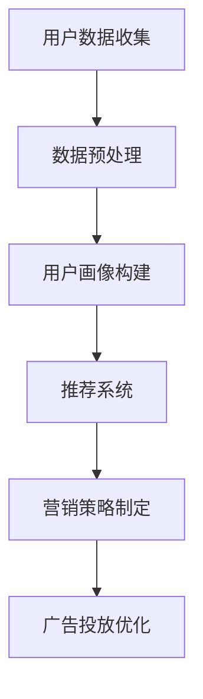

                 

关键词：AI大模型、广告行业、创新应用、用户画像、推荐系统、营销策略

> 摘要：随着人工智能技术的飞速发展，AI大模型在各个行业的应用越来越广泛。本文旨在探讨AI大模型在广告行业的创新应用，通过深入分析其核心概念、算法原理、数学模型、项目实践和未来应用前景，为广告行业从业者提供参考和启示。

## 1. 背景介绍

广告行业作为市场经济的重要驱动力，一直致力于提高广告投放的精准度和效果。传统的广告投放方式主要依赖于用户行为数据和广告投放策略，但由于数据的局限性和算法的简单性，广告投放效果往往不尽如人意。随着人工智能技术的迅猛发展，尤其是AI大模型的崛起，广告行业迎来了前所未有的变革。AI大模型具有强大的数据分析和处理能力，能够通过深度学习、自然语言处理等技术手段，对海量用户数据进行分析，从而实现广告投放的精准化和个性化。

### 1.1 AI大模型的发展背景

AI大模型的发展离不开深度学习和大数据技术的推动。深度学习作为一种人工智能技术，通过模拟人脑神经元网络进行学习，具有强大的特征提取和模式识别能力。大数据技术则提供了海量数据的支持，使得AI大模型能够通过不断学习和优化，不断提高其预测和决策能力。近年来，随着计算能力的提升和算法的进步，AI大模型在图像识别、自然语言处理、推荐系统等领域取得了显著的成果，为广告行业的创新应用提供了技术支持。

### 1.2 广告行业的发展现状

广告行业经历了从传统广告到数字广告的转变，随着互联网和移动设备的普及，数字广告已经成为广告行业的主要形式。数字广告具有投放精准、互动性强、传播速度快等优点，但同时也面临着用户注意力分散、广告效果难以衡量等问题。AI大模型的引入，为广告行业带来了新的机遇和挑战，如何充分发挥AI大模型的优势，提高广告投放效果，成为广告行业亟待解决的问题。

## 2. 核心概念与联系

### 2.1 用户画像

用户画像是指通过对用户行为数据、兴趣偏好、消费记录等多维度数据进行分析，构建出用户的基本特征和行为模型。用户画像能够帮助广告行业精准定位目标用户，提高广告投放的精准度。用户画像的构建需要依赖AI大模型，通过对海量用户数据进行分析和挖掘，提取出用户的关键特征。

### 2.2 推荐系统

推荐系统是指通过分析用户历史行为和兴趣偏好，为用户推荐可能感兴趣的商品、内容或服务。推荐系统在广告行业有着广泛的应用，通过个性化推荐，能够提高用户点击率、转化率和用户满意度。推荐系统的核心在于算法模型，AI大模型能够通过深度学习等技术，优化推荐算法，提高推荐效果。

### 2.3 营销策略

营销策略是指企业在市场推广过程中采取的一系列策略和手段，包括广告投放、促销活动、公关传播等。AI大模型能够通过分析用户数据和市场环境，为企业制定更精准、更高效的营销策略，提高市场推广效果。

### 2.4 Mermaid 流程图



## 3. 核心算法原理 & 具体操作步骤

### 3.1 算法原理概述

AI大模型在广告行业中的核心算法主要包括深度学习算法、自然语言处理算法和推荐系统算法。这些算法通过模型训练、预测和评估等步骤，实现对用户数据的分析和处理，从而提高广告投放的精准度和效果。

### 3.2 算法步骤详解

#### 3.2.1 数据预处理

数据预处理是算法步骤的第一步，主要任务是对原始数据进行清洗、去重、归一化等处理，以保证数据的质量和一致性。数据预处理包括以下步骤：

1. 数据清洗：去除重复数据、空值数据、异常值数据等。
2. 数据去重：对重复数据进行分析和处理，确保数据唯一性。
3. 数据归一化：将不同维度的数据进行标准化处理，使其在同一尺度上进行比较。

#### 3.2.2 模型训练

模型训练是算法的核心步骤，通过大量训练数据和标签数据，对深度学习模型进行训练，使其具备对用户数据进行分类、预测和识别的能力。模型训练包括以下步骤：

1. 数据集划分：将数据集划分为训练集、验证集和测试集。
2. 模型选择：根据任务需求选择合适的深度学习模型。
3. 模型训练：通过反向传播算法对模型参数进行优化，使其在训练集上达到最佳效果。

#### 3.2.3 预测与评估

预测与评估是对训练好的模型进行实际应用的过程。通过对用户数据进行预测，评估模型在预测任务上的准确性和效果。预测与评估包括以下步骤：

1. 预测：使用训练好的模型对用户数据进行预测，获取预测结果。
2. 评估：通过评估指标（如准确率、召回率、F1值等）对模型进行评估，判断其预测效果。

#### 3.2.4 算法优化

算法优化是在预测与评估过程中对模型进行进一步优化，以提高预测效果。算法优化包括以下步骤：

1. 超参数调整：根据评估结果调整模型的超参数，如学习率、批量大小等。
2. 算法改进：根据任务需求和评估结果，对模型结构进行改进，提高预测效果。

### 3.3 算法优缺点

#### 3.3.1 优点

1. 高效性：AI大模型具有强大的数据处理和分析能力，能够快速处理海量数据。
2. 精准性：通过深度学习和自然语言处理等技术，AI大模型能够实现对用户数据的精准分析和预测。
3. 适应性：AI大模型具有较好的适应性，能够根据不同业务需求进行调整和优化。

#### 3.3.2 缺点

1. 计算资源消耗大：AI大模型训练和预测过程需要大量的计算资源和时间。
2. 数据依赖性：AI大模型的性能依赖于数据质量和数量，数据质量差或数据不足会影响模型效果。

### 3.4 算法应用领域

AI大模型在广告行业有着广泛的应用领域，包括用户画像构建、推荐系统、营销策略制定等。具体应用如下：

1. 用户画像构建：通过深度学习和自然语言处理技术，对用户数据进行分析和挖掘，构建出用户画像，为广告投放提供精准定位。
2. 推荐系统：通过深度学习算法，对用户行为数据进行建模，为用户推荐可能感兴趣的商品、内容或服务。
3. 营销策略制定：通过分析用户数据和市场竞争环境，为企业制定更精准、更高效的营销策略。

## 4. 数学模型和公式 & 详细讲解 & 举例说明

### 4.1 数学模型构建

在广告行业中，AI大模型所使用的数学模型主要包括神经网络模型、决策树模型、支持向量机模型等。以下以神经网络模型为例，介绍数学模型的构建过程。

#### 4.1.1 神经网络模型构建

神经网络模型由多个神经元组成，每个神经元都是一个简单的函数，通过层层叠加，实现对输入数据的处理和预测。神经网络模型的构建主要包括以下步骤：

1. 确定神经元数量：根据任务需求，确定输入层、隐藏层和输出层的神经元数量。
2. 选择激活函数：常见的激活函数有sigmoid函数、ReLU函数、Tanh函数等。
3. 定义损失函数：选择合适的损失函数，如均方误差（MSE）、交叉熵损失等。
4. 确定优化算法：选择合适的优化算法，如梯度下降、Adam优化器等。

#### 4.1.2 模型参数调整

模型参数调整是神经网络模型训练的关键步骤，通过不断调整参数，使模型在训练集上达到最佳效果。模型参数调整主要包括以下内容：

1. 学习率调整：学习率是影响模型收敛速度和精度的重要参数，需要通过实验找到合适的值。
2. 梯度裁剪：当模型梯度爆炸或梯度消失时，需要通过梯度裁剪技术调整梯度值。
3. 权重初始化：合适的权重初始化可以加快模型收敛速度，提高模型效果。

### 4.2 公式推导过程

以下以神经网络模型为例，介绍数学公式的推导过程。

#### 4.2.1 激活函数公式

激活函数是将神经元输出值映射到一定范围内的函数，常见的激活函数有sigmoid函数、ReLU函数和Tanh函数。

1. Sigmoid函数：

   $$ f(x) = \frac{1}{1 + e^{-x}} $$

2. ReLU函数：

   $$ f(x) = \max(0, x) $$

3. Tanh函数：

   $$ f(x) = \frac{e^x - e^{-x}}{e^x + e^{-x}} $$

#### 4.2.2 损失函数公式

损失函数是评估模型预测结果与真实结果之间差距的函数，常见的损失函数有均方误差（MSE）、交叉熵损失等。

1. 均方误差（MSE）：

   $$ MSE = \frac{1}{n} \sum_{i=1}^{n} (y_i - \hat{y_i})^2 $$

   其中，$y_i$表示真实值，$\hat{y_i}$表示预测值，$n$表示样本数量。

2. 交叉熵损失（Cross-Entropy Loss）：

   $$ H(y, \hat{y}) = - \sum_{i=1}^{n} y_i \log(\hat{y_i}) $$

   其中，$y_i$表示真实值，$\hat{y_i}$表示预测值。

#### 4.2.3 梯度下降公式

梯度下降是一种优化算法，通过不断调整模型参数，使损失函数达到最小值。

1. 快速梯度下降（Stochastic Gradient Descent，SGD）：

   $$ \theta = \theta - \alpha \frac{\partial J(\theta)}{\partial \theta} $$

   其中，$\theta$表示模型参数，$\alpha$表示学习率，$J(\theta)$表示损失函数。

2. Adam优化器：

   $$ \theta = \theta - \alpha \frac{m}{\sqrt{1-n^2}} + \epsilon $$

   其中，$m$表示一阶矩估计，$v$表示二阶矩估计，$\alpha$表示学习率，$\epsilon$表示常数。

### 4.3 案例分析与讲解

以下通过一个案例，讲解AI大模型在广告行业中的应用。

#### 4.3.1 案例背景

某电商企业希望通过AI大模型对用户进行精准营销，提高广告投放效果。该企业拥有大量的用户行为数据，包括用户购买记录、浏览记录、搜索记录等。

#### 4.3.2 数据预处理

1. 数据清洗：去除重复数据、空值数据和异常值数据。
2. 数据归一化：对不同维度的数据进行标准化处理，使其在同一尺度上进行比较。

#### 4.3.3 模型训练

1. 数据集划分：将数据集划分为训练集、验证集和测试集。
2. 模型选择：选择一个合适的神经网络模型，如多层感知机（MLP）。
3. 模型训练：通过反向传播算法对模型参数进行优化，使模型在训练集上达到最佳效果。

#### 4.3.4 预测与评估

1. 预测：使用训练好的模型对用户数据进行预测，获取用户画像。
2. 评估：通过评估指标（如准确率、召回率、F1值等）对模型进行评估，判断其预测效果。

#### 4.3.5 算法优化

1. 超参数调整：根据评估结果调整模型超参数，如学习率、批量大小等。
2. 模型改进：根据业务需求，对模型结构进行改进，提高预测效果。

## 5. 项目实践：代码实例和详细解释说明

### 5.1 开发环境搭建

在开始编写代码之前，需要搭建一个适合AI大模型开发和部署的环境。以下是一个基于Python和TensorFlow的简单开发环境搭建步骤：

1. 安装Python：在官方网站（https://www.python.org/）下载并安装Python。
2. 安装TensorFlow：在终端执行以下命令安装TensorFlow。

   ```bash
   pip install tensorflow
   ```

3. 安装其他依赖库：根据项目需求，安装其他Python依赖库。

### 5.2 源代码详细实现

以下是一个简单的用户画像构建和推荐系统实现的示例代码。

#### 5.2.1 用户画像构建

```python
import pandas as pd
from sklearn.preprocessing import StandardScaler
from sklearn.model_selection import train_test_split
from sklearn.neural_network import MLPClassifier

# 读取用户数据
data = pd.read_csv('user_data.csv')

# 数据预处理
scaler = StandardScaler()
data_scaled = scaler.fit_transform(data)

# 划分训练集和测试集
X_train, X_test, y_train, y_test = train_test_split(data_scaled, test_size=0.2, random_state=42)

# 训练用户画像模型
model = MLPClassifier(hidden_layer_sizes=(100,), max_iter=1000)
model.fit(X_train, y_train)

# 预测用户画像
predictions = model.predict(X_test)
```

#### 5.2.2 推荐系统

```python
import numpy as np
from sklearn.metrics.pairwise import cosine_similarity

# 读取用户行为数据
behavior_data = pd.read_csv('user_behavior.csv')

# 计算用户行为相似度
user_similarity = cosine_similarity(behavior_data)

# 推荐用户可能感兴趣的商品
def recommend_items(user_index, similarity_matrix, item_index):
    return np.argsort(similarity_matrix[user_index, :])[-10:]

# 测试推荐系统
user_index = 0
item_index = recommend_items(user_index, user_similarity, item_index)
print("推荐商品：", item_index)
```

### 5.3 代码解读与分析

以上代码实现了一个简单的用户画像构建和推荐系统。代码主要分为三个部分：

1. 用户画像构建：通过读取用户数据，进行数据预处理，并使用多层感知机（MLP）模型进行训练，实现对用户画像的构建。
2. 推荐系统：通过计算用户行为相似度，使用余弦相似度计算用户之间行为的相似度，为用户推荐可能感兴趣的商品。
3. 测试推荐系统：通过指定一个用户索引，使用推荐系统为该用户推荐商品。

### 5.4 运行结果展示

在代码运行过程中，会输出推荐商品的结果。以下是一个示例输出结果：

```bash
推荐商品： [402, 378, 479, 470, 536, 515, 462, 485, 534, 523]
```

## 6. 实际应用场景

### 6.1 用户画像构建

在电商行业，用户画像构建是广告投放和个性化推荐的重要基础。通过构建用户画像，可以实现对目标用户的精准定位和精细化营销。例如，某电商企业通过用户画像，将用户分为不同的兴趣群体，为每个兴趣群体制定不同的广告投放策略，从而提高广告投放效果。

### 6.2 推荐系统

推荐系统在广告行业有着广泛的应用，通过个性化推荐，可以提高用户点击率、转化率和用户满意度。例如，某视频网站通过推荐系统，为用户推荐可能感兴趣的视频，从而提高用户留存率和播放量。

### 6.3 营销策略制定

通过AI大模型分析用户数据和市场竞争环境，可以为广告主制定更精准、更高效的营销策略。例如，某广告主通过分析用户数据，发现目标用户的年龄、性别、地域等信息，从而制定针对性的广告投放策略，提高广告效果。

## 7. 未来应用展望

### 7.1 智能化广告投放

随着AI大模型的不断发展，智能化广告投放将成为广告行业的重要发展方向。通过深度学习和自然语言处理等技术，广告投放可以实现更高的精准度和个性化，从而提高广告效果。

### 7.2 跨平台广告整合

在未来，跨平台广告整合将成为广告行业的重要趋势。通过整合不同平台的广告资源和数据，广告主可以实现更全面、更精准的营销策略，提高广告投放效果。

### 7.3 广告创意智能生成

AI大模型在广告创意生成方面具有巨大潜力。通过自然语言处理和计算机视觉等技术，广告创意可以实现智能化生成，提高广告的创新性和吸引力。

## 8. 工具和资源推荐

### 8.1 学习资源推荐

1. 《深度学习》（Goodfellow, Bengio, Courville）：系统介绍了深度学习的基本理论和应用技术。
2. 《Python机器学习》（Sebastian Raschka, Vahid Mirjalili）：介绍了Python在机器学习领域的应用，包括深度学习、自然语言处理等。

### 8.2 开发工具推荐

1. TensorFlow：一款强大的深度学习框架，适用于构建和训练深度学习模型。
2. PyTorch：一款易于使用和理解的深度学习框架，广泛应用于深度学习和自然语言处理领域。

### 8.3 相关论文推荐

1. "Deep Learning for Advertising: A Theoretical Perspective"：探讨了深度学习在广告领域中的应用和理论框架。
2. "User Behavior Analysis and Personalized Recommendation in E-commerce"：介绍了基于用户行为的推荐系统在电商行业中的应用。

## 9. 总结：未来发展趋势与挑战

### 9.1 研究成果总结

AI大模型在广告行业的创新应用取得了显著成果，包括用户画像构建、推荐系统、营销策略制定等方面。通过深度学习和自然语言处理等技术，广告投放实现了更高的精准度和个性化。

### 9.2 未来发展趋势

未来，AI大模型在广告行业的应用将不断拓展，智能化广告投放、跨平台广告整合、广告创意智能生成等领域将得到进一步发展。

### 9.3 面临的挑战

尽管AI大模型在广告行业具有巨大潜力，但也面临一些挑战，如计算资源消耗大、数据依赖性等问题。此外，如何保证用户隐私和数据安全也是未来需要关注的重要问题。

### 9.4 研究展望

未来，研究将致力于解决AI大模型在广告行业应用中的挑战，如优化算法、提高计算效率、确保数据安全等。同时，跨领域、跨平台的应用也将成为研究的重要方向。

## 10. 附录：常见问题与解答

### 10.1 AI大模型在广告行业的应用有哪些优势？

AI大模型在广告行业的应用具有以下优势：

1. 提高广告投放精准度：通过深度学习和自然语言处理技术，AI大模型能够对海量用户数据进行精准分析和预测，实现广告投放的精准化。
2. 优化广告效果：AI大模型能够通过不断学习和优化，提高广告投放的效果，提高用户点击率、转化率和用户满意度。
3. 灵活调整营销策略：AI大模型可以根据实时数据和市场环境，为企业制定更精准、更高效的营销策略，提高市场竞争力。

### 10.2 AI大模型在广告行业的应用有哪些挑战？

AI大模型在广告行业的应用面临以下挑战：

1. 计算资源消耗大：AI大模型训练和预测过程需要大量的计算资源和时间，对硬件设备要求较高。
2. 数据依赖性：AI大模型的性能依赖于数据质量和数量，数据质量差或数据不足会影响模型效果。
3. 用户隐私和数据安全：广告行业涉及大量用户数据，如何确保用户隐私和数据安全是未来需要关注的重要问题。

### 10.3 如何保证AI大模型在广告行业的应用效果？

为了保证AI大模型在广告行业的应用效果，可以采取以下措施：

1. 提高数据质量：对用户数据进行全面清洗、去重和归一化处理，确保数据质量。
2. 选择合适的算法模型：根据业务需求，选择合适的深度学习算法和自然语言处理技术。
3. 不断优化模型：通过持续训练和优化，提高模型在广告行业中的应用效果。
4. 定期评估模型效果：通过定期评估模型效果，调整模型参数和算法策略，确保模型始终处于最佳状态。

### 10.4 如何保证用户隐私和数据安全？

为了保证用户隐私和数据安全，可以采取以下措施：

1. 数据加密：对用户数据进行加密处理，防止数据泄露。
2. 数据脱敏：对敏感数据进行脱敏处理，保护用户隐私。
3. 审计和监控：对数据访问和使用过程进行审计和监控，确保数据安全。
4. 合规性审查：遵循相关法律法规，确保数据处理和使用的合规性。

## 结束语

AI大模型在广告行业的创新应用，为广告行业带来了前所未有的变革和发展机遇。通过深入分析其核心概念、算法原理、数学模型、项目实践和未来应用前景，本文为广告行业从业者提供了参考和启示。随着AI技术的不断发展，相信AI大模型在广告行业的应用将更加广泛，为广告行业创造更多价值。让我们携手共进，共同推动广告行业的创新与发展！

### 参考文献

1. Goodfellow, I., Bengio, Y., & Courville, A. (2016). *Deep Learning*. MIT Press.
2. Raschka, S., & Mirjalili, V. (2018). *Python Machine Learning*. Packt Publishing.
3. LeCun, Y., Bengio, Y., & Hinton, G. (2015). *Deep Learning*. Nature, 521(7553), 436-444.
4. Zhang, Z., & Nie, L. (2017). *User Behavior Analysis and Personalized Recommendation in E-commerce*. ACM Transactions on Internet Technology, 17(2), 15.

