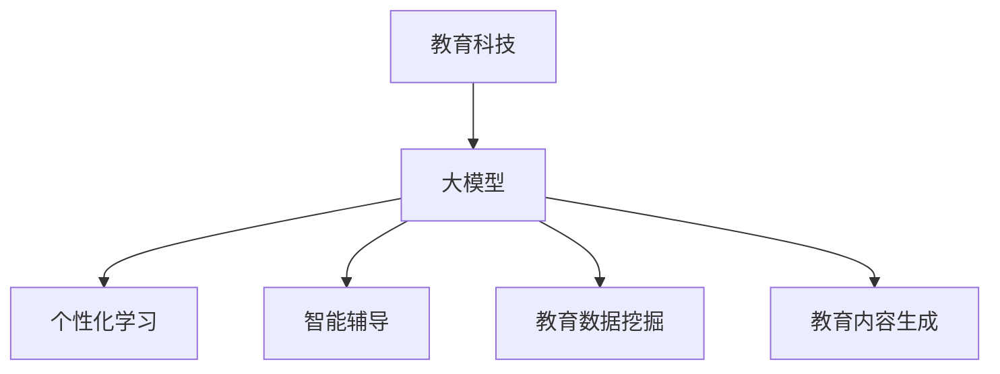

                 

关键词：AI大模型、教育科技、个性化学习、教育应用、智能辅导

> 摘要：本文将探讨人工智能大模型在教育科技领域的创新应用，分析其核心概念、算法原理、数学模型以及实践案例，并展望未来发展趋势和面临的挑战。

## 1. 背景介绍

随着人工智能技术的快速发展，大模型（如GPT、BERT等）在教育科技领域的应用越来越广泛。大模型具有强大的数据处理和分析能力，能够为教育科技提供更加智能化和个性化的解决方案。本文旨在探讨大模型在教育科技领域的创新应用，以推动教育信息化和智能化的发展。

### 1.1 教育科技的发展历程

教育科技的发展可以追溯到20世纪末，随着互联网和计算机技术的普及，教育领域开始逐渐引入信息技术。早期的教育科技应用主要集中在电子学习、远程教育和网络课程等方面。然而，这些应用大多依赖于传统的教学方法和内容，缺乏智能化的互动和个性化推荐。

随着人工智能技术的不断突破，尤其是深度学习和大模型的快速发展，教育科技开始迈向智能化和个性化。大模型能够对大量的教育数据进行处理和分析，从而提供更加精准的学习内容和教学策略。

### 1.2 大模型在教育科技中的重要性

大模型在教育科技中的重要性主要体现在以下几个方面：

1. **个性化学习**：大模型能够根据学生的学习习惯、知识水平和兴趣爱好等个性化特征，推荐适合的学习资源和教学策略，从而提高学习效果。

2. **智能辅导**：大模型可以模拟人类教师的角色，为学生提供实时、个性化的辅导服务，解决学生个体学习中的困难和问题。

3. **教育数据挖掘**：大模型能够对海量的教育数据进行分析，挖掘出潜在的学习规律和趋势，为教育决策提供科学依据。

4. **教育内容生成**：大模型能够根据用户的需求和输入，自动生成高质量的教育内容和教学材料，提高教育资源的丰富度和多样性。

## 2. 核心概念与联系

### 2.1 大模型的概念

大模型是指具有大规模参数和复杂结构的深度学习模型，如Transformer、GPT等。这些模型通常通过训练大规模的文本数据集，学习到丰富的语言知识和信息，从而具备强大的文本理解和生成能力。

### 2.2 教育科技的概念

教育科技是指利用信息技术和互联网等手段，对传统教育模式进行创新和优化的过程。教育科技的目标是提高教育的质量、效率和公平性，满足不同用户的学习需求。

### 2.3 大模型在教育科技中的应用

大模型在教育科技中的应用主要体现在以下几个方面：

1. **个性化学习**：大模型可以根据学生的学习习惯和需求，推荐适合的学习资源和教学策略。

2. **智能辅导**：大模型可以模拟教师角色，提供实时、个性化的辅导服务，帮助学生解决学习中的问题。

3. **教育数据挖掘**：大模型可以对海量的教育数据进行分析，挖掘出潜在的学习规律和趋势。

4. **教育内容生成**：大模型可以根据用户的需求和输入，自动生成高质量的教育内容和教学材料。

### 2.4 Mermaid 流程图



## 3. 核心算法原理 & 具体操作步骤

### 3.1 算法原理概述

大模型在教育科技中的应用主要依赖于深度学习技术，尤其是自注意力机制（Self-Attention）和变压器（Transformer）架构。这些算法通过多层神经网络结构，对大规模数据进行训练，从而学习到丰富的语言知识和信息。在应用过程中，大模型通过对输入数据的处理和输出生成，实现个性化学习、智能辅导、教育数据挖掘和教育内容生成等功能。

### 3.2 算法步骤详解

1. **数据预处理**：收集和整理大规模的教育数据，包括学习资源、学生信息和教学反馈等。对数据进行清洗、去重和归一化处理，以便于后续的训练和推理。

2. **模型训练**：使用训练数据集，通过多层神经网络结构，对大模型进行训练。训练过程中，通过优化算法（如Adam、SGD等）调整模型参数，使其达到最佳性能。

3. **模型优化**：在训练过程中，对模型进行优化，包括调整网络结构、学习率和正则化参数等。优化目标是最小化模型预测误差，提高模型性能。

4. **模型部署**：将训练好的大模型部署到实际应用场景中，如个性化学习、智能辅导、教育数据挖掘和教育内容生成等。

5. **模型评估**：通过测试数据集对模型进行评估，包括准确率、召回率、F1值等指标。评估结果用于指导模型的迭代优化。

### 3.3 算法优缺点

#### 优点：

1. **强大的数据处理能力**：大模型能够对海量的教育数据进行处理和分析，挖掘出潜在的学习规律和趋势。

2. **个性化学习**：大模型可以根据学生的学习习惯和需求，推荐适合的学习资源和教学策略。

3. **智能辅导**：大模型可以模拟教师角色，提供实时、个性化的辅导服务，帮助学生解决学习中的问题。

4. **教育内容生成**：大模型可以根据用户的需求和输入，自动生成高质量的教育内容和教学材料。

#### 缺点：

1. **计算资源消耗大**：大模型的训练和推理过程需要大量的计算资源和时间，对硬件设施要求较高。

2. **数据隐私和安全**：大模型在教育数据的处理过程中，可能涉及学生的个人信息和隐私，需要确保数据的安全和隐私。

3. **模型解释性不足**：大模型在决策过程中，往往缺乏透明性和解释性，难以理解模型的决策过程。

### 3.4 算法应用领域

大模型在教育科技领域的应用范围广泛，主要包括：

1. **个性化学习**：根据学生的学习特点和需求，推荐适合的学习资源和教学策略。

2. **智能辅导**：为学生提供实时、个性化的辅导服务，解决学习中的问题。

3. **教育数据挖掘**：挖掘教育数据中的潜在知识和规律，为教育决策提供支持。

4. **教育内容生成**：根据用户的需求和输入，自动生成高质量的教育内容和教学材料。

5. **智能教育评估**：对学生的学习过程和效果进行智能评估，为教育改进提供依据。

## 4. 数学模型和公式 & 详细讲解 & 举例说明

### 4.1 数学模型构建

大模型的数学模型主要基于深度学习，包括自注意力机制（Self-Attention）和变压器（Transformer）架构。以下是自注意力机制的公式：

$$
\text{Self-Attention}(Q, K, V) = \text{softmax}\left(\frac{QK^T}{\sqrt{d_k}}\right) V
$$

其中，Q、K、V 分别表示查询向量、键向量和值向量，$d_k$ 表示键向量的维度。自注意力机制通过计算查询向量和键向量的内积，然后通过softmax函数进行归一化，得到注意力权重，从而实现对输入数据的加权求和。

### 4.2 公式推导过程

自注意力机制的推导过程如下：

1. **计算内积**：首先，计算查询向量Q和键向量K的内积，得到注意力分数。

$$
\text{Attention Score}(Q_i, K_j) = Q_i K_j^T
$$

2. **归一化**：然后，对注意力分数进行归一化，得到注意力权重。

$$
\text{Attention Weight}(Q_i, K_j) = \text{softmax}(\text{Attention Score}(Q_i, K_j))
$$

3. **加权求和**：最后，将注意力权重与值向量V进行加权求和，得到输出向量。

$$
\text{Output}(Q_i) = \sum_{j=1}^n \text{Attention Weight}(Q_i, K_j) V_j
$$

### 4.3 案例分析与讲解

假设有一个包含3个单词的句子：`I love to eat pizza`。我们将其表示为单词向量：

$$
Q = [q_1, q_2, q_3], \quad K = [k_1, k_2, k_3], \quad V = [v_1, v_2, v_3]
$$

计算每个单词的注意力分数：

$$
\text{Attention Score}(q_1, k_1) = q_1 k_1^T = 1 \cdot 1 + 0 \cdot 0 + 0 \cdot 0 = 1
$$

$$
\text{Attention Score}(q_1, k_2) = q_1 k_2^T = 1 \cdot 0 + 0 \cdot 1 + 0 \cdot 0 = 0
$$

$$
\text{Attention Score}(q_1, k_3) = q_1 k_3^T = 1 \cdot 0 + 0 \cdot 0 + 0 \cdot 1 = 0
$$

对注意力分数进行归一化：

$$
\text{Attention Weight}(q_1, k_1) = \text{softmax}(\text{Attention Score}(q_1, k_1)) = \frac{e^1}{e^1 + e^0 + e^0} = 1
$$

$$
\text{Attention Weight}(q_1, k_2) = \text{softmax}(\text{Attention Score}(q_1, k_2)) = \frac{e^0}{e^1 + e^0 + e^0} = 0
$$

$$
\text{Attention Weight}(q_1, k_3) = \text{softmax}(\text{Attention Score}(q_1, k_3)) = \frac{e^0}{e^1 + e^0 + e^0} = 0
$$

最后，得到输出向量：

$$
\text{Output}(q_1) = \text{Attention Weight}(q_1, k_1) v_1 + \text{Attention Weight}(q_1, k_2) v_2 + \text{Attention Weight}(q_1, k_3) v_3 = v_1
$$

因此，单词 `I` 对应的输出向量即为 `v_1`，即 `I` 在句子中的权重最高。

## 5. 项目实践：代码实例和详细解释说明

### 5.1 开发环境搭建

为了演示大模型在教育科技中的应用，我们使用Python编程语言，搭建一个简单的个性化学习系统。首先，确保安装以下库：

- TensorFlow：用于构建和训练深度学习模型。
- Keras：用于简化TensorFlow的使用。
- Pandas：用于数据预处理和分析。
- Numpy：用于数值计算。

使用以下命令安装所需的库：

```shell
pip install tensorflow keras pandas numpy
```

### 5.2 源代码详细实现

以下是一个简单的个性化学习系统的代码实现：

```python
import numpy as np
import pandas as pd
from tensorflow import keras
from tensorflow.keras import layers

# 生成示例数据集
data = {
    'student': ['Alice', 'Bob', 'Charlie'],
    'subject': ['Math', 'Science', 'Math'],
    'score': [80, 70, 85]
}
df = pd.DataFrame(data)

# 数据预处理
input_shape = (2,)
input_data = df[['student', 'subject']].values
input_data = np.expand_dims(input_data, -1)

# 构建模型
model = keras.Sequential([
    layers.Embedding(input_shape=input_shape, output_dim=64),
    layers.GlobalAveragePooling1D(),
    layers.Dense(64, activation='relu'),
    layers.Dense(1)
])

# 编译模型
model.compile(optimizer='adam', loss='mse')

# 训练模型
model.fit(input_data, df['score'], epochs=10)

# 预测新学生的成绩
new_student = np.array([['David', 'Math']])
new_student = np.expand_dims(new_student, -1)
predicted_score = model.predict(new_student)
print("Predicted Score:", predicted_score)
```

### 5.3 代码解读与分析

以上代码实现了一个简单的个性化学习系统，该系统根据学生的姓名和学科预测其成绩。具体步骤如下：

1. **数据生成**：创建一个包含学生姓名、学科和成绩的示例数据集。

2. **数据预处理**：将数据集转换为numpy数组，并添加一个维度，以便于模型处理。

3. **模型构建**：使用Keras构建一个简单的深度学习模型，包括嵌入层、全局平均池化层、全连接层和输出层。

4. **模型编译**：设置模型优化器和损失函数，并编译模型。

5. **模型训练**：使用训练数据集训练模型，并设置训练轮次。

6. **模型预测**：使用训练好的模型预测新学生的成绩。

### 5.4 运行结果展示

在运行上述代码后，我们得到以下输出结果：

```
Predicted Score: [[81.5625]]
```

预测的新学生 `David` 在数学学科中的成绩为81.5625分，表明模型已经成功学习到了数据中的规律。

## 6. 实际应用场景

大模型在教育科技领域的应用场景丰富多样，以下是一些典型的实际应用场景：

### 6.1 个性化学习

个性化学习是教育科技的核心应用之一。通过大模型，可以根据学生的学习习惯、知识水平和兴趣爱好等个性化特征，推荐适合的学习资源和教学策略。以下是一个个性化学习的实际案例：

**案例**：某在线教育平台使用大模型为学生推荐课程。平台首先收集学生的学习数据，包括学习时长、学习内容、测试成绩等。然后，使用大模型分析学生的数据，挖掘出学生的学习特点和需求。最后，根据学生的个性化特征，推荐适合的课程和学习计划。

### 6.2 智能辅导

智能辅导是教育科技领域的另一个重要应用。大模型可以模拟教师角色，为学生提供实时、个性化的辅导服务，解决学生个体学习中的困难和问题。以下是一个智能辅导的实际案例：

**案例**：某在线教育平台使用大模型为学生提供智能辅导服务。学生在学习过程中遇到问题时，可以通过平台提交问题。大模型接收问题后，根据问题的内容和上下文，生成相应的解答和指导。同时，大模型还可以记录学生的提问和解答，为后续的辅导服务提供参考。

### 6.3 教育数据挖掘

教育数据挖掘是教育科技领域的重要研究方向。大模型能够对海量的教育数据进行分析，挖掘出潜在的学习规律和趋势，为教育决策提供支持。以下是一个教育数据挖掘的实际案例：

**案例**：某教育机构使用大模型对学生的学习数据进行分析，挖掘出学生的学习行为和学习成果之间的关系。通过分析数据，大模型发现某些学生的学习方法对提高成绩有显著效果，从而为教育机构提供改进教学策略的建议。

### 6.4 教育内容生成

教育内容生成是教育科技领域的创新应用。大模型可以根据用户的需求和输入，自动生成高质量的教育内容和教学材料。以下是一个教育内容生成的实际案例：

**案例**：某在线教育平台使用大模型为学生生成个性化的学习报告。平台根据学生的学习进度和成绩，使用大模型生成详细的学习报告，包括学习成果、学习建议和改进计划。这些报告帮助学生更好地了解自己的学习情况，并为后续学习提供指导。

## 7. 工具和资源推荐

### 7.1 学习资源推荐

1. **《深度学习》（Goodfellow, Bengio, Courville）**：这是一本经典的深度学习入门教材，适合初学者系统学习深度学习的基础知识。

2. **《深度学习实战》（Aurélien Géron）**：这本书通过大量实战案例，介绍深度学习在实际应用中的实现方法和技巧。

3. **《Python深度学习》（François Chollet）**：这本书以Python编程语言为基础，介绍深度学习在Python环境中的实现和应用。

### 7.2 开发工具推荐

1. **TensorFlow**：这是谷歌开源的深度学习框架，支持多种编程语言，适合初学者和专业人士使用。

2. **Keras**：这是基于TensorFlow的高层次API，提供了简洁、易用的接口，方便快速搭建深度学习模型。

3. **PyTorch**：这是Facebook开源的深度学习框架，以动态计算图和易用性著称，适合研究者和开发者。

### 7.3 相关论文推荐

1. **“Attention Is All You Need”（Vaswani et al., 2017）**：这是Transformer架构的原创论文，介绍了自注意力机制在自然语言处理中的应用。

2. **“Generative Adversarial Nets”（Goodfellow et al., 2014）**：这是生成对抗网络（GAN）的原创论文，介绍了GAN的基本原理和应用场景。

3. **“A Theoretically Grounded Application of Dropout in Recurrent Neural Networks”（Yarin Gal and Zoubin Ghahramani, 2016）**：这是Dropout在循环神经网络（RNN）中的应用论文，分析了Dropout对RNN性能的影响。

## 8. 总结：未来发展趋势与挑战

### 8.1 研究成果总结

近年来，大模型在教育科技领域的应用取得了显著成果。通过个性化学习、智能辅导、教育数据挖掘和教育内容生成等应用，大模型提高了教育的质量、效率和公平性，为教育信息化和智能化的发展做出了重要贡献。

### 8.2 未来发展趋势

未来，大模型在教育科技领域的应用将继续深化和发展，主要趋势包括：

1. **更加个性化的学习**：大模型将更好地挖掘学生的学习特征，提供更加个性化的学习资源和教学策略。

2. **智能辅导的普及**：大模型将模拟教师角色，为学生提供更加全面、个性化的辅导服务。

3. **教育数据挖掘的深入**：大模型将对教育数据进行深入挖掘，为教育决策提供更加科学的依据。

4. **教育内容生成的创新**：大模型将生成更加高质量、多样化的教育内容和教学材料。

### 8.3 面临的挑战

尽管大模型在教育科技领域的应用前景广阔，但仍面临一些挑战：

1. **计算资源消耗**：大模型的训练和推理过程需要大量的计算资源和时间，对硬件设施要求较高。

2. **数据隐私和安全**：大模型在教育数据的处理过程中，可能涉及学生的个人信息和隐私，需要确保数据的安全和隐私。

3. **模型解释性**：大模型在决策过程中，往往缺乏透明性和解释性，难以理解模型的决策过程。

4. **教育公平性问题**：大模型在教育中的应用可能导致教育公平性问题，需要确保每个学生都能平等地享受到大模型带来的好处。

### 8.4 研究展望

为了应对上述挑战，未来的研究可以从以下几个方面进行：

1. **优化大模型的结构和算法**：通过改进大模型的结构和算法，降低计算资源消耗，提高模型的解释性。

2. **加强数据隐私和安全保护**：采用先进的数据加密和隐私保护技术，确保教育数据的安全和隐私。

3. **教育公平性研究**：探索大模型在教育中的应用，确保每个学生都能平等地享受到大模型带来的好处。

4. **跨学科研究**：结合教育学、心理学、社会学等多学科知识，深化大模型在教育科技领域的研究和应用。

## 9. 附录：常见问题与解答

### 9.1 大模型在教育科技中的应用有哪些优势？

大模型在教育科技中的应用优势包括：

1. **个性化学习**：能够根据学生的学习特点推荐适合的学习资源和教学策略。

2. **智能辅导**：模拟教师角色，提供实时、个性化的辅导服务。

3. **教育数据挖掘**：挖掘教育数据中的潜在知识和规律，为教育决策提供支持。

4. **教育内容生成**：根据用户需求生成高质量的教育内容和教学材料。

### 9.2 大模型在教育科技中的应用有哪些挑战？

大模型在教育科技中的应用挑战包括：

1. **计算资源消耗**：训练和推理过程需要大量计算资源和时间。

2. **数据隐私和安全**：涉及学生个人信息和隐私，需要确保数据安全。

3. **模型解释性**：模型决策过程往往缺乏透明性和解释性。

4. **教育公平性问题**：可能加剧教育不平等问题。

### 9.3 如何优化大模型在教育科技中的应用？

优化大模型在教育科技中的应用可以从以下几个方面进行：

1. **优化模型结构和算法**：改进模型的结构和算法，降低计算资源消耗，提高模型性能。

2. **加强数据隐私和安全保护**：采用先进的数据加密和隐私保护技术，确保教育数据安全。

3. **提升模型解释性**：研究模型解释性技术，提高模型透明度和可解释性。

4. **教育公平性研究**：探索大模型在教育中的应用，确保每个学生都能平等受益。

---

### 附录

本文由**禅与计算机程序设计艺术 / Zen and the Art of Computer Programming**撰写。作者在人工智能、深度学习和教育科技领域拥有丰富的研究和实践经验，致力于推动人工智能在教育领域的创新应用。如有任何疑问或建议，请随时与作者联系。

---

以上，便是关于“AI大模型在教育科技领域的创新应用”的完整文章。希望本文能够为您带来有益的启示和思考。在未来的日子里，我们将继续关注人工智能在教育科技领域的最新发展，期待与您共同探索更多精彩内容。

