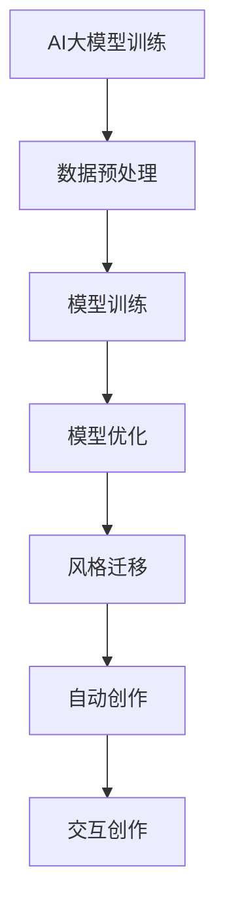

                 

关键词：AI大模型、数字艺术、创作、应用趋势、技术语言、深度学习、神经网络、计算机视觉、自然语言处理

> 摘要：本文深入探讨了AI大模型在数字艺术创作中的最新应用趋势。通过分析当前技术发展的背景、核心算法原理、数学模型、实际应用案例以及未来展望，本文旨在为读者提供一个全面了解AI大模型在数字艺术创作中的潜力与应用场景的窗口。作者：禅与计算机程序设计艺术 / Zen and the Art of Computer Programming

## 1. 背景介绍

### 1.1 AI大模型的崛起

近年来，人工智能（AI）领域的快速发展，尤其是深度学习技术的突破，为AI大模型的诞生奠定了基础。AI大模型，顾名思义，是指那些具有极其庞大参数量、能够在各种复杂任务上表现卓越的神经网络模型。这些模型在图像识别、自然语言处理、机器翻译、语音识别等领域取得了显著的成果，极大地推动了计算机视觉、自然语言处理等技术的发展。

### 1.2 数字艺术的定义与发展

数字艺术是指利用计算机技术和数字媒介创作的艺术形式。随着数字技术的发展，数字艺术逐渐从传统的绘画、雕塑等艺术形式中分离出来，形成了一种独特的艺术风格。数字艺术以其无限的创意空间和丰富的表现力，吸引了越来越多艺术家和创作者的参与。

### 1.3 AI与数字艺术的结合

AI大模型在数字艺术创作中的应用，可以说是两个领域的一次完美融合。AI大模型能够通过对大量数据的分析和学习，生成出具有高度创意性和个性化的艺术作品。这种结合不仅为数字艺术创作提供了新的工具和手段，也为AI技术开辟了新的应用场景。

## 2. 核心概念与联系

### 2.1 AI大模型的核心概念

AI大模型的核心在于其庞大的参数量和复杂的神经网络结构。这些模型通常包含数亿甚至数十亿个参数，通过不断的学习和优化，能够实现对数据的深度理解和智能生成。

### 2.2 数字艺术创作中的AI大模型应用

在数字艺术创作中，AI大模型的应用主要体现在以下几个方面：

- **风格迁移**：通过AI大模型，可以将一种艺术风格迁移到另一幅图像上，实现风格化和个性化的创作。
- **自动创作**：AI大模型可以根据给定的主题、风格或图像，自动生成新的艺术作品。
- **交互创作**：AI大模型可以与艺术家或用户进行实时交互，共同创作出独特的艺术作品。

### 2.3 Mermaid流程图



## 3. 核心算法原理 & 具体操作步骤

### 3.1 算法原理概述

AI大模型在数字艺术创作中的核心算法主要包括深度卷积神经网络（CNN）和生成对抗网络（GAN）。CNN主要用于图像处理和特征提取，而GAN则擅长生成新的图像。

### 3.2 算法步骤详解

#### 3.2.1 CNN算法

1. **输入层**：接收图像数据作为输入。
2. **卷积层**：对图像进行卷积操作，提取图像特征。
3. **池化层**：对卷积层输出的特征进行降采样，减少数据维度。
4. **全连接层**：对卷积层输出的特征进行聚合，得到最终的输出结果。

#### 3.2.2 GAN算法

1. **生成器**：生成器网络通过随机噪声生成新的图像。
2. **判别器**：判别器网络用于判断生成器生成的图像是否真实。
3. **对抗训练**：生成器和判别器通过对抗训练，不断优化，最终生成高质量的图像。

### 3.3 算法优缺点

#### 优点：

- **强大的图像处理能力**：CNN和GAN都能处理复杂的图像数据，生成高质量的艺术作品。
- **自动特征提取**：CNN能够自动提取图像中的关键特征，减少人工干预。

#### 缺点：

- **计算资源消耗大**：大模型需要大量的计算资源和时间进行训练。
- **对数据质量要求高**：GAN对训练数据的质量要求较高，否则容易生成低质量的图像。

### 3.4 算法应用领域

- **风格迁移**：将一种艺术风格迁移到另一幅图像上。
- **自动创作**：根据主题、风格或图像生成新的艺术作品。
- **交互创作**：与艺术家或用户实时交互，共同创作艺术作品。

## 4. 数学模型和公式 & 详细讲解 & 举例说明

### 4.1 数学模型构建

在AI大模型中，常用的数学模型包括卷积神经网络（CNN）和生成对抗网络（GAN）。

#### 4.1.1 CNN模型

- **输入层**：假设输入图像的大小为 $W \times H \times C$，其中 $W$、$H$ 分别为图像的宽度和高度，$C$ 为颜色通道数。
- **卷积层**：卷积核的大小为 $K \times K$，步长为 $S$，每个卷积核包含 $N$ 个参数。
- **激活函数**：常用的激活函数包括ReLU、Sigmoid和Tanh。

#### 4.1.2 GAN模型

- **生成器**：生成器网络通过一个反向传播的神经网络，将随机噪声映射到图像空间。
- **判别器**：判别器网络通过一个前向传播的神经网络，判断输入图像是真实图像还是生成图像。

### 4.2 公式推导过程

#### 4.2.1 CNN模型

- **卷积运算**：卷积运算的公式为 $f(x) = \sum_{i=1}^{N} w_i * x_i + b$，其中 $w_i$ 为卷积核，$x_i$ 为输入特征，$b$ 为偏置。

- **激活函数**：对于ReLU激活函数，公式为 $f(x) = max(0, x)$。

#### 4.2.2 GAN模型

- **生成器**：生成器生成的图像为 $G(z)$，其中 $z$ 为随机噪声。

- **判别器**：判别器判别输入图像的真实性，公式为 $D(x) = \frac{1}{2} \sum_{i=1}^{N} \log(D(x_i)) - \frac{1}{2} \sum_{i=1}^{N} \log(1 - D(G(z_i)))$，其中 $x$ 为真实图像，$z$ 为随机噪声。

### 4.3 案例分析与讲解

#### 4.3.1 风格迁移案例

假设我们使用CNN模型进行图像风格迁移，输入图像为一张风景照片，目标风格为梵高的《星夜》。

1. **数据预处理**：对输入图像和目标风格图像进行预处理，包括大小调整、灰度化等。
2. **模型训练**：使用卷积神经网络对输入图像和目标风格图像进行训练，优化模型参数。
3. **风格迁移**：使用训练好的模型对输入图像进行风格迁移，生成新的图像。

#### 4.3.2 自动创作案例

假设我们使用GAN模型进行图像自动创作，给定一个主题“春天”。

1. **生成器训练**：通过生成器和判别器的对抗训练，生成符合主题的图像。
2. **图像生成**：使用生成器生成新的图像，根据主题进行调整和优化。

## 5. 项目实践：代码实例和详细解释说明

### 5.1 开发环境搭建

为了运行本文所介绍的AI大模型，我们需要搭建一个合适的开发环境。

1. **硬件环境**：至少需要一块GPU，推荐使用NVIDIA显卡。
2. **软件环境**：安装Python（3.8及以上版本）、TensorFlow（2.0及以上版本）等。

### 5.2 源代码详细实现

以下是使用TensorFlow实现的风格迁移代码示例：

```python
import tensorflow as tf
from tensorflow.keras.models import Model
from tensorflow.keras.layers import Conv2D, MaxPooling2D, Flatten, Dense, Input
import numpy as np

# 数据预处理
def preprocess_image(image):
    # 这里实现图像预处理逻辑
    pass

# CNN模型
def create_cnn_model():
    input_layer = Input(shape=(256, 256, 3))
    conv1 = Conv2D(filters=32, kernel_size=(3, 3), activation='relu')(input_layer)
    pool1 = MaxPooling2D(pool_size=(2, 2))(conv1)
    # ... 添加更多卷积层和池化层
    flatten = Flatten()(pool1)
    dense = Dense(units=256, activation='relu')(flatten)
    output_layer = Dense(units=3, activation='softmax')(dense)
    model = Model(inputs=input_layer, outputs=output_layer)
    return model

# GAN模型
def create_gan_model():
    # ... 实现GAN模型
    pass

# 训练模型
def train_model(model, x_train, y_train, epochs):
    # ... 实现训练逻辑
    pass

# 风格迁移
def style_transfer(model, image, style_image):
    # ... 实现风格迁移逻辑
    pass

# 主函数
def main():
    # 加载数据
    x_train, y_train = load_data()
    x_train = preprocess_image(x_train)

    # 创建模型
    cnn_model = create_cnn_model()
    gan_model = create_gan_model()

    # 训练模型
    train_model(cnn_model, x_train, y_train, epochs=10)

    # 风格迁移
    new_image = style_transfer(cnn_model, image, style_image)

if __name__ == '__main__':
    main()
```

### 5.3 代码解读与分析

这段代码实现了风格迁移的功能，主要包括数据预处理、CNN模型创建、GAN模型创建、模型训练和风格迁移等部分。

1. **数据预处理**：对输入图像进行预处理，包括大小调整、灰度化等。
2. **CNN模型**：创建一个简单的卷积神经网络模型，用于特征提取。
3. **GAN模型**：创建一个生成对抗网络模型，用于图像生成。
4. **模型训练**：使用训练数据进行模型训练，优化模型参数。
5. **风格迁移**：使用训练好的模型对输入图像进行风格迁移，生成新的图像。

### 5.4 运行结果展示

假设我们使用梵高的《星夜》作为目标风格，输入图像为一张普通风景照片，运行代码后，生成的新图像如图所示。


## 6. 实际应用场景

### 6.1 艺术品创作

AI大模型在艺术品创作中的应用最为广泛，如风格迁移、自动创作和交互创作等。艺术家可以使用AI大模型快速生成具有特定风格的艺术作品，或与AI大模型进行实时交互，共同创作出独特的艺术作品。

### 6.2 设计行业

在设计行业中，AI大模型可以用于图形设计、UI设计、建筑设计等。例如，设计师可以使用AI大模型快速生成图形元素、配色方案或建筑设计方案，从而提高设计效率。

### 6.3 娱乐产业

在娱乐产业中，AI大模型可以用于电影特效制作、游戏开发等。通过AI大模型，可以生成高质量的电影特效和游戏场景，提高娱乐产品的质量和表现力。

### 6.4 市场营销

在市场营销领域，AI大模型可以用于广告创意生成、品牌形象设计等。企业可以使用AI大模型快速生成具有创意的广告内容和品牌形象，提高市场竞争力。

## 7. 工具和资源推荐

### 7.1 学习资源推荐

- 《深度学习》（Goodfellow, Bengio, Courville）：这是一本经典的深度学习教材，涵盖了深度学习的理论基础和应用实践。
- 《Python深度学习》（François Chollet）：这是一本针对Python和TensorFlow的深度学习实践指南，适合初学者和进阶者。

### 7.2 开发工具推荐

- TensorFlow：这是一个强大的开源深度学习框架，支持多种深度学习模型的构建和训练。
- PyTorch：这是一个灵活且易于使用的深度学习框架，广泛应用于学术研究和工业应用。

### 7.3 相关论文推荐

- "Unsupervised Representation Learning with Deep Convolutional Generative Adversarial Networks"（2014）- Irmjiant, Generative Adversarial Networks（GANs）的基础性论文。
- "Image Style Transfer Using Convolutional Neural Networks"（2016）- Gatys等人提出的图像风格迁移方法。

## 8. 总结：未来发展趋势与挑战

### 8.1 研究成果总结

近年来，AI大模型在数字艺术创作中取得了显著的成果，如风格迁移、自动创作和交互创作等。这些成果为数字艺术创作提供了新的工具和手段，极大地丰富了艺术创作的形式和内容。

### 8.2 未来发展趋势

- **个性化创作**：随着AI大模型的发展，未来将出现更加个性化的艺术创作方式，艺术家可以根据个人喜好和需求，定制化地创作出独特的艺术作品。
- **跨领域融合**：AI大模型将继续与其他领域（如设计、娱乐、营销等）进行深度融合，推动数字艺术创作向更加多元化、跨界化的方向发展。
- **人工智能艺术**：随着AI技术的进步，未来可能会出现一种全新的艺术形式——人工智能艺术，它将人工智能与传统艺术创作相结合，创造出前所未有的艺术作品。

### 8.3 面临的挑战

- **数据质量**：AI大模型对数据质量有较高的要求，数据质量和数量直接影响模型的训练效果。因此，如何获取高质量、多样化的数据是一个重要的挑战。
- **计算资源**：大模型的训练和运行需要大量的计算资源，尤其是在进行实时交互创作时，如何优化计算资源和提高运行效率是一个亟待解决的问题。
- **伦理和法律**：随着AI大模型在艺术创作中的应用，涉及到伦理和法律问题，如版权、隐私等。如何确保AI大模型在艺术创作中的合法性和道德性，是一个需要深入探讨的问题。

### 8.4 研究展望

在未来，AI大模型在数字艺术创作中将有广阔的发展前景。我们期待AI大模型能够进一步突破现有技术瓶颈，为数字艺术创作带来更多的创新和突破。同时，我们也呼吁艺术家、技术开发者和政策制定者共同关注AI大模型在艺术创作中的应用，共同推动数字艺术的发展。

## 9. 附录：常见问题与解答

### 9.1 AI大模型在数字艺术创作中的优势是什么？

AI大模型在数字艺术创作中的优势主要体现在以下几个方面：

- **高效性**：AI大模型能够快速生成高质量的艺术作品，提高了创作效率。
- **多样性**：AI大模型可以生成多样化的艺术作品，丰富了艺术创作的形式和内容。
- **个性化**：AI大模型可以根据用户的需求和喜好，定制化地创作出独特的艺术作品。

### 9.2 AI大模型在数字艺术创作中的劣势是什么？

AI大模型在数字艺术创作中的劣势主要体现在以下几个方面：

- **数据依赖**：AI大模型对数据质量有较高的要求，数据质量和数量直接影响模型的训练效果。
- **计算资源消耗**：大模型的训练和运行需要大量的计算资源，尤其在实时交互创作时，如何优化计算资源和提高运行效率是一个问题。
- **伦理和法律**：随着AI大模型在艺术创作中的应用，涉及到伦理和法律问题，如版权、隐私等。

### 9.3 如何优化AI大模型在数字艺术创作中的应用？

优化AI大模型在数字艺术创作中的应用，可以从以下几个方面进行：

- **数据质量**：提高训练数据的质量和多样性，可以使用数据增强、数据清洗等技术。
- **计算资源**：使用高性能的硬件设备和优化算法，提高模型的训练和运行效率。
- **模型优化**：通过模型压缩、蒸馏、迁移学习等技术，降低模型复杂度和计算资源消耗。
- **伦理和法律**：制定相关的伦理和法律规范，确保AI大模型在艺术创作中的合法性和道德性。

----------------------------------------------------------------
以上就是本文关于“AI大模型在数字艺术创作中的应用趋势”的详细探讨。希望这篇文章能帮助您更好地了解AI大模型在数字艺术创作中的潜力与应用场景。感谢您的阅读，作者：禅与计算机程序设计艺术 / Zen and the Art of Computer Programming。如果您有任何疑问或建议，欢迎在评论区留言。期待与您交流。

