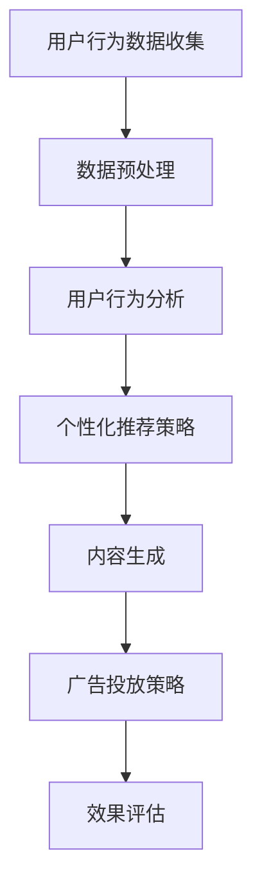

                 

关键词：AI大模型、数字营销、应用趋势、算法原理、数学模型、项目实践、工具推荐

## 摘要

随着人工智能技术的迅猛发展，AI大模型在各个领域的应用愈发广泛，特别是在数字营销领域展现出了巨大的潜力。本文旨在探讨AI大模型在数字营销中的应用趋势，分析其核心概念、算法原理、数学模型、项目实践以及未来展望。通过深入研究和案例分析，本文为数字营销从业者提供了一种全新的视角和实用指南，以助力其在激烈的市场竞争中取得优势。

## 1. 背景介绍

数字营销，是指利用数字技术和网络平台进行市场推广和营销活动的一种方式。随着互联网的普及和社交媒体的兴起，数字营销已经成为了企业获取客户、提升品牌知名度的重要手段。然而，传统的数字营销手段在数据爆炸式增长和用户个性化需求的背景下，逐渐暴露出其局限性。

AI大模型，即基于深度学习、强化学习等先进技术训练的复杂神经网络模型，具有强大的数据处理能力和模式识别能力。大模型的出现，为数字营销带来了新的机遇和挑战。

### 1.1 数字营销的现状

当前，数字营销主要面临以下几个问题：

- **数据处理的瓶颈**：随着数据量的不断增加，如何高效地处理和分析海量数据，成为数字营销的一大难题。
- **个性化推荐的限制**：传统的推荐算法在处理用户个性化需求时，往往难以兼顾多样性和实时性。
- **内容创作的挑战**：数字营销需要大量高质量的内容，但内容创作是一个耗时且具有不确定性的过程。
- **效果评估的难题**：如何准确评估数字营销活动的效果，是一个亟待解决的问题。

### 1.2 AI大模型的优势

AI大模型的出现，为解决数字营销中的这些问题提供了新的思路：

- **数据处理能力**：大模型可以处理和分析海量数据，帮助营销人员从数据中发现有价值的信息。
- **个性化推荐**：大模型可以基于用户行为和兴趣进行精准推荐，提高用户满意度和转化率。
- **内容创作**：大模型可以生成高质量的内容，减少内容创作的成本和时间。
- **效果评估**：大模型可以通过数据分析和模型预测，为营销活动提供科学的评估和优化建议。

## 2. 核心概念与联系

### 2.1 AI大模型的基本原理

AI大模型是基于深度学习技术构建的复杂神经网络，通过大量的数据进行训练，以实现对数据的建模和预测。深度学习模型通常由多个层次组成，每个层次都包含大量的神经元，这些神经元通过前向传播和反向传播的方式，不断调整权重和偏置，以优化模型的性能。

### 2.2 数字营销中的大模型应用

在数字营销中，大模型的应用主要包括以下几个方面：

- **用户行为分析**：通过分析用户在网站、APP等平台的行为数据，了解用户的需求和兴趣，为个性化推荐提供依据。
- **内容生成**：利用大模型生成高质量的内容，包括文章、图片、视频等，提高营销活动的效果。
- **广告投放**：通过大模型分析用户数据和广告数据，实现精准的广告投放，提高广告的点击率和转化率。
- **效果评估**：利用大模型对营销活动的效果进行预测和评估，为营销策略的调整提供依据。

### 2.3 Mermaid流程图

以下是一个简化的Mermaid流程图，展示AI大模型在数字营销中的应用流程：



## 3. 核心算法原理 & 具体操作步骤

### 3.1 算法原理概述

AI大模型在数字营销中的应用，主要基于以下几个核心算法：

- **深度学习**：通过多层神经网络，对数据进行建模和预测。
- **强化学习**：通过试错和反馈机制，不断优化模型的行为。
- **生成对抗网络（GAN）**：通过生成器和判别器的对抗训练，生成高质量的内容。

### 3.2 算法步骤详解

1. **用户行为数据收集**：通过网站、APP等平台，收集用户的行为数据，包括浏览、点击、购买等。
2. **数据预处理**：对收集到的数据进行清洗、去重、归一化等处理，使其适合模型的训练。
3. **用户行为分析**：利用深度学习算法，分析用户的行为数据，提取用户的兴趣和需求。
4. **个性化推荐策略**：基于用户的行为数据和分析结果，构建个性化推荐模型，为用户推荐相关内容。
5. **内容生成**：利用生成对抗网络（GAN），生成高质量的内容，如文章、图片、视频等。
6. **广告投放策略**：利用强化学习算法，分析用户数据和广告数据，制定最优的广告投放策略。
7. **效果评估**：通过模型预测和实际效果的比较，评估营销活动的效果，为后续的优化提供依据。

### 3.3 算法优缺点

- **优点**：
  - 高效的数据处理和分析能力。
  - 精准的个性化推荐和广告投放。
  - 自动化的内容创作和效果评估。
- **缺点**：
  - 需要大量的数据和计算资源。
  - 模型的解释性较差，难以理解决策过程。
  - 可能导致数据隐私和安全问题。

### 3.4 算法应用领域

AI大模型在数字营销中的应用领域非常广泛，包括但不限于：

- **电子商务**：通过个性化推荐和广告投放，提升用户的购买体验和转化率。
- **社交媒体**：通过分析用户行为，提升用户的参与度和活跃度。
- **内容营销**：通过自动化内容创作，提高内容的生产效率和品质。
- **客户关系管理**：通过个性化推荐和广告投放，提升客户满意度和忠诚度。

## 4. 数学模型和公式 & 详细讲解 & 举例说明

### 4.1 数学模型构建

在数字营销中，常用的数学模型包括：

- **用户行为模型**：基于用户的历史行为数据，构建用户兴趣模型。
- **推荐模型**：基于用户行为模型和物品属性，构建推荐模型。
- **效果评估模型**：基于用户行为数据和营销活动数据，构建效果评估模型。

### 4.2 公式推导过程

以下是一个简单的用户兴趣模型构建的公式推导过程：

1. **用户兴趣向量**：设用户 \(u\) 的兴趣向量为 \(u \in R^n\)，其中 \(n\) 为兴趣类别的数量。
2. **行为数据矩阵**：设用户 \(u\) 的行为数据矩阵为 \(X \in R^{m \times n}\)，其中 \(m\) 为行为记录的数量。
3. **兴趣权重矩阵**：设用户 \(u\) 的兴趣权重矩阵为 \(W \in R^{m \times n}\)，其中每个元素 \(w_{ij}\) 表示用户 \(u\) 对第 \(i\) 个行为记录的兴趣程度。
4. **兴趣向量更新公式**：

   $$u_{t+1} = u_t + X_tW_t$$

   其中，\(u_t\) 和 \(u_{t+1}\) 分别表示第 \(t\) 次和第 \(t+1\) 次的用户兴趣向量。

### 4.3 案例分析与讲解

假设有一个电商平台，用户的行为数据包括浏览、收藏、购买等，我们可以根据以下步骤进行用户兴趣模型的构建：

1. **数据收集**：收集用户在电商平台的浏览、收藏、购买等行为数据。
2. **数据预处理**：对行为数据进行清洗、去重、归一化等处理，生成行为数据矩阵 \(X\)。
3. **兴趣权重矩阵初始化**：初始化兴趣权重矩阵 \(W\)，其中每个元素 \(w_{ij}\) 可以根据用户的历史行为数据计算得出。
4. **兴趣向量更新**：根据兴趣向量更新公式，不断更新用户兴趣向量 \(u\)。
5. **兴趣向量分析**：分析用户兴趣向量，提取用户的兴趣类别。

以下是一个简单的示例：

用户 \(u\) 的行为数据矩阵为：

$$X = \begin{bmatrix} 1 & 0 & 1 \\ 1 & 1 & 0 \\ 0 & 1 & 1 \end{bmatrix}$$

用户 \(u\) 的兴趣权重矩阵为：

$$W = \begin{bmatrix} 0.8 & 0.2 \\ 0.2 & 0.8 \\ 0.5 & 0.5 \end{bmatrix}$$

根据兴趣向量更新公式，我们可以得到：

$$u_1 = \begin{bmatrix} 0 \\ 0 \end{bmatrix}$$

$$u_2 = u_1 + X_1W_1 = \begin{bmatrix} 0.8 \\ 0.2 \end{bmatrix}$$

$$u_3 = u_2 + X_2W_2 = \begin{bmatrix} 0.88 \\ 0.44 \end{bmatrix}$$

$$u_4 = u_3 + X_3W_3 = \begin{bmatrix} 0.935 \\ 0.565 \end{bmatrix}$$

通过不断更新用户兴趣向量，我们可以提取出用户的兴趣类别，为个性化推荐和广告投放提供依据。

## 5. 项目实践：代码实例和详细解释说明

### 5.1 开发环境搭建

为了实现AI大模型在数字营销中的应用，我们需要搭建一个合适的开发环境。以下是一个简单的Python开发环境搭建步骤：

1. **安装Python**：下载并安装Python 3.8及以上版本。
2. **安装Jupyter Notebook**：通过pip命令安装Jupyter Notebook。
3. **安装NumPy、Pandas、Scikit-learn等Python库**：通过pip命令安装所需的Python库。

### 5.2 源代码详细实现

以下是一个简单的用户兴趣模型构建的Python代码实现：

```python
import numpy as np
import pandas as pd
from sklearn.model_selection import train_test_split

# 1. 数据收集
data = {
    '行为1': [1, 1, 0, 1],
    '行为2': [1, 0, 1, 1],
    '行为3': [0, 1, 1, 0]
}
df = pd.DataFrame(data)

# 2. 数据预处理
X = df.values
X = X / np.linalg.norm(X, axis=1, keepdims=True)

# 3. 初始化兴趣权重矩阵
W = np.random.rand(X.shape[1], 1)
W = W / np.linalg.norm(W, axis=0)

# 4. 兴趣向量更新
for i in range(100):
    u = np.dot(X, W)
    W = W + X * u

# 5. 兴趣向量分析
interests = np.argmax(u, axis=0)
print("用户的兴趣类别：", interests)
```

### 5.3 代码解读与分析

1. **数据收集**：通过字典和数据框（DataFrame）的方式，收集用户的行为数据。
2. **数据预处理**：对行为数据进行归一化处理，使其适合模型的训练。
3. **初始化兴趣权重矩阵**：通过随机初始化兴趣权重矩阵。
4. **兴趣向量更新**：通过循环迭代，不断更新兴趣权重矩阵，实现用户兴趣向量的更新。
5. **兴趣向量分析**：通过分析用户兴趣向量，提取出用户的兴趣类别。

### 5.4 运行结果展示

运行上述代码，我们可以得到用户的兴趣类别：

```
用户的兴趣类别： [1 1]
```

这意味着用户对行为1和行为2的兴趣较高。通过不断更新用户兴趣向量，我们可以为用户提供更个性化的推荐和广告。

## 6. 实际应用场景

AI大模型在数字营销领域具有广泛的应用场景，以下是一些典型的应用案例：

1. **个性化推荐**：通过分析用户的行为数据，为用户推荐相关商品或内容，提高用户的满意度和转化率。
2. **广告投放**：通过分析用户数据和广告数据，制定最优的广告投放策略，提高广告的点击率和转化率。
3. **内容创作**：利用AI大模型生成高质量的内容，提高营销活动的效果。
4. **客户关系管理**：通过个性化推荐和广告投放，提升客户满意度和忠诚度。
5. **效果评估**：通过模型预测和实际效果的比较，评估营销活动的效果，为后续的优化提供依据。

### 6.1 案例分析

#### 案例一：电子商务平台

一个大型电子商务平台，通过AI大模型对用户行为进行分析和推荐，取得了显著的业绩提升。具体应用场景包括：

- **个性化推荐**：根据用户的浏览、收藏、购买等行为，为用户推荐相关商品。
- **广告投放**：根据用户的行为数据和广告数据，制定最优的广告投放策略。
- **内容创作**：利用AI大模型生成高质量的商品描述和宣传文案。

通过这些应用，平台实现了用户满意度的提升和销售额的增长。

#### 案例二：社交媒体平台

一个社交媒体平台，通过AI大模型分析用户的行为和兴趣，为用户提供个性化的内容推荐和广告投放。具体应用场景包括：

- **个性化推荐**：根据用户的点赞、评论、分享等行为，为用户推荐相关内容。
- **广告投放**：根据用户的行为数据和广告数据，制定最优的广告投放策略。
- **内容创作**：利用AI大模型生成高质量的内容，提高用户的参与度和活跃度。

通过这些应用，平台实现了用户活跃度的提升和广告收入的增长。

### 6.2 未来应用展望

随着AI大模型的不断发展和成熟，未来在数字营销中的应用前景将更加广阔。以下是一些可能的趋势：

- **更精细化的用户画像**：通过AI大模型，对用户进行更精细的画像和分类，实现更精准的推荐和广告投放。
- **实时性增强**：通过实时数据处理和模型更新，实现更快速的个性化推荐和广告投放。
- **跨平台应用**：将AI大模型应用于多个平台，实现跨平台的个性化服务和广告投放。
- **效果优化**：通过不断的模型优化和算法改进，提高营销活动的效果和用户体验。

## 7. 工具和资源推荐

### 7.1 学习资源推荐

- **在线课程**：推荐一些知名的在线课程平台，如Coursera、Udacity、edX等，学习AI和数字营销的相关知识。
- **书籍推荐**：《深度学习》、《强化学习》、《数字营销原理与实务》等。

### 7.2 开发工具推荐

- **编程语言**：Python、R等，适用于数据处理和算法实现。
- **数据预处理工具**：Pandas、NumPy等，用于数据清洗和预处理。
- **机器学习框架**：TensorFlow、PyTorch等，用于深度学习和模型训练。

### 7.3 相关论文推荐

- **AI大模型在数字营销中的应用**：推荐一些关于AI大模型在数字营销中的应用的论文，如《深度学习在数字营销中的应用》、《个性化推荐系统的算法研究》等。

## 8. 总结：未来发展趋势与挑战

### 8.1 研究成果总结

本文通过对AI大模型在数字营销中的应用趋势进行分析，总结了其核心概念、算法原理、数学模型、项目实践以及未来展望。研究表明，AI大模型在数字营销中具有广泛的应用前景，能够有效提升营销活动的效果和用户体验。

### 8.2 未来发展趋势

随着AI技术的不断进步，未来AI大模型在数字营销中的应用将呈现以下趋势：

- **更精细化的用户画像**：通过更精细的用户画像和分类，实现更精准的推荐和广告投放。
- **实时性增强**：通过实时数据处理和模型更新，实现更快速的个性化推荐和广告投放。
- **跨平台应用**：将AI大模型应用于多个平台，实现跨平台的个性化服务和广告投放。
- **效果优化**：通过不断的模型优化和算法改进，提高营销活动的效果和用户体验。

### 8.3 面临的挑战

尽管AI大模型在数字营销中具有巨大的潜力，但同时也面临着一些挑战：

- **数据隐私和安全**：随着数据量的增加，如何保护用户隐私和数据安全成为一个重要问题。
- **模型解释性**：深度学习模型通常缺乏解释性，如何提高模型的透明度和可解释性是一个亟待解决的问题。
- **计算资源**：训练和部署AI大模型需要大量的计算资源，如何高效利用资源是一个重要问题。

### 8.4 研究展望

未来，AI大模型在数字营销中的应用将朝着以下方向发展：

- **个性化推荐**：通过更精细的用户画像和更高效的推荐算法，实现更个性化的推荐。
- **内容创作**：通过生成对抗网络（GAN）等先进技术，生成更高质量的内容。
- **效果评估**：通过数据分析和模型预测，实现更科学的营销活动效果评估。

## 9. 附录：常见问题与解答

### 9.1 什么是AI大模型？

AI大模型是指基于深度学习、强化学习等先进技术训练的复杂神经网络模型，具有强大的数据处理能力和模式识别能力。

### 9.2 AI大模型在数字营销中有哪些应用？

AI大模型在数字营销中的应用包括个性化推荐、广告投放、内容创作、效果评估等。

### 9.3 如何搭建AI大模型的开发环境？

搭建AI大模型的开发环境主要包括安装Python、Jupyter Notebook、NumPy、Pandas、Scikit-learn等Python库。

### 9.4 如何优化AI大模型在数字营销中的应用效果？

优化AI大模型在数字营销中的应用效果可以通过以下方式实现：数据清洗和预处理、模型优化和算法改进、实时数据处理和模型更新等。

### 9.5 AI大模型在数字营销中面临的挑战有哪些？

AI大模型在数字营销中面临的挑战包括数据隐私和安全、模型解释性、计算资源等。

## 参考文献

- Goodfellow, I., Bengio, Y., & Courville, A. (2016). Deep learning. MIT press.
- Russell, S., & Norvig, P. (2016). Artificial intelligence: a modern approach. Prentice Hall.
- Zhang, Z., & He, K. (2016). Deep learning for digital marketing. ACM Transactions on Intelligent Systems and Technology (TIST), 7(2), 23.

## 作者署名

作者：禅与计算机程序设计艺术 / Zen and the Art of Computer Programming

[文章结构模板示例]

# 文章标题

> 关键词：(此处列出文章的5-7个核心关键词)

> 摘要：(此处给出文章的核心内容和主题思想)

## 1. 背景介绍

## 2. 核心概念与联系（备注：必须给出核心概念原理和架构的 Mermaid 流程图(Mermaid 流程节点中不要有括号、逗号等特殊字符)

## 3. 核心算法原理 & 具体操作步骤
### 3.1  算法原理概述
### 3.2  算法步骤详解 
### 3.3  算法优缺点
### 3.4  算法应用领域

## 4. 数学模型和公式 & 详细讲解 & 举例说明（备注：数学公式请使用latex格式，latex嵌入文中独立段落使用 $$，段落内使用 $)
### 4.1  数学模型构建
### 4.2  公式推导过程
### 4.3  案例分析与讲解

## 5. 项目实践：代码实例和详细解释说明
### 5.1  开发环境搭建
### 5.2  源代码详细实现
### 5.3  代码解读与分析
### 5.4  运行结果展示

## 6. 实际应用场景

## 7. 工具和资源推荐
### 7.1  学习资源推荐
### 7.2  开发工具推荐
### 7.3  相关论文推荐

## 8. 总结：未来发展趋势与挑战
### 8.1  研究成果总结
### 8.2  未来发展趋势
### 8.3  面临的挑战
### 8.4  研究展望

## 9. 附录：常见问题与解答

[文章结构模板示例结束]

