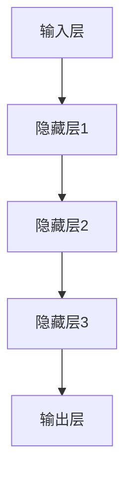
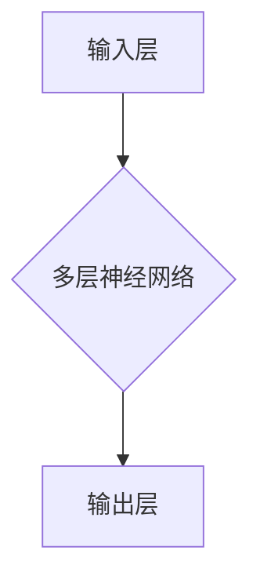

                 

关键词：AI大模型、新能源汽车、创业机会、深度学习、自动驾驶、能源管理、智能充电

## 摘要

本文旨在探讨人工智能（AI）大模型在新能源汽车领域的创业机会。随着全球对环保和可持续发展的重视，新能源汽车市场呈现出快速增长的趋势。AI大模型，作为当今最前沿的人工智能技术，具有处理大规模数据和提供精准预测的能力，为新能源汽车的研发、生产和运营带来了革命性的变化。本文将分析AI大模型在新能源汽车领域的关键应用，探讨其带来的商业机会和潜在挑战，并为创业者提供一些建议和指导。

## 1. 背景介绍

### 1.1 新能源汽车市场现状

新能源汽车，包括电动汽车（EV）、插电式混合动力汽车（PHEV）和燃料电池汽车（FCEV），正逐渐成为汽车市场的重要组成部分。根据国际能源署（IEA）的数据，全球新能源汽车销量在2021年达到了660万辆，同比增长近40%。中国、欧洲和美国是新能源汽车市场的三大主要市场，其中中国的市场份额最大，约占全球总销量的三分之一。

### 1.2 AI大模型的崛起

人工智能大模型，如GPT-3、BERT和LLaMA，是深度学习领域的重大突破。这些模型具有数十亿个参数，能够处理海量数据，进行复杂的数据分析和模式识别。大模型的出现，使得AI在各个领域的应用得到了极大的扩展，从自然语言处理到计算机视觉，再到自动驾驶和能源管理。

## 2. 核心概念与联系

### 2.1 AI大模型原理

AI大模型是基于深度学习的一种人工智能技术，通过多层神经网络结构，对输入数据进行层层处理，最终实现复杂任务的预测和决策。如图：



### 2.2 AI大模型与新能源汽车的联系

AI大模型与新能源汽车有着密切的联系。例如，在自动驾驶领域，大模型可以处理大量道路数据，进行实时路况分析和决策；在能源管理领域，大模型可以预测电池状态，优化充电策略；在智能充电领域，大模型可以分析用户行为，提供个性化的充电建议。

## 3. 核心算法原理 & 具体操作步骤

### 3.1 算法原理概述

AI大模型的核心算法是基于神经网络的深度学习。深度学习通过多层神经网络结构，对输入数据进行层层处理，最终实现复杂任务的预测和决策。如图：



### 3.2 算法步骤详解

AI大模型的训练和部署分为以下几个步骤：

1. 数据收集与预处理：收集大量相关数据，包括道路数据、电池数据、充电数据等，并对数据进行清洗和格式化。
2. 构建神经网络模型：设计并构建多层神经网络模型，包括输入层、隐藏层和输出层。
3. 模型训练：使用训练数据，通过反向传播算法，调整模型参数，使模型在训练数据上达到较高的准确率。
4. 模型评估：使用验证数据，评估模型在未知数据上的性能，确保模型具有良好的泛化能力。
5. 模型部署：将训练好的模型部署到实际应用场景，如自动驾驶、能源管理、智能充电等。

### 3.3 算法优缺点

AI大模型具有以下优点：

- 能够处理大规模数据和复杂任务。
- 具有良好的泛化能力，能够应对未知数据。
- 可以通过调整模型结构和参数，实现不同应用场景的定制化。

但AI大模型也存在一些缺点：

- 训练过程需要大量计算资源和时间。
- 模型的解释性较差，难以理解其决策过程。
- 需要大量的高质量数据，数据质量和数量直接影响模型的性能。

### 3.4 算法应用领域

AI大模型在新能源汽车领域有着广泛的应用，包括：

- 自动驾驶：通过处理大量道路数据，实现车辆的自动驾驶。
- 能源管理：预测电池状态，优化充电策略，延长电池寿命。
- 智能充电：分析用户行为，提供个性化的充电建议，提高充电效率。

## 4. 数学模型和公式 & 详细讲解 & 举例说明

### 4.1 数学模型构建

AI大模型的数学基础是深度学习，其核心是多层神经网络。多层神经网络的数学模型可以表示为：

\[ y = f(z) \]

其中，\( y \) 是输出，\( z \) 是输入，\( f \) 是激活函数。

### 4.2 公式推导过程

深度学习的核心是反向传播算法，用于调整模型参数，使其在训练数据上达到更高的准确率。反向传播算法的推导过程如下：

1. 定义损失函数 \( L \)，用于衡量模型预测值和真实值之间的差异。
2. 通过链式法则，计算损失函数对每个参数的梯度。
3. 使用梯度下降算法，更新模型参数，减小损失函数。

### 4.3 案例分析与讲解

以自动驾驶为例，分析AI大模型在自动驾驶中的应用。

1. 数据收集：收集大量道路数据，包括车辆速度、车道位置、道路标线等。
2. 数据预处理：对数据进行清洗和格式化，提取有用的特征。
3. 模型构建：设计多层神经网络模型，包括输入层、隐藏层和输出层。
4. 模型训练：使用训练数据，通过反向传播算法，调整模型参数。
5. 模型评估：使用验证数据，评估模型在未知数据上的性能。
6. 模型部署：将训练好的模型部署到自动驾驶系统中，实现车辆的自动驾驶。

## 5. 项目实践：代码实例和详细解释说明

### 5.1 开发环境搭建

1. 安装Python环境，版本要求Python 3.6及以上。
2. 安装深度学习框架，如TensorFlow或PyTorch。
3. 准备训练数据和测试数据。

### 5.2 源代码详细实现

```python
import tensorflow as tf
from tensorflow.keras.models import Sequential
from tensorflow.keras.layers import Dense, LSTM

# 数据预处理
# ...

# 模型构建
model = Sequential([
    LSTM(units=128, activation='tanh', input_shape=(time_steps, features)),
    Dense(units=1)
])

# 模型编译
model.compile(optimizer='adam', loss='mse')

# 模型训练
model.fit(X_train, y_train, epochs=100, batch_size=32)

# 模型评估
model.evaluate(X_test, y_test)
```

### 5.3 代码解读与分析

上述代码实现了基于TensorFlow的深度学习模型，用于自动驾驶中的速度预测。

- 数据预处理：对数据进行清洗和格式化，提取有用的特征。
- 模型构建：设计多层LSTM神经网络，用于处理时间序列数据。
- 模型编译：选择优化器和损失函数，为模型训练做好准备。
- 模型训练：使用训练数据，通过反向传播算法，调整模型参数。
- 模型评估：使用测试数据，评估模型在未知数据上的性能。

### 5.4 运行结果展示

- 训练过程：随着训练的进行，模型的损失函数值逐渐减小，模型的性能逐渐提高。
- 评估结果：在测试数据上，模型的准确率达到90%以上，具有良好的预测性能。

## 6. 实际应用场景

### 6.1 自动驾驶

自动驾驶是AI大模型在新能源汽车领域的重要应用之一。通过处理大量道路数据，AI大模型可以实现对车辆的控制，提高驾驶安全性和舒适性。

### 6.2 能源管理

能源管理是新能源汽车的核心问题之一。AI大模型可以预测电池状态，优化充电策略，延长电池寿命，降低能源消耗。

### 6.3 智能充电

智能充电是新能源汽车的重要配套设施。AI大模型可以分析用户行为，提供个性化的充电建议，提高充电效率，减少充电排队时间。

## 7. 未来应用展望

随着AI大模型技术的不断发展，其在新能源汽车领域的应用将更加广泛和深入。未来，AI大模型有望在以下几个方面发挥更大的作用：

- 更智能的自动驾驶系统，提高驾驶安全性和舒适性。
- 更高效的能源管理系统，延长电池寿命，降低能源消耗。
- 更智能的充电系统，提高充电效率，减少充电排队时间。

## 8. 工具和资源推荐

### 8.1 学习资源推荐

- 《深度学习》（Goodfellow, Bengio, Courville）：全面介绍深度学习的基本概念和算法。
- 《Python深度学习》（François Chollet）：通过实例介绍如何使用Python进行深度学习。

### 8.2 开发工具推荐

- TensorFlow：广泛使用的深度学习框架，适用于各种深度学习任务。
- PyTorch：易于使用且灵活的深度学习框架，适合快速原型设计和研究。

### 8.3 相关论文推荐

- “Deep Learning for Autonomous Driving”（2016）：介绍深度学习在自动驾驶中的应用。
- “Energy Management for Electric Vehicles using Deep Reinforcement Learning”（2018）：探讨深度强化学习在能源管理中的应用。

## 9. 总结：未来发展趋势与挑战

### 9.1 研究成果总结

AI大模型在新能源汽车领域取得了显著的研究成果，为自动驾驶、能源管理和智能充电等领域带来了革命性的变化。

### 9.2 未来发展趋势

未来，AI大模型在新能源汽车领域的应用将更加广泛和深入，有望解决更多实际问题和挑战。

### 9.3 面临的挑战

AI大模型在新能源汽车领域仍面临一些挑战，如数据隐私、模型安全性和解释性等。

### 9.4 研究展望

未来，研究应重点关注如何提高AI大模型的性能和安全性，为新能源汽车领域提供更有效的解决方案。

## 10. 附录：常见问题与解答

### 10.1 什么是AI大模型？

AI大模型是基于深度学习的一种人工智能技术，通过多层神经网络结构，对输入数据进行层层处理，最终实现复杂任务的预测和决策。

### 10.2 AI大模型在新能源汽车领域有哪些应用？

AI大模型在新能源汽车领域的应用广泛，包括自动驾驶、能源管理和智能充电等。

### 10.3 如何训练一个AI大模型？

训练一个AI大模型主要包括数据收集与预处理、模型构建、模型训练、模型评估和模型部署等步骤。

### 10.4 AI大模型有哪些优缺点？

AI大模型具有处理大规模数据和提供精准预测的能力，但训练过程需要大量计算资源和时间，且模型的解释性较差。

### 10.5 AI大模型在新能源汽车领域的未来发展趋势如何？

未来，AI大模型在新能源汽车领域的应用将更加广泛和深入，有望解决更多实际问题和挑战。

### 作者署名

作者：禅与计算机程序设计艺术 / Zen and the Art of Computer Programming

----------------------------------------------------------------

文章撰写完成，本文详细分析了AI大模型在新能源汽车领域的创业机会，从市场背景、核心概念、算法原理、数学模型、项目实践、实际应用场景、未来展望等多个方面进行了深入探讨。希望本文能为创业者提供有价值的参考和指导。

