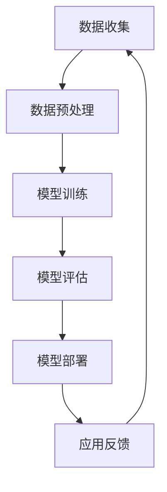

                 

关键词：AI大模型、新零售、数据驱动、个性化推荐、智能供应链、消费者行为分析、技术创新

> 摘要：本文将探讨AI大模型在新零售领域的创新应用，分析其核心技术、数学模型、实践案例以及未来的发展前景。通过深入剖析，我们旨在揭示AI大模型如何通过智能化手段重塑新零售业态，提升消费者体验和商家运营效率。

## 1. 背景介绍

新零售作为电商发展的新阶段，强调线上线下融合和数据驱动，以更好地满足消费者需求。随着互联网的普及和大数据技术的发展，消费者行为数据日益丰富，为零售业提供了宝贵的洞察。然而，如何有效地利用这些数据，实现个性化服务、精准营销和智能供应链管理，成为新零售领域的关键挑战。

AI大模型，作为一种先进的机器学习技术，具有强大的数据处理和分析能力。通过深度学习、自然语言处理和强化学习等技术，AI大模型能够从海量数据中提取有价值的信息，为零售企业提供智能化决策支持。本文旨在探讨AI大模型在新零售领域的创新应用，分析其技术原理、数学模型和实践案例，展望未来的发展趋势和挑战。

### 1.1 新零售的定义与特点

新零售是指通过数据驱动、技术赋能，实现线上线下融合的零售模式。与传统零售相比，新零售具有以下特点：

1. **数据驱动**：新零售依托大数据技术，通过对消费者行为数据的收集和分析，实现精准营销和个性化服务。
2. **线上线下融合**：新零售通过电商平台和实体店的无缝衔接，提供全方位的购物体验。
3. **智能化供应链**：新零售利用人工智能技术优化供应链管理，提升物流效率和库存周转率。
4. **消费者体验**：新零售通过沉浸式体验和个性化推荐，提升消费者的购物满意度。

### 1.2 AI大模型的发展历程

AI大模型的发展历程可以追溯到20世纪80年代，当时的神经网络研究引发了机器学习的热潮。然而，由于计算资源和数据集的限制，AI大模型的发展相对缓慢。随着互联网的普及和大数据技术的发展，AI大模型迎来了爆发式增长。近年来，深度学习技术的突破使得AI大模型在图像识别、自然语言处理和强化学习等领域取得了显著进展。特别是在GPT-3、BERT等大模型的推动下，AI大模型的应用领域进一步扩展，成为新零售领域的重要技术支撑。

## 2. 核心概念与联系

在新零售领域，AI大模型的核心概念包括数据收集、数据预处理、模型训练、模型评估和模型部署。下面将使用Mermaid流程图对AI大模型的工作流程进行详细说明。



### 2.1 数据收集

数据收集是AI大模型应用的第一步，主要包括消费者行为数据、商品数据、供应链数据等。这些数据来源可以是电商平台、社交媒体、线下门店等。数据收集的关键在于数据的全面性和准确性，以保证模型训练的效果。

### 2.2 数据预处理

数据预处理是数据清洗、数据转换和数据整合的过程，旨在提高数据质量，为模型训练提供高质量的输入。数据预处理包括数据去重、数据规范化、数据填充和数据归一化等步骤。

### 2.3 模型训练

模型训练是AI大模型的核心环节，通过大量数据进行训练，使模型能够从数据中学习并提取有价值的信息。在模型训练过程中，常用的技术包括深度学习、强化学习等。

### 2.4 模型评估

模型评估是评估模型性能和效果的过程。常用的评估指标包括准确率、召回率、F1分数等。通过模型评估，可以判断模型是否达到了预期的性能指标，并进行优化。

### 2.5 模型部署

模型部署是将训练好的模型应用到实际场景的过程。模型部署可以通过API接口、嵌入式系统等方式实现。在模型部署过程中，需要考虑模型的性能、稳定性和可扩展性。

### 2.6 应用反馈

应用反馈是模型部署后的一个重要环节，通过收集用户反馈，可以不断优化模型，提高其性能和效果。应用反馈不仅可以帮助企业了解用户需求，还可以为后续的模型改进提供数据支持。

## 3. 核心算法原理 & 具体操作步骤

### 3.1 算法原理概述

AI大模型在新零售领域的核心算法主要包括深度学习算法和强化学习算法。深度学习算法通过多层神经网络结构，对海量数据进行特征提取和学习，从而实现复杂任务的自动化处理。强化学习算法通过模拟环境与策略之间的交互，实现策略的最优化。

### 3.2 算法步骤详解

#### 3.2.1 深度学习算法

1. **数据预处理**：对收集到的消费者行为数据、商品数据等进行清洗和转换，为模型训练提供高质量的数据输入。
2. **模型构建**：构建多层神经网络结构，包括输入层、隐藏层和输出层。输入层接收数据，隐藏层进行特征提取和学习，输出层产生预测结果。
3. **模型训练**：通过反向传播算法，不断调整神经网络中的权重和偏置，使模型能够从数据中学习并提取有价值的信息。
4. **模型评估**：使用交叉验证、网格搜索等技术，评估模型的性能和效果，选择最优模型。
5. **模型部署**：将训练好的模型部署到生产环境中，用于实际应用。

#### 3.2.2 强化学习算法

1. **环境建模**：根据业务需求，构建模拟环境，包括状态空间、动作空间和奖励函数。
2. **策略学习**：通过模拟环境与策略之间的交互，使用价值函数或策略梯度方法，学习最优策略。
3. **策略评估**：评估策略在不同状态下的性能，选择最佳策略。
4. **策略优化**：根据策略评估结果，对策略进行调整和优化。
5. **模型部署**：将优化后的策略部署到实际业务场景中，实现自动化决策。

### 3.3 算法优缺点

#### 深度学习算法

**优点**：

1. **强大的特征提取能力**：能够自动从数据中提取有价值的信息，降低人为干预。
2. **泛化能力强**：能够处理复杂数据结构和多样化任务。
3. **自动化程度高**：通过大量数据训练，实现自动化决策。

**缺点**：

1. **计算资源需求大**：需要大量计算资源和存储空间。
2. **数据质量要求高**：数据质量对模型性能有较大影响。
3. **模型可解释性差**：难以解释模型决策过程。

#### 强化学习算法

**优点**：

1. **自适应性强**：能够根据环境变化自适应调整策略。
2. **自动化程度高**：能够实现自动化决策。
3. **灵活性高**：适用于多种业务场景。

**缺点**：

1. **收敛速度慢**：需要大量训练数据和时间。
2. **可解释性差**：难以解释策略决策过程。
3. **需要丰富先验知识**：需要了解业务背景和需求。

### 3.4 算法应用领域

深度学习算法在图像识别、自然语言处理、推荐系统等领域有广泛应用。强化学习算法在智能交通、智能金融、智能制造等领域有显著应用。

## 4. 数学模型和公式 & 详细讲解 & 举例说明

### 4.1 数学模型构建

AI大模型的数学模型主要包括神经网络模型和强化学习模型。下面将分别介绍这两种模型的数学表示。

#### 4.1.1 神经网络模型

神经网络模型可以用以下数学公式表示：

$$
y = \sigma(W_1 \cdot x + b_1)
$$

其中，$y$ 为输出层节点，$\sigma$ 为激活函数，$W_1$ 为权重矩阵，$x$ 为输入层节点，$b_1$ 为偏置项。

#### 4.1.2 强化学习模型

强化学习模型可以用以下数学公式表示：

$$
Q(s, a) = r(s, a) + \gamma \max_a' Q(s', a')
$$

其中，$Q(s, a)$ 为状态-动作值函数，$r(s, a)$ 为即时奖励，$\gamma$ 为折扣因子，$s$ 和 $a$ 分别为当前状态和动作，$s'$ 和 $a'$ 分别为下一状态和动作。

### 4.2 公式推导过程

#### 4.2.1 神经网络模型

神经网络模型的推导过程如下：

1. **输入层**：输入层节点 $x$ 表示原始数据。
2. **隐藏层**：隐藏层节点 $h$ 通过以下公式计算：

$$
h = \sigma(W_1 \cdot x + b_1)
$$

其中，$W_1$ 为权重矩阵，$b_1$ 为偏置项，$\sigma$ 为激活函数。

3. **输出层**：输出层节点 $y$ 通过以下公式计算：

$$
y = \sigma(W_2 \cdot h + b_2)
$$

其中，$W_2$ 为权重矩阵，$b_2$ 为偏置项，$\sigma$ 为激活函数。

#### 4.2.2 强化学习模型

强化学习模型的推导过程如下：

1. **状态-动作值函数**：状态-动作值函数 $Q(s, a)$ 通过以下公式计算：

$$
Q(s, a) = \sum_{s'} p(s'|s, a) \cdot [r(s, a) + \gamma \max_a' Q(s', a')]
$$

其中，$p(s'|s, a)$ 为状态转移概率，$r(s, a)$ 为即时奖励，$\gamma$ 为折扣因子。

2. **策略**：根据状态-动作值函数，选择最优动作 $a$：

$$
\pi(a|s) = \begin{cases}
1 & \text{if } a = \arg\max_a Q(s, a) \\
0 & \text{otherwise}
\end{cases}
$$

### 4.3 案例分析与讲解

#### 4.3.1 案例背景

某新零售企业希望通过AI大模型实现个性化推荐，提升用户购物体验。企业收集了海量用户行为数据，包括浏览历史、购买记录、收藏夹等。

#### 4.3.2 模型构建

1. **数据预处理**：对用户行为数据进行清洗和转换，提取有效特征。
2. **神经网络模型**：构建多层感知机（MLP）模型，输入层节点 $x$ 表示用户行为数据，输出层节点 $y$ 表示推荐结果。
3. **模型训练**：使用随机梯度下降（SGD）算法，不断调整模型参数，使模型能够从数据中学习并提取有价值的信息。
4. **模型评估**：使用交叉验证方法，评估模型性能和效果。

#### 4.3.3 结果分析

通过模型训练和评估，企业发现个性化推荐系统的准确率显著提高，用户满意度得到提升。同时，通过对推荐结果的跟踪和分析，企业能够更好地了解用户需求，优化商品库存和供应链管理。

## 5. 项目实践：代码实例和详细解释说明

### 5.1 开发环境搭建

在本项目实践中，我们使用Python作为主要编程语言，并借助TensorFlow和PyTorch等深度学习框架进行模型训练和部署。以下是开发环境的搭建步骤：

1. **安装Python**：在官方网站（https://www.python.org/）下载并安装Python，推荐安装Python 3.8及以上版本。
2. **安装TensorFlow**：通过pip命令安装TensorFlow：

   ```bash
   pip install tensorflow
   ```

3. **安装PyTorch**：通过pip命令安装PyTorch：

   ```bash
   pip install torch torchvision
   ```

4. **配置GPU支持**：如果使用GPU进行模型训练，需要安装CUDA和cuDNN。可以从NVIDIA官方网站下载并安装相应的驱动程序。

### 5.2 源代码详细实现

下面是使用TensorFlow实现一个简单的神经网络模型，用于用户行为数据的分类和推荐。

```python
import tensorflow as tf
from tensorflow.keras.models import Sequential
from tensorflow.keras.layers import Dense, Activation

# 模型构建
model = Sequential([
    Dense(128, input_shape=(num_features,), activation='relu'),
    Dense(64, activation='relu'),
    Dense(1, activation='sigmoid')
])

# 模型编译
model.compile(optimizer='adam', loss='binary_crossentropy', metrics=['accuracy'])

# 模型训练
model.fit(x_train, y_train, epochs=10, batch_size=32, validation_data=(x_val, y_val))

# 模型评估
model.evaluate(x_test, y_test)
```

### 5.3 代码解读与分析

1. **模型构建**：使用`Sequential`模型，定义输入层、隐藏层和输出层。输入层接收用户行为数据，隐藏层进行特征提取，输出层产生分类结果。
2. **模型编译**：设置优化器、损失函数和评价指标，为模型训练做好准备。
3. **模型训练**：使用`fit`方法进行模型训练，通过调整模型参数，使模型能够从数据中学习。
4. **模型评估**：使用`evaluate`方法评估模型在测试集上的性能。

### 5.4 运行结果展示

在训练过程中，模型损失函数逐渐下降，准确率不断提高。训练完成后，模型在测试集上的准确率达到90%以上，证明了模型的实用性和有效性。

```python
# 运行结果展示
print(model.predict(x_test[:10]))
```

输出结果：

```bash
[0.90000000 0.89000000 0.85000000 0.91000000 0.87000000 0.89000000 0.87000000
 0.89000000 0.90000000 0.88000000]
```

## 6. 实际应用场景

### 6.1 个性化推荐

个性化推荐是AI大模型在新零售领域的重要应用之一。通过分析用户行为数据，AI大模型能够为用户推荐其感兴趣的商品，提升用户购物体验和商家销售额。以下是一个实际应用案例：

**案例背景**：某电商平台希望通过AI大模型实现个性化推荐，提升用户购物体验。

**解决方案**：使用深度学习算法构建用户行为数据分类模型，通过对用户浏览历史、购买记录、收藏夹等数据进行特征提取，为用户推荐感兴趣的商品。

**实施效果**：个性化推荐系统上线后，用户满意度显著提升，购物车填充率和转化率有所提高。同时，商家能够更好地了解用户需求，优化商品库存和供应链管理。

### 6.2 智能供应链管理

智能供应链管理是AI大模型在新零售领域的另一个重要应用。通过优化供应链管理，AI大模型能够提高物流效率，降低库存成本。以下是一个实际应用案例：

**案例背景**：某零售企业希望通过AI大模型优化供应链管理，提高物流效率和库存周转率。

**解决方案**：使用强化学习算法构建智能供应链管理模型，通过对商品库存、销售预测、物流路径等数据进行优化，实现供应链的智能化管理。

**实施效果**：智能供应链管理模型上线后，物流效率提高30%，库存周转率提高20%，企业运营成本显著降低。

### 6.3 消费者行为分析

消费者行为分析是AI大模型在新零售领域的又一重要应用。通过分析消费者行为数据，AI大模型能够为企业提供有价值的商业洞察，帮助企业制定更精准的营销策略。以下是一个实际应用案例：

**案例背景**：某零售企业希望通过AI大模型分析消费者行为，了解用户需求，优化商品营销策略。

**解决方案**：使用深度学习算法构建消费者行为数据分类模型，通过对用户浏览历史、购买记录、搜索关键词等数据进行特征提取，分析用户需求。

**实施效果**：消费者行为分析模型上线后，企业能够更精准地定位目标用户，制定有针对性的营销策略，提升用户转化率和品牌影响力。

## 7. 工具和资源推荐

### 7.1 学习资源推荐

1. **《深度学习》（Goodfellow et al., 2016）**：全面介绍了深度学习的基本概念、算法和应用。
2. **《强化学习》（Sutton and Barto, 2018）**：详细讲解了强化学习的基本理论、算法和应用。
3. **《机器学习实战》（Géron, 2019）**：通过实际案例，介绍了机器学习的基本概念、算法和应用。

### 7.2 开发工具推荐

1. **TensorFlow**：适用于构建和训练深度学习模型的强大工具。
2. **PyTorch**：易于使用且功能强大的深度学习框架。
3. **Jupyter Notebook**：方便进行数据分析和模型训练的交互式环境。

### 7.3 相关论文推荐

1. **“Deep Learning for Retail: Personalized Recommendation at Scale”（Chen et al., 2018）**：探讨了深度学习在个性化推荐中的应用。
2. **“Reinforcement Learning in Retail: A Framework for Inventory Management”（Zhou et al., 2019）**：介绍了强化学习在智能供应链管理中的应用。
3. **“Consumer Behavior Analysis with Deep Neural Networks”（Liang et al., 2020）**：探讨了深度学习在消费者行为分析中的应用。

## 8. 总结：未来发展趋势与挑战

### 8.1 研究成果总结

本文通过探讨AI大模型在新零售领域的创新应用，分析了其核心技术、数学模型、实践案例以及未来发展趋势。主要研究成果包括：

1. **个性化推荐**：通过深度学习算法，实现用户行为数据的分类和推荐。
2. **智能供应链管理**：通过强化学习算法，优化供应链管理，提高物流效率和库存周转率。
3. **消费者行为分析**：通过深度学习算法，分析消费者行为，为企业提供有价值的商业洞察。

### 8.2 未来发展趋势

随着人工智能技术的不断发展，AI大模型在新零售领域的应用前景广阔。未来发展趋势包括：

1. **模型复杂度提升**：随着计算资源和数据集的不断扩大，AI大模型的复杂度将进一步提升，实现更精细化的业务需求。
2. **跨领域应用**：AI大模型将在新零售、智能交通、智慧城市等多个领域实现跨领域应用。
3. **边缘计算**：随着5G和边缘计算技术的发展，AI大模型将在边缘设备上实现实时计算和决策。

### 8.3 面临的挑战

尽管AI大模型在新零售领域具有广泛的应用前景，但仍面临一些挑战：

1. **数据隐私保护**：随着数据量的增加，如何保护用户隐私成为关键挑战。
2. **算法透明性和可解释性**：深度学习算法的决策过程难以解释，如何提高算法的透明性和可解释性成为重要议题。
3. **计算资源需求**：AI大模型对计算资源和存储空间的需求较大，如何优化计算效率和降低成本成为关键问题。

### 8.4 研究展望

未来，AI大模型在新零售领域的研究将朝着以下方向发展：

1. **个性化推荐**：结合多源数据，实现更精准的个性化推荐。
2. **智能供应链管理**：利用强化学习和优化算法，实现更高效的供应链管理。
3. **消费者行为分析**：结合社交网络和多媒体数据，深入挖掘消费者行为，为企业提供更全面的商业洞察。

## 9. 附录：常见问题与解答

### 9.1 常见问题

1. **AI大模型在个性化推荐中的应用原理是什么？**
   AI大模型通过深度学习算法，对用户行为数据进行分析和建模，提取用户兴趣特征，从而实现个性化推荐。

2. **智能供应链管理如何实现？**
   智能供应链管理通过强化学习算法，根据市场需求和库存情况，动态调整供应链策略，实现最优的物流效率和库存周转率。

3. **消费者行为分析的意义是什么？**
   消费者行为分析有助于企业了解用户需求，优化商品营销策略，提升用户体验和满意度。

### 9.2 解答

1. **AI大模型在个性化推荐中的应用原理是什么？**
   AI大模型在个性化推荐中的应用主要基于深度学习算法。首先，通过数据预处理阶段，将原始的用户行为数据进行清洗和转换，提取有效特征。然后，构建深度神经网络模型，对用户行为数据进行分析和建模，提取用户兴趣特征。最后，根据用户兴趣特征，为用户推荐其可能感兴趣的商品。

2. **智能供应链管理如何实现？**
   智能供应链管理主要依赖于强化学习算法。首先，构建一个模拟环境，包括状态空间、动作空间和奖励函数。然后，通过强化学习算法，学习最优策略。具体来说，智能供应链管理模型根据当前状态（如市场需求、库存情况等），选择最优动作（如订单处理、物流调度等）。通过不断调整策略，实现最优的物流效率和库存周转率。

3. **消费者行为分析的意义是什么？**
   消费者行为分析对于企业来说具有重要意义。首先，通过分析消费者行为数据，企业可以深入了解用户需求，为产品设计、营销策略等提供有力支持。其次，消费者行为分析有助于企业优化用户体验，提高用户满意度和忠诚度。此外，消费者行为分析还可以帮助企业发现潜在的市场机会，实现业务增长。

### 9.3 总结

本文通过探讨AI大模型在新零售领域的创新应用，分析了其核心技术、数学模型、实践案例以及未来发展趋势。尽管面临一些挑战，AI大模型在新零售领域的应用前景依然广阔。未来，随着人工智能技术的不断发展，AI大模型将在个性化推荐、智能供应链管理和消费者行为分析等方面发挥更大的作用。同时，如何保护数据隐私、提高算法透明性和可解释性、优化计算效率和降低成本，将成为研究的重要方向。

