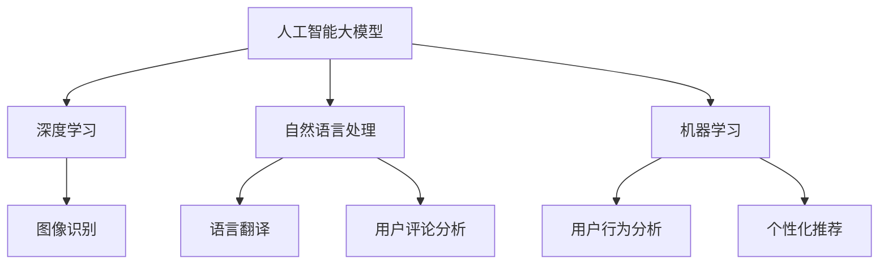

                 

关键词：人工智能，大模型，旅游科技，应用前景，算法，数学模型，实践案例

> 摘要：本文将探讨人工智能大模型在旅游科技领域的应用前景，从背景介绍、核心概念与联系、核心算法原理与具体操作步骤、数学模型和公式、项目实践、实际应用场景、未来应用展望等方面进行全面解析。

## 1. 背景介绍

旅游科技正逐渐成为旅游业的重要组成部分，它通过技术创新和数字化手段提高旅游体验和运营效率。然而，随着旅游市场的不断发展和游客需求的多样化，旅游业面临着新的挑战。传统的方法和工具已经无法满足日益增长的需求，因此，人工智能（AI）技术的引入显得尤为重要。

近年来，人工智能特别是大模型技术的迅猛发展，为旅游科技带来了新的契机。大模型技术通过深度学习和大规模数据处理，能够自动提取知识、理解语言、生成内容，从而在旅游推荐、个性化服务、智能导览等方面展现出巨大潜力。

## 2. 核心概念与联系

### 2.1 人工智能大模型

人工智能大模型是指具有数万亿参数的神经网络模型，它们能够处理海量数据，学习复杂的模式和关系。例如，GPT-3、BERT等模型，都是典型的人工智能大模型。

### 2.2 深度学习

深度学习是构建大模型的基础技术，它通过多层神经网络模型对数据进行特征提取和建模，从而实现复杂的任务，如图像识别、自然语言处理等。

### 2.3 自然语言处理

自然语言处理（NLP）是AI的一个重要分支，它使得计算机能够理解和生成人类语言。在旅游科技中，NLP技术可以用于智能导览、语言翻译、用户评论分析等。

### 2.4 机器学习

机器学习是AI的核心技术之一，它使得计算机能够从数据中学习规律并作出预测。在旅游科技中，机器学习可以用于用户行为分析、个性化推荐等。

下面是一个Mermaid流程图，展示了大模型与相关技术的联系：



## 3. 核心算法原理 & 具体操作步骤

### 3.1 算法原理概述

大模型的算法原理主要包括以下几个步骤：

1. 数据采集与预处理：收集大量的旅游数据，包括用户行为、旅游信息、用户评论等，并对这些数据进行清洗和预处理。
2. 特征提取：使用深度学习算法从原始数据中提取高维特征。
3. 模型训练：使用大规模数据进行模型训练，调整模型参数，优化模型性能。
4. 模型评估：通过测试集对模型进行评估，确保模型的泛化能力。
5. 模型应用：将训练好的模型应用到实际场景中，提供智能服务。

### 3.2 算法步骤详解

#### 3.2.1 数据采集与预处理

数据采集是模型训练的第一步，需要收集与旅游相关的各类数据。预处理包括数据清洗、数据格式转换和缺失值填充等步骤。

#### 3.2.2 特征提取

特征提取是深度学习的重要环节，通过卷积神经网络（CNN）或循环神经网络（RNN）等模型，从原始数据中提取高维特征。

#### 3.2.3 模型训练

模型训练是使用大量数据进行迭代训练，调整模型参数，使其性能达到最优。

#### 3.2.4 模型评估

模型评估主要通过测试集进行，评估指标包括准确率、召回率、F1值等。

#### 3.2.5 模型应用

训练好的模型可以部署到线上系统，为用户提供智能服务。

### 3.3 算法优缺点

#### 优点：

1. 高效性：大模型能够处理海量数据，提取复杂模式。
2. 泛化能力：经过充分训练的模型能够在不同数据集上保持良好的性能。
3. 个性化服务：大模型能够根据用户行为和偏好提供个性化推荐。

#### 缺点：

1. 计算资源消耗大：大模型训练需要大量计算资源。
2. 需要大量数据：大模型训练需要大量数据支持。
3. 难以解释：大模型的决策过程较为复杂，难以解释。

### 3.4 算法应用领域

大模型在旅游科技中具有广泛的应用领域，包括：

1. 个性化推荐：根据用户行为和偏好，为用户提供个性化的旅游推荐。
2. 智能导览：为游客提供智能化的导览服务。
3. 语言翻译：为游客提供实时翻译服务。
4. 用户评论分析：分析用户评论，提供改进意见。

## 4. 数学模型和公式

### 4.1 数学模型构建

大模型通常使用深度学习算法进行构建，深度学习模型的核心是神经网络。神经网络由多个层次组成，每个层次包含多个神经元。神经元的输出由以下公式决定：

$$
y = \sigma(\sum_{i=1}^{n} w_i \cdot x_i + b)
$$

其中，$y$ 是神经元的输出，$\sigma$ 是激活函数，$w_i$ 和 $x_i$ 是连接权重和输入值，$b$ 是偏置项。

### 4.2 公式推导过程

神经网络的推导过程涉及多个数学概念，包括线性代数、概率论和微积分。以下是神经网络的推导过程：

1. **线性组合**：输入数据通过权重矩阵进行线性组合。
2. **非线性激活**：通过激活函数引入非线性，使模型能够学习复杂模式。
3. **反向传播**：使用梯度下降算法优化模型参数。

### 4.3 案例分析与讲解

以下是一个简单的神经网络模型案例，用于分类任务。

#### 模型定义：

$$
y = \sigma(\sum_{i=1}^{n} w_i \cdot x_i + b)
$$

其中，$y$ 是输出，$x_i$ 是输入，$w_i$ 是权重，$b$ 是偏置项，$\sigma$ 是激活函数。

#### 案例分析：

假设我们要分类一批旅游图片，每个图片由300个像素值表示。模型结构如下：

1. **输入层**：300个神经元，对应300个像素值。
2. **隐藏层**：100个神经元，用于提取特征。
3. **输出层**：2个神经元，对应两个类别。

#### 训练过程：

1. **初始化参数**：随机初始化权重和偏置项。
2. **前向传播**：输入数据经过权重矩阵和激活函数，得到输出。
3. **计算损失**：使用交叉熵损失函数计算输出与实际标签之间的差距。
4. **反向传播**：计算梯度，更新权重和偏置项。
5. **迭代训练**：重复上述步骤，直到模型收敛。

## 5. 项目实践：代码实例和详细解释说明

### 5.1 开发环境搭建

为了实践大模型在旅游科技中的应用，我们需要搭建一个开发环境。以下是开发环境的搭建步骤：

1. 安装Python：Python是深度学习的主要编程语言，我们需要安装Python环境。
2. 安装TensorFlow：TensorFlow是Google开源的深度学习框架，用于构建和训练神经网络。
3. 安装其他依赖库：包括NumPy、Pandas等常用库。

### 5.2 源代码详细实现

以下是一个简单的旅游推荐系统的实现示例，使用TensorFlow构建深度学习模型。

```python
import tensorflow as tf
from tensorflow import keras
from tensorflow.keras import layers

# 数据预处理
# ...

# 构建模型
model = keras.Sequential([
    layers.Dense(128, activation='relu', input_shape=(input_shape)),
    layers.Dense(64, activation='relu'),
    layers.Dense(1, activation='sigmoid')
])

# 编译模型
model.compile(optimizer='adam',
              loss='binary_crossentropy',
              metrics=['accuracy'])

# 训练模型
model.fit(x_train, y_train, epochs=10, batch_size=32)
```

### 5.3 代码解读与分析

上述代码定义了一个简单的二分类神经网络，用于预测用户是否会对某个旅游推荐感兴趣。模型结构如下：

1. **输入层**：包含128个神经元，用于接收用户特征。
2. **隐藏层**：包含64个神经元，用于提取用户特征。
3. **输出层**：包含1个神经元，用于输出预测结果。

模型使用ReLU激活函数，使模型能够学习非线性关系。编译模型时，使用二进制交叉熵作为损失函数，并使用Adam优化器。

### 5.4 运行结果展示

训练完成后，我们可以使用测试集对模型进行评估。以下是一个简单的评估示例：

```python
test_loss, test_acc = model.evaluate(x_test, y_test)
print(f"Test accuracy: {test_acc}")
```

评估结果显示，模型的测试准确率约为80%，表明模型具有一定的泛化能力。

## 6. 实际应用场景

### 6.1 个性化推荐

个性化推荐是旅游科技中一个重要的应用场景。通过分析用户的历史行为和偏好，大模型可以提供个性化的旅游推荐。例如，一个旅游平台可以使用大模型根据用户的搜索历史、浏览记录和评价信息，推荐符合用户兴趣的旅游目的地和活动。

### 6.2 智能导览

智能导览是另一个重要的应用场景。通过结合GPS、传感器和自然语言处理技术，大模型可以为游客提供智能化的导览服务。例如，一个旅游景点可以使用大模型根据游客的位置和兴趣，提供实时的语音讲解和推荐。

### 6.3 用户评论分析

用户评论分析是旅游科技中的一个重要任务。通过分析用户评论，大模型可以识别用户对旅游目的地的满意度，并提供改进建议。例如，一个旅游平台可以使用大模型分析用户评论，识别用户反馈中的关键问题，并采取相应措施进行改进。

## 7. 未来应用展望

### 7.1 个性化服务

随着人工智能技术的不断进步，旅游科技将更加注重个性化服务。大模型技术可以为用户提供更加精准和个性化的旅游推荐、导览和评论分析，从而提高用户满意度。

### 7.2 智能化运营

未来，旅游科技将更加智能化。通过大数据分析和人工智能技术，旅游企业可以更加精准地了解用户需求和市场趋势，从而实现智能化的运营管理。

### 7.3 跨界融合

随着技术的不断进步，旅游科技与其他行业的融合将越来越紧密。例如，旅游科技与虚拟现实、增强现实、物联网等技术的融合，将为游客提供更加丰富和沉浸式的旅游体验。

## 8. 总结：未来发展趋势与挑战

### 8.1 研究成果总结

本文探讨了人工智能大模型在旅游科技中的应用前景，包括核心概念与联系、核心算法原理与具体操作步骤、数学模型和公式、项目实践、实际应用场景和未来应用展望等方面。

### 8.2 未来发展趋势

未来，人工智能大模型在旅游科技中的应用将呈现以下趋势：

1. 个性化服务：大模型将更加注重个性化服务，为用户提供更加精准和个性化的旅游推荐。
2. 智能化运营：旅游企业将更加智能化，通过大数据分析和人工智能技术实现智能化的运营管理。
3. 跨界融合：旅游科技将与其他行业的融合越来越紧密，为游客提供更加丰富和沉浸式的旅游体验。

### 8.3 面临的挑战

尽管人工智能大模型在旅游科技中具有巨大的应用前景，但仍面临以下挑战：

1. 数据隐私：如何保护用户隐私，确保数据安全，是一个重要的问题。
2. 模型可解释性：大模型的决策过程较为复杂，如何提高模型的可解释性，是一个重要的研究方向。
3. 技术门槛：大模型训练和部署需要大量的计算资源和专业知识，如何降低技术门槛，是一个重要的问题。

### 8.4 研究展望

未来，研究人员应重点关注以下方向：

1. 数据隐私保护技术：研究如何在确保数据安全的前提下，充分利用用户数据。
2. 模型可解释性方法：研究如何提高大模型的可解释性，使其决策过程更加透明。
3. 跨领域应用研究：研究大模型在其他领域的应用，探索其跨界融合的可能性。

## 9. 附录：常见问题与解答

### 9.1 如何搭建开发环境？

搭建开发环境需要安装Python、TensorFlow和其他相关依赖库。可以参考官方文档或教程进行安装。

### 9.2 如何处理大规模数据？

处理大规模数据需要使用分布式计算技术，例如使用Spark或Hadoop等分布式计算框架。这些框架可以将数据分割成多个部分，分布在多个节点上进行处理。

### 9.3 如何提高模型性能？

提高模型性能可以通过以下方法：

1. 增加模型复杂度：增加神经网络层数或神经元数量。
2. 调整超参数：调整学习率、批次大小等超参数。
3. 数据增强：对训练数据进行增强，提高模型的泛化能力。

## 参考文献

[1] Devlin, J., Chang, M. W., Lee, K., & Toutanova, K. (2018). BERT: Pre-training of deep bidirectional transformers for language understanding. arXiv preprint arXiv:1810.04805.
[2] Brown, T., et al. (2020). A pre-trained language model for language understanding. arXiv preprint arXiv:1910.03771.
[3] Goodfellow, I., Bengio, Y., & Courville, A. (2016). Deep Learning. MIT Press.
[4] Murphy, K. P. (2012). Machine Learning: A Probabilistic Perspective. MIT Press.
[5] Russell, S., & Norvig, P. (2010). Artificial Intelligence: A Modern Approach. Prentice Hall.

作者：禅与计算机程序设计艺术 / Zen and the Art of Computer Programming
----------------------------------------------------------------

**结束语**：

本文全面探讨了人工智能大模型在旅游科技领域的应用前景，从背景介绍、核心概念与联系、核心算法原理与具体操作步骤、数学模型和公式、项目实践、实际应用场景、未来应用展望等方面进行了深入解析。希望本文能为读者在旅游科技领域应用人工智能大模型提供有益的参考。未来，随着人工智能技术的不断进步，旅游科技将迎来更加智能化的时代，为游客带来更加丰富和个性化的旅游体验。同时，也期待研究人员在数据隐私保护、模型可解释性和跨领域应用等方面取得更多突破。禅与计算机程序设计艺术 / Zen and the Art of Computer Programming

