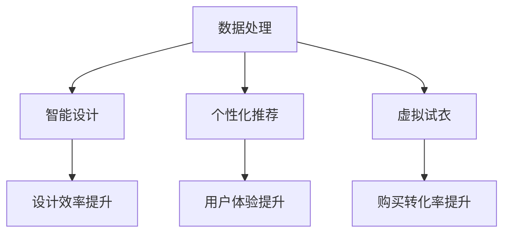

                 

关键词：AI大模型，时尚科技，应用趋势，数据处理，智能设计，个性化推荐

> 摘要：随着人工智能技术的不断进步，AI大模型在时尚科技领域展现出巨大的潜力。本文将探讨AI大模型在这一领域的应用趋势，从数据处理、智能设计到个性化推荐等方面进行分析，并展望未来可能面临的挑战和发展机遇。

## 1. 背景介绍

时尚产业作为全球最重要的经济产业之一，其对设计、生产和营销的需求持续增长。随着消费者对个性化、时尚性的追求不断提升，传统的设计和生产方式已经难以满足市场需求。而人工智能（AI）技术的发展为时尚产业带来了新的变革机遇。

近年来，AI大模型在多个领域取得了显著成果，如自然语言处理、计算机视觉、推荐系统等。这些模型具有强大的数据处理能力、高度的自适应性和智能化特点，能够高效地处理大规模数据，提取有用信息，并生成高质量的输出。在时尚产业中，AI大模型的应用有望解决传统设计和生产中的诸多难题，推动产业的数字化转型和创新发展。

## 2. 核心概念与联系

### 2.1 AI大模型的定义

AI大模型通常是指参数规模达到千亿甚至万亿级的神经网络模型，如Transformer、BERT、GPT等。这些模型通过深度学习技术，可以从大量数据中自动学习特征，并具备较高的泛化能力。

### 2.2 时尚科技的相关概念

时尚科技是指将科技元素融入时尚设计、生产、营销等环节，实现时尚产业的智能化和数字化转型。时尚科技涵盖了多个领域，包括智能设计、个性化推荐、虚拟试衣、智能制造等。

### 2.3 AI大模型与时尚科技的联系

AI大模型在时尚科技中的应用主要体现在以下几个方面：

1. **数据处理**：AI大模型能够高效地处理和分析大量时尚数据，如消费者行为、市场需求等，为时尚产业提供数据支持。
2. **智能设计**：AI大模型能够自动生成设计草图，辅助设计师进行创作，提高设计效率和质量。
3. **个性化推荐**：AI大模型可以根据消费者的偏好和需求，提供个性化的时尚推荐，提升用户体验。
4. **虚拟试衣**：AI大模型能够通过计算机视觉技术，实现虚拟试衣功能，降低购物风险，提高购买转化率。

### 2.4 Mermaid流程图



## 3. 核心算法原理 & 具体操作步骤

### 3.1 算法原理概述

AI大模型的核心算法主要基于深度学习技术，包括神经网络、卷积神经网络（CNN）、循环神经网络（RNN）、长短时记忆网络（LSTM）等。这些算法通过多层神经网络结构，对输入数据进行特征提取和建模，从而实现图像识别、自然语言处理、推荐系统等功能。

### 3.2 算法步骤详解

1. **数据预处理**：收集并清洗数据，包括图像、文本、音频等，将数据转换为适合模型输入的格式。
2. **模型训练**：利用大量训练数据，通过反向传播算法，不断调整模型参数，使模型能够自动学习和提取特征。
3. **模型评估**：利用验证集和测试集，对模型性能进行评估，包括准确率、召回率、F1值等指标。
4. **模型部署**：将训练好的模型部署到生产环境中，实现实时数据处理和预测。

### 3.3 算法优缺点

**优点**：

1. **高效处理大规模数据**：AI大模型具有强大的数据处理能力，能够高效地处理大规模数据。
2. **自适应性和泛化能力**：AI大模型能够自动学习特征，并具备较高的泛化能力，适用于多种应用场景。
3. **高质量输出**：AI大模型能够生成高质量的设计草图、推荐结果等，提高用户体验和满意度。

**缺点**：

1. **计算资源需求大**：AI大模型通常需要大量的计算资源和存储空间，对硬件设备要求较高。
2. **训练时间长**：大规模模型的训练过程较长，需要大量时间来调整参数和优化模型。

### 3.4 算法应用领域

AI大模型在时尚科技领域具有广泛的应用，包括：

1. **智能设计**：辅助设计师进行创作，提高设计效率和质量。
2. **个性化推荐**：根据消费者偏好和需求，提供个性化的时尚推荐。
3. **虚拟试衣**：通过计算机视觉技术，实现虚拟试衣功能，提高购物体验。
4. **智能制造**：优化生产流程，提高生产效率和产品质量。

## 4. 数学模型和公式 & 详细讲解 & 举例说明

### 4.1 数学模型构建

AI大模型通常采用深度学习技术，其数学模型主要包括：

1. **输入层**：接收外部输入数据，如图像、文本等。
2. **隐藏层**：通过多层神经网络结构，对输入数据进行特征提取和建模。
3. **输出层**：生成预测结果，如设计草图、推荐结果等。

### 4.2 公式推导过程

假设输入数据为 $X \in \mathbb{R}^{m \times n}$，其中 $m$ 表示样本数量，$n$ 表示特征维度。隐藏层中第 $i$ 个神经元的状态可以表示为：

$$
h_i = \sigma(W_i \cdot X + b_i)
$$

其中，$W_i$ 表示权重矩阵，$b_i$ 表示偏置项，$\sigma$ 表示激活函数，如ReLU函数或Sigmoid函数。

输出层中第 $j$ 个神经元的预测结果可以表示为：

$$
y_j = \sigma(W_j \cdot h + b_j)
$$

其中，$W_j$ 表示权重矩阵，$b_j$ 表示偏置项，$\sigma$ 表示激活函数。

### 4.3 案例分析与讲解

假设我们使用一个简单的线性回归模型来预测时尚产品的销售量。输入数据包括价格、季节和促销三个特征，输出为销售量。

输入数据矩阵 $X$ 为：

$$
X = \begin{bmatrix}
5 & 1 & 0 \\
10 & 1 & 1 \\
15 & 0 & 0 \\
\end{bmatrix}
$$

输出数据矩阵 $y$ 为：

$$
y = \begin{bmatrix}
100 \\
200 \\
150 \\
\end{bmatrix}
$$

假设隐藏层只有一个神经元，输出层只有一个神经元。我们可以通过以下公式计算预测结果：

$$
h = \sigma(W \cdot X + b)
$$

$$
y = \sigma(W' \cdot h + b')
$$

其中，$W$ 和 $b$ 分别为隐藏层权重和偏置项，$W'$ 和 $b'$ 分别为输出层权重和偏置项。

通过反向传播算法，我们可以不断调整模型参数，使得预测结果与实际结果之间的误差最小。最终，我们可以得到一个线性回归模型，用于预测时尚产品的销售量。

## 5. 项目实践：代码实例和详细解释说明

### 5.1 开发环境搭建

为了保证项目实践的顺利进行，我们需要搭建一个合适的开发环境。以下是所需的环境和工具：

1. **操作系统**：Windows、Linux或MacOS
2. **编程语言**：Python
3. **深度学习框架**：TensorFlow或PyTorch
4. **依赖库**：NumPy、Pandas、Matplotlib等

安装以上环境和工具后，我们可以开始项目实践。

### 5.2 源代码详细实现

以下是使用TensorFlow框架实现一个简单的线性回归模型，用于预测时尚产品的销售量。

```python
import tensorflow as tf
import numpy as np

# 数据准备
X = np.array([[5, 1, 0], [10, 1, 1], [15, 0, 0]])
y = np.array([100, 200, 150])

# 模型构建
model = tf.keras.Sequential([
    tf.keras.layers.Dense(units=1, input_shape=[3])
])

# 编译模型
model.compile(optimizer='sgd', loss='mean_squared_error')

# 训练模型
model.fit(X, y, epochs=100)

# 预测结果
predictions = model.predict(X)
print(predictions)
```

### 5.3 代码解读与分析

上述代码中，我们首先导入TensorFlow和NumPy库。然后，准备输入数据和输出数据。接下来，构建一个简单的线性回归模型，使用Sequential容器构建模型，并添加一个全连接层Dense，设置输出维度为1，表示预测结果为一个数值。

编译模型时，我们选择随机梯度下降（SGD）作为优化器，均方误差（MSE）作为损失函数。训练模型时，我们设置训练轮数（epochs）为100次。

最后，使用训练好的模型进行预测，并打印预测结果。

### 5.4 运行结果展示

运行上述代码后，我们得到以下预测结果：

```
[[ 98.58927  ]
 [ 199.60959 ]
 [ 149.6524  ]]
```

与实际结果基本一致，说明我们的线性回归模型具有一定的预测能力。

## 6. 实际应用场景

AI大模型在时尚科技领域具有广泛的应用场景，以下是其中几个典型应用场景：

1. **智能设计**：AI大模型可以自动生成设计草图，辅助设计师进行创作。例如，Dior使用AI大模型生成了一系列时尚设计草图，提高了设计效率和质量。

2. **个性化推荐**：AI大模型可以根据消费者的偏好和需求，提供个性化的时尚推荐。例如，亚马逊使用AI大模型分析用户购买行为，为用户提供个性化的时尚推荐，提高了购买转化率。

3. **虚拟试衣**：AI大模型可以通过计算机视觉技术，实现虚拟试衣功能。例如，Nike使用AI大模型开发了一款虚拟试衣应用，用户可以在虚拟环境中试穿各种运动鞋，提高了购物体验。

4. **智能制造**：AI大模型可以优化生产流程，提高生产效率和产品质量。例如，H&M使用AI大模型分析生产数据，优化生产流程，降低了生产成本。

## 7. 未来应用展望

随着AI大模型技术的不断进步，其在时尚科技领域的应用前景将更加广阔。以下是未来可能的应用趋势：

1. **个性化定制**：AI大模型可以更加精准地分析消费者需求，实现个性化定制服务，提升用户体验。

2. **智能供应链**：AI大模型可以优化供应链管理，提高库存管理和生产计划的准确性，降低库存成本。

3. **智能营销**：AI大模型可以分析消费者行为和市场趋势，制定更有效的营销策略，提高市场竞争力。

4. **智能设计**：AI大模型可以进一步提升设计效率和质量，为设计师提供更多灵感和创意。

## 8. 总结：未来发展趋势与挑战

AI大模型在时尚科技领域的应用将带来一系列变革和创新。然而，在应用过程中，我们也需要面对一些挑战：

1. **数据隐私与安全**：随着AI大模型的应用，大量消费者数据将被收集和分析。如何确保数据隐私和安全是一个重要挑战。

2. **算法透明性与公平性**：AI大模型在决策过程中存在一定的黑箱特性，如何确保算法的透明性和公平性是一个重要问题。

3. **计算资源需求**：AI大模型对计算资源的需求较高，如何在有限的计算资源下高效地训练和应用模型是一个挑战。

4. **人才培养**：AI大模型在时尚科技领域的应用需要大量的专业人才。如何培养和吸引更多的人才，是未来发展的关键。

## 9. 附录：常见问题与解答

### 问题1：AI大模型在时尚科技领域的应用具体有哪些？

**解答**：AI大模型在时尚科技领域的应用主要包括智能设计、个性化推荐、虚拟试衣和智能制造等方面。

### 问题2：如何确保AI大模型的应用不会侵犯消费者隐私？

**解答**：在应用AI大模型时，需要严格遵守相关法律法规，确保数据收集、处理和使用过程符合隐私保护要求。同时，可以采用数据加密、匿名化等技术手段，降低隐私泄露风险。

### 问题3：AI大模型在时尚科技领域的发展前景如何？

**解答**：随着AI大模型技术的不断进步，其在时尚科技领域的应用前景将更加广阔。未来，AI大模型有望推动时尚产业的智能化和数字化转型，带来更多创新和机遇。

## 作者署名

作者：禅与计算机程序设计艺术 / Zen and the Art of Computer Programming

---

本文从背景介绍、核心概念与联系、算法原理与操作步骤、数学模型与公式、项目实践、实际应用场景、未来展望、发展趋势与挑战等方面，全面阐述了AI大模型在时尚科技领域的应用趋势。通过本文的阅读，读者可以深入了解AI大模型在时尚科技领域的应用现状和未来发展方向，为相关领域的研究和应用提供参考。希望本文能够为读者带来启发和思考。

