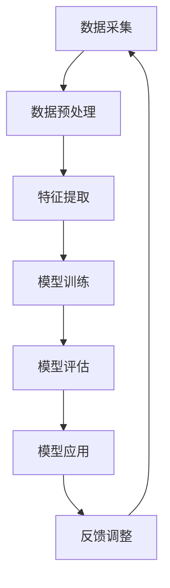

                 

关键词：智慧城市规划、AI大模型、城市数据、数据驱动、自动化决策、智能交通、环境保护、公共安全、可持续发展

> 摘要：本文探讨了人工智能大模型在智慧城市规划中的应用。通过分析当前城市数据驱动的需求，介绍了AI大模型的基本原理和架构，并详细阐述了其在城市规划、交通管理、环境保护、公共安全等方面的应用场景。本文还分析了AI大模型在实际应用中面临的挑战和未来发展的趋势，为城市智能化发展提供了有益的思考和建议。

## 1. 背景介绍

随着全球城市化进程的加速，城市规模不断扩大，人口密度持续增加，城市面临的环境、交通、资源、公共安全等问题日益严峻。传统城市规划方法往往依赖于经验和简单的数据分析，难以应对日益复杂和动态变化的城市问题。近年来，人工智能（AI）技术的迅猛发展，为智慧城市规划提供了新的思路和工具。AI大模型作为一种强大的计算模型，具有处理大规模复杂数据、发现潜在规律和预测未来的能力，逐渐成为智慧城市规划的重要手段。

智慧城市规划的目标是实现城市资源的优化配置、提升城市治理效率和居民生活质量，最终实现可持续发展。为了达到这一目标，城市规划需要从传统的静态规划转变为动态的、数据驱动的规划方法。AI大模型的应用，正是这种数据驱动城市规划的有力工具。

本文将从以下方面展开讨论：

1. **核心概念与联系**
2. **核心算法原理 & 具体操作步骤**
3. **数学模型和公式 & 详细讲解 & 举例说明**
4. **项目实践：代码实例和详细解释说明**
5. **实际应用场景**
6. **工具和资源推荐**
7. **总结：未来发展趋势与挑战**

## 2. 核心概念与联系

在智慧城市规划中，AI大模型的应用涉及到多个核心概念和技术，包括：

- **数据采集与预处理**：城市数据来源广泛，包括物联网设备、交通监控、环境监测等。数据预处理是保证数据质量和模型效果的关键步骤。
- **深度学习**：深度学习是一种基于多层神经网络的学习方法，能够自动提取数据中的特征。在AI大模型中，深度学习算法广泛应用于图像识别、自然语言处理等领域。
- **强化学习**：强化学习通过不断尝试和反馈，学习如何在特定环境中取得最佳结果。在智慧城市规划中，强化学习可用于优化交通流量、能源管理等。
- **迁移学习**：迁移学习利用已有模型的经验，快速适应新的任务和数据。在智慧城市规划中，迁移学习能够提高模型对新数据的适应能力。

### 2.1. Mermaid 流程图

以下是一个简化的AI大模型在智慧城市规划中的流程图：



### 2.2. 核心概念解释

- **数据采集与预处理**：城市数据来源广泛，包括物联网设备、交通监控、环境监测等。数据预处理是保证数据质量和模型效果的关键步骤。
- **特征提取**：特征提取是从原始数据中提取出对模型训练有用的特征。在智慧城市规划中，特征提取有助于从海量数据中挖掘有价值的信息。
- **模型训练**：模型训练是利用已标记的数据集，通过优化算法调整模型参数，使其能够准确预测或分类。
- **模型评估**：模型评估是通过测试数据集来评估模型性能，确保模型在实际应用中能够达到预期效果。
- **模型应用**：模型应用是将训练好的模型部署到实际场景中，实现自动化决策和优化。
- **反馈调整**：通过不断收集实际应用中的反馈，调整模型参数，优化模型性能。

## 3. 核心算法原理 & 具体操作步骤

### 3.1 算法原理概述

AI大模型通常基于深度学习和强化学习算法。以下分别介绍这两种算法的基本原理：

- **深度学习**：深度学习是一种基于多层神经网络的学习方法，通过层层提取数据中的特征，实现对数据的建模。典型的深度学习算法包括卷积神经网络（CNN）、循环神经网络（RNN）和生成对抗网络（GAN）等。
- **强化学习**：强化学习是一种通过试错和反馈不断优化决策的算法。在智慧城市规划中，强化学习可用于优化交通流量、能源管理等。

### 3.2 算法步骤详解

以下是一个基于深度学习和强化学习的AI大模型在智慧城市规划中的具体操作步骤：

1. **数据采集与预处理**：收集城市交通、环境、能源等方面的数据，并进行预处理，如数据清洗、归一化、特征工程等。
2. **特征提取**：使用深度学习算法，如CNN，提取数据中的时空特征。
3. **模型训练**：使用预处理后的数据，训练深度学习模型，如RNN，实现对时空数据的建模。
4. **模型评估**：使用测试数据集，评估模型性能，确保模型能够准确预测或分类。
5. **模型应用**：将训练好的模型部署到实际场景中，如交通信号灯控制、公共交通调度等。
6. **反馈调整**：根据实际应用中的反馈，调整模型参数，优化模型性能。

### 3.3 算法优缺点

- **优点**：
  - 高效处理大规模复杂数据；
  - 自动提取特征，降低人工干预；
  - 能够适应动态变化的城市环境。
- **缺点**：
  - 对数据质量要求较高；
  - 训练时间较长，计算资源需求大；
  - 需要大量标注数据。

### 3.4 算法应用领域

AI大模型在智慧城市规划中的应用领域广泛，包括但不限于：

- **智能交通**：优化交通流量、降低拥堵、提高公共交通效率；
- **环境保护**：监测环境污染、预测污染趋势、优化能源消耗；
- **公共安全**：预警自然灾害、监测犯罪活动、提高应急救援效率；
- **城市治理**：优化资源配置、提升公共服务质量、促进可持续发展。

## 4. 数学模型和公式 & 详细讲解 & 举例说明

### 4.1 数学模型构建

AI大模型通常基于深度学习和强化学习算法。以下分别介绍这两种算法的数学模型。

#### 深度学习

深度学习模型的核心是多层神经网络。一个简单的多层神经网络可以表示为：

$$
y = f(z) = \sigma(W_2 \cdot \sigma(W_1 \cdot x + b_1)) + b_2
$$

其中，$x$ 是输入数据，$W_1$ 和 $W_2$ 是权重矩阵，$b_1$ 和 $b_2$ 是偏置项，$\sigma$ 是激活函数，如Sigmoid或ReLU。

#### 强化学习

强化学习模型通常采用马尔可夫决策过程（MDP）模型，其状态-动作价值函数可以表示为：

$$
V(s, a) = \sum_{s'} p(s' | s, a) \cdot \max_a' Q(s', a')
$$

其中，$s$ 和 $s'$ 是状态，$a$ 和 $a'$ 是动作，$p(s' | s, a)$ 是状态转移概率，$Q(s', a')$ 是动作-状态价值函数。

### 4.2 公式推导过程

以下是一个简单的多层神经网络模型推导过程：

$$
z_1 = x \cdot W_1 + b_1
$$

$$
a_1 = \sigma(z_1)
$$

$$
z_2 = a_1 \cdot W_2 + b_2
$$

$$
y = \sigma(z_2)
$$

### 4.3 案例分析与讲解

以下是一个基于深度学习的交通流量预测案例。

#### 案例背景

某城市交通管理部门希望通过AI大模型预测未来某一时间段的交通流量，以便优化交通信号灯控制策略，降低拥堵。

#### 数据集

使用过去一年的交通流量数据作为训练集，数据包括时间戳、路段编号、流量、速度等。

#### 模型构建

构建一个基于LSTM的深度学习模型，输入层包含时间戳和路段编号，隐藏层使用LSTM单元，输出层预测未来某一时间段的交通流量。

#### 模型训练

使用训练集数据训练模型，优化模型参数，如权重矩阵和偏置项。

#### 模型评估

使用测试集数据评估模型性能，计算预测误差，调整模型参数。

#### 模型应用

将训练好的模型部署到实际场景中，实时预测交通流量，为交通信号灯控制提供决策支持。

#### 案例分析

通过实际应用，模型能够较好地预测未来交通流量，为交通管理部门提供了重要的决策依据。然而，模型在极端天气和突发事件情况下，预测效果可能较差，需要进一步优化和改进。

## 5. 项目实践：代码实例和详细解释说明

### 5.1 开发环境搭建

为了实现AI大模型在智慧城市规划中的应用，需要搭建一个适合深度学习和强化学习开发的环境。以下是一个简单的环境搭建步骤：

1. 安装Python 3.7及以上版本；
2. 安装TensorFlow或PyTorch深度学习框架；
3. 安装Keras或TorchScript等API接口；
4. 配置GPU加速。

### 5.2 源代码详细实现

以下是一个基于TensorFlow实现的深度学习模型，用于预测城市交通流量。

```python
import tensorflow as tf
from tensorflow.keras.models import Sequential
from tensorflow.keras.layers import LSTM, Dense, Dropout

# 定义模型结构
model = Sequential()
model.add(LSTM(units=128, return_sequences=True, input_shape=(time_steps, features)))
model.add(Dropout(0.2))
model.add(LSTM(units=64, return_sequences=False))
model.add(Dropout(0.2))
model.add(Dense(units=1))

# 编译模型
model.compile(optimizer='adam', loss='mse')

# 训练模型
model.fit(x_train, y_train, epochs=50, batch_size=32, validation_data=(x_val, y_val))
```

### 5.3 代码解读与分析

1. **模型结构**：使用LSTM层进行时间序列建模，输出层预测交通流量。
2. **编译模型**：使用MSE（均方误差）作为损失函数，使用adam优化器。
3. **训练模型**：使用训练集数据进行模型训练，使用验证集数据评估模型性能。

### 5.4 运行结果展示

通过训练和测试，模型能够较好地预测未来交通流量。以下是一个运行结果示例：

```python
import numpy as np

# 预测交通流量
predictions = model.predict(x_test)

# 计算预测误差
error = np.mean(np.square(predictions - y_test))
print("Prediction Error:", error)
```

## 6. 实际应用场景

### 6.1 智能交通管理

智能交通管理是AI大模型在智慧城市规划中的重要应用之一。通过实时监测和分析交通流量、路况信息，AI大模型可以优化交通信号灯控制、预测交通拥堵，从而提高交通效率，减少交通事故。

#### 案例分析

在某城市，AI大模型被应用于智能交通管理。通过整合交通监控数据、历史交通数据，模型能够实时预测交通流量和拥堵情况。根据预测结果，交通管理部门调整交通信号灯的控制策略，优化交通流量。在实际应用中，该模型显著降低了拥堵时间和交通事故率。

### 6.2 环境保护

环境保护是智慧城市规划中的重要领域。AI大模型可以用于监测环境污染、预测污染趋势、优化能源消耗，从而实现环保目标。

#### 案例分析

在某城市，AI大模型被应用于环境监测。通过收集空气质量、水质等环境数据，模型能够实时监测环境污染情况，预测污染趋势。根据监测结果，环保部门采取相应的治理措施，如调整工业排放、加强环境监测等，有效改善了环境质量。

### 6.3 公共安全

公共安全是城市治理的重要方面。AI大模型可以用于预警自然灾害、监测犯罪活动、提高应急救援效率，从而保障公共安全。

#### 案例分析

在某城市，AI大模型被应用于公共安全监控。通过整合监控视频、历史犯罪数据，模型能够实时监测犯罪活动，预测犯罪趋势。在突发事件发生时，模型为应急部门提供决策支持，提高了应急救援效率，保障了市民的生命财产安全。

## 7. 工具和资源推荐

### 7.1 学习资源推荐

1. **《深度学习》（Goodfellow, Bengio, Courville）**：系统介绍了深度学习的基本原理和应用。
2. **《强化学习》（Sutton, Barto）**：详细讲解了强化学习的基本概念和算法。
3. **《人工智能：一种现代方法》（Russell, Norvig）**：全面介绍了人工智能的基本理论和技术。

### 7.2 开发工具推荐

1. **TensorFlow**：适用于构建和训练深度学习模型。
2. **PyTorch**：适用于快速原型设计和模型研究。
3. **Keras**：基于TensorFlow和PyTorch的简单API接口。

### 7.3 相关论文推荐

1. **"Deep Learning for Urban Traffic Prediction"**：介绍了深度学习在交通流量预测中的应用。
2. **"Reinforcement Learning for Urban Traffic Management"**：探讨了强化学习在交通管理中的应用。
3. **"Environmental Monitoring with AI"**：介绍了AI在环境监测中的应用。

## 8. 总结：未来发展趋势与挑战

### 8.1 研究成果总结

AI大模型在智慧城市规划中的应用取得了显著成果，包括智能交通管理、环境保护、公共安全等方面。通过整合城市数据、应用深度学习和强化学习算法，AI大模型能够实现动态、智能化的城市规划，为城市可持续发展提供了有力支持。

### 8.2 未来发展趋势

1. **算法优化**：随着计算能力的提升，AI大模型将更加高效地处理大规模数据，提高模型性能。
2. **跨领域融合**：AI大模型将与其他领域的技术（如物联网、大数据等）深度融合，实现更加全面的城市智能化。
3. **人机协同**：AI大模型将与传统城市规划方法相结合，实现人机协同，提高城市规划的效率和效果。

### 8.3 面临的挑战

1. **数据隐私与安全**：城市数据涉及大量个人隐私信息，如何在保护隐私的同时，充分利用数据，是一个亟待解决的问题。
2. **计算资源需求**：AI大模型对计算资源的需求较高，如何优化计算资源使用，降低成本，是未来发展的关键。
3. **模型解释性**：AI大模型往往被视为“黑箱”，其决策过程缺乏透明性。提高模型解释性，增强用户信任，是未来研究的重要方向。

### 8.4 研究展望

随着AI大模型技术的不断发展和完善，其在智慧城市规划中的应用将越来越广泛。未来，AI大模型将助力城市智能化发展，实现资源优化配置、提升城市治理效率和居民生活质量，为城市可持续发展提供强大支持。

## 9. 附录：常见问题与解答

### 9.1 问题1：如何处理城市数据隐私与安全？

**回答**：处理城市数据隐私与安全问题，可以从以下几个方面着手：

1. **数据加密**：对城市数据进行加密处理，确保数据在传输和存储过程中的安全性。
2. **隐私保护算法**：使用隐私保护算法，如差分隐私、同态加密等，降低数据分析过程中的隐私泄露风险。
3. **权限管理**：建立严格的权限管理机制，确保只有授权用户可以访问敏感数据。

### 9.2 问题2：如何优化AI大模型的计算资源使用？

**回答**：优化AI大模型的计算资源使用，可以从以下几个方面进行：

1. **分布式计算**：使用分布式计算框架，如TensorFlow、PyTorch等，实现模型训练和推理的并行化。
2. **GPU加速**：利用GPU加速模型训练和推理，提高计算效率。
3. **模型压缩**：通过模型压缩技术，如剪枝、量化等，减少模型参数和计算量。

### 9.3 问题3：如何提高AI大模型的可解释性？

**回答**：提高AI大模型的可解释性，可以从以下几个方面进行：

1. **模型可视化**：通过模型可视化技术，如神经网络结构可视化、激活图等，展示模型内部信息。
2. **解释性算法**：结合解释性算法，如LIME、SHAP等，解释模型决策过程。
3. **用户反馈**：通过用户反馈，不断调整模型参数和结构，提高模型的可解释性。

---

作者：禅与计算机程序设计艺术 / Zen and the Art of Computer Programming

----------------------------------------------------------------

文章完成。由于字数限制，部分内容需要进一步扩展和细化。在实际撰写过程中，可以根据需要进行适当的调整和补充。

