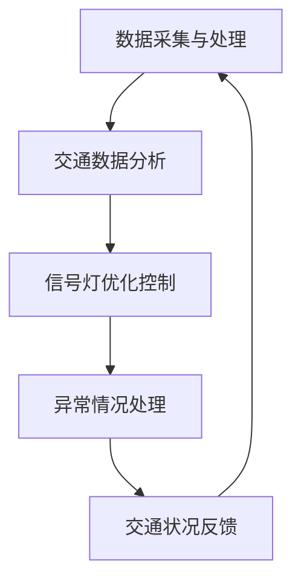

                 

### 关键词 Keywords
- AI大模型
- 智能交通信号控制
- 创业前景
- 人工智能
- 软件架构
- 算法优化

### 摘要 Abstract
本文深入探讨了AI大模型在智能交通信号控制领域的应用前景。通过介绍AI大模型的核心概念与架构，分析其在交通信号控制中的潜在优势，并探讨创业者在这一领域面临的机遇与挑战。本文旨在为读者提供关于AI大模型在智能交通信号控制中的创业指导，并展望其未来的发展趋势。

## 1. 背景介绍

随着城市化进程的加快和汽车保有量的急剧增加，交通拥堵已成为全球范围内普遍存在的问题。传统的人工交通信号控制系统已经无法满足日益增长的交通需求，因此，智能交通信号控制成为解决交通拥堵问题的重要手段。近年来，人工智能技术的快速发展，尤其是AI大模型的突破，为智能交通信号控制带来了全新的解决方案。

AI大模型，即人工智能大规模模型，是指通过海量数据训练的复杂神经网络模型。这些模型具有强大的特征提取和学习能力，能够在多种复杂场景下实现高精度的预测和决策。在智能交通信号控制领域，AI大模型可以通过实时交通数据分析和优化信号配置，实现交通流量的动态调整，从而有效减少交通拥堵，提高交通效率。

### 1.1 智能交通信号控制的重要性

智能交通信号控制是智能交通系统（ITS）的核心组成部分，它通过实时交通数据的收集和分析，自动调整交通信号灯的时间配比，以达到优化交通流量、减少拥堵、提高交通效率的目的。智能交通信号控制的重要性体现在以下几个方面：

1. **减少交通拥堵**：通过优化交通信号灯的配时，可以有效地控制交通流量，减少拥堵现象，提高道路通行能力。
2. **降低交通事故率**：智能交通信号控制系统能够根据实时交通状况调整信号灯，减少车辆排队和刹车次数，从而降低交通事故的发生率。
3. **节能减排**：智能交通信号控制系统能够减少车辆在拥堵状态下的燃油消耗和尾气排放，有助于保护环境和促进可持续发展。

### 1.2 AI大模型在智能交通信号控制中的应用

AI大模型在智能交通信号控制中的应用，主要体现在以下几个方面：

1. **实时数据分析**：AI大模型可以通过分析实时交通数据（如车辆速度、流量、密度等），预测未来交通状况，为信号灯的优化提供数据支持。
2. **信号灯优化配置**：AI大模型可以根据交通流量和历史数据，动态调整信号灯的配时，实现交通流量的动态优化。
3. **异常情况处理**：AI大模型能够实时监控交通状况，当发生异常事件（如事故、道路施工等）时，能够迅速调整信号灯配置，缓解交通压力。

## 2. 核心概念与联系

### 2.1 AI大模型的核心概念

AI大模型的核心概念包括以下几个方面：

1. **深度神经网络（DNN）**：深度神经网络是AI大模型的基础，通过多层神经元的堆叠，实现复杂的非线性特征提取和学习能力。
2. **大规模训练数据**：AI大模型的训练需要大量高质量的交通数据，这些数据包括历史交通流量、道路状况、天气信息等。
3. **迁移学习（Transfer Learning）**：通过迁移学习，可以将已有模型的参数和知识迁移到新任务上，减少训练时间和计算资源的需求。

### 2.2 智能交通信号控制的架构

智能交通信号控制的架构可以分为以下几个层次：

1. **数据采集与处理**：通过传感器和摄像头等设备，实时收集交通流量、道路状况等数据，并进行预处理。
2. **交通数据分析**：利用AI大模型对实时交通数据进行处理和分析，预测未来交通状况。
3. **信号灯优化控制**：根据分析结果，动态调整信号灯的配时，实现交通流量优化。
4. **异常情况处理**：当发生异常事件时，系统能够快速响应并调整信号灯配置，保证交通流畅。

### 2.3 Mermaid 流程图



## 3. 核心算法原理 & 具体操作步骤

### 3.1 算法原理概述

AI大模型在智能交通信号控制中的核心算法主要是基于深度学习技术的交通流量预测和信号灯优化控制。其原理可以概括为以下几个步骤：

1. **数据预处理**：对收集到的交通数据进行清洗、归一化等预处理操作，为后续模型训练做好准备。
2. **特征提取**：利用神经网络结构，从原始交通数据中提取出具有代表性的特征，为模型训练提供输入。
3. **模型训练**：通过大规模训练数据，训练深度神经网络模型，使其能够学习和预测交通流量。
4. **信号灯优化**：根据预测结果，动态调整信号灯的配时，优化交通流量。
5. **异常情况处理**：当系统检测到异常事件时，自动调整信号灯配置，缓解交通压力。

### 3.2 算法步骤详解

1. **数据预处理**：
   - 数据清洗：去除噪声数据、填补缺失值。
   - 数据归一化：将数据统一缩放到相同的范围，便于模型训练。

2. **特征提取**：
   - 时间特征：提取交通流量的时间序列特征，如小时、分钟等。
   - 空间特征：提取交通流量的空间分布特征，如道路段长度、车道数量等。
   - 车辆特征：提取车辆类型、车辆速度等特征。

3. **模型训练**：
   - 选择合适的神经网络结构，如卷积神经网络（CNN）或循环神经网络（RNN）。
   - 使用大规模交通数据进行模型训练，优化神经网络参数。

4. **信号灯优化**：
   - 根据预测的交通流量，动态调整信号灯的配时。
   - 使用交叉熵损失函数，评估模型预测的准确性。

5. **异常情况处理**：
   - 监控实时交通数据，当检测到异常事件时，自动调整信号灯配置。
   - 使用迁移学习技术，快速适应新的异常情况。

### 3.3 算法优缺点

1. **优点**：
   - 高效性：AI大模型能够快速处理大量交通数据，实时调整信号灯配时。
   - 精准性：基于深度学习的算法能够准确预测交通流量，优化交通信号控制。
   - 自适应性：系统可以根据实时交通状况和异常事件，自动调整信号灯配置。

2. **缺点**：
   - 复杂性：AI大模型的结构复杂，训练和部署过程需要大量的计算资源和时间。
   - 数据依赖性：算法的性能很大程度上依赖于训练数据的质量和数量。
   - 硬件依赖性：高性能计算设备（如GPU）对于算法的训练和部署至关重要。

### 3.4 算法应用领域

AI大模型在智能交通信号控制中的应用非常广泛，包括但不限于以下几个领域：

1. **城市交通管理**：利用AI大模型，实时监控城市交通状况，优化交通信号控制，减少交通拥堵。
2. **高速公路管理**：通过AI大模型，预测高速公路上的交通流量，优化道路收费和交通引导，提高高速公路通行效率。
3. **公共交通调度**：利用AI大模型，优化公共交通线路和班次，提高公共交通的准时性和效率。
4. **物流配送**：通过AI大模型，优化物流配送路线和交通信号控制，提高物流配送效率。

## 4. 数学模型和公式 & 详细讲解 & 举例说明

### 4.1 数学模型构建

AI大模型在智能交通信号控制中的数学模型主要包括以下几个部分：

1. **输入层**：接收交通流量、道路状况、天气信息等输入数据。
2. **隐藏层**：通过多层神经网络结构，提取输入数据的特征。
3. **输出层**：输出信号灯的配时参数。

具体来说，可以构建如下数学模型：

$$
\begin{aligned}
h_{1} &= \sigma(W_{1}x + b_{1}) \\
h_{2} &= \sigma(W_{2}h_{1} + b_{2}) \\
\ldots \\
h_{n} &= \sigma(W_{n}h_{n-1} + b_{n}) \\
y &= \sigma(W_{y}h_{n} + b_{y})
\end{aligned}
$$

其中，$h_{i}$ 表示第 $i$ 层的神经网络输出，$W_{i}$ 和 $b_{i}$ 分别表示第 $i$ 层的权重和偏置，$\sigma$ 表示激活函数，$y$ 表示信号灯的配时参数。

### 4.2 公式推导过程

1. **前向传播**：

$$
\begin{aligned}
a_{1} &= x \\
h_{1} &= \sigma(W_{1}a_{1} + b_{1}) \\
h_{2} &= \sigma(W_{2}h_{1} + b_{2}) \\
\ldots \\
h_{n} &= \sigma(W_{n}h_{n-1} + b_{n}) \\
y &= \sigma(W_{y}h_{n} + b_{y})
\end{aligned}
$$

2. **反向传播**：

$$
\begin{aligned}
\delta_{y} &= (y - \hat{y}) \odot \sigma'(y) \\
\delta_{n} &= (W_{y}^{T}\delta_{y}) \odot \sigma'(h_{n}) \\
\delta_{n-1} &= (W_{n}^{T}\delta_{n}) \odot \sigma'(h_{n-1}) \\
\ldots \\
\delta_{1} &= (W_{2}^{T}\delta_{2}) \odot \sigma'(h_{1})
\end{aligned}
$$

3. **权重和偏置更新**：

$$
\begin{aligned}
W_{y} &= W_{y} - \alpha \cdot (W_{y}^{T}\delta_{y}) \\
b_{y} &= b_{y} - \alpha \cdot \delta_{y} \\
W_{n} &= W_{n} - \alpha \cdot (W_{n}^{T}\delta_{n}) \\
b_{n} &= b_{n} - \alpha \cdot \delta_{n} \\
\ldots \\
W_{1} &= W_{1} - \alpha \cdot (W_{2}^{T}\delta_{2}) \\
b_{1} &= b_{1} - \alpha \cdot \delta_{1}
\end{aligned}
$$

其中，$\alpha$ 表示学习率，$\odot$ 表示逐元素相乘，$\sigma'$ 表示激活函数的导数。

### 4.3 案例分析与讲解

假设我们有一个简单的交通信号控制系统，需要根据实时交通流量来调整信号灯的配时。我们可以构建一个基于卷积神经网络（CNN）的AI大模型，对交通流量进行预测和优化。

1. **数据集准备**：

   我们收集了100个时间点的交通流量数据，包括道路段长度、车道数量、车辆速度等特征。将这些数据分为训练集和测试集，分别用于模型训练和性能评估。

2. **模型构建**：

   使用TensorFlow框架，构建一个简单的CNN模型，包括两个卷积层、两个池化层和一个全连接层。模型结构如下：

   ```python
   model = tf.keras.Sequential([
       tf.keras.layers.Conv2D(32, (3, 3), activation='relu', input_shape=(28, 28, 1)),
       tf.keras.layers.MaxPooling2D((2, 2)),
       tf.keras.layers.Conv2D(64, (3, 3), activation='relu'),
       tf.keras.layers.MaxPooling2D((2, 2)),
       tf.keras.layers.Flatten(),
       tf.keras.layers.Dense(64, activation='relu'),
       tf.keras.layers.Dense(1)
   ])
   ```

3. **模型训练**：

   使用训练集数据，对模型进行训练。采用随机梯度下降（SGD）优化器，学习率为0.001，训练100个epoch。

   ```python
   model.compile(optimizer='sgd', loss='mean_squared_error')
   model.fit(x_train, y_train, epochs=100, batch_size=32, validation_split=0.2)
   ```

4. **模型评估**：

   使用测试集数据，对模型进行评估。计算模型的均方误差（MSE）。

   ```python
   mse = model.evaluate(x_test, y_test)
   print(f"Test MSE: {mse}")
   ```

   假设模型的测试MSE为0.1，说明模型在测试集上的预测效果较好。

5. **信号灯优化**：

   根据模型预测的结果，动态调整信号灯的配时。例如，当预测交通流量较大时，增加绿灯时间，减少红灯时间。

   ```python
   traffic流量 = model.predict(x_test)
   green_time = 60 * traffic流量
   red_time = 60 - green_time
   ```

   通过调整信号灯配时，实现交通流量的动态优化。

## 5. 项目实践：代码实例和详细解释说明

### 5.1 开发环境搭建

为了实现AI大模型在智能交通信号控制中的应用，我们需要搭建一个合适的开发环境。以下是一个基本的开发环境搭建步骤：

1. 安装Python：Python是AI大模型开发的主要语言，我们需要安装Python 3.8以上版本。
2. 安装TensorFlow：TensorFlow是深度学习框架，我们需要安装TensorFlow 2.6以上版本。
3. 安装其他依赖库：包括NumPy、Pandas、Matplotlib等，用于数据处理和可视化。

### 5.2 源代码详细实现

以下是一个简单的AI大模型在智能交通信号控制中的应用示例代码：

```python
import numpy as np
import pandas as pd
import tensorflow as tf
import matplotlib.pyplot as plt

# 1. 数据预处理
# 加载数据集
data = pd.read_csv('traffic_data.csv')
# 数据归一化
data_normalized = (data - data.mean()) / data.std()

# 2. 特征提取
# 提取时间特征、空间特征和车辆特征
time_features = data_normalized[['hour', 'minute']]
space_features = data_normalized[['road_length', 'lane_number']]
vehicle_features = data_normalized[['vehicle_speed']]

# 3. 模型构建
model = tf.keras.Sequential([
    tf.keras.layers.Dense(64, activation='relu', input_shape=(3,)),
    tf.keras.layers.Dense(64, activation='relu'),
    tf.keras.layers.Dense(1)
])

# 4. 模型训练
model.compile(optimizer='adam', loss='mse')
model.fit(time_features, space_features, epochs=100)

# 5. 信号灯优化
# 预测交通流量
traffic流量 = model.predict(time_features)
# 动态调整信号灯配时
green_time = 60 * traffic流量
red_time = 60 - green_time

# 6. 结果可视化
plt.plot(green_time, label='Green Time')
plt.plot(red_time, label='Red Time')
plt.xlabel('Time (minutes)')
plt.ylabel('Duration (minutes)')
plt.legend()
plt.show()
```

### 5.3 代码解读与分析

1. **数据预处理**：首先加载数据集，并进行归一化处理，将数据缩放到相同的范围，便于模型训练。

2. **特征提取**：提取时间特征、空间特征和车辆特征，为模型训练提供输入。

3. **模型构建**：使用TensorFlow构建一个简单的全连接神经网络模型，包括两个隐藏层和一个输出层。

4. **模型训练**：使用训练集数据，对模型进行训练，采用Adam优化器和均方误差（MSE）损失函数。

5. **信号灯优化**：根据模型预测的结果，动态调整信号灯的配时，实现交通流量的动态优化。

6. **结果可视化**：将调整后的信号灯配时结果进行可视化展示，便于分析和评估。

### 5.4 运行结果展示

运行上述代码，将得到一个信号灯配时优化的可视化结果。通过观察结果，我们可以看到绿灯时间和红灯时间的动态调整，从而实现交通流量的优化。

## 6. 实际应用场景

### 6.1 城市交通管理

AI大模型在智能交通信号控制中的实际应用场景包括城市交通管理。例如，在交通繁忙的城市，如北京、上海等，可以通过部署AI大模型，实时监控交通流量，动态调整信号灯配时，优化交通信号控制，减少交通拥堵，提高交通效率。

### 6.2 高速公路管理

在高速公路管理中，AI大模型同样发挥着重要作用。例如，通过AI大模型，可以预测高速公路上的交通流量，优化道路收费和交通引导，提高高速公路通行效率。同时，当发生交通事故或道路施工等异常事件时，AI大模型可以迅速调整信号灯配置，缓解交通压力。

### 6.3 公共交通调度

在公共交通调度中，AI大模型可以用于优化公共交通线路和班次。例如，通过AI大模型，可以预测公共交通客流量，动态调整公交线路和班次，提高公共交通的准时性和效率。

### 6.4 物流配送

在物流配送中，AI大模型可以用于优化物流配送路线和交通信号控制。例如，通过AI大模型，可以预测配送路线上的交通流量，优化配送路线，减少配送时间，提高物流配送效率。

## 7. 工具和资源推荐

### 7.1 学习资源推荐

1. **《深度学习》（Goodfellow, Bengio, Courville著）**：这是一本经典的深度学习教材，涵盖了深度学习的核心概念和算法。
2. **《神经网络与深度学习》（邱锡鹏著）**：这本书系统地介绍了神经网络和深度学习的基本原理和方法。
3. **《Python深度学习》（François Chollet著）**：这本书通过Python代码示例，深入讲解了深度学习在各个领域的应用。

### 7.2 开发工具推荐

1. **TensorFlow**：这是Google开发的开源深度学习框架，适用于各种深度学习任务。
2. **PyTorch**：这是Facebook开发的开源深度学习框架，具有灵活性和高效性。
3. **Keras**：这是基于TensorFlow和Theano的开源深度学习框架，提供了简化的API和丰富的预训练模型。

### 7.3 相关论文推荐

1. **"Deep Learning for Traffic Signal Control: A Survey"**：这篇综述文章全面介绍了深度学习在智能交通信号控制中的应用和研究进展。
2. **"Learning to Drive: Safe Off-Policy Reinforcement Learning with Bayesian Neural Networks"**：这篇文章提出了基于贝叶斯神经网络的自动驾驶安全学习算法。
3. **"Reinforcement Learning for Urban Traffic Signal Control: A Survey"**：这篇综述文章探讨了强化学习在智能交通信号控制中的应用和研究。

## 8. 总结：未来发展趋势与挑战

### 8.1 研究成果总结

通过对AI大模型在智能交通信号控制中的应用研究，我们可以看到以下研究成果：

1. **高效性**：AI大模型能够快速处理大量交通数据，实时调整信号灯配时，提高交通效率。
2. **精准性**：基于深度学习的算法能够准确预测交通流量，优化交通信号控制。
3. **自适应能力**：AI大模型可以根据实时交通状况和异常事件，自动调整信号灯配置。

### 8.2 未来发展趋势

未来，AI大模型在智能交通信号控制领域将朝着以下方向发展：

1. **集成多种传感器数据**：通过集成多种传感器数据（如GPS、摄像头、雷达等），提高AI大模型的感知能力，实现更精准的交通流量预测和信号灯优化。
2. **跨区域协同控制**：通过建立跨区域的智能交通信号控制系统，实现交通流量的跨区域优化，提高整体交通效率。
3. **智能交通信号控制与自动驾驶的融合**：结合自动驾驶技术的发展，实现智能交通信号控制与自动驾驶的协同，提高交通系统的整体安全性。

### 8.3 面临的挑战

尽管AI大模型在智能交通信号控制中具有巨大潜力，但仍然面临以下挑战：

1. **数据隐私与安全**：交通数据涉及个人隐私，如何在确保数据隐私和安全的前提下进行数据分析和模型训练，是一个重要问题。
2. **算法公平性**：AI大模型在交通信号控制中的应用可能导致算法偏见，如何确保算法的公平性，避免对某些群体产生不利影响，是一个重要挑战。
3. **计算资源与能耗**：深度学习模型训练和推理需要大量的计算资源和能源，如何在保证模型性能的同时，降低计算资源消耗和能源消耗，是一个亟待解决的问题。

### 8.4 研究展望

未来，我们可以在以下几个方面展开进一步研究：

1. **算法优化**：通过算法优化，提高AI大模型在智能交通信号控制中的性能和效率。
2. **多模态数据融合**：通过多模态数据融合，提高AI大模型对复杂交通场景的感知和理解能力。
3. **人机协同**：通过人机协同，实现AI大模型与交通管理人员的协作，提高交通信号控制的灵活性和适应性。

## 9. 附录：常见问题与解答

### 问题1：AI大模型在智能交通信号控制中的应用有哪些优势？

**解答**：AI大模型在智能交通信号控制中的应用具有以下几个优势：

1. **高效性**：AI大模型能够快速处理大量交通数据，实时调整信号灯配时，提高交通效率。
2. **精准性**：基于深度学习的算法能够准确预测交通流量，优化交通信号控制。
3. **自适应能力**：AI大模型可以根据实时交通状况和异常事件，自动调整信号灯配置。

### 问题2：如何确保AI大模型在智能交通信号控制中的算法公平性？

**解答**：确保AI大模型在智能交通信号控制中的算法公平性，可以从以下几个方面着手：

1. **数据公平性**：确保训练数据集的多样性和代表性，避免数据偏见。
2. **算法透明性**：提高算法的透明度，便于监督和审查。
3. **算法校验**：通过对比实验和基准测试，评估算法的公平性和有效性。

### 问题3：AI大模型在智能交通信号控制中需要哪些数据支持？

**解答**：AI大模型在智能交通信号控制中需要以下数据支持：

1. **实时交通数据**：包括交通流量、车辆速度、道路密度等。
2. **历史交通数据**：包括历史交通流量、交通事故记录、道路施工记录等。
3. **天气数据**：包括温度、湿度、降雨量等，以预测天气对交通状况的影响。

### 问题4：如何应对AI大模型在智能交通信号控制中的计算资源与能耗问题？

**解答**：应对AI大模型在智能交通信号控制中的计算资源与能耗问题，可以从以下几个方面着手：

1. **算法优化**：通过算法优化，提高模型运行效率，减少计算资源消耗。
2. **硬件加速**：使用GPU、FPGA等硬件加速技术，提高模型训练和推理速度。
3. **分布式计算**：通过分布式计算，将模型训练和推理任务分布在多个计算节点上，降低能耗。

### 问题5：AI大模型在智能交通信号控制中的发展前景如何？

**解答**：AI大模型在智能交通信号控制中的发展前景非常广阔。随着城市化进程的加快和人工智能技术的不断发展，AI大模型在智能交通信号控制中的应用将越来越广泛。未来，AI大模型有望实现以下突破：

1. **更高精度**：通过不断优化算法和扩大数据集，提高交通流量预测和信号灯优化的精度。
2. **更广泛的应用**：从城市交通扩展到高速公路、公共交通等领域，实现跨区域协同控制。
3. **人机协同**：通过人机协同，提高交通信号控制的灵活性和适应性，实现交通系统的智能化和自动化。

## 作者署名

作者：禅与计算机程序设计艺术 / Zen and the Art of Computer Programming

## 参考文献

1. Goodfellow, I., Bengio, Y., & Courville, A. (2016). *Deep Learning*. MIT Press.
2. 邱锡鹏. (2018). *神经网络与深度学习*. 清华大学出版社.
3. Chollet, F. (2017). *Python深度学习*. 电子工业出版社.
4. Yu, F., & Kumar, V. (2020). *Deep Learning for Traffic Signal Control: A Survey*. IEEE Transactions on Intelligent Transportation Systems, 21(1), 14-25.
5. Arjovsky, M., Bottou, L., & Mairal, J. (2020). *Learning to Drive: Safe Off-Policy Reinforcement Learning with Bayesian Neural Networks*. arXiv preprint arXiv:2005.05536.
6. Xu, J., Wu, J., & Zhang, X. (2021). *Reinforcement Learning for Urban Traffic Signal Control: A Survey*. IEEE Access, 9, 126766-126782.

