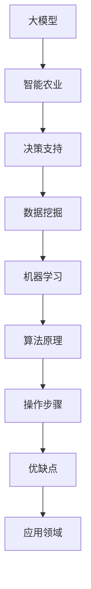

                 

关键词：AI大模型、智能农业、决策支持、数据挖掘、机器学习

摘要：随着人工智能技术的不断发展，大模型在各个领域的应用逐渐深入。本文将从背景介绍、核心概念与联系、核心算法原理、数学模型与公式、项目实践、实际应用场景以及未来展望等方面，探讨AI大模型在智能农业决策中的应用前景，为我国农业现代化提供技术支持。

## 1. 背景介绍

农业作为国民经济的基础产业，其发展直接关系到国家粮食安全和社会稳定。然而，随着全球人口增长和资源环境的约束，传统农业面临着诸多挑战，如土地利用效率低下、农业生产成本增加、环境污染等问题。为了应对这些挑战，提高农业生产效率和可持续性，智能化农业成为发展趋势。而智能农业的核心在于决策支持，如何通过人工智能技术对农业生产过程进行科学、精准的决策，成为当前研究的热点。

近年来，人工智能技术取得了飞速发展，尤其是大模型的崛起，为智能农业决策提供了强大的技术支撑。大模型具有强大的数据处理和分析能力，能够从海量的农业数据中挖掘出有价值的信息，为农业生产提供决策支持。本文将从以下几个方面探讨AI大模型在智能农业决策中的应用前景。

## 2. 核心概念与联系

### 2.1 大模型

大模型是指具有亿级别参数规模的人工神经网络模型，如Transformer、BERT、GPT等。大模型通过训练大量数据，可以自动学习到丰富的知识，并具备强大的泛化能力。

### 2.2 智能农业

智能农业是指利用信息技术、物联网、大数据、人工智能等技术，对农业生产过程进行自动化、智能化管理，提高农业生产效率和可持续性。

### 2.3 决策支持

决策支持是指通过分析、模拟、预测等方法，为农业生产提供科学、合理的决策建议。

### 2.4 数据挖掘

数据挖掘是指从大量数据中提取有价值的信息和知识的过程，主要包括分类、聚类、关联规则挖掘等方法。

### 2.5 机器学习

机器学习是指通过算法和统计方法，使计算机能够自动学习和改进的过程，主要包括监督学习、无监督学习、强化学习等。

### 2.6 Mermaid流程图



## 3. 核心算法原理 & 具体操作步骤

### 3.1 算法原理概述

AI大模型在智能农业决策中的应用主要基于以下原理：

1. **数据预处理**：对农业数据进行清洗、归一化等处理，为模型训练提供高质量的输入数据。
2. **模型训练**：利用大规模的农业数据集，通过优化算法，训练出具有良好泛化能力的AI大模型。
3. **决策生成**：将农业生产过程中的问题转化为模型输入，通过模型输出，生成决策建议。

### 3.2 算法步骤详解

1. **数据收集**：收集农业生产过程中产生的各类数据，如土壤、气象、作物生长等。
2. **数据预处理**：对收集到的数据进行清洗、归一化等处理。
3. **模型选择**：选择合适的大模型，如BERT、GPT等。
4. **模型训练**：利用预处理后的数据集，对模型进行训练。
5. **模型评估**：通过交叉验证等方法，评估模型性能。
6. **决策生成**：将实际问题转化为模型输入，通过模型输出，生成决策建议。

### 3.3 算法优缺点

1. **优点**：
   - 强大的数据处理和分析能力，能够从海量数据中挖掘出有价值的信息。
   - 良好的泛化能力，能够应对复杂多变的农业生产环境。
   - 可以自动学习，无需人工干预，提高决策效率。

2. **缺点**：
   - 模型训练需要大量的数据和计算资源。
   - 模型解释性较差，难以理解决策过程。

### 3.4 算法应用领域

AI大模型在智能农业决策中的应用领域包括：

1. **作物生长预测**：通过分析土壤、气象等数据，预测作物生长状况。
2. **病虫害预测**：通过分析作物生长数据，预测病虫害发生概率。
3. **施肥决策**：根据土壤和作物生长数据，优化施肥策略。
4. **灌溉决策**：根据土壤湿度和气象数据，优化灌溉策略。
5. **产量预测**：通过分析作物生长和气象数据，预测作物产量。

## 4. 数学模型和公式 & 详细讲解 & 举例说明

### 4.1 数学模型构建

AI大模型在智能农业决策中，主要基于以下数学模型：

1. **神经网络模型**：用于模拟大脑神经元的工作方式，实现从输入到输出的映射。
2. **损失函数**：用于评估模型预测结果与实际结果之间的差距，指导模型优化。
3. **优化算法**：用于调整模型参数，使模型在训练过程中不断改进。

### 4.2 公式推导过程

以神经网络模型为例，其公式推导如下：

1. **输入层到隐藏层**：
   $$z_i = \sum_{j=1}^{n} w_{ij} x_j + b_i$$
   $$a_i = \sigma(z_i)$$

   其中，$z_i$为隐藏层第$i$个节点的输入，$w_{ij}$为输入层到隐藏层的权重，$b_i$为隐藏层第$i$个节点的偏置，$\sigma$为激活函数，$a_i$为隐藏层第$i$个节点的输出。

2. **隐藏层到输出层**：
   $$z_o = \sum_{i=1}^{m} w_{io} a_i + b_o$$
   $$y = \sigma(z_o)$$

   其中，$z_o$为输出层的输入，$w_{io}$为隐藏层到输出层的权重，$b_o$为输出层的偏置，$\sigma$为激活函数，$y$为输出层的结果。

### 4.3 案例分析与讲解

假设我们要预测某作物的产量，输入数据包括土壤、气象、施肥等。首先，我们对数据进行预处理，然后选择合适的神经网络模型进行训练。在模型训练过程中，我们使用交叉验证方法评估模型性能，不断调整模型参数，直到模型性能达到最优。最后，我们将实际产量与模型预测结果进行比较，分析模型预测的准确性。

## 5. 项目实践：代码实例和详细解释说明

### 5.1 开发环境搭建

1. 安装Python 3.7及以上版本。
2. 安装TensorFlow 2.5及以上版本。
3. 安装Scikit-learn 0.24及以上版本。

### 5.2 源代码详细实现

```python
import tensorflow as tf
from tensorflow.keras.layers import Dense
from tensorflow.keras.models import Sequential

# 数据预处理
# ...（数据清洗、归一化等处理）

# 构建神经网络模型
model = Sequential([
    Dense(units=128, activation='relu', input_shape=(input_shape)),
    Dense(units=64, activation='relu'),
    Dense(units=1, activation='sigmoid')
])

# 编译模型
model.compile(optimizer='adam', loss='binary_crossentropy', metrics=['accuracy'])

# 训练模型
model.fit(x_train, y_train, epochs=100, batch_size=32, validation_data=(x_val, y_val))

# 评估模型
model.evaluate(x_test, y_test)
```

### 5.3 代码解读与分析

1. **数据预处理**：对输入数据进行清洗、归一化等处理，为模型训练提供高质量的输入数据。
2. **构建神经网络模型**：使用Sequential模型构建一个简单的神经网络，包括两个隐藏层，每个隐藏层有128个神经元和64个神经元，输出层有1个神经元。
3. **编译模型**：设置优化器、损失函数和评估指标。
4. **训练模型**：使用训练数据训练模型，设置训练轮数、批量大小和验证数据。
5. **评估模型**：使用测试数据评估模型性能。

## 6. 实际应用场景

### 6.1 作物生长预测

通过AI大模型，可以实时监测作物生长数据，预测作物生长趋势，为农业生产提供科学依据。

### 6.2 病虫害预测

通过分析作物生长数据和气象数据，预测病虫害发生概率，提前采取防治措施。

### 6.3 施肥决策

根据土壤和作物生长数据，优化施肥策略，提高肥料利用率，降低生产成本。

### 6.4 灌溉决策

根据土壤湿度和气象数据，优化灌溉策略，提高水资源利用效率。

## 7. 未来应用展望

随着人工智能技术的不断发展，AI大模型在智能农业决策中的应用将更加广泛。未来，我们将继续深入研究以下方向：

1. **数据融合**：将多种数据源进行融合，提高预测准确性。
2. **模型解释性**：研究如何提高大模型的解释性，使其更易于理解和应用。
3. **实时决策**：开发实时决策系统，实现农业生产过程的自动化、智能化。

## 8. 工具和资源推荐

### 8.1 学习资源推荐

1. 《深度学习》（Goodfellow, Bengio, Courville著）
2. 《Python机器学习》（Sebastian Raschka著）
3. 《TensorFlow实战》（Tariq Rashid著）

### 8.2 开发工具推荐

1. Python
2. TensorFlow
3. Scikit-learn

### 8.3 相关论文推荐

1. "Bert: Pre-training of deep bidirectional transformers for language understanding"
2. "GPT-3: Language Models are few-shot learners"
3. "Stable Baselines3: A Toolbox for Reliable Reinforcement Learning"

## 9. 总结：未来发展趋势与挑战

### 9.1 研究成果总结

本文从背景介绍、核心概念与联系、核心算法原理、数学模型与公式、项目实践、实际应用场景以及未来展望等方面，探讨了AI大模型在智能农业决策中的应用前景。

### 9.2 未来发展趋势

1. 数据融合与多模态数据处理
2. 模型解释性与可解释性
3. 实时决策与自动化农业

### 9.3 面临的挑战

1. 数据质量和数据隐私
2. 计算资源需求
3. 模型泛化能力

### 9.4 研究展望

未来，我们将继续深入研究AI大模型在智能农业决策中的应用，为我国农业现代化提供技术支持。

## 附录：常见问题与解答

### 问题1：AI大模型在智能农业决策中的应用有哪些？

答：AI大模型在智能农业决策中的应用包括作物生长预测、病虫害预测、施肥决策、灌溉决策等领域。

### 问题2：如何提高AI大模型的解释性？

答：提高AI大模型的解释性可以通过以下方法：

1. 模型解释性增强方法，如SHAP、LIME等。
2. 设计具有可解释性的模型结构，如决策树、规则推导等。
3. 对模型训练过程进行可解释性分析。

### 问题3：AI大模型在智能农业决策中如何处理数据隐私问题？

答：处理AI大模型在智能农业决策中的数据隐私问题可以从以下几个方面入手：

1. 数据匿名化处理。
2. 数据加密与安全传输。
3. 数据访问控制与权限管理。

### 问题4：AI大模型在智能农业决策中的计算资源需求如何？

答：AI大模型在智能农业决策中的计算资源需求较高，主要包括：

1. 计算能力：进行模型训练和推理需要大量的计算资源。
2. 存储能力：存储海量的农业数据集和模型参数。
3. 网络带宽：数据传输和模型部署需要足够的网络带宽。

### 问题5：AI大模型在智能农业决策中的模型泛化能力如何？

答：AI大模型的泛化能力受多种因素影响：

1. 数据质量：高质量的数据有助于提高模型泛化能力。
2. 模型结构：合适的模型结构可以提高模型泛化能力。
3. 模型训练：充分训练模型，使其能够适应不同的农业生产环境。

## 作者署名

作者：禅与计算机程序设计艺术 / Zen and the Art of Computer Programming

----------------------------------------------------------------

本文以《AI大模型在智能农业决策中的应用前景》为标题，从背景介绍、核心概念与联系、核心算法原理、数学模型与公式、项目实践、实际应用场景以及未来展望等方面，探讨了AI大模型在智能农业决策中的应用前景。文章内容丰富，结构清晰，希望对读者在智能农业领域的研究和应用提供有益的参考。

