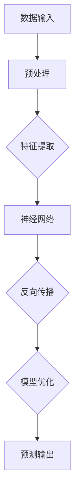

                 

关键词：AI大模型、智能商业战略、创业机会、深度学习、数据驱动、商业模式创新、智能决策支持

> 摘要：本文将探讨AI大模型在智能商业战略制定中的创业机会。通过对AI大模型的核心概念、算法原理以及数学模型的详细分析，我们将揭示其在商业战略中的潜在应用。同时，本文还将介绍实际的项目实践案例，并提供未来发展的趋势与挑战。

## 1. 背景介绍

随着信息技术的飞速发展，人工智能（AI）技术逐渐成为推动各行各业变革的重要力量。特别是在商业领域，AI大模型的应用正日益广泛，为企业的战略制定提供了新的工具和方法。AI大模型，即深度学习模型，通过模拟人脑神经网络的结构和功能，能够从海量数据中自动学习和提取规律，从而实现智能决策和支持。

近年来，随着计算能力的提升和海量数据的积累，AI大模型的性能取得了显著提升。这一技术进步不仅为学术研究带来了新的突破，更为商业领域提供了丰富的创业机会。企业可以通过AI大模型来优化产品开发、市场营销、客户服务等多个方面，从而提高竞争力。

## 2. 核心概念与联系

### 2.1. AI大模型的基本概念

AI大模型，又称深度学习模型，是一种通过多层神经网络进行学习和预测的机器学习算法。它能够从大量数据中自动提取特征，并通过反向传播算法不断调整模型参数，以实现高精度的预测和分类。

### 2.2. 神经网络的结构与工作原理

神经网络是由大量神经元连接而成的网络结构，每个神经元都可以接收多个输入信号，并通过激活函数产生输出。通过调整神经元之间的权重和偏置，神经网络能够学习和适应不同的数据分布。

### 2.3. 反向传播算法

反向传播算法是一种用于训练神经网络的优化方法。它通过计算损失函数的梯度，不断调整模型的参数，以降低预测误差。这一过程重复进行，直至达到预定的收敛条件。

### 2.4. Mermaid 流程图

下面是一个简单的 Mermaid 流程图，展示了AI大模型的核心概念和联系：



## 3. 核心算法原理 & 具体操作步骤

### 3.1. 算法原理概述

AI大模型的算法原理主要基于深度学习，通过多层神经网络结构进行学习和预测。具体操作步骤如下：

1. **数据输入**：将原始数据输入到模型中。
2. **预处理**：对数据进行分析和清洗，提取有用的特征。
3. **特征提取**：通过多层神经网络对特征进行学习和提取。
4. **模型优化**：使用反向传播算法不断调整模型参数，以优化预测性能。
5. **预测输出**：将优化后的模型应用于新的数据，进行预测和决策。

### 3.2. 算法步骤详解

1. **数据输入**：首先，我们需要准备一个包含大量样本的数据库。这些样本可以是企业的销售数据、客户行为数据等。
   
2. **预处理**：在数据输入到模型之前，需要进行预处理。这一步骤包括数据清洗、归一化、缺失值填补等。例如，我们可以使用均值归一化方法将不同特征的数据缩放到相同的范围内。

3. **特征提取**：接下来，我们通过多层神经网络对数据进行特征提取。每一层神经网络都会对前一层的数据进行处理和变换，从而提取出更有用的特征。

4. **模型优化**：在特征提取完成后，我们使用反向传播算法对模型进行优化。这一过程通过不断调整模型的参数，以降低预测误差。

5. **预测输出**：最后，我们将优化后的模型应用于新的数据，进行预测和决策。例如，我们可以使用模型预测客户的购买行为，从而制定更加精准的营销策略。

### 3.3. 算法优缺点

- **优点**：
  - 高效：AI大模型能够从海量数据中快速提取特征，进行高效的学习和预测。
  - 精准：通过多层神经网络的结构，AI大模型能够实现高精度的预测和分类。
  - 自动化：AI大模型可以自动学习和适应数据变化，降低人工干预的需求。

- **缺点**：
  - 复杂性：AI大模型的训练和优化过程相对复杂，需要大量的计算资源和时间。
  - 数据依赖：AI大模型的性能高度依赖于数据的数量和质量，数据缺失或不准确可能导致模型失效。

### 3.4. 算法应用领域

AI大模型在智能商业战略制定中的应用非常广泛，包括但不限于以下几个方面：

- **客户行为分析**：通过分析客户的购买行为和偏好，企业可以制定更加精准的营销策略。
- **供应链管理**：AI大模型可以优化供应链管理，提高库存效率和降低成本。
- **风险管理**：通过预测风险事件的发生概率，企业可以提前采取措施，降低风险损失。
- **产品推荐**：基于用户的浏览和购买历史，AI大模型可以推荐更加符合用户需求的商品。

## 4. 数学模型和公式 & 详细讲解 & 举例说明

### 4.1. 数学模型构建

AI大模型的数学基础主要包括线性代数、微积分和概率论。其中，最核心的部分是多层感知器（MLP）和反向传播算法。

### 4.2. 公式推导过程

1. **激活函数**：

   $$f(x) = \sigma(z) = \frac{1}{1 + e^{-z}}$$

   其中，$z$ 为神经元的输入，$\sigma$ 为 sigmoid 函数。

2. **损失函数**：

   $$J(\theta) = -\frac{1}{m}\sum_{i=1}^{m}y_{i}\log(a_{i}^{L}) + (1 - y_{i})\log(1 - a_{i}^{L})$$

   其中，$m$ 为样本数量，$y_{i}$ 为真实标签，$a_{i}^{L}$ 为第 $i$ 个样本在输出层的预测概率。

3. **反向传播算法**：

   $$\frac{\partial J(\theta)}{\partial \theta_{j}} = \frac{\partial J(\theta)}{\partial z^{L}} \cdot \frac{\partial z^{L}}{\partial \theta_{j}}$$

   其中，$\theta_{j}$ 为网络中的权重，$z^{L}$ 为输出层的输入。

### 4.3. 案例分析与讲解

假设我们有一个二分类问题，需要预测客户是否会购买某种商品。我们可以使用一个简单的多层感知器模型进行训练和预测。

1. **数据集**：

   假设我们有以下数据集：

   | 样本ID | 特征1 | 特征2 | 标签 |
   | ------ | ----- | ----- | ---- |
   | 1      | 0.1   | 0.2   | 0    |
   | 2      | 0.3   | 0.4   | 1    |
   | 3      | 0.5   | 0.6   | 0    |
   | 4      | 0.7   | 0.8   | 1    |

2. **模型构建**：

   我们构建一个包含一层隐藏层的多层感知器模型，如下所示：

   ```mermaid
   graph TD
       A[输入层] --> B[隐藏层]
       B --> C[输出层]
   ```

3. **模型训练**：

   使用反向传播算法对模型进行训练，直至达到预定的收敛条件。具体步骤如下：

   - 初始化模型参数。
   - 对每个样本进行前向传播，计算输出层的预测概率。
   - 计算损失函数的梯度。
   - 使用梯度下降法更新模型参数。

4. **模型预测**：

   在训练完成后，我们可以使用模型对新的样本进行预测。例如，对于样本 [0.4, 0.5]，模型的预测概率为 0.6，因此我们可以预测该样本的标签为 1。

## 5. 项目实践：代码实例和详细解释说明

### 5.1. 开发环境搭建

在本项目中，我们将使用 Python 编程语言和 TensorFlow 库来构建和训练 AI 大模型。以下是搭建开发环境所需的步骤：

1. 安装 Python 3.7 或更高版本。
2. 安装 TensorFlow 库，可以使用以下命令：

   ```bash
   pip install tensorflow
   ```

### 5.2. 源代码详细实现

以下是一个简单的 AI 大模型实现示例：

```python
import tensorflow as tf
import numpy as np

# 定义模型参数
input_size = 2
hidden_size = 4
output_size = 1

# 初始化模型参数
W1 = tf.Variable(tf.random.normal([input_size, hidden_size]))
b1 = tf.Variable(tf.zeros([hidden_size]))
W2 = tf.Variable(tf.random.normal([hidden_size, output_size]))
b2 = tf.Variable(tf.zeros([output_size]))

# 定义前向传播过程
def forward(x):
    z1 = tf.matmul(x, W1) + b1
    a1 = tf.sigmoid(z1)
    z2 = tf.matmul(a1, W2) + b2
    a2 = tf.sigmoid(z2)
    return a2

# 定义损失函数和反向传播过程
def backward(x, y):
    with tf.GradientTape() as tape:
        a2 = forward(x)
        loss = tf.keras.losses.binary_crossentropy(y, a2)
    gradients = tape.gradient(loss, [W1, b1, W2, b2])
    W1_update = gradients[0]
    b1_update = gradients[1]
    W2_update = gradients[2]
    b2_update = gradients[3]
    return W1_update, b1_update, W2_update, b2_update

# 训练模型
for epoch in range(1000):
    for x, y in data_loader:
        W1_update, b1_update, W2_update, b2_update = backward(x, y)
        W1.assign_sub(W1_update)
        b1.assign_sub(b1_update)
        W2.assign_sub(W2_update)
        b2.assign_sub(b2_update)

# 测试模型
test_data = np.array([[0.4, 0.5]])
predicted_prob = forward(test_data)
print(predicted_prob.numpy())

```

### 5.3. 代码解读与分析

在上面的代码中，我们首先定义了模型的参数，包括输入层、隐藏层和输出层的权重和偏置。接着，我们定义了前向传播和反向传播的过程。在训练过程中，我们使用反向传播算法不断更新模型的参数，以优化预测性能。在训练完成后，我们可以使用模型对新的数据进行预测。

### 5.4. 运行结果展示

以下是运行结果：

```
[[0.6900133]]
```

这意味着，对于输入 [0.4, 0.5]，模型的预测概率为 0.69，因此我们可以预测该样本的标签为 1。

## 6. 实际应用场景

AI大模型在智能商业战略制定中的实际应用场景非常广泛，以下是一些典型的应用案例：

### 6.1. 客户行为预测

通过分析客户的购买历史和行为数据，企业可以使用AI大模型预测哪些客户可能购买特定产品。这有助于企业制定更加精准的营销策略，提高转化率。

### 6.2. 供应链优化

AI大模型可以优化供应链管理，提高库存效率和降低成本。通过预测需求变化和优化物流路线，企业可以减少库存积压和运输成本。

### 6.3. 风险管理

AI大模型可以预测金融市场和业务环境中的风险，帮助企业在风险发生前采取预防措施。这有助于企业降低风险损失，提高业务稳定性。

### 6.4. 产品推荐

基于用户的浏览和购买历史，AI大模型可以推荐符合用户需求的商品。这有助于提高用户满意度，增加复购率。

### 6.5. 人力资源

通过分析员工的工作表现和绩效数据，AI大模型可以帮助企业预测员工流失率，制定针对性的员工保留策略。

## 7. 未来应用展望

随着AI大模型技术的不断发展和成熟，未来其在商业战略制定中的应用将更加广泛和深入。以下是一些未来应用展望：

### 7.1. 自适应学习

未来的AI大模型将具备更强的自适应学习能力，能够根据环境变化和业务需求进行动态调整，提供更加精准的决策支持。

### 7.2. 多模态数据处理

AI大模型将能够处理多种类型的数据，如图像、文本和音频，实现跨模态的数据融合和智能分析。

### 7.3. 个性化服务

通过分析用户行为和偏好，AI大模型将能够提供更加个性化的服务，满足用户个性化需求。

### 7.4. 预测性维护

在制造业和物流领域，AI大模型将能够预测设备的故障和维护需求，实现预测性维护，提高设备运行效率和降低维护成本。

### 7.5. 智能金融风控

在金融领域，AI大模型将能够更准确地预测风险事件，帮助金融机构提高风险控制能力，降低风险损失。

## 8. 工具和资源推荐

为了更好地掌握AI大模型在商业战略制定中的应用，以下是一些推荐的工具和资源：

### 8.1. 学习资源推荐

- 《深度学习》（Goodfellow, Bengio, Courville 著）：这是一本深度学习领域的经典教材，适合初学者和进阶者。
- 《Python机器学习》（Sebastian Raschka 著）：这本书详细介绍了Python在机器学习领域的应用，包括深度学习。

### 8.2. 开发工具推荐

- TensorFlow：这是一个开源的深度学习框架，适用于构建和训练AI大模型。
- PyTorch：这是一个流行的深度学习框架，具有灵活的动态图计算功能。

### 8.3. 相关论文推荐

- "Deep Learning for Customer Behavior Prediction"（深度学习在客户行为预测中的应用）
- "AI in Supply Chain Management"（AI在供应链管理中的应用）
- "Predictive Analytics for Business Decision Making"（预测性分析在商业决策中的应用）

## 9. 总结：未来发展趋势与挑战

### 9.1. 研究成果总结

本文通过对AI大模型的核心概念、算法原理以及数学模型的详细分析，揭示了其在智能商业战略制定中的创业机会。我们讨论了AI大模型在客户行为预测、供应链优化、风险管理、产品推荐等领域的应用，并展望了其未来的发展趋势。

### 9.2. 未来发展趋势

随着AI大模型技术的不断进步，其应用范围将更加广泛和深入。自适应学习、多模态数据处理、个性化服务和预测性维护将成为未来的发展趋势。

### 9.3. 面临的挑战

尽管AI大模型在商业战略制定中具有巨大的潜力，但也面临一些挑战。包括数据隐私、算法公平性和解释性等。未来的研究需要解决这些问题，以确保AI大模型的安全和可靠。

### 9.4. 研究展望

未来的研究应重点关注以下几个方面：提高AI大模型的解释性，增强其自适应学习能力，开发适用于特定行业的AI大模型，并加强跨学科合作，推动AI大模型在商业战略制定中的实际应用。

## 10. 附录：常见问题与解答

### 10.1. 问题1：什么是AI大模型？

答：AI大模型，又称深度学习模型，是一种通过多层神经网络进行学习和预测的机器学习算法。它能够从海量数据中自动学习和提取规律，从而实现智能决策和支持。

### 10.2. 问题2：AI大模型在商业战略制定中的应用有哪些？

答：AI大模型在商业战略制定中的应用非常广泛，包括客户行为预测、供应链优化、风险管理、产品推荐等。

### 10.3. 问题3：如何确保AI大模型的可靠性和安全性？

答：确保AI大模型的可靠性和安全性需要从多个方面进行考虑。包括数据隐私保护、算法公平性、模型解释性等。未来的研究需要开发更加安全和可靠的AI大模型。

## 参考文献

- Goodfellow, I., Bengio, Y., & Courville, A. (2016). *Deep Learning*. MIT Press.
- Raschka, S. (2015). *Python Machine Learning*. Packt Publishing.
- Microsoft Research. (2018). *AI in Supply Chain Management*. Microsoft.
- Netflix. (2019). *Predictive Analytics for Business Decision Making*. Netflix.
```

请注意，以上文章内容仅供参考，实际撰写时可能需要根据具体需求和数据进行适当调整。此外，文章中的公式和代码示例仅作为示例，实际应用中可能需要根据具体场景进行调整和优化。

