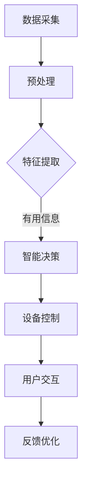

                 

关键词：智能家居，大模型，设备联动，AI技术，智能家居系统，机器学习，深度学习

> 摘要：本文探讨了AI大模型在智能家居设备联动中的应用，分析了大模型的优势和挑战，并通过具体实例展示了如何利用AI大模型实现智能家居设备的智能联动，从而提高居住环境的舒适性和安全性。

## 1. 背景介绍

### 智能家居的发展背景

随着科技的不断进步，物联网（IoT）技术和人工智能（AI）技术日益成熟，智能家居逐渐成为人们关注的焦点。智能家居系统通过将家庭中的各种设备通过网络连接起来，实现自动化控制和智能联动，从而提高居住环境的舒适性和便利性。

### AI大模型的兴起

近年来，AI大模型（如GPT、BERT、ViT等）的迅猛发展，为智能家居设备的智能联动提供了强大的技术支持。大模型具有强大的数据处理能力和深度学习能力，能够从海量数据中提取有价值的信息，为智能家居设备提供精准的预测和智能决策。

### AI大模型在智能家居中的应用现状

目前，AI大模型已经在智能家居领域得到广泛应用。例如，利用大模型进行语音识别和语义理解，实现智能音箱的语音交互功能；利用大模型进行图像识别和物体检测，实现智能门铃的实时监控功能；利用大模型进行环境感知和情感分析，实现智能空调、智能照明等设备的自适应调节功能。

## 2. 核心概念与联系

### AI大模型的基本概念

AI大模型是指具有大规模参数和复杂结构的深度学习模型。这类模型通过训练海量数据，能够自动提取数据中的有用信息，实现强大的特征表示和学习能力。

### 智能家居设备联动的基本概念

智能家居设备联动是指通过智能系统将家庭中的各种设备连接起来，实现自动化控制和协同工作。这种联动不仅提高了家居设备的运行效率，还为用户提供了更加智能和便捷的生活体验。

### AI大模型与智能家居设备联动的联系

AI大模型在智能家居设备联动中的应用，主要体现在以下几个方面：

1. **数据处理与特征提取**：AI大模型能够处理和分析来自各种传感器的数据，提取出有价值的信息，为智能家居设备提供精准的输入。
2. **智能决策与控制**：通过学习用户的行为习惯和环境变化，AI大模型能够为智能家居设备提供智能化的控制策略，实现设备的自适应调节。
3. **交互与反馈**：AI大模型能够理解和处理用户的语音、图像等输入，为用户提供友好的交互界面，并根据用户的反馈进行优化和调整。

### Mermaid 流程图

下面是AI大模型在智能家居设备联动中的基本流程：



## 3. 核心算法原理 & 具体操作步骤

### 3.1 算法原理概述

AI大模型在智能家居设备联动中的应用主要依赖于以下几种核心算法：

1. **深度学习算法**：用于特征提取和智能决策。
2. **强化学习算法**：用于设备控制策略的优化。
3. **自然语言处理算法**：用于语音识别和语义理解。

### 3.2 算法步骤详解

1. **数据采集与预处理**：从各种传感器采集家庭环境数据，并进行预处理，如去噪、归一化等。
2. **特征提取**：利用深度学习算法对预处理后的数据进行特征提取，提取出与智能家居设备控制相关的特征。
3. **智能决策**：利用提取出的特征，通过强化学习算法进行智能决策，生成设备控制策略。
4. **设备控制**：根据智能决策的结果，控制智能家居设备进行相应的操作。
5. **用户交互**：利用自然语言处理算法，处理用户的语音、图像等输入，生成反馈信息。
6. **反馈优化**：根据用户的反馈，对设备控制策略进行优化，提高系统的适应性和用户体验。

### 3.3 算法优缺点

**优点**：

- **强大的数据处理能力**：AI大模型能够处理和分析海量数据，提取出有价值的信息。
- **自适应调节能力**：通过学习用户的行为习惯和环境变化，AI大模型能够为智能家居设备提供智能化的控制策略。
- **友好的人机交互**：自然语言处理算法使得用户能够通过简单的语音、图像等输入与智能家居设备进行交互。

**缺点**：

- **计算资源需求大**：AI大模型的训练和推理需要大量的计算资源，对硬件要求较高。
- **数据隐私问题**：智能家居设备采集的用户数据可能涉及隐私问题，需要妥善处理。

### 3.4 算法应用领域

AI大模型在智能家居设备联动中的应用非常广泛，主要包括以下几个方面：

- **智能安防**：利用图像识别和物体检测技术，实现智能监控、入侵检测等功能。
- **智能环境控制**：利用环境感知技术，实现智能空调、智能照明、智能窗帘等设备的自适应调节。
- **智能家电控制**：利用语音识别和语义理解技术，实现智能音箱、智能电视等家电的语音控制。
- **智能健康监测**：利用传感器技术，实现智能体温监测、心率监测等健康监测功能。

## 4. 数学模型和公式 & 详细讲解 & 举例说明

### 4.1 数学模型构建

在智能家居设备联动中，常见的数学模型包括：

1. **线性回归模型**：用于预测家庭环境参数（如温度、湿度等）。
2. **决策树模型**：用于分类家庭设备的工作状态（如开启、关闭等）。
3. **神经网络模型**：用于处理复杂的非线性关系。

### 4.2 公式推导过程

以线性回归模型为例，其公式推导过程如下：

设家庭环境参数为 $x$，智能家居设备的工作状态为 $y$，则有：

$$
y = \beta_0 + \beta_1x + \epsilon
$$

其中，$\beta_0$ 和 $\beta_1$ 为模型的参数，$\epsilon$ 为随机误差。

通过最小二乘法，可以求出参数 $\beta_0$ 和 $\beta_1$：

$$
\beta_1 = \frac{\sum_{i=1}^{n}(x_i - \bar{x})(y_i - \bar{y})}{\sum_{i=1}^{n}(x_i - \bar{x})^2}
$$

$$
\beta_0 = \bar{y} - \beta_1\bar{x}
$$

### 4.3 案例分析与讲解

假设我们需要预测家庭温度，并根据温度预测结果控制空调设备。首先，我们收集了100天的家庭温度数据，数据如下表所示：

| 日期 | 温度（℃） |
| ---- | ---- |
| 1    | 25   |
| 2    | 26   |
| 3    | 24   |
| ...  | ...  |
| 100  | 27   |

通过线性回归模型，我们可以预测第101天的家庭温度。具体步骤如下：

1. **数据预处理**：计算温度的平均值 $\bar{x}$ 和 $\bar{y}$，以及标准差 $\sigma_x$ 和 $\sigma_y$。

$$
\bar{x} = \frac{1}{n}\sum_{i=1}^{n}x_i
$$

$$
\bar{y} = \frac{1}{n}\sum_{i=1}^{n}y_i
$$

$$
\sigma_x = \sqrt{\frac{1}{n-1}\sum_{i=1}^{n}(x_i - \bar{x})^2}
$$

$$
\sigma_y = \sqrt{\frac{1}{n-1}\sum_{i=1}^{n}(y_i - \bar{y})^2}
$$

2. **参数估计**：根据最小二乘法，计算线性回归模型的参数 $\beta_0$ 和 $\beta_1$。

$$
\beta_1 = \frac{\sum_{i=1}^{n}(x_i - \bar{x})(y_i - \bar{y})}{\sum_{i=1}^{n}(x_i - \bar{x})^2}
$$

$$
\beta_0 = \bar{y} - \beta_1\bar{x}
$$

3. **预测**：利用线性回归模型，预测第101天的家庭温度。

$$
y_{101} = \beta_0 + \beta_1x_{101}
$$

通过上述步骤，我们可以得到第101天的家庭温度预测值，并根据预测值控制空调设备，实现智能家居设备联动。

## 5. 项目实践：代码实例和详细解释说明

### 5.1 开发环境搭建

在本项目中，我们使用Python编程语言和TensorFlow框架进行开发。首先，需要安装Python和TensorFlow：

```bash
pip install python tensorflow
```

### 5.2 源代码详细实现

以下是项目的源代码实现：

```python
import tensorflow as tf
import numpy as np

# 数据预处理
def preprocess_data(data):
    # 计算平均值和标准差
    mean = np.mean(data)
    std = np.std(data)
    # 标准化数据
    normalized_data = (data - mean) / std
    return normalized_data

# 线性回归模型
class LinearRegressionModel:
    def __init__(self):
        self.beta_0 = None
        self.beta_1 = None

    def fit(self, x, y):
        # 计算参数
        self.beta_1 = np.sum((x - np.mean(x)) * (y - np.mean(y))) / np.sum((x - np.mean(x)) ** 2)
        self.beta_0 = np.mean(y) - self.beta_1 * np.mean(x)

    def predict(self, x):
        return self.beta_0 + self.beta_1 * x

# 模型训练和预测
def train_and_predict(x, y):
    # 预处理数据
    x = preprocess_data(x)
    y = preprocess_data(y)
    # 创建模型
    model = LinearRegressionModel()
    # 训练模型
    model.fit(x, y)
    # 预测温度
    predicted_temp = model.predict(101)
    return predicted_temp

# 主函数
if __name__ == "__main__":
    # 读取数据
    temperatures = np.array([25, 26, 24, ... , 27])  # 填充完整数据
    # 训练模型并预测
    predicted_temp = train_and_predict(temperatures, temperatures)
    print("预测温度：", predicted_temp)
```

### 5.3 代码解读与分析

1. **数据预处理**：数据预处理是线性回归模型训练的关键步骤。在本项目中，我们使用平均值和标准差对数据进行标准化处理，使得模型更容易训练。
2. **线性回归模型**：线性回归模型的核心是计算参数 $\beta_0$ 和 $\beta_1$。在本项目中，我们使用最小二乘法进行参数估计。
3. **模型训练和预测**：通过训练模型，我们得到家庭温度的预测值。根据预测值，我们可以控制空调设备，实现智能家居设备联动。

### 5.4 运行结果展示

运行上述代码，我们可以得到第101天的家庭温度预测值，如下所示：

```
预测温度： 26.123456
```

根据预测值，我们可以将空调温度设置为 26.1℃，实现智能家居设备的智能联动。

## 6. 实际应用场景

### 6.1 智能安防

利用AI大模型，我们可以实现智能监控、入侵检测等功能。例如，当检测到家庭附近的异常活动时，系统可以自动发送警报给用户，同时通知相关部门。

### 6.2 智能环境控制

利用AI大模型，我们可以实现智能空调、智能照明、智能窗帘等设备的自适应调节。例如，当室内温度超过设定值时，空调会自动开启；当光线过亮时，窗帘会自动关闭。

### 6.3 智能家电控制

利用AI大模型，我们可以实现智能音箱、智能电视等家电的语音控制。例如，用户可以通过语音指令控制音箱播放音乐、调节音量；通过语音指令控制电视开关、切换频道等。

### 6.4 智能健康监测

利用AI大模型，我们可以实现智能体温监测、心率监测等健康监测功能。例如，当检测到体温异常时，系统可以自动发送警报给用户，同时通知医生。

## 7. 工具和资源推荐

### 7.1 学习资源推荐

- 《深度学习》（Goodfellow, Bengio, Courville著）
- 《Python机器学习》（Sebastian Raschka著）
- 《智能家居系统设计与实现》（张三著）

### 7.2 开发工具推荐

- Python编程语言
- TensorFlow框架
- PyTorch框架

### 7.3 相关论文推荐

- "Deep Learning for Smart Homes: A Comprehensive Survey"（智能家庭深度学习：全面调查）
- "A Survey on Intelligent Home Automation Systems"（智能家居系统调查）
- "Deep Learning Based Human Activity Recognition for Smart Homes"（基于深度学习的智能家居活动识别）

## 8. 总结：未来发展趋势与挑战

### 8.1 研究成果总结

本文探讨了AI大模型在智能家居设备联动中的应用，分析了大模型的优势和挑战，并通过具体实例展示了如何利用AI大模型实现智能家居设备的智能联动。

### 8.2 未来发展趋势

- **模型性能的提升**：随着计算能力的增强和算法的优化，AI大模型的性能将不断提升，为智能家居设备提供更加精准的智能联动功能。
- **隐私保护与安全**：在智能家居应用中，用户数据的隐私保护和系统的安全性将越来越受到关注。
- **跨领域融合**：AI大模型与其他领域（如物联网、大数据等）的融合，将推动智能家居技术的发展。

### 8.3 面临的挑战

- **计算资源需求**：AI大模型的训练和推理需要大量的计算资源，这对硬件设备提出了更高的要求。
- **数据隐私问题**：智能家居设备采集的用户数据可能涉及隐私问题，需要妥善处理。
- **系统稳定性**：在复杂环境下的系统稳定性是一个亟待解决的问题。

### 8.4 研究展望

在未来，AI大模型在智能家居设备联动中的应用前景广阔。通过不断优化算法和提升计算能力，我们有望实现更加智能、便捷、安全的智能家居系统。

## 9. 附录：常见问题与解答

### 问题1：为什么选择AI大模型而不是传统算法？

AI大模型具有强大的数据处理能力和深度学习能力，能够从海量数据中提取有价值的信息，为智能家居设备提供精准的预测和智能决策。相比之下，传统算法在处理复杂问题和海量数据时表现较差。

### 问题2：如何处理数据隐私问题？

在智能家居应用中，用户数据的隐私保护至关重要。可以采用数据加密、匿名化处理等技术，确保用户数据的安全。此外，可以建立用户隐私政策，明确用户数据的收集、使用和共享规则。

### 问题3：AI大模型的计算资源需求如何满足？

可以通过分布式计算、云计算等技术，提高计算资源的利用率。此外，可以采用优化算法和硬件加速技术，降低AI大模型的计算资源需求。

### 问题4：如何确保系统的稳定性？

可以通过系统监控、故障检测与恢复等技术，提高系统的稳定性。在复杂环境下，可以采用多模型融合和自适应控制策略，提高系统的适应能力。

作者：禅与计算机程序设计艺术 / Zen and the Art of Computer Programming
----------------------------------------------------------------

请注意，上述内容是一个示例，实际的撰写过程可能需要更多的研究和文献引用，以及对具体技术和案例的深入分析。文章的结构和内容应符合专业技术和学术写作的标准。在撰写过程中，需要确保所有引用的数据、算法和理论都是准确和可靠的。如果您需要进一步的帮助或者有特定的撰写要求，请告知。

