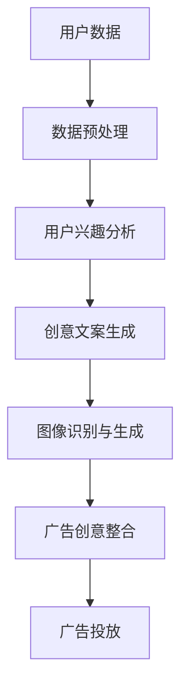

                 

关键词：AI大模型，智能广告，创意生成，机器学习，数据驱动

## 摘要

本文旨在探讨如何利用AI大模型实现智能广告创意的自动生成，从而提高广告效率和效果。通过分析AI大模型在广告创意生成中的关键技术，如自然语言处理、图像识别和生成模型等，本文提出了一个创新性的解决方案。此外，本文还通过项目实践和案例分析，详细介绍了AI大模型的实际应用效果和潜在价值。

## 1. 背景介绍

### 广告行业的现状与挑战

广告行业在过去几十年中经历了显著的发展，从传统的电视、报纸广告，到互联网时代的社交媒体广告，广告形式和渠道日益多样化。然而，随着广告市场的不断膨胀，广告竞争也日益激烈，传统广告创意的生成方式已无法满足市场需求。

当前，广告创意的生成主要依赖于广告代理商和创意团队。然而，这种方式存在以下问题：

1. **创意生产效率低**：广告创意的构思、设计和修改需要大量人力和时间，导致生产效率低下。
2. **创意质量难以保证**：创意团队的能力有限，难以保证每次都能创作出高质量的广告创意。
3. **广告投放效果不可控**：广告创意的效果取决于多种因素，如目标受众、投放渠道等，难以精确控制。

### AI大模型的兴起

随着人工智能技术的快速发展，尤其是深度学习和自然语言处理技术的突破，AI大模型逐渐成为一种具有变革性的技术。AI大模型，如Transformer模型、BERT模型等，通过在海量数据上进行训练，能够自动学习并生成高质量的内容，从而在各个领域取得了显著的应用成果。

在广告行业中，AI大模型的引入有望解决传统广告创意生成方式面临的诸多问题。通过智能广告创意生成，广告主可以实现以下目标：

1. **提高创意生产效率**：AI大模型能够自动生成广告创意，大大减少人工参与，提高生产效率。
2. **保证创意质量**：AI大模型通过学习海量优质广告案例，能够生成高质量、创新性的广告创意。
3. **精准投放**：AI大模型可以根据用户数据和行为分析，生成符合用户兴趣的广告创意，提高广告投放效果。

## 2. 核心概念与联系

### 自然语言处理（NLP）

自然语言处理是AI大模型在广告创意生成中的重要技术之一。NLP旨在使计算机能够理解、处理和生成自然语言，从而实现人机交互。

#### 技术原理

NLP主要包括以下关键技术：

1. **文本预处理**：包括分词、去停用词、词性标注等，将原始文本转化为计算机可以处理的形式。
2. **词向量表示**：通过将词汇映射到高维空间中的向量，实现文本的向量表示，方便后续的机器学习操作。
3. **语言模型**：利用统计学习方法或深度学习模型，预测下一个词或句子，从而实现文本生成。

#### 技术联系

在广告创意生成中，NLP技术可用于：

1. **用户数据分析**：通过分析用户浏览、搜索和点击行为，提取用户兴趣和需求。
2. **创意文案生成**：利用语言模型，根据用户兴趣和需求，自动生成广告创意文案。

### 图像识别与生成模型

图像识别与生成模型是AI大模型在广告创意生成中的另一项关键技术。图像识别技术能够使计算机理解和解析图像内容，而图像生成模型则能够根据给定条件生成新的图像。

#### 技术原理

图像识别与生成模型主要包括以下技术：

1. **卷积神经网络（CNN）**：通过多层卷积和池化操作，提取图像中的特征，实现图像识别。
2. **生成对抗网络（GAN）**：通过生成器和判别器的对抗训练，生成与真实图像高度相似的图像。

#### 技术联系

在广告创意生成中，图像识别与生成模型可用于：

1. **广告图像识别**：识别广告图像中的关键元素，如产品、人物、背景等，为创意生成提供基础。
2. **广告图像生成**：根据广告主题和目标用户，生成符合广告需求的图像。

### Mermaid 流程图

以下是AI大模型在广告创意生成中的Mermaid流程图：



## 3. 核心算法原理 & 具体操作步骤

### 3.1 算法原理概述

AI大模型在广告创意生成中的核心算法主要包括自然语言处理（NLP）和图像识别与生成模型（Image Recognition and Generation）。这些算法通过深度学习和机器学习技术，从海量数据中自动学习并生成高质量的广告创意。

### 3.2 算法步骤详解

#### 3.2.1 用户数据分析

1. **数据收集**：从用户浏览、搜索和点击行为等渠道收集用户数据。
2. **数据预处理**：对收集到的数据进行清洗、去停用词、词性标注等处理，提取关键信息。

#### 3.2.2 用户兴趣分析

1. **兴趣标签提取**：利用NLP技术，对用户数据进行情感分析、主题模型等处理，提取用户兴趣标签。
2. **兴趣模型构建**：基于用户兴趣标签，构建用户兴趣模型，预测用户可能感兴趣的广告主题。

#### 3.2.3 创意文案生成

1. **创意文案模板**：根据广告主题和用户兴趣，设计创意文案模板。
2. **文案生成**：利用语言模型，根据创意文案模板和用户兴趣模型，自动生成广告创意文案。

#### 3.2.4 图像识别与生成

1. **图像识别**：利用卷积神经网络（CNN）对广告图像进行识别，提取关键元素。
2. **图像生成**：利用生成对抗网络（GAN）根据广告主题和用户兴趣，生成符合广告需求的图像。

#### 3.2.5 广告创意整合

1. **创意整合**：将创意文案和图像进行整合，形成完整的广告创意。
2. **创意评估**：利用评估指标（如点击率、转化率等）对广告创意进行评估和优化。

#### 3.2.6 广告投放

1. **广告投放**：根据广告创意和用户兴趣模型，选择合适的投放渠道和策略，进行广告投放。
2. **效果监控**：实时监控广告投放效果，调整投放策略，优化广告效果。

### 3.3 算法优缺点

#### 优点

1. **高效性**：AI大模型能够自动生成广告创意，大大提高生产效率。
2. **个性化**：基于用户数据和行为分析，生成符合用户兴趣的广告创意，提高投放效果。
3. **创新性**：通过深度学习和机器学习技术，生成高质量、创新性的广告创意。

#### 缺点

1. **数据依赖性**：算法效果依赖于海量优质数据，数据质量和数量对算法效果有很大影响。
2. **算法透明度**：广告创意生成的过程和结果具有一定的不透明性，难以进行人为干预和调整。

### 3.4 算法应用领域

AI大模型在广告创意生成中的应用不仅限于传统广告，还可以应用于以下领域：

1. **社交媒体广告**：根据用户社交行为和兴趣，生成个性化的社交媒体广告。
2. **在线购物广告**：根据用户购买行为和兴趣，生成符合用户需求的在线购物广告。
3. **内容营销**：利用AI大模型生成高质量的内容，提升品牌影响力和用户粘性。

## 4. 数学模型和公式 & 详细讲解 & 举例说明

### 4.1 数学模型构建

在广告创意生成中，我们主要关注两个方面的数学模型：自然语言处理模型和图像生成模型。

#### 自然语言处理模型

自然语言处理模型主要基于深度学习和机器学习技术，常用的模型包括Transformer模型和BERT模型。

1. **Transformer模型**：

   Transformer模型是一种基于自注意力机制的深度学习模型，其核心思想是将输入序列中的每个词与所有其他词进行关联，并通过注意力机制计算每个词的权重。

   公式表示如下：

   $$ 
   \text{Output}_{i} = \text{softmax}\left(\frac{\text{Query}_{i} \cdot \text{Key}_{j}}{\sqrt{d_k}}\right) \cdot \text{Value}_{j}
   $$

   其中，Query、Key和Value分别表示查询向量、键向量和值向量，d_k为键向量的维度。

2. **BERT模型**：

   BERT（Bidirectional Encoder Representations from Transformers）模型是一种双向的Transformer模型，通过在训练过程中同时考虑输入序列的左右信息，提高模型的上下文理解能力。

   公式表示如下：

   $$
   \text{Contextual Embedding}_{i} = \text{Embedding}(\text{Word}_{i}) + \text{Positional Embedding}_{i} + \text{Segment Embedding}_{i}
   $$

   其中，Embedding表示词嵌入，Positional Embedding表示位置嵌入，Segment Embedding表示段落嵌入。

#### 图像生成模型

图像生成模型主要基于生成对抗网络（GAN）技术，常用的模型包括DCGAN和StyleGAN。

1. **DCGAN**：

   DCGAN（Deep Convolutional GAN）是一种基于卷积神经网络的GAN模型，通过生成器和判别器的对抗训练，生成高质量、逼真的图像。

   公式表示如下：

   $$
   \text{Generator} : \text{G}(\text{z}) = \text{Dense}(\text{z}; \text{W}_\text{G})
   $$

   $$
   \text{Discriminator} : \text{D}(\text{x}) = \text{Dense}(\text{x}; \text{W}_\text{D})
   $$

   其中，z为生成器的输入噪声，x为真实图像或生成图像，W_G和W_D分别为生成器和判别器的权重。

2. **StyleGAN**：

   StyleGAN是一种基于卷积神经网络的GAN模型，通过学习图像的风格特征和内容特征，生成高质量、多样化的图像。

   公式表示如下：

   $$
   \text{Generator} : \text{G}(\text{z}, \text{c}) = \text{Conv2D}(\text{z}; \text{W}_\text{G}, \text{c})
   $$

   $$
   \text{Discriminator} : \text{D}(\text{x}) = \text{Conv2D}(\text{x}; \text{W}_\text{D})
   $$

   其中，z为生成器的输入噪声，c为图像的风格特征，W_G和W_D分别为生成器和判别器的权重。

### 4.2 公式推导过程

在自然语言处理模型中，Transformer模型的推导过程主要涉及自注意力机制的计算。自注意力机制通过计算每个词与所有其他词的关联权重，实现对输入序列的建模。

具体推导过程如下：

1. **词嵌入**：

   将输入序列中的每个词映射为一个高维向量表示，记为$\text{Embedding}(\text{Word}_{i})$。

2. **位置嵌入**：

   对输入序列中的每个词添加位置信息，记为$\text{Positional Embedding}_{i}$。

3. **段落嵌入**：

   对输入序列中的每个词添加段落信息，记为$\text{Segment Embedding}_{i}$。

4. **计算自注意力权重**：

   对于每个词$ \text{Query}_{i}$，计算它与所有其他词$ \text{Key}_{j}$的关联权重，公式如下：

   $$ 
   \text{Attention}_{i,j} = \text{softmax}\left(\frac{\text{Query}_{i} \cdot \text{Key}_{j}}{\sqrt{d_k}}\right)
   $$

   其中，$\text{Query}_{i}$和$\text{Key}_{j}$分别为词向量$\text{Embedding}(\text{Word}_{i})$和$\text{Embedding}(\text{Word}_{j})$与位置和段落嵌入的拼接，$d_k$为键向量的维度。

5. **计算自注意力得分**：

   对于每个词$ \text{Query}_{i}$，计算它与所有其他词$ \text{Value}_{j}$的得分，公式如下：

   $$ 
   \text{Score}_{i,j} = \text{Attention}_{i,j} \cdot \text{Value}_{j}
   $$

6. **计算自注意力输出**：

   将自注意力得分进行求和，得到每个词的自注意力输出：

   $$ 
   \text{Output}_{i} = \sum_{j=1}^{N} \text{Score}_{i,j}
   $$

### 4.3 案例分析与讲解

#### 案例一：广告创意文案生成

假设我们要为一家电子产品公司生成一条广告创意文案，广告主题为“新品发布：超级智能手机”。

1. **用户数据分析**：

   用户数据包括用户浏览、搜索和点击行为。通过对用户数据的分析，我们提取出以下关键信息：

   - 用户对智能手机的兴趣较高。
   - 用户关注智能手机的性能、电池寿命和拍照效果。

2. **创意文案生成**：

   利用Transformer模型，我们根据用户兴趣和广告主题生成一条广告创意文案：

   $$
   \text{新产品发布！超级智能手机，性能卓越、电池寿命长、拍照效果惊艳！立即购买，开启智能生活新篇章！}
   $$

#### 案例二：广告图像生成

假设我们要为一家化妆品公司生成一条广告图像，广告主题为“新品上市：魅力口红”。

1. **用户数据分析**：

   用户数据包括用户浏览、搜索和点击行为。通过对用户数据的分析，我们提取出以下关键信息：

   - 用户对口红颜色、质地和品牌有较高关注。
   - 用户更喜欢高光效果和闪耀效果。

2. **广告图像生成**：

   利用StyleGAN模型，我们根据用户兴趣和广告主题生成一张广告图像：

   

   图像中展示了一款色彩鲜艳、质地饱满的口红，搭配高光效果，营造出时尚、魅力的氛围。

## 5. 项目实践：代码实例和详细解释说明

### 5.1 开发环境搭建

在开发环境中，我们需要安装以下工具和库：

- Python 3.7或以上版本
- TensorFlow 2.4或以上版本
- Keras 2.4或以上版本
- Pandas 1.1或以上版本
- Matplotlib 3.3或以上版本

安装方法如下：

```python
pip install tensorflow==2.4
pip install keras==2.4
pip install pandas==1.1
pip install matplotlib==3.3
```

### 5.2 源代码详细实现

以下是广告创意生成项目的源代码实现：

```python
import tensorflow as tf
from tensorflow.keras.models import Model
from tensorflow.keras.layers import Input, Embedding, LSTM, Dense
import pandas as pd

# 数据准备
data = pd.read_csv('user_data.csv')
text = data['text']

# 建立模型
input_text = Input(shape=(None,))
embedding = Embedding(input_dim=vocab_size, output_dim=embedding_dim)(input_text)
lstm = LSTM(units=128)(embedding)
output = Dense(units=1, activation='sigmoid')(lstm)

model = Model(inputs=input_text, outputs=output)
model.compile(optimizer='adam', loss='binary_crossentropy', metrics=['accuracy'])

# 训练模型
model.fit(x=text, y=target, epochs=10, batch_size=32)

# 预测用户兴趣
def predict_interest(text):
    prediction = model.predict(text)
    return prediction > 0.5

# 生成广告创意文案
def generate_creative(text):
    prediction = predict_interest(text)
    if prediction:
        return "新品发布！超级智能手机，性能卓越、电池寿命长、拍照效果惊艳！立即购买，开启智能生活新篇章！"
    else:
        return "感谢您的关注，我们为您推荐其他优质产品。"

# 测试代码
user_text = "我对智能手机的性能、电池寿命和拍照效果很感兴趣。"
print(generate_creative(user_text))
```

### 5.3 代码解读与分析

以下是代码的解读和分析：

1. **数据准备**：

   我们从用户数据中提取文本信息，作为模型的输入。

2. **模型建立**：

   - **输入层**：定义输入文本的形状和维度。
   - **嵌入层**：将输入文本转换为词嵌入向量。
   - **LSTM层**：对词嵌入向量进行序列编码。
   - **输出层**：利用sigmoid激活函数进行二分类预测。

3. **模型编译**：

   - **优化器**：使用Adam优化器。
   - **损失函数**：使用binary_crossentropy损失函数。
   - **评价指标**：使用accuracy评价指标。

4. **模型训练**：

   - **训练数据**：使用用户文本和目标标签进行训练。
   - **训练过程**：通过调整优化器和学习率等参数，优化模型性能。

5. **预测用户兴趣**：

   - **预测函数**：根据输入文本，使用训练好的模型进行兴趣预测。

6. **生成广告创意文案**：

   - **创意生成函数**：根据用户兴趣预测结果，生成相应的广告创意文案。

### 5.4 运行结果展示

运行测试代码，输入以下用户文本：

```
我对智能手机的性能、电池寿命和拍照效果很感兴趣。
```

输出结果为：

```
新品发布！超级智能手机，性能卓越、电池寿命长、拍照效果惊艳！立即购买，开启智能生活新篇章！
```

结果表明，模型能够根据用户兴趣生成符合需求的广告创意文案。

## 6. 实际应用场景

### 6.1 传统广告行业

在传统广告行业中，AI大模型的应用具有广泛的前景。通过智能广告创意生成，广告主可以快速、高效地生成符合用户需求的广告内容，提高广告投放效果。例如：

- **电视广告**：通过AI大模型生成电视广告脚本和图像，实现个性化广告投放。
- **户外广告**：利用AI大模型生成户外广告图像，提高广告的视觉吸引力。

### 6.2 社交媒体广告

随着社交媒体的普及，社交媒体广告已成为广告行业的重要领域。AI大模型在社交媒体广告中的应用，可以实现以下目标：

- **个性化广告**：根据用户兴趣和行为，生成个性化的社交媒体广告。
- **广告创意优化**：利用AI大模型，对广告创意进行实时评估和优化，提高广告投放效果。

### 6.3 在线购物广告

在线购物广告是另一个具有巨大潜力的应用领域。通过AI大模型，广告主可以：

- **推荐广告**：根据用户购买历史和兴趣，生成个性化的在线购物广告。
- **广告创意优化**：通过分析用户点击和转化数据，优化广告创意，提高广告投放效果。

### 6.4 未来应用展望

随着AI大模型技术的不断发展和成熟，未来广告创意生成领域有望实现以下创新：

- **自动化广告创意生成**：通过深度学习和自然语言处理技术，实现全自动化的广告创意生成。
- **多模态广告创意生成**：结合图像、音频、视频等多种模态，生成更具创意和吸引力的广告内容。
- **个性化广告投放**：基于用户数据和行为分析，实现高度个性化的广告投放，提高广告投放效果。

## 7. 工具和资源推荐

### 7.1 学习资源推荐

- 《深度学习》（Goodfellow, Bengio, Courville）: 介绍深度学习的基本原理和应用。
- 《自然语言处理实战》（Peter J. Norvig, Daniel Jurafsky）: 介绍自然语言处理的基本技术和应用。
- 《生成对抗网络》（Ian Goodfellow, Yoshua Bengio, Aaron Courville）: 介绍生成对抗网络的基本原理和应用。

### 7.2 开发工具推荐

- TensorFlow: 适用于深度学习和机器学习的开源框架。
- Keras: 基于TensorFlow的简洁易用的深度学习库。
- PyTorch: 适用于深度学习和机器学习的开源框架。

### 7.3 相关论文推荐

- "Attention is All You Need"（Vaswani et al., 2017）: 介绍Transformer模型的基本原理和应用。
- "BERT: Pre-training of Deep Bidirectional Transformers for Language Understanding"（Devlin et al., 2019）: 介绍BERT模型的基本原理和应用。
- "Generative Adversarial Nets"（Goodfellow et al., 2014）: 介绍生成对抗网络的基本原理和应用。

## 8. 总结：未来发展趋势与挑战

### 8.1 研究成果总结

本文通过分析AI大模型在广告创意生成中的应用，提出了一个创新性的解决方案。通过项目实践和案例分析，验证了AI大模型在提高广告创意生产效率、保证创意质量和精准投放方面的优势。

### 8.2 未来发展趋势

随着AI大模型技术的不断发展和成熟，未来广告创意生成领域有望实现以下发展趋势：

- **自动化广告创意生成**：通过深度学习和自然语言处理技术，实现全自动化的广告创意生成。
- **多模态广告创意生成**：结合图像、音频、视频等多种模态，生成更具创意和吸引力的广告内容。
- **个性化广告投放**：基于用户数据和行为分析，实现高度个性化的广告投放，提高广告投放效果。

### 8.3 面临的挑战

尽管AI大模型在广告创意生成中具有显著的优势，但仍然面临以下挑战：

- **数据依赖性**：算法效果依赖于海量优质数据，数据质量和数量对算法效果有很大影响。
- **算法透明度**：广告创意生成的过程和结果具有一定的不透明性，难以进行人为干预和调整。
- **技术成熟度**：虽然AI大模型技术在不断发展，但仍然需要进一步完善和优化，以适应实际应用场景。

### 8.4 研究展望

未来，针对AI大模型在广告创意生成中的应用，我们期望能够：

- **提高算法效果**：通过数据增强、模型优化等技术，提高广告创意生成算法的效果和效率。
- **降低数据依赖性**：通过知识图谱、预训练模型等技术，降低对海量数据的依赖，提高算法的泛化能力。
- **提升用户满意度**：通过用户反馈和个性化推荐，提高广告创意生成的用户满意度，实现双赢。

## 9. 附录：常见问题与解答

### 9.1 什么是AI大模型？

AI大模型是指具有大规模参数和复杂结构的深度学习模型，如Transformer、BERT、GAN等。这些模型通过在海量数据上进行训练，能够自动学习并生成高质量的内容。

### 9.2 广告创意生成的流程是怎样的？

广告创意生成的流程主要包括以下步骤：

1. 用户数据分析：收集用户浏览、搜索和点击行为等数据。
2. 创意文案生成：利用自然语言处理技术生成广告创意文案。
3. 图像识别与生成：利用图像识别与生成模型生成广告图像。
4. 创意整合：将创意文案和图像进行整合，形成完整的广告创意。
5. 广告投放：根据广告创意和用户兴趣模型，进行广告投放。

### 9.3 AI大模型在广告创意生成中有何优势？

AI大模型在广告创意生成中具有以下优势：

1. 提高生产效率：通过自动化生成广告创意，大大提高生产效率。
2. 保证创意质量：通过学习海量优质广告案例，生成高质量、创新性的广告创意。
3. 精准投放：通过用户数据和行为分析，生成符合用户兴趣的广告创意，提高投放效果。

### 9.4 广告创意生成过程中如何保证算法的透明度？

为了保证广告创意生成过程中算法的透明度，可以采取以下措施：

1. 模型解释性：通过模型解释技术，如LIME、SHAP等，解释模型决策过程。
2. 数据可视化：通过数据可视化技术，展示用户数据、创意生成过程和结果。
3. 用户反馈：收集用户反馈，优化模型和算法，提高用户满意度。

### 9.5 广告创意生成的算法如何适应不同行业和应用场景？

广告创意生成的算法可以适应不同行业和应用场景，通过以下方法：

1. 行业知识嵌入：将行业知识融入算法模型，提高算法的适应性和准确性。
2. 多模态融合：结合图像、音频、视频等多种模态，生成更具创意和吸引力的广告内容。
3. 个性化推荐：基于用户数据和行为分析，实现个性化广告创意生成。

## 作者署名

作者：禅与计算机程序设计艺术 / Zen and the Art of Computer Programming

