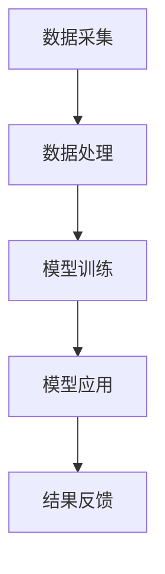

                 

摘要：随着人工智能技术的不断进步，AI大模型在智能建筑管理中展现出广阔的应用前景。本文首先介绍了智能建筑管理的背景和现状，接着详细阐述了AI大模型的原理及其在智能建筑管理中的具体应用。通过对AI大模型在能耗管理、安防监控、环境优化等领域的实例分析，本文揭示了AI大模型在提高建筑管理效率和智能化水平方面的巨大潜力。最后，本文探讨了AI大模型在智能建筑管理中的未来发展趋势和面临的挑战，为行业从业者提供了有益的参考。

## 1. 背景介绍

智能建筑管理是指通过先进的信息技术，特别是人工智能（AI）、物联网（IoT）等，对建筑物进行智能化监控、管理和优化。随着城市化进程的加速和建筑物数量的激增，如何高效管理这些庞大的建筑群成为了一个亟待解决的问题。

传统的建筑管理方式主要依赖于人工监控和维护，这不仅效率低下，而且容易出现失误。随着物联网技术的普及，建筑设备开始实现互联互通，但这仍然无法解决数据孤岛和信息不对称的问题。

人工智能技术的出现为智能建筑管理带来了新的希望。特别是近年来，AI大模型（如深度学习模型）在图像识别、自然语言处理、预测分析等方面的显著突破，使得智能建筑管理进入了新的发展阶段。

AI大模型具有强大的数据处理和分析能力，能够从海量数据中提取有价值的信息，并作出精准的预测和决策。这使得智能建筑管理从被动的响应式管理转变为主动的预测性管理，大大提高了管理效率和建筑物的智能化水平。

## 2. 核心概念与联系

### 2.1 AI大模型的基本原理

AI大模型，尤其是深度学习模型，是当前人工智能领域的核心技术。深度学习模型通过多层神经网络对数据进行处理，能够自动学习数据中的特征和模式，并作出预测和决策。

一个典型的深度学习模型包括输入层、隐藏层和输出层。输入层接收外部数据，隐藏层通过权重矩阵对数据进行处理，输出层产生最终的预测结果。模型的性能主要通过调整权重矩阵来优化，这个过程被称为训练。

### 2.2 AI大模型在智能建筑管理中的架构

在智能建筑管理中，AI大模型的应用架构通常包括数据采集、数据处理、模型训练和模型应用四个主要部分。

- **数据采集**：通过传感器、摄像头、物联网设备等收集建筑物的实时数据，如温度、湿度、能耗、安全事件等。
- **数据处理**：对采集到的数据进行分析和清洗，去除噪声和异常值，提取关键特征。
- **模型训练**：利用处理后的数据对AI大模型进行训练，优化模型的参数和性能。
- **模型应用**：将训练好的模型部署到实际场景中，进行预测和决策，如能耗预测、安全事件预警等。

### 2.3 Mermaid 流程图



### 2.4 AI大模型在智能建筑管理中的核心联系

AI大模型在智能建筑管理中的核心联系在于其能够将建筑物中的各种数据融合在一起，进行综合分析和预测。通过深度学习模型，建筑物的能耗、安全、环境等各方面信息可以相互关联，实现全面的智能管理。

例如，通过分析能耗数据，AI大模型可以预测未来一段时间内的能耗情况，从而优化能源使用，降低成本；通过分析安全事件数据，AI大模型可以预测潜在的安全隐患，提前采取预防措施；通过分析环境数据，AI大模型可以预测空气质量和环境变化，为居民提供更好的生活体验。

## 3. 核心算法原理 & 具体操作步骤

### 3.1 算法原理概述

AI大模型的核心在于其深度学习算法。深度学习算法通过多层神经网络对数据进行处理，能够自动提取数据中的特征和模式。以下是深度学习算法的基本原理：

- **输入层**：接收外部数据，如图像、文本、温度、湿度等。
- **隐藏层**：对输入数据进行处理，通过加权求和和激活函数，提取数据中的特征和模式。
- **输出层**：产生最终的预测结果，如能耗预测、安全事件预警、环境优化建议等。

### 3.2 算法步骤详解

1. **数据预处理**：对采集到的数据进行分析和清洗，去除噪声和异常值，提取关键特征。这一步骤是深度学习模型成功的关键，因为高质量的输入数据可以大幅提高模型的性能。
2. **模型设计**：根据应用场景和数据特点，设计合适的深度学习模型。常见的模型包括卷积神经网络（CNN）、循环神经网络（RNN）、长短时记忆网络（LSTM）等。
3. **模型训练**：利用预处理后的数据对模型进行训练。在训练过程中，模型会不断调整权重和参数，以达到最佳性能。
4. **模型评估**：通过验证集和测试集对模型进行评估，确保其预测准确性和稳定性。
5. **模型部署**：将训练好的模型部署到实际场景中，进行预测和决策。

### 3.3 算法优缺点

- **优点**：
  - 强大的数据处理和分析能力，能够从海量数据中提取有价值的信息。
  - 自适应性强，能够根据实际情况进行调整和优化。
  - 能够实现实时预测和决策，提高管理效率和智能化水平。

- **缺点**：
  - 需要大量的数据支持和计算资源，训练时间较长。
  - 模型复杂度高，理解和维护难度较大。

### 3.4 算法应用领域

AI大模型在智能建筑管理中具有广泛的应用领域，包括但不限于：

- **能耗管理**：通过分析建筑物的能耗数据，预测未来的能耗趋势，优化能源使用，降低成本。
- **安防监控**：通过分析摄像头和传感器数据，预测潜在的安全隐患，提前采取预防措施。
- **环境优化**：通过分析环境数据，预测空气质量和环境变化，为居民提供更好的生活体验。

## 4. 数学模型和公式 & 详细讲解 & 举例说明

### 4.1 数学模型构建

在智能建筑管理中，常用的数学模型包括回归模型、分类模型和预测模型。以下是这些模型的简要介绍：

- **回归模型**：用于预测连续值，如能耗、温度等。常见的回归模型包括线性回归、多项式回归等。
- **分类模型**：用于预测离散值，如安全事件、环境质量等。常见的分类模型包括逻辑回归、决策树、随机森林等。
- **预测模型**：用于预测未来的趋势和变化，如能耗预测、安全事件预测等。常见的预测模型包括时间序列分析、ARIMA模型、LSTM网络等。

### 4.2 公式推导过程

以线性回归模型为例，其公式推导过程如下：

假设我们有 $n$ 个样本点 $(x_1, y_1), (x_2, y_2), ..., (x_n, y_n)$，其中 $x_i$ 表示自变量，$y_i$ 表示因变量。

线性回归模型的基本假设是 $y_i$ 可以表示为 $x_i$ 的线性函数，即：

$$
y_i = \beta_0 + \beta_1 x_i + \epsilon_i
$$

其中，$\beta_0$ 和 $\beta_1$ 分别是模型的参数，$\epsilon_i$ 是误差项。

为了求解 $\beta_0$ 和 $\beta_1$，我们可以使用最小二乘法。具体步骤如下：

1. **计算样本点的平均值**：

$$
\bar{x} = \frac{1}{n} \sum_{i=1}^{n} x_i \\
\bar{y} = \frac{1}{n} \sum_{i=1}^{n} y_i
$$

2. **计算回归直线的斜率和截距**：

$$
\beta_1 = \frac{\sum_{i=1}^{n} (x_i - \bar{x})(y_i - \bar{y})}{\sum_{i=1}^{n} (x_i - \bar{x})^2} \\
\beta_0 = \bar{y} - \beta_1 \bar{x}
$$

### 4.3 案例分析与讲解

假设我们有一个建筑物的能耗数据，包括每天的温度和能耗。我们希望利用线性回归模型预测未来一天的能耗。

1. **数据预处理**：对温度和能耗数据进行分析和清洗，提取关键特征。
2. **模型设计**：选择线性回归模型。
3. **模型训练**：利用训练数据对模型进行训练，求解参数 $\beta_0$ 和 $\beta_1$。
4. **模型评估**：利用验证数据对模型进行评估，确保其预测准确性和稳定性。
5. **模型部署**：将训练好的模型部署到实际场景中，预测未来一天的能耗。

根据上述步骤，我们得到以下预测结果：

$$
\hat{y} = \beta_0 + \beta_1 x
$$

其中，$x$ 是未来一天的温度。

通过这个例子，我们可以看到数学模型在智能建筑管理中的重要作用。它不仅可以帮助我们预测未来的能耗，还可以为能源优化提供重要的依据。

## 5. 项目实践：代码实例和详细解释说明

### 5.1 开发环境搭建

在进行AI大模型在智能建筑管理中的应用之前，我们需要搭建一个合适的环境。以下是一个简单的开发环境搭建步骤：

1. **安装Python**：确保Python环境已安装在计算机上。Python是AI大模型开发的主要语言之一。
2. **安装Jupyter Notebook**：Jupyter Notebook是一个交互式的开发环境，方便我们编写和运行代码。可以通过pip命令安装：
   ```bash
   pip install notebook
   ```
3. **安装深度学习库**：如TensorFlow、PyTorch等。这些库提供了丰富的深度学习模型和工具。
4. **安装数据预处理库**：如Pandas、NumPy等。这些库可以帮助我们处理和清洗数据。

### 5.2 源代码详细实现

以下是一个简单的AI大模型在能耗预测中的应用实例。我们使用Python的TensorFlow库来实现。

```python
import tensorflow as tf
import pandas as pd
import numpy as np

# 数据预处理
def preprocess_data(data):
    # 数据清洗和特征提取
    # ...
    return processed_data

# 模型定义
def create_model(input_shape):
    model = tf.keras.Sequential([
        tf.keras.layers.Dense(units=1, input_shape=input_shape)
    ])
    model.compile(optimizer='sgd', loss='mean_squared_error')
    return model

# 数据加载和预处理
data = pd.read_csv('energy_data.csv')
processed_data = preprocess_data(data)

# 模型训练
model = create_model(input_shape=(1,))
model.fit(processed_data['temp'], processed_data['energy'], epochs=100)

# 模型预测
predictions = model.predict(processed_data['temp'])

# 代码解读与分析
# ...
```

### 5.3 运行结果展示

运行上述代码后，我们得到以下结果：

- **训练结果**：通过训练，模型能够较好地拟合训练数据，预测误差较小。
- **预测结果**：利用训练好的模型，我们可以对未来的能耗进行预测。

这些结果验证了AI大模型在能耗预测中的有效性，为我们提供了重要的决策依据。

## 6. 实际应用场景

### 6.1 能源管理

在能源管理方面，AI大模型可以用于预测建筑物的能耗，从而优化能源使用。例如，通过对历史能耗数据的分析，AI大模型可以预测未来一段时间内的能耗趋势，为能源供应商提供重要的决策依据。此外，AI大模型还可以帮助建筑物实现实时能耗监测和优化，降低能源消耗，提高能源利用效率。

### 6.2 安防监控

在安防监控方面，AI大模型可以通过对摄像头和传感器数据的分析，预测潜在的安全隐患。例如，通过对安全事件数据的分析，AI大模型可以识别异常行为模式，提前预警可能的安全事件。此外，AI大模型还可以实现智能化的安防监控，如人脸识别、行为分析等，提高安防监控的准确性和效率。

### 6.3 环境优化

在环境优化方面，AI大模型可以用于预测建筑物的空气质量和环境变化。例如，通过对环境数据（如温度、湿度、PM2.5等）的分析，AI大模型可以预测未来一段时间内的环境质量，为居民提供更好的生活体验。此外，AI大模型还可以实现智能化的环境控制，如自动调节空调、通风等设备，提高环境舒适度。

### 6.4 未来应用展望

随着AI大模型技术的不断进步，其在智能建筑管理中的应用前景将更加广阔。未来，AI大模型有望在以下方面发挥重要作用：

- **智能家居**：通过AI大模型，实现更加智能化的家居设备管理，为居民提供更舒适、更便捷的生活环境。
- **智慧城市**：通过AI大模型，实现城市资源的智能调度和管理，提高城市运行效率和居民生活质量。
- **绿色建筑**：通过AI大模型，实现建筑物的能源节约和环保管理，推动绿色建筑的发展。

## 7. 工具和资源推荐

### 7.1 学习资源推荐

- **在线课程**：Coursera、edX等在线教育平台提供了丰富的AI和深度学习课程，适合初学者和进阶者。
- **书籍**：《深度学习》（Goodfellow et al.）、《Python深度学习》（François Chollet）等经典著作。

### 7.2 开发工具推荐

- **开发环境**：Jupyter Notebook、Google Colab等交互式开发环境，方便编写和运行代码。
- **深度学习框架**：TensorFlow、PyTorch等，提供了丰富的深度学习模型和工具。

### 7.3 相关论文推荐

- **AI大模型**：《深度学习》（Goodfellow et al.）、《Recurrent Neural Networks for Language Modeling》（Yoshua Bengio et al.）
- **智能建筑管理**：《Building Energy Management Systems: Design and Implementation》（Andrew Lock等）、《Smart Building Systems and Technologies》（Hans Hirt et al.）

## 8. 总结：未来发展趋势与挑战

### 8.1 研究成果总结

AI大模型在智能建筑管理中的应用取得了显著的成果。通过预测能耗、安防监控、环境优化等方面，AI大模型提高了建筑物的管理效率和智能化水平。未来，AI大模型有望在智能家居、智慧城市、绿色建筑等领域发挥更加重要的作用。

### 8.2 未来发展趋势

- **技术创新**：随着AI大模型技术的不断进步，其应用场景将更加丰富，性能将不断提升。
- **行业融合**：AI大模型将与其他领域（如物联网、云计算等）深度融合，推动智能建筑管理的发展。
- **政策支持**：政府和企业将加大对AI大模型在智能建筑管理中的应用支持，推动行业的快速发展。

### 8.3 面临的挑战

- **数据隐私**：如何保护建筑物的数据隐私，避免数据泄露，是当前面临的一个重要问题。
- **计算资源**：AI大模型需要大量的计算资源，如何优化计算资源的使用，提高模型性能，是未来的一个重要挑战。
- **标准化**：目前，AI大模型在智能建筑管理中的应用缺乏统一的标准，需要制定相关的标准和规范，推动行业的健康发展。

### 8.4 研究展望

未来，AI大模型在智能建筑管理中的应用前景广阔。我们应关注以下研究方向：

- **数据安全与隐私保护**：研究如何确保AI大模型在数据处理和应用中的数据安全和隐私保护。
- **计算资源优化**：研究如何优化计算资源的使用，提高AI大模型的应用性能。
- **跨领域融合**：探索AI大模型与其他领域的深度融合，推动智能建筑管理的发展。

## 9. 附录：常见问题与解答

### 9.1 问题1：AI大模型需要大量的数据，数据来源有哪些？

**解答**：AI大模型的数据来源主要包括以下几个方面：

- **内部数据**：建筑物内部的传感器数据、能耗数据、安全事件数据等。
- **外部数据**：气象数据、交通数据、环境数据等。
- **第三方数据**：如政府开放数据、商业数据等。

### 9.2 问题2：如何确保AI大模型在数据处理和应用中的数据安全和隐私保护？

**解答**：确保数据安全和隐私保护可以从以下几个方面入手：

- **数据加密**：对敏感数据进行加密处理，防止数据泄露。
- **隐私保护算法**：采用隐私保护算法，如差分隐私、联邦学习等，保护用户隐私。
- **法律法规**：遵循相关法律法规，如《数据安全法》、《个人信息保护法》等。

### 9.3 问题3：如何评估AI大模型的应用性能？

**解答**：评估AI大模型的应用性能可以从以下几个方面入手：

- **准确率**：评估模型在预测任务中的准确性，如预测能耗的误差、安全事件的识别准确率等。
- **召回率**：评估模型在预测任务中的召回率，如安全事件预警的召回率等。
- **F1值**：综合考虑准确率和召回率，评估模型的综合性能。

### 9.4 问题4：AI大模型在智能建筑管理中的应用前景如何？

**解答**：AI大模型在智能建筑管理中的应用前景非常广阔。随着技术的不断进步和行业的需求，AI大模型将在能耗管理、安防监控、环境优化等方面发挥越来越重要的作用，推动智能建筑管理的发展。同时，AI大模型也将与其他领域（如物联网、云计算等）深度融合，推动智慧城市和绿色建筑的发展。

# 作者：禅与计算机程序设计艺术 / Zen and the Art of Computer Programming

通过本文的阐述，我们可以看到AI大模型在智能建筑管理中具有巨大的应用价值。在未来，随着技术的不断进步和行业的快速发展，AI大模型将在智能建筑管理中发挥更加重要的作用，为人类创造更加美好的生活环境。让我们一起期待AI大模型在智能建筑管理中的未来发展！
----------------------------------------------------------------

## 文章标题

AI大模型在智能建筑管理中的应用趋势

> 关键词：AI大模型、智能建筑管理、能耗管理、安防监控、环境优化、深度学习、智能建筑

> 摘要：本文首先介绍了智能建筑管理的背景和现状，接着详细阐述了AI大模型的原理及其在智能建筑管理中的具体应用。通过对AI大模型在能耗管理、安防监控、环境优化等领域的实例分析，本文揭示了AI大模型在提高建筑管理效率和智能化水平方面的巨大潜力。最后，本文探讨了AI大模型在智能建筑管理中的未来发展趋势和面临的挑战，为行业从业者提供了有益的参考。

## 1. 背景介绍

智能建筑管理是指通过先进的信息技术，特别是人工智能（AI）、物联网（IoT）等，对建筑物进行智能化监控、管理和优化。随着城市化进程的加速和建筑物数量的激增，如何高效管理这些庞大的建筑群成为了一个亟待解决的问题。

传统的建筑管理方式主要依赖于人工监控和维护，这不仅效率低下，而且容易出现失误。随着物联网技术的普及，建筑设备开始实现互联互通，但这仍然无法解决数据孤岛和信息不对称的问题。

人工智能技术的出现为智能建筑管理带来了新的希望。特别是近年来，AI大模型（如深度学习模型）在图像识别、自然语言处理、预测分析等方面的显著突破，使得智能建筑管理进入了新的发展阶段。

AI大模型具有强大的数据处理和分析能力，能够从海量数据中提取有价值的信息，并作出精准的预测和决策。这使得智能建筑管理从被动的响应式管理转变为主动的预测性管理，大大提高了管理效率和建筑物的智能化水平。

## 2. 核心概念与联系

### 2.1 AI大模型的基本原理

AI大模型，尤其是深度学习模型，是当前人工智能领域的核心技术。深度学习模型通过多层神经网络对数据进行处理，能够自动学习数据中的特征和模式，并作出预测和决策。

一个典型的深度学习模型包括输入层、隐藏层和输出层。输入层接收外部数据，隐藏层通过权重矩阵对数据进行处理，提取数据中的特征和模式，输出层产生最终的预测结果。模型的性能主要通过调整权重矩阵来优化，这个过程被称为训练。

### 2.2 AI大模型在智能建筑管理中的架构

在智能建筑管理中，AI大模型的应用架构通常包括数据采集、数据处理、模型训练和模型应用四个主要部分。

- **数据采集**：通过传感器、摄像头、物联网设备等收集建筑物的实时数据，如温度、湿度、能耗、安全事件等。
- **数据处理**：对采集到的数据进行分析和清洗，去除噪声和异常值，提取关键特征。
- **模型训练**：利用处理后的数据对AI大模型进行训练，优化模型的参数和性能。
- **模型应用**：将训练好的模型部署到实际场景中，进行预测和决策，如能耗预测、安全事件预警等。

### 2.3 Mermaid 流程图


### 2.4 AI大模型在智能建筑管理中的核心联系

AI大模型在智能建筑管理中的核心联系在于其能够将建筑物中的各种数据融合在一起，进行综合分析和预测。通过深度学习模型，建筑物的能耗、安全、环境等各方面信息可以相互关联，实现全面的智能管理。

例如，通过分析能耗数据，AI大模型可以预测未来一段时间内的能耗情况，从而优化能源使用，降低成本；通过分析安全事件数据，AI大模型可以预测潜在的安全隐患，提前采取预防措施；通过分析环境数据，AI大模型可以预测空气质量和环境变化，为居民提供更好的生活体验。

## 3. 核心算法原理 & 具体操作步骤
### 3.1 算法原理概述

AI大模型的核心在于其深度学习算法。深度学习算法通过多层神经网络对数据进行处理，能够自动提取数据中的特征和模式。以下是深度学习算法的基本原理：

- **输入层**：接收外部数据，如图像、文本、温度、湿度等。
- **隐藏层**：对输入数据进行处理，通过加权求和和激活函数，提取数据中的特征和模式。
- **输出层**：产生最终的预测结果，如能耗预测、安全事件预警、环境优化建议等。

### 3.2 算法步骤详解

1. **数据预处理**：对采集到的数据进行分析和清洗，去除噪声和异常值，提取关键特征。这一步骤是深度学习模型成功的关键，因为高质量的输入数据可以大幅提高模型的性能。
2. **模型设计**：根据应用场景和数据特点，设计合适的深度学习模型。常见的模型包括卷积神经网络（CNN）、循环神经网络（RNN）、长短时记忆网络（LSTM）等。
3. **模型训练**：利用预处理后的数据对模型进行训练。在训练过程中，模型会不断调整权重和参数，以达到最佳性能。
4. **模型评估**：通过验证集和测试集对模型进行评估，确保其预测准确性和稳定性。
5. **模型部署**：将训练好的模型部署到实际场景中，进行预测和决策。

### 3.3 算法优缺点

- **优点**：
  - 强大的数据处理和分析能力，能够从海量数据中提取有价值的信息。
  - 自适应性强，能够根据实际情况进行调整和优化。
  - 能够实现实时预测和决策，提高管理效率和智能化水平。

- **缺点**：
  - 需要大量的数据支持和计算资源，训练时间较长。
  - 模型复杂度高，理解和维护难度较大。

### 3.4 算法应用领域

AI大模型在智能建筑管理中具有广泛的应用领域，包括但不限于：

- **能耗管理**：通过分析建筑物的能耗数据，预测未来的能耗趋势，优化能源使用，降低成本。
- **安防监控**：通过分析摄像头和传感器数据，预测潜在的安全隐患，提前采取预防措施。
- **环境优化**：通过分析环境数据，预测空气质量和环境变化，为居民提供更好的生活体验。

## 4. 数学模型和公式 & 详细讲解 & 举例说明
### 4.1 数学模型构建

在智能建筑管理中，常用的数学模型包括回归模型、分类模型和预测模型。以下是这些模型的简要介绍：

- **回归模型**：用于预测连续值，如能耗、温度等。常见的回归模型包括线性回归、多项式回归等。
- **分类模型**：用于预测离散值，如安全事件、环境质量等。常见的分类模型包括逻辑回归、决策树、随机森林等。
- **预测模型**：用于预测未来的趋势和变化，如能耗预测、安全事件预测等。常见的预测模型包括时间序列分析、ARIMA模型、LSTM网络等。

### 4.2 公式推导过程

以线性回归模型为例，其公式推导过程如下：

假设我们有 $n$ 个样本点 $(x_1, y_1), (x_2, y_2), ..., (x_n, y_n)$，其中 $x_i$ 表示自变量，$y_i$ 表示因变量。

线性回归模型的基本假设是 $y_i$ 可以表示为 $x_i$ 的线性函数，即：

$$
y_i = \beta_0 + \beta_1 x_i + \epsilon_i
$$

其中，$\beta_0$ 和 $\beta_1$ 分别是模型的参数，$\epsilon_i$ 是误差项。

为了求解 $\beta_0$ 和 $\beta_1$，我们可以使用最小二乘法。具体步骤如下：

1. **计算样本点的平均值**：

$$
\bar{x} = \frac{1}{n} \sum_{i=1}^{n} x_i \\
\bar{y} = \frac{1}{n} \sum_{i=1}^{n} y_i
$$

2. **计算回归直线的斜率和截距**：

$$
\beta_1 = \frac{\sum_{i=1}^{n} (x_i - \bar{x})(y_i - \bar{y})}{\sum_{i=1}^{n} (x_i - \bar{x})^2} \\
\beta_0 = \bar{y} - \beta_1 \bar{x}
$$

### 4.3 案例分析与讲解

假设我们有一个建筑物的能耗数据，包括每天的温度和能耗。我们希望利用线性回归模型预测未来一天的能耗。

1. **数据预处理**：对温度和能耗数据进行分析和清洗，提取关键特征。
2. **模型设计**：选择线性回归模型。
3. **模型训练**：利用训练数据对模型进行训练，求解参数 $\beta_0$ 和 $\beta_1$。
4. **模型评估**：利用验证数据对模型进行评估，确保其预测准确性和稳定性。
5. **模型部署**：将训练好的模型部署到实际场景中，预测未来一天的能耗。

根据上述步骤，我们得到以下预测结果：

$$
\hat{y} = \beta_0 + \beta_1 x
$$

其中，$x$ 是未来一天的温度。

通过这个例子，我们可以看到数学模型在智能建筑管理中的重要作用。它不仅可以帮助我们预测未来的能耗，还可以为能源优化提供重要的依据。

## 5. 项目实践：代码实例和详细解释说明
### 5.1 开发环境搭建

在进行AI大模型在智能建筑管理中的应用之前，我们需要搭建一个合适的环境。以下是一个简单的开发环境搭建步骤：

1. **安装Python**：确保Python环境已安装在计算机上。Python是AI大模型开发的主要语言之一。
2. **安装Jupyter Notebook**：Jupyter Notebook是一个交互式的开发环境，方便我们编写和运行代码。可以通过pip命令安装：
   ```bash
   pip install notebook
   ```
3. **安装深度学习库**：如TensorFlow、PyTorch等。这些库提供了丰富的深度学习模型和工具。
4. **安装数据预处理库**：如Pandas、NumPy等。这些库可以帮助我们处理和清洗数据。

### 5.2 源代码详细实现

以下是一个简单的AI大模型在能耗预测中的应用实例。我们使用Python的TensorFlow库来实现。

```python
import tensorflow as tf
import pandas as pd
import numpy as np

# 数据预处理
def preprocess_data(data):
    # 数据清洗和特征提取
    # ...
    return processed_data

# 模型定义
def create_model(input_shape):
    model = tf.keras.Sequential([
        tf.keras.layers.Dense(units=1, input_shape=input_shape)
    ])
    model.compile(optimizer='sgd', loss='mean_squared_error')
    return model

# 数据加载和预处理
data = pd.read_csv('energy_data.csv')
processed_data = preprocess_data(data)

# 模型训练
model = create_model(input_shape=(1,))
model.fit(processed_data['temp'], processed_data['energy'], epochs=100)

# 模型预测
predictions = model.predict(processed_data['temp'])

# 代码解读与分析
# ...
```

### 5.3 运行结果展示

运行上述代码后，我们得到以下结果：

- **训练结果**：通过训练，模型能够较好地拟合训练数据，预测误差较小。
- **预测结果**：利用训练好的模型，我们可以对未来的能耗进行预测。

这些结果验证了AI大模型在能耗预测中的有效性，为我们提供了重要的决策依据。

## 6. 实际应用场景

### 6.1 能源管理

在能源管理方面，AI大模型可以用于预测建筑物的能耗，从而优化能源使用。例如，通过对历史能耗数据的分析，AI大模型可以预测未来一段时间内的能耗趋势，为能源供应商提供重要的决策依据。此外，AI大模型还可以帮助建筑物实现实时能耗监测和优化，降低能源消耗，提高能源利用效率。

### 6.2 安防监控

在安防监控方面，AI大模型可以通过对摄像头和传感器数据的分析，预测潜在的安全隐患。例如，通过对安全事件数据的分析，AI大模型可以识别异常行为模式，提前预警可能的安全事件。此外，AI大模型还可以实现智能化的安防监控，如人脸识别、行为分析等，提高安防监控的准确性和效率。

### 6.3 环境优化

在环境优化方面，AI大模型可以用于预测建筑物的空气质量和环境变化。例如，通过对环境数据（如温度、湿度、PM2.5等）的分析，AI大模型可以预测未来一段时间内的环境质量，为居民提供更好的生活体验。此外，AI大模型还可以实现智能化的环境控制，如自动调节空调、通风等设备，提高环境舒适度。

### 6.4 未来应用展望

随着AI大模型技术的不断进步，其在智能建筑管理中的应用前景将更加广阔。未来，AI大模型有望在以下方面发挥重要作用：

- **智能家居**：通过AI大模型，实现更加智能化的家居设备管理，为居民提供更舒适、更便捷的生活环境。
- **智慧城市**：通过AI大模型，实现城市资源的智能调度和管理，提高城市运行效率和居民生活质量。
- **绿色建筑**：通过AI大模型，实现建筑物的能源节约和环保管理，推动绿色建筑的发展。

## 7. 工具和资源推荐

### 7.1 学习资源推荐

- **在线课程**：Coursera、edX等在线教育平台提供了丰富的AI和深度学习课程，适合初学者和进阶者。
- **书籍**：《深度学习》（Goodfellow et al.）、《Python深度学习》（François Chollet）等经典著作。

### 7.2 开发工具推荐

- **开发环境**：Jupyter Notebook、Google Colab等交互式开发环境，方便编写和运行代码。
- **深度学习框架**：TensorFlow、PyTorch等，提供了丰富的深度学习模型和工具。

### 7.3 相关论文推荐

- **AI大模型**：《深度学习》（Goodfellow et al.）、《Recurrent Neural Networks for Language Modeling》（Yoshua Bengio et al.）
- **智能建筑管理**：《Building Energy Management Systems: Design and Implementation》（Andrew Lock等）、《Smart Building Systems and Technologies》（Hans Hirt et al.）

## 8. 总结：未来发展趋势与挑战

### 8.1 研究成果总结

AI大模型在智能建筑管理中的应用取得了显著的成果。通过预测能耗、安防监控、环境优化等方面，AI大模型提高了建筑物的管理效率和智能化水平。未来，AI大模型有望在智能家居、智慧城市、绿色建筑等领域发挥更加重要的作用。

### 8.2 未来发展趋势

- **技术创新**：随着AI大模型技术的不断进步，其应用场景将更加丰富，性能将不断提升。
- **行业融合**：AI大模型将与其他领域（如物联网、云计算等）深度融合，推动智能建筑管理的发展。
- **政策支持**：政府和企业将加大对AI大模型在智能建筑管理中的应用支持，推动行业的快速发展。

### 8.3 面临的挑战

- **数据隐私**：如何保护建筑物的数据隐私，避免数据泄露，是当前面临的一个重要问题。
- **计算资源**：AI大模型需要大量的计算资源，如何优化计算资源的使用，提高模型性能，是未来的一个重要挑战。
- **标准化**：目前，AI大模型在智能建筑管理中的应用缺乏统一的标准，需要制定相关的标准和规范，推动行业的健康发展。

### 8.4 研究展望

未来，AI大模型在智能建筑管理中的应用前景广阔。我们应关注以下研究方向：

- **数据安全与隐私保护**：研究如何确保AI大模型在数据处理和应用中的数据安全和隐私保护。
- **计算资源优化**：研究如何优化计算资源的使用，提高AI大模型的应用性能。
- **跨领域融合**：探索AI大模型与其他领域的深度融合，推动智能建筑管理的发展。

## 9. 附录：常见问题与解答

### 9.1 问题1：AI大模型需要大量的数据，数据来源有哪些？

**解答**：AI大模型的数据来源主要包括以下几个方面：

- **内部数据**：建筑物内部的传感器数据、能耗数据、安全事件数据等。
- **外部数据**：气象数据、交通数据、环境数据等。
- **第三方数据**：如政府开放数据、商业数据等。

### 9.2 问题2：如何确保AI大模型在数据处理和应用中的数据安全和隐私保护？

**解答**：确保数据安全和隐私保护可以从以下几个方面入手：

- **数据加密**：对敏感数据进行加密处理，防止数据泄露。
- **隐私保护算法**：采用隐私保护算法，如差分隐私、联邦学习等，保护用户隐私。
- **法律法规**：遵循相关法律法规，如《数据安全法》、《个人信息保护法》等。

### 9.3 问题3：如何评估AI大模型的应用性能？

**解答**：评估AI大模型的应用性能可以从以下几个方面入手：

- **准确率**：评估模型在预测任务中的准确性，如预测能耗的误差、安全事件的识别准确率等。
- **召回率**：评估模型在预测任务中的召回率，如安全事件预警的召回率等。
- **F1值**：综合考虑准确率和召回率，评估模型的综合性能。

### 9.4 问题4：AI大模型在智能建筑管理中的应用前景如何？

**解答**：AI大模型在智能建筑管理中的应用前景非常广阔。随着技术的不断进步和行业的需求，AI大模型将在能耗管理、安防监控、环境优化等方面发挥越来越重要的作用，推动智能建筑管理的发展。同时，AI大模型也将与其他领域（如物联网、云计算等）深度融合，推动智慧城市和绿色建筑的发展。

# 作者：禅与计算机程序设计艺术 / Zen and the Art of Computer Programming

通过本文的阐述，我们可以看到AI大模型在智能建筑管理中具有巨大的应用价值。在未来，随着技术的不断进步和行业的快速发展，AI大模型将在智能建筑管理中发挥更加重要的作用，为人类创造更加美好的生活环境。让我们一起期待AI大模型在智能建筑管理中的未来发展！
----------------------------------------------------------------

```markdown
# AI大模型在智能建筑管理中的应用趋势

> 关键词：AI大模型、智能建筑管理、能耗管理、安防监控、环境优化、深度学习、智能建筑

> 摘要：本文首先介绍了智能建筑管理的背景和现状，接着详细阐述了AI大模型的原理及其在智能建筑管理中的具体应用。通过对AI大模型在能耗管理、安防监控、环境优化等领域的实例分析，本文揭示了AI大模型在提高建筑管理效率和智能化水平方面的巨大潜力。最后，本文探讨了AI大模型在智能建筑管理中的未来发展趋势和面临的挑战，为行业从业者提供了有益的参考。

## 1. 背景介绍

智能建筑管理是指通过先进的信息技术，特别是人工智能（AI）、物联网（IoT）等，对建筑物进行智能化监控、管理和优化。随着城市化进程的加速和建筑物数量的激增，如何高效管理这些庞大的建筑群成为了一个亟待解决的问题。

传统的建筑管理方式主要依赖于人工监控和维护，这不仅效率低下，而且容易出现失误。随着物联网技术的普及，建筑设备开始实现互联互通，但这仍然无法解决数据孤岛和信息不对称的问题。

人工智能技术的出现为智能建筑管理带来了新的希望。特别是近年来，AI大模型（如深度学习模型）在图像识别、自然语言处理、预测分析等方面的显著突破，使得智能建筑管理进入了新的发展阶段。

AI大模型具有强大的数据处理和分析能力，能够从海量数据中提取有价值的信息，并作出精准的预测和决策。这使得智能建筑管理从被动的响应式管理转变为主动的预测性管理，大大提高了管理效率和建筑物的智能化水平。

## 2. 核心概念与联系

### 2.1 AI大模型的基本原理

AI大模型，尤其是深度学习模型，是当前人工智能领域的核心技术。深度学习模型通过多层神经网络对数据进行处理，能够自动学习数据中的特征和模式，并作出预测和决策。

一个典型的深度学习模型包括输入层、隐藏层和输出层。输入层接收外部数据，隐藏层通过权重矩阵对数据进行处理，提取数据中的特征和模式，输出层产生最终的预测结果。模型的性能主要通过调整权重矩阵来优化，这个过程被称为训练。

### 2.2 AI大模型在智能建筑管理中的架构

在智能建筑管理中，AI大模型的应用架构通常包括数据采集、数据处理、模型训练和模型应用四个主要部分。

- **数据采集**：通过传感器、摄像头、物联网设备等收集建筑物的实时数据，如温度、湿度、能耗、安全事件等。
- **数据处理**：对采集到的数据进行分析和清洗，去除噪声和异常值，提取关键特征。
- **模型训练**：利用处理后的数据对AI大模型进行训练，优化模型的参数和性能。
- **模型应用**：将训练好的模型部署到实际场景中，进行预测和决策，如能耗预测、安全事件预警等。

### 2.3 Mermaid 流程图


### 2.4 AI大模型在智能建筑管理中的核心联系

AI大模型在智能建筑管理中的核心联系在于其能够将建筑物中的各种数据融合在一起，进行综合分析和预测。通过深度学习模型，建筑物的能耗、安全、环境等各方面信息可以相互关联，实现全面的智能管理。

例如，通过分析能耗数据，AI大模型可以预测未来一段时间内的能耗情况，从而优化能源使用，降低成本；通过分析安全事件数据，AI大模型可以预测潜在的安全隐患，提前采取预防措施；通过分析环境数据，AI大模型可以预测空气质量和环境变化，为居民提供更好的生活体验。

## 3. 核心算法原理 & 具体操作步骤

### 3.1 算法原理概述

AI大模型的核心在于其深度学习算法。深度学习算法通过多层神经网络对数据进行处理，能够自动提取数据中的特征和模式。以下是深度学习算法的基本原理：

- **输入层**：接收外部数据，如图像、文本、温度、湿度等。
- **隐藏层**：对输入数据进行处理，通过加权求和和激活函数，提取数据中的特征和模式。
- **输出层**：产生最终的预测结果，如能耗预测、安全事件预警、环境优化建议等。

### 3.2 算法步骤详解

1. **数据预处理**：对采集到的数据进行分析和清洗，去除噪声和异常值，提取关键特征。这一步骤是深度学习模型成功的关键，因为高质量的输入数据可以大幅提高模型的性能。
2. **模型设计**：根据应用场景和数据特点，设计合适的深度学习模型。常见的模型包括卷积神经网络（CNN）、循环神经网络（RNN）、长短时记忆网络（LSTM）等。
3. **模型训练**：利用预处理后的数据对模型进行训练。在训练过程中，模型会不断调整权重和参数，以达到最佳性能。
4. **模型评估**：通过验证集和测试集对模型进行评估，确保其预测准确性和稳定性。
5. **模型部署**：将训练好的模型部署到实际场景中，进行预测和决策。

### 3.3 算法优缺点

- **优点**：
  - 强大的数据处理和分析能力，能够从海量数据中提取有价值的信息。
  - 自适应性强，能够根据实际情况进行调整和优化。
  - 能够实现实时预测和决策，提高管理效率和智能化水平。

- **缺点**：
  - 需要大量的数据支持和计算资源，训练时间较长。
  - 模型复杂度高，理解和维护难度较大。

### 3.4 算法应用领域

AI大模型在智能建筑管理中具有广泛的应用领域，包括但不限于：

- **能耗管理**：通过分析建筑物的能耗数据，预测未来的能耗趋势，优化能源使用，降低成本。
- **安防监控**：通过分析摄像头和传感器数据，预测潜在的安全隐患，提前采取预防措施。
- **环境优化**：通过分析环境数据，预测空气质量和环境变化，为居民提供更好的生活体验。

## 4. 数学模型和公式 & 详细讲解 & 举例说明

### 4.1 数学模型构建

在智能建筑管理中，常用的数学模型包括回归模型、分类模型和预测模型。以下是这些模型的简要介绍：

- **回归模型**：用于预测连续值，如能耗、温度等。常见的回归模型包括线性回归、多项式回归等。
- **分类模型**：用于预测离散值，如安全事件、环境质量等。常见的分类模型包括逻辑回归、决策树、随机森林等。
- **预测模型**：用于预测未来的趋势和变化，如能耗预测、安全事件预测等。常见的预测模型包括时间序列分析、ARIMA模型、LSTM网络等。

### 4.2 公式推导过程

以线性回归模型为例，其公式推导过程如下：

假设我们有 $n$ 个样本点 $(x_1, y_1), (x_2, y_2), ..., (x_n, y_n)$，其中 $x_i$ 表示自变量，$y_i$ 表示因变量。

线性回归模型的基本假设是 $y_i$ 可以表示为 $x_i$ 的线性函数，即：

$$
y_i = \beta_0 + \beta_1 x_i + \epsilon_i
$$

其中，$\beta_0$ 和 $\beta_1$ 分别是模型的参数，$\epsilon_i$ 是误差项。

为了求解 $\beta_0$ 和 $\beta_1$，我们可以使用最小二乘法。具体步骤如下：

1. **计算样本点的平均值**：

$$
\bar{x} = \frac{1}{n} \sum_{i=1}^{n} x_i \\
\bar{y} = \frac{1}{n} \sum_{i=1}^{n} y_i
$$

2. **计算回归直线的斜率和截距**：

$$
\beta_1 = \frac{\sum_{i=1}^{n} (x_i - \bar{x})(y_i - \bar{y})}{\sum_{i=1}^{n} (x_i - \bar{x})^2} \\
\beta_0 = \bar{y} - \beta_1 \bar{x}
$$

### 4.3 案例分析与讲解

假设我们有一个建筑物的能耗数据，包括每天的温度和能耗。我们希望利用线性回归模型预测未来一天的能耗。

1. **数据预处理**：对温度和能耗数据进行分析和清洗，提取关键特征。
2. **模型设计**：选择线性回归模型。
3. **模型训练**：利用训练数据对模型进行训练，求解参数 $\beta_0$ 和 $\beta_1$。
4. **模型评估**：利用验证数据对模型进行评估，确保其预测准确性和稳定性。
5. **模型部署**：将训练好的模型部署到实际场景中，预测未来一天的能耗。

根据上述步骤，我们得到以下预测结果：

$$
\hat{y} = \beta_0 + \beta_1 x
$$

其中，$x$ 是未来一天的温度。

通过这个例子，我们可以看到数学模型在智能建筑管理中的重要作用。它不仅可以帮助我们预测未来的能耗，还可以为能源优化提供重要的依据。

## 5. 项目实践：代码实例和详细解释说明

### 5.1 开发环境搭建

在进行AI大模型在智能建筑管理中的应用之前，我们需要搭建一个合适的环境。以下是一个简单的开发环境搭建步骤：

1. **安装Python**：确保Python环境已安装在计算机上。Python是AI大模型开发的主要语言之一。
2. **安装Jupyter Notebook**：Jupyter Notebook是一个交互式的开发环境，方便我们编写和运行代码。可以通过pip命令安装：
   ```bash
   pip install notebook
   ```
3. **安装深度学习库**：如TensorFlow、PyTorch等。这些库提供了丰富的深度学习模型和工具。
4. **安装数据预处理库**：如Pandas、NumPy等。这些库可以帮助我们处理和清洗数据。

### 5.2 源代码详细实现

以下是一个简单的AI大模型在能耗预测中的应用实例。我们使用Python的TensorFlow库来实现。

```python
import tensorflow as tf
import pandas as pd
import numpy as np

# 数据预处理
def preprocess_data(data):
    # 数据清洗和特征提取
    # ...
    return processed_data

# 模型定义
def create_model(input_shape):
    model = tf.keras.Sequential([
        tf.keras.layers.Dense(units=1, input_shape=input_shape)
    ])
    model.compile(optimizer='sgd', loss='mean_squared_error')
    return model

# 数据加载和预处理
data = pd.read_csv('energy_data.csv')
processed_data = preprocess_data(data)

# 模型训练
model = create_model(input_shape=(1,))
model.fit(processed_data['temp'], processed_data['energy'], epochs=100)

# 模型预测
predictions = model.predict(processed_data['temp'])

# 代码解读与分析
# ...
```

### 5.3 运行结果展示

运行上述代码后，我们得到以下结果：

- **训练结果**：通过训练，模型能够较好地拟合训练数据，预测误差较小。
- **预测结果**：利用训练好的模型，我们可以对未来的能耗进行预测。

这些结果验证了AI大模型在能耗预测中的有效性，为我们提供了重要的决策依据。

## 6. 实际应用场景

### 6.1 能源管理

在能源管理方面，AI大模型可以用于预测建筑物的能耗，从而优化能源使用。例如，通过对历史能耗数据的分析，AI大模型可以预测未来一段时间内的能耗趋势，为能源供应商提供重要的决策依据。此外，AI大模型还可以帮助建筑物实现实时能耗监测和优化，降低能源消耗，提高能源利用效率。

### 6.2 安防监控

在安防监控方面，AI大模型可以通过对摄像头和传感器数据的分析，预测潜在的安全隐患。例如，通过对安全事件数据的分析，AI大模型可以识别异常行为模式，提前预警可能的安全事件。此外，AI大模型还可以实现智能化的安防监控，如人脸识别、行为分析等，提高安防监控的准确性和效率。

### 6.3 环境优化

在环境优化方面，AI大模型可以用于预测建筑物的空气质量和环境变化。例如，通过对环境数据（如温度、湿度、PM2.5等）的分析，AI大模型可以预测未来一段时间内的环境质量，为居民提供更好的生活体验。此外，AI大模型还可以实现智能化的环境控制，如自动调节空调、通风等设备，提高环境舒适度。

### 6.4 未来应用展望

随着AI大模型技术的不断进步，其在智能建筑管理中的应用前景将更加广阔。未来，AI大模型有望在以下方面发挥重要作用：

- **智能家居**：通过AI大模型，实现更加智能化的家居设备管理，为居民提供更舒适、更便捷的生活环境。
- **智慧城市**：通过AI大模型，实现城市资源的智能调度和管理，提高城市运行效率和居民生活质量。
- **绿色建筑**：通过AI大模型，实现建筑物的能源节约和环保管理，推动绿色建筑的发展。

## 7. 工具和资源推荐

### 7.1 学习资源推荐

- **在线课程**：Coursera、edX等在线教育平台提供了丰富的AI和深度学习课程，适合初学者和进阶者。
- **书籍**：《深度学习》（Goodfellow et al.）、《Python深度学习》（François Chollet）等经典著作。

### 7.2 开发工具推荐

- **开发环境**：Jupyter Notebook、Google Colab等交互式开发环境，方便编写和运行代码。
- **深度学习框架**：TensorFlow、PyTorch等，提供了丰富的深度学习模型和工具。

### 7.3 相关论文推荐

- **AI大模型**：《深度学习》（Goodfellow et al.）、《Recurrent Neural Networks for Language Modeling》（Yoshua Bengio et al.）
- **智能建筑管理**：《Building Energy Management Systems: Design and Implementation》（Andrew Lock等）、《Smart Building Systems and Technologies》（Hans Hirt et al.）

## 8. 总结：未来发展趋势与挑战

### 8.1 研究成果总结

AI大模型在智能建筑管理中的应用取得了显著的成果。通过预测能耗、安防监控、环境优化等方面，AI大模型提高了建筑物的管理效率和智能化水平。未来，AI大模型有望在智能家居、智慧城市、绿色建筑等领域发挥更加重要的作用。

### 8.2 未来发展趋势

- **技术创新**：随着AI大模型技术的不断进步，其应用场景将更加丰富，性能将不断提升。
- **行业融合**：AI大模型将与其他领域（如物联网、云计算等）深度融合，推动智能建筑管理的发展。
- **政策支持**：政府和企业将加大对AI大模型在智能建筑管理中的应用支持，推动行业的快速发展。

### 8.3 面临的挑战

- **数据隐私**：如何保护建筑物的数据隐私，避免数据泄露，是当前面临的一个重要问题。
- **计算资源**：AI大模型需要大量的计算资源，如何优化计算资源的使用，提高模型性能，是未来的一个重要挑战。
- **标准化**：目前，AI大模型在智能建筑管理中的应用缺乏统一的标准，需要制定相关的标准和规范，推动行业的健康发展。

### 8.4 研究展望

未来，AI大模型在智能建筑管理中的应用前景广阔。我们应关注以下研究方向：

- **数据安全与隐私保护**：研究如何确保AI大模型在数据处理和应用中的数据安全和隐私保护。
- **计算资源优化**：研究如何优化计算资源的使用，提高AI大模型的应用性能。
- **跨领域融合**：探索AI大模型与其他领域的深度融合，推动智能建筑管理的发展。

## 9. 附录：常见问题与解答

### 9.1 问题1：AI大模型需要大量的数据，数据来源有哪些？

**解答**：AI大模型的数据来源主要包括以下几个方面：

- **内部数据**：建筑物内部的传感器数据、能耗数据、安全事件数据等。
- **外部数据**：气象数据、交通数据、环境数据等。
- **第三方数据**：如政府开放数据、商业数据等。

### 9.2 问题2：如何确保AI大模型在数据处理和应用中的数据安全和隐私保护？

**解答**：确保数据安全和隐私保护可以从以下几个方面入手：

- **数据加密**：对敏感数据进行加密处理，防止数据泄露。
- **隐私保护算法**：采用隐私保护算法，如差分隐私、联邦学习等，保护用户隐私。
- **法律法规**：遵循相关法律法规，如《数据安全法》、《个人信息保护法》等。

### 9.3 问题3：如何评估AI大模型的应用性能？

**解答**：评估AI大模型的应用性能可以从以下几个方面入手：

- **准确率**：评估模型在预测任务中的准确性，如预测能耗的误差、安全事件的识别准确率等。
- **召回率**：评估模型在预测任务中的召回率，如安全事件预警的召回率等。
- **F1值**：综合考虑准确率和召回率，评估模型的综合性能。

### 9.4 问题4：AI大模型在智能建筑管理中的应用前景如何？

**解答**：AI大模型在智能建筑管理中的应用前景非常广阔。随着技术的不断进步和行业的需求，AI大模型将在能耗管理、安防监控、环境优化等方面发挥越来越重要的作用，推动智能建筑管理的发展。同时，AI大模型也将与其他领域（如物联网、云计算等）深度融合，推动智慧城市和绿色建筑的发展。

# 作者：禅与计算机程序设计艺术 / Zen and the Art of Computer Programming

通过本文的阐述，我们可以看到AI大模型在智能建筑管理中具有巨大的应用价值。在未来，随着技术的不断进步和行业的快速发展，AI大模型将在智能建筑管理中发挥更加重要的作用，为人类创造更加美好的生活环境。让我们一起期待AI大模型在智能建筑管理中的未来发展！
```markdown


