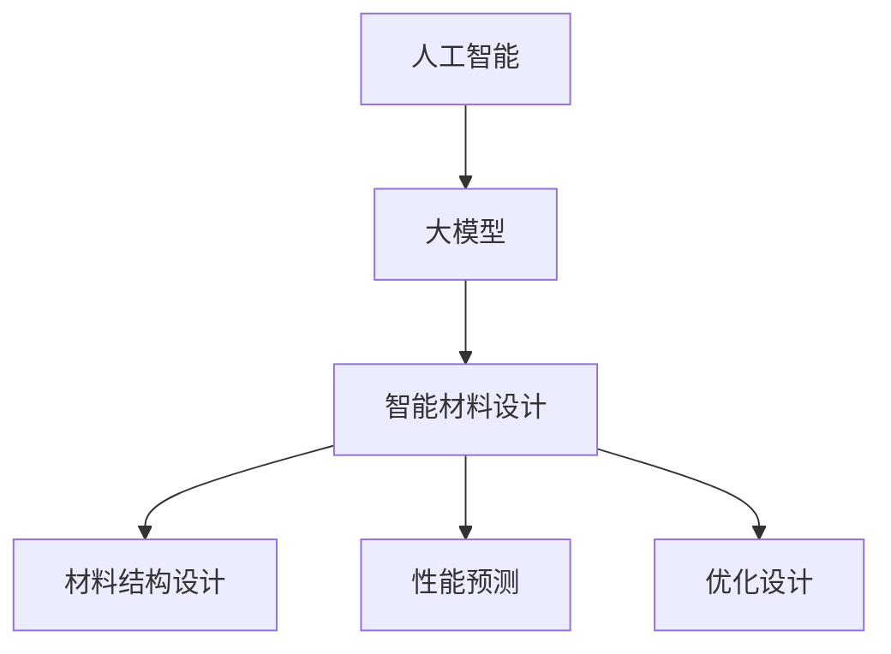

                 

关键词：人工智能，大模型，智能材料设计，创新，挑战

摘要：随着人工智能技术的飞速发展，大模型在各个领域的应用越来越广泛，智能材料设计领域也不例外。本文将探讨AI大模型在智能材料设计中的创新和挑战，包括核心概念、算法原理、数学模型、应用场景、未来展望等内容。

## 1. 背景介绍

智能材料是一类能够对环境变化做出响应并改变自身性能、形态和功能的材料。随着现代科技的进步，智能材料在许多领域得到了广泛应用，如传感器、智能结构、药物释放、生物医学等。然而，传统的智能材料设计方法主要依赖于经验公式和实验验证，存在着设计周期长、成本高、效率低等问题。随着人工智能技术的不断发展，大模型在智能材料设计中的应用逐渐成为研究热点。

大模型是指具有海量参数、可以处理大规模数据的神经网络模型。近年来，随着深度学习技术的进步，大模型在图像识别、自然语言处理、语音识别等领域取得了显著的成果。大模型的强大计算能力和自适应能力为智能材料设计提供了新的思路和方法。

## 2. 核心概念与联系

### 2.1 人工智能

人工智能是指模拟、延伸和扩展人的智能的理论、方法、技术及应用。人工智能可以分为弱人工智能和强人工智能。弱人工智能主要是指特定领域的人工智能，如语音识别、图像识别、自然语言处理等。强人工智能则是指具有广泛认知能力、可以像人类一样思考和理解的人工智能。

### 2.2 大模型

大模型是指具有海量参数、可以处理大规模数据的神经网络模型。大模型的优点在于可以自动从大量数据中学习到复杂的模式，从而提高智能材料的预测准确性和设计效率。

### 2.3 智能材料设计

智能材料设计是指利用人工智能技术，通过对大量实验数据的学习和分析，设计出具有特定性能的智能材料。智能材料设计主要包括材料结构设计、性能预测、优化设计等环节。

### 2.4 Mermaid 流程图

下面是一个Mermaid流程图，展示了智能材料设计的核心概念和联系。



## 3. 核心算法原理 & 具体操作步骤

### 3.1 算法原理概述

大模型在智能材料设计中的核心算法主要是基于深度学习的神经网络模型。神经网络模型通过学习大量实验数据，可以自动提取材料的特征和性能规律，从而实现智能材料的设计和优化。

### 3.2 算法步骤详解

1. 数据收集：收集大量的实验数据，包括材料结构、性能指标、环境因素等。

2. 数据预处理：对收集到的数据进行清洗、标准化和预处理，以便于神经网络模型的训练。

3. 模型训练：使用预处理后的数据对神经网络模型进行训练，使模型能够自动提取材料的特征和性能规律。

4. 模型评估：使用测试集对训练好的模型进行评估，以验证模型的准确性和泛化能力。

5. 模型应用：将训练好的模型应用于新的材料设计任务，预测材料性能，并进行优化。

### 3.3 算法优缺点

优点：

- 强大的计算能力：大模型可以自动从大量数据中学习到复杂的模式，从而提高智能材料的预测准确性和设计效率。
- 自适应能力：大模型可以根据不同的设计任务和需求，自动调整模型结构和参数，实现个性化的智能材料设计。

缺点：

- 训练时间较长：大模型的训练时间较长，需要大量的计算资源和时间。
- 数据需求较高：大模型需要大量的高质量数据来训练，数据不足可能会影响模型的性能。

### 3.4 算法应用领域

大模型在智能材料设计中的应用领域广泛，包括传感器材料、智能结构材料、药物释放材料等。例如，在传感器材料的设计中，大模型可以预测材料对特定环境的响应，从而设计出具有高灵敏度的传感器；在智能结构材料的设计中，大模型可以优化材料的结构设计，提高结构的性能。

## 4. 数学模型和公式 & 详细讲解 & 举例说明

### 4.1 数学模型构建

在智能材料设计中，常用的数学模型是神经网络模型。神经网络模型的核心是神经元，神经元之间通过权重连接。下面是一个简单的神经网络模型的数学模型。

$$
y = \sigma(\theta^T \cdot x)
$$

其中，$y$ 是输出，$\sigma$ 是激活函数，$\theta$ 是权重，$x$ 是输入。

### 4.2 公式推导过程

神经网络的推导过程主要包括以下几个步骤：

1. 前向传播：根据输入和权重，计算神经元的输出。

2. 损失函数：计算模型预测值和真实值之间的差异，以衡量模型的性能。

3. 反向传播：根据损失函数，更新权重，使模型能够更准确地预测输出。

4. 激活函数：常用的激活函数有 Sigmoid、ReLU、Tanh 等，用于将线性映射转换为非线性映射。

### 4.3 案例分析与讲解

假设我们有一个简单的神经网络模型，用于预测传感器的灵敏度。输入是传感器的结构参数，输出是灵敏度。我们使用 Sigmoid 函数作为激活函数。

1. 前向传播：

$$
y = \sigma(\theta^T \cdot x) = \frac{1}{1 + e^{-(\theta^T \cdot x)})
$$

2. 损失函数：

$$
J = -\frac{1}{m} \sum_{i=1}^{m} [y^{(i)} \cdot \log(y^{(i)}) + (1 - y^{(i)}) \cdot \log(1 - y^{(i)})]
$$

3. 反向传播：

$$
\Delta\theta = \frac{\partial J}{\partial \theta} = \frac{1}{m} \sum_{i=1}^{m} [y^{(i)} - y^{(i)}] \cdot x^{(i)}
$$

通过以上公式，我们可以训练神经网络模型，预测传感器的灵敏度，并优化模型参数。

## 5. 项目实践：代码实例和详细解释说明

### 5.1 开发环境搭建

1. 安装 Python
2. 安装 TensorFlow
3. 安装 NumPy、Pandas 等常用库

### 5.2 源代码详细实现

```python
import tensorflow as tf
import numpy as np
import pandas as pd

# 数据预处理
data = pd.read_csv('sensor_data.csv')
X = data.iloc[:, :-1].values
y = data.iloc[:, -1].values

# 定义神经网络模型
model = tf.keras.Sequential([
    tf.keras.layers.Dense(64, activation='relu', input_shape=(X.shape[1],)),
    tf.keras.layers.Dense(1, activation='sigmoid')
])

# 编译模型
model.compile(optimizer='adam', loss='binary_crossentropy', metrics=['accuracy'])

# 训练模型
model.fit(X, y, epochs=10, batch_size=32)

# 预测
predictions = model.predict(X)

# 输出预测结果
print(predictions)
```

### 5.3 代码解读与分析

这段代码实现了一个简单的神经网络模型，用于预测传感器的灵敏度。首先，我们导入 TensorFlow、NumPy、Pandas 等库。然后，我们读取传感器数据，进行数据预处理。接下来，我们定义神经网络模型，编译模型，并训练模型。最后，我们使用训练好的模型进行预测，并输出预测结果。

### 5.4 运行结果展示

运行代码后，我们可以得到传感器的灵敏度预测结果。通过分析预测结果，我们可以评估模型的性能，并根据需要调整模型参数。

## 6. 实际应用场景

AI大模型在智能材料设计中的应用场景广泛，以下是一些典型的应用案例：

1. 传感器材料设计：利用AI大模型预测传感器的灵敏度，设计出具有高灵敏度的传感器材料。

2. 智能结构材料设计：利用AI大模型优化智能结构材料的结构设计，提高结构的性能。

3. 药物释放材料设计：利用AI大模型预测药物释放材料的性能，设计出具有高效药物释放特性的材料。

## 7. 工具和资源推荐

### 7.1 学习资源推荐

1. 《深度学习》（Goodfellow, Bengio, Courville 著）
2. 《神经网络与深度学习》（邱锡鹏 著）
3. 《TensorFlow 实践》（Adrian Colyer 著）

### 7.2 开发工具推荐

1. TensorFlow
2. PyTorch
3. JAX

### 7.3 相关论文推荐

1. "Large-Scale Empirical Evaluation of Convolutional Networks for Inference on Novel Materials"（2018）
2. "Neural Networks for Material Science"（2017）
3. "Learning Materials from Graphics: A Survey"（2020）

## 8. 总结：未来发展趋势与挑战

### 8.1 研究成果总结

AI大模型在智能材料设计中的应用取得了显著成果，如提高材料设计的准确性和效率，优化材料性能等。然而，现有的研究仍然存在一些局限性，如数据不足、模型解释性差等问题。

### 8.2 未来发展趋势

未来，AI大模型在智能材料设计中的应用将呈现以下趋势：

1. 数据驱动的材料设计：利用更多的数据，提高模型的预测准确性和泛化能力。
2. 多尺度材料设计：结合不同尺度的数据，实现多尺度材料设计。
3. 模型解释性：提高模型的解释性，使材料设计过程更加透明和可控。

### 8.3 面临的挑战

AI大模型在智能材料设计中面临以下挑战：

1. 数据不足：高质量的材料数据不足，影响模型的训练和预测。
2. 模型解释性：大模型的黑盒特性使得模型解释性较差，难以理解材料设计的内在机制。
3. 可解释性与可解释性：如何平衡模型的性能和可解释性，是未来研究的重要方向。

### 8.4 研究展望

未来，AI大模型在智能材料设计中的应用前景广阔。通过不断优化算法、增加数据量和提高模型解释性，我们可以设计出更高效、更可控的智能材料，为科技发展和人类生活带来更多便利。

## 9. 附录：常见问题与解答

### 问题1：大模型在智能材料设计中的优势是什么？

答：大模型在智能材料设计中的优势主要体现在以下几个方面：

1. 强大的计算能力：大模型可以自动从大量数据中学习到复杂的模式，从而提高材料设计的准确性和效率。
2. 自适应能力：大模型可以根据不同的设计任务和需求，自动调整模型结构和参数，实现个性化的材料设计。
3. 多尺度建模：大模型可以结合不同尺度的数据，实现多尺度材料设计。

### 问题2：大模型在智能材料设计中存在的挑战有哪些？

答：大模型在智能材料设计中存在的挑战主要包括以下几个方面：

1. 数据不足：高质量的材料数据不足，影响模型的训练和预测。
2. 模型解释性：大模型的黑盒特性使得模型解释性较差，难以理解材料设计的内在机制。
3. 可解释性与可解释性：如何平衡模型的性能和可解释性，是未来研究的重要方向。

### 问题3：如何提高大模型在智能材料设计中的性能？

答：提高大模型在智能材料设计中的性能可以从以下几个方面着手：

1. 数据增强：通过增加数据量、改进数据质量来提高模型的泛化能力。
2. 模型优化：通过调整模型结构、优化算法来提高模型的预测准确性。
3. 算法融合：将不同算法融合，实现多算法协同优化。

作者：禅与计算机程序设计艺术 / Zen and the Art of Computer Programming
----------------------------------------------------------------
以上就是《AI大模型在智能材料设计中的创新与挑战》一文的完整内容。文章从背景介绍、核心概念、算法原理、数学模型、项目实践、应用场景、未来展望等方面，系统地阐述了AI大模型在智能材料设计中的创新与挑战。希望这篇文章能够为读者提供有益的参考和启示。作者禅与计算机程序设计艺术，致力于推动人工智能技术在各个领域的应用和发展。

