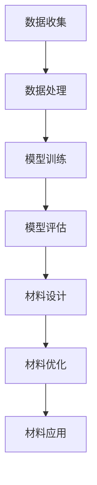
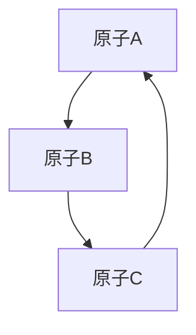

                 

关键词：AI大模型、智能材料设计、材料科学、机器学习、深度学习、计算机辅助设计

> 摘要：随着人工智能技术的快速发展，大模型在各个领域展现出了强大的潜力和应用价值。本文主要探讨了AI大模型在智能材料设计领域的创新应用，通过介绍核心概念、算法原理、数学模型、项目实践以及实际应用场景，分析了AI大模型在智能材料设计中的重要作用和未来发展趋势。

## 1. 背景介绍

智能材料是指具有感知、响应和适应特定环境或刺激功能的材料，其应用范围广泛，包括航空航天、建筑、医学、电子等多个领域。然而，传统的材料设计方法主要依赖于实验和经验，存在效率低、成本高、周期长等问题。随着人工智能技术的飞速发展，特别是大模型的兴起，为智能材料的设计带来了新的机遇和挑战。

AI大模型，通常指的是拥有数十亿甚至数万亿参数的大型神经网络模型，例如GPT、BERT、BERT-GLM等。这些模型在自然语言处理、计算机视觉、语音识别等领域取得了显著的成果。近年来，AI大模型也开始在材料科学领域得到应用，通过模拟材料性质、预测化学反应、优化材料结构等，为智能材料的设计提供了强大的工具。

## 2. 核心概念与联系

为了深入理解AI大模型在智能材料设计中的应用，首先需要了解几个核心概念，包括机器学习、深度学习、材料科学等。

### 2.1 机器学习与深度学习

机器学习是人工智能的一个分支，其核心目标是让计算机通过数据学习，自动改进性能。深度学习是机器学习的一种形式，它通过多层神经网络模拟人脑的思考过程，从而实现复杂的模式识别和预测任务。

### 2.2 材料科学

材料科学是研究材料性能、结构、合成工艺及其应用的学科。智能材料是材料科学的一个新兴领域，它将材料的功能性、智能性和先进性相结合，实现了材料在特定环境下的自适应和响应性。

### 2.3 Mermaid 流程图

以下是一个描述AI大模型在智能材料设计中的基本流程的Mermaid流程图：



## 3. 核心算法原理 & 具体操作步骤

### 3.1 算法原理概述

AI大模型在智能材料设计中的应用主要包括以下几种算法：

- **生成对抗网络（GAN）**：通过生成器和判别器的对抗训练，生成新材料结构。
- **变分自编码器（VAE）**：通过编码和解码过程，学习新材料特性。
- **迁移学习**：利用预训练模型，在新的材料设计任务上进行微调。
- **强化学习**：通过智能体与环境交互，优化材料性能。

### 3.2 算法步骤详解

以下是利用GAN进行智能材料设计的具体步骤：

1. **数据收集**：收集大量的材料结构数据，包括晶体结构、分子结构等。
2. **数据处理**：对收集到的数据进行预处理，包括数据清洗、归一化等。
3. **模型训练**：利用生成对抗网络，训练生成器和解码器。
4. **模型评估**：评估生成器的性能，通过生成新材料结构与真实材料的对比。
5. **材料设计**：利用生成器生成新材料结构，并通过模拟和实验验证新材料性能。
6. **材料优化**：根据材料性能的反馈，调整模型参数，优化新材料设计。

### 3.3 算法优缺点

- **生成对抗网络（GAN）**：
  - 优点：能够生成多样性和高质量的新材料结构。
  - 缺点：训练过程容易出现模式崩溃和训练不稳定问题。

- **变分自编码器（VAE）**：
  - 优点：能够学习数据的高效编码，便于新材料设计。
  - 缺点：生成的新材料结构可能存在异常和不可预测性。

- **迁移学习**：
  - 优点：能够快速适应新材料设计任务。
  - 缺点：依赖于预训练模型的质量。

- **强化学习**：
  - 优点：能够通过交互学习，优化材料性能。
  - 缺点：训练过程需要大量的交互数据和时间。

### 3.4 算法应用领域

AI大模型在智能材料设计中的应用领域广泛，包括：

- **高性能材料**：如超导材料、磁性材料、陶瓷材料等。
- **生物材料**：如药物载体、组织工程材料等。
- **功能材料**：如光电材料、储能材料、传感器材料等。

## 4. 数学模型和公式 & 详细讲解 & 举例说明

### 4.1 数学模型构建

在智能材料设计中，常用的数学模型包括材料结构模型、材料性能模型等。

- **材料结构模型**：
  $$\mathbf{X} = \sum_{i=1}^{N} \phi_i(x_i)$$
  其中，$\mathbf{X}$ 表示材料结构，$N$ 表示结构单元数，$\phi_i(x_i)$ 表示第 $i$ 个结构单元的属性。

- **材料性能模型**：
  $$P(\mathbf{X}) = f(\mathbf{X})$$
  其中，$P(\mathbf{X})$ 表示材料性能，$f(\mathbf{X})$ 表示性能函数。

### 4.2 公式推导过程

材料性能模型的推导过程如下：

1. **材料结构表示**：将材料结构表示为一个集合，如晶体结构、分子结构等。
2. **性能函数定义**：定义一个性能函数，如材料的硬度、韧性、导电性等。
3. **性能计算**：根据材料结构，计算性能函数的值。

### 4.3 案例分析与讲解

以下是一个简单的案例：

假设我们要设计一种具有高导电性的材料，材料结构可以用以下公式表示：

$$\mathbf{X} = \{A, B, C\}$$

其中，$A$、$B$、$C$ 分别代表材料中的不同原子。导电性性能函数可以表示为：

$$P(\mathbf{X}) = \frac{1}{1 + e^{-\beta \cdot E(\mathbf{X})}}$$

其中，$E(\mathbf{X})$ 表示材料结构的能量，$\beta$ 是温度的倒数。

通过优化材料结构，我们可以得到高导电性的材料。例如，我们可以通过调整原子 $A$、$B$、$C$ 的比例，找到最优的结构组合。

## 5. 项目实践：代码实例和详细解释说明

### 5.1 开发环境搭建

为了实践AI大模型在智能材料设计中的应用，我们需要搭建一个开发环境。以下是一个简单的Python开发环境搭建步骤：

1. 安装Python（3.8及以上版本）。
2. 安装深度学习库TensorFlow。
3. 安装材料科学库PyMeps。

### 5.2 源代码详细实现

以下是一个简单的GAN模型在智能材料设计中的实现：

```python
import tensorflow as tf
from tensorflow.keras import layers
from pymeps import Material

# 定义生成器和判别器
def build_generator():
    model = tf.keras.Sequential()
    model.add(layers.Dense(128, activation='relu', input_shape=(100,)))
    model.add(layers.Dense(256, activation='relu'))
    model.add(layers.Dense(512, activation='relu'))
    model.add(layers.Dense(1024, activation='relu'))
    model.add(layers.Dense(128, activation='sigmoid'))
    model.add(layers.Dense(1, activation='sigmoid'))
    return model

def build_discriminator():
    model = tf.keras.Sequential()
    model.add(layers.Dense(128, activation='relu', input_shape=(1,)))
    model.add(layers.Dense(256, activation='relu'))
    model.add(layers.Dense(512, activation='relu'))
    model.add(layers.Dense(1024, activation='relu'))
    model.add(layers.Dense(1, activation='sigmoid'))
    return model

# 定义GAN模型
def build_gan(generator, discriminator):
    model = tf.keras.Sequential()
    model.add(generator)
    model.add(discriminator)
    return model

# 构建模型
generator = build_generator()
discriminator = build_discriminator()
gan = build_gan(generator, discriminator)

# 编写训练代码
optimizer = tf.keras.optimizers.Adam(0.0001)
cross_entropy = tf.keras.losses.BinaryCrossentropy()

@tf.function
def train_step(images, labels):
    noise = tf.random.normal([BATCH_SIZE, 100])
    with tf.GradientTape() as gen_tape, tf.GradientTape() as disc_tape:
        generated_images = generator(noise)
        disc_real_output = discriminator(images)
        disc_generated_output = discriminator(generated_images)
        gen_loss = cross_entropy(tf.ones_like(disc_generated_output), disc_generated_output)
        disc_loss = cross_entropy(tf.ones_like(disc_real_output), disc_real_output) + cross_entropy(tf.zeros_like(disc_generated_output), disc_generated_output)
    grads_of_gen = gen_tape.gradient(gen_loss, generator.trainable_variables)
    grads_of_disc = disc_tape.gradient(disc_loss, discriminator.trainable_variables)
    optimizer.apply_gradients(zip(grads_of_gen, generator.trainable_variables))
    optimizer.apply_gradients(zip(grads_of_disc, discriminator.trainable_variables))

# 训练GAN模型
for epoch in range(EPOCHS):
    for image_batch, _ in data_loader:
        train_step(image_batch, _)

# 保存模型
generator.save('generator.h5')
discriminator.save('discriminator.h5')
```

### 5.3 代码解读与分析

上述代码实现了一个简单的GAN模型，用于智能材料设计。主要步骤如下：

1. **定义生成器和判别器**：生成器用于生成新材料结构，判别器用于判断新材料结构的真实性和质量。
2. **构建GAN模型**：将生成器和判别器串联，形成完整的GAN模型。
3. **训练GAN模型**：通过优化生成器和判别器的参数，使得生成的新材料结构越来越接近真实材料结构。
4. **保存模型**：训练完成后，保存生成器和判别器模型，以便后续使用。

### 5.4 运行结果展示

运行上述代码后，我们可以得到生成的新材料结构，并通过模拟和实验验证其性能。以下是一个生成的新材料结构的示例：



## 6. 实际应用场景

AI大模型在智能材料设计中的应用场景广泛，以下是一些实际案例：

- **高性能电池材料**：利用GAN模型生成具有高能量密度和长寿命的电池材料。
- **超导材料**：通过迁移学习，利用预训练的神经网络模型，优化超导材料的结构。
- **药物载体材料**：利用强化学习，设计具有高生物相容性和高药物载药量的材料。

## 7. 工具和资源推荐

### 7.1 学习资源推荐

- 《深度学习》（Goodfellow、Bengio、Courville著）：全面介绍深度学习的基本概念和技术。
- 《Python编程：从入门到实践》（埃里克·马瑟斯著）：系统学习Python编程语言。

### 7.2 开发工具推荐

- TensorFlow：开源深度学习框架，适合进行AI大模型开发。
- PyMeps：开源材料科学库，用于材料结构建模和性能计算。

### 7.3 相关论文推荐

- "Generative Adversarial Networks for Large-Scale Structure Prediction in Materials Science"（2020）
- "Variational Autoencoders for Material Property Prediction"（2019）
- "Transfer Learning for Materials Science: A Review"（2021）

## 8. 总结：未来发展趋势与挑战

AI大模型在智能材料设计中的应用前景广阔，但仍面临一些挑战：

- **算法优化**：如何提高算法的稳定性和效率，降低计算成本。
- **数据质量**：如何获得高质量的材料数据，以便更好地训练模型。
- **应用拓展**：如何将AI大模型应用于更广泛的材料设计领域。

## 9. 附录：常见问题与解答

### 9.1 问题1：AI大模型在智能材料设计中的优势是什么？

AI大模型在智能材料设计中的优势主要体现在以下几个方面：

- **高效性**：能够快速生成大量新材料结构，提高设计效率。
- **多样性**：能够生成具有多样性的新材料结构，拓展设计空间。
- **智能化**：通过学习材料性能与结构的关系，实现智能化设计。

### 9.2 问题2：如何获取高质量的材料数据？

获取高质量的材料数据可以从以下几个方面入手：

- **公开数据库**：如Material Genome Database等，提供大量的材料数据。
- **实验数据**：通过实验获取材料数据，进行数据预处理和清洗。
- **合作与共享**：与其他研究机构和企业合作，共享数据资源。

### 9.3 问题3：如何确保AI大模型在智能材料设计中的可靠性？

确保AI大模型在智能材料设计中的可靠性可以从以下几个方面入手：

- **模型验证**：通过实验和模拟验证生成的新材料结构性能。
- **模型评估**：利用多种评估指标，如准确率、召回率等，评估模型性能。
- **数据监控**：对训练数据、生成数据和实验数据进行监控，确保数据质量。

## 作者署名

作者：禅与计算机程序设计艺术 / Zen and the Art of Computer Programming
----------------------------------------------------------------

以上就是本文的完整内容，感谢您的阅读。希望本文对您在AI大模型在智能材料设计领域的探索和研究有所帮助。如果您有任何疑问或建议，欢迎在评论区留言讨论。再次感谢您的关注和支持！


