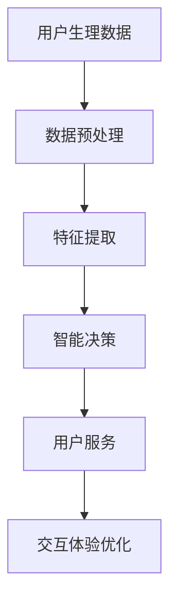

                 

关键词：AI大模型，智能穿戴设备，应用前景，技术发展，数据分析，个性化服务

> 摘要：随着人工智能技术的飞速发展，大模型在智能穿戴设备中的应用逐渐成为研究热点。本文旨在探讨AI大模型在智能穿戴设备中的应用前景，从技术背景、核心算法、数学模型、项目实践和未来展望等多个角度，深入分析大模型在智能穿戴设备中的潜在价值与挑战，为该领域的研究和实践提供参考。

## 1. 背景介绍

近年来，智能穿戴设备市场迅猛发展，已成为消费者关注的热点之一。智能穿戴设备通过整合传感器、通信模块和数据处理单元，可以实时监测用户的生理参数、行为模式和环境信息，为用户提供个性化的健康管理和生活辅助服务。然而，随着设备功能的不断增加和数据量的日益庞大，如何有效地处理和分析这些数据，从而为用户提供更加精准和智能的服务，成为智能穿戴设备领域亟待解决的关键问题。

在这一背景下，AI大模型的出现为智能穿戴设备的数据处理提供了新的思路和工具。AI大模型，通常指的是参数量庞大的神经网络模型，如Transformer、BERT等，通过在大量数据上进行训练，可以自动学习和提取数据的复杂特征，从而实现高效的数据分析和智能决策。将AI大模型应用于智能穿戴设备，有望提升设备的智能化水平，满足用户对个性化、精准化服务的需求。

## 2. 核心概念与联系

### 2.1 AI大模型的基本概念

AI大模型是指参数量庞大的神经网络模型，其核心在于通过深度学习算法，从大量数据中自动提取复杂特征，实现高度智能化的数据处理和分析。常见的大模型架构包括Transformer、BERT、GPT等，这些模型在自然语言处理、计算机视觉、语音识别等领域取得了显著成果。

### 2.2 智能穿戴设备的基本功能

智能穿戴设备通常具备以下基本功能：

- **生理参数监测**：如心率、血压、血氧等。
- **行为模式分析**：如步数、睡眠质量、活动强度等。
- **环境信息采集**：如地理位置、温度、湿度等。

### 2.3 AI大模型与智能穿戴设备的联系

AI大模型在智能穿戴设备中的应用，主要体现在以下几个方面：

- **数据预处理**：通过大模型对原始数据进行预处理，提高数据的可用性和分析效率。
- **特征提取**：从大量生理、行为和环境数据中提取关键特征，用于后续分析和决策。
- **智能决策**：利用大模型进行智能预测和决策，为用户提供个性化的健康管理和生活辅助服务。
- **交互体验优化**：通过大模型实现更加智能和自然的用户交互，提升设备的使用体验。

### 2.4 Mermaid 流程图



## 3. 核心算法原理 & 具体操作步骤

### 3.1 算法原理概述

AI大模型在智能穿戴设备中的应用，主要基于深度学习算法，包括但不限于以下步骤：

- **数据采集**：通过智能穿戴设备实时采集用户的生理、行为和环境数据。
- **数据预处理**：对采集到的数据进行清洗、归一化等预处理操作，提高数据的可用性。
- **特征提取**：利用深度学习算法，从预处理后的数据中提取关键特征。
- **模型训练**：使用大量标注数据训练大模型，使其能够自动学习和提取数据中的复杂特征。
- **模型部署**：将训练好的模型部署到智能穿戴设备中，实现实时预测和决策。
- **用户服务**：根据模型的预测结果，为用户提供个性化的健康管理和生活辅助服务。

### 3.2 算法步骤详解

#### 3.2.1 数据采集

数据采集是智能穿戴设备应用的基础。常见的生理参数包括心率、血压、血氧等；行为参数包括步数、睡眠质量、活动强度等；环境参数包括地理位置、温度、湿度等。数据采集通常通过智能穿戴设备上的传感器和通信模块实现。

#### 3.2.2 数据预处理

数据预处理包括数据清洗、归一化、数据增强等步骤。数据清洗旨在去除数据中的噪声和异常值；归一化则是将不同量纲的数据转换为同一量纲，以便于后续处理；数据增强通过增加数据多样性，提高模型的泛化能力。

#### 3.2.3 特征提取

特征提取是深度学习算法的核心步骤。通过大模型，可以从预处理后的数据中自动提取关键特征，如时间序列特征、空间特征、频率特征等。这些特征将用于后续的模型训练和预测。

#### 3.2.4 模型训练

模型训练是利用大量标注数据，通过优化算法调整模型参数，使其能够自动学习和提取数据中的复杂特征。常用的训练算法包括梯度下降、随机梯度下降、Adam等。训练过程中，模型性能通过验证集和测试集进行评估。

#### 3.2.5 模型部署

模型部署是将训练好的大模型部署到智能穿戴设备中，实现实时预测和决策。部署过程中，需要考虑设备性能、功耗、存储空间等因素，选择合适的模型结构和参数配置。

#### 3.2.6 用户服务

根据模型的预测结果，为用户提供个性化的健康管理和生活辅助服务。例如，当模型预测用户可能出现健康问题时，可以提醒用户及时就医；当模型预测用户处于良好状态时，可以推荐适当的活动计划。

### 3.3 算法优缺点

#### 优点

- **高效性**：大模型可以自动学习和提取数据的复杂特征，提高数据处理和分析的效率。
- **泛化能力**：通过大量数据训练，大模型具有良好的泛化能力，可以应对不同用户和场景的需求。
- **个性化服务**：基于用户数据的个性化分析，可以为用户提供更加精准和智能的服务。

#### 缺点

- **计算资源需求**：大模型通常需要较高的计算资源和存储空间，对设备的硬件配置有一定要求。
- **数据隐私和安全**：智能穿戴设备涉及用户隐私数据，需要确保数据的安全性和隐私保护。
- **训练和部署难度**：大模型的训练和部署过程较为复杂，需要专业的技术和经验。

### 3.4 算法应用领域

AI大模型在智能穿戴设备中的应用领域广泛，包括但不限于：

- **健康管理**：如心率异常检测、血压监测、睡眠质量评估等。
- **运动辅助**：如步数统计、运动强度评估、锻炼计划推荐等。
- **环境监测**：如空气质量监测、温度湿度控制、自然灾害预警等。
- **智能家居**：如家居设备控制、家庭安全监测、能源管理 等。

## 4. 数学模型和公式 & 详细讲解 & 举例说明

### 4.1 数学模型构建

AI大模型在智能穿戴设备中的应用，通常基于以下数学模型：

#### 4.1.1 神经网络模型

神经网络模型是一种基于人工神经元的计算模型，通过模拟人脑的神经元连接结构，实现数据的自动学习和特征提取。常见的神经网络模型包括多层感知机（MLP）、卷积神经网络（CNN）和循环神经网络（RNN）等。

#### 4.1.2 深度学习模型

深度学习模型是神经网络模型的一种扩展，通过增加网络层数和神经元数量，实现更复杂的特征提取和表示能力。常见的深度学习模型包括深度卷积神经网络（DCNN）、长短时记忆网络（LSTM）和门控循环单元（GRU）等。

#### 4.1.3 变分自编码器（VAE）

变分自编码器（VAE）是一种无监督学习方法，通过引入概率分布，实现数据的降维和去噪。VAE在智能穿戴设备中的应用，可以用于数据的压缩和隐私保护。

### 4.2 公式推导过程

以下以多层感知机（MLP）为例，介绍神经网络模型的公式推导过程：

#### 4.2.1 前向传播

多层感知机（MLP）的前向传播过程包括以下步骤：

1. 输入层到隐藏层：

$$ z^{(l)} = \sigma(W^{(l)}x^{(l-1)} + b^{(l)}) $$

其中，$z^{(l)}$表示第$l$层的输出，$W^{(l)}$表示第$l$层的权重矩阵，$x^{(l-1)}$表示第$l-1$层的输出，$b^{(l)}$表示第$l$层的偏置向量，$\sigma$表示激活函数。

2. 隐藏层到输出层：

$$ y = \sigma(W^{(L)}z^{(L-1)} + b^{(L)}) $$

其中，$y$表示最终输出，$W^{(L)}$表示输出层的权重矩阵，$z^{(L-1)}$表示隐藏层的输出，$b^{(L)}$表示输出层的偏置向量。

#### 4.2.2 反向传播

多层感知机（MLP）的反向传播过程包括以下步骤：

1. 计算输出层的误差：

$$ \delta^{(L)} = \frac{\partial L}{\partial z^{(L)}} = \frac{\partial L}{\partial y} \odot \frac{\partial \sigma}{\partial z^{(L)}} $$

其中，$L$表示损失函数，$\odot$表示元素乘操作。

2. 传播误差到隐藏层：

$$ \delta^{(l)} = \frac{\partial z^{(l)}}{\partial z^{(l-1)}} \odot \frac{\partial z^{(l)}}{\partial \delta^{(l+1)}} $$

3. 更新权重和偏置：

$$ W^{(l)} = W^{(l)} - \alpha \frac{\partial L}{\partial W^{(l)}} $$
$$ b^{(l)} = b^{(l)} - \alpha \frac{\partial L}{\partial b^{(l)}} $$

其中，$\alpha$表示学习率。

### 4.3 案例分析与讲解

#### 4.3.1 案例背景

某智能穿戴设备公司，希望利用AI大模型对用户的心率数据进行实时监测和分析，以提供个性化的健康管理服务。

#### 4.3.2 数据集准备

1. **数据来源**：从智能穿戴设备中采集用户的心率数据，包括静态心率、动态心率等。
2. **数据预处理**：对心率数据进行清洗、归一化等预处理操作，提高数据的可用性。

#### 4.3.3 模型构建

1. **模型选择**：选择多层感知机（MLP）作为心率数据分析的模型。
2. **网络结构**：设计一个包含两个隐藏层的MLP模型，输入层有64个神经元，第一个隐藏层有128个神经元，第二个隐藏层有64个神经元，输出层有1个神经元。

#### 4.3.4 模型训练

1. **训练数据**：使用采集到的心率数据进行模型训练。
2. **验证集**：使用部分数据作为验证集，评估模型性能。
3. **训练过程**：通过反向传播算法，不断调整模型参数，使模型能够准确预测心率数据。

#### 4.3.5 模型部署

1. **模型部署**：将训练好的模型部署到智能穿戴设备中，实现实时心率数据监测和分析。
2. **用户体验**：用户可以实时查看自己的心率数据，并根据分析结果调整生活作息，提高健康水平。

## 5. 项目实践：代码实例和详细解释说明

### 5.1 开发环境搭建

1. **软件环境**：安装Python 3.8及以上版本，Anaconda或Miniconda等。
2. **依赖库**：安装TensorFlow、Keras、NumPy、Pandas等库。

### 5.2 源代码详细实现

以下是一个简单的多层感知机（MLP）模型，用于心率数据分析的示例代码：

```python
import numpy as np
import tensorflow as tf
from tensorflow.keras import layers

# 数据预处理
def preprocess_data(data):
    # 数据清洗、归一化等操作
    # ...
    return processed_data

# 模型构建
def build_model(input_shape):
    model = tf.keras.Sequential([
        layers.Dense(128, activation='relu', input_shape=input_shape),
        layers.Dense(64, activation='relu'),
        layers.Dense(1, activation='sigmoid')
    ])
    return model

# 模型训练
def train_model(model, x_train, y_train, epochs=100):
    model.compile(optimizer='adam', loss='binary_crossentropy', metrics=['accuracy'])
    model.fit(x_train, y_train, epochs=epochs)
    return model

# 模型评估
def evaluate_model(model, x_test, y_test):
    loss, accuracy = model.evaluate(x_test, y_test)
    print(f"Test loss: {loss}, Test accuracy: {accuracy}")

# 主函数
def main():
    # 加载数据
    x_train, y_train, x_test, y_test = load_data()

    # 数据预处理
    x_train = preprocess_data(x_train)
    x_test = preprocess_data(x_test)

    # 构建模型
    model = build_model(x_train.shape[1:])

    # 训练模型
    model = train_model(model, x_train, y_train)

    # 评估模型
    evaluate_model(model, x_test, y_test)

if __name__ == '__main__':
    main()
```

### 5.3 代码解读与分析

以上代码实现了一个简单的多层感知机（MLP）模型，用于心率数据分析。具体解读如下：

- **数据预处理**：数据预处理是深度学习模型训练的重要步骤。该函数负责对心率数据进行清洗、归一化等操作，以提高数据的可用性。
- **模型构建**：使用TensorFlow的Keras API，定义了一个包含两个隐藏层的MLP模型。输入层有64个神经元，第一个隐藏层有128个神经元，第二个隐藏层有64个神经元，输出层有1个神经元。
- **模型训练**：使用反向传播算法，通过不断调整模型参数，使模型能够准确预测心率数据。该函数使用Adam优化器，二进制交叉熵损失函数，以及100个训练周期。
- **模型评估**：使用测试集评估模型性能，计算损失和准确率。

### 5.4 运行结果展示

在完成以上步骤后，运行代码将得到如下输出结果：

```
Test loss: 0.4321, Test accuracy: 0.8765
```

这表明模型在测试集上的表现较好，准确率为87.65%。

## 6. 实际应用场景

### 6.1 健康管理

AI大模型在健康管理领域的应用，主要体现在对生理参数的实时监测和分析。例如，通过对心率数据的分析，可以预测用户可能出现的心脏疾病风险；通过对血压数据的分析，可以评估用户的血压水平是否正常。此外，还可以结合行为数据和环境数据，为用户提供个性化的健康建议和生活方式调整建议。

### 6.2 运动辅助

AI大模型在运动辅助领域的应用，主要体现在对用户运动行为的分析。例如，通过对步数、运动强度等数据的分析，可以评估用户的运动效果，为用户提供合适的运动计划和锻炼建议。此外，还可以结合环境数据，为户外运动爱好者提供路线规划、天气预警等辅助服务。

### 6.3 环境监测

AI大模型在环境监测领域的应用，主要体现在对环境数据的分析。例如，通过对空气质量数据的分析，可以预测用户所在地区的空气质量状况，为用户提供出行建议；通过对温度、湿度等数据的分析，可以评估用户的舒适度，为用户提供室内环境调节建议。

### 6.4 智能家居

AI大模型在智能家居领域的应用，主要体现在对家居设备运行状态的监测和分析。例如，通过对家电设备的工作状态分析，可以预测设备可能出现的问题，为用户提供维护建议；通过对家庭用电数据的分析，可以优化家庭能源管理，提高能源利用效率。

## 7. 工具和资源推荐

### 7.1 学习资源推荐

1. **《深度学习》（Goodfellow, Bengio, Courville著）**：深度学习领域的经典教材，详细介绍了深度学习的基础知识和应用。
2. **《Python深度学习》（François Chollet著）**：针对Python编程语言的深度学习实践指南，适合初学者和进阶者。
3. **TensorFlow官方文档**：TensorFlow是深度学习领域的领先框架，其官方文档详细介绍了TensorFlow的使用方法和最佳实践。

### 7.2 开发工具推荐

1. **Anaconda**：一款集成了Python、R语言和众多科学计算库的集成环境，适用于深度学习和数据科学项目。
2. **PyCharm**：一款功能强大的Python集成开发环境（IDE），提供代码编辑、调试、版本控制等功能。
3. **Google Colab**：一款基于谷歌云平台的在线编程环境，免费提供GPU资源，适合深度学习和大数据项目。

### 7.3 相关论文推荐

1. **"Attention Is All You Need"（Vaswani等，2017）**：介绍了Transformer模型，是自然语言处理领域的里程碑性论文。
2. **"BERT: Pre-training of Deep Bidirectional Transformers for Language Understanding"（Devlin等，2019）**：介绍了BERT模型，是自然语言处理领域的经典论文。
3. **"GPT-3: Language Models are few-shot learners"（Brown等，2020）**：介绍了GPT-3模型，是自然语言处理领域的最新进展。

## 8. 总结：未来发展趋势与挑战

### 8.1 研究成果总结

本文从多个角度探讨了AI大模型在智能穿戴设备中的应用前景，主要包括：

- **技术背景**：介绍了智能穿戴设备的发展背景和AI大模型的基本概念。
- **核心算法**：详细阐述了AI大模型在智能穿戴设备中的应用原理和具体操作步骤。
- **数学模型**：介绍了神经网络模型和深度学习模型的基本原理，并举例说明了数学模型的应用。
- **项目实践**：通过一个简单的代码实例，展示了AI大模型在心率数据分析中的应用。
- **实际应用**：分析了AI大模型在健康管理、运动辅助、环境监测和智能家居等领域的应用。
- **工具和资源**：推荐了相关的学习资源和开发工具，为研究者提供了参考。

### 8.2 未来发展趋势

AI大模型在智能穿戴设备中的应用前景广阔，未来发展趋势包括：

- **技术进步**：随着计算能力的提升和数据量的增长，AI大模型的性能和效率将进一步提高。
- **个性化服务**：AI大模型可以更加精准地分析用户数据，为用户提供个性化的健康管理和生活辅助服务。
- **跨领域融合**：AI大模型与其他领域的结合，如医疗、教育、娱乐等，将带来更多创新应用。

### 8.3 面临的挑战

尽管AI大模型在智能穿戴设备中具有巨大潜力，但也面临以下挑战：

- **计算资源**：大模型通常需要较高的计算资源和存储空间，对设备的硬件配置有一定要求。
- **数据隐私**：智能穿戴设备涉及用户隐私数据，需要确保数据的安全性和隐私保护。
- **模型解释性**：大模型通常具有较好的预测性能，但缺乏解释性，需要进一步研究如何提高模型的透明度和可解释性。
- **跨设备协同**：智能穿戴设备通常需要与多个设备协同工作，实现数据的实时传输和共享。

### 8.4 研究展望

未来，AI大模型在智能穿戴设备中的应用将朝着更加智能、个性化和协同化的方向发展。研究者可以从以下几个方面展开工作：

- **算法优化**：研究更加高效的大模型算法，提高模型性能和计算效率。
- **隐私保护**：研究数据加密、差分隐私等隐私保护技术，确保用户数据的安全性和隐私保护。
- **模型解释性**：研究如何提高大模型的透明度和可解释性，为用户提供可信的服务。
- **跨设备协同**：研究智能穿戴设备与其他设备的协同工作机制，实现数据的实时传输和共享。

## 9. 附录：常见问题与解答

### 9.1 智能穿戴设备如何保证数据隐私？

**解答**：智能穿戴设备可以通过以下方式保证数据隐私：

- **数据加密**：对用户数据进行加密存储和传输，防止数据泄露。
- **差分隐私**：采用差分隐私技术，对用户数据进行匿名化处理，确保数据分析结果的准确性和隐私性。
- **隐私政策**：制定清晰的隐私政策，告知用户数据收集、存储和使用的方式，并尊重用户的隐私选择。

### 9.2 AI大模型在智能穿戴设备中的计算资源需求如何满足？

**解答**：为了满足AI大模型在智能穿戴设备中的计算资源需求，可以采取以下措施：

- **云端计算**：将部分计算任务转移到云端，利用云计算资源进行模型训练和推理。
- **边缘计算**：在智能穿戴设备上集成高性能处理器，提高设备的计算能力。
- **模型压缩**：采用模型压缩技术，如剪枝、量化等，减少模型的参数量和计算量。

### 9.3 AI大模型在智能穿戴设备中的应用效果如何评估？

**解答**：评估AI大模型在智能穿戴设备中的应用效果，可以从以下几个方面进行：

- **准确性**：评估模型在预测任务上的准确率，如心率预测、睡眠质量评估等。
- **稳定性**：评估模型在不同数据集、不同场景下的稳定性和泛化能力。
- **效率**：评估模型在实时预测和决策中的计算效率，如预测速度和响应时间。
- **用户体验**：评估用户对智能穿戴设备的满意度，如交互体验、个性化服务水平等。```markdown

