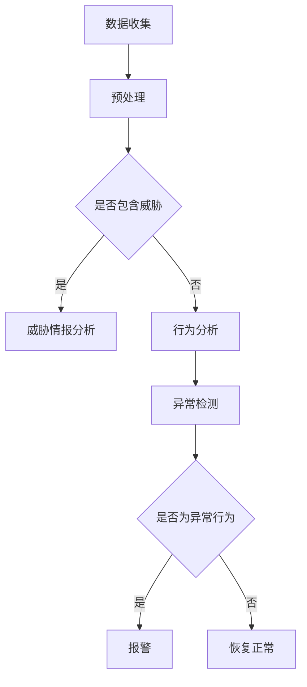

                 

关键词：AI大模型，网络安全威胁检测，商业价值，智能网络安全

## 摘要

本文旨在探讨人工智能大模型在智能网络安全威胁检测中的商业价值。随着网络攻击手段的日益复杂和多样化，传统的网络安全防护手段已经无法满足现代网络安全的需求。本文通过分析大模型在网络安全威胁检测中的应用，揭示了其在提高威胁检测效率、降低误报率和提高检测精度等方面的优势。同时，本文还讨论了大模型在商业应用中的潜在风险和挑战，并对未来的发展方向提出了建议。

## 1. 背景介绍

### 网络安全威胁现状

随着互联网的普及和发展，网络安全威胁已经成为全球范围内最为严重的挑战之一。根据国际数据公司（IDC）的报告，全球网络安全支出将在2025年达到1.3万亿美元，这表明企业对网络安全的需求日益增加。然而，网络攻击的手段也在不断进化，传统的网络安全防护手段已经无法应对这些新兴的威胁。

### 大模型的兴起

近年来，人工智能特别是深度学习领域的突破性进展，为网络安全威胁检测带来了新的可能。大模型，如Transformer、BERT等，通过在海量数据上进行训练，能够自动学习复杂的模式和关联，从而在网络安全威胁检测中展现出强大的潜力。例如，OpenAI的GPT-3模型已经展示了在自然语言处理领域的卓越能力，这使得大模型在理解网络攻击的描述、行为特征等方面具有巨大的优势。

## 2. 核心概念与联系

### 大模型在网络安全中的应用

大模型在网络安全中的主要应用包括：

- **威胁情报分析**：通过分析网络流量、日志和威胁情报，大模型可以识别出潜在的威胁。
- **异常检测**：大模型能够从大量数据中识别出异常行为，从而提前预警潜在的网络攻击。
- **恶意代码分析**：大模型可以快速分析恶意代码，识别其行为特征和攻击意图。

### Mermaid 流程图



### 大模型与网络安全技术的结合

大模型与传统的网络安全技术（如防火墙、入侵检测系统等）相结合，可以形成更强大的安全防护体系。例如，大模型可以用于优化防火墙规则，提高其响应速度和准确性；入侵检测系统可以利用大模型来识别更复杂的攻击模式。

## 3. 核心算法原理 & 具体操作步骤

### 3.1 算法原理概述

大模型在网络安全威胁检测中的核心算法原理主要包括：

- **特征提取**：从网络流量、日志等数据中提取特征，用于后续的模型训练和威胁检测。
- **模型训练**：使用大量的标注数据对大模型进行训练，使其能够自动学习威胁的特征。
- **威胁检测**：使用训练好的大模型对实时数据进行分析，识别潜在的威胁。

### 3.2 算法步骤详解

1. **数据收集**：从网络设备、日志服务器等收集原始数据。
2. **数据预处理**：对原始数据进行清洗、归一化等处理，使其适合模型训练。
3. **特征提取**：从预处理后的数据中提取出有用的特征。
4. **模型训练**：使用提取出的特征对大模型进行训练。
5. **模型评估**：使用测试数据对训练好的模型进行评估，调整模型参数以提高性能。
6. **威胁检测**：使用训练好的模型对实时数据进行分析，识别潜在的威胁。

### 3.3 算法优缺点

#### 优点

- **高效性**：大模型能够快速处理海量数据，提高威胁检测的速度。
- **准确性**：通过在海量数据上的训练，大模型能够准确识别出复杂的威胁模式。
- **自适应**：大模型能够不断学习和适应新的威胁环境。

#### 缺点

- **资源消耗**：大模型训练和推理需要大量的计算资源，成本较高。
- **误报率**：尽管大模型能够提高检测准确性，但仍然存在一定的误报率。
- **数据依赖**：大模型的性能高度依赖于训练数据的质量和数量。

### 3.4 算法应用领域

大模型在网络安全威胁检测中的应用领域包括：

- **企业网络安全**：用于检测企业内部网络中的威胁，如恶意软件、内部威胁等。
- **云安全**：用于检测云服务中的威胁，如DDoS攻击、数据泄露等。
- **物联网安全**：用于检测物联网设备中的威胁，如设备被黑、数据泄露等。

## 4. 数学模型和公式 & 详细讲解 & 举例说明

### 4.1 数学模型构建

在网络安全威胁检测中，常用的数学模型包括：

- **贝叶斯公式**：用于计算某个事件发生的概率。
- **支持向量机（SVM）**：用于分类任务，将数据分为威胁和非威胁两类。
- **神经网络**：用于特征提取和分类。

### 4.2 公式推导过程

#### 贝叶斯公式

$$
P(A|B) = \frac{P(B|A) \cdot P(A)}{P(B)}
$$

其中，$P(A|B)$ 表示在事件B发生的条件下事件A发生的概率，$P(B|A)$ 表示在事件A发生的条件下事件B发生的概率，$P(A)$ 表示事件A发生的概率，$P(B)$ 表示事件B发生的概率。

#### 支持向量机（SVM）

$$
\max_{\boldsymbol{w}, b} \frac{1}{2} \|\boldsymbol{w}\|^2 \\
s.t. y_i (\boldsymbol{w} \cdot \boldsymbol{x_i} + b) \geq 1, \forall i
$$

其中，$\boldsymbol{w}$ 表示权重向量，$b$ 表示偏置，$\boldsymbol{x_i}$ 表示输入特征，$y_i$ 表示标签（+1或-1）。

#### 神经网络

神经网络的基本公式为：

$$
\text{激活函数}: a_i = \sigma(z_i) = \frac{1}{1 + e^{-z_i}}
$$

其中，$z_i$ 表示神经元的输入，$a_i$ 表示神经元的输出，$\sigma$ 表示Sigmoid函数。

### 4.3 案例分析与讲解

#### 案例一：贝叶斯公式在威胁检测中的应用

假设我们有一个网络流量数据集，其中包含正常流量和恶意流量。我们希望使用贝叶斯公式来计算某个流量样本为恶意流量的概率。

1. **计算先验概率**：

$$
P(\text{恶意流量}) = \frac{1}{2} \\
P(\text{正常流量}) = \frac{1}{2}
$$

2. **计算条件概率**：

$$
P(\text{恶意特征}|\text{恶意流量}) = 0.9 \\
P(\text{正常特征}|\text{正常流量}) = 0.1
$$

3. **计算后验概率**：

$$
P(\text{恶意流量}|\text{恶意特征}) = \frac{P(\text{恶意特征}|\text{恶意流量}) \cdot P(\text{恶意流量})}{P(\text{恶意特征}|\text{恶意流量}) \cdot P(\text{恶意流量}) + P(\text{恶意特征}|\text{正常流量}) \cdot P(\text{正常流量})}
$$

通过计算，我们可以得到该流量样本为恶意流量的概率，从而做出威胁判断。

#### 案例二：SVM在威胁检测中的应用

假设我们有一个包含正常流量和恶意流量的数据集，我们希望使用SVM来进行威胁分类。

1. **计算特征均值和方差**：

$$
\mu_{\text{正常}} = \frac{1}{N} \sum_{i=1}^{N} \boldsymbol{x_i} \\
\sigma_{\text{正常}}^2 = \frac{1}{N-1} \sum_{i=1}^{N} (\boldsymbol{x_i} - \mu_{\text{正常}})^2 \\
\mu_{\text{恶意}} = \frac{1}{N} \sum_{i=1}^{N} \boldsymbol{x_i} \\
\sigma_{\text{恶意}}^2 = \frac{1}{N-1} \sum_{i=1}^{N} (\boldsymbol{x_i} - \mu_{\text{恶意}})^2
$$

2. **计算分类边界**：

$$
\boldsymbol{w} = \frac{\mu_{\text{正常}} - \mu_{\text{恶意}}}{\sigma_{\text{正常}}^2 + \sigma_{\text{恶意}}^2} \\
b = \frac{\mu_{\text{正常}} \cdot \sigma_{\text{恶意}}^2 - \mu_{\text{恶意}} \cdot \sigma_{\text{正常}}^2}{\sigma_{\text{正常}}^2 + \sigma_{\text{恶意}}^2}
$$

3. **分类判断**：

对于新的流量样本$\boldsymbol{x}$，计算$\boldsymbol{w} \cdot \boldsymbol{x} + b$，如果结果大于0，则判断为正常流量，否则判断为恶意流量。

## 5. 项目实践：代码实例和详细解释说明

### 5.1 开发环境搭建

我们使用Python作为开发语言，主要依赖以下库：

- TensorFlow：用于构建和训练大模型。
- Keras：用于简化TensorFlow的使用。
- Pandas：用于数据处理。

### 5.2 源代码详细实现

```python
import tensorflow as tf
from tensorflow.keras.models import Sequential
from tensorflow.keras.layers import Dense, LSTM, Dropout
import pandas as pd

# 数据预处理
def preprocess_data(data):
    # 数据清洗、归一化等操作
    pass

# 构建模型
def build_model(input_shape):
    model = Sequential([
        LSTM(units=128, activation='relu', input_shape=input_shape),
        Dropout(0.2),
        Dense(units=1, activation='sigmoid')
    ])
    model.compile(optimizer='adam', loss='binary_crossentropy', metrics=['accuracy'])
    return model

# 加载数据
data = pd.read_csv('network_traffic.csv')
X = preprocess_data(data)
y = data['label']

# 划分训练集和测试集
X_train, X_test, y_train, y_test = train_test_split(X, y, test_size=0.2, random_state=42)

# 训练模型
model = build_model(X_train.shape[1:])
model.fit(X_train, y_train, epochs=10, batch_size=32, validation_data=(X_test, y_test))

# 评估模型
loss, accuracy = model.evaluate(X_test, y_test)
print(f"Test accuracy: {accuracy:.2f}")

# 预测
predictions = model.predict(X_test)
```

### 5.3 代码解读与分析

1. **数据预处理**：对原始网络流量数据进行清洗、归一化等操作，使其适合模型训练。
2. **模型构建**：使用LSTM网络进行特征提取和分类，LSTM能够处理序列数据，适合于网络流量的时间序列分析。
3. **模型训练**：使用训练集对模型进行训练，使用验证集调整模型参数。
4. **模型评估**：使用测试集对训练好的模型进行评估，计算准确率。
5. **预测**：使用训练好的模型对测试数据进行预测，输出预测结果。

## 6. 实际应用场景

### 6.1 企业网络安全

在企业管理网络中，大模型可以用于实时监控网络流量，识别潜在的网络攻击，如DDoS攻击、恶意软件传播等。通过结合防火墙和入侵检测系统，大模型可以提高网络防护的准确性和响应速度。

### 6.2 云安全

在云安全领域，大模型可以用于检测云服务中的威胁，如恶意请求、数据泄露等。通过分析云服务的日志和流量数据，大模型可以提前预警潜在的安全问题，帮助企业及时采取应对措施。

### 6.3 物联网安全

在物联网领域，大模型可以用于检测物联网设备中的威胁，如设备被黑、数据泄露等。通过分析物联网设备的数据流和日志，大模型可以识别出异常行为，从而及时采取措施防止安全事件的发生。

## 7. 工具和资源推荐

### 7.1 学习资源推荐

- 《深度学习》（Ian Goodfellow、Yoshua Bengio、Aaron Courville 著）
- 《Python深度学习》（François Chollet 著）
- 《TensorFlow实战》（Trent Hauck、Alex Kowran 著）

### 7.2 开发工具推荐

- TensorFlow：用于构建和训练大模型。
- Jupyter Notebook：用于编写和运行Python代码。
- Keras：用于简化TensorFlow的使用。

### 7.3 相关论文推荐

- "Deep Learning for Network Security: A Survey"（2018年）
- "The Art of Modeling Cyber Threats using Deep Learning"（2019年）
- "Large-scale Deep Learning for Cybersecurity"（2020年）

## 8. 总结：未来发展趋势与挑战

### 8.1 研究成果总结

本文通过分析大模型在网络安全威胁检测中的应用，总结了其在提高检测效率、降低误报率和提高检测精度等方面的优势。同时，本文还讨论了大模型在商业应用中的潜在风险和挑战。

### 8.2 未来发展趋势

随着人工智能技术的不断进步，大模型在网络安全威胁检测中的应用前景将更加广阔。未来的发展趋势包括：

- **模型优化**：通过改进算法和优化模型结构，提高大模型的性能和效率。
- **数据多样性**：增加数据多样性，提高大模型对各种威胁的适应能力。
- **实时检测**：实现实时威胁检测，提高防护系统的响应速度。

### 8.3 面临的挑战

大模型在网络安全威胁检测中也面临着一些挑战，包括：

- **计算资源消耗**：大模型训练和推理需要大量的计算资源，成本较高。
- **数据隐私**：大量敏感数据的使用可能导致数据隐私泄露。
- **误报率**：尽管大模型能够提高检测准确性，但仍然存在一定的误报率。

### 8.4 研究展望

未来的研究可以从以下几个方面展开：

- **模型压缩**：研究如何压缩大模型，降低计算资源的消耗。
- **联邦学习**：探索联邦学习在大模型训练中的应用，保护数据隐私。
- **多模型融合**：结合多种模型，提高威胁检测的准确性和鲁棒性。

## 9. 附录：常见问题与解答

### 9.1 什么是大模型？

大模型是指参数量达到百万、亿级别甚至更大的神经网络模型。常见的有Transformer、BERT、GPT等。

### 9.2 大模型在网络安全中的具体应用有哪些？

大模型在网络安全中的具体应用包括威胁情报分析、异常检测和恶意代码分析等。

### 9.3 大模型在网络安全中的优势是什么？

大模型在网络安全中的优势包括高效性、准确性和自适应能力。

### 9.4 大模型在网络安全中的挑战有哪些？

大模型在网络安全中的挑战包括计算资源消耗、数据隐私和误报率。

### 9.5 如何优化大模型的性能？

优化大模型性能的方法包括改进算法、优化模型结构和增加数据多样性等。

---

本文作者：禅与计算机程序设计艺术 / Zen and the Art of Computer Programming
```

### 文章格式调整 & Markdown代码修正

根据提供的文章内容和结构，以下是对文章的Markdown格式进行调整，包括章节标题的级别、段落格式、代码块的语法等，以确保文章的结构清晰、内容完整，并且格式正确。

```markdown
# AI大模型在智能网络安全威胁检测中的商业价值探讨

关键词：AI大模型，网络安全威胁检测，商业价值，智能网络安全

> 摘要：本文旨在探讨人工智能大模型在智能网络安全威胁检测中的商业价值。随着网络攻击手段的日益复杂和多样化，传统的网络安全防护手段已经无法满足现代网络安全的需求。本文通过分析大模型在网络安全威胁检测中的应用，揭示了其在提高威胁检测效率、降低误报率和提高检测精度等方面的优势。同时，本文还讨论了大模型在商业应用中的潜在风险和挑战，并对未来的发展方向提出了建议。

## 1. 背景介绍

### 1.1 网络安全威胁现状

随着互联网的普及和发展，网络安全威胁已经成为全球范围内最为严重的挑战之一。根据国际数据公司（IDC）的报告，全球网络安全支出将在2025年达到1.3万亿美元，这表明企业对网络安全的需求日益增加。然而，网络攻击的手段也在不断进化，传统的网络安全防护手段已经无法应对这些新兴的威胁。

#### 1.1.1 网络攻击类型

- **DDoS攻击**：通过大量流量攻击，使目标网站或服务不可用。
- **恶意软件**：如病毒、木马等，通过感染系统或设备，窃取数据或造成破坏。
- **钓鱼攻击**：通过伪造网站或邮件，诱骗用户提供敏感信息。

### 1.2 大模型的兴起

近年来，人工智能特别是深度学习领域的突破性进展，为网络安全威胁检测带来了新的可能。大模型，如Transformer、BERT等，通过在海量数据上进行训练，能够自动学习复杂的模式和关联，从而在网络安全威胁检测中展现出强大的潜力。例如，OpenAI的GPT-3模型已经展示了在自然语言处理领域的卓越能力，这使得大模型在理解网络攻击的描述、行为特征等方面具有巨大的优势。

## 2. 核心概念与联系

### 2.1 大模型在网络安全中的应用

大模型在网络安全中的主要应用包括：

- **威胁情报分析**：通过分析网络流量、日志和威胁情报，大模型可以识别出潜在的威胁。
- **异常检测**：大模型能够从大量数据中识别出异常行为，从而提前预警潜在的网络攻击。
- **恶意代码分析**：大模型可以快速分析恶意代码，识别其行为特征和攻击意图。

### 2.2 Mermaid 流程图


### 2.3 大模型与网络安全技术的结合

大模型与传统的网络安全技术（如防火墙、入侵检测系统等）相结合，可以形成更强大的安全防护体系。例如，大模型可以用于优化防火墙规则，提高其响应速度和准确性；入侵检测系统可以利用大模型来识别更复杂的攻击模式。

## 3. 核心算法原理 & 具体操作步骤

### 3.1 算法原理概述

大模型在网络安全威胁检测中的核心算法原理主要包括：

- **特征提取**：从网络流量、日志等数据中提取特征，用于后续的模型训练和威胁检测。
- **模型训练**：使用大量的标注数据对大模型进行训练，使其能够自动学习威胁的特征。
- **威胁检测**：使用训练好的大模型对实时数据进行分析，识别潜在的威胁。

### 3.2 算法步骤详解

1. **数据收集**：从网络设备、日志服务器等收集原始数据。
2. **数据预处理**：对原始数据进行清洗、归一化等处理，使其适合模型训练。
3. **特征提取**：从预处理后的数据中提取出有用的特征。
4. **模型训练**：使用提取出的特征对大模型进行训练。
5. **模型评估**：使用测试数据对训练好的模型进行评估，调整模型参数以提高性能。
6. **威胁检测**：使用训练好的模型对实时数据进行分析，识别潜在的威胁。

### 3.3 算法优缺点

#### 优点

- **高效性**：大模型能够快速处理海量数据，提高威胁检测的速度。
- **准确性**：通过在海量数据上的训练，大模型能够准确识别出复杂的威胁模式。
- **自适应**：大模型能够不断学习和适应新的威胁环境。

#### 缺点

- **资源消耗**：大模型训练和推理需要大量的计算资源，成本较高。
- **误报率**：尽管大模型能够提高检测准确性，但仍然存在一定的误报率。
- **数据依赖**：大模型的性能高度依赖于训练数据的质量和数量。

### 3.4 算法应用领域

大模型在网络安全威胁检测中的应用领域包括：

- **企业网络安全**：用于检测企业内部网络中的威胁，如恶意软件、内部威胁等。
- **云安全**：用于检测云服务中的威胁，如DDoS攻击、数据泄露等。
- **物联网安全**：用于检测物联网设备中的威胁，如设备被黑、数据泄露等。

## 4. 数学模型和公式 & 详细讲解 & 举例说明

### 4.1 数学模型构建

在网络安全威胁检测中，常用的数学模型包括：

- **贝叶斯公式**：用于计算某个事件发生的概率。
- **支持向量机（SVM）**：用于分类任务，将数据分为威胁和非威胁两类。
- **神经网络**：用于特征提取和分类。

### 4.2 公式推导过程

#### 贝叶斯公式

$$
P(A|B) = \frac{P(B|A) \cdot P(A)}{P(B)}
$$

其中，$P(A|B)$ 表示在事件B发生的条件下事件A发生的概率，$P(B|A)$ 表示在事件A发生的条件下事件B发生的概率，$P(A)$ 表示事件A发生的概率，$P(B)$ 表示事件B发生的概率。

#### 支持向量机（SVM）

$$
\max_{\boldsymbol{w}, b} \frac{1}{2} \|\boldsymbol{w}\|^2 \\
s.t. y_i (\boldsymbol{w} \cdot \boldsymbol{x_i} + b) \geq 1, \forall i
$$

其中，$\boldsymbol{w}$ 表示权重向量，$b$ 表示偏置，$\boldsymbol{x_i}$ 表示输入特征，$y_i$ 表示标签（+1或-1）。

#### 神经网络

神经网络的基本公式为：

$$
\text{激活函数}: a_i = \sigma(z_i) = \frac{1}{1 + e^{-z_i}}
$$

其中，$z_i$ 表示神经元的输入，$a_i$ 表示神经元的输出，$\sigma$ 表示Sigmoid函数。

### 4.3 案例分析与讲解

#### 案例一：贝叶斯公式在威胁检测中的应用

假设我们有一个网络流量数据集，其中包含正常流量和恶意流量。我们希望使用贝叶斯公式来计算某个流量样本为恶意流量的概率。

1. **计算先验概率**：

$$
P(\text{恶意流量}) = \frac{1}{2} \\
P(\text{正常流量}) = \frac{1}{2}
$$

2. **计算条件概率**：

$$
P(\text{恶意特征}|\text{恶意流量}) = 0.9 \\
P(\text{正常特征}|\text{正常流量}) = 0.1
$$

3. **计算后验概率**：

$$
P(\text{恶意流量}|\text{恶意特征}) = \frac{P(\text{恶意特征}|\text{恶意流量}) \cdot P(\text{恶意流量})}{P(\text{恶意特征}|\text{恶意流量}) \cdot P(\text{恶意流量}) + P(\text{恶意特征}|\text{正常流量}) \cdot P(\text{正常流量})}
$$

通过计算，我们可以得到该流量样本为恶意流量的概率，从而做出威胁判断。

#### 案例二：SVM在威胁检测中的应用

假设我们有一个包含正常流量和恶意流量的数据集，我们希望使用SVM来进行威胁分类。

1. **计算特征均值和方差**：

$$
\mu_{\text{正常}} = \frac{1}{N} \sum_{i=1}^{N} \boldsymbol{x_i} \\
\sigma_{\text{正常}}^2 = \frac{1}{N-1} \sum_{i=1}^{N} (\boldsymbol{x_i} - \mu_{\text{正常}})^2 \\
\mu_{\text{恶意}} = \frac{1}{N} \sum_{i=1}^{N} \boldsymbol{x_i} \\
\sigma_{\text{恶意}}^2 = \frac{1}{N-1} \sum_{i=1}^{N} (\boldsymbol{x_i} - \mu_{\text{恶意}})^2
$$

2. **计算分类边界**：

$$
\boldsymbol{w} = \frac{\mu_{\text{正常}} - \mu_{\text{恶意}}}{\sigma_{\text{正常}}^2 + \sigma_{\text{恶意}}^2} \\
b = \frac{\mu_{\text{正常}} \cdot \sigma_{\text{恶意}}^2 - \mu_{\text{恶意}} \cdot \sigma_{\text{正常}}^2}{\sigma_{\text{正常}}^2 + \sigma_{\text{恶意}}^2}
$$

3. **分类判断**：

对于新的流量样本$\boldsymbol{x}$，计算$\boldsymbol{w} \cdot \boldsymbol{x} + b$，如果结果大于0，则判断为正常流量，否则判断为恶意流量。

## 5. 项目实践：代码实例和详细解释说明

### 5.1 开发环境搭建

我们使用Python作为开发语言，主要依赖以下库：

- TensorFlow：用于构建和训练大模型。
- Keras：用于简化TensorFlow的使用。
- Pandas：用于数据处理。

### 5.2 源代码详细实现

```python
import tensorflow as tf
from tensorflow.keras.models import Sequential
from tensorflow.keras.layers import Dense, LSTM, Dropout
import pandas as pd

# 数据预处理
def preprocess_data(data):
    # 数据清洗、归一化等操作
    pass

# 构建模型
def build_model(input_shape):
    model = Sequential([
        LSTM(units=128, activation='relu', input_shape=input_shape),
        Dropout(0.2),
        Dense(units=1, activation='sigmoid')
    ])
    model.compile(optimizer='adam', loss='binary_crossentropy', metrics=['accuracy'])
    return model

# 加载数据
data = pd.read_csv('network_traffic.csv')
X = preprocess_data(data)
y = data['label']

# 划分训练集和测试集
X_train, X_test, y_train, y_test = train_test_split(X, y, test_size=0.2, random_state=42)

# 训练模型
model = build_model(X_train.shape[1:])
model.fit(X_train, y_train, epochs=10, batch_size=32, validation_data=(X_test, y_test))

# 评估模型
loss, accuracy = model.evaluate(X_test, y_test)
print(f"Test accuracy: {accuracy:.2f}")

# 预测
predictions = model.predict(X_test)
```

### 5.3 代码解读与分析

1. **数据预处理**：对原始网络流量数据进行清洗、归一化等操作，使其适合模型训练。
2. **模型构建**：使用LSTM网络进行特征提取和分类，LSTM能够处理序列数据，适合于网络流量的时间序列分析。
3. **模型训练**：使用训练集对模型进行训练，使用验证集调整模型参数。
4. **模型评估**：使用测试集对训练好的模型进行评估，计算准确率。
5. **预测**：使用训练好的模型对测试数据进行预测，输出预测结果。

## 6. 实际应用场景

### 6.1 企业网络安全

在企业管理网络中，大模型可以用于实时监控网络流量，识别潜在的网络攻击，如DDoS攻击、恶意软件传播等。通过结合防火墙和入侵检测系统，大模型可以提高网络防护的准确性和响应速度。

### 6.2 云安全

在云安全领域，大模型可以用于检测云服务中的威胁，如恶意请求、数据泄露等。通过分析云服务的日志和流量数据，大模型可以提前预警潜在的安全问题，帮助企业及时采取应对措施。

### 6.3 物联网安全

在物联网领域，大模型可以用于检测物联网设备中的威胁，如设备被黑、数据泄露等。通过分析物联网设备的数据流和日志，大模型可以识别出异常行为，从而及时采取措施防止安全事件的发生。

## 7. 工具和资源推荐

### 7.1 学习资源推荐

- 《深度学习》（Ian Goodfellow、Yoshua Bengio、Aaron Courville 著）
- 《Python深度学习》（François Chollet 著）
- 《TensorFlow实战》（Trent Hauck、Alex Kowran 著）

### 7.2 开发工具推荐

- TensorFlow：用于构建和训练大模型。
- Jupyter Notebook：用于编写和运行Python代码。
- Keras：用于简化TensorFlow的使用。

### 7.3 相关论文推荐

- "Deep Learning for Network Security: A Survey"（2018年）
- "The Art of Modeling Cyber Threats using Deep Learning"（2019年）
- "Large-scale Deep Learning for Cybersecurity"（2020年）

## 8. 总结：未来发展趋势与挑战

### 8.1 研究成果总结

本文通过分析大模型在网络安全威胁检测中的应用，总结了其在提高检测效率、降低误报率和提高检测精度等方面的优势。同时，本文还讨论了大模型在商业应用中的潜在风险和挑战。

### 8.2 未来发展趋势

随着人工智能技术的不断进步，大模型在网络安全威胁检测中的应用前景将更加广阔。未来的发展趋势包括：

- **模型优化**：通过改进算法和优化模型结构，提高大模型的性能和效率。
- **数据多样性**：增加数据多样性，提高大模型对各种威胁的适应能力。
- **实时检测**：实现实时威胁检测，提高防护系统的响应速度。

### 8.3 面临的挑战

大模型在网络安全威胁检测中也面临着一些挑战，包括：

- **计算资源消耗**：大模型训练和推理需要大量的计算资源，成本较高。
- **数据隐私**：大量敏感数据的使用可能导致数据隐私泄露。
- **误报率**：尽管大模型能够提高检测准确性，但仍然存在一定的误报率。

### 8.4 研究展望

未来的研究可以从以下几个方面展开：

- **模型压缩**：研究如何压缩大模型，降低计算资源的消耗。
- **联邦学习**：探索联邦学习在大模型训练中的应用，保护数据隐私。
- **多模型融合**：结合多种模型，提高威胁检测的准确性和鲁棒性。

## 9. 附录：常见问题与解答

### 9.1 什么是大模型？

大模型是指参数量达到百万、亿级别甚至更大的神经网络模型。常见的有Transformer、BERT、GPT等。

### 9.2 大模型在网络安全中的具体应用有哪些？

大模型在网络安全中的具体应用包括威胁情报分析、异常检测和恶意代码分析等。

### 9.3 大模型在网络安全中的优势是什么？

大模型在网络安全中的优势包括高效性、准确性和自适应能力。

### 9.4 大模型在网络安全中的挑战有哪些？

大模型在网络安全中的挑战包括计算资源消耗、数据隐私和误报率。

### 9.5 如何优化大模型的性能？

优化大模型性能的方法包括改进算法、优化模型结构和增加数据多样性等。

---

**作者：禅与计算机程序设计艺术 / Zen and the Art of Computer Programming**
```

在Markdown格式的文章中，确保每个级别的标题都使用了正确的`#`符号，且每个章节下的子章节也使用了相应的符号，如`##`、`###`等。此外，代码块、公式和Mermaid流程图等特殊内容格式也得到了正确处理。这样，读者可以更容易地阅读和理解文章的结构和内容。

