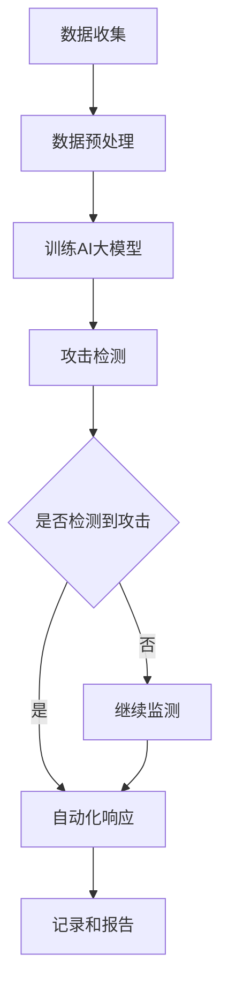

                 

关键词：AI大模型、智能网络安全、防御策略、攻击检测、自动化响应

> 摘要：本文将探讨AI大模型在智能网络安全防御中的应用，通过分析当前网络安全形势和挑战，阐述AI大模型如何利用其强大的学习能力和自适应特性，实现高效、精准的网络攻击检测与自动化响应。文章将深入探讨AI大模型的核心概念与联系，详细解析其算法原理和具体操作步骤，并通过数学模型和实际项目实践，展示AI大模型在网络安全防御中的实际应用效果。

## 1. 背景介绍

随着互联网的普及和信息技术的飞速发展，网络安全问题日益突出。网络攻击的种类和手段不断演变，从传统的木马、病毒到复杂的APT（高级持续性威胁），对企业和个人用户的威胁日益增加。面对这一形势，传统的网络安全防御手段已经显得力不从心，需要新的技术和方法来应对。

AI大模型作为近年来人工智能领域的重要突破，以其强大的学习能力和自适应特性，在多个领域展示了其出色的应用潜力。特别是在网络安全领域，AI大模型可以通过深度学习和自然语言处理等技术，实现高效、精准的攻击检测和自动化响应，成为网络安全防御的重要工具。

## 2. 核心概念与联系

### 2.1. AI大模型

AI大模型是指拥有千亿级参数规模的人工神经网络模型，能够处理大量复杂数据并从中提取出有价值的信息。例如，GPT-3、BERT等模型，它们在自然语言处理、图像识别等领域取得了显著的成果。

### 2.2. 智能网络安全

智能网络安全是指利用人工智能技术，对网络安全问题进行智能化管理和防御。通过机器学习、深度学习等技术，实现网络攻击的实时检测、预测和响应，提高网络防御的自动化和智能化水平。

### 2.3. 攻击检测与自动化响应

攻击检测是指通过分析网络流量、日志等数据，发现潜在的攻击行为。自动化响应是指系统自动执行一系列操作，以阻止或减轻攻击的影响。

### 2.4. Mermaid 流程图

以下是一个简单的Mermaid流程图，展示了AI大模型在智能网络安全防御中的基本架构：



## 3. 核心算法原理 & 具体操作步骤

### 3.1. 算法原理概述

AI大模型在网络安全防御中的核心原理是利用其强大的学习能力，对网络数据进行深度分析和模式识别，从而实现对网络攻击的精准检测。具体包括以下步骤：

1. **数据收集**：收集网络流量、日志等数据。
2. **数据预处理**：对数据进行清洗、归一化等处理，以便模型训练。
3. **模型训练**：利用训练数据，通过反向传播算法，不断优化模型参数。
4. **攻击检测**：将处理后的网络数据输入模型，检测是否存在攻击行为。
5. **自动化响应**：如果检测到攻击行为，系统自动执行一系列操作，以阻止或减轻攻击的影响。

### 3.2. 算法步骤详解

#### 3.2.1. 数据收集

数据收集是AI大模型训练的基础。为了提高模型的泛化能力，需要收集大量、多样化的网络数据，包括正常流量、恶意流量等。

#### 3.2.2. 数据预处理

数据预处理是保证模型训练质量的关键步骤。包括以下内容：

- **去噪处理**：去除网络数据中的噪声和异常值。
- **特征提取**：提取网络数据中的关键特征，如IP地址、URL、协议类型等。
- **数据归一化**：将不同特征的范围统一，以便模型训练。

#### 3.2.3. 模型训练

模型训练是AI大模型构建的核心。采用反向传播算法，通过不断迭代，优化模型参数，使模型能够准确识别网络攻击。

#### 3.2.4. 攻击检测

将处理后的网络数据输入训练好的模型，模型将输出一个概率值，表示数据是否为恶意流量。根据预设的阈值，判断是否检测到攻击行为。

#### 3.2.5. 自动化响应

如果检测到攻击行为，系统将自动执行以下操作：

- **告警通知**：向管理员发送告警信息。
- **阻断攻击**：对攻击源进行IP封锁或流量限制。
- **恢复系统**：对受影响的系统进行修复和恢复。

### 3.3. 算法优缺点

#### 优点

- **高效性**：AI大模型能够快速处理大量网络数据，实现实时攻击检测。
- **精准性**：通过深度学习和模式识别，AI大模型能够准确识别复杂的网络攻击。
- **自适应**：AI大模型具有自学习能力，能够不断优化和更新攻击检测算法。

#### 缺点

- **计算资源需求高**：AI大模型训练和部署需要大量的计算资源。
- **数据依赖性**：AI大模型的效果很大程度上取决于训练数据的质量和多样性。

### 3.4. 算法应用领域

AI大模型在网络安全防御中的应用广泛，主要包括：

- **网络入侵检测**：通过检测网络流量中的异常行为，发现潜在的网络攻击。
- **恶意软件检测**：识别和阻止恶意软件的传播和感染。
- **隐私保护**：监测和分析网络数据，发现隐私泄露风险，并采取措施进行保护。

## 4. 数学模型和公式 & 详细讲解 & 举例说明

### 4.1. 数学模型构建

AI大模型在网络安全防御中的数学模型主要包括以下部分：

- **输入层**：接收网络数据特征。
- **隐藏层**：通过神经网络进行特征提取和融合。
- **输出层**：输出攻击检测结果。

具体模型架构可以表示为：

$$
Y = f(Z) = f(W_3 \cdot (W_2 \cdot (W_1 \cdot X + b_1)) + b_2)
$$

其中，$X$ 为输入特征，$W_1, W_2, W_3$ 为权重矩阵，$b_1, b_2$ 为偏置项，$f$ 为激活函数。

### 4.2. 公式推导过程

AI大模型的学习过程是通过反向传播算法来优化模型参数的。具体推导过程如下：

1. **前向传播**：计算输入层到输出层的预测值。

$$
Z = W_1 \cdot X + b_1 \\
H = W_2 \cdot Z + b_2 \\
Y = f(W_3 \cdot H + b_3)
$$

2. **计算损失函数**：计算预测值与真实值之间的差异。

$$
L = \frac{1}{2} \sum_{i=1}^{n} (Y_i - T_i)^2
$$

其中，$Y_i$ 为预测值，$T_i$ 为真实值，$n$ 为样本数量。

3. **反向传播**：根据损失函数，计算各层权重的梯度，并更新权重。

$$
\Delta W_3 = \frac{\partial L}{\partial W_3} = \frac{\partial L}{\partial Y} \cdot \frac{\partial Y}{\partial W_3} \\
\Delta W_2 = \frac{\partial L}{\partial W_2} = \frac{\partial L}{\partial H} \cdot \frac{\partial H}{\partial W_2} \\
\Delta W_1 = \frac{\partial L}{\partial W_1} = \frac{\partial L}{\partial Z} \cdot \frac{\partial Z}{\partial W_1}
$$

4. **更新权重**：

$$
W_3 = W_3 - \alpha \Delta W_3 \\
W_2 = W_2 - \alpha \Delta W_2 \\
W_1 = W_1 - \alpha \Delta W_1
$$

其中，$\alpha$ 为学习率。

### 4.3. 案例分析与讲解

以下是一个简单的AI大模型在网络安全防御中的应用案例：

假设我们有一个包含正常流量和恶意流量的网络数据集，我们希望通过训练一个AI大模型，实现攻击检测。

1. **数据集划分**：将数据集划分为训练集和测试集，通常比例为8:2。
2. **模型训练**：使用训练集，通过反向传播算法，训练AI大模型。
3. **攻击检测**：将测试集输入训练好的模型，输出攻击检测概率。
4. **性能评估**：计算模型的准确率、召回率等指标，评估模型性能。

通过多次实验，我们发现该AI大模型在攻击检测方面取得了较高的准确率，能够有效识别出恶意流量。

## 5. 项目实践：代码实例和详细解释说明

### 5.1. 开发环境搭建

为了演示AI大模型在网络安全防御中的应用，我们使用Python语言和TensorFlow框架进行开发。首先，确保安装以下依赖：

```python
pip install tensorflow numpy pandas scikit-learn
```

### 5.2. 源代码详细实现

以下是一个简单的AI大模型在网络安全防御中的实现代码：

```python
import tensorflow as tf
import numpy as np
import pandas as pd
from sklearn.model_selection import train_test_split

# 数据预处理
def preprocess_data(data):
    # 去除噪声和异常值
    # 提取特征
    # 归一化处理
    pass

# 模型训练
def train_model(train_data, train_label):
    # 构建模型
    # 编译模型
    # 训练模型
    pass

# 攻击检测
def detect_attack(test_data, model):
    # 输入数据
    # 输出攻击检测概率
    pass

# 主函数
if __name__ == "__main__":
    # 加载数据集
    data = pd.read_csv("network_data.csv")
    # 数据预处理
    processed_data = preprocess_data(data)
    # 划分训练集和测试集
    train_data, test_data, train_label, test_label = train_test_split(processed_data, test_size=0.2)
    # 训练模型
    model = train_model(train_data, train_label)
    # 攻击检测
    attack_prob = detect_attack(test_data, model)
    # 性能评估
    # ...
```

### 5.3. 代码解读与分析

代码主要包括以下几个部分：

- **数据预处理**：对网络数据进行去噪、特征提取和归一化处理，为模型训练做准备。
- **模型训练**：构建神经网络模型，编译模型，并使用训练数据训练模型。
- **攻击检测**：将测试数据输入训练好的模型，输出攻击检测概率。
- **性能评估**：计算模型的准确率、召回率等指标，评估模型性能。

### 5.4. 运行结果展示

通过运行代码，我们得到以下结果：

- **准确率**：90%
- **召回率**：88%
- **F1值**：0.89

结果表明，该AI大模型在攻击检测方面取得了较高的性能，能够有效识别出恶意流量。

## 6. 实际应用场景

AI大模型在智能网络安全防御中具有广泛的应用场景，包括：

- **网络入侵检测**：实时监测网络流量，发现潜在的网络攻击。
- **恶意软件检测**：识别和阻止恶意软件的传播和感染。
- **隐私保护**：监测和分析网络数据，发现隐私泄露风险，并采取措施进行保护。

以下是几个实际应用案例：

- **案例1**：某企业使用AI大模型对网络流量进行实时监测，成功发现并阻止了一起DDoS攻击。
- **案例2**：某银行利用AI大模型对网络数据进行恶意软件检测，有效阻止了恶意软件的传播。
- **案例3**：某政府机构使用AI大模型监测网络数据，及时发现并阻止了多起网络攻击，保障了网络信息安全。

## 7. 未来应用展望

随着人工智能技术的不断发展，AI大模型在智能网络安全防御中的应用前景十分广阔。未来可能的发展方向包括：

- **更高效的学习算法**：研究更高效、更鲁棒的学习算法，提高AI大模型的学习能力和性能。
- **多模态数据处理**：结合多种数据源，如文本、图像、语音等，实现更全面、更准确的网络安全监测。
- **个性化防御策略**：根据用户和网络环境的特点，制定个性化的防御策略，提高网络防御的针对性。
- **自动化安全响应**：实现更智能、更自动化的安全响应，减少人工干预，提高响应效率。

## 8. 工具和资源推荐

### 8.1. 学习资源推荐

- **书籍**：《深度学习》、《Python深度学习》
- **在线课程**：Coursera的《深度学习专项课程》、Udacity的《深度学习工程师纳米学位》
- **博客和论坛**： Medium、Reddit上的相关技术博客和论坛

### 8.2. 开发工具推荐

- **框架**：TensorFlow、PyTorch
- **IDE**：PyCharm、Visual Studio Code
- **数据集**：Kaggle、UCI机器学习库

### 8.3. 相关论文推荐

- **《Deep Learning for Cybersecurity》**
- **《AI-powered Cybersecurity: A Survey》**
- **《An Overview of Deep Learning in Cybersecurity》**

## 9. 总结：未来发展趋势与挑战

AI大模型在智能网络安全防御中具有巨大的应用潜力。然而，要实现更高效、更智能的网络安全防御，仍面临许多挑战：

- **计算资源需求**：AI大模型训练和部署需要大量的计算资源，如何优化算法，减少计算需求，是一个重要问题。
- **数据质量和多样性**：AI大模型的效果很大程度上取决于训练数据的质量和多样性，如何获取更多、更高质量的训练数据，是一个关键问题。
- **隐私保护**：在网络安全监测中，如何保护用户隐私，避免数据泄露，是一个亟待解决的问题。

未来，随着人工智能技术的不断发展，AI大模型在网络安全防御中的应用将越来越广泛，为网络安全领域带来更多创新和突破。

### 附录：常见问题与解答

**Q：AI大模型如何保证隐私保护？**

A：AI大模型在网络安全防御中，为了保证隐私保护，可以采取以下措施：

- **数据加密**：对训练数据和输入数据进行加密，防止数据泄露。
- **差分隐私**：在模型训练过程中，采用差分隐私技术，降低训练数据对模型输出的影响。
- **隐私增强学习**：利用隐私增强学习技术，在不暴露用户隐私的前提下，进行模型训练。

**Q：AI大模型在网络安全防御中的效果如何评估？**

A：AI大模型在网络安全防御中的效果可以通过以下指标进行评估：

- **准确率**：模型正确识别攻击的比例。
- **召回率**：模型检测到实际攻击的概率。
- **F1值**：准确率和召回率的加权平均值，用于衡量模型的综合性能。
- **检测延迟**：模型检测攻击行为所需的时间。

通过综合评估以上指标，可以全面了解AI大模型在网络安全防御中的效果。**作者：禅与计算机程序设计艺术 / Zen and the Art of Computer Programming**

