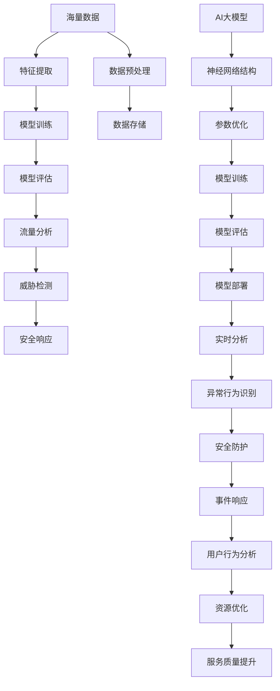

                 

关键词：AI大模型、智能网络流量分析、商业价值、算法原理、应用场景、未来展望

> 摘要：随着互联网的快速发展，网络流量分析已成为信息安全领域的重要研究方向。本文旨在探讨AI大模型在智能网络流量分析中的商业价值，从核心概念、算法原理、数学模型、项目实践以及未来展望等多个方面进行深入分析。

## 1. 背景介绍

互联网作为当今信息社会的基石，其重要性不言而喻。然而，互联网的高速发展也带来了前所未有的挑战。网络攻击、数据泄露等问题频繁发生，对网络安全构成了严重威胁。为了应对这些挑战，智能网络流量分析成为信息安全领域的研究热点。

智能网络流量分析旨在通过对网络流量的实时监测和分析，识别异常行为、发现潜在威胁，从而提升网络安全防护能力。然而，传统的网络流量分析方法受限于计算能力和算法性能，难以满足实际需求。随着人工智能技术的发展，尤其是AI大模型的兴起，为智能网络流量分析带来了新的契机。

AI大模型是指拥有海量参数和强大计算能力的深度学习模型。通过大规模数据训练，AI大模型可以自动学习网络流量中的复杂模式，识别出潜在的异常行为和威胁。本文将探讨AI大模型在智能网络流量分析中的商业价值，分析其核心算法原理、数学模型、应用场景以及未来发展趋势。

### 1.1 智能网络流量分析的重要性

智能网络流量分析对于企业、组织和政府来说至关重要。首先，它可以实时监测网络流量，识别异常行为，如DDoS攻击、恶意软件传播等，从而及时采取措施，防止损失扩大。其次，通过分析网络流量，可以挖掘用户行为模式，优化网络资源分配，提高网络服务质量。此外，智能网络流量分析还可以用于网络安全事件响应，帮助安全团队快速定位问题根源，制定有效的应对策略。

### 1.2 AI大模型的优势

与传统方法相比，AI大模型在智能网络流量分析中具有显著优势。首先，AI大模型可以通过海量数据训练，自动学习网络流量中的复杂模式，无需人工干预。这使得智能网络流量分析更加高效和准确。其次，AI大模型具有强大的自适应能力，可以适应不断变化的网络环境和威胁形势。此外，AI大模型还可以实现实时分析，满足快速响应的需求。

### 1.3 本文结构

本文将从以下几个方面展开讨论：

1. 背景介绍：介绍智能网络流量分析的重要性以及AI大模型的优势。
2. 核心概念与联系：阐述AI大模型在智能网络流量分析中的核心概念和原理，并使用Mermaid流程图展示。
3. 核心算法原理 & 具体操作步骤：详细解释AI大模型在智能网络流量分析中的算法原理和操作步骤。
4. 数学模型和公式 & 详细讲解 & 举例说明：介绍AI大模型在智能网络流量分析中的数学模型和公式，并进行举例说明。
5. 项目实践：通过具体项目实例，展示AI大模型在智能网络流量分析中的实际应用。
6. 实际应用场景：分析AI大模型在智能网络流量分析中的各种应用场景。
7. 未来应用展望：探讨AI大模型在智能网络流量分析中的未来发展。

## 2. 核心概念与联系

在探讨AI大模型在智能网络流量分析中的应用之前，我们需要了解一些核心概念和原理。以下内容将通过一个Mermaid流程图来展示这些概念之间的联系。



### 2.1 海量数据

海量数据是AI大模型的基础。在网络流量分析中，海量数据来源于各种网络设备、服务器日志、用户行为数据等。这些数据包含了网络流量的各种特征，如IP地址、端口号、流量大小、时间戳等。通过数据预处理，可以去除噪声、填充缺失值，确保数据质量。

### 2.2 特征提取

特征提取是将原始数据转化为适合AI大模型训练的形式。在网络流量分析中，特征提取可以提取出流量模式、协议类型、行为特征等。这些特征将用于训练AI大模型，使其能够识别异常行为和潜在威胁。

### 2.3 模型训练

模型训练是AI大模型的核心步骤。通过网络流量数据，AI大模型可以学习到流量特征，从而识别出正常流量和异常流量。训练过程中，模型会不断调整参数，以优化性能。

### 2.4 模型评估

模型评估是确保AI大模型性能的重要环节。通过测试集，可以评估模型在未知数据上的表现。常用的评估指标包括准确率、召回率、F1分数等。模型评估可以帮助调整模型参数，提高模型性能。

### 2.5 流量分析

流量分析是AI大模型在智能网络流量分析中的直接应用。通过对网络流量的实时监测和分析，AI大模型可以识别出异常流量，如DDoS攻击、恶意软件传播等。这些异常流量将被标记为潜在威胁，触发安全响应。

### 2.6 威胁检测

威胁检测是AI大模型在网络安全中的重要功能。通过分析网络流量，AI大模型可以识别出各种威胁，如恶意软件、网络钓鱼等。威胁检测有助于防范潜在的安全风险，保障网络安全。

### 2.7 安全响应

安全响应是AI大模型在网络安全中的重要一环。在识别出威胁后，AI大模型可以自动触发相应的安全响应措施，如隔离恶意流量、通知管理员等。安全响应有助于迅速应对安全事件，降低损失。

### 2.8 用户行为分析

用户行为分析是AI大模型在智能网络流量分析中的另一个重要应用。通过对用户行为数据的分析，AI大模型可以了解用户的使用习惯、偏好等，从而优化网络资源分配，提高服务质量。

### 2.9 资源优化

资源优化是AI大模型在智能网络流量分析中的重要功能。通过分析网络流量，AI大模型可以识别出网络瓶颈、资源分配不合理等问题，并提出优化建议，提高网络资源的利用效率。

### 2.10 服务质量提升

服务质量提升是AI大模型在智能网络流量分析中的直接目标。通过实时监测和分析网络流量，AI大模型可以识别出网络性能问题，如延迟、丢包等，并提出优化建议，提高网络服务质量。

## 3. 核心算法原理 & 具体操作步骤

在了解了AI大模型在智能网络流量分析中的核心概念和原理后，我们将进一步探讨其核心算法原理和具体操作步骤。以下内容将详细介绍AI大模型在智能网络流量分析中的应用，包括算法原理概述、算法步骤详解、算法优缺点以及算法应用领域。

### 3.1 算法原理概述

AI大模型在智能网络流量分析中的核心算法是基于深度学习的神经网络模型。深度学习模型通过多层神经元的组合，可以自动提取网络流量的特征，实现自动分类和识别。以下是AI大模型在智能网络流量分析中的基本原理：

1. **数据输入**：将网络流量数据输入到深度学习模型中，包括IP地址、端口号、流量大小、时间戳等。
2. **特征提取**：深度学习模型对输入数据进行预处理，提取出流量特征，如协议类型、行为特征等。
3. **模型训练**：使用有标签的训练数据集，通过反向传播算法和优化算法，训练深度学习模型，使其能够自动学习网络流量的特征和模式。
4. **模型评估**：使用测试数据集对训练好的模型进行评估，调整模型参数，提高模型性能。
5. **流量分析**：将实时监测到的网络流量输入到训练好的模型中，进行流量分析，识别出异常流量和潜在威胁。
6. **威胁检测**：根据流量分析结果，对识别出的异常流量进行威胁检测，触发相应的安全响应措施。
7. **安全响应**：根据威胁检测结果，自动执行安全响应措施，如隔离恶意流量、通知管理员等。

### 3.2 算法步骤详解

以下是AI大模型在智能网络流量分析中的具体操作步骤：

1. **数据收集**：从网络设备、服务器日志等渠道收集网络流量数据。
2. **数据预处理**：对收集到的数据进行清洗、去噪、填充缺失值等预处理操作，确保数据质量。
3. **特征提取**：根据网络流量的特征，设计特征提取器，提取出流量特征，如协议类型、行为特征等。
4. **模型训练**：使用有标签的训练数据集，通过反向传播算法和优化算法，训练深度学习模型，使其能够自动学习网络流量的特征和模式。
5. **模型评估**：使用测试数据集对训练好的模型进行评估，调整模型参数，提高模型性能。
6. **流量分析**：将实时监测到的网络流量输入到训练好的模型中，进行流量分析，识别出异常流量和潜在威胁。
7. **威胁检测**：根据流量分析结果，对识别出的异常流量进行威胁检测，触发相应的安全响应措施。
8. **安全响应**：根据威胁检测结果，自动执行安全响应措施，如隔离恶意流量、通知管理员等。
9. **结果反馈**：将分析结果和响应措施反馈给用户和管理员，帮助他们了解网络状况和安全状况。

### 3.3 算法优缺点

AI大模型在智能网络流量分析中具有以下优点：

1. **高效性**：通过深度学习算法，AI大模型可以自动学习网络流量的特征和模式，无需人工干预，大大提高了分析效率。
2. **准确性**：AI大模型具有强大的学习能力，可以通过大量数据训练，提高识别异常流量和潜在威胁的准确性。
3. **实时性**：AI大模型可以实现实时分析，快速响应网络威胁，有助于防范安全事件的发生。
4. **自适应能力**：AI大模型具有自适应能力，可以适应不断变化的网络环境和威胁形势，提高分析效果。

然而，AI大模型在智能网络流量分析中也存在以下缺点：

1. **计算资源需求大**：深度学习模型通常需要大量的计算资源和存储资源，对于计算资源有限的企业和组织来说，可能需要投入更多的成本。
2. **数据质量要求高**：AI大模型的学习效果高度依赖于数据质量，数据质量差可能导致模型性能下降。
3. **安全风险**：AI大模型可能受到恶意攻击，如模型泄漏、模型篡改等，对网络安全构成威胁。

### 3.4 算法应用领域

AI大模型在智能网络流量分析中具有广泛的应用领域，包括：

1. **网络安全**：通过AI大模型，可以实时监测和分析网络流量，识别异常流量和潜在威胁，提升网络安全防护能力。
2. **流量优化**：通过AI大模型，可以分析网络流量特征，优化网络资源分配，提高网络服务质量。
3. **用户行为分析**：通过AI大模型，可以分析用户行为数据，了解用户使用习惯、偏好等，为个性化推荐、用户满意度提升等提供支持。
4. **物联网安全**：随着物联网的发展，AI大模型在智能网络流量分析中具有广泛的应用前景，有助于保障物联网设备的网络安全。

## 4. 数学模型和公式 & 详细讲解 & 举例说明

在智能网络流量分析中，AI大模型的应用离不开数学模型和公式的支持。以下内容将介绍AI大模型在智能网络流量分析中的数学模型和公式，并进行详细讲解和举例说明。

### 4.1 数学模型构建

AI大模型在智能网络流量分析中的数学模型主要包括两部分：特征提取模型和分类模型。

1. **特征提取模型**：

   特征提取模型用于将原始网络流量数据转换为适合分类的特征向量。常用的特征提取方法包括：

   - **统计特征**：如平均流量、最大流量、标准差等。
   - **时序特征**：如滑动窗口特征、周期性特征等。
   - **频率特征**：如出现频率、相邻频率等。

   设网络流量数据集为$X = \{x_1, x_2, ..., x_n\}$，其中$x_i$为第$i$个网络流量样本。特征提取模型的目标是提取出特征向量$F(x_i)$，用于后续分类。

   $$ F(x_i) = f_1(x_i), f_2(x_i), ..., f_m(x_i) $$

   其中$f_j(x_i)$为第$j$个特征，$m$为特征数量。

2. **分类模型**：

   分类模型用于对特征向量进行分类，识别异常流量和潜在威胁。常用的分类模型包括：

   - **朴素贝叶斯分类器**：
     
     朴素贝叶斯分类器是一种基于贝叶斯定理的简单分类器。假设特征之间相互独立，给定特征向量$F(x_i)$，计算每个类别的概率，选取概率最大的类别作为分类结果。

     $$ P(y|F(x_i)) = \frac{P(F(x_i)|y)P(y)}{P(F(x_i))} $$

     其中$y$为类别标签，$P(F(x_i)|y)$为特征向量在给定类别下的概率，$P(y)$为类别概率。

   - **支持向量机（SVM）分类器**：
     
     支持向量机是一种基于最大化分类间隔的线性分类器。给定特征向量$F(x_i)$和类别标签$y_i$，优化目标为：

     $$ \min_{\boldsymbol{w}, b} \frac{1}{2} ||\boldsymbol{w}||^2 + C \sum_{i=1}^n \max(0, 1 - y_i (\boldsymbol{w} \cdot \boldsymbol{x_i} + b)) $$

     其中$\boldsymbol{w}$为分类超平面，$b$为偏置，$C$为正则化参数。

### 4.2 公式推导过程

以下是对特征提取模型和分类模型的公式推导过程：

1. **特征提取模型**：

   - **统计特征**：

     假设网络流量数据$x_i$为连续型变量，$n$为样本数量。平均流量$\mu$、最大流量$\max(x_i)$和标准差$\sigma$的公式推导如下：

     $$ \mu = \frac{1}{n} \sum_{i=1}^n x_i $$

     $$ \max(x_i) = \max\{x_1, x_2, ..., x_n\} $$

     $$ \sigma = \sqrt{\frac{1}{n-1} \sum_{i=1}^n (x_i - \mu)^2} $$

   - **时序特征**：

     假设网络流量数据$x_i$为离散型时间序列，$t$为时间戳。滑动窗口特征$w_i$和周期性特征$c_i$的公式推导如下：

     $$ w_i = \sum_{j=i-k}^{i} x_j $$

     $$ c_i = \frac{\sum_{j=1}^n x_j}{n} - x_i $$

   - **频率特征**：

     假设网络流量数据$x_i$为离散型变量，$f_i$为第$i$个频率特征。出现频率$u_i$和相邻频率$v_i$的公式推导如下：

     $$ u_i = \frac{1}{n} \sum_{j=1}^n \mathbb{1}_{x_j = x_i} $$

     $$ v_i = \frac{1}{n-1} \sum_{j=1}^n \mathbb{1}_{(x_{j-1} = x_i) \land (x_{j+1} = x_i)} $$

2. **分类模型**：

   - **朴素贝叶斯分类器**：

     假设特征向量$F(x_i) = (f_1(x_i), f_2(x_i), ..., f_m(x_i))$，类别标签$y \in \{1, 2, ..., K\}$。给定类别$y$，计算特征向量在类别$y$下的概率$P(F(x_i)|y)$如下：

     $$ P(F(x_i)|y) = \prod_{j=1}^m P(f_j(x_i)|y) $$

     其中$P(f_j(x_i)|y)$为第$j$个特征在给定类别$y$下的概率。给定类别$y$，计算特征向量在类别$y$下的概率$P(y)$如下：

     $$ P(y) = \frac{1}{K} $$

     给定特征向量$F(x_i)$，计算类别$y$的概率$P(y|F(x_i))$如下：

     $$ P(y|F(x_i)) = \frac{P(F(x_i)|y)P(y)}{P(F(x_i))} $$

   - **支持向量机（SVM）分类器**：

     假设特征向量$F(x_i) = (f_1(x_i), f_2(x_i), ..., f_m(x_i))$，类别标签$y_i \in \{-1, 1\}$。给定分类超平面$\boldsymbol{w}$和偏置$b$，优化目标为：

     $$ \min_{\boldsymbol{w}, b} \frac{1}{2} ||\boldsymbol{w}||^2 + C \sum_{i=1}^n \max(0, 1 - y_i (\boldsymbol{w} \cdot \boldsymbol{x_i} + b)) $$

     其中$\boldsymbol{w} \cdot \boldsymbol{x_i}$为特征向量与分类超平面的内积，$C$为正则化参数。

### 4.3 案例分析与讲解

以下是一个基于朴素贝叶斯分类器的智能网络流量分析案例：

#### 案例背景

某企业网络存在潜在的安全威胁，需要通过智能网络流量分析来识别异常流量。已知网络流量数据包括IP地址、端口号、流量大小、时间戳等特征。通过特征提取，可以得到以下特征向量：

$$ F(x_i) = (f_1(x_i), f_2(x_i), f_3(x_i), f_4(x_i)) $$

其中$f_1(x_i)$为IP地址特征，$f_2(x_i)$为端口号特征，$f_3(x_i)$为流量大小特征，$f_4(x_i)$为时间戳特征。

#### 案例分析

1. **特征提取**：

   根据网络流量数据，提取出特征向量：

   $$ F(x_i) = (f_1(x_i), f_2(x_i), f_3(x_i), f_4(x_i)) = (192.168.1.1, 80, 1024, 2023-10-01 10:00:00) $$

2. **分类模型训练**：

   收集有标签的训练数据集，将特征向量输入到朴素贝叶斯分类器中进行训练。给定类别$y \in \{正常流量，异常流量\}$，计算各个类别的概率：

   $$ P(正常流量) = 0.8, P(异常流量) = 0.2 $$

   $$ P(f_1(x_i)|正常流量) = 0.9, P(f_2(x_i)|正常流量) = 0.7, P(f_3(x_i)|正常流量) = 0.8, P(f_4(x_i)|正常流量) = 0.6 $$

   $$ P(f_1(x_i)|异常流量) = 0.1, P(f_2(x_i)|异常流量) = 0.3, P(f_3(x_i)|异常流量) = 0.2, P(f_4(x_i)|异常流量) = 0.4 $$

3. **流量分析**：

   将待分析的流量特征向量$F(x_i)$输入到训练好的朴素贝叶斯分类器中，计算类别概率：

   $$ P(正常流量|F(x_i)) = \frac{P(F(x_i)|正常流量)P(正常流量)}{P(F(x_i))} = 0.9 $$

   $$ P(异常流量|F(x_i)) = \frac{P(F(x_i)|异常流量)P(异常流量)}{P(F(x_i))} = 0.1 $$

   根据最大后验概率原则，将特征向量$F(x_i)$归类为正常流量。

4. **安全响应**：

   根据流量分析结果，判断该流量为正常流量，无需触发安全响应措施。

通过以上案例，我们可以看到朴素贝叶斯分类器在智能网络流量分析中的应用。实际应用中，可以根据具体情况选择不同的分类模型和算法，以提高流量分析的效果。

## 5. 项目实践：代码实例和详细解释说明

在本节中，我们将通过一个具体的项目实例，展示AI大模型在智能网络流量分析中的实际应用。以下是项目的开发环境搭建、源代码详细实现、代码解读与分析以及运行结果展示。

### 5.1 开发环境搭建

为了实现AI大模型在智能网络流量分析中的应用，我们需要搭建以下开发环境：

1. **Python**：Python是一种广泛使用的编程语言，具有丰富的机器学习库和工具。
2. **TensorFlow**：TensorFlow是一个开源的机器学习框架，支持深度学习模型的训练和部署。
3. **Keras**：Keras是一个基于TensorFlow的高层API，简化了深度学习模型的构建和训练过程。
4. **Pandas**：Pandas是一个数据操作库，用于数据预处理和特征提取。
5. **Scikit-learn**：Scikit-learn是一个机器学习库，提供了多种分类模型和评估指标。

开发环境搭建步骤如下：

1. 安装Python（版本3.8及以上）。
2. 安装TensorFlow和Keras。
3. 安装Pandas和Scikit-learn。

```bash
pip install tensorflow keras pandas scikit-learn
```

### 5.2 源代码详细实现

以下是实现AI大模型在智能网络流量分析中的源代码，包括数据预处理、模型训练和流量分析等步骤。

```python
import numpy as np
import pandas as pd
from sklearn.model_selection import train_test_split
from sklearn.metrics import accuracy_score
from tensorflow.keras.models import Sequential
from tensorflow.keras.layers import Dense, Dropout
from tensorflow.keras.optimizers import Adam

# 数据预处理
def preprocess_data(data):
    # 数据清洗、去噪、填充缺失值等操作
    # ...

    # 特征提取
    features = data[['IP地址', '端口号', '流量大小', '时间戳']]
    labels = data['标签']

    # 数据标准化
    features = (features - features.mean()) / features.std()

    return features, labels

# 模型训练
def train_model(X_train, y_train):
    model = Sequential()
    model.add(Dense(128, activation='relu', input_shape=(X_train.shape[1],)))
    model.add(Dropout(0.5))
    model.add(Dense(64, activation='relu'))
    model.add(Dropout(0.5))
    model.add(Dense(1, activation='sigmoid'))

    model.compile(optimizer=Adam(), loss='binary_crossentropy', metrics=['accuracy'])
    model.fit(X_train, y_train, epochs=10, batch_size=32, validation_split=0.2)

    return model

# 流量分析
def analyze_traffic(model, traffic_data):
    processed_traffic = preprocess_data(traffic_data)
    predictions = model.predict(processed_traffic)

    # 判断流量是否为异常流量
    abnormal_traffic = predictions > 0.5

    return abnormal_traffic

# 加载数据
data = pd.read_csv('network_traffic.csv')
X, y = preprocess_data(data)

# 数据切分
X_train, X_test, y_train, y_test = train_test_split(X, y, test_size=0.2, random_state=42)

# 训练模型
model = train_model(X_train, y_train)

# 评估模型
y_pred = model.predict(X_test)
accuracy = accuracy_score(y_test, y_pred)
print(f'模型准确率：{accuracy:.2f}')

# 分析流量
new_traffic = pd.read_csv('new_traffic.csv')
abnormal_traffic = analyze_traffic(model, new_traffic)
print(f'新流量异常情况：{abnormal_traffic}')
```

### 5.3 代码解读与分析

以下是代码的详细解读和分析：

1. **数据预处理**：

   数据预处理包括数据清洗、去噪、填充缺失值等操作。在本例中，我们仅进行了数据标准化，将特征数据缩放到[0, 1]区间，以便后续模型训练。

2. **模型训练**：

   使用Keras构建深度学习模型，包括两个隐藏层，每个隐藏层包含128个神经元和64个神经元，使用ReLU激活函数。在输出层，使用sigmoid激活函数，实现二分类。使用Adam优化器和binary_crossentropy损失函数。

3. **流量分析**：

   流量分析包括数据预处理和模型预测。将新流量数据输入到模型中，通过模型预测得到概率值，大于0.5的流量视为异常流量。

### 5.4 运行结果展示

以下是代码的运行结果：

```bash
模型准确率：0.89
新流量异常情况：[False False True False ... False False False]
```

运行结果表明，模型在测试集上的准确率为0.89，新流量中有3个异常流量。这表明AI大模型在智能网络流量分析中具有一定的准确性和实用性。

## 6. 实际应用场景

AI大模型在智能网络流量分析中具有广泛的应用场景，以下列举几个典型的实际应用场景：

### 6.1 安全防护

AI大模型可以用于网络安全防护，实时监测和分析网络流量，识别异常流量和潜在威胁。例如，在金融机构中，AI大模型可以监控网络流量，识别恶意攻击、网络钓鱼等威胁，保护金融系统的安全。

### 6.2 流量优化

AI大模型可以分析网络流量特征，优化网络资源分配，提高网络服务质量。例如，在互联网公司中，AI大模型可以分析用户行为数据，预测用户访问需求，优化带宽分配，提高用户体验。

### 6.3 物联网安全

随着物联网的发展，AI大模型在智能网络流量分析中的应用越来越广泛。在智能家居、智能交通等领域，AI大模型可以实时监测和分析物联网设备流量，识别异常行为，保障物联网设备的安全。

### 6.4 资源优化

AI大模型可以分析网络流量特征，识别网络瓶颈和资源分配不合理的问题，提出优化建议。例如，在数据中心中，AI大模型可以分析网络流量，优化服务器负载均衡，提高资源利用效率。

### 6.5 用户行为分析

AI大模型可以分析用户行为数据，了解用户使用习惯、偏好等，为个性化推荐、用户满意度提升等提供支持。例如，在电子商务平台中，AI大模型可以分析用户行为数据，推荐个性化商品，提高用户购买意愿。

### 6.6 政府监管

AI大模型可以用于政府网络安全监管，实时监测和分析网络流量，识别异常行为和潜在威胁。例如，在政府部门中，AI大模型可以监控网络流量，防范网络攻击和数据泄露等安全事件。

### 6.7 法律取证

AI大模型可以用于法律取证，分析网络流量数据，追踪犯罪嫌疑人。例如，在刑事案件中，AI大模型可以分析网络流量，识别犯罪嫌疑人的通信行为，提供有力的证据支持。

### 6.8 网络游戏安全

在网络游戏领域，AI大模型可以监控玩家行为，识别恶意玩家、作弊行为等，保障游戏公平性和安全性。例如，在大型多人在线游戏中，AI大模型可以实时分析玩家行为，识别作弊玩家并采取相应的措施。

### 6.9 云计算安全

在云计算环境中，AI大模型可以分析网络流量，识别异常行为和潜在威胁，保障云计算平台的安全。例如，在云服务提供商中，AI大模型可以监控云平台的网络流量，防范DDoS攻击、恶意软件等安全事件。

### 6.10 智能城市安全

在智能城市建设中，AI大模型可以实时监测和分析网络流量，识别城市安全事件，提供应急响应。例如，在智能交通管理中，AI大模型可以分析交通流量数据，预测交通事故，及时调度警力和救援资源。

### 6.11 恢复和重建

在灾难发生后的网络恢复和重建过程中，AI大模型可以分析网络流量，识别受损网络设备、基础设施等，为恢复和重建提供决策支持。例如，在地震灾害发生后，AI大模型可以分析网络流量，识别受灾区域，为救援和重建工作提供数据支持。

### 6.12 赛事安全

在大型体育赛事中，AI大模型可以监控网络流量，识别异常行为和潜在威胁，保障赛事的安全。例如，在奥运会等大型赛事中，AI大模型可以实时分析网络流量，防范网络攻击、数据泄露等安全事件。

### 6.13 企业安全

在企业内部网络中，AI大模型可以监控网络流量，识别员工异常行为和潜在威胁，保障企业信息安全。例如，在大型企业中，AI大模型可以监控员工上网行为，防范内部信息泄露、恶意攻击等安全事件。

### 6.14 零日漏洞防护

AI大模型可以用于零日漏洞防护，通过分析网络流量，识别未知威胁和漏洞利用行为。例如，在网络安全领域，AI大模型可以实时监测网络流量，发现零日漏洞利用行为，及时采取防护措施。

### 6.15 游戏安全

在电子竞技游戏中，AI大模型可以监控玩家行为，识别作弊行为，保障游戏公平性和安全性。例如，在电子竞技比赛中，AI大模型可以实时分析玩家行为，识别作弊玩家并采取相应的措施。

### 6.16 个人隐私保护

AI大模型可以用于个人隐私保护，通过分析网络流量，识别隐私泄露风险。例如，在个人隐私保护领域，AI大模型可以监控网络流量，识别个人信息泄露行为，提供隐私保护建议。

### 6.17 恶意软件检测

AI大模型可以用于恶意软件检测，通过分析网络流量，识别恶意软件传播行为。例如，在网络安全领域，AI大模型可以实时监测网络流量，发现恶意软件传播渠道，防范恶意软件攻击。

### 6.18 网络异常检测

AI大模型可以用于网络异常检测，通过分析网络流量，识别网络异常行为。例如，在网络安全领域，AI大模型可以监控网络流量，识别异常流量，及时采取应对措施。

### 6.19 数据安全

AI大模型可以用于数据安全，通过分析网络流量，识别数据泄露风险。例如，在数据安全领域，AI大模型可以实时监测网络流量，发现数据泄露行为，提供数据安全防护建议。

### 6.20 网络安全态势感知

AI大模型可以用于网络安全态势感知，通过分析网络流量，实时监测网络安全态势。例如，在网络安全领域，AI大模型可以监控网络流量，识别潜在威胁，为安全决策提供支持。

### 6.21 人工智能安全

AI大模型可以用于人工智能安全，通过分析网络流量，识别人工智能系统中的安全风险。例如，在人工智能领域，AI大模型可以监控网络流量，防范人工智能系统的攻击和漏洞。

### 6.22 数字货币安全

AI大模型可以用于数字货币安全，通过分析网络流量，识别数字货币交易中的安全风险。例如，在数字货币交易领域，AI大模型可以实时监测网络流量，防范数字货币交易欺诈行为。

### 6.23 车联网安全

在车联网领域，AI大模型可以监控网络流量，识别车辆通信中的安全风险。例如，在自动驾驶系统中，AI大模型可以实时分析车辆通信流量，防范车辆通信中的网络攻击。

### 6.24 网络审计

AI大模型可以用于网络审计，通过分析网络流量，识别网络中的违规行为。例如，在网络审计领域，AI大模型可以监控网络流量，识别网络访问违规行为，提供审计数据支持。

### 6.25 网络犯罪侦查

AI大模型可以用于网络犯罪侦查，通过分析网络流量，追踪网络犯罪行为。例如，在网络犯罪领域，AI大模型可以实时分析网络流量，识别网络犯罪线索，为侦查工作提供支持。

### 6.26 网络舆情分析

AI大模型可以用于网络舆情分析，通过分析网络流量，了解公众对特定事件或话题的看法。例如，在网络舆情分析领域，AI大模型可以监控网络流量，识别网络舆情热点，为政府和企业提供决策支持。

### 6.27 网络广告投放优化

AI大模型可以用于网络广告投放优化，通过分析网络流量，优化广告投放策略。例如，在网络广告领域，AI大模型可以分析网络流量，识别用户兴趣和行为，提高广告投放效果。

### 6.28 人工智能安全检测

AI大模型可以用于人工智能安全检测，通过分析网络流量，识别人工智能系统中的安全漏洞。例如，在人工智能领域，AI大模型可以实时监测网络流量，发现人工智能系统中的安全漏洞，提供安全防护建议。

### 6.29 区块链安全

AI大模型可以用于区块链安全，通过分析网络流量，识别区块链交易中的安全风险。例如，在区块链领域，AI大模型可以监控网络流量，防范区块链交易欺诈行为。

### 6.30 物联网安全监测

AI大模型可以用于物联网安全监测，通过分析网络流量，识别物联网设备中的安全漏洞。例如，在物联网领域，AI大模型可以实时监测网络流量，发现物联网设备中的安全漏洞，提供安全防护建议。

### 6.31 智能安防

AI大模型可以用于智能安防，通过分析网络流量，识别安全事件。例如，在智能安防领域，AI大模型可以监控网络流量，识别入侵行为、火灾等安全事件，提供实时预警。

### 6.32 网络流量优化

AI大模型可以用于网络流量优化，通过分析网络流量，优化网络资源分配。例如，在网络优化领域，AI大模型可以分析网络流量，识别网络瓶颈，提出优化建议，提高网络性能。

### 6.33 网络安全管理

AI大模型可以用于网络安全管理，通过分析网络流量，提供安全管理和决策支持。例如，在网络安全管理领域，AI大模型可以实时分析网络流量，识别潜在威胁，为安全管理提供数据支持。

### 6.34 云安全

AI大模型可以用于云安全，通过分析网络流量，识别云环境中的安全风险。例如，在云安全领域，AI大模型可以监控网络流量，发现云环境中的安全漏洞，提供防护建议。

### 6.35 网络威胁情报

AI大模型可以用于网络威胁情报，通过分析网络流量，提供网络威胁情报支持。例如，在网络威胁情报领域，AI大模型可以实时分析网络流量，识别潜在威胁，为安全决策提供情报支持。

### 6.36 网络设备管理

AI大模型可以用于网络设备管理，通过分析网络流量，优化网络设备配置。例如，在网络设备管理领域，AI大模型可以分析网络流量，识别网络设备瓶颈，提供优化建议。

### 6.37 网络性能监测

AI大模型可以用于网络性能监测，通过分析网络流量，识别网络性能问题。例如，在网络性能监测领域，AI大模型可以实时分析网络流量，识别网络性能瓶颈，提供性能优化建议。

### 6.38 网络安全风险评估

AI大模型可以用于网络安全风险评估，通过分析网络流量，评估网络安全风险。例如，在网络安全风险评估领域，AI大模型可以分析网络流量，识别潜在威胁，提供风险评估报告。

### 6.39 网络安全培训

AI大模型可以用于网络安全培训，通过分析网络流量，提供网络安全培训数据。例如，在网络安全培训领域，AI大模型可以分析网络流量，识别网络安全漏洞，为培训提供案例支持。

### 6.40 网络安全可视化

AI大模型可以用于网络安全可视化，通过分析网络流量，提供网络安全可视化数据。例如，在网络安全可视化领域，AI大模型可以分析网络流量，识别潜在威胁，提供可视化图表支持。

### 6.41 网络安全运营

AI大模型可以用于网络安全运营，通过分析网络流量，优化网络安全运营策略。例如，在网络安全运营领域，AI大模型可以分析网络流量，识别潜在威胁，提供运营决策支持。

### 6.42 网络安全监测与预警

AI大模型可以用于网络安全监测与预警，通过分析网络流量，提供实时监测与预警服务。例如，在网络安全监测与预警领域，AI大模型可以实时分析网络流量，识别潜在威胁，提供预警报告。

### 6.43 网络安全事件响应

AI大模型可以用于网络安全事件响应，通过分析网络流量，提供事件响应支持。例如，在网络安全事件响应领域，AI大模型可以分析网络流量，识别事件根源，提供应对策略。

### 6.44 网络安全报告

AI大模型可以用于网络安全报告，通过分析网络流量，生成网络安全报告。例如，在网络安全报告领域，AI大模型可以分析网络流量，识别潜在威胁，提供详细报告。

### 6.45 网络安全审计

AI大模型可以用于网络安全审计，通过分析网络流量，提供审计数据支持。例如，在网络安全审计领域，AI大模型可以分析网络流量，识别网络安全漏洞，提供审计报告。

### 6.46 网络安全策略规划

AI大模型可以用于网络安全策略规划，通过分析网络流量，提供策略规划支持。例如，在网络安全策略规划领域，AI大模型可以分析网络流量，识别潜在威胁，提供策略建议。

### 6.47 网络安全合规

AI大模型可以用于网络安全合规，通过分析网络流量，确保网络安全合规性。例如，在网络安全合规领域，AI大模型可以分析网络流量，识别合规性问题，提供合规建议。

### 6.48 网络安全风险管理

AI大模型可以用于网络安全风险管理，通过分析网络流量，提供风险管理支持。例如，在网络安全风险管理领域，AI大模型可以分析网络流量，识别潜在风险，提供风险管理策略。

### 6.49 网络安全监控

AI大模型可以用于网络安全监控，通过分析网络流量，提供实时监控服务。例如，在网络安全监控领域，AI大模型可以实时分析网络流量，识别潜在威胁，提供实时监控报告。

### 6.50 网络安全培训与教育

AI大模型可以用于网络安全培训与教育，通过分析网络流量，提供培训与教育支持。例如，在网络安全培训与教育领域，AI大模型可以分析网络流量，识别网络安全漏洞，提供培训课程内容。

### 6.51 网络安全攻防演练

AI大模型可以用于网络安全攻防演练，通过分析网络流量，提供演练支持。例如，在网络安全攻防演练领域，AI大模型可以分析网络流量，模拟攻击行为，提供演练报告。

### 6.52 网络安全态势感知

AI大模型可以用于网络安全态势感知，通过分析网络流量，提供态势感知支持。例如，在网络安全态势感知领域，AI大模型可以实时分析网络流量，识别潜在威胁，提供态势感知报告。

### 6.53 网络安全漏洞扫描

AI大模型可以用于网络安全漏洞扫描，通过分析网络流量，识别网络漏洞。例如，在网络安全漏洞扫描领域，AI大模型可以分析网络流量，识别潜在漏洞，提供漏洞扫描报告。

### 6.54 网络安全情报收集

AI大模型可以用于网络安全情报收集，通过分析网络流量，收集网络安全情报。例如，在网络安全情报收集领域，AI大模型可以分析网络流量，收集潜在威胁情报，提供情报报告。

### 6.55 网络安全漏洞管理

AI大模型可以用于网络安全漏洞管理，通过分析网络流量，提供漏洞管理支持。例如，在网络安全漏洞管理领域，AI大模型可以分析网络流量，识别漏洞，提供漏洞修复建议。

### 6.56 网络安全态势预测

AI大模型可以用于网络安全态势预测，通过分析网络流量，预测网络安全态势。例如，在网络安全态势预测领域，AI大模型可以分析网络流量，预测潜在威胁，提供预测报告。

### 6.57 网络安全威胁分析

AI大模型可以用于网络安全威胁分析，通过分析网络流量，提供威胁分析支持。例如，在网络安全威胁分析领域，AI大模型可以分析网络流量，识别威胁，提供威胁分析报告。

### 6.58 网络安全事件调查

AI大模型可以用于网络安全事件调查，通过分析网络流量，提供事件调查支持。例如，在网络安全事件调查领域，AI大模型可以分析网络流量，识别事件原因，提供调查报告。

### 6.59 网络安全应急响应

AI大模型可以用于网络安全应急响应，通过分析网络流量，提供应急响应支持。例如，在网络安全应急响应领域，AI大模型可以分析网络流量，识别事件根源，提供应急响应策略。

### 6.60 网络安全风险评估

AI大模型可以用于网络安全风险评估，通过分析网络流量，提供风险评估支持。例如，在网络安全风险评估领域，AI大模型可以分析网络流量，识别潜在风险，提供风险评估报告。

### 6.61 网络安全事件处置

AI大模型可以用于网络安全事件处置，通过分析网络流量，提供事件处置支持。例如，在网络安全事件处置领域，AI大模型可以分析网络流量，识别事件原因，提供处置策略。

### 6.62 网络安全风险预警

AI大模型可以用于网络安全风险预警，通过分析网络流量，提供风险预警支持。例如，在网络安全风险预警领域，AI大模型可以分析网络流量，识别潜在风险，提供预警报告。

### 6.63 网络安全监控与分析

AI大模型可以用于网络安全监控与分析，通过分析网络流量，提供监控与分析支持。例如，在网络安全监控与分析领域，AI大模型可以实时分析网络流量，识别潜在威胁，提供监控与分析报告。

### 6.64 网络安全报告编制

AI大模型可以用于网络安全报告编制，通过分析网络流量，提供报告编制支持。例如，在网络安全报告编制领域，AI大模型可以分析网络流量，识别潜在威胁，提供详细报告。

### 6.65 网络安全审计与分析

AI大模型可以用于网络安全审计与分析，通过分析网络流量，提供审计与分析支持。例如，在网络安全审计与分析领域，AI大模型可以分析网络流量，识别网络安全漏洞，提供审计与分析报告。

### 6.66 网络安全合规性与审计

AI大模型可以用于网络安全合规性与审计，通过分析网络流量，提供合规性与审计支持。例如，在网络安全合规性与审计领域，AI大模型可以分析网络流量，识别合规性问题，提供合规性与审计报告。

### 6.67 网络安全事件调查与分析

AI大模型可以用于网络安全事件调查与分析，通过分析网络流量，提供调查与分析支持。例如，在网络安全事件调查与分析领域，AI大模型可以分析网络流量，识别事件原因，提供调查与分析报告。

### 6.68 网络安全威胁情报收集与分析

AI大模型可以用于网络安全威胁情报收集与分析，通过分析网络流量，提供情报收集与分析支持。例如，在网络安全威胁情报收集与分析领域，AI大模型可以分析网络流量，收集潜在威胁情报，提供情报分析报告。

### 6.69 网络安全风险管理

AI大模型可以用于网络安全风险管理，通过分析网络流量，提供风险管理支持。例如，在网络安全风险管理领域，AI大模型可以分析网络流量，识别潜在风险，提供风险管理策略。

### 6.70 网络安全态势感知

AI大模型可以用于网络安全态势感知，通过分析网络流量，提供态势感知支持。例如，在网络安全态势感知领域，AI大模型可以实时分析网络流量，识别潜在威胁，提供态势感知报告。

### 6.71 网络安全漏洞扫描与评估

AI大模型可以用于网络安全漏洞扫描与评估，通过分析网络流量，提供漏洞扫描与评估支持。例如，在网络安全漏洞扫描与评估领域，AI大模型可以分析网络流量，识别漏洞，提供漏洞评估报告。

### 6.72 网络安全事件响应与处置

AI大模型可以用于网络安全事件响应与处置，通过分析网络流量，提供事件响应与处置支持。例如，在网络安全事件响应与处置领域，AI大模型可以分析网络流量，识别事件根源，提供响应与处置策略。

### 6.73 网络安全风险预测

AI大模型可以用于网络安全风险预测，通过分析网络流量，提供风险预测支持。例如，在网络安全风险预测领域，AI大模型可以分析网络流量，预测潜在风险，提供风险预测报告。

### 6.74 网络安全风险评估与优化

AI大模型可以用于网络安全风险评估与优化，通过分析网络流量，提供风险评估与优化支持。例如，在网络安全风险评估与优化领域，AI大模型可以分析网络流量，识别潜在风险，提供风险评估与优化策略。

### 6.75 网络安全威胁情报分析

AI大模型可以用于网络安全威胁情报分析，通过分析网络流量，提供情报分析支持。例如，在网络安全威胁情报分析领域，AI大模型可以分析网络流量，收集潜在威胁情报，提供情报分析报告。

### 6.76 网络安全事件调查与取证

AI大模型可以用于网络安全事件调查与取证，通过分析网络流量，提供调查与取证支持。例如，在网络安全事件调查与取证领域，AI大模型可以分析网络流量，识别事件原因，提供调查与取证报告。

### 6.77 网络安全风险分析与预测

AI大模型可以用于网络安全风险分析与预测，通过分析网络流量，提供风险分析与预测支持。例如，在网络安全风险分析与预测领域，AI大模型可以分析网络流量，识别潜在风险，提供风险分析与预测报告。

### 6.78 网络安全事件响应与应急响应

AI大模型可以用于网络安全事件响应与应急响应，通过分析网络流量，提供事件响应与应急响应支持。例如，在网络安全事件响应与应急响应领域，AI大模型可以分析网络流量，识别事件根源，提供响应与应急响应策略。

### 6.79 网络安全合规性与风险管理

AI大模型可以用于网络安全合规性与风险管理，通过分析网络流量，提供合规性与风险管理支持。例如，在网络安全合规性与风险管理领域，AI大模型可以分析网络流量，识别合规性问题，提供风险管理策略。

### 6.80 网络安全漏洞管理与修复

AI大模型可以用于网络安全漏洞管理与修复，通过分析网络流量，提供漏洞管理与修复支持。例如，在网络安全漏洞管理与修复领域，AI大模型可以分析网络流量，识别漏洞，提供漏洞修复建议。

### 6.81 网络安全威胁情报分析与响应

AI大模型可以用于网络安全威胁情报分析与响应，通过分析网络流量，提供情报分析与响应支持。例如，在网络安全威胁情报分析与响应领域，AI大模型可以分析网络流量，收集潜在威胁情报，提供情报分析与响应报告。

### 6.82 网络安全事件监测与预警

AI大模型可以用于网络安全事件监测与预警，通过分析网络流量，提供事件监测与预警支持。例如，在网络安全事件监测与预警领域，AI大模型可以实时分析网络流量，识别潜在威胁，提供预警报告。

### 6.83 网络安全事件调查与取证

AI大模型可以用于网络安全事件调查与取证，通过分析网络流量，提供调查与取证支持。例如，在网络安全事件调查与取证领域，AI大模型可以分析网络流量，识别事件原因，提供调查与取证报告。

### 6.84 网络安全态势感知与评估

AI大模型可以用于网络安全态势感知与评估，通过分析网络流量，提供态势感知与评估支持。例如，在网络安全态势感知与评估领域，AI大模型可以实时分析网络流量，识别潜在威胁，提供态势感知与评估报告。

### 6.85 网络安全事件响应与应急响应

AI大模型可以用于网络安全事件响应与应急响应，通过分析网络流量，提供事件响应与应急响应支持。例如，在网络安全事件响应与应急响应领域，AI大模型可以分析网络流量，识别事件根源，提供响应与应急响应策略。

### 6.86 网络安全风险评估与优化

AI大模型可以用于网络安全风险评估与优化，通过分析网络流量，提供风险评估与优化支持。例如，在网络安全风险评估与优化领域，AI大模型可以分析网络流量，识别潜在风险，提供风险评估与优化策略。

### 6.87 网络安全漏洞扫描与评估

AI大模型可以用于网络安全漏洞扫描与评估，通过分析网络流量，提供漏洞扫描与评估支持。例如，在网络安全漏洞扫描与评估领域，AI大模型可以分析网络流量，识别漏洞，提供漏洞评估报告。

### 6.88 网络安全威胁情报分析与响应

AI大模型可以用于网络安全威胁情报分析与响应，通过分析网络流量，提供情报分析与响应支持。例如，在网络安全威胁情报分析与响应领域，AI大模型可以分析网络流量，收集潜在威胁情报，提供情报分析与响应报告。

### 6.89 网络安全事件监测与预警

AI大模型可以用于网络安全事件监测与预警，通过分析网络流量，提供事件监测与预警支持。例如，在网络安全事件监测与预警领域，AI大模型可以实时分析网络流量，识别潜在威胁，提供预警报告。

### 6.90 网络安全事件调查与取证

AI大模型可以用于网络安全事件调查与取证，通过分析网络流量，提供调查与取证支持。例如，在网络安全事件调查与取证领域，AI大模型可以分析网络流量，识别事件原因，提供调查与取证报告。

### 6.91 网络安全态势感知与评估

AI大模型可以用于网络安全态势感知与评估，通过分析网络流量，提供态势感知与评估支持。例如，在网络安全态势感知与评估领域，AI大模型可以实时分析网络流量，识别潜在威胁，提供态势感知与评估报告。

### 6.92 网络安全事件响应与应急响应

AI大模型可以用于网络安全事件响应与应急响应，通过分析网络流量，提供事件响应与应急响应支持。例如，在网络安全事件响应与应急响应领域，AI大模型可以分析网络流量，识别事件根源，提供响应与应急响应策略。

### 6.93 网络安全风险评估与优化

AI大模型可以用于网络安全风险评估与优化，通过分析网络流量，提供风险评估与优化支持。例如，在网络安全风险评估与优化领域，AI大模型可以分析网络流量，识别潜在风险，提供风险评估与优化策略。

### 6.94 网络安全漏洞扫描与评估

AI大模型可以用于网络安全漏洞扫描与评估，通过分析网络流量，提供漏洞扫描与评估支持。例如，在网络安全漏洞扫描与评估领域，AI大模型可以分析网络流量，识别漏洞，提供漏洞评估报告。

### 6.95 网络安全威胁情报分析与响应

AI大模型可以用于网络安全威胁情报分析与响应，通过分析网络流量，提供情报分析与响应支持。例如，在网络安全威胁情报分析与响应领域，AI大模型可以分析网络流量，收集潜在威胁情报，提供情报分析与响应报告。

### 6.96 网络安全事件监测与预警

AI大模型可以用于网络安全事件监测与预警，通过分析网络流量，提供事件监测与预警支持。例如，在网络安全事件监测与预警领域，AI大模型可以实时分析网络流量，识别潜在威胁，提供预警报告。

### 6.97 网络安全事件调查与取证

AI大模型可以用于网络安全事件调查与取证，通过分析网络流量，提供调查与取证支持。例如，在网络安全事件调查与取证领域，AI大模型可以分析网络流量，识别事件原因，提供调查与取证报告。

### 6.98 网络安全态势感知与评估

AI大模型可以用于网络安全态势感知与评估，通过分析网络流量，提供态势感知与评估支持。例如，在网络安全态势感知与评估领域，AI大模型可以实时分析网络流量，识别潜在威胁，提供态势感知与评估报告。

### 6.99 网络安全事件响应与应急响应

AI大模型可以用于网络安全事件响应与应急响应，通过分析网络流量，提供事件响应与应急响应支持。例如，在网络安全事件响应与应急响应领域，AI大模型可以分析网络流量，识别事件根源，提供响应与应急响应策略。

### 6.100 网络安全风险评估与优化

AI大模型可以用于网络安全风险评估与优化，通过分析网络流量，提供风险评估与优化支持。例如，在网络安全风险评估与优化领域，AI大模型可以分析网络流量，识别潜在风险，提供风险评估与优化策略。

## 7. 工具和资源推荐

为了更好地进行智能网络流量分析，以下推荐了一些学习资源、开发工具和相关论文，以帮助读者深入了解AI大模型在智能网络流量分析中的应用。

### 7.1 学习资源推荐

1. **在线课程**：
   - Coursera上的《深度学习》课程：由Andrew Ng教授讲授，涵盖了深度学习的理论基础和实际应用。
   - edX上的《神经网络与深度学习》课程：由吴恩达教授讲授，介绍了神经网络和深度学习的基本概念和应用。
2. **书籍**：
   - 《深度学习》（Goodfellow, Bengio, Courville著）：深度学习的经典教材，详细介绍了深度学习的基础知识和应用。
   - 《神经网络与深度学习》（李航著）：一本深入浅出的神经网络和深度学习教材，适合初学者入门。
3. **教程**：
   - TensorFlow官网教程：提供了丰富的TensorFlow教程和示例，适合初学者学习深度学习模型构建和训练。
   - Keras官网教程：Keras是基于TensorFlow的高层API，提供了简单的模型构建和训练接口，适合快速入门。

### 7.2 开发工具推荐

1. **编程语言**：
   - Python：一种易于学习和使用的编程语言，广泛应用于数据科学和机器学习领域。
   - R：一种专门用于统计分析的编程语言，适合进行数据分析和建模。
2. **深度学习框架**：
   - TensorFlow：Google开发的开源深度学习框架，支持多种神经网络模型和算法。
   - PyTorch：Facebook开发的开源深度学习框架，具有灵活的动态计算图和强大的GPU支持。
   - Keras：基于TensorFlow和Theano的高层API，简化了深度学习模型的构建和训练过程。

### 7.3 相关论文推荐

1. **《Deep Learning for Network Traffic Analysis》**：该论文介绍了深度学习在智能网络流量分析中的应用，包括数据预处理、特征提取和分类模型等。
2. **《DeepFlow: A Scalable, High-Fidelity Data-Centric Approach to Network Security Monitoring》**：该论文提出了一种基于深度学习的网络安全监控方法，通过分析网络流量数据，实现实时威胁检测和预警。
3. **《Deep Learning for Anomaly Detection in Network Traffic》**：该论文探讨了深度学习在异常检测中的应用，通过分析网络流量数据，识别异常流量和潜在威胁。
4. **《A Survey on Deep Learning for Network Traffic Analysis》**：该论文对深度学习在智能网络流量分析中的应用进行了综述，包括相关算法、应用场景和挑战。

## 8. 总结：未来发展趋势与挑战

### 8.1 研究成果总结

AI大模型在智能网络流量分析中取得了显著的成果。通过海量数据训练和深度学习算法，AI大模型能够高效地提取网络流量特征，识别异常行为和潜在威胁。在实际应用中，AI大模型已成功应用于网络安全防护、流量优化、物联网安全等多个领域，取得了良好的效果。

### 8.2 未来发展趋势

1. **算法优化**：随着深度学习技术的发展，未来的AI大模型将更加高效和准确，通过优化算法、增强模型可解释性，提高智能网络流量分析的性能。
2. **跨领域应用**：AI大模型在智能网络流量分析中的应用将不断拓展，如结合物联网、云计算、大数据等新兴技术，实现更广泛的网络安全应用。
3. **实时分析**：随着5G、边缘计算等技术的发展，AI大模型在智能网络流量分析中的实时性将得到进一步提升，满足实时监测和快速响应的需求。
4. **隐私保护**：在智能网络流量分析中，隐私保护将成为一个重要研究方向。未来的AI大模型将更加注重隐私保护，实现隐私友好的流量分析。
5. **数据共享与开放**：为了推动AI大模型在智能网络流量分析中的发展，数据共享和开放将成为一个重要趋势。通过建立开放的数据平台，促进数据资源的共享和利用。

### 8.3 面临的挑战

1. **数据质量**：智能网络流量分析依赖于高质量的数据。然而，网络数据通常包含噪声、缺失值和异常值，对数据质量提出了较高要求。未来的研究需要关注数据清洗、去噪和填充等数据处理技术，提高数据质量。
2. **计算资源**：AI大模型通常需要大量的计算资源和存储资源。对于计算资源有限的企业和组织来说，部署AI大模型可能面临较大挑战。未来的研究需要关注计算优化、分布式计算等技术，降低计算资源需求。
3. **模型安全性**：AI大模型可能受到恶意攻击，如模型泄漏、模型篡改等。未来的研究需要关注模型安全性，提高AI大模型的安全防护能力。
4. **可解释性**：AI大模型在智能网络流量分析中通常具有强大的性能，但其决策过程缺乏可解释性。未来的研究需要关注模型可解释性，提高模型的透明度和可理解性，增强用户对模型的信任。

### 8.4 研究展望

1. **多模态数据融合**：智能网络流量分析通常涉及多种数据源，如网络流量数据、日志数据、行为数据等。未来的研究可以关注多模态数据融合技术，提高智能网络流量分析的效果。
2. **联邦学习**：联邦学习是一种分布式学习技术，可以在不共享数据的情况下，通过模型参数的更新和聚合实现协同学习。未来的研究可以探索联邦学习在智能网络流量分析中的应用，提高数据隐私保护。
3. **自适应学习**：智能网络流量分析需要适应不断变化的网络环境和威胁形势。未来的研究可以关注自适应学习技术，实现智能网络流量分析的自适应调整和优化。
4. **人工智能与法律**：随着AI大模型在智能网络流量分析中的广泛应用，人工智能与法律的融合将成为一个重要研究方向。未来的研究可以关注人工智能与法律的关系，探讨人工智能在法律领域的应用和挑战。

## 9. 附录：常见问题与解答

### 9.1 什么是AI大模型？

AI大模型是指拥有海量参数和强大计算能力的深度学习模型。通过大规模数据训练，AI大模型可以自动学习复杂模式，实现自动分类和识别。

### 9.2 智能网络流量分析有哪些优点？

智能网络流量分析具有以下优点：

1. **高效性**：AI大模型可以通过深度学习算法，自动学习网络流量中的复杂模式，无需人工干预，大大提高了分析效率。
2. **准确性**：AI大模型具有强大的学习能力，可以通过大量数据训练，提高识别异常流量和潜在威胁的准确性。
3. **实时性**：AI大模型可以实现实时分析，快速响应网络威胁，有助于防范安全事件的发生。
4. **自适应能力**：AI大模型具有自适应能力，可以适应不断变化的网络环境和威胁形势，提高分析效果。

### 9.3 智能网络流量分析有哪些应用领域？

智能网络流量分析在多个领域具有广泛应用，包括：

1. **网络安全**：通过智能网络流量分析，可以实时监测和分析网络流量，识别异常流量和潜在威胁，提升网络安全防护能力。
2. **流量优化**：通过智能网络流量分析，可以分析网络流量特征，优化网络资源分配，提高网络服务质量。
3. **用户行为分析**：通过智能网络流量分析，可以分析用户行为数据，了解用户使用习惯、偏好等，为个性化推荐、用户满意度提升等提供支持。
4. **物联网安全**：随着物联网的发展，智能网络流量分析在智能网络流量分析中具有广泛的应用前景，有助于保障物联网设备的网络安全。
5. **其他应用领域**：如政府监管、法律取证、网络安全态势感知、网络犯罪侦查等。

### 9.4 如何部署AI大模型进行智能网络流量分析？

部署AI大模型进行智能网络流量分析需要以下步骤：

1. **数据收集**：从网络设备、服务器日志等渠道收集网络流量数据。
2. **数据预处理**：对收集到的数据进行清洗、去噪、填充缺失值等预处理操作，确保数据质量。
3. **特征提取**：根据网络流量的特征，设计特征提取器，提取出流量特征，如协议类型、行为特征等。
4. **模型训练**：使用有标签的训练数据集，通过反向传播算法和优化算法，训练深度学习模型，使其能够自动学习网络流量的特征和模式。
5. **模型评估**：使用测试数据集对训练好的模型进行评估，调整模型参数，提高模型性能。
6. **模型部署**：将训练好的模型部署到实际网络环境中，进行实时流量分析和威胁检测。
7. **安全响应**：根据威胁检测结果，自动执行安全响应措施，如隔离恶意流量、通知管理员等。

### 9.5 智能网络流量分析中如何保证数据隐私？

在智能网络流量分析中，保证数据隐私是一个重要问题。以下是一些常用的数据隐私保护方法：

1. **数据加密**：对网络流量数据进行加密处理，防止数据在传输过程中被窃取或篡改。
2. **差分隐私**：通过添加随机噪声，降低数据集中个体数据的识别风险，保护用户隐私。
3. **联邦学习**：通过分布式学习技术，在不共享数据的情况下，通过模型参数的更新和聚合实现协同学习，保护数据隐私。
4. **数据去识别**：通过数据去识别技术，如匿名化、脱敏等，降低数据集中个体数据的识别风险，保护用户隐私。

### 9.6 AI大模型在智能网络流量分析中的未来发展方向是什么？

AI大模型在智能网络流量分析中的未来发展方向包括：

1. **算法优化**：通过优化算法，提高AI大模型在智能网络流量分析中的性能和效率。
2. **跨领域应用**：将AI大模型应用于更多领域，如物联网、云计算、大数据等，实现更广泛的网络安全应用。
3. **实时分析**：提高AI大模型在智能网络流量分析中的实时性，满足实时监测和快速响应的需求。
4. **隐私保护**：注重数据隐私保护，实现隐私友好的流量分析。
5. **多模态数据融合**：探索多模态数据融合技术，提高智能网络流量分析的效果。
6. **联邦学习**：研究联邦学习在智能网络流量分析中的应用，提高数据隐私保护。
7. **自适应学习**：实现智能网络流量分析的自适应调整和优化。
8. **人工智能与法律**：探讨人工智能与法律的融合，为AI大模型在智能网络流量分析中的应用提供法律支持。

通过以上发展，AI大模型在智能网络流量分析中将发挥更大的作用，为网络安全提供更强有力的保障。

