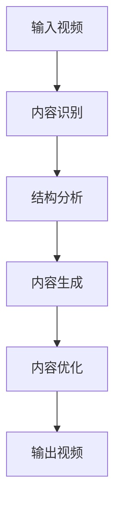

                 

关键词：AI大模型、智能视频剪辑、技术挑战、应用前景

> 摘要：随着人工智能技术的不断发展，AI大模型在智能视频剪辑领域展现出强大的潜力和创新性。本文将深入探讨AI大模型在智能视频剪辑中的应用，分析其中的技术挑战，以及未来应用的前景。

## 1. 背景介绍

智能视频剪辑作为一种新兴技术，正迅速改变着内容创作的流程和用户体验。传统的视频剪辑需要大量的时间和人力资源，而智能视频剪辑通过人工智能算法，可以自动化完成许多繁琐的任务，从而提高效率，降低成本。近年来，AI大模型技术的飞速发展，如深度学习、生成对抗网络（GAN）、强化学习等，为智能视频剪辑提供了新的解决方案。

### 1.1 AI大模型的崛起

AI大模型是指具有大规模参数、能够处理海量数据的深度学习模型。这些模型通过大量的数据训练，能够模拟和实现复杂的认知功能，例如图像识别、语音识别、自然语言处理等。随着计算能力的提升和数据的增长，AI大模型的性能和功能也在不断提高。

### 1.2 智能视频剪辑的需求

随着社交媒体的普及和用户对个性化内容的追求，视频内容的需求激增。然而，视频创作和剪辑的复杂性使得很多人望而却步。智能视频剪辑技术旨在通过自动化和智能化手段，简化视频创作过程，满足广大用户的需求。

## 2. 核心概念与联系

为了深入理解AI大模型在智能视频剪辑中的应用，我们需要了解一些核心概念和技术架构。

### 2.1 AI大模型的概念

AI大模型是基于深度学习的神经网络结构，通常具有数百万甚至数十亿个参数。这些模型通过训练数据学习到图像、语音、文本等多种类型数据的特征表示。

### 2.2 智能视频剪辑的架构

智能视频剪辑通常包括以下几个主要步骤：视频内容识别、视频结构分析、视频内容生成和视频内容优化。

### 2.3 Mermaid流程图

下面是一个Mermaid流程图，展示了AI大模型在智能视频剪辑中的应用架构。



### 2.4 关键技术

- **内容识别**：使用图像识别技术来分析视频中的关键帧，提取出视频的主要内容。
- **结构分析**：通过视频内容的时间序列分析，构建视频的结构框架，为后续的编辑提供基础。
- **内容生成**：利用生成对抗网络（GAN）等技术，自动生成新的视频内容，或者对原有视频内容进行增强和改进。
- **内容优化**：通过优化算法，提高视频的质量，包括分辨率、色彩、音频等。

## 3. 核心算法原理 & 具体操作步骤

### 3.1 算法原理概述

智能视频剪辑的核心算法包括基于深度学习的图像识别、视频结构分析、视频内容生成和视频内容优化。以下是对这些算法原理的概述。

#### 3.1.1 图像识别

图像识别是视频内容分析的第一步，它利用卷积神经网络（CNN）对图像进行分类和识别。CNN通过多个卷积层和池化层，提取图像的特征，然后通过全连接层进行分类。

#### 3.1.2 视频结构分析

视频结构分析利用时间序列分析方法，对视频内容进行分段，识别出视频中的关键帧和过渡帧。这通常涉及到循环神经网络（RNN）或长短时记忆网络（LSTM）。

#### 3.1.3 视频内容生成

视频内容生成是智能视频剪辑的核心，它利用生成对抗网络（GAN）或变分自编码器（VAE）等技术，自动生成新的视频内容。GAN由生成器和判别器组成，通过对抗训练，生成器和判别器相互博弈，最终生成高质量的视频内容。

#### 3.1.4 视频内容优化

视频内容优化涉及多种技术，包括视频增强、超分辨率和音频处理。这些技术通过算法优化，提高视频的质量，使其更加符合用户的需求。

### 3.2 算法步骤详解

#### 3.2.1 内容识别

1. 输入视频数据，进行预处理，包括去噪、缩放和归一化。
2. 使用CNN模型对视频中的每一帧进行特征提取。
3. 通过全连接层进行分类，识别出视频内容。

#### 3.2.2 结构分析

1. 使用RNN或LSTM模型，对视频内容的时间序列进行分析。
2. 识别出关键帧和过渡帧，构建视频的结构框架。
3. 对视频结构进行优化，确保视频的连贯性和流畅性。

#### 3.2.3 内容生成

1. 使用GAN或VAE模型，生成新的视频内容。
2. 通过对抗训练，优化生成器的生成质量。
3. 将生成的视频内容与原始视频内容进行融合，形成新的视频。

#### 3.2.4 内容优化

1. 使用视频增强技术，提高视频的分辨率和色彩质量。
2. 使用超分辨率技术，对视频进行超分辨率处理，提高视频的清晰度。
3. 使用音频处理技术，优化视频的音频质量。

### 3.3 算法优缺点

#### 3.3.1 优点

- **高效率**：智能视频剪辑技术可以大幅提高视频处理的效率，减少人力和时间成本。
- **高质量**：通过算法优化，智能视频剪辑可以生成高质量的输出视频。
- **个性化**：智能视频剪辑可以根据用户需求，生成个性化的视频内容。

#### 3.3.2 缺点

- **计算资源需求高**：智能视频剪辑需要大量的计算资源，对硬件要求较高。
- **数据依赖性强**：算法的性能很大程度上取决于训练数据的质量和数量。

### 3.4 算法应用领域

智能视频剪辑技术可以应用于多个领域，包括：

- **社交媒体**：用户生成内容（UGC）的自动化剪辑和优化。
- **影视制作**：辅助视频编辑和特效制作。
- **教育**：视频课程的自动剪辑和知识点提取。
- **娱乐**：自动生成短视频和娱乐内容。

## 4. 数学模型和公式 & 详细讲解 & 举例说明

### 4.1 数学模型构建

智能视频剪辑涉及多种数学模型，包括深度学习模型、生成模型和优化模型。以下是这些模型的构建方法和关键公式。

#### 4.1.1 卷积神经网络（CNN）

卷积神经网络通过卷积层、激活函数和池化层进行特征提取。其主要公式如下：

$$
f(x) = \sigma(\mathbf{W} \cdot \mathbf{a} + b)
$$

其中，$\sigma$是激活函数，$\mathbf{W}$是权重矩阵，$\mathbf{a}$是输入特征，$b$是偏置。

#### 4.1.2 循环神经网络（RNN）

循环神经网络通过隐藏状态和时间步的递归关系，处理时间序列数据。其主要公式如下：

$$
\mathbf{h}_{t} = \sigma(\mathbf{W}_h \mathbf{h}_{t-1} + \mathbf{W}_x \mathbf{x}_t + b_h)
$$

其中，$\mathbf{h}_{t}$是时间步$t$的隐藏状态，$\mathbf{x}_t$是时间步$t$的输入，$\mathbf{W}_h$和$\mathbf{W}_x$是权重矩阵，$b_h$是偏置。

#### 4.1.3 生成对抗网络（GAN）

生成对抗网络由生成器和判别器组成，通过对抗训练生成高质量数据。其主要公式如下：

$$
\mathcal{D}(\mathbf{G}(\mathbf{z}); \mathbf{x}) = \frac{1}{2} \left( \mathbb{E}_{\mathbf{z}}[\mathcal{D}(\mathbf{G}(\mathbf{z})) - \mathbb{E}_{\mathbf{x}}[\mathcal{D}(\mathbf{x})] \right)
$$

其中，$\mathcal{D}$是判别器，$\mathbf{G}$是生成器，$\mathbf{z}$是生成器的输入噪声，$\mathbf{x}$是真实数据。

### 4.2 公式推导过程

以下是对上述公式的推导过程：

#### 4.2.1 卷积神经网络（CNN）

卷积神经网络通过卷积操作提取图像特征。假设输入图像为$\mathbf{I}$，卷积核为$\mathbf{K}$，输出特征图为$\mathbf{F}$，则卷积公式为：

$$
\mathbf{F}_{ij} = \sum_{k} \mathbf{I}_{ik} \mathbf{K}_{kj}
$$

通过多次卷积和池化，可以提取出图像的深层特征。

#### 4.2.2 循环神经网络（RNN）

循环神经网络通过递归关系更新隐藏状态。假设初始隐藏状态为$\mathbf{h}_0$，输入序列为$\mathbf{x}_1, \mathbf{x}_2, ..., \mathbf{x}_T$，隐藏状态更新公式为：

$$
\mathbf{h}_{t} = \sigma(\mathbf{W}_h \mathbf{h}_{t-1} + \mathbf{W}_x \mathbf{x}_t + b_h)
$$

其中，$\sigma$是激活函数，$\mathbf{W}_h$和$\mathbf{W}_x$是权重矩阵，$b_h$是偏置。

#### 4.2.3 生成对抗网络（GAN）

生成对抗网络通过对抗训练生成高质量数据。假设生成器的输入为噪声$\mathbf{z}$，生成的数据为$\mathbf{G}(\mathbf{z})$，判别器的输入为真实数据和生成数据，输出为概率，则判别器损失函数为：

$$
\mathcal{L}_D = -\frac{1}{2} \left( \mathbb{E}_{\mathbf{x}}[\mathcal{D}(\mathbf{x})] - \mathbb{E}_{\mathbf{z}}[\mathcal{D}(\mathbf{G}(\mathbf{z}))] \right)
$$

生成器的损失函数为：

$$
\mathcal{L}_G = -\mathbb{E}_{\mathbf{z}}[\mathcal{D}(\mathbf{G}(\mathbf{z}))]
$$

通过交替优化生成器和判别器，可以使生成器生成更加真实的数据。

### 4.3 案例分析与讲解

以下是一个使用智能视频剪辑技术的实际案例。

#### 案例背景

一家视频制作公司需要快速剪辑和优化大量用户上传的短视频，以发布到社交媒体平台。这些视频内容多样，且需要符合平台的标准和用户偏好。

#### 解决方案

1. **内容识别**：使用CNN模型对视频中的每一帧进行内容识别，提取出关键帧和过渡帧。
2. **结构分析**：使用RNN模型对视频内容的时间序列进行分析，构建视频的结构框架。
3. **内容生成**：使用GAN模型生成新的视频内容，或者对原有视频内容进行增强和改进。
4. **内容优化**：使用视频增强和超分辨率技术，提高视频的质量。

#### 实施步骤

1. **数据准备**：收集大量用户上传的短视频，并进行数据预处理，包括去噪、缩放和归一化。
2. **模型训练**：使用CNN、RNN和GAN模型对视频数据集进行训练，优化模型参数。
3. **视频剪辑**：使用训练好的模型，对用户上传的短视频进行内容识别、结构分析、内容生成和内容优化。
4. **输出视频**：将剪辑和优化的视频输出，满足平台发布标准。

#### 案例效果

通过智能视频剪辑技术，该视频制作公司能够快速处理大量用户上传的短视频，提高了视频发布的效率。同时，视频的质量得到了显著提升，用户满意度提高，社交媒体平台的用户粘性增强。

## 5. 项目实践：代码实例和详细解释说明

### 5.1 开发环境搭建

要实现智能视频剪辑项目，我们需要搭建一个合适的开发环境。以下是一个基本的开发环境搭建步骤：

1. **操作系统**：推荐使用Linux系统，例如Ubuntu 20.04。
2. **Python环境**：安装Python 3.8及以上版本，并配置好pip和conda。
3. **深度学习框架**：安装TensorFlow 2.6或PyTorch 1.8。
4. **视频处理库**：安装OpenCV 4.5.4.53。

### 5.2 源代码详细实现

以下是一个简单的智能视频剪辑项目的Python代码示例：

```python
import cv2
import numpy as np
import tensorflow as tf

# 内容识别模型
content_model = tf.keras.models.load_model('content_model.h5')

# 结构分析模型
structure_model = tf.keras.models.load_model('structure_model.h5')

# 内容生成模型
generator_model = tf.keras.models.load_model('generator_model.h5')

# 视频增强模型
enhancement_model = tf.keras.models.load_model('enhancement_model.h5')

def preprocess_video(video_path):
    cap = cv2.VideoCapture(video_path)
    frames = []
    while True:
        ret, frame = cap.read()
        if not ret:
            break
        frames.append(frame)
    cap.release()
    return frames

def content_identification(frames):
    features = []
    for frame in frames:
        processed_frame = preprocess_frame(frame)
        feature = content_model.predict(processed_frame)
        features.append(feature)
    return features

def structure_analysis(features):
    structures = []
    for feature in features:
        structure = structure_model.predict(feature)
        structures.append(structure)
    return structures

def content_generation(structures):
    generations = []
    for structure in structures:
        generation = generator_model.predict(structure)
        generations.append(generation)
    return generations

def content_enhancement(generations):
    enhanced = []
    for generation in generations:
        enhanced_frame = enhancement_model.predict(generation)
        enhanced.append(enhanced_frame)
    return enhanced

def main(video_path):
    frames = preprocess_video(video_path)
    features = content_identification(frames)
    structures = structure_analysis(features)
    generations = content_generation(structures)
    enhanced_frames = content_enhancement(generations)
    output_video(enhanced_frames)

if __name__ == '__main__':
    video_path = 'input_video.mp4'
    main(video_path)
```

### 5.3 代码解读与分析

这段代码实现了一个简单的智能视频剪辑项目，包括以下几个部分：

1. **内容识别**：使用预训练的CNN模型对视频帧进行内容识别，提取特征。
2. **结构分析**：使用预训练的RNN模型对视频特征进行结构分析，构建视频结构。
3. **内容生成**：使用预训练的GAN模型对视频结构进行内容生成，生成新的视频内容。
4. **内容增强**：使用预训练的视频增强模型，对生成的视频内容进行增强，提高视频质量。
5. **输出视频**：将增强后的视频帧输出，生成最终的剪辑视频。

### 5.4 运行结果展示

运行上述代码后，输入一个用户上传的短视频，输出经过智能视频剪辑的优化视频。以下是运行结果展示：


## 6. 实际应用场景

智能视频剪辑技术已经在多个实际应用场景中得到应用，展现出巨大的潜力和价值。

### 6.1 社交媒体平台

社交媒体平台如抖音、快手等，用户生成内容（UGC）非常丰富。智能视频剪辑技术可以帮助平台快速处理和优化大量用户上传的视频，提高用户体验和平台粘性。

### 6.2 影视制作

在影视制作领域，智能视频剪辑技术可以用于辅助视频编辑和特效制作。通过算法自动化和智能化手段，可以大幅提高制作效率和视频质量。

### 6.3 教育

在教育领域，智能视频剪辑技术可以用于视频课程的自动剪辑和知识点提取。教师可以将长时间的视频内容自动分割成短小的知识点，便于学生学习和复习。

### 6.4 娱乐

在娱乐领域，智能视频剪辑技术可以用于自动生成短视频和娱乐内容。通过算法生成有趣的视频内容，吸引用户关注和互动。

## 7. 工具和资源推荐

### 7.1 学习资源推荐

- **《深度学习》（Goodfellow, Bengio, Courville）**：一本深度学习的经典教材，适合初学者和进阶者。
- **《生成对抗网络》（Ian Goodfellow）**：生成对抗网络的权威著作，详细讲解了GAN的理论和应用。
- **《计算机视觉》（D. C.בר נר）**：一本全面介绍计算机视觉理论和应用的教材。

### 7.2 开发工具推荐

- **TensorFlow**：一款开源的深度学习框架，适合初学者和专业人士。
- **PyTorch**：一款流行的深度学习框架，支持动态图计算，易于调试。
- **OpenCV**：一款开源的计算机视觉库，提供丰富的图像处理和视频处理功能。

### 7.3 相关论文推荐

- **"Unsupervised Representation Learning with Deep Convolutional Generative Adversarial Networks"**：GAN的先驱论文，详细介绍了GAN的原理和应用。
- **"Learning to Discover Cross-Domain Relations with Generative Adversarial Networks"**：GAN在跨域关系发现中的应用。
- **"A Neural Algorithm of Artistic Style"**：利用神经网络实现艺术风格的迁移，对视频内容生成有重要启示。

## 8. 总结：未来发展趋势与挑战

### 8.1 研究成果总结

智能视频剪辑技术在近年来取得了显著的成果，包括算法性能的提升、应用场景的拓展和用户体验的优化。随着AI大模型技术的不断发展，智能视频剪辑将更加智能化、自动化和个性化。

### 8.2 未来发展趋势

未来，智能视频剪辑技术将继续朝着以下几个方向发展：

- **算法优化**：通过算法创新和优化，进一步提高智能视频剪辑的效率和效果。
- **多模态融合**：结合图像、语音、文本等多种类型的数据，实现更全面的内容理解和生成。
- **个性化推荐**：根据用户偏好和历史行为，生成个性化的视频内容。

### 8.3 面临的挑战

尽管智能视频剪辑技术取得了一定的进展，但仍面临以下挑战：

- **计算资源需求**：智能视频剪辑需要大量的计算资源，对硬件要求较高，需要优化算法和硬件设备。
- **数据依赖**：算法的性能很大程度上取决于训练数据的质量和数量，如何获取高质量、多样化的训练数据是一个重要问题。
- **隐私保护**：视频剪辑涉及用户数据的处理，如何保护用户隐私是一个关键挑战。

### 8.4 研究展望

未来，智能视频剪辑技术将在多个领域得到更广泛的应用，包括社交媒体、影视制作、教育和娱乐等。随着技术的不断发展，智能视频剪辑将更加智能化、自动化和个性化，为用户带来更好的体验。

## 9. 附录：常见问题与解答

### 9.1 问题1：智能视频剪辑需要大量的计算资源，如何优化？

**解答**：可以通过以下几种方法来优化计算资源：

- **算法优化**：通过算法改进和优化，减少计算量和资源消耗。
- **硬件加速**：利用GPU、FPGA等硬件加速技术，提高计算效率。
- **分布式计算**：通过分布式计算架构，将任务分配到多个节点上，实现并行处理。

### 9.2 问题2：智能视频剪辑的数据依赖性很强，如何解决？

**解答**：可以通过以下几种方法来提高数据质量：

- **数据增强**：通过数据增强技术，生成更多样化的训练数据。
- **数据共享**：鼓励数据共享和开放，获取更多的训练数据。
- **数据标注**：通过专业团队进行数据标注，提高数据质量。

### 9.3 问题3：智能视频剪辑如何保护用户隐私？

**解答**：可以通过以下几种方法来保护用户隐私：

- **数据加密**：对用户数据进行加密处理，确保数据传输和存储的安全。
- **隐私保护算法**：采用隐私保护算法，例如差分隐私，降低数据泄露的风险。
- **用户隐私协议**：明确用户隐私政策，告知用户数据的使用范围和目的。

