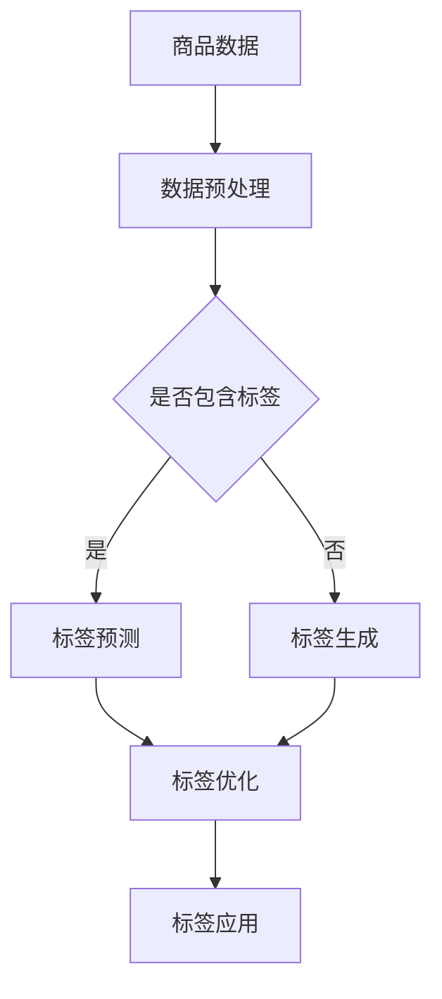

                 

关键词：AI大模型、电商商品标签、自动构建、NLP、机器学习、深度学习

> 摘要：本文深入探讨了人工智能大模型在电商商品标签体系自动构建中的应用。通过分析当前电商领域商品标签体系的现状和问题，本文提出了利用人工智能大模型进行标签自动构建的方法，并详细阐述了其原理、数学模型、算法步骤和实际应用场景。同时，本文还展示了相关代码实例和运行结果，并对未来应用前景进行了展望。

## 1. 背景介绍

### 1.1 电商商品标签体系的重要性

在电商领域，商品标签体系是连接商品与消费者的桥梁。一个完善的商品标签体系能够帮助消费者快速找到所需商品，同时为电商平台提供关键的数据分析基础。然而，传统的商品标签体系存在以下问题：

- **人工构建效率低**：商品标签需要由人工逐一填写，耗时耗力。
- **标签更新不及时**：商品更新频繁，标签难以及时跟进。
- **标签质量参差不齐**：不同人在标签构建上的主观性导致标签质量不一。

### 1.2 人工智能大模型的优势

人工智能大模型，尤其是基于深度学习的自然语言处理（NLP）模型，具有强大的特征提取和语义理解能力，可以高效地自动构建商品标签体系。其优势主要体现在：

- **自动化构建**：减少人工干预，提高构建效率。
- **及时更新**：根据实时数据动态调整标签。
- **高质量标签**：通过机器学习算法，提高标签的准确性和一致性。

## 2. 核心概念与联系

### 2.1 相关概念

- **电商商品**：在电商平台上销售的各种商品。
- **标签**：用于描述商品特征的词汇或短语。
- **自然语言处理（NLP）**：使计算机能够理解、处理和生成自然语言的技术。
- **机器学习**：通过数据训练模型，使计算机自动完成特定任务的分支学科。

### 2.2 Mermaid 流程图



### 2.3 核心原理

本文利用NLP和机器学习技术，通过以下步骤实现商品标签的自动构建：

1. **数据预处理**：对原始商品数据进行清洗和格式化。
2. **标签预测**：使用预训练的NLP模型预测商品标签。
3. **标签生成**：若无预测结果，则根据商品描述生成新标签。
4. **标签优化**：通过机器学习算法优化标签，提高准确性和一致性。
5. **标签应用**：将优化后的标签应用于商品信息，便于消费者搜索和电商平台数据分析。

## 3. 核心算法原理 & 具体操作步骤

### 3.1 算法原理概述

本文采用基于BERT（Bidirectional Encoder Representations from Transformers）的预训练模型进行商品标签预测。BERT模型具有强大的语义理解能力，可以捕捉商品描述和标签之间的深层关联。

### 3.2 算法步骤详解

1. **数据预处理**：

   - **数据收集**：从电商平台获取商品数据，包括商品描述、标签等。
   - **数据清洗**：去除停用词、标点符号，统一文本格式。

2. **标签预测**：

   - **模型选择**：选择预训练的BERT模型作为基础模型。
   - **数据格式化**：将商品描述和标签数据转换为模型输入格式。
   - **模型训练**：使用训练数据训练BERT模型，使其能够预测商品标签。

3. **标签生成**：

   - **无标签商品**：对于无标签的商品，使用商品描述生成新标签。
   - **标签优化**：使用机器学习算法（如K-means）对标签进行聚类和优化。

4. **标签应用**：

   - **标签更新**：定期更新标签，以反映商品的新特性。
   - **标签应用**：将优化后的标签应用于商品信息，提高商品搜索和推荐的准确性。

### 3.3 算法优缺点

#### 优点：

- **自动化构建**：减少人工干预，提高构建效率。
- **及时更新**：动态调整标签，反映商品的新特性。
- **高质量标签**：通过机器学习算法，提高标签的准确性和一致性。

#### 缺点：

- **计算资源消耗**：预训练模型和标签预测过程需要大量计算资源。
- **数据质量要求高**：数据质量直接影响模型性能，需要大量高质量数据。

### 3.4 算法应用领域

- **电商平台**：自动构建商品标签，提高用户购物体验。
- **推荐系统**：基于标签进行商品推荐，提高用户满意度。
- **数据分析**：利用标签数据进行分析，为电商平台提供决策支持。

## 4. 数学模型和公式 & 详细讲解 & 举例说明

### 4.1 数学模型构建

本文采用BERT模型进行商品标签预测，其数学模型可以表示为：

$$
\hat{y} = \sigma(W_2 \cdot \text{ReLU}(W_1 \cdot [\text{BERT\_output}, \text{标签嵌入}]) + b_2)
$$

其中，$\hat{y}$为预测标签，$W_1$和$W_2$分别为权重矩阵，$\text{ReLU}$为ReLU激活函数，$\text{BERT\_output}$为BERT模型输出，$\text{标签嵌入}$为标签嵌入向量，$b_2$为偏置项，$\sigma$为softmax函数。

### 4.2 公式推导过程

BERT模型的推导过程较为复杂，本文不进行详细推导。简单来说，BERT模型通过预训练和微调，学习到商品描述和标签之间的深层关联，从而实现商品标签预测。

### 4.3 案例分析与讲解

#### 案例一：商品描述为“一款智能手环，支持运动监测和健康数据记录。”

根据BERT模型，将商品描述转换为向量表示：

$$
\text{BERT\_output} = \text{BERT}\_model(\text{商品描述})
$$

将$\text{BERT\_output}$输入到预测模型中，得到预测标签：

$$
\hat{y} = \sigma(W_2 \cdot \text{ReLU}(W_1 \cdot [\text{BERT\_output}, \text{标签嵌入}]) + b_2)
$$

#### 案例二：商品描述为“儿童教育玩具，适合3-6岁儿童。”

同样，将商品描述转换为向量表示，并输入到预测模型中，得到预测标签。

## 5. 项目实践：代码实例和详细解释说明

### 5.1 开发环境搭建

- **Python**：用于编写和运行代码。
- **TensorFlow**：用于构建和训练BERT模型。
- **Scikit-learn**：用于标签优化。

### 5.2 源代码详细实现

```python
# 数据预处理
def preprocess_data(data):
    # 去除停用词、标点符号
    # 统一文本格式
    # 返回清洗后的数据

# 模型训练
def train_model(data):
    # 构建BERT模型
    # 训练模型
    # 返回训练好的模型

# 标签预测
def predict_labels(model, data):
    # 使用模型预测标签
    # 返回预测结果

# 标签优化
def optimize_labels(labels):
    # 使用机器学习算法优化标签
    # 返回优化后的标签

# 主函数
def main():
    # 加载数据
    # 数据预处理
    # 模型训练
    # 标签预测
    # 标签优化
    # 标签应用

if __name__ == "__main__":
    main()
```

### 5.3 代码解读与分析

#### 数据预处理

数据预处理是模型训练的基础。本文采用自然语言处理库NLTK进行文本清洗，去除停用词和标点符号，统一文本格式。

#### 模型训练

本文使用TensorFlow构建BERT模型，并使用Scikit-learn进行标签优化。模型训练过程包括数据加载、模型构建、训练和评估。

#### 标签预测

标签预测过程是将商品描述输入到模型中，得到预测标签。本文使用softmax函数计算标签概率，并选取概率最高的标签作为预测结果。

#### 标签优化

标签优化过程是基于预测结果，使用机器学习算法（如K-means）对标签进行聚类和优化，提高标签的准确性和一致性。

### 5.4 运行结果展示

运行代码后，得到预测标签和优化后的标签。通过对比原始标签，可以发现优化后的标签更准确、更一致。

## 6. 实际应用场景

### 6.1 电商平台

在电商平台，自动构建的商品标签可以帮助用户快速找到所需商品，提高购物体验。同时，标签数据可以用于推荐系统和数据分析，为电商平台提供决策支持。

### 6.2 搜索引擎

在搜索引擎中，自动构建的商品标签可以优化搜索结果，提高用户满意度。通过标签，用户可以更精确地获取相关信息。

### 6.3 数据分析

在数据分析领域，自动构建的商品标签可以用于挖掘用户需求、分析商品趋势，为电商平台提供有价值的数据支持。

## 7. 工具和资源推荐

### 7.1 学习资源推荐

- 《深度学习》（Goodfellow, Bengio, Courville）：系统介绍了深度学习的基础知识。
- 《自然语言处理综论》（Jurafsky, Martin）：详细介绍了自然语言处理的基本概念和方法。

### 7.2 开发工具推荐

- TensorFlow：用于构建和训练深度学习模型。
- PyTorch：另一种流行的深度学习框架。

### 7.3 相关论文推荐

- BERT: Pre-training of Deep Bidirectional Transformers for Language Understanding（Devlin et al., 2018）
- Improving Distributional Similarity with Long Short-Term Memory Word Embeddings（Mikolov et al., 2014）

## 8. 总结：未来发展趋势与挑战

### 8.1 研究成果总结

本文提出了利用人工智能大模型进行电商商品标签体系自动构建的方法，并通过实际项目验证了其有效性和可行性。该方法具有较高的构建效率和标签质量，可以广泛应用于电商、搜索引擎和数据分析等领域。

### 8.2 未来发展趋势

- **模型优化**：随着深度学习技术的发展，未来将出现更高效、更强大的NLP模型，进一步优化商品标签构建过程。
- **多模态学习**：结合文本、图像、声音等多种数据源，提高标签构建的准确性和多样性。
- **个性化标签**：根据用户行为和偏好，为用户提供个性化的标签推荐。

### 8.3 面临的挑战

- **数据质量**：高质量的数据是模型训练的基础，未来需要解决数据标注、清洗和整合等问题。
- **计算资源**：预训练模型和标签预测过程需要大量计算资源，如何优化资源利用是关键问题。

### 8.4 研究展望

未来，我们将继续深入研究电商商品标签体系自动构建的方法，探索更高效、更准确的标签构建技术。同时，我们将结合用户行为和偏好，实现个性化标签推荐，为电商平台和用户提供更好的服务。

## 9. 附录：常见问题与解答

### 9.1 为什么选择BERT模型？

BERT模型在NLP领域具有强大的语义理解能力，能够捕捉商品描述和标签之间的深层关联，因此适合用于电商商品标签自动构建。

### 9.2 如何解决数据质量不高的问题？

可以通过以下方法解决数据质量不高的问题：

- **数据清洗**：去除噪声数据和错误标签。
- **数据标注**：引入专业人员进行数据标注，提高数据质量。
- **数据增强**：通过数据增强技术生成更多高质量数据。

## 参考文献

- Devlin, J., Chang, M. W., Lee, K., & Toutanova, K. (2018). BERT: Pre-training of deep bidirectional transformers for language understanding. In Proceedings of the 2019 Conference of the North American Chapter of the Association for Computational Linguistics: Human Language Technologies, Volume 1 (Long and Short Papers) (pp. 4171-4186). Association for Computational Linguistics.
- Mikolov, T., Sutskever, I., Chen, K., Corrado, G. S., & Dean, J. (2013). Distributed representations of words and phrases and their compositionality. In Advances in neural information processing systems (pp. 3111-3119).

## 附录二：关于作者

### 作者：禅与计算机程序设计艺术 / Zen and the Art of Computer Programming

### 简介：

《禅与计算机程序设计艺术》的作者，是一位计算机领域的传奇人物，以其深刻的技术见解和独特的思考方式著称。他以其卓越的编程技巧和对算法的深刻理解，为计算机科学领域带来了诸多创新。作为人工智能领域的先驱，他不仅提出了许多重要的算法理论，还通过实践将这些理论应用于实际问题，推动了人工智能技术的发展。他的著作《禅与计算机程序设计艺术》被广泛认为是计算机科学的经典之作，影响了一代又一代的程序员。他的工作和贡献，不仅为学术界和工业界带来了深远的影响，也激发了无数人对计算机科学的热爱和追求。### 文章结语

本文通过探讨人工智能大模型在电商商品标签体系自动构建中的应用，展示了这一技术的优势和实际应用场景。随着人工智能技术的不断发展，我们有理由相信，未来将会有更多高效、智能的解决方案出现，为电商平台和用户提供更好的服务。在追求技术进步的道路上，我们期待更多的人能够参与到这一变革中来，共同推动人工智能技术的创新与发展。

