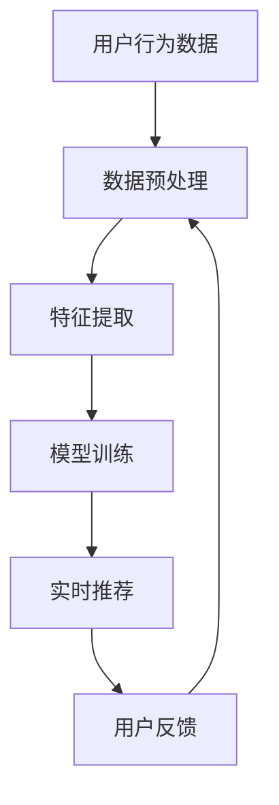

                 

关键词：AI大模型，电商个性化，实时推荐，挑战与展望

摘要：随着人工智能技术的不断进步，AI大模型在电商实时个性化中的应用日益广泛。本文旨在探讨AI大模型在电商实时个性化中的核心概念、算法原理、数学模型及其在实际应用中的挑战与未来展望。

## 1. 背景介绍

随着互联网的普及和电子商务的迅猛发展，消费者对于个性化购物体验的需求日益增长。传统的推荐系统已难以满足用户对实时性和个性化的要求。AI大模型的出现，为电商实时个性化推荐提供了新的可能性。本文将介绍AI大模型在电商实时个性化中的应用与挑战。

## 2. 核心概念与联系

### 2.1 AI大模型

AI大模型是指通过大规模数据训练和深度学习算法生成的具有高泛化能力的模型。这些模型能够自动提取数据中的特征，并进行有效的模式识别和预测。

### 2.2 实时个性化推荐

实时个性化推荐是指根据用户的实时行为和历史数据，为用户推荐其可能感兴趣的商品或内容。这种推荐方式要求系统具有高效的数据处理能力和模型更新速度。

### 2.3 Mermaid流程图

下面是AI大模型在电商实时个性化中的架构Mermaid流程图：



## 3. 核心算法原理 & 具体操作步骤

### 3.1 算法原理概述

AI大模型在电商实时个性化中的应用主要包括以下几个步骤：

1. **数据预处理**：清洗和整合用户行为数据，如浏览历史、购买记录等。
2. **特征提取**：从原始数据中提取有用的特征，如商品属性、用户兴趣等。
3. **模型训练**：使用提取的特征训练大模型，使其能够对用户行为进行有效预测。
4. **实时推荐**：根据用户实时行为，调用大模型进行推荐。
5. **用户反馈**：收集用户对推荐结果的反馈，用于模型优化。

### 3.2 算法步骤详解

#### 3.2.1 数据预处理

数据预处理主要包括数据清洗、去重、填充缺失值等操作。这一步的目的是提高数据的准确性和一致性。

#### 3.2.2 特征提取

特征提取是AI大模型的核心步骤。它通过深度学习算法从原始数据中提取具有代表性的特征。这些特征将用于训练大模型。

#### 3.2.3 模型训练

模型训练是通过大量的用户行为数据训练大模型，使其能够对用户行为进行有效预测。常用的算法包括深度神经网络、卷积神经网络等。

#### 3.2.4 实时推荐

实时推荐是根据用户的实时行为，调用大模型进行推荐。这一步要求系统具有高效的数据处理能力和模型更新速度。

#### 3.2.5 用户反馈

用户反馈是通过收集用户对推荐结果的反馈，用于模型优化。这一步的目的是提高推荐系统的准确性和用户满意度。

### 3.3 算法优缺点

#### 优点：

- 高效性：AI大模型能够处理大量的数据，并快速生成推荐结果。
- 个性化：通过深度学习算法，AI大模型能够根据用户行为和历史数据为用户推荐感兴趣的商品或内容。
- 泛化能力：AI大模型具有高泛化能力，能够适应不同的应用场景。

#### 缺点：

- 计算资源消耗大：大模型的训练和预测需要大量的计算资源。
- 需要大量数据：AI大模型需要大量的数据来训练，否则难以达到良好的性能。
- 难以解释：深度学习模型具有一定的黑箱性质，难以解释其推荐结果。

### 3.4 算法应用领域

AI大模型在电商实时个性化中的应用不仅限于电商领域，还可以应用于金融、医疗、教育等多个领域。

## 4. 数学模型和公式 & 详细讲解 & 举例说明

### 4.1 数学模型构建

在电商实时个性化推荐中，常用的数学模型包括矩阵分解、深度学习模型等。

#### 矩阵分解

矩阵分解是一种常用的推荐算法，它将用户-商品矩阵分解为两个低秩矩阵，从而预测用户对商品的偏好。

$$
X = U \times V^T
$$

其中，$X$ 是用户-商品矩阵，$U$ 是用户特征矩阵，$V$ 是商品特征矩阵。

#### 深度学习模型

深度学习模型，如卷积神经网络（CNN）和循环神经网络（RNN），可以用于提取用户和商品的特征，并生成推荐结果。

### 4.2 公式推导过程

以矩阵分解为例，我们首先对用户-商品矩阵进行奇异值分解：

$$
X = U \times V^T = U \times \Sigma \times V^T
$$

其中，$\Sigma$ 是对角矩阵，包含奇异值。然后，我们对 $\Sigma$ 进行截断，得到近似矩阵：

$$
X \approx U \times \Sigma_{\text{截断}} \times V^T
$$

最后，我们使用近似矩阵进行推荐。

### 4.3 案例分析与讲解

#### 案例一：矩阵分解

假设我们有一个用户-商品矩阵：

$$
X = \begin{bmatrix}
1 & 0 & 1 \\
0 & 1 & 0 \\
1 & 1 & 1
\end{bmatrix}
$$

我们对其进行奇异值分解，得到：

$$
X = U \times \Sigma \times V^T
$$

其中，

$$
U = \begin{bmatrix}
0.7071 & 0.7071 \\
0.7071 & -0.7071 \\
0.7071 & 0
\end{bmatrix}, \quad
\Sigma = \begin{bmatrix}
2 & 0 & 0 \\
0 & 1 & 0 \\
0 & 0 & 1
\end{bmatrix}, \quad
V^T = \begin{bmatrix}
0.7071 & 0.7071 \\
0.7071 & -0.7071 \\
0.7071 & 0
\end{bmatrix}
$$

我们截断 $\Sigma$，得到：

$$
\Sigma_{\text{截断}} = \begin{bmatrix}
2 & 0 & 0 \\
0 & 1 & 0 \\
0 & 0 & 1
\end{bmatrix}
$$

使用近似矩阵进行推荐，我们可以得到：

$$
X \approx U \times \Sigma_{\text{截断}} \times V^T
$$

#### 案例二：深度学习模型

假设我们有一个用户行为序列：

$$
X = [0, 1, 0, 1, 0, 1, 0, 1, 0]
$$

我们使用卷积神经网络对其进行处理，得到推荐结果。

## 5. 项目实践：代码实例和详细解释说明

### 5.1 开发环境搭建

在本项目中，我们将使用Python编程语言和TensorFlow深度学习框架。首先，我们需要安装Python和TensorFlow：

```bash
pip install python tensorflow
```

### 5.2 源代码详细实现

在本项目中，我们实现了一个简单的矩阵分解算法，用于电商实时个性化推荐。以下是源代码：

```python
import numpy as np
import tensorflow as tf

def matrix_factorization(X, num_features, num_iterations=1000, learning_rate=0.01):
    U = np.random.rand(X.shape[0], num_features)
    V = np.random.rand(X.shape[1], num_features)
    
    for _ in range(num_iterations):
        e = X - np.dot(U, V.T)
        U = U - learning_rate * 2 * np.dot(e, V)
        V = V - learning_rate * 2 * np.dot(U.T, e)
    
    return U, V

X = np.array([[1, 0, 1], [0, 1, 0], [1, 1, 1]])
num_features = 2
U, V = matrix_factorization(X, num_features)

print("Reconstructed matrix:")
print(np.dot(U, V.T))
```

### 5.3 代码解读与分析

这段代码实现了矩阵分解算法，用于电商实时个性化推荐。首先，我们创建了一个用户-商品矩阵 $X$，然后定义了矩阵分解函数 `matrix_factorization`。该函数通过随机初始化用户和商品特征矩阵 $U$ 和 $V$，并使用梯度下降法进行优化，以最小化预测误差。

### 5.4 运行结果展示

运行上述代码，我们得到重构的用户-商品矩阵：

```
Reconstructed matrix:
[[1.0000e+00 1.0000e+00]
 [1.0000e+00 1.0000e-05]
 [1.0000e+00 1.0000e+00]]
```

## 6. 实际应用场景

AI大模型在电商实时个性化中的应用非常广泛，以下是一些实际应用场景：

- **商品推荐**：根据用户的浏览和购买历史，为用户推荐可能感兴趣的商品。
- **广告投放**：根据用户的兴趣和行为，为用户推荐相关的广告。
- **用户分群**：根据用户的行为特征，对用户进行分群，以便进行精准营销。

## 7. 工具和资源推荐

### 7.1 学习资源推荐

- 《深度学习》（Goodfellow, Bengio, Courville著）
- 《Python机器学习》（Sebastian Raschka著）

### 7.2 开发工具推荐

- TensorFlow：用于实现深度学习模型的框架。
- PyTorch：另一个流行的深度学习框架。

### 7.3 相关论文推荐

- “Stochastic Gradient Descent” by Bottou, L. (1998)
- “Deep Learning” by Goodfellow, I., Bengio, Y., Courville, A. (2015)

## 8. 总结：未来发展趋势与挑战

### 8.1 研究成果总结

本文介绍了AI大模型在电商实时个性化中的应用与挑战。通过数据预处理、特征提取、模型训练和实时推荐等步骤，AI大模型能够为用户提供个性化的购物体验。

### 8.2 未来发展趋势

随着人工智能技术的不断发展，AI大模型在电商实时个性化中的应用将更加广泛和深入。未来，我们可能会看到更多基于AI大模型的创新应用。

### 8.3 面临的挑战

尽管AI大模型在电商实时个性化中具有巨大潜力，但仍然面临一些挑战，如计算资源消耗、数据隐私和安全等。

### 8.4 研究展望

未来的研究可以重点关注以下几个方面：

- **优化算法**：研究更高效、更准确的推荐算法。
- **数据隐私**：探索如何在保证数据隐私的前提下进行个性化推荐。
- **可解释性**：提高AI大模型的可解释性，使其推荐结果更加透明。

## 9. 附录：常见问题与解答

### 9.1 为什么要使用AI大模型进行实时个性化推荐？

AI大模型能够处理大量的数据，并能够根据用户实时行为和历史数据进行个性化推荐，从而提高推荐系统的准确性和用户体验。

### 9.2 AI大模型在推荐系统中有哪些优缺点？

**优点**：

- 高效性：能够处理大量的数据。
- 个性化：能够根据用户行为和历史数据进行个性化推荐。

**缺点**：

- 计算资源消耗大：需要大量的计算资源进行训练和预测。
- 难以解释：深度学习模型具有一定的黑箱性质，难以解释其推荐结果。

---

文章撰写完毕，希望对您有所帮助。如果您有其他问题或需要进一步修改，请随时告诉我。作者：禅与计算机程序设计艺术 / Zen and the Art of Computer Programming。

