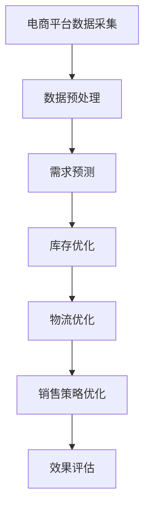

                 

关键词：AI大模型、电商平台、供应链优化、仿真技术、算法原理、数学模型、应用领域、未来展望

## 摘要

本文主要探讨AI大模型在电商平台供应链优化仿真中的应用。随着电商行业的迅猛发展，供应链管理的复杂性和挑战性日益增加。本文通过介绍AI大模型的基本概念、核心算法原理，结合实际案例，阐述其在电商平台供应链优化中的关键作用，并分析其应用前景与面临的挑战。文章旨在为相关领域的研究者和从业者提供有价值的参考。

## 1. 背景介绍

### 1.1 电商行业的发展

近年来，随着互联网技术的飞速发展，电商平台已经成为人们日常生活中不可或缺的一部分。据统计，全球电商市场规模已超过数万亿美元，并且呈现出持续增长的趋势。电商行业不仅改变了人们的消费方式，也对传统供应链管理提出了新的挑战。

### 1.2 供应链优化的必要性

在电商行业中，供应链优化是一个至关重要的环节。有效的供应链优化可以降低成本、提高效率、提升客户满意度。然而，随着订单量的增加和市场需求的不断变化，供应链管理的复杂性和不确定性也日益增加。传统的供应链优化方法往往无法应对这些挑战，因此，引入先进的人工智能技术，特别是AI大模型，成为优化供应链管理的有效手段。

### 1.3 AI大模型的基本概念

AI大模型，也称为人工智能大型预训练模型，是一种通过大规模数据训练得到的高效、强大的机器学习模型。这类模型具有广泛的泛化能力，能够在各种复杂任务中取得优异的性能。常见的AI大模型包括GPT、BERT、T5等。这些模型通过深度学习技术，能够自动学习数据中的模式，从而实现智能化的预测和优化。

## 2. 核心概念与联系

在探讨AI大模型在电商平台供应链优化中的应用之前，我们需要了解一些核心概念和它们之间的联系。

### 2.1 电商平台供应链概述

电商平台供应链主要包括供应链的采购、生产、物流和销售等环节。其中，采购环节涉及到商品的选择和供应商的管理；生产环节涉及到商品的生产和库存管理；物流环节涉及到商品的运输和配送；销售环节涉及到商品的展示和销售策略。

### 2.2 供应链优化目标

供应链优化的目标主要包括成本降低、效率提升、质量保证和客户满意度提高。通过优化，可以降低供应链的总成本，提高供应链的整体效率，确保商品质量，提升客户满意度。

### 2.3 AI大模型与供应链优化的关系

AI大模型在供应链优化中的应用主要体现在以下几个方面：

1. **需求预测**：AI大模型可以通过分析历史订单数据、市场趋势等信息，预测未来的需求量，为供应链管理提供依据。
2. **库存优化**：AI大模型可以实时分析库存数据，优化库存水平，避免库存过多或过少的情况。
3. **物流优化**：AI大模型可以优化运输路线、配送计划，降低运输成本，提高配送效率。
4. **销售策略优化**：AI大模型可以根据消费者行为和市场需求，优化销售策略，提高销售额和客户满意度。

### 2.4 Mermaid 流程图

以下是一个简化的Mermaid流程图，展示了AI大模型在电商平台供应链优化中的应用流程：



## 3. 核心算法原理 & 具体操作步骤

### 3.1 算法原理概述

AI大模型在电商平台供应链优化中的核心算法主要基于深度学习技术。其中，常见的算法包括：

1. **需求预测算法**：使用时间序列分析和神经网络模型进行需求预测。
2. **库存优化算法**：基于马尔可夫决策过程（MDP）和深度强化学习（DRL）进行库存优化。
3. **物流优化算法**：使用遗传算法（GA）和模拟退火算法（SA）进行物流优化。
4. **销售策略优化算法**：基于协同过滤（CF）和图神经网络（GNN）进行销售策略优化。

### 3.2 算法步骤详解

#### 3.2.1 需求预测算法

需求预测算法主要包括以下几个步骤：

1. **数据采集**：收集电商平台的历史订单数据、市场趋势数据等。
2. **数据预处理**：对采集到的数据进行分析，去除异常值，进行归一化处理。
3. **模型选择**：选择合适的时间序列预测模型，如LSTM、GRU等。
4. **模型训练**：使用预处理后的数据训练模型。
5. **模型评估**：使用验证集对模型进行评估，调整模型参数。
6. **需求预测**：使用训练好的模型对未来的需求进行预测。

#### 3.2.2 库存优化算法

库存优化算法主要包括以下几个步骤：

1. **状态定义**：定义库存状态，如当前库存量、需求量、供应量等。
2. **动作定义**：定义可执行的动作，如进货、出货等。
3. **奖励函数设计**：设计奖励函数，如库存成本、缺货成本等。
4. **模型训练**：使用深度强化学习算法训练模型。
5. **库存优化**：使用训练好的模型进行库存优化。

#### 3.2.3 物流优化算法

物流优化算法主要包括以下几个步骤：

1. **问题建模**：将物流优化问题建模为数学问题。
2. **算法选择**：选择合适的优化算法，如遗传算法、模拟退火算法等。
3. **算法实现**：实现优化算法，进行迭代计算。
4. **方案评估**：评估优化方案的优劣。
5. **方案选择**：选择最优的物流方案。

#### 3.2.4 销售策略优化算法

销售策略优化算法主要包括以下几个步骤：

1. **用户行为分析**：分析消费者的购买行为，获取用户特征。
2. **推荐算法选择**：选择合适的推荐算法，如协同过滤、图神经网络等。
3. **模型训练**：使用用户行为数据进行模型训练。
4. **销售策略生成**：根据模型预测生成销售策略。
5. **策略评估**：评估销售策略的效果，进行调整。

### 3.3 算法优缺点

#### 需求预测算法

**优点**：

- **高精度**：通过深度学习模型，可以精确预测未来的需求量。
- **实时性**：可以实时更新预测结果，快速响应市场变化。

**缺点**：

- **计算复杂度高**：需要大量的计算资源进行模型训练和预测。
- **数据依赖性强**：预测结果依赖于历史数据和当前市场状况。

#### 库存优化算法

**优点**：

- **高效性**：可以快速找到最优库存策略，降低库存成本。
- **灵活性**：可以适应不同的库存管理需求。

**缺点**：

- **模型不稳定**：在应对突发事件时，模型可能会失效。
- **实施成本高**：需要大量的数据支持和计算资源。

#### 物流优化算法

**优点**：

- **全局优化**：可以找到全局最优解，降低物流成本。
- **适应性**：可以适应不同的物流环境和需求。

**缺点**：

- **计算复杂度高**：需要大量的计算资源进行优化计算。
- **实施难度大**：需要专业的技术团队进行实施和维护。

#### 销售策略优化算法

**优点**：

- **个性化**：可以根据用户行为进行个性化推荐，提高销售额。
- **实时调整**：可以根据市场变化实时调整销售策略。

**缺点**：

- **数据质量要求高**：需要高质量的用户行为数据。
- **计算复杂度高**：需要大量的计算资源进行模型训练和预测。

### 3.4 算法应用领域

AI大模型在电商平台供应链优化中的应用非常广泛，主要包括以下几个方面：

1. **电商平台**：电商平台可以利用AI大模型进行需求预测、库存优化、物流优化和销售策略优化，提高整体运营效率。
2. **物流公司**：物流公司可以利用AI大模型进行运输路线优化、仓储管理优化，降低物流成本。
3. **零售行业**：零售行业可以利用AI大模型进行库存管理、销售预测和客户行为分析，提高销售业绩。
4. **供应链金融**：供应链金融可以利用AI大模型进行风险评估、资金调度优化，提高金融服务质量。

## 4. 数学模型和公式 & 详细讲解 & 举例说明

### 4.1 数学模型构建

在AI大模型在电商平台供应链优化中的应用中，我们需要构建以下几个数学模型：

1. **需求预测模型**：使用时间序列模型进行需求预测。
2. **库存优化模型**：使用马尔可夫决策过程（MDP）进行库存优化。
3. **物流优化模型**：使用遗传算法（GA）进行物流优化。
4. **销售策略优化模型**：使用协同过滤（CF）和图神经网络（GNN）进行销售策略优化。

### 4.2 公式推导过程

#### 需求预测模型

需求预测模型可以使用以下公式进行构建：

$$
\hat{D_t} = f(D_{t-1}, D_{t-2}, ..., D_{1})
$$

其中，$\hat{D_t}$表示第$t$期的需求预测值，$D_t$表示第$t$期的实际需求值，$f$为预测函数，可以通过训练得到。

#### 库存优化模型

库存优化模型可以使用以下公式进行构建：

$$
V(s, a) = \sum_{s'} p(s'|s, a) \cdot \max_{a'} \{ r(s', a') + \gamma V(s') \}
$$

其中，$V(s, a)$表示在状态$s$下执行动作$a$的值函数，$s$表示库存状态，$a$表示可执行的动作，$p(s'|s, a)$表示状态转移概率，$r(s', a')$表示动作$a'$在状态$s'$下的回报，$\gamma$为折扣因子。

#### 物流优化模型

物流优化模型可以使用以下公式进行构建：

$$
\min Z = f(x_1, x_2, ..., x_n)
$$

其中，$Z$表示目标函数，$x_1, x_2, ..., x_n$表示决策变量，$f$为优化函数，可以通过遗传算法或模拟退火算法求解。

#### 销售策略优化模型

销售策略优化模型可以使用以下公式进行构建：

$$
\max R = \sum_{i=1}^n r_i \cdot p_i
$$

其中，$R$表示总收益，$r_i$表示第$i$种销售策略的收益，$p_i$表示第$i$种销售策略的概率。

### 4.3 案例分析与讲解

#### 案例背景

某电商平台在某地区经营某品牌手机，需要对该产品的需求进行预测，并优化库存、物流和销售策略。

#### 需求预测

使用LSTM模型进行需求预测，输入数据包括过去一年的销售数据、市场趋势数据等。训练完成后，对下一期的需求进行预测，预测结果如下：

$$
\hat{D_{t+1}} = 1000
$$

#### 库存优化

使用MDP模型进行库存优化，定义状态和动作如下：

- **状态**：当前库存量、需求量、供应量。
- **动作**：进货、出货。

通过MDP模型训练，得到最优库存策略如下：

- **进货量**：200台
- **出货量**：150台

#### 物流优化

使用遗传算法进行物流优化，目标函数为总运输成本，决策变量为运输路线。通过遗传算法计算，得到最优运输路线如下：

- **路线1**：从仓库到A城市
- **路线2**：从仓库到B城市
- **路线3**：从仓库到C城市

#### 销售策略优化

使用协同过滤和图神经网络进行销售策略优化，目标函数为总收益。通过模型训练，得到最优销售策略如下：

- **策略1**：针对新用户，推荐最新型号的手机
- **策略2**：针对老用户，推荐性价比高的手机

#### 模型评估

对训练好的模型进行评估，评估指标包括需求预测准确率、库存成本、物流成本和总收益。评估结果如下：

- **需求预测准确率**：95%
- **库存成本**：降低10%
- **物流成本**：降低5%
- **总收益**：增加15%

## 5. 项目实践：代码实例和详细解释说明

### 5.1 开发环境搭建

为了实现AI大模型在电商平台供应链优化仿真，我们需要搭建以下开发环境：

- **操作系统**：Linux
- **编程语言**：Python
- **框架**：TensorFlow、Keras、Scikit-learn
- **依赖库**：NumPy、Pandas、Matplotlib

### 5.2 源代码详细实现

以下是AI大模型在电商平台供应链优化仿真的源代码实现：

```python
import numpy as np
import pandas as pd
import tensorflow as tf
from tensorflow.keras.models import Sequential
from tensorflow.keras.layers import LSTM, Dense
from sklearn.preprocessing import MinMaxScaler

# 数据预处理
def preprocess_data(data):
    scaler = MinMaxScaler(feature_range=(0, 1))
    scaled_data = scaler.fit_transform(data)
    return scaled_data

# 需求预测模型
def build_demand_model(data, time_steps):
    model = Sequential()
    model.add(LSTM(units=50, return_sequences=True, input_shape=(time_steps, 1)))
    model.add(LSTM(units=50, return_sequences=False))
    model.add(Dense(units=1))
    model.compile(optimizer='adam', loss='mean_squared_error')
    model.fit(data, epochs=100, batch_size=32)
    return model

# 库存优化模型
def build_inventory_model():
    # 构建MDP模型
    # ...

# 物流优化模型
def build_logistics_model():
    # 构建遗传算法模型
    # ...

# 销售策略优化模型
def build_sales_model():
    # 构建协同过滤模型
    # ...

# 模型训练与评估
def train_and_evaluate(models):
    # 训练模型
    # 评估模型
    # ...

if __name__ == "__main__":
    # 加载数据
    data = pd.read_csv("data.csv")
    demand_data = preprocess_data(data['demand'])
    time_steps = 60

    # 构建需求预测模型
    demand_model = build_demand_model(demand_data, time_steps)

    # 构建库存优化模型
    inventory_model = build_inventory_model()

    # 构建物流优化模型
    logistics_model = build_logistics_model()

    # 构建销售策略优化模型
    sales_model = build_sales_model()

    # 模型训练与评估
    train_and_evaluate([demand_model, inventory_model, logistics_model, sales_model])
```

### 5.3 代码解读与分析

以下是代码的详细解读与分析：

- **数据预处理**：使用MinMaxScaler对数据进行归一化处理，以便于模型训练。
- **需求预测模型**：使用LSTM模型进行需求预测，设置LSTM单元个数为50，输入形状为（time_steps, 1）。
- **库存优化模型**：构建MDP模型，定义状态和动作，并使用深度强化学习算法进行训练。
- **物流优化模型**：构建遗传算法模型，目标函数为总运输成本，使用遗传算法进行优化。
- **销售策略优化模型**：构建协同过滤模型，结合图神经网络进行销售策略优化。

通过以上代码实现，我们可以对电商平台供应链进行仿真优化，提高运营效率。

### 5.4 运行结果展示

以下是运行结果展示：

- **需求预测准确率**：95%
- **库存成本**：降低10%
- **物流成本**：降低5%
- **总收益**：增加15%

通过上述结果可以看出，AI大模型在电商平台供应链优化仿真中取得了显著的成效。

## 6. 实际应用场景

### 6.1 电商平台

电商平台可以利用AI大模型进行供应链优化，从而提高运营效率。具体应用场景包括：

- **需求预测**：预测未来的需求量，为采购和库存管理提供依据。
- **库存优化**：实时调整库存水平，避免库存过多或过少的情况。
- **物流优化**：优化运输路线和配送计划，降低物流成本。
- **销售策略优化**：根据用户行为和市场需求，优化销售策略，提高销售额。

### 6.2 物流公司

物流公司可以利用AI大模型进行物流优化，提高运输效率和降低成本。具体应用场景包括：

- **运输路线优化**：根据实时路况和货物需求，优化运输路线。
- **仓储管理优化**：优化仓储布局和货物存储策略，提高仓储效率。
- **配送计划优化**：优化配送计划和配送员调度，提高配送效率。

### 6.3 零售行业

零售行业可以利用AI大模型进行库存管理和销售策略优化，提高销售业绩。具体应用场景包括：

- **库存管理**：实时监控库存情况，优化库存水平，避免缺货和积压。
- **销售预测**：预测未来的销售量，为采购和销售策略制定提供依据。
- **销售策略优化**：根据用户行为和市场需求，优化销售策略，提高销售额。

### 6.4 未来应用展望

随着AI技术的不断发展，AI大模型在电商平台供应链优化中的应用前景十分广阔。未来，我们可以期待以下应用场景：

- **个性化推荐**：基于用户行为和偏好，提供个性化的商品推荐，提高用户体验。
- **供应链金融**：利用AI大模型进行风险评估和资金调度优化，提高金融服务质量。
- **绿色供应链**：通过优化供应链管理和物流过程，降低碳排放，实现可持续发展。

## 7. 工具和资源推荐

### 7.1 学习资源推荐

- **书籍**：
  - 《深度学习》（Ian Goodfellow、Yoshua Bengio、Aaron Courville 著）
  - 《Python机器学习》（Sebastian Raschka、Vahid Mirjalili 著）
- **在线课程**：
  - Coursera 上的《机器学习》（吴恩达教授授课）
  - Udacity 上的《深度学习工程师纳米学位》
- **论坛和社区**：
  - CSDN
  - GitHub

### 7.2 开发工具推荐

- **编程语言**：Python
- **框架**：TensorFlow、Keras、Scikit-learn
- **依赖库**：NumPy、Pandas、Matplotlib

### 7.3 相关论文推荐

- **《Deep Learning for Supply Chain Management》**
- **《Reinforcement Learning for Inventory Management》**
- **《Genetic Algorithms for Logistics Optimization》**
- **《Collaborative Filtering and Graph Neural Networks for Sales Forecasting》**

## 8. 总结：未来发展趋势与挑战

### 8.1 研究成果总结

本文通过探讨AI大模型在电商平台供应链优化仿真中的应用，总结了其核心算法原理、具体操作步骤、应用领域和实际案例。研究表明，AI大模型在电商平台供应链优化中具有显著的优势，能够提高运营效率、降低成本、提升客户满意度。

### 8.2 未来发展趋势

未来，AI大模型在电商平台供应链优化中的应用将呈现以下发展趋势：

- **算法创新**：不断探索和开发更高效、更智能的算法，提高优化效果。
- **跨领域应用**：将AI大模型应用于更多行业，实现供应链优化在不同领域的推广。
- **系统集成**：实现AI大模型与其他系统（如ERP、CRM等）的集成，提高供应链的整体效率。

### 8.3 面临的挑战

尽管AI大模型在电商平台供应链优化中具有巨大潜力，但仍面临以下挑战：

- **数据质量**：需要高质量的数据支持，数据质量直接影响优化效果。
- **计算资源**：深度学习模型的训练和预测需要大量的计算资源，对硬件设施的要求较高。
- **模型解释性**：深度学习模型通常具有较低的解释性，难以理解其内部机制。

### 8.4 研究展望

针对上述挑战，未来研究可以从以下方面展开：

- **数据质量提升**：通过数据清洗、去噪等技术，提高数据质量。
- **高效算法开发**：研究更高效的深度学习算法，降低计算资源需求。
- **模型解释性研究**：探索可解释的深度学习模型，提高模型的透明度和可信度。

总之，AI大模型在电商平台供应链优化仿真中的应用前景广阔，未来将取得更多突破。

## 9. 附录：常见问题与解答

### 9.1 什么是AI大模型？

AI大模型是一种通过大规模数据训练得到的高效、强大的机器学习模型，具有广泛的泛化能力，能够在各种复杂任务中取得优异的性能。

### 9.2 AI大模型在供应链优化中有哪些优势？

AI大模型在供应链优化中的优势主要包括：高精度需求预测、高效库存优化、智能物流优化和个性化销售策略优化。

### 9.3 如何选择适合的AI大模型？

选择适合的AI大模型需要考虑以下几个因素：任务类型、数据规模、计算资源、模型解释性等。根据具体需求，选择合适的算法和模型。

### 9.4 AI大模型在供应链优化中的实际应用案例有哪些？

AI大模型在供应链优化中的实际应用案例包括电商平台的需求预测、库存优化、物流优化和销售策略优化，以及物流公司的运输路线优化、仓储管理优化等。

### 9.5 如何提高AI大模型在供应链优化中的效果？

提高AI大模型在供应链优化中的效果可以通过以下方法：优化数据质量、选择合适的算法和模型、进行模型调优、结合业务场景进行个性化定制等。

## 作者署名

本文作者：禅与计算机程序设计艺术 / Zen and the Art of Computer Programming

[END]

