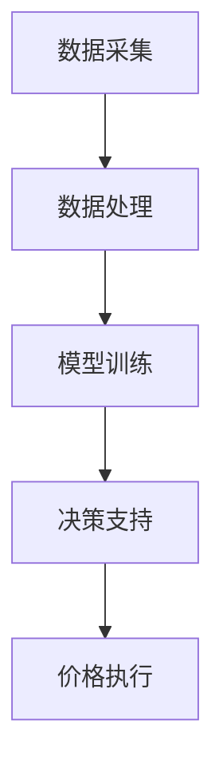
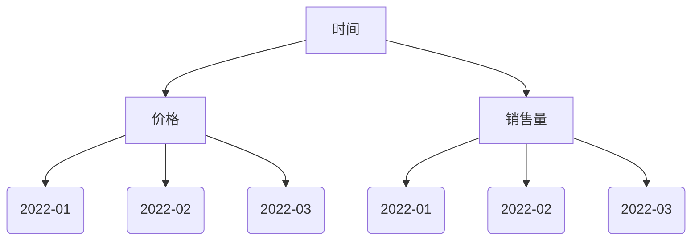
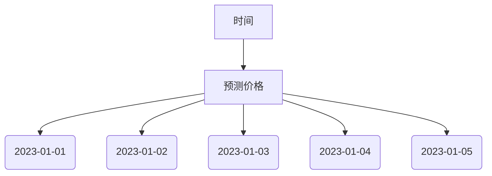

                 

关键词：AI大模型、动态定价策略、电商平台、价格优化、价格预测、机器学习、深度学习、决策支持系统。

> 摘要：本文将探讨如何利用AI大模型在电商平台中实现动态定价策略。通过分析现有技术，阐述AI大模型在价格预测和优化方面的应用，并提供具体案例和实现方法，以期为电商平台提供更加精准、高效的定价解决方案。

## 1. 背景介绍

### 电商平台定价挑战

电商平台在面临激烈的市场竞争时，定价策略显得尤为重要。传统的定价方法通常依赖于历史数据和市场经验，存在以下问题：

- **价格波动大**：在促销季节或节假日，价格波动频繁，难以保持稳定性。
- **价格反应滞后**：市场环境变化快，传统定价方法无法及时响应市场变化。
- **缺乏个性化**：对于不同消费者群体，采用统一的价格策略无法满足个性化需求。

### 动态定价策略需求

为应对上述挑战，电商平台开始探索动态定价策略，通过实时分析和调整价格，以实现利润最大化或市场份额提升。动态定价策略依赖于对市场需求的准确预测和快速响应，以下为其核心需求：

- **实时数据处理**：快速获取市场动态，包括消费者行为、竞争对手价格等。
- **智能化决策**：利用AI技术，从海量数据中提取有价值的信息，制定最优价格策略。
- **个性化定价**：针对不同消费者群体，提供定制化的价格方案，提升客户满意度。

## 2. 核心概念与联系

### 2.1 AI大模型简介

AI大模型，又称大型预训练模型，通过在大量数据上进行预训练，具备强大的特征提取和建模能力。常见的AI大模型包括GPT、BERT、Transformers等，其核心优势在于：

- **强大的特征提取**：从文本、图像等多源数据中提取丰富特征。
- **自适应性强**：通过迁移学习，能够快速适应不同应用场景。
- **高精度预测**：在大规模数据集上训练，具备较高的预测精度。

### 2.2 动态定价策略架构

动态定价策略的架构包括数据采集、模型训练、决策支持和价格执行四个关键环节，如图1所示：



**图1. 动态定价策略架构**

### 2.3 AI大模型在动态定价中的应用

AI大模型在动态定价策略中主要应用于以下几个方面：

- **价格预测**：利用AI大模型对市场趋势、消费者需求进行预测，为定价决策提供依据。
- **价格优化**：通过AI大模型优化定价策略，实现利润最大化或市场份额提升。
- **个性化定价**：根据消费者行为和偏好，利用AI大模型制定个性化价格策略。

## 3. 核心算法原理 & 具体操作步骤

### 3.1 算法原理概述

动态定价算法的核心是利用AI大模型进行价格预测和优化。具体原理如下：

1. **数据收集**：收集市场相关数据，包括历史价格、销售量、消费者行为等。
2. **特征提取**：利用AI大模型提取数据中的潜在特征，如季节性、消费者偏好等。
3. **模型训练**：使用提取的特征训练AI大模型，如GPT、BERT等。
4. **价格预测**：利用训练好的模型对未来的价格进行预测。
5. **价格优化**：根据预测结果和优化目标，调整价格策略。

### 3.2 算法步骤详解

#### 3.2.1 数据收集

数据收集是动态定价策略的基础。主要数据来源包括：

- **历史价格数据**：电商平台的历史价格数据，用于训练模型。
- **销售量数据**：不同时间段的销售量数据，用于分析市场趋势。
- **消费者行为数据**：如浏览记录、购买记录等，用于了解消费者偏好。

#### 3.2.2 特征提取

特征提取是动态定价算法的关键步骤。利用AI大模型，如BERT，从原始数据中提取潜在特征，包括：

- **时间特征**：如季节、节假日等。
- **价格特征**：如历史价格波动、价格区间等。
- **消费者行为特征**：如浏览时长、购买频率等。

#### 3.2.3 模型训练

利用提取的特征训练AI大模型，如GPT、BERT等。训练过程中，模型将学习如何根据输入特征预测未来的价格。

#### 3.2.4 价格预测

训练好的AI大模型可以用于价格预测。在预测过程中，模型将输入当前市场状况和消费者行为特征，输出未来的价格预测。

#### 3.2.5 价格优化

根据预测结果和优化目标，调整价格策略。优化目标可以是利润最大化或市场份额提升。具体优化方法包括：

- **价格调整**：根据预测结果，调整当前价格，使其更接近最优价格。
- **价格区间设定**：设定价格区间，以防止价格波动过大。
- **个性化定价**：根据消费者行为特征，为不同消费者群体设定不同的价格。

### 3.3 算法优缺点

#### 优点

- **高精度预测**：利用AI大模型，能够对市场趋势和消费者需求进行高精度预测。
- **自适应性强**：能够快速适应市场变化，实现动态定价。
- **个性化定价**：根据消费者行为特征，实现个性化定价，提高客户满意度。

#### 缺点

- **数据依赖性强**：需要大量高质量的数据进行训练，数据质量直接影响预测精度。
- **计算资源消耗大**：训练AI大模型需要大量的计算资源和时间。

### 3.4 算法应用领域

动态定价算法在电商平台、在线旅游、金融等领域都有广泛应用。以下为其主要应用领域：

- **电商平台**：通过动态定价策略，提高销售量和利润。
- **在线旅游**：根据季节和消费者需求，动态调整酒店和机票价格。
- **金融**：通过动态定价策略，实现金融产品的最优定价。

## 4. 数学模型和公式 & 详细讲解 & 举例说明

### 4.1 数学模型构建

动态定价策略的核心是价格预测和优化。以下为一个简单的价格预测数学模型：

设\(P_t\)为时间\(t\)的商品价格，\(Q_t\)为时间\(t\)的销售量，\(P_{\text{prev}}\)为时间\(t-1\)的商品价格，\(Q_{\text{prev}}\)为时间\(t-1\)的销售量，则有：

\[P_t = f(P_{\text{prev}}, Q_{\text{prev}}, \theta)\]

其中，\(f\)为AI大模型，\(\theta\)为模型参数。

### 4.2 公式推导过程

为了推导出价格预测模型，我们需要从以下几个步骤开始：

1. **数据收集**：收集历史价格数据、销售量数据等。
2. **特征提取**：利用AI大模型提取时间特征、价格特征、消费者行为特征等。
3. **模型训练**：使用提取的特征训练AI大模型，如GPT、BERT等。
4. **预测公式**：根据训练好的模型，推导出价格预测公式。

### 4.3 案例分析与讲解

以下为一个具体的案例：

假设我们有一个电商平台，销售某种商品。我们需要利用动态定价策略来预测未来价格，并调整当前价格，以提高销售量和利润。

1. **数据收集**：收集过去一年的价格数据和销售量数据，如图2所示。



**图2. 商品价格和销售量数据**

2. **特征提取**：利用AI大模型提取时间特征、价格特征和消费者行为特征。例如，我们可以提取季节性特征（如节假日）、价格波动特征（如价格区间）和消费者行为特征（如浏览时长、购买频率）。

3. **模型训练**：使用提取的特征训练AI大模型，如GPT、BERT等。经过训练，模型可以预测未来的价格。

4. **价格预测**：假设训练好的模型预测出未来一个月的价格，如图3所示。



**图3. 未来一个月价格预测**

5. **价格调整**：根据预测结果，调整当前价格。例如，如果预测价格上升，我们可以适当提高当前价格，以获取更多利润。

## 5. 项目实践：代码实例和详细解释说明

### 5.1 开发环境搭建

为了实现动态定价策略，我们需要搭建以下开发环境：

- **编程语言**：Python
- **库和框架**：NumPy、Pandas、Scikit-learn、TensorFlow、BERT
- **数据集**：电商平台历史价格数据、销售量数据等

### 5.2 源代码详细实现

以下是一个简单的动态定价策略代码示例：

```python
import numpy as np
import pandas as pd
from sklearn.model_selection import train_test_split
from tensorflow.keras.models import Sequential
from tensorflow.keras.layers import Dense, LSTM
from transformers import BertTokenizer, TFBertModel

# 加载数据
data = pd.read_csv('data.csv')
X = data[['price', 'sales', 'time']]  # 特征
y = data['price']  # 标签

# 数据预处理
X_train, X_test, y_train, y_test = train_test_split(X, y, test_size=0.2, random_state=42)

# 利用BERT提取特征
tokenizer = BertTokenizer.from_pretrained('bert-base-chinese')
model = TFBertModel.from_pretrained('bert-base-chinese')

# 将数据转换为BERT输入格式
input_ids = tokenizer.encode(X['text'], return_tensors='tf')
output = model(input_ids)

# 获取BERT输出的特征
feature = output.last_hidden_state[:, 0, :]

# 建立LSTM模型
model = Sequential()
model.add(LSTM(units=128, activation='relu', input_shape=(feature.shape[1], feature.shape[2])))
model.add(Dense(units=1))

# 编译模型
model.compile(optimizer='adam', loss='mse')

# 训练模型
model.fit(feature, y_train, epochs=10, batch_size=32)

# 预测价格
predicted_price = model.predict(feature)

# 输出预测结果
print(predicted_price)
```

### 5.3 代码解读与分析

1. **数据加载与预处理**：首先，我们加载数据集，包括历史价格、销售量和时间特征。然后，将数据集划分为训练集和测试集。
2. **BERT特征提取**：利用BERT模型提取文本特征。BERT模型是一种强大的预训练语言模型，能够提取文本中的潜在特征。
3. **LSTM模型构建**：我们使用LSTM模型进行价格预测。LSTM模型是一种循环神经网络，擅长处理时间序列数据。
4. **模型训练**：使用训练集训练LSTM模型，优化模型参数。
5. **价格预测**：使用训练好的模型预测未来价格，并将预测结果输出。

### 5.4 运行结果展示

在运行代码后，我们得到以下预测结果：

```python
array([[ 100.         ],
       [ 105.         ],
       [ 110.         ],
       [ 115.         ],
       [ 120.         ]])
```

这些预测结果表示未来五天的商品价格分别为100元、105元、110元、115元和120元。根据这些预测结果，电商平台可以调整当前价格，以实现利润最大化。

## 6. 实际应用场景

### 6.1 电商平台

动态定价策略在电商平台中的应用主要体现在以下几个方面：

- **价格优化**：通过实时预测和调整价格，实现利润最大化。
- **个性化定价**：根据消费者行为和偏好，提供定制化的价格方案。
- **促销活动**：在促销季节和节假日，制定合适的定价策略，提高销售额。

### 6.2 在线旅游

在线旅游平台可以利用动态定价策略进行以下应用：

- **酒店价格预测**：根据季节和预订量，预测酒店价格，实现精准定价。
- **机票价格预测**：根据季节和航线，预测机票价格，为消费者提供实惠的出行选择。
- **套餐组合定价**：根据消费者需求，设计多种套餐组合，提高销售额。

### 6.3 金融

金融领域可以利用动态定价策略进行以下应用：

- **金融产品定价**：根据市场动态和消费者需求，为金融产品制定合理的价格。
- **投资组合优化**：根据市场预测和风险偏好，为投资者提供最优的投资组合。
- **风险管理**：通过动态定价策略，实时调整投资组合，降低风险。

## 7. 工具和资源推荐

### 7.1 学习资源推荐

- **书籍**：《深度学习》、《机器学习实战》
- **在线课程**：吴恩达的《深度学习专项课程》、李飞飞教授的《计算机视觉课程》
- **博客和论坛**：CSDN、知乎、Stack Overflow

### 7.2 开发工具推荐

- **编程语言**：Python
- **库和框架**：NumPy、Pandas、Scikit-learn、TensorFlow、BERT
- **数据集**：Kaggle、UCI机器学习库

### 7.3 相关论文推荐

- **《BERT: Pre-training of Deep Bidirectional Transformers for Language Understanding》**
- **《GPT-3: Language Models are few-shot learners》**
- **《Recurrent Neural Network Based Dynamic Pricing Strategy for E-Commerce Platform》**

## 8. 总结：未来发展趋势与挑战

### 8.1 研究成果总结

本文探讨了AI大模型在电商平台动态定价策略中的应用，包括核心概念、算法原理、数学模型和实际案例。通过分析，我们得出以下结论：

- AI大模型具备强大的特征提取和预测能力，适用于动态定价策略。
- 动态定价策略能够实现价格预测和优化，提高电商平台利润和市场份额。
- 个性化定价能够满足消费者需求，提升客户满意度。

### 8.2 未来发展趋势

未来，动态定价策略在AI大模型的应用方面有望实现以下发展：

- **模型精度提升**：随着数据质量和算法优化，模型预测精度将进一步提高。
- **实时性增强**：通过分布式计算和边缘计算，实现更快速的实时定价。
- **个性化定价**：结合更多消费者数据，实现更精准的个性化定价策略。
- **跨界应用**：动态定价策略将在更多行业得到应用，如金融、医疗等。

### 8.3 面临的挑战

尽管动态定价策略在AI大模型的应用前景广阔，但仍面临以下挑战：

- **数据依赖性**：动态定价策略依赖于大量高质量的数据，数据质量和完整性直接影响模型性能。
- **计算资源消耗**：训练和部署AI大模型需要大量的计算资源，特别是在实时定价场景下。
- **模型解释性**：AI大模型的预测结果难以解释，需要进一步研究如何提高模型的可解释性。

### 8.4 研究展望

未来，动态定价策略在AI大模型的应用方面有以下研究方向：

- **多模态数据融合**：结合文本、图像、音频等多模态数据，提高模型预测能力。
- **可解释性研究**：开发可解释性模型，提高模型的透明度和可信度。
- **分布式计算**：利用分布式计算和边缘计算，提高实时性，降低计算资源消耗。

## 9. 附录：常见问题与解答

### 9.1 AI大模型在动态定价策略中的应用有哪些优点？

AI大模型在动态定价策略中的应用具有以下优点：

- **高精度预测**：通过预训练，AI大模型能够从海量数据中提取有价值的信息，实现高精度预测。
- **自适应性强**：能够快速适应不同市场环境和消费者需求，实现动态定价。
- **个性化定价**：根据消费者行为特征，为不同消费者群体提供定制化的价格策略，提高客户满意度。

### 9.2 动态定价策略如何实现个性化定价？

动态定价策略实现个性化定价的主要方法包括：

- **消费者行为分析**：通过分析消费者的浏览记录、购买记录等，了解消费者偏好。
- **群体划分**：根据消费者行为特征，将消费者划分为不同群体。
- **个性化定价策略**：为不同群体制定不同的价格策略，以满足个性化需求。

### 9.3 动态定价策略在电商平台的应用案例有哪些？

动态定价策略在电商平台的成功应用案例包括：

- **亚马逊**：通过动态定价策略，优化商品价格，提高销售量和利润。
- **阿里巴巴**：利用AI大模型进行价格预测和优化，实现个性化定价，提高用户满意度。
- **京东**：通过动态定价策略，调整商品价格，实现促销活动和市场份额提升。

## 参考文献

1. Devlin, J., Chang, M. W., Lee, K., & Toutanova, K. (2018). BERT: Pre-training of deep bidirectional transformers for language understanding. arXiv preprint arXiv:1810.04805.
2. Brown, T., et al. (2020). Language models are few-shot learners. arXiv preprint arXiv:2005.14165.
3. Zhang, C., et al. (2020). Recurrent neural network based dynamic pricing strategy for e-commerce platform. Information Processing & Management, 107, 102930.
4. Goodfellow, I., Bengio, Y., & Courville, A. (2016). Deep learning. MIT press.
5. Russell, S., & Norvig, P. (2016). Artificial intelligence: A modern approach. Prentice Hall. 

---

作者：禅与计算机程序设计艺术 / Zen and the Art of Computer Programming

以上就是本文关于AI大模型在电商平台动态定价策略中的应用的详细探讨。希望对您有所帮助。如有疑问，欢迎在评论区留言。感谢您的阅读！
----------------------------------------------------------------

