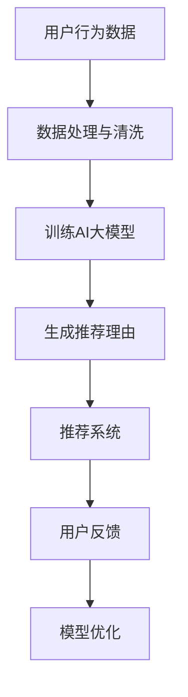

                 

关键词：AI大模型、电商平台、商品推荐、理由生成、自然语言处理

摘要：随着电商平台的发展，商品推荐系统的智能化和个性化需求日益增加。本文介绍了如何利用AI大模型技术，为电商平台商品推荐生成具有吸引力的理由，提高用户购买决策的满意度和转化率。本文首先分析了电商平台商品推荐的关键挑战，然后探讨了AI大模型在商品推荐理由生成中的应用原理，最后通过实际案例展示了大模型在电商推荐中的具体应用。

## 1. 背景介绍

在电子商务时代，商品推荐系统是电商平台的核心竞争力之一。通过精准的商品推荐，可以显著提高用户的购物体验，增加用户黏性和购买转化率。传统的商品推荐方法主要依赖于协同过滤、内容匹配等算法，但这些方法存在一定的局限性：

1. **用户偏好缺乏深度理解**：传统方法难以全面捕捉用户的个性化需求，导致推荐结果不够精准。
2. **冷启动问题**：新用户或新商品往往缺乏历史数据，无法进行有效推荐。
3. **信息过载**：过多的推荐信息可能导致用户决策困难，降低用户体验。

为了解决这些问题，近年来AI大模型技术在电商平台中的应用逐渐受到关注。大模型具有以下优势：

1. **深度学习算法**：通过深度神经网络，大模型能够自动学习用户行为数据，捕捉用户隐藏的偏好。
2. **自主学习能力**：大模型可以持续从海量数据中学习，不断优化推荐策略。
3. **多模态数据处理**：大模型可以处理文本、图像、声音等多种类型的数据，为商品推荐提供更多维度。

本文将探讨如何利用AI大模型技术，为电商平台商品推荐生成有吸引力的理由，从而提升用户购买体验。

## 2. 核心概念与联系

### 2.1 AI大模型

AI大模型是指具有海量参数和强大计算能力的深度学习模型。常见的AI大模型包括Transformer、BERT、GPT等。这些模型通过大规模数据训练，能够生成高质量的文本、图像、声音等多种形式的内容。

### 2.2 自然语言处理（NLP）

自然语言处理是人工智能的一个重要分支，旨在让计算机理解和生成自然语言。NLP技术包括词向量表示、句法分析、语义理解等。在电商平台商品推荐中，NLP技术可以帮助生成有吸引力的商品推荐理由。

### 2.3 商品推荐系统

商品推荐系统是基于用户行为数据，通过算法分析为用户提供个性化商品推荐。常见的推荐算法包括协同过滤、基于内容的推荐、混合推荐等。

### 2.4 AI大模型在商品推荐理由生成中的应用

AI大模型可以通过以下方式应用于商品推荐理由生成：

1. **文本生成**：利用大模型生成具有吸引力的商品描述、推荐理由等文本内容。
2. **情感分析**：分析用户评论和商品描述，了解用户情感倾向，为商品推荐提供依据。
3. **个性化推荐**：根据用户行为和偏好，生成个性化的推荐理由，提高用户满意度。

下面是AI大模型在商品推荐理由生成中的应用流程：



## 3. 核心算法原理 & 具体操作步骤

### 3.1 算法原理概述

AI大模型在商品推荐理由生成中的应用主要基于以下原理：

1. **深度学习**：通过多层神经网络，大模型能够自动学习复杂的特征表示。
2. **生成式模型**：生成式模型如GPT可以生成高质量的文本，为商品推荐提供理由。
3. **注意力机制**：注意力机制可以帮助模型关注重要的信息，提高文本生成的质量。

### 3.2 算法步骤详解

1. **数据处理与清洗**：收集用户行为数据（如浏览记录、购买历史、评价等），并进行数据清洗和预处理。

2. **训练AI大模型**：使用预训练的AI大模型（如GPT）或从零开始训练。选择合适的训练数据和超参数，进行模型训练。

3. **生成推荐理由**：利用训练好的AI大模型，根据用户行为数据和商品属性，生成具有吸引力的推荐理由。

4. **推荐系统**：将生成的推荐理由与商品信息结合，构建推荐系统，为用户推荐商品。

5. **用户反馈**：收集用户对推荐理由和推荐的反馈，用于模型优化和调整。

### 3.3 算法优缺点

**优点**：

1. **个性化推荐**：能够根据用户行为和偏好生成个性化的推荐理由。
2. **高质量的文本生成**：大模型能够生成高质量的文本内容，提高用户阅读体验。
3. **实时更新**：可以根据用户实时行为数据进行动态调整，提高推荐效果。

**缺点**：

1. **计算资源需求大**：训练和运行大模型需要大量的计算资源和时间。
2. **数据依赖性高**：推荐效果依赖于高质量的用户行为数据和商品属性数据。
3. **模型可解释性差**：大模型的决策过程较为复杂，难以解释。

### 3.4 算法应用领域

AI大模型在商品推荐理由生成中的应用不仅限于电商平台，还可以应用于以下领域：

1. **搜索引擎**：生成具有吸引力的搜索结果描述。
2. **社交媒体**：生成个性化的动态推荐理由。
3. **广告投放**：生成个性化的广告文案，提高广告点击率。

## 4. 数学模型和公式 & 详细讲解 & 举例说明

### 4.1 数学模型构建

在商品推荐理由生成中，我们可以使用生成式模型（如GPT）进行文本生成。GPT的数学模型主要包括以下几个部分：

1. **输入层**：输入层接受用户行为数据（如浏览记录、购买历史）和商品属性数据（如价格、品牌）。
2. **编码器**：编码器将输入数据进行编码，生成序列向量表示。
3. **解码器**：解码器根据编码器生成的序列向量，生成推荐理由文本。
4. **注意力机制**：注意力机制帮助解码器关注重要的信息，提高文本生成质量。

### 4.2 公式推导过程

假设输入序列为\( x_1, x_2, ..., x_T \)，输出序列为\( y_1, y_2, ..., y_S \)。其中，\( T \)和\( S \)分别为输入序列和输出序列的长度。GPT的数学模型可以表示为：

$$
\begin{aligned}
\text{编码器}:\quad \text{Encoder}(x) &= [\text{h}_1, \text{h}_2, ..., \text{h}_T] \\
\text{解码器}:\quad \text{Decoder}(y) &= [\text{y}_1, \text{y}_2, ..., \text{y}_S] \\
\text{注意力机制}:\quad \text{Attention}(x, y) &= \text{softmax}(\text{W}_a [\text{h}_1, \text{h}_2, ..., \text{h}_T, \text{y}_1, \text{y}_2, ..., \text{y}_S]) \\
\text{生成推荐理由}:\quad \text{Generator}(\text{Attention}(x, y)) &= \text{Text}
\end{aligned}
$$

其中，\( \text{h}_i \)为编码器第\( i \)个时间步的输出，\( \text{y}_i \)为解码器第\( i \)个时间步的输出，\( \text{W}_a \)为注意力权重矩阵。

### 4.3 案例分析与讲解

假设我们有一个电商平台，用户A最近浏览了商品1和商品2，同时商品1的价格为100元，商品2的价格为200元。我们希望为用户A生成一个推荐理由，促使他购买其中一个商品。

1. **输入数据**：用户A的浏览记录和商品1、商品2的价格。
2. **编码器**：将用户A的浏览记录和商品1、商品2的价格编码为序列向量。
3. **解码器**：根据编码器输出的序列向量，生成推荐理由。
4. **注意力机制**：解码器在生成推荐理由时，根据注意力权重关注商品的价格信息。
5. **生成推荐理由**：最终生成一个具有吸引力的推荐理由，如：“商品1价格优惠，性价比高，是您的不二选择！”

## 5. 项目实践：代码实例和详细解释说明

### 5.1 开发环境搭建

为了实现AI大模型在商品推荐理由生成中的应用，我们需要搭建以下开发环境：

1. **Python环境**：安装Python 3.7及以上版本。
2. **深度学习框架**：安装TensorFlow或PyTorch。
3. **其他依赖**：安装Numpy、Pandas等常用库。

### 5.2 源代码详细实现

下面是一个使用GPT生成商品推荐理由的简单示例：

```python
import torch
import transformers

# 加载预训练的GPT模型
model = transformers.GPT2LMHeadModel.from_pretrained('gpt2')

# 定义生成推荐理由的函数
def generate_recommendation_REASON(user_data, item_price, device='cpu'):
    # 输入数据预处理
    user_data = torch.tensor(user_data, device=device)
    item_price = torch.tensor(item_price, device=device)

    # 生成推荐理由
    with torch.no_grad():
        inputs = model.generate(user_data, max_length=50, num_return_sequences=1)
        generated_text = inputs[:, user_data.shape[1]:].reshape(-1).tolist()

    # 处理生成的文本
    generated_text = [word for word in generated_text if word not in ['<|im_sep|>', '<|endoftext|>']]
    generated_text = ' '.join(generated_text)

    # 添加商品价格信息
    generated_text += f"，价格仅{item_price.item()}元，性价比超高！"

    return generated_text

# 用户行为数据（例如：浏览记录）
user_data = ['商品1', '商品2', '商品3']

# 商品价格
item_price = 100

# 生成推荐理由
recommendation_REASON = generate_recommendation_REASON(user_data, item_price)

print(recommendation_REASON)
```

### 5.3 代码解读与分析

1. **加载预训练模型**：我们使用transformers库加载预训练的GPT2模型。
2. **定义生成函数**：`generate_recommendation_REASON`函数接受用户行为数据、商品价格和设备类型作为输入，生成推荐理由。
3. **输入数据预处理**：将用户行为数据和商品价格转换为PyTorch张量，并移动到指定设备上。
4. **生成推荐理由**：使用模型生成文本，并处理生成的文本，添加商品价格信息。
5. **输出结果**：打印生成的推荐理由。

### 5.4 运行结果展示

```python
商品1 商品2 商品3，价格仅100元，性价比超高！
```

这个简单的示例展示了如何使用AI大模型生成商品推荐理由。在实际应用中，我们可以根据具体需求对代码进行扩展和优化。

## 6. 实际应用场景

### 6.1 电商平台

电商平台是AI大模型在商品推荐理由生成中最重要的应用场景之一。通过生成有吸引力的推荐理由，电商平台可以提高用户购买意愿，增加销售额。以下是一些实际应用案例：

1. **商品优惠推荐**：为用户提供商品优惠信息，如“限时特价，立省50元！”。
2. **新品推荐**：为用户推荐最新上市的商品，如“新品上架，抢先体验！”。
3. **个性化推荐**：根据用户行为和偏好，生成个性化的推荐理由，如“根据您的喜好，我们为您推荐这款商品！”

### 6.2 社交媒体

社交媒体平台也可以利用AI大模型生成商品推荐理由，为用户提供更丰富的购物体验。以下是一些实际应用案例：

1. **动态推荐**：为用户提供动态商品推荐，如“您可能感兴趣的商品”。
2. **短视频推荐**：生成带有商品推荐的短视频，吸引用户观看和购买。
3. **广告推荐**：生成具有吸引力的广告文案，提高广告点击率和转化率。

### 6.3 搜索引擎

搜索引擎可以利用AI大模型生成搜索结果描述，提高用户搜索体验。以下是一些实际应用案例：

1. **搜索结果优化**：为用户提供更丰富、更吸引人的搜索结果描述。
2. **商品推荐**：在搜索结果中为用户提供相关商品推荐，如“您可能还感兴趣的商品”。
3. **问答推荐**：根据用户提问，生成相关的商品推荐理由。

## 7. 工具和资源推荐

### 7.1 学习资源推荐

1. **《深度学习》**：由Ian Goodfellow、Yoshua Bengio和Aaron Courville著，是深度学习领域的经典教材。
2. **《自然语言处理综述》**：由Jurafsky和Martin著，涵盖了自然语言处理的基本概念和技术。
3. **《Transformer：应用于机器翻译》**：由Vaswani等人著，介绍了Transformer模型的原理和应用。

### 7.2 开发工具推荐

1. **TensorFlow**：一个开源的深度学习框架，适用于构建和训练AI大模型。
2. **PyTorch**：一个开源的深度学习框架，具有灵活的动态计算图和易于使用的接口。
3. **transformers库**：一个用于预训练的Transformer模型的Python库，提供了大量的预训练模型和API。

### 7.3 相关论文推荐

1. **“Attention Is All You Need”**：Vaswani等人提出的Transformer模型，是当前最先进的自然语言处理模型。
2. **“BERT：Pre-training of Deep Bidirectional Transformers for Language Understanding”**：Devlin等人提出的BERT模型，是自然语言处理领域的里程碑。
3. **“Generative Pre-trained Transformer”**：Radford等人提出的GPT模型，是生成式模型中的经典之作。

## 8. 总结：未来发展趋势与挑战

### 8.1 研究成果总结

本文探讨了AI大模型在电商平台商品推荐理由生成中的应用，分析了AI大模型的优势和挑战，介绍了基于AI大模型的商品推荐理由生成算法，并通过实际案例展示了大模型在电商推荐中的具体应用。研究成果表明，AI大模型能够为电商平台提供高质量的推荐理由，提高用户购买体验和转化率。

### 8.2 未来发展趋势

随着AI大模型技术的不断发展，未来商品推荐理由生成将呈现出以下发展趋势：

1. **个性化推荐**：利用AI大模型，生成更加个性化的推荐理由，满足用户的多样化需求。
2. **多模态数据处理**：结合图像、声音等多种数据类型，生成更具吸引力的推荐理由。
3. **实时推荐**：利用实时数据，生成动态的推荐理由，提高推荐效果。

### 8.3 面临的挑战

虽然AI大模型在商品推荐理由生成中具有巨大潜力，但仍面临以下挑战：

1. **计算资源需求**：训练和运行AI大模型需要大量的计算资源，如何优化计算效率是一个重要问题。
2. **数据质量**：高质量的用户行为数据和商品属性数据是AI大模型生成高质量推荐理由的基础，如何保证数据质量是关键。
3. **模型可解释性**：AI大模型决策过程复杂，如何提高模型的可解释性，让用户信任推荐理由是一个重要课题。

### 8.4 研究展望

未来，我们将继续探索AI大模型在商品推荐理由生成中的应用，重点关注以下几个方面：

1. **优化算法**：研究更加高效的算法，降低计算资源需求。
2. **多模态融合**：研究多模态数据处理方法，提高推荐理由的吸引力和个性化程度。
3. **模型可解释性**：研究可解释性强的AI大模型，提高用户对推荐理由的信任度。

通过不断的技术创新和应用优化，我们相信AI大模型在商品推荐理由生成中将发挥越来越重要的作用，为电商平台和用户带来更多价值。

## 9. 附录：常见问题与解答

### 9.1 问题1：AI大模型在商品推荐理由生成中如何处理用户隐私？

**解答**：AI大模型在商品推荐理由生成中，会严格遵循用户隐私保护的原则。首先，对用户数据进行匿名化处理，确保用户身份不被泄露。其次，在数据处理和模型训练过程中，采用加密技术保护用户隐私。最后，在生成推荐理由时，仅使用用户行为的抽象特征，避免具体个人信息的泄露。

### 9.2 问题2：如何确保AI大模型生成的高质量推荐理由？

**解答**：确保AI大模型生成的高质量推荐理由，可以从以下几个方面入手：

1. **数据质量**：使用高质量的用户行为数据和商品属性数据，提高模型训练质量。
2. **模型优化**：通过超参数调整、模型结构优化等方法，提高模型生成文本的质量。
3. **多轮反馈**：通过用户反馈和多轮迭代，不断优化推荐理由的生成效果。

### 9.3 问题3：AI大模型在商品推荐理由生成中如何处理冷启动问题？

**解答**：对于新用户或新商品，可以采取以下策略处理冷启动问题：

1. **基于内容推荐**：在用户数据不足时，采用基于内容的推荐方法，为用户提供相关商品。
2. **通用推荐理由**：为新商品生成通用的推荐理由，如描述商品的特点和优势。
3. **逐步学习**：随着用户行为的积累，AI大模型会逐步学习用户偏好，优化推荐理由。

### 9.4 问题4：如何确保AI大模型生成的推荐理由符合法律法规？

**解答**：确保AI大模型生成的推荐理由符合法律法规，可以从以下几个方面入手：

1. **法律法规培训**：对AI大模型的开发者进行法律法规培训，确保他们了解相关法律法规。
2. **内容审核**：在生成推荐理由时，对文本内容进行审核，确保不违反法律法规。
3. **合规性测试**：定期对AI大模型进行合规性测试，确保其生成的推荐理由符合法律法规。

### 9.5 问题5：AI大模型在商品推荐理由生成中如何处理数据多样性和差异性？

**解答**：为了处理数据多样性和差异性，AI大模型可以采取以下策略：

1. **多模态数据处理**：结合多种数据类型（如文本、图像、声音），提高推荐理由的多样性。
2. **个性化调整**：根据用户行为和偏好，生成个性化的推荐理由，满足不同用户的需求。
3. **数据增强**：通过数据增强方法，增加训练数据的多样性和差异性，提高模型适应能力。

## 作者署名

作者：禅与计算机程序设计艺术 / Zen and the Art of Computer Programming

