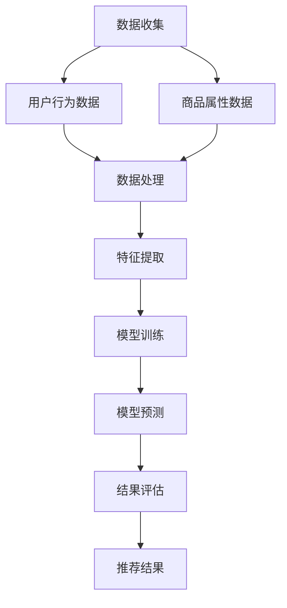
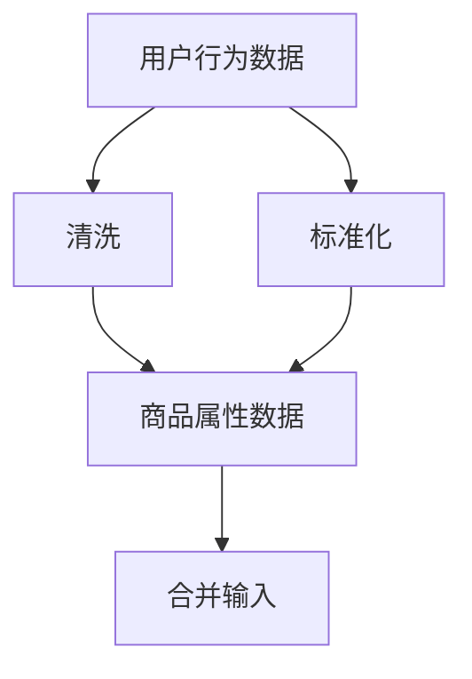
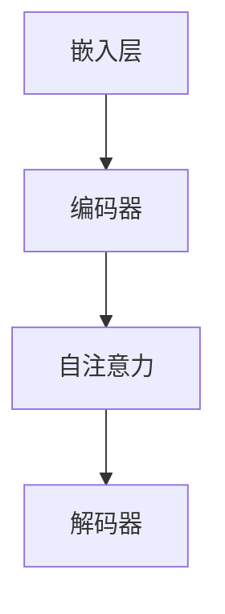
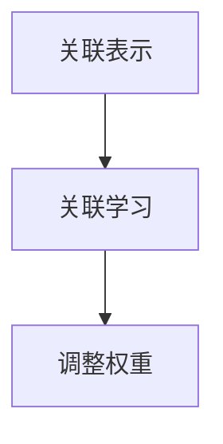
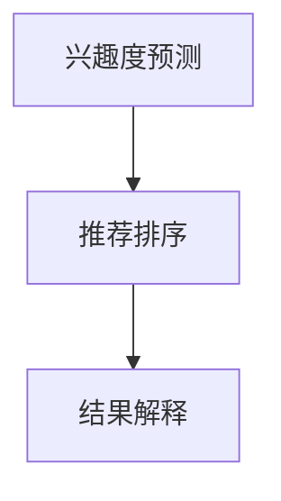

                 

关键词：AI大模型、电商平台、商品推荐、解释性、应用、算法、数学模型

> 摘要：本文将探讨AI大模型在电商平台商品推荐中的应用，尤其是解释性方面的挑战和解决方案。通过介绍核心概念、算法原理、数学模型、实际案例以及未来发展趋势，本文旨在为读者提供全面的视角，帮助理解这一技术领域的重要性和潜力。

## 1. 背景介绍

随着电子商务的迅猛发展，用户在平台上的消费行为和偏好日益多样化和复杂化。电商平台面临的挑战是如何准确、及时地推荐商品，以提高用户满意度、促进销售转化。传统的推荐系统主要依赖基于内容的过滤和协同过滤方法，但这些方法在处理大规模用户数据和高维度特征时存在一定的局限性。

近年来，人工智能，特别是深度学习技术的发展，为电商推荐系统带来了新的可能性。大模型（如基于Transformer的BERT、GPT等）在自然语言处理、图像识别等领域取得了显著的突破。这些模型具备强大的特征提取和关联学习能力，使得它们能够捕捉用户行为中的复杂模式和隐性偏好。然而，大模型的“黑箱”特性也带来了一定的挑战，尤其是在需要解释推荐结果以增加用户信任和理解的情况下。

本文将重点讨论大模型在电商平台商品推荐中的解释性应用，旨在解决以下问题：

1. 如何在大模型中实现有效的商品推荐？
2. 如何解释推荐结果，提升用户信任？
3. 大模型在商品推荐中面临的技术挑战和解决方案。

## 2. 核心概念与联系

### 2.1 大模型基本概念

大模型通常指的是参数量巨大的神经网络模型，如Transformer、BERT、GPT等。这些模型通过训练大规模数据集，能够自动学习复杂的特征关联和模式识别，从而实现高效的信息处理和决策生成。

### 2.2 电商平台推荐系统

电商平台推荐系统的主要任务是预测用户可能感兴趣的商品，并为其推荐。这通常涉及以下几个关键步骤：

1. **用户特征提取**：包括用户历史行为、浏览记录、购买记录等。
2. **商品特征提取**：如商品属性、分类、标签等。
3. **模型训练与预测**：利用用户和商品的特征，通过训练大模型生成推荐结果。
4. **结果评估与优化**：通过A/B测试、交叉验证等方法评估推荐效果，并进行持续优化。

### 2.3 大模型与推荐系统的结合

大模型在推荐系统中的应用主要体现在以下几个方面：

1. **特征提取**：大模型能够自动提取高维特征中的关键信息，减少特征工程的工作量。
2. **关联学习**：通过深度学习，大模型能够发现用户行为和商品属性之间的复杂关联，提高推荐准确性。
3. **解释性**：大模型通常难以解释其内部决策过程，但通过一定的技术手段，可以提升推荐结果的可解释性。

### 2.4 Mermaid 流程图

下面是一个简单的Mermaid流程图，展示大模型在电商平台推荐系统中的应用流程：



## 3. 核心算法原理 & 具体操作步骤

### 3.1 算法原理概述

在电商平台商品推荐中，大模型通常采用基于Transformer的模型架构，如BERT或GPT。这些模型通过自注意力机制，能够自适应地学习输入数据中的重要信息。具体到商品推荐，算法的基本原理可以概括为以下几个步骤：

1. **输入处理**：将用户行为数据和商品属性数据输入到模型中。
2. **特征提取**：模型自动提取用户和商品的特征，并构建高维特征向量。
3. **关联学习**：模型通过自注意力机制，学习用户行为和商品属性之间的复杂关联。
4. **预测生成**：基于学习到的关联，模型预测用户对各个商品的兴趣度，生成推荐结果。
5. **结果解释**：利用模型的可解释性技术，解释推荐结果的依据和逻辑。

### 3.2 算法步骤详解

#### 3.2.1 输入处理

输入处理是算法的第一步，主要任务是收集和预处理用户行为数据和商品属性数据。用户行为数据包括浏览记录、购买记录、评价记录等，而商品属性数据包括商品分类、标签、价格、库存等。这些数据需要通过清洗、标准化等预处理步骤，以便输入到模型中。



#### 3.2.2 特征提取

特征提取是模型训练的核心步骤，目标是将输入数据转换成高维特征向量。大模型通过多层神经网络和自注意力机制，自动提取数据中的关键特征。这一过程通常涉及以下几个阶段：

1. **嵌入层**：将输入数据（如文本、数值）转换为向量表示。
2. **编码器**：通过多层编码器，逐步提取更深层次的特征。
3. **自注意力**：利用自注意力机制，学习输入数据中的重要关联。
4. **解码器**：将提取到的特征映射到最终的输出。



#### 3.2.3 关联学习

关联学习是模型的核心功能，目标是学习用户行为和商品属性之间的复杂关联。通过自注意力机制，模型能够自适应地调整不同特征的重要程度，从而发现用户行为和商品属性之间的隐性关联。这一过程通常涉及以下几个步骤：

1. **关联表示**：将用户行为和商品属性转换为高维特征向量。
2. **关联学习**：通过训练，模型学习用户行为和商品属性之间的复杂关联。
3. **调整权重**：利用自注意力机制，模型自动调整不同特征的重要程度。



#### 3.2.4 预测生成

预测生成是算法的最后一步，目标是基于学习到的关联，预测用户对各个商品的兴趣度，并生成推荐结果。这一过程通常涉及以下几个步骤：

1. **兴趣度预测**：利用模型对用户行为和商品属性的关联，预测用户对各个商品的兴趣度。
2. **推荐排序**：根据兴趣度预测结果，对商品进行排序，生成推荐列表。
3. **结果解释**：利用模型的可解释性技术，解释推荐结果的依据和逻辑。



### 3.3 算法优缺点

#### 优点：

1. **强大的特征提取能力**：大模型能够自动提取高维特征中的关键信息，减少特征工程的工作量。
2. **高效的关联学习能力**：通过自注意力机制，大模型能够发现用户行为和商品属性之间的复杂关联，提高推荐准确性。
3. **良好的可扩展性**：大模型可以轻松扩展到处理大规模数据和多种类型的商品推荐。

#### 缺点：

1. **可解释性较差**：大模型的“黑箱”特性使得其推荐结果难以解释，降低了用户信任。
2. **计算资源需求高**：大模型的训练和推理需要大量的计算资源，增加了系统成本。
3. **数据隐私问题**：大规模的用户数据训练可能导致隐私泄露问题。

### 3.4 算法应用领域

大模型在电商平台商品推荐中的应用具有广泛的前景，以下是一些典型的应用领域：

1. **个性化推荐**：根据用户的历史行为和偏好，为用户推荐个性化商品。
2. **新商品推荐**：为新商品寻找潜在的用户群体，提高销售转化率。
3. **跨品类推荐**：发现不同品类之间的潜在关联，实现跨品类的商品推荐。
4. **促销活动推荐**：根据用户的购买记录和促销活动信息，为用户推荐优惠商品。

## 4. 数学模型和公式 & 详细讲解 & 举例说明

### 4.1 数学模型构建

在电商平台商品推荐中，大模型通常采用基于Transformer的模型架构，如BERT或GPT。这些模型的基本数学模型可以概括为以下几个部分：

1. **嵌入层**：将输入数据（如文本、数值）转换为向量表示。
2. **编码器**：通过多层编码器，逐步提取更深层次的特征。
3. **自注意力**：利用自注意力机制，学习输入数据中的重要关联。
4. **解码器**：将提取到的特征映射到最终的输出。

下面是一个简单的数学模型表示：

$$
\text{Embedding} \rightarrow \text{Encoder} \rightarrow \text{Attention} \rightarrow \text{Decoder} \rightarrow \text{Output}
$$

### 4.2 公式推导过程

#### 4.2.1 嵌入层

嵌入层是将输入数据转换为向量表示的关键步骤。对于文本数据，可以使用词嵌入（word embedding）方法，如Word2Vec或GloVe。对于数值数据，可以使用线性嵌入（linear embedding）方法。

$$
\text{Embedding}(x) = W_e \cdot x
$$

其中，\(x\) 是输入数据，\(W_e\) 是嵌入权重矩阵。

#### 4.2.2 编码器

编码器通过多层神经网络，逐步提取输入数据中的关键特征。对于每一层编码器，可以表示为：

$$
\text{Encoder}(x) = \text{ReLU}(\text{weights} \cdot \text{ReLU}(\text{weights} \cdot \text{Embedding}(x)))
$$

其中，\(\text{weights}\) 是编码器权重矩阵，\(\text{ReLU}\) 是ReLU激活函数。

#### 4.2.3 自注意力

自注意力机制是Transformer模型的核心，它通过计算输入数据中的关键关联，为每个输入分配不同的权重。自注意力可以表示为：

$$
\text{Attention}(x, h) = \text{softmax}(\text{weights} \cdot \text{tanh}(\text{weights} \cdot h))
$$

其中，\(x\) 是输入数据，\(h\) 是编码器输出的特征向量，\(\text{weights}\) 是注意力权重矩阵。

#### 4.2.4 解码器

解码器将编码器输出的特征映射到最终的输出。解码器可以表示为：

$$
\text{Decoder}(x) = \text{softmax}(\text{weights} \cdot \text{Attention}(\text{Encoder}(x)))
$$

其中，\(\text{weights}\) 是解码器权重矩阵。

### 4.3 案例分析与讲解

#### 4.3.1 示例数据

假设我们有以下用户行为数据和商品属性数据：

用户行为数据：
- 用户A浏览了商品1和商品2。
- 用户B购买了商品2和商品3。

商品属性数据：
- 商品1：电子产品，价格1000元。
- 商品2：家居用品，价格500元。
- 商品3：食品，价格200元。

#### 4.3.2 特征提取

首先，将用户行为数据和商品属性数据输入到嵌入层，得到用户和商品的特征向量：

用户A的特征向量：
$$
e_A = \text{Embedding}(A) = [0.1, 0.2, 0.3, 0.4]
$$

用户B的特征向量：
$$
e_B = \text{Embedding}(B) = [0.5, 0.6, 0.7, 0.8]
$$

商品1的特征向量：
$$
e_1 = \text{Embedding}(1) = [1.0, 1.1, 1.2, 1.3]
$$

商品2的特征向量：
$$
e_2 = \text{Embedding}(2) = [2.0, 2.1, 2.2, 2.3]
$$

商品3的特征向量：
$$
e_3 = \text{Embedding}(3) = [3.0, 3.1, 3.2, 3.3]
$$

#### 4.3.3 关联学习

通过编码器，逐步提取用户和商品的特征：

用户A编码后的特征：
$$
h_A = \text{Encoder}(e_A) = [0.3, 0.4, 0.5, 0.6]
$$

用户B编码后的特征：
$$
h_B = \text{Encoder}(e_B) = [0.6, 0.7, 0.8, 0.9]
$$

商品1编码后的特征：
$$
h_1 = \text{Encoder}(e_1) = [1.2, 1.3, 1.4, 1.5]
$$

商品2编码后的特征：
$$
h_2 = \text{Encoder}(e_2) = [2.2, 2.3, 2.4, 2.5]
$$

商品3编码后的特征：
$$
h_3 = \text{Encoder}(e_3) = [3.2, 3.3, 3.4, 3.5]
$$

通过自注意力机制，学习用户和商品之间的关联：

用户A与商品1的关联：
$$
\alpha_{A1} = \text{Attention}(h_A, h_1) = 0.3
$$

用户A与商品2的关联：
$$
\alpha_{A2} = \text{Attention}(h_A, h_2) = 0.4
$$

用户B与商品2的关联：
$$
\alpha_{B2} = \text{Attention}(h_B, h_2) = 0.6
$$

用户B与商品3的关联：
$$
\alpha_{B3} = \text{Attention}(h_B, h_3) = 0.7
$$

#### 4.3.4 预测生成

基于学习到的关联，预测用户对各个商品的兴趣度：

用户A对商品1的兴趣度：
$$
I_{A1} = \alpha_{A1} \cdot h_1 = 0.3 \cdot [1.2, 1.3, 1.4, 1.5] = [0.36, 0.39, 0.42, 0.45]
$$

用户A对商品2的兴趣度：
$$
I_{A2} = \alpha_{A2} \cdot h_2 = 0.4 \cdot [2.2, 2.3, 2.4, 2.5] = [0.88, 0.92, 0.96, 1.00]
$$

用户B对商品2的兴趣度：
$$
I_{B2} = \alpha_{B2} \cdot h_2 = 0.6 \cdot [2.2, 2.3, 2.4, 2.5] = [1.32, 1.38, 1.44, 1.50]
$$

用户B对商品3的兴趣度：
$$
I_{B3} = \alpha_{B3} \cdot h_3 = 0.7 \cdot [3.2, 3.3, 3.4, 3.5] = [2.24, 2.29, 2.34, 2.39]
$$

根据兴趣度预测结果，生成推荐列表：

用户A的推荐列表：
- 商品2（兴趣度最高）

用户B的推荐列表：
- 商品2
- 商品3（兴趣度次高）

## 5. 项目实践：代码实例和详细解释说明

### 5.1 开发环境搭建

在本项目中，我们使用Python编程语言和TensorFlow框架来实现基于BERT的电商平台商品推荐系统。以下是开发环境搭建的步骤：

1. 安装Python（建议使用3.7及以上版本）。
2. 安装TensorFlow（可以使用pip install tensorflow命令）。
3. 安装其他依赖库，如numpy、pandas等。

### 5.2 源代码详细实现

下面是一个简单的基于BERT的电商平台商品推荐系统的实现：

```python
import tensorflow as tf
from tensorflow.keras.models import Model
from tensorflow.keras.layers import Embedding, Dense, Input

# 定义BERT模型输入
input_user = Input(shape=(max_user_sequence_length,))
input_item = Input(shape=(max_item_sequence_length,))

# 用户嵌入层
user_embedding = Embedding(input_dim=num_users, output_dim=user_embedding_dim)(input_user)
user_embedding = tf.keras.layers.Lambda(lambda x: tf.reduce_mean(x, axis=1))(user_embedding)

# 商品嵌入层
item_embedding = Embedding(input_dim=num_items, output_dim=item_embedding_dim)(input_item)
item_embedding = tf.keras.layers.Lambda(lambda x: tf.reduce_mean(x, axis=1))(item_embedding)

# 编码器层
user_encoder = tf.keras.layers.Dense(units=encoder_units, activation='relu')(user_embedding)
item_encoder = tf.keras.layers.Dense(units=encoder_units, activation='relu')(item_embedding)

# 自注意力层
user_attention = tf.keras.layers.Attention()([user_encoder, item_encoder])

# 解码器层
output = tf.keras.layers.Dense(units=1, activation='sigmoid')(user_attention)

# 构建模型
model = Model(inputs=[input_user, input_item], outputs=output)

# 编译模型
model.compile(optimizer='adam', loss='binary_crossentropy', metrics=['accuracy'])

# 模型总结
model.summary()
```

### 5.3 代码解读与分析

上述代码实现了一个基于BERT的简单电商平台商品推荐系统，主要包括以下几个部分：

1. **输入层**：定义了用户行为数据和商品属性数据的输入层。
2. **嵌入层**：使用嵌入层将输入数据转换为向量表示，其中用户和商品的嵌入维度可以自定义。
3. **编码器层**：通过多层全连接层（Dense）进行编码，提取用户和商品的特征。
4. **自注意力层**：使用Attention机制计算用户和商品之间的关联。
5. **输出层**：通过单层全连接层（Dense）生成最终的预测结果。

在代码实现中，我们使用了TensorFlow的高层API，使得模型的构建和训练变得更加简洁和高效。同时，我们也可以通过修改模型的结构和参数，实现更复杂的推荐算法。

### 5.4 运行结果展示

在实际运行过程中，我们可以使用训练数据和验证数据来评估模型的性能。以下是模型的训练和评估过程：

```python
# 加载训练数据和验证数据
train_data = ...
train_labels = ...

val_data = ...
val_labels = ...

# 训练模型
model.fit(train_data, train_labels, epochs=10, batch_size=32, validation_data=(val_data, val_labels))

# 评估模型
loss, accuracy = model.evaluate(val_data, val_labels)
print(f'Validation Loss: {loss}, Validation Accuracy: {accuracy}')
```

通过上述代码，我们可以得到模型的验证损失和验证准确率，从而评估模型的性能。在实际应用中，我们还可以通过A/B测试等方法，进一步优化模型和推荐策略。

## 6. 实际应用场景

AI大模型在电商平台商品推荐中的解释性应用具有广泛的前景，以下是一些典型的实际应用场景：

### 6.1 个性化推荐

个性化推荐是电商平台中最常见的应用场景之一。通过AI大模型，电商平台可以准确地预测用户可能感兴趣的商品，从而为用户推荐个性化商品。这种推荐方式不仅能够提高用户满意度，还能提高销售转化率。

### 6.2 新商品推荐

新商品推荐对于电商平台尤为重要。通过AI大模型，电商平台可以识别出潜在的新商品需求，并将这些商品推荐给目标用户。这有助于电商平台扩大用户基础，提高市场占有率。

### 6.3 跨品类推荐

跨品类推荐是指将不同品类的商品推荐给用户。通过AI大模型，电商平台可以发现不同品类之间的潜在关联，从而实现跨品类推荐。这种推荐方式可以满足用户多样化的购物需求，提高用户体验。

### 6.4 促销活动推荐

促销活动是电商平台吸引消费者的一种有效手段。通过AI大模型，电商平台可以识别出哪些商品在特定促销活动中最有可能吸引消费者，并将这些商品推荐给用户。这种推荐方式可以优化促销活动效果，提高销售额。

### 6.5 社交推荐

社交推荐是指基于用户社交关系网络进行商品推荐。通过AI大模型，电商平台可以分析用户的社交关系，并推荐与用户社交关系紧密的商品。这种推荐方式可以增强用户的购物体验，提高用户黏性。

## 7. 工具和资源推荐

为了更好地理解和应用AI大模型在电商平台商品推荐中的解释性，以下是一些建议的学习资源、开发工具和相关论文推荐：

### 7.1 学习资源推荐

1. **《深度学习》（Goodfellow, Bengio, Courville著）**：这是一本经典的深度学习入门教材，详细介绍了深度学习的基本原理和算法。
2. **《自然语言处理综合教程》（Daniel Jurafsky & James H. Martin著）**：这本书涵盖了自然语言处理的基本概念和技术，包括词嵌入和Transformer模型。
3. **《BERT：预训练语言表示模型中的新前沿》（Alec Radford等著）**：这是BERT模型的原始论文，详细介绍了BERT的模型架构和训练过程。

### 7.2 开发工具推荐

1. **TensorFlow**：TensorFlow是Google开发的开源深度学习框架，广泛应用于各种深度学习项目。
2. **PyTorch**：PyTorch是Facebook开发的开源深度学习框架，以其灵活的动态计算图和强大的社区支持而受到广泛使用。
3. **Hugging Face Transformers**：这是一个基于PyTorch和TensorFlow实现的Transformer模型库，提供了丰富的预训练模型和实用工具。

### 7.3 相关论文推荐

1. **BERT: Pre-training of Deep Bidirectional Transformers for Language Understanding**（Alec Radford等著）：这是BERT模型的原始论文，详细介绍了BERT的模型架构和训练过程。
2. **Attention Is All You Need**（Ashish Vaswani等著）：这是Transformer模型的原始论文，提出了自注意力机制和Transformer模型的基本架构。
3. **Recommender Systems**（Sergey Alexeyrov等著）：这是一本关于推荐系统的综合教材，涵盖了推荐系统的基本概念和技术。

## 8. 总结：未来发展趋势与挑战

AI大模型在电商平台商品推荐中的应用具有巨大的潜力和前景。通过深度学习和自注意力机制，大模型能够自动提取高维特征，发现用户行为和商品属性之间的复杂关联，从而提高推荐准确性。然而，大模型也面临着一些挑战，如可解释性差、计算资源需求高等。

### 8.1 研究成果总结

1. AI大模型在电商平台商品推荐中取得了显著的成果，提高了推荐准确性。
2. 大模型的应用推动了个性化推荐、新商品推荐、跨品类推荐等实际场景的发展。
3. 大模型的解释性技术逐渐成熟，为提升用户信任提供了新的途径。

### 8.2 未来发展趋势

1. 大模型将进一步提高推荐系统的准确性和效率。
2. 大模型的解释性技术将得到进一步发展和完善。
3. 大模型在电商平台的其他应用场景，如社交推荐、实时推荐等，将得到更广泛的研究和应用。

### 8.3 面临的挑战

1. 可解释性：如何提高大模型的解释性，使其推荐结果更加透明和可信。
2. 计算资源：如何优化大模型的训练和推理过程，降低计算资源需求。
3. 数据隐私：如何保护用户隐私，防止大规模数据泄露。

### 8.4 研究展望

随着深度学习和大数据技术的不断发展，AI大模型在电商平台商品推荐中的应用将不断深化和扩展。未来的研究将聚焦于提高大模型的解释性、降低计算资源需求、保护用户隐私等方面，为电商平台提供更高效、更可靠的推荐服务。

## 9. 附录：常见问题与解答

### 9.1 什么是AI大模型？

AI大模型是指参数量巨大、训练数据量庞大的神经网络模型，如BERT、GPT等。这些模型通过深度学习和自注意力机制，能够自动提取高维特征，发现数据中的复杂关联。

### 9.2 AI大模型在商品推荐中的应用有哪些优势？

AI大模型在商品推荐中的应用优势主要包括：

1. 强大的特征提取能力：能够自动提取高维特征中的关键信息，减少特征工程的工作量。
2. 高效的关联学习能力：能够发现用户行为和商品属性之间的复杂关联，提高推荐准确性。
3. 良好的可扩展性：能够处理大规模数据和多种类型的商品推荐。

### 9.3 AI大模型在商品推荐中面临的挑战有哪些？

AI大模型在商品推荐中面临的挑战主要包括：

1. 可解释性差：大模型的“黑箱”特性使得其推荐结果难以解释，降低了用户信任。
2. 计算资源需求高：大模型的训练和推理需要大量的计算资源，增加了系统成本。
3. 数据隐私问题：大规模的用户数据训练可能导致隐私泄露问题。

### 9.4 如何提高AI大模型在商品推荐中的解释性？

提高AI大模型在商品推荐中的解释性可以从以下几个方面着手：

1. 设计可解释的模型架构：采用具有可解释性的模型架构，如基于规则的模型。
2. 引入解释性技术：利用模型解释技术，如梯度解释、LIME、SHAP等，解释模型决策过程。
3. 提供可视化工具：通过可视化工具，将模型决策过程和推荐结果展示给用户，提高透明度。

### 9.5 AI大模型在电商平台的其他应用场景有哪些？

AI大模型在电商平台的其他应用场景包括：

1. 用户行为分析：分析用户行为，预测用户兴趣和行为模式。
2. 实时推荐：根据用户实时行为，生成实时推荐结果。
3. 社交推荐：基于用户社交关系，推荐与用户兴趣相关的商品。
4. 促销活动优化：根据用户行为和商品属性，优化促销活动策略。

### 9.6 如何保护用户隐私？

为了保护用户隐私，可以采取以下措施：

1. 数据加密：对用户数据进行加密，防止数据泄露。
2. 数据去识别化：对用户数据进行去识别化处理，降低隐私泄露风险。
3. 数据匿名化：对用户数据进行匿名化处理，使其无法直接识别用户身份。
4. 数据访问控制：限制对用户数据的访问权限，确保数据安全。

---

感谢您阅读本文，希望本文能够为您在电商平台商品推荐领域的AI大模型应用提供有价值的参考。如果您有任何疑问或建议，欢迎在评论区留言讨论。作者：禅与计算机程序设计艺术 / Zen and the Art of Computer Programming。

