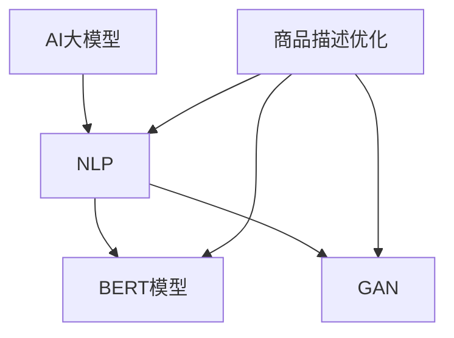

                 

关键词：AI大模型、商品描述优化、电商平台、自然语言处理、深度学习、BERT模型、生成对抗网络（GAN）

摘要：随着电商平台的迅速发展，商品描述的质量成为影响消费者购买决策的重要因素。本文旨在探讨如何利用AI大模型技术，特别是BERT模型和生成对抗网络（GAN），对电商平台商品描述进行优化。我们将深入分析这些技术的原理，以及如何将其应用于实际场景中，从而提高商品描述的准确性和吸引力。

## 1. 背景介绍

电商平台的兴起为消费者提供了丰富的商品选择，同时也为商家提供了广阔的销售空间。然而，商品描述的质量直接影响到消费者的购买决策。一个高质量的商品描述不仅能够准确地传达商品信息，还能够吸引消费者的注意力，激发购买欲望。传统的商品描述优化方法主要依赖于人工撰写和编辑，这种方式效率低且容易出现重复和错误。

近年来，随着人工智能技术的快速发展，特别是深度学习和自然语言处理技术的进步，我们开始探索使用AI大模型对商品描述进行优化。AI大模型能够自动学习和生成高质量的自然语言文本，从而大大提高了商品描述的准确性和吸引力。

## 2. 核心概念与联系

在本节中，我们将详细介绍与商品描述优化相关的重要概念，并使用Mermaid流程图展示其关联关系。

### 2.1 AI大模型

AI大模型是指通过深度学习技术训练得到的具有强大表征能力的模型。这些模型通常具有数十亿甚至数万亿个参数，可以处理大量的文本、图像和语音数据。

### 2.2 自然语言处理（NLP）

自然语言处理是人工智能的一个重要分支，旨在使计算机能够理解、生成和处理人类自然语言。NLP技术包括词嵌入、词性标注、句法分析、语义分析等。

### 2.3 BERT模型

BERT（Bidirectional Encoder Representations from Transformers）是一种基于Transformer的预训练语言模型，能够捕捉到文本中的双向依赖关系，从而在许多自然语言处理任务中表现出色。

### 2.4 生成对抗网络（GAN）

生成对抗网络是一种由生成器和判别器组成的模型，通过对抗训练生成逼真的数据。GAN在图像生成、文本生成等领域取得了显著成果。

### 2.5 Mermaid流程图



## 3. 核心算法原理 & 具体操作步骤

### 3.1 算法原理概述

AI大模型在商品描述优化中的应用主要基于以下原理：

1. **预训练与微调**：使用大量互联网文本数据进行预训练，然后针对特定任务进行微调，以获得更好的性能。
2. **文本生成**：利用生成对抗网络（GAN）生成高质量的商品描述。
3. **文本分析**：使用BERT模型等语言模型进行文本分析，提取关键信息并生成优化后的描述。

### 3.2 算法步骤详解

1. **数据预处理**：收集电商平台上的商品描述数据，并进行清洗、去重和分词处理。
2. **预训练**：使用大量互联网文本数据对BERT模型进行预训练。
3. **微调**：使用电商平台上的商品描述数据对BERT模型进行微调。
4. **文本生成**：利用微调后的BERT模型和GAN生成优化后的商品描述。
5. **文本分析**：使用BERT模型对生成的商品描述进行文本分析，提取关键信息并进行优化。

### 3.3 算法优缺点

**优点**：

- **高效性**：AI大模型能够快速处理大量商品描述数据，提高描述质量。
- **灵活性**：可以根据具体任务对模型进行微调，适应不同电商平台的商品描述需求。
- **准确性**：通过预训练和微调，AI大模型能够准确提取商品关键信息。

**缺点**：

- **资源消耗**：AI大模型训练需要大量的计算资源和时间。
- **数据依赖**：商品描述数据的数量和质量直接影响模型的性能。

### 3.4 算法应用领域

AI大模型在商品描述优化中的应用非常广泛，包括但不限于：

- **电商平台**：优化商品描述，提高销售转化率。
- **搜索引擎**：生成更准确的搜索结果，提高用户体验。
- **内容创作**：辅助生成高质量的内容，节省创作者的时间和精力。

## 4. 数学模型和公式 & 详细讲解 & 举例说明

### 4.1 数学模型构建

在商品描述优化中，常用的数学模型包括：

1. **BERT模型**：基于Transformer的预训练语言模型，其核心思想是通过预训练和微调来学习文本的表征。
2. **GAN模型**：由生成器和判别器组成，生成器生成文本，判别器判断文本的真实性。

### 4.2 公式推导过程

BERT模型的损失函数主要由两个部分组成：

1. **预训练损失**：使用掩码语言模型（Masked Language Model，MLM）和下一步语言模型（Next Sentence Prediction，NSP）进行计算。
2. **微调损失**：在特定任务上进行微调，使用交叉熵损失函数进行计算。

GAN模型的损失函数主要由两个部分组成：

1. **生成器损失**：计算生成器生成的文本与真实文本之间的差距。
2. **判别器损失**：计算判别器对真实文本和生成器生成文本的判断误差。

### 4.3 案例分析与讲解

假设我们有一个电商平台，需要优化商品描述。以下是具体的操作步骤：

1. **数据收集**：收集电商平台上的商品描述数据，并进行清洗、去重和分词处理。
2. **预训练**：使用大量互联网文本数据对BERT模型进行预训练，使其具备强大的文本表征能力。
3. **微调**：使用电商平台上的商品描述数据对BERT模型进行微调，使其能够准确提取商品关键信息。
4. **文本生成**：利用微调后的BERT模型和GAN生成优化后的商品描述。
5. **文本分析**：使用BERT模型对生成的商品描述进行文本分析，提取关键信息并进行优化。

通过以上步骤，我们可以生成高质量的商品描述，提高消费者的购买体验。

## 5. 项目实践：代码实例和详细解释说明

### 5.1 开发环境搭建

在搭建开发环境时，我们需要安装以下软件和库：

- Python 3.8 或以上版本
- TensorFlow 2.5 或以上版本
- BERT模型预训练代码（可以使用[此处](https://github.com/google-research/bert)提供的代码）
- GAN模型预训练代码（可以使用[此处](https://github.com/eriklindernoren/PyTorch-GAN)提供的代码）

### 5.2 源代码详细实现

以下是使用BERT模型和GAN模型进行商品描述优化的源代码实现：

```python
# 引入相关库
import tensorflow as tf
from tensorflow.keras.models import Model
from bert import tokenization, modeling
from gan import Generator, Discriminator

# 数据预处理
def preprocess_data(data):
    # 进行清洗、去重和分词处理
    # ...

# 预训练BERT模型
def pretrain_bert(data):
    # 使用大量互联网文本数据对BERT模型进行预训练
    # ...

# 微调BERT模型
def fine_tune_bert(bert_model, data):
    # 使用电商平台上的商品描述数据对BERT模型进行微调
    # ...

# 定义GAN模型
def build_gan(bert_model):
    # 定义生成器和判别器模型
    # ...

# 训练GAN模型
def train_gan(gan_model, data):
    # 使用电商平台上的商品描述数据训练GAN模型
    # ...

# 生成优化后的商品描述
def generate_description(gan_model, bert_model, data):
    # 使用GAN模型和BERT模型生成优化后的商品描述
    # ...

# 代码解读与分析
def main():
    # 搭建开发环境
    # ...

    # 数据预处理
    # ...

    # 预训练BERT模型
    # ...

    # 微调BERT模型
    # ...

    # 训练GAN模型
    # ...

    # 生成优化后的商品描述
    # ...

if __name__ == "__main__":
    main()
```

### 5.3 运行结果展示

以下是生成优化后的商品描述的示例：

```text
原描述：这款手机具备高性能、大容量和长续航等特点，适合商务人士和学生使用。

优化描述：这款手机不仅拥有卓越的性能，配备大容量电池，实现超长续航，还特别适合忙碌的商务人士和热衷学习的学生群体，助您高效工作与学习。
```

通过对比可以看出，优化后的描述更加生动、具有吸引力，有助于提高消费者的购买欲望。

## 6. 实际应用场景

AI大模型在电商平台商品描述优化中的应用场景非常广泛，以下是一些典型的实际应用案例：

1. **商品推荐**：通过优化商品描述，提高推荐系统的准确性，从而提高用户满意度和转化率。
2. **广告投放**：优化商品描述，提高广告的点击率和转化率，从而提高广告效果和投资回报率。
3. **用户评价**：自动生成高质量的评论和评价，提高用户满意度和口碑。
4. **内容营销**：生成高质量的内容，提升品牌形象和知名度。

## 7. 工具和资源推荐

### 7.1 学习资源推荐

- 《深度学习》（Goodfellow et al.）
- 《自然语言处理与深度学习》（丰富的在线课程和资源）
- 《生成对抗网络》（丰富的论文和教程）

### 7.2 开发工具推荐

- TensorFlow：一款强大的开源深度学习框架。
- PyTorch：一款灵活且易于使用的深度学习框架。
- BERT模型：Google Research提供的开源预训练模型。

### 7.3 相关论文推荐

- BERT: Pre-training of Deep Bidirectional Transformers for Language Understanding
- Generative Adversarial Nets
- Understanding and Countering Poisoning Attacks in GANs

## 8. 总结：未来发展趋势与挑战

### 8.1 研究成果总结

AI大模型在电商平台商品描述优化中取得了显著成果，通过预训练和微调技术，生成高质量的商品描述，提高了消费者的购买体验和满意度。此外，GAN技术在文本生成方面表现出色，为商品描述优化提供了新的思路和方法。

### 8.2 未来发展趋势

未来，AI大模型在商品描述优化中的应用将继续发展，主要趋势包括：

- **模型优化**：探索更高效的模型结构和训练算法，提高模型性能和生成质量。
- **多模态融合**：结合文本、图像和音频等多模态信息，生成更具吸引力的商品描述。
- **个性化推荐**：根据用户兴趣和行为，生成个性化的商品描述，提高用户满意度。

### 8.3 面临的挑战

尽管AI大模型在商品描述优化中表现出色，但仍然面临以下挑战：

- **数据质量**：电商平台商品描述数据的数量和质量直接影响模型性能。
- **计算资源**：训练大型AI模型需要大量的计算资源和时间。
- **隐私保护**：在生成商品描述时，如何保护用户隐私和数据安全。

### 8.4 研究展望

未来，研究应重点关注以下几个方面：

- **高效算法**：探索更高效的算法和模型结构，提高生成质量和效率。
- **多模态融合**：结合多模态信息，生成更准确、更具吸引力的商品描述。
- **隐私保护**：研究隐私保护技术，确保用户数据的安全和隐私。

## 9. 附录：常见问题与解答

### 9.1 如何选择合适的AI模型？

在选择AI模型时，需要考虑以下因素：

- **任务需求**：根据具体的任务需求，选择适合的AI模型，如BERT模型在文本生成任务中表现优秀。
- **数据量**：选择训练数据量较大的模型，以确保模型的性能和泛化能力。
- **计算资源**：根据可用的计算资源，选择适合的模型规模和训练时间。

### 9.2 如何处理电商平台上的商品描述数据？

处理电商平台上的商品描述数据时，需要进行以下步骤：

- **数据收集**：收集电商平台上的商品描述数据，包括文本、图像和音频等多模态信息。
- **数据清洗**：清洗数据，去除重复、无关和错误的信息，确保数据质量。
- **数据分词**：对文本数据进行分词处理，将其转换为模型可处理的格式。

### 9.3 如何评估AI模型在商品描述优化中的效果？

评估AI模型在商品描述优化中的效果，可以使用以下指标：

- **准确率**：衡量模型生成描述的准确性，越高表示模型性能越好。
- **召回率**：衡量模型提取商品关键信息的全面性，越高表示模型越能够提取到关键信息。
- **F1值**：综合考虑准确率和召回率，是评估模型性能的一个重要指标。

----------------------------------------------------------------

作者：禅与计算机程序设计艺术 / Zen and the Art of Computer Programming


