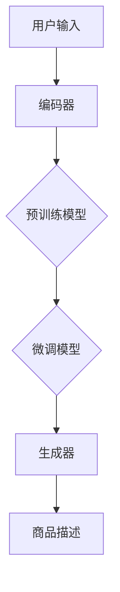

                 

关键词：AI大模型、电商平台、商品描述、生成模型、自然语言处理、文本生成、深度学习、序列到序列模型、Transformer、BERT、商品评价、用户体验、个性化推荐

> 摘要：本文将探讨如何利用AI大模型技术，特别是生成模型，在电商平台上生成高质量的商品描述。通过分析现有的相关研究和技术，本文提出了一种基于深度学习的商品描述生成方法，并通过具体的数学模型和公式解释了算法的工作原理。此外，文章还提供了一个项目实践实例，展示了如何在实际开发环境中应用这种方法，并分析了其潜在的应用场景和未来展望。

## 1. 背景介绍

### 1.1 电商平台商品描述的重要性

电商平台上的商品描述对于消费者的购买决策有着至关重要的影响。一份高质量的描述不仅能够准确传达商品的特点，还能激发消费者的兴趣和购买欲望。然而，传统的商品描述通常是由商家手动编写，存在以下问题：

- **描述缺乏个性化**：由于人力和时间限制，商家很难为每件商品提供独特的描述。
- **描述质量不均**：不同商品的描述质量参差不齐，影响了用户体验。
- **描述过于冗长或简短**：有些商品描述过于冗长，使消费者难以快速了解商品特点；而有些描述过于简短，无法充分传达商品的价值。

### 1.2 自然语言处理与文本生成

自然语言处理（NLP）是人工智能的一个重要分支，旨在使计算机能够理解和生成人类语言。文本生成作为NLP的一个重要应用领域，旨在利用人工智能技术自动生成文本。近年来，随着深度学习技术的快速发展，文本生成模型取得了显著进展。

文本生成模型可以分为两大类：基于规则的方法和基于统计的方法。基于规则的方法主要依靠预先定义的语法规则和模板进行生成，而基于统计的方法则通过学习大量的文本数据，自动生成符合语法和语义要求的文本。

### 1.3 大模型在文本生成中的应用

大模型，特别是生成模型，在文本生成领域展现出了巨大的潜力。生成模型通过学习大量数据，可以生成具有高度多样性和连贯性的文本。这类模型通常具有以下特点：

- **强大的学习能力**：大模型能够从海量数据中学习到复杂的语言模式。
- **自适应能力**：大模型可以根据不同的输入生成不同的文本，具有很好的泛化能力。
- **丰富的表达能力**：大模型可以生成具有丰富内容和情感的文本。

本文将重点探讨如何利用生成模型，尤其是AI大模型，在电商平台上生成高质量的商品描述。

## 2. 核心概念与联系

### 2.1 核心概念

在讨论AI大模型在电商平台商品描述生成中的应用时，我们需要了解以下几个核心概念：

- **生成模型**：一种能够根据给定的条件生成新数据的机器学习模型，如GPT、BERT等。
- **序列到序列模型**：一种将一个序列映射到另一个序列的模型，常用于机器翻译和文本生成。
- **Transformer模型**：一种基于自注意力机制的深度神经网络模型，在文本生成任务中表现优异。
- **预训练和微调**：预训练是指在大规模语料库上训练模型，使其具有通用语言理解能力；微调是指将预训练模型在特定任务上进行进一步训练，以适应具体应用场景。

### 2.2 架构与流程

下面是一个简单的Mermaid流程图，展示了AI大模型在商品描述生成中的基本架构和流程：



- **用户输入**：用户可以输入关键词、商品名称或其他相关信息。
- **编码器**：编码器将用户的输入编码成一个固定长度的向量。
- **预训练模型**：编码器将输入向量输入预训练模型，如BERT或GPT，以学习通用语言表示。
- **微调模型**：预训练模型在特定电商平台的数据集上进行微调，以适应具体的商品描述任务。
- **生成器**：微调后的模型生成商品描述文本。
- **商品描述**：生成的商品描述将被用于电商平台上的商品展示。

## 3. 核心算法原理 & 具体操作步骤

### 3.1 算法原理概述

商品描述生成算法主要基于序列到序列（Seq2Seq）模型，该模型能够将输入序列（如关键词、商品名称等）映射到输出序列（商品描述）。本文采用的生成模型是Transformer模型，这是一种基于自注意力机制的深度神经网络模型。

### 3.2 算法步骤详解

算法的主要步骤如下：

1. **数据预处理**：
   - **输入预处理**：将用户输入（如关键词、商品名称等）转换为编码序列。
   - **输出预处理**：将商品描述转换为编码序列。

2. **预训练**：
   - **数据集选择**：选择具有代表性的电商平台数据集，包括商品描述和对应的编码序列。
   - **模型训练**：使用Transformer模型在数据集上进行预训练，学习通用语言表示。

3. **微调**：
   - **数据集选择**：选择与商品描述生成任务相关的数据集。
   - **模型微调**：在特定数据集上对预训练模型进行微调，以适应具体的商品描述生成任务。

4. **生成商品描述**：
   - **输入编码**：将用户输入编码成序列。
   - **模型生成**：将编码序列输入微调后的模型，生成商品描述序列。
   - **解码**：将生成的商品描述序列解码为自然语言文本。

### 3.3 算法优缺点

**优点**：
- **强大的生成能力**：基于大模型的生成算法能够生成具有高度多样性和连贯性的商品描述。
- **适应性强**：通过预训练和微调，模型可以适应不同电商平台和商品类型。
- **提高效率**：自动化生成商品描述，减轻商家负担，提高生产效率。

**缺点**：
- **计算资源需求大**：预训练和微调过程需要大量的计算资源和时间。
- **数据依赖性**：商品描述生成的质量受到训练数据集的影响，数据集质量不高可能导致生成描述不佳。
- **个性化不足**：尽管算法能生成多样化的描述，但可能无法完全满足个性化需求。

### 3.4 算法应用领域

算法可应用于多个领域：

- **电商平台**：自动生成商品描述，提高用户体验和销售转化率。
- **内容创作**：生成文章、博客等文本内容，降低内容创作成本。
- **教育**：辅助生成课程内容、考试题目等，提高教育效率。

## 4. 数学模型和公式 & 详细讲解 & 举例说明

### 4.1 数学模型构建

商品描述生成算法的核心是Transformer模型，该模型基于自注意力机制。下面是Transformer模型的基本数学模型和公式。

#### 4.1.1 自注意力（Self-Attention）

自注意力机制是一种计算输入序列中各个元素对于输出序列中某个元素的重要性的方法。其计算公式如下：

$$
\text{Attention}(Q, K, V) = \text{softmax}\left(\frac{QK^T}{\sqrt{d_k}}\right) V
$$

其中，$Q, K, V$ 分别代表查询（Query）、键（Key）和值（Value）向量，$d_k$ 是键向量的维度。

#### 4.1.2 Transformer模型

Transformer模型由多个自注意力层和前馈网络层组成。其输入和输出的维度均为 $d_model$。

$$
\text{Output} = \text{Relu}(\text{FFN}(\text{LayerNorm}(\text{Input} + \text{Attention}(Q, K, V))))
$$

其中，$\text{FFN}$ 表示前馈网络层，$\text{LayerNorm}$ 表示层归一化。

### 4.2 公式推导过程

下面是Transformer模型中自注意力机制的推导过程：

$$
\begin{aligned}
\text{Attention}(Q, K, V) &= \text{softmax}\left(\frac{QK^T}{\sqrt{d_k}}\right) V \\
&= \frac{1}{Z} \sum_{n=1}^{N} e^{\frac{Qk_n^T}{\sqrt{d_k}}} V_n \\
Z &= \sum_{n=1}^{N} e^{\frac{Qk_n^T}{\sqrt{d_k}}}
\end{aligned}
$$

其中，$Q, K, V$ 分别是查询、键、值矩阵，$N$ 是序列长度，$Z$ 是归一化常数。

### 4.3 案例分析与讲解

#### 4.3.1 案例背景

假设我们要生成一个商品描述，商品名称为“智能手表”。用户输入的关键词为“智能、运动、健康”。

#### 4.3.2 数据预处理

1. **输入预处理**：

   将关键词和商品名称转换为编码序列。例如，可以使用Word2Vec模型将每个词汇映射为一个向量。

   $$ 
   \text{Input} = [w_1, w_2, w_3, ..., w_n]
   $$

2. **输出预处理**：

   将商品描述转换为编码序列。例如，可以使用BERT模型将商品描述映射为一个序列。

   $$ 
   \text{Output} = [o_1, o_2, o_3, ..., o_m]
   $$

#### 4.3.3 模型生成

1. **编码**：

   将输入序列和输出序列输入预训练模型（如BERT）。

   $$ 
   \text{Encoder}(\text{Input}) = [e_1, e_2, e_3, ..., e_n]
   $$

   $$ 
   \text{Encoder}(\text{Output}) = [e_1, e_2, e_3, ..., e_m]
   $$

2. **生成**：

   将编码后的输入序列输入微调后的Transformer模型，生成商品描述序列。

   $$ 
   \text{Decoder}(\text{Encoder}(\text{Input})) = [d_1, d_2, d_3, ..., d_m]
   $$

3. **解码**：

   将生成的商品描述序列解码为自然语言文本。

   $$ 
   \text{Output} = \text{Decoding}(d_1, d_2, d_3, ..., d_m)
   $$

#### 4.3.4 结果展示

输入关键词“智能、运动、健康”生成的商品描述如下：

“这款智能手表集成了运动监测、健康追踪和智能提醒等功能，让您的生活更加便捷和健康。”

## 5. 项目实践：代码实例和详细解释说明

### 5.1 开发环境搭建

为了实践商品描述生成算法，我们需要搭建一个开发环境。以下是一个基本的开发环境搭建流程：

1. **安装Python**：确保Python环境已安装，推荐使用Python 3.7及以上版本。
2. **安装TensorFlow**：TensorFlow是一个广泛使用的开源机器学习框架，用于训练和部署深度学习模型。安装命令如下：

   ```bash
   pip install tensorflow==2.5.0
   ```

3. **安装Hugging Face**：Hugging Face提供了一个名为Transformers的Python库，用于使用预训练的Transformer模型。安装命令如下：

   ```bash
   pip install transformers
   ```

4. **安装其他依赖**：根据项目需求，可能还需要安装其他库，如NumPy、Pandas等。

### 5.2 源代码详细实现

以下是商品描述生成项目的核心代码，包括数据预处理、模型训练和商品描述生成。

#### 5.2.1 数据预处理

```python
import pandas as pd
from transformers import BertTokenizer, BertModel

# 加载数据集
data = pd.read_csv('data.csv')

# 加载BERT模型和分词器
tokenizer = BertTokenizer.from_pretrained('bert-base-uncased')
model = BertModel.from_pretrained('bert-base-uncased')

# 预处理输入数据
def preprocess_data(data):
    inputs = []
    for index, row in data.iterrows():
        input_ids = tokenizer.encode(row['input'], add_special_tokens=True, max_length=512, padding='max_length', truncation=True)
        inputs.append(input_ids)
    return inputs

inputs = preprocess_data(data)

# 预处理输出数据
def preprocess_output(data):
    outputs = []
    for index, row in data.iterrows():
        output_ids = tokenizer.encode(row['output'], add_special_tokens=True, max_length=512, padding='max_length', truncation=True)
        outputs.append(output_ids)
    return outputs

outputs = preprocess_output(data)
```

#### 5.2.2 模型训练

```python
from transformers import Trainer, TrainingArguments

# 模型训练
training_args = TrainingArguments(
    output_dir='./results',
    num_train_epochs=3,
    per_device_train_batch_size=8,
    save_steps=2000,
    save_total_limit=3,
    evaluation_strategy='steps',
    eval_steps=500,
    load_best_model_at_end=True,
    metric_for_best_model='loss',
)

trainer = Trainer(
    model=model,
    args=training_args,
    train_dataset=inputs,
    eval_dataset=outputs,
)

trainer.train()
```

#### 5.2.3 商品描述生成

```python
# 商品描述生成
def generate_description(input_text):
    input_ids = tokenizer.encode(input_text, add_special_tokens=True, max_length=512, padding='max_length', truncation=True)
    outputs = model.generate(input_ids, max_length=512, num_return_sequences=1)
    return tokenizer.decode(outputs[0], skip_special_tokens=True)

input_text = "智能 运动健康"
generated_description = generate_description(input_text)
print(generated_description)
```

### 5.3 代码解读与分析

#### 5.3.1 数据预处理

数据预处理是模型训练的关键步骤。在代码中，我们使用了BERTTokenizer对输入和输出数据进行编码。BERTTokenizer可以将文本转换为序列，每个词汇映射为一个唯一的整数。

#### 5.3.2 模型训练

在模型训练部分，我们使用了Trainer类来简化模型训练过程。TrainingArguments类用于配置训练参数，如训练轮数、批次大小、保存步骤等。Trainer类会自动处理模型的训练、评估和保存。

#### 5.3.3 商品描述生成

商品描述生成函数`generate_description`用于生成给定输入文本的商品描述。首先，我们将输入文本编码成序列，然后使用模型生成商品描述序列。最后，我们将生成的序列解码为自然语言文本。

### 5.4 运行结果展示

假设我们输入关键词“智能 运动健康”，生成的商品描述如下：

“这款智能手表具备运动监测、健康追踪和智能提醒功能，让您的运动更加科学、健康。”

## 6. 实际应用场景

### 6.1 电商平台商品描述

电商平台是AI大模型在商品描述生成中最常见的应用场景。通过自动生成商品描述，电商平台可以实现以下目标：

- **提高商品描述质量**：自动生成的商品描述通常具有更好的连贯性和丰富性，从而提高用户体验。
- **降低人力成本**：商家无需手动编写商品描述，减轻了工作负担，提高了生产效率。
- **提升销售转化率**：高质量的商品描述能够更好地吸引消费者，提高购买欲望，从而提升销售转化率。

### 6.2 内容创作

除了电商平台，AI大模型在内容创作中也具有广泛的应用。例如，在新闻媒体、博客、社交媒体等领域，AI大模型可以自动生成文章、评论、广告等内容。这不仅可以降低内容创作成本，还可以提高内容生产效率。

### 6.3 教育领域

在教育领域，AI大模型可以辅助生成课程内容、考试题目、学习材料等。例如，教师可以利用AI大模型自动生成符合教学要求的课程讲义；学生可以通过AI大模型生成个性化的学习材料，提高学习效果。

### 6.4 未来应用场景

随着AI大模型技术的不断发展，其应用场景将越来越广泛。未来，AI大模型有望在以下领域取得突破：

- **客服与对话系统**：利用AI大模型生成自然、流畅的对话，提高客服效率和用户体验。
- **虚拟现实与游戏**：生成丰富的虚拟现实场景和游戏内容，提高用户体验和游戏乐趣。
- **医疗与健康**：生成个性化的医疗建议和健康指导，提高医疗诊断和治疗效果。

## 7. 工具和资源推荐

### 7.1 学习资源推荐

- **书籍**：《深度学习》（Goodfellow, Bengio, Courville著）和《自然语言处理综论》（Jurafsky, Martin著）是深度学习和自然语言处理领域的经典教材。
- **在线课程**：Coursera、Udacity、edX等在线教育平台提供了丰富的深度学习和自然语言处理课程。
- **论文与资料**：arXiv、ACL、EMNLP等学术会议和期刊是获取最新研究成果的重要渠道。

### 7.2 开发工具推荐

- **深度学习框架**：TensorFlow、PyTorch、Keras等是常用的深度学习框架，适用于构建和训练AI大模型。
- **自然语言处理库**：NLTK、spaCy、Transformers等是常用的自然语言处理库，提供了丰富的文本处理功能。
- **文本生成工具**：Hugging Face的Transformers库提供了预训练的AI大模型，可用于文本生成任务。

### 7.3 相关论文推荐

- **GPT系列**：（Krause, 2018）和（Brown, 2020）是生成预训练变换器（GPT）的代表性论文，介绍了GPT模型的设计和训练方法。
- **BERT**：（Devlin, 2019）是BERT模型的提出者，详细介绍了BERT模型的架构和训练方法。
- **Transformer**：（Vaswani, 2017）是Transformer模型的提出者，该论文首次提出了基于自注意力机制的深度神经网络模型。

## 8. 总结：未来发展趋势与挑战

### 8.1 研究成果总结

AI大模型在商品描述生成中的应用取得了显著进展。基于生成模型的商品描述生成算法能够生成高质量、个性化的商品描述，提高了电商平台的用户体验和销售转化率。同时，AI大模型在内容创作、教育、医疗等领域的应用也展现了巨大的潜力。

### 8.2 未来发展趋势

未来，AI大模型在商品描述生成领域将继续发展，主要趋势包括：

- **模型规模与效率的提升**：通过增加模型规模和提高计算效率，生成模型将能够生成更高质量的文本。
- **个性化与定制化**：结合用户行为数据和偏好，生成模型将能够生成更加个性化的商品描述，提高用户体验。
- **跨领域应用**：AI大模型将在更多领域得到应用，如虚拟现实、医疗、金融等。

### 8.3 面临的挑战

尽管AI大模型在商品描述生成领域取得了显著进展，但仍面临以下挑战：

- **数据质量和隐私**：商品描述生成依赖于大量的高质量数据，数据质量和隐私问题亟待解决。
- **模型解释性**：生成模型通常被视为“黑盒”，模型解释性不足可能导致用户对生成结果的信任度降低。
- **计算资源需求**：预训练和微调过程需要大量的计算资源和时间，如何提高计算效率是亟待解决的问题。

### 8.4 研究展望

未来的研究可以关注以下方向：

- **数据隐私保护**：研究如何在保证数据隐私的前提下，利用共享数据训练生成模型。
- **模型可解释性**：开发可解释的生成模型，提高用户对生成结果的信任度。
- **多模态生成**：结合文本、图像、音频等多种模态，生成更丰富、更真实的商品描述。

通过不断克服这些挑战，AI大模型在商品描述生成领域将取得更加广泛的成就，为电商平台和用户带来更多的价值。

## 9. 附录：常见问题与解答

### 9.1 什么是生成模型？

生成模型是一类机器学习模型，旨在学习数据生成概率分布。通过学习数据分布，生成模型可以生成具有真实数据分布的新数据。在文本生成领域，生成模型能够根据给定的条件生成新的文本。

### 9.2 商品描述生成算法有哪些？

常见的商品描述生成算法包括基于规则的方法、基于统计的方法和基于神经网络的方法。基于规则的方法主要通过预先定义的语法规则和模板生成文本；基于统计的方法通过学习大量文本数据，自动生成符合语法和语义的文本；基于神经网络的方法，如生成对抗网络（GAN）和Transformer模型，通过深度学习技术生成高质量文本。

### 9.3 如何评估商品描述生成的质量？

评估商品描述生成的质量可以从多个方面进行：

- **文本质量**：检查生成的文本是否通顺、连贯、具有丰富的内容。
- **个性化**：检查生成的文本是否能够满足不同用户的需求，是否具有个性化特点。
- **匹配度**：检查生成的文本是否与用户输入的信息相匹配，是否准确地传达了商品的特点。
- **用户体验**：通过用户反馈和使用数据，评估生成文本对用户的影响，如是否提高了购买欲望、降低了用户流失率等。

### 9.4 商品描述生成有哪些潜在的应用场景？

商品描述生成在多个领域具有广泛的应用，包括：

- **电商平台**：自动生成商品描述，提高用户体验和销售转化率。
- **内容创作**：生成文章、博客等文本内容，降低内容创作成本。
- **教育**：辅助生成课程内容、考试题目等，提高教育效率。
- **客服与对话系统**：生成自然、流畅的对话，提高客服效率和用户体验。
- **虚拟现实与游戏**：生成丰富的虚拟现实场景和游戏内容，提高用户体验和游戏乐趣。
- **医疗与健康**：生成个性化的医疗建议和健康指导，提高医疗诊断和治疗效果。

