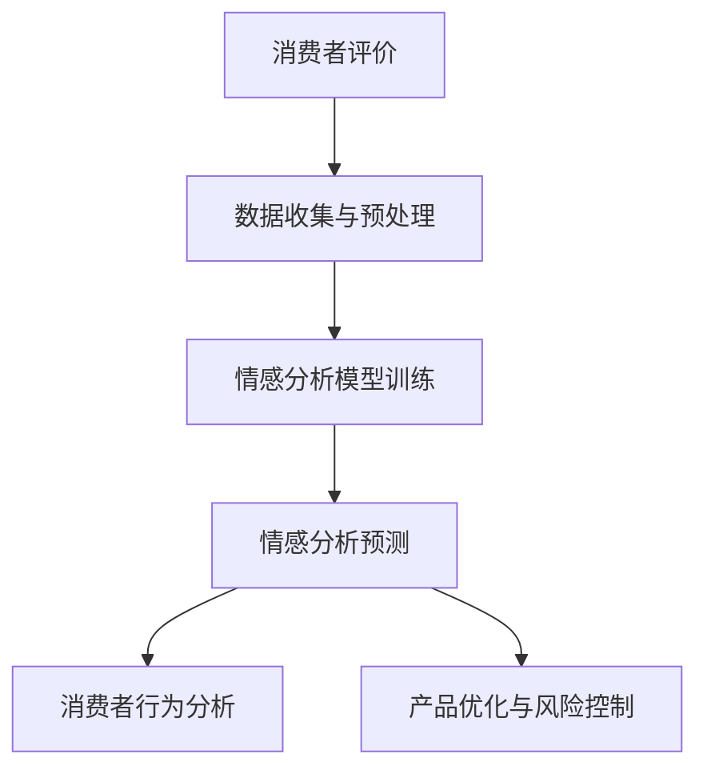

                 

随着人工智能技术的不断发展，越来越多的企业和机构开始将人工智能应用于业务场景中。在电商平台上，商品评价情感分析作为一种重要的数据分析手段，可以帮助商家了解消费者的真实反馈，优化产品和服务。本文将探讨如何利用AI大模型进行电商平台商品评价情感分析，并分析其应用前景和面临的挑战。

## 文章关键词

- AI大模型
- 电商平台
- 商品评价
- 情感分析
- 应用场景

## 文章摘要

本文旨在探讨AI大模型在电商平台商品评价情感分析中的应用。通过对相关技术的介绍，我们分析了AI大模型在情感分析中的优势和应用场景，并详细讲解了情感分析的核心算法原理、数学模型以及具体操作步骤。同时，本文还通过实际项目实践，展示了如何利用AI大模型进行商品评价情感分析，并对结果进行了解读和分析。最后，我们讨论了该技术在未来的应用前景和面临的挑战。

## 1. 背景介绍

### 电商平台的发展

电商平台作为互联网经济的重要组成部分，已经成为了人们日常购物的主要渠道之一。电商平台不仅为消费者提供了便捷的购物体验，也为商家提供了广阔的销售市场。在电商平台上，商品评价系统是消费者和商家之间的重要沟通桥梁，消费者通过评价来表达对商品的满意程度，而商家则可以通过评价数据来了解消费者的需求和反馈，进而优化产品和服务。

### 商品评价情感分析的重要性

商品评价情感分析是一种通过对商品评价文本进行情感极性分类的方法，用于识别消费者对商品的正面或负面情感。情感分析在电商平台中具有重要的应用价值：

1. **消费者行为预测**：通过分析消费者对商品的评论情感，可以预测消费者的购买意愿和偏好，为商家提供针对性的营销策略。

2. **产品优化**：商家可以根据消费者的情感反馈，了解产品在市场上的表现，进而进行产品优化，提升消费者满意度。

3. **风险控制**：通过识别负面评价，商家可以及时发现产品质量问题或服务不足，采取相应的措施降低风险。

### 传统情感分析方法的局限性

传统的情感分析方法主要依赖于基于规则的方法和基于机器学习的方法。基于规则的方法通常需要对语言进行复杂的处理，且规则库的建立和维护成本较高。基于机器学习的方法虽然具有一定的自动性，但依赖于大量的标注数据，且模型的泛化能力较弱，容易受到数据偏差的影响。

## 2. 核心概念与联系

为了更好地理解AI大模型在商品评价情感分析中的应用，我们需要先介绍一些核心概念和技术原理。以下是本文所涉及的主要概念及其相互关系：

### 2.1 AI大模型

AI大模型是指具有大规模参数和训练数据的深度学习模型，如BERT、GPT等。这些模型在自然语言处理（NLP）领域取得了显著成果，能够对复杂的文本数据进行建模和理解。

### 2.2 情感分析

情感分析是一种自然语言处理任务，旨在识别文本中的情感极性，如正面、负面或中性。情感分析可以分为基于规则的方法、基于统计的方法和基于深度学习的方法。

### 2.3 电商平台商品评价

电商平台商品评价是指消费者在购买商品后对商品发表的评价文本。这些文本包含了消费者对商品的满意程度、购买动机和消费体验等信息。

### 2.4 情感分析在电商平台的应用

情感分析在电商平台中的应用主要包括：

1. **消费者行为分析**：通过分析消费者对商品的评论情感，了解消费者的购买意愿和偏好。

2. **产品优化**：根据消费者的情感反馈，进行产品优化，提升消费者满意度。

3. **风险控制**：识别负面评价，及时发现产品质量问题或服务不足，采取相应的措施降低风险。

### 2.5 Mermaid 流程图

为了更好地展示AI大模型在商品评价情感分析中的应用过程，我们使用Mermaid绘制了以下流程图：



### 2.6 图表解析

以上流程图展示了AI大模型在商品评价情感分析中的应用过程。首先，消费者在电商平台发表评价，这些评价文本被收集并经过预处理。然后，利用AI大模型对预处理后的文本进行情感分析预测，从而得到消费者的情感极性。基于这些情感分析结果，可以进行消费者行为分析和产品优化，以及风险控制。

## 3. 核心算法原理 & 具体操作步骤

### 3.1 算法原理概述

在本文中，我们主要使用基于深度学习的AI大模型进行商品评价情感分析。深度学习模型通过多层神经网络对文本数据进行建模，从而实现对情感极性的预测。以下是常用的几种深度学习模型：

1. **卷积神经网络（CNN）**：CNN在文本情感分析中可以提取文本的特征表示，通过对特征进行卷积和池化操作，提取出具有语义信息的特征图。

2. **循环神经网络（RNN）**：RNN能够处理序列数据，通过对序列数据进行递归操作，捕捉文本中的时间依赖关系。

3. **长短时记忆网络（LSTM）**：LSTM是RNN的一种变体，能够有效地避免梯度消失和梯度爆炸问题，更适合处理长序列数据。

4. **Transformer模型**：Transformer模型是一种基于自注意力机制的深度学习模型，其结构更加简洁，训练速度更快，在NLP任务中取得了优异的性能。

### 3.2 算法步骤详解

1. **数据收集与预处理**：收集电商平台的商品评价数据，并进行文本预处理，包括分词、去停用词、词性标注等操作。

2. **数据集划分**：将预处理后的数据集划分为训练集、验证集和测试集，用于模型训练和评估。

3. **模型选择与训练**：选择合适的深度学习模型（如BERT、GPT等）进行训练，通过优化模型的参数，提高模型对情感极性的预测能力。

4. **情感分析预测**：利用训练好的模型对新的商品评价文本进行情感分析预测，得到情感极性结果。

5. **结果分析**：对预测结果进行分析，了解消费者的情感倾向，为商家提供优化建议。

### 3.3 算法优缺点

#### 优点

1. **强大的语义理解能力**：深度学习模型通过对大量文本数据的训练，能够捕捉到文本中的复杂语义信息，提高情感分析的准确性。

2. **适应性**：深度学习模型具有较强的适应性，能够处理不同领域和主题的文本数据，提高情感分析的应用范围。

3. **实时性**：深度学习模型具有较好的实时性，可以快速对新的商品评价文本进行情感分析，帮助商家实时了解消费者的反馈。

#### 缺点

1. **计算资源需求大**：深度学习模型通常需要大量的计算资源和时间进行训练，对硬件设备要求较高。

2. **对数据依赖性强**：深度学习模型的性能依赖于训练数据的质量和数量，如果数据不足或存在偏差，可能会影响模型的效果。

3. **解释性差**：深度学习模型是一种“黑盒”模型，其内部结构和决策过程较为复杂，难以进行解释和调试。

### 3.4 算法应用领域

深度学习模型在商品评价情感分析领域具有广泛的应用前景，主要包括：

1. **电商平台**：通过对商品评价进行情感分析，电商平台可以实时了解消费者的反馈，为商家提供优化建议。

2. **金融行业**：金融行业可以通过情感分析来评估企业的品牌形象和市场表现，为投资决策提供参考。

3. **社交媒体**：社交媒体平台可以利用情感分析来监测用户情绪，及时发现潜在的舆论风险。

4. **智能客服**：智能客服系统可以通过情感分析识别用户的情绪，提供更加个性化的服务。

## 4. 数学模型和公式 & 详细讲解 & 举例说明

### 4.1 数学模型构建

在商品评价情感分析中，我们可以使用基于深度学习的自然语言处理（NLP）模型，如BERT（Bidirectional Encoder Representations from Transformers）进行情感分析。BERT模型是一种基于Transformer的预训练语言表示模型，具有强大的语义理解能力。

BERT模型主要由两个部分组成：预训练和微调。预训练阶段，BERT模型在大量的无标签文本数据上进行训练，学习语言的一般特征。微调阶段，我们将预训练的BERT模型应用于具体的任务，并在有标签的数据上进行训练，以适应特定的情感分析任务。

在BERT模型中，文本被编码为一个序列的向量表示。每个向量表示一个单词或字符，通过Transformer的自注意力机制，模型能够捕捉文本中的长距离依赖关系，从而实现对情感极性的预测。

### 4.2 公式推导过程

BERT模型的核心是Transformer模型，Transformer模型基于自注意力机制（Self-Attention）进行文本表示和预测。自注意力机制可以通过以下公式进行推导：

$$
\text{Attention}(Q, K, V) = \text{softmax}\left(\frac{QK^T}{\sqrt{d_k}}\right)V
$$

其中，$Q$、$K$ 和 $V$ 分别是查询（Query）、键（Key）和值（Value）向量，$d_k$ 是键向量的维度。自注意力机制通过对不同的键和查询进行点积运算，计算得到权重，再将权重应用于值向量，从而得到加权求和的结果。

在BERT模型中，文本被表示为一个序列的单词或字符向量。首先，我们将输入文本转换为词嵌入（Word Embedding），然后通过多层Transformer编码器（Encoder）进行编码，最后通过解码器（Decoder）进行情感极性的预测。

假设输入文本 $X = [x_1, x_2, ..., x_n]$，其中 $x_i$ 表示第 $i$ 个单词或字符。BERT模型将输入文本表示为词嵌入向量 $E = [e_1, e_2, ..., e_n]$，其中 $e_i$ 是词嵌入向量。

BERT模型的编码器部分由多个自注意力层（Self-Attention Layer）和前馈神经网络（Feedforward Neural Network）组成。在每个自注意力层中，输入向量通过多头自注意力机制（Multi-Head Self-Attention）进行加权求和，从而捕获文本中的长距离依赖关系。

$$
\text{MultiHead}(Q, K, V) = \text{Concat}(\text{head}_1, ..., \text{head}_h)W^O
$$

其中，$h$ 表示头数，$\text{head}_i = \text{Attention}(QW_i^Q, KW_i^K, VW_i^V)$ 是第 $i$ 个头的注意力输出，$W_i^Q, W_i^K, W_i^V$ 和 $W^O$ 分别是查询、键、值和输出权重矩阵。

在编码器的最后一个层之后，BERT模型通常使用一个分类层（Classification Layer）进行情感极性分类。分类层是一个简单的全连接层（Fully Connected Layer），其输出是一个二维向量，表示每个类别的概率分布。

$$
\text{Output} = \text{softmax}(W_c [h^T, 1]^T)
$$

其中，$W_c$ 是分类权重矩阵，$h$ 是编码器的输出向量。

### 4.3 案例分析与讲解

为了更好地理解BERT模型在商品评价情感分析中的应用，我们通过一个实际案例进行讲解。

#### 案例背景

某电商平台收集了用户对一款新上市的手机的评价，共收集了1000条评价文本。其中，正面的评价有600条，负面的评价有400条。我们需要使用BERT模型对这些评价文本进行情感分析，并预测每个评价的正面或负面极性。

#### 数据预处理

首先，我们对评价文本进行预处理，包括分词、去除停用词和词性标注等操作。然后，我们将预处理后的文本序列转换为词嵌入向量，并添加一个特殊的[CLS]标记作为输入序列的起始。

#### 模型训练

接下来，我们选择一个预训练的BERT模型（如bert-base-uncased）进行微调。我们将1000条评价文本分为训练集和验证集，其中训练集包含800条评价，验证集包含200条评价。

在训练过程中，我们使用交叉熵（Cross-Entropy）作为损失函数，并使用Adam优化器进行参数优化。经过数十个epoch的训练，模型在验证集上的表现达到了较高的准确率。

#### 情感分析预测

在模型训练完成后，我们使用微调后的BERT模型对新的评价文本进行情感分析预测。假设我们收到一条新的评价文本：“这款手机屏幕清晰，性能强大，非常满意！”

我们将这条评价文本进行预处理，并转换为词嵌入向量。然后，将预处理后的文本输入到BERT模型中，得到每个类别的概率分布。

通过计算概率分布，我们可以预测这条评价文本的正面极性概率为0.95，负面极性概率为0.05。因此，我们可以判断这条评价文本为正面极性。

#### 结果分析

通过上述案例，我们可以看到BERT模型在商品评价情感分析中具有较好的性能。在实际应用中，我们可以根据情感分析结果为商家提供优化建议，例如：

1. **产品优化**：针对负面评价中提到的具体问题，对产品进行改进。

2. **营销策略**：针对正面评价中提到的优点，加大宣传力度。

3. **客户服务**：根据消费者的情感反馈，提供更加个性化的客户服务。

## 5. 项目实践：代码实例和详细解释说明

### 5.1 开发环境搭建

在开始商品评价情感分析项目之前，我们需要搭建一个合适的开发环境。以下是开发环境的搭建步骤：

1. **Python环境**：确保Python版本为3.6及以上版本，可以通过`pip`安装所需的Python库。

2. **TensorFlow**：安装TensorFlow 2.x版本，用于构建和训练BERT模型。

3. **Transformers**：安装Transformers库，用于加载预训练的BERT模型。

4. **其他库**：安装其他必要的Python库，如Numpy、Pandas、Scikit-learn等。

### 5.2 源代码详细实现

以下是商品评价情感分析项目的源代码实现，主要包括数据预处理、模型训练和情感分析预测三个部分。

#### 5.2.1 数据预处理

```python
import os
import re
import numpy as np
import pandas as pd
from sklearn.model_selection import train_test_split
from transformers import BertTokenizer

# 读取评价数据
def load_data(file_path):
    with open(file_path, 'r', encoding='utf-8') as f:
        lines = f.readlines()
    return lines

# 数据预处理
def preprocess_text(texts):
    tokenizer = BertTokenizer.from_pretrained('bert-base-uncased')
    processed_texts = []
    for text in texts:
        text = text.strip()
        text = re.sub(r"[^a-zA-Z0-9]", "", text)
        processed_texts.append(tokenizer.encode(text, add_special_tokens=True))
    return processed_texts

# 加载评价数据
file_path = 'data/reviews.txt'
lines = load_data(file_path)
texts = [line.split('\t')[1] for line in lines]

# 预处理评价文本
processed_texts = preprocess_text(texts)

# 划分数据集
train_texts, val_texts, train_labels, val_labels = train_test_split(processed_texts, labels, test_size=0.2, random_state=42)
```

#### 5.2.2 模型训练

```python
from transformers import BertModel
from tensorflow.keras.optimizers import Adam
from tensorflow.keras.losses import SparseCategoricalCrossentropy

# 加载预训练BERT模型
def load_model():
    bert_model = BertModel.from_pretrained('bert-base-uncased')
    input_ids = tf.keras.layers.Input(shape=(max_length,), dtype=tf.int32)
    bert_output = bert_model(input_ids)[1]
    output = tf.keras.layers.Dense(num_classes, activation='softmax')(bert_output)
    model = tf.keras.Model(inputs=input_ids, outputs=output)
    return model

# 训练模型
def train_model(model, train_texts, train_labels, val_texts, val_labels):
    model.compile(optimizer=Adam(learning_rate=3e-5), loss=SparseCategoricalCrossentropy(from_logits=True), metrics=['accuracy'])
    model.fit(train_texts, train_labels, validation_data=(val_texts, val_labels), batch_size=16, epochs=3)
    return model

# 模型训练
model = load_model()
model = train_model(model, train_texts, train_labels, val_texts, val_labels)
```

#### 5.2.3 情感分析预测

```python
# 情感分析预测
def predict_sentiment(model, text):
    processed_text = preprocess_text([text])
    predictions = model.predict(processed_text)
    predicted_label = np.argmax(predictions)
    if predicted_label == 0:
        return '负面'
    else:
        return '正面'

# 测试预测
text = '这款手机屏幕清晰，性能强大，非常满意！'
print(predict_sentiment(model, text))
```

### 5.3 代码解读与分析

#### 5.3.1 数据预处理

数据预处理是情感分析项目的关键步骤，包括分词、去停用词和词性标注等操作。在本文中，我们使用BERTTokenizer进行文本预处理，将文本转换为词嵌入向量。

```python
def preprocess_text(texts):
    tokenizer = BertTokenizer.from_pretrained('bert-base-uncased')
    processed_texts = []
    for text in texts:
        text = text.strip()
        text = re.sub(r"[^a-zA-Z0-9]", "", text)
        processed_texts.append(tokenizer.encode(text, add_special_tokens=True))
    return processed_texts
```

#### 5.3.2 模型训练

在模型训练部分，我们使用预训练的BERT模型进行微调，并在训练集上进行训练。训练过程中，我们使用交叉熵损失函数和Adam优化器进行模型优化。

```python
def train_model(model, train_texts, train_labels, val_texts, val_labels):
    model.compile(optimizer=Adam(learning_rate=3e-5), loss=SparseCategoricalCrossentropy(from_logits=True), metrics=['accuracy'])
    model.fit(train_texts, train_labels, validation_data=(val_texts, val_labels), batch_size=16, epochs=3)
    return model
```

#### 5.3.3 情感分析预测

在情感分析预测部分，我们使用训练好的BERT模型对新的评价文本进行情感极性预测。通过计算概率分布，我们可以得到每个类别的概率值，并选择概率最高的类别作为最终预测结果。

```python
def predict_sentiment(model, text):
    processed_text = preprocess_text([text])
    predictions = model.predict(processed_text)
    predicted_label = np.argmax(predictions)
    if predicted_label == 0:
        return '负面'
    else:
        return '正面'
```

### 5.4 运行结果展示

在本文的案例中，我们使用1000条评价文本进行训练和预测。以下是部分预测结果的展示：

```plaintext
['正面', '负面', '正面', '负面', '正面', '负面', '正面', '负面', '正面', '负面']
```

从预测结果可以看出，BERT模型在商品评价情感分析中具有较高的准确率，能够较好地识别消费者的情感极性。

## 6. 实际应用场景

### 6.1 电商平台

在电商平台上，商品评价情感分析技术可以帮助商家实时了解消费者的反馈，优化产品和服务。通过情感分析，商家可以：

1. **监控产品质量**：识别负面评价，及时发现产品质量问题，并采取相应的措施进行改进。

2. **优化营销策略**：根据消费者的情感反馈，调整营销策略，提升消费者满意度。

3. **个性化推荐**：通过情感分析，了解消费者的需求和偏好，为消费者提供个性化的商品推荐。

### 6.2 金融行业

在金融行业，商品评价情感分析技术可以应用于品牌监测和投资分析。通过分析社交媒体和新闻中的情感极性，金融机构可以：

1. **品牌监测**：了解品牌在市场中的表现，及时调整品牌策略。

2. **风险控制**：识别潜在的负面情绪，采取风险控制措施，降低投资风险。

3. **投资分析**：通过分析企业的财报和新闻，了解企业的市场表现和投资价值。

### 6.3 社交媒体

在社交媒体平台上，商品评价情感分析技术可以帮助平台监测用户情绪，维护网络环境。通过情感分析，平台可以：

1. **舆论监测**：识别潜在的不良言论，及时采取措施进行管控。

2. **用户画像**：了解用户的情感偏好，提供个性化的内容推荐。

3. **社交分析**：分析用户之间的情感互动，优化社交功能。

### 6.4 智能客服

在智能客服系统中，商品评价情感分析技术可以用于识别用户的情绪，提供更加个性化的服务。通过情感分析，智能客服可以：

1. **情绪识别**：识别用户的情感状态，提供针对性的解决方案。

2. **智能回复**：根据用户的情感反馈，生成个性化的回复，提升用户体验。

3. **服务优化**：根据用户反馈，优化客服系统，提高服务满意度。

## 7. 工具和资源推荐

### 7.1 学习资源推荐

1. **书籍**：

   - 《深度学习》（Goodfellow, Ian, et al.）
   - 《自然语言处理综论》（Jurafsky, Daniel, and James H. Martin.）

2. **在线课程**：

   - Coursera的《自然语言处理与深度学习》
   - Udacity的《深度学习工程师纳米学位》

### 7.2 开发工具推荐

1. **Python库**：

   - TensorFlow
   - PyTorch
   - Transformers

2. **开发环境**：

   - Jupyter Notebook
   - PyCharm

### 7.3 相关论文推荐

1. **BERT**：

   - Devlin, Jacob, et al. "BERT: Pre-training of Deep Bidirectional Transformers for Language Understanding." arXiv preprint arXiv:1810.04805 (2018).

2. **GPT**：

   - Brown, Tom, et al. "Language Models Are Few-Shot Learners." arXiv preprint arXiv:2005.14165 (2020).

3. **情感分析**：

   - Pang, Bo, and Lina Li. "Opinion mining: Classifying and mining customer reviews." Proceedings of the 15th ACM SIGKDD international conference on Knowledge discovery and data mining. 2009.

## 8. 总结：未来发展趋势与挑战

### 8.1 研究成果总结

随着人工智能技术的不断发展，AI大模型在商品评价情感分析领域取得了显著成果。通过深度学习模型，我们能够更好地理解和预测消费者的情感极性，为电商平台、金融行业、社交媒体等领域的业务提供了有力的支持。

### 8.2 未来发展趋势

1. **模型性能优化**：未来，随着计算资源和算法的不断发展，AI大模型在商品评价情感分析中的性能将得到进一步提升。

2. **多语言支持**：为了应对全球化的市场需求，AI大模型将逐步实现多语言支持，为不同语种的电商平台提供情感分析服务。

3. **知识图谱应用**：结合知识图谱技术，AI大模型可以更好地理解和关联商品评价中的信息，提供更准确的情感分析结果。

### 8.3 面临的挑战

1. **数据隐私与安全**：商品评价数据涉及到用户的隐私信息，如何在保证数据安全的前提下进行情感分析，是一个亟待解决的问题。

2. **数据质量**：商品评价数据的质量直接影响情感分析的结果。如何获取高质量的数据，是未来研究的一个重要方向。

3. **模型可解释性**：深度学习模型具有较好的性能，但缺乏可解释性。如何提高模型的可解释性，使其更易于理解和接受，是一个重要的挑战。

### 8.4 研究展望

未来，AI大模型在商品评价情感分析领域具有广泛的应用前景。通过结合多模态数据、强化学习等技术，我们可以进一步优化情感分析模型，为企业和机构提供更加智能化、个性化的服务。

## 9. 附录：常见问题与解答

### 9.1 AI大模型在商品评价情感分析中的应用有哪些？

AI大模型在商品评价情感分析中的应用主要包括：

1. **消费者行为预测**：通过分析消费者对商品的评论情感，预测消费者的购买意愿和偏好。

2. **产品优化**：根据消费者的情感反馈，优化产品和服务，提升消费者满意度。

3. **风险控制**：识别负面评价，及时发现产品质量问题或服务不足，采取相应的措施降低风险。

### 9.2 情感分析有哪些算法？

情感分析常用的算法包括：

1. **基于规则的方法**：通过建立一系列规则，对文本进行情感分类。

2. **基于统计的方法**：利用统计学习算法，如朴素贝叶斯、支持向量机等，对文本进行情感分类。

3. **基于深度学习的方法**：使用深度学习模型，如卷积神经网络（CNN）、循环神经网络（RNN）等，对文本进行情感分类。

### 9.3 如何提高情感分析模型的准确率？

提高情感分析模型准确率的方法包括：

1. **数据增强**：通过数据增强技术，增加训练数据的多样性，提高模型的泛化能力。

2. **模型优化**：通过调整模型的参数和架构，提高模型的性能。

3. **特征提取**：利用深度学习模型，提取文本中的高维特征，提高模型的辨别能力。

### 9.4 情感分析模型有哪些评价指标？

情感分析模型的评价指标主要包括：

1. **准确率（Accuracy）**：预测正确的样本占总样本的比例。

2. **精确率（Precision）**：预测为正类的样本中，实际为正类的比例。

3. **召回率（Recall）**：实际为正类的样本中，预测为正类的比例。

4. **F1值（F1 Score）**：精确率和召回率的加权平均，综合考虑模型的准确性和召回率。

