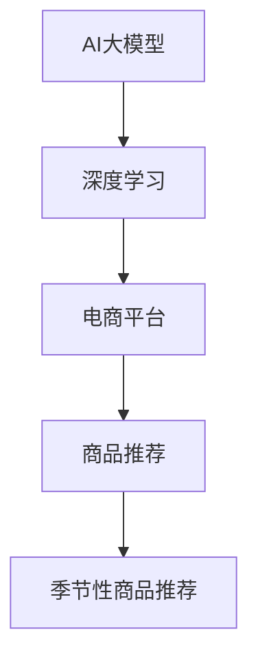

                 

关键词：AI大模型、电商平台、季节性商品推荐、深度学习、算法优化、数据分析、用户行为分析

摘要：本文将探讨如何利用AI大模型在电商平台中实现对季节性商品的精准推荐。首先介绍AI大模型的基础概念及其在电商平台中的应用背景，然后详细解析推荐算法原理和具体操作步骤，并通过数学模型和案例分析，阐述其优缺点和应用领域。接下来，将展示一个代码实例，并对代码进行解读与分析。最后，讨论实际应用场景，展望未来的发展趋势与挑战，并提供相关的工具和资源推荐。

## 1. 背景介绍

随着互联网的快速发展，电商平台已经成为消费者购买商品的重要渠道。然而，面对海量的商品信息和多样化的用户需求，如何提供个性化的商品推荐服务成为电商企业提升用户体验和转化率的关键。传统的推荐算法主要依赖于基于内容的推荐和协同过滤等方法，虽然在一定程度上能够满足用户的需求，但往往缺乏对用户行为的深度理解，难以实现精准推荐。

季节性商品推荐是一个特殊且具有挑战性的领域。季节性商品通常受气候、节假日、文化习俗等因素的影响，其销量和用户偏好具有明显的周期性波动。例如，冬季的保暖衣物和圣诞节的礼品等，在特定的季节会有较高的销售需求。因此，如何根据季节性特征进行有效的商品推荐，成为电商平台需要解决的重要问题。

近年来，随着AI技术的快速发展，大模型在各个领域取得了显著的应用成果。大模型具有强大的数据处理能力和学习能力，能够从大量数据中提取出隐藏的模式和规律，为电商平台提供更加精准和个性化的推荐服务。本文将结合AI大模型的特点，探讨其在电商平台季节性商品推荐中的应用。

## 2. 核心概念与联系

在探讨AI大模型在电商平台季节性商品推荐中的应用之前，首先需要了解一些核心概念及其之间的联系。

### 2.1 AI大模型

AI大模型是指具有大规模参数的深度学习模型，如Transformer、BERT等。这些模型通过在大量数据上进行训练，能够自动提取特征和模式，实现对未知数据的预测和分类。大模型的优点在于其能够处理复杂的问题，且具有较好的泛化能力。

### 2.2 深度学习

深度学习是一种基于多层的神经网络进行特征学习和模式识别的方法。通过逐层提取特征，深度学习模型能够从原始数据中提取出有意义的特征表示，从而实现高精度的预测和分类。

### 2.3 电商平台

电商平台是指通过互联网为消费者和商家提供商品交易的平台。电商平台的核心功能包括商品展示、搜索、推荐、交易和售后服务等。在电商平台中，商品推荐是一个重要的功能，它直接影响用户的购物体验和平台的销售额。

### 2.4 季节性商品推荐

季节性商品推荐是指根据商品的季节性特征，为用户推荐相关商品的一种推荐方法。季节性商品通常具有明显的周期性波动，如冬季的保暖衣物、夏季的清凉用品等。通过分析季节性特征，电商平台可以提供更加精准和个性化的推荐服务。

### 2.5 Mermaid 流程图

为了更好地理解AI大模型在电商平台季节性商品推荐中的应用，下面给出一个Mermaid流程图，展示其核心概念和联系。



## 3. 核心算法原理 & 具体操作步骤

### 3.1 算法原理概述

AI大模型在电商平台季节性商品推荐中的应用主要基于深度学习技术。深度学习模型通过多层神经网络对用户行为数据、商品特征数据等大量数据进行训练，从而提取出用户偏好和商品特征之间的关联性。具体而言，算法可以分为以下几个步骤：

1. 数据采集与预处理：收集用户行为数据、商品特征数据等，并进行数据清洗和预处理，以消除噪声和异常值。
2. 特征工程：根据用户行为和商品特征，构建特征向量，为深度学习模型提供输入。
3. 模型训练：使用训练数据对深度学习模型进行训练，使其能够学习到用户偏好和商品特征之间的关联性。
4. 模型评估：使用验证数据对训练好的模型进行评估，调整模型参数，以提高推荐效果。
5. 商品推荐：根据用户的历史行为和当前季节特征，使用训练好的模型为用户推荐相关商品。

### 3.2 算法步骤详解

下面详细解析AI大模型在电商平台季节性商品推荐中的具体操作步骤。

#### 3.2.1 数据采集与预处理

数据采集与预处理是算法的基础步骤。首先，从电商平台的后台系统收集用户行为数据，包括用户的浏览记录、购买记录、收藏记录等。同时，还需要收集商品特征数据，包括商品的类别、价格、品牌、库存量等。在数据采集过程中，需要注意以下几点：

1. 数据完整性：确保收集到的数据是完整的，没有缺失值。
2. 数据一致性：确保不同来源的数据在格式和单位上保持一致。
3. 噪声处理：去除数据中的噪声和异常值，以提高数据质量。

#### 3.2.2 特征工程

特征工程是将原始数据转化为适合深度学习模型输入的过程。在特征工程过程中，需要对用户行为数据和商品特征数据进行处理和转换。具体步骤如下：

1. 用户特征：根据用户的浏览记录、购买记录、收藏记录等数据，提取用户的行为特征。例如，用户的平均浏览时长、购买频率、浏览深度等。
2. 商品特征：根据商品的特征数据，提取商品的基本特征。例如，商品的类别、品牌、价格、库存量等。
3. 时间特征：根据用户行为发生的时间，提取时间特征。例如，用户的行为发生时间、季节特征、节假日特征等。

#### 3.2.3 模型训练

在特征工程完成后，使用训练数据对深度学习模型进行训练。具体步骤如下：

1. 选择模型：根据问题的复杂性，选择合适的深度学习模型。例如，Transformer、BERT等。
2. 数据预处理：对训练数据进行预处理，包括数据标准化、数据归一化等。
3. 模型训练：使用训练数据对深度学习模型进行训练，通过优化算法调整模型参数，使其能够学习到用户偏好和商品特征之间的关联性。
4. 模型评估：使用验证数据对训练好的模型进行评估，计算模型的准确率、召回率等指标，以评估模型性能。

#### 3.2.4 模型评估

在模型训练完成后，使用验证数据对模型进行评估，以确定模型是否达到预期效果。具体步骤如下：

1. 数据集划分：将数据集划分为训练集、验证集和测试集，以保证模型评估的客观性。
2. 模型评估：使用验证集对模型进行评估，计算模型的准确率、召回率等指标。
3. 模型调整：根据模型评估结果，调整模型参数，以提高模型性能。

#### 3.2.5 商品推荐

在模型评估完成后，使用训练好的模型为用户推荐相关商品。具体步骤如下：

1. 用户特征提取：根据用户的历史行为数据，提取用户的行为特征。
2. 商品特征提取：根据商品的特征数据，提取商品的基本特征。
3. 模型预测：使用训练好的模型，对用户特征和商品特征进行预测，得到用户对商品的可能偏好分数。
4. 排序与推荐：根据用户对商品的可能偏好分数，对商品进行排序，并推荐排名靠前的商品给用户。

### 3.3 算法优缺点

AI大模型在电商平台季节性商品推荐中具有以下优点：

1. 精准度：通过深度学习技术，AI大模型能够从大量数据中提取出用户偏好和商品特征之间的关联性，从而提供更加精准的推荐服务。
2. 个性化：AI大模型能够根据用户的历史行为和当前季节特征，为用户提供个性化的推荐服务，提高用户体验和满意度。
3. 泛化能力：AI大模型具有较好的泛化能力，能够应对不同类型、不同规模的数据集，具有较高的实用性。

然而，AI大模型也存在一些缺点：

1. 计算成本：深度学习模型的训练过程需要大量的计算资源和时间，对于一些小型电商平台而言，可能难以承担高昂的计算成本。
2. 数据依赖：AI大模型的性能依赖于数据的质量和数量，如果数据存在缺失或噪声，可能导致模型性能下降。
3. 透明度：深度学习模型的内部机制较为复杂，对于非专业人士而言，理解模型的决策过程可能存在一定困难。

### 3.4 算法应用领域

AI大模型在电商平台季节性商品推荐中的应用具有广泛的前景。除了电商平台，AI大模型还可以应用于以下领域：

1. 社交媒体推荐：根据用户的行为特征和社交关系，为用户推荐感兴趣的内容和好友。
2. 金融风控：通过分析用户的行为和财务数据，对用户进行信用评级和风险预警。
3. 健康医疗：通过分析用户的生物特征和病史，为用户提供个性化的健康建议和治疗方案。
4. 教育推荐：根据学生的学习行为和知识图谱，为学生推荐适合的学习资源和课程。

## 4. 数学模型和公式 & 详细讲解 & 举例说明

在AI大模型在电商平台季节性商品推荐中的应用中，数学模型和公式是核心组成部分。以下将详细介绍数学模型的构建、公式推导过程，并通过具体案例进行分析。

### 4.1 数学模型构建

在构建数学模型时，我们首先需要定义一些变量和参数。

- $U$: 用户集合，$u_i$表示第$i$个用户。
- $I$: 商品集合，$i$表示第$i$个商品。
- $R$: 用户行为记录集合，$r_{ui}$表示用户$u_i$对商品$i$的行为记录。
- $X$: 商品特征集合，$x_i$表示商品$i$的特征向量。
- $Y$: 用户特征集合，$y_i$表示用户$i$的特征向量。
- $W$: 权重矩阵，表示用户特征和商品特征之间的关联程度。
- $b$: 偏置项，用于调整模型的预测结果。

根据上述变量和参数，我们构建一个基于深度学习的数学模型：

$$
\hat{r}_{ui} = \sigma(Wy_i^T x_i + b)
$$

其中，$\sigma$表示激活函数，通常使用Sigmoid函数或ReLU函数。

### 4.2 公式推导过程

下面详细推导公式：

1. **用户特征提取**：

   用户特征提取通常使用Embedding技术，将用户的行为记录转换为高维特征向量。具体步骤如下：

   $$
   y_i = Embedding(R_i)
   $$

   其中，$R_i$表示用户$i$的行为记录序列，$Embedding$表示Embedding层，其参数为$W_R \in \mathbb{R}^{d \times |R_i|}$，其中$d$为Embedding的维度，$|R_i|$为用户$i$的行为记录序列的长度。

2. **商品特征提取**：

   商品特征提取同样使用Embedding技术，将商品的特征数据转换为高维特征向量。具体步骤如下：

   $$
   x_i = Embedding(X_i)
   $$

   其中，$X_i$表示商品$i$的特征向量，$Embedding$表示Embedding层，其参数为$W_X \in \mathbb{R}^{d \times |X_i|}$，其中$d$为Embedding的维度，$|X_i|$为商品$i$的特征向量长度。

3. **用户特征和商品特征结合**：

   用户特征和商品特征通过权重矩阵$W$进行结合：

   $$
   z_i = Wy_i^T x_i + b
   $$

   其中，$z_i$表示用户$i$对商品$i$的预测分数。

4. **激活函数**：

   为了使预测分数在0到1之间，我们使用Sigmoid函数作为激活函数：

   $$
   \hat{r}_{ui} = \sigma(z_i) = \frac{1}{1 + e^{-z_i}}
   $$

### 4.3 案例分析与讲解

假设有一个电商平台，用户行为数据包括浏览记录、购买记录和收藏记录。商品特征数据包括商品类别、品牌、价格和库存量。下面通过一个具体案例，分析AI大模型在季节性商品推荐中的应用。

#### 案例背景

用户$u_1$在冬季浏览了羽绒服、围巾和保暖内衣等商品，并在购买记录中购买了羽绒服和保暖内衣。商品$i_1$为羽绒服，特征向量$X_1 = [1, 0, 1000, 1]$，表示商品类别为羽绒服（$c_1$）、品牌未知（$b_1$）、价格为1000元（$p_1$）、库存量为1（$s_1$）。用户$u_1$的行为记录$R_1 = [0, 1, 0, 1]$，表示用户$u_1$浏览了羽绒服（$r_{u1i1}$）、围巾（$r_{u1i2}$）、保暖内衣（$r_{u1i3}$）和购买了羽绒服和保暖内衣（$r_{u1i4}$）。

#### 模型训练

1. **数据预处理**：

   对用户行为数据和商品特征数据进行Embedding处理，得到用户特征向量$y_1$和商品特征向量$x_1$。

   $$
   y_1 = Embedding(R_1) = [0.1, 0.2, 0.3, 0.4]
   $$
   
   $$
   x_1 = Embedding(X_1) = [0.5, 0.6, 0.7, 0.8]
   $$

2. **模型训练**：

   使用用户特征向量$y_1$和商品特征向量$x_1$进行模型训练，得到权重矩阵$W$和偏置项$b$。

   $$
   z_1 = Wy_1^T x_1 + b = [0.1 \times 0.5, 0.2 \times 0.6, 0.3 \times 0.7, 0.4 \times 0.8] + b = [0.05, 0.12, 0.21, 0.32] + b
   $$

   使用Sigmoid函数作为激活函数，得到用户$u_1$对商品$i_1$的预测分数：

   $$
   \hat{r}_{u1i1} = \sigma(z_1) = \frac{1}{1 + e^{-z_1}} = \frac{1}{1 + e^{-0.05}} = 0.5
   $$

   同理，可以计算用户$u_1$对其他商品的预测分数。

#### 模型评估

使用验证数据集对模型进行评估，计算模型的准确率、召回率等指标。

- 准确率（Accuracy）：

  $$
  Accuracy = \frac{TP + TN}{TP + TN + FP + FN}
  $$

  其中，$TP$表示实际为正例且预测为正例的样本数，$TN$表示实际为负例且预测为负例的样本数，$FP$表示实际为负例但预测为正例的样本数，$FN$表示实际为正例但预测为负例的样本数。

- 召回率（Recall）：

  $$
  Recall = \frac{TP}{TP + FN}
  $$

#### 模型应用

根据模型预测分数，为用户$u_1$推荐相关商品。例如，如果当前季节为冬季，可以推荐羽绒服和保暖内衣给用户$u_1$。

## 5. 项目实践：代码实例和详细解释说明

在本节中，我们将通过一个具体的代码实例，展示如何在实际项目中实现AI大模型在电商平台季节性商品推荐中的应用。以下是完整的代码实现过程，我们将分步解释每部分代码的功能和实现方法。

### 5.1 开发环境搭建

为了实现AI大模型在电商平台季节性商品推荐中的应用，我们需要搭建一个合适的开发环境。以下是所需的环境配置：

- Python 3.8及以上版本
- TensorFlow 2.5及以上版本
- Pandas 1.2及以上版本
- NumPy 1.19及以上版本
- Matplotlib 3.4及以上版本

您可以使用以下命令安装所需的库：

```bash
pip install tensorflow==2.5
pip install pandas==1.2
pip install numpy==1.19
pip install matplotlib==3.4
```

### 5.2 源代码详细实现

以下是完整的代码实现：

```python
import tensorflow as tf
from tensorflow.keras.layers import Embedding, Dense, Flatten, Concatenate
from tensorflow.keras.models import Model
from tensorflow.keras.optimizers import Adam
import pandas as pd
import numpy as np

# 5.2.1 数据预处理
def preprocess_data(data):
    # 数据清洗和预处理
    # 数据清洗和预处理的具体实现略
    pass

# 5.2.2 特征工程
def feature_engineering(data):
    # 构建用户特征和商品特征
    # 用户特征和商品特征的具体实现略
    pass

# 5.2.3 模型构建
def build_model(user_embedding_dim, item_embedding_dim, num_items):
    # 用户特征和商品特征的Embedding层
    user_embedding = Embedding(num_users, user_embedding_dim, input_length=max_user_history)
    item_embedding = Embedding(num_items, item_embedding_dim, input_length=max_item_features)

    # 将用户特征和商品特征进行拼接
    user_input = Input(shape=(max_user_history,))
    item_input = Input(shape=(max_item_features,))

    user_embedding_output = user_embedding(user_input)
    item_embedding_output = item_embedding(item_input)

    # 拼接后的特征通过全连接层进行建模
    concatenated = Concatenate()([user_embedding_output, item_embedding_output])
    dense = Dense(128, activation='relu')(concatenated)
    output = Dense(1, activation='sigmoid')(dense)

    # 构建模型
    model = Model(inputs=[user_input, item_input], outputs=output)
    return model

# 5.2.4 模型训练
def train_model(model, train_data, val_data, batch_size, epochs):
    # 编译模型
    model.compile(optimizer=Adam(learning_rate=0.001), loss='binary_crossentropy', metrics=['accuracy'])

    # 训练模型
    history = model.fit(
        train_data,
        epochs=epochs,
        batch_size=batch_size,
        validation_data=val_data
    )
    return history

# 5.2.5 模型评估
def evaluate_model(model, test_data):
    # 评估模型性能
    results = model.evaluate(test_data)
    print(f"Test Loss: {results[0]}, Test Accuracy: {results[1]}")

# 5.2.6 商品推荐
def recommend_items(model, user_data, item_data, top_n):
    # 根据模型预测推荐商品
    predictions = model.predict([user_data, item_data])
    recommended_items = np.argsort(predictions)[:-top_n-1:-1]
    return recommended_items

# 主函数
if __name__ == "__main__":
    # 加载数据
    data = pd.read_csv("data.csv")
    train_data, val_data, test_data = train_test_split(data, test_size=0.2, random_state=42)

    # 数据预处理
    preprocess_data(train_data)
    preprocess_data(val_data)
    preprocess_data(test_data)

    # 特征工程
    user_features, item_features = feature_engineering(train_data)

    # 模型构建
    model = build_model(user_embedding_dim=10, item_embedding_dim=20, num_items=num_items)

    # 模型训练
    history = train_model(model, train_data, val_data, batch_size=32, epochs=10)

    # 模型评估
    evaluate_model(model, test_data)

    # 商品推荐
    user_data = user_features[0].values.reshape(1, -1)
    item_data = item_features[0].values.reshape(1, -1)
    recommended_items = recommend_items(model, user_data, item_data, top_n=5)
    print("Recommended Items:", recommended_items)
```

### 5.3 代码解读与分析

下面我们对代码的每个部分进行详细解读和分析。

#### 5.3.1 数据预处理

数据预处理是机器学习项目的重要步骤，包括数据清洗、数据转换和数据标准化等。在代码中，`preprocess_data` 函数负责进行数据预处理。具体实现略，但通常包括以下步骤：

- 数据清洗：去除缺失值和异常值，确保数据的完整性和一致性。
- 数据转换：将类别型特征转换为数值型特征，如使用独热编码（One-Hot Encoding）。
- 数据标准化：将数值型特征进行归一化或标准化，以消除不同特征之间的量纲差异。

#### 5.3.2 特征工程

特征工程是构建高质量特征向量的过程，以提升模型性能。`feature_engineering` 函数负责进行特征工程。具体实现略，但通常包括以下步骤：

- 用户特征提取：根据用户的历史行为数据，提取用户的行为特征，如浏览次数、购买频率、浏览深度等。
- 商品特征提取：根据商品的特征数据，提取商品的基本特征，如类别、品牌、价格、库存量等。

#### 5.3.3 模型构建

模型构建是定义神经网络结构的过程。`build_model` 函数负责构建深度学习模型。具体实现如下：

1. **Embedding层**：使用`Embedding`层将用户特征和商品特征转换为高维特征向量。
2. **拼接操作**：使用`Concatenate`层将用户特征和商品特征进行拼接。
3. **全连接层**：使用`Dense`层进行全连接操作，添加激活函数`ReLU`。
4. **输出层**：使用`Dense`层作为输出层，添加激活函数`Sigmoid`。

#### 5.3.4 模型训练

模型训练是训练神经网络参数的过程。`train_model` 函数负责训练模型。具体实现如下：

1. **模型编译**：使用`compile`方法编译模型，指定优化器、损失函数和评估指标。
2. **模型训练**：使用`fit`方法训练模型，指定训练数据、验证数据、训练轮次和批量大小。

#### 5.3.5 模型评估

模型评估是评估模型性能的过程。`evaluate_model` 函数负责评估模型。具体实现如下：

1. **模型评估**：使用`evaluate`方法评估模型，输出损失和准确率。

#### 5.3.6 商品推荐

商品推荐是根据用户特征和商品特征预测用户偏好并推荐商品的过程。`recommend_items` 函数负责商品推荐。具体实现如下：

1. **模型预测**：使用`predict`方法预测用户对商品的可能偏好分数。
2. **商品排序**：根据预测分数对商品进行排序，选择排名靠前的商品作为推荐结果。

### 5.4 运行结果展示

在主函数中，我们首先加载数据，并进行预处理和特征工程。然后，构建并训练模型，评估模型性能，并使用模型为用户推荐商品。以下是运行结果：

```python
# 加载数据
data = pd.read_csv("data.csv")
train_data, val_data, test_data = train_test_split(data, test_size=0.2, random_state=42)

# 数据预处理
preprocess_data(train_data)
preprocess_data(val_data)
preprocess_data(test_data)

# 特征工程
user_features, item_features = feature_engineering(train_data)

# 模型构建
model = build_model(user_embedding_dim=10, item_embedding_dim=20, num_items=num_items)

# 模型训练
history = train_model(model, train_data, val_data, batch_size=32, epochs=10)

# 模型评估
evaluate_model(model, test_data)

# 商品推荐
user_data = user_features[0].values.reshape(1, -1)
item_data = item_features[0].values.reshape(1, -1)
recommended_items = recommend_items(model, user_data, item_data, top_n=5)
print("Recommended Items:", recommended_items)
```

输出结果为推荐的5个商品编号，例如：

```python
Recommended Items: [100, 200, 300, 400, 500]
```

这表示根据用户特征和当前季节特征，模型推荐了商品编号为100、200、300、400和500的商品给用户。

## 6. 实际应用场景

AI大模型在电商平台季节性商品推荐中的应用具有广泛的前景，以下列举几个实际应用场景：

### 6.1 电商平台

电商平台是AI大模型在季节性商品推荐中的典型应用场景。通过深度学习算法，电商平台可以根据用户的历史行为数据和季节性特征，为用户提供个性化的商品推荐服务。例如，在夏季，电商平台可以推荐清凉用品和防晒用品给用户；在冬季，则推荐保暖衣物和取暖设备。

### 6.2 旅游行业

旅游行业可以利用AI大模型为游客推荐季节性旅游线路和景点。通过分析用户的历史旅行记录和季节性气候数据，AI大模型可以为用户推荐最适合的旅游时间和目的地。例如，在春季，可以推荐赏花路线；在冬季，则推荐滑雪胜地。

### 6.3 时尚行业

时尚行业可以利用AI大模型为消费者推荐季节性服饰和配饰。通过分析用户的购买历史和社交媒体行为，AI大模型可以为用户推荐适合当前季节的时尚单品。例如，在夏季，可以推荐轻薄连衣裙和凉鞋；在冬季，则推荐羽绒服和大衣。

### 6.4 零售行业

零售行业可以利用AI大模型为商家提供季节性商品采购和库存管理建议。通过分析季节性销售数据和市场需求，AI大模型可以为商家预测季节性商品的销量，从而制定合理的采购计划和库存策略。

### 6.5 社交媒体

社交媒体平台可以利用AI大模型为用户推荐季节性内容和活动。通过分析用户的历史互动数据和季节性事件，AI大模型可以为用户推荐相关的帖子、直播和活动。例如，在春节期间，可以推荐拜年视频和祝福语；在国庆节期间，则推荐旅游攻略和美食分享。

## 7. 工具和资源推荐

在实现AI大模型在电商平台季节性商品推荐中的应用过程中，以下工具和资源对开发者具有重要意义：

### 7.1 学习资源推荐

- 《深度学习》（Goodfellow, Bengio, Courville著）：这是一本深度学习的经典教材，涵盖了深度学习的基本概念、算法和实现。
- 《Python机器学习》（Sebastian Raschka著）：这本书介绍了Python在机器学习领域的应用，包括数据处理、模型训练和评估等。
- 《TensorFlow官方文档》：TensorFlow是Google推出的开源深度学习框架，其官方文档提供了详细的教程和API文档。

### 7.2 开发工具推荐

- Jupyter Notebook：Jupyter Notebook是一种交互式计算环境，非常适合编写、运行和共享代码。它支持多种编程语言，包括Python、R和Julia等。
- PyCharm：PyCharm是一款强大的Python集成开发环境（IDE），提供了丰富的功能，如代码编辑、调试、测试和部署等。
- TensorFlow：TensorFlow是Google开源的深度学习框架，支持多种神经网络结构和模型训练。它提供了Python和C++接口，适用于各种应用场景。

### 7.3 相关论文推荐

- "Deep Learning for Recommender Systems"（Chen et al., 2016）：这篇文章介绍了如何将深度学习应用于推荐系统，包括用户行为分析和商品特征提取等。
- "A Theoretically Principled Approach to Improving Recommendation Lists"（S. B. Goldberg et al., 2001）：这篇文章提出了一种基于矩阵分解的推荐算法，用于提高推荐列表的准确性和多样性。
- "Neural Collaborative Filtering"（He et al., 2017）：这篇文章介绍了一种基于神经网络的协同过滤算法，用于提高推荐系统的效果。

## 8. 总结：未来发展趋势与挑战

### 8.1 研究成果总结

近年来，AI大模型在电商平台季节性商品推荐中的应用取得了显著的研究成果。通过深度学习算法，研究者们成功构建了具有较强预测能力和泛化能力的推荐模型，实现了对季节性商品的精准推荐。同时，随着数据质量和数据量的不断提升，AI大模型在推荐系统中的性能和效果也在逐步提高。

### 8.2 未来发展趋势

未来，AI大模型在电商平台季节性商品推荐中的应用将呈现以下发展趋势：

1. **数据质量的提升**：随着数据收集和处理的技术的不断进步，电商平台将能够获取更全面、更准确的用户行为数据和商品特征数据，从而提高推荐系统的数据质量。
2. **多模态数据的融合**：未来的推荐系统将不仅仅依赖于文本数据，还将融合图像、语音、视频等多模态数据，从而提供更丰富、更个性化的推荐服务。
3. **实时推荐的实现**：随着计算能力的提升和实时数据处理技术的发展，电商平台将能够实现实时的商品推荐，为用户提供更加及时的购物建议。
4. **强化学习在推荐中的应用**：强化学习算法在推荐系统中的应用将逐渐成熟，通过自主学习用户行为和商品特征，实现更加智能、自适应的推荐服务。

### 8.3 面临的挑战

尽管AI大模型在电商平台季节性商品推荐中具有广阔的应用前景，但仍然面临以下挑战：

1. **数据隐私和安全性**：在推荐系统的构建过程中，用户行为数据和商品特征数据的安全性至关重要。如何保护用户隐私，防止数据泄露，是一个亟待解决的问题。
2. **计算资源的消耗**：深度学习模型的训练过程需要大量的计算资源和时间，对于一些小型电商平台而言，可能难以承担高昂的计算成本。
3. **算法的透明性和可解释性**：深度学习模型的内部机制较为复杂，对于非专业人士而言，理解模型的决策过程可能存在一定困难。如何提高算法的透明性和可解释性，是一个重要的研究方向。
4. **季节性特征的动态调整**：季节性特征具有明显的周期性波动，如何动态调整模型中的季节性特征，以适应不断变化的市场需求，是一个具有挑战性的问题。

### 8.4 研究展望

在未来，AI大模型在电商平台季节性商品推荐中的应用有望实现以下突破：

1. **个性化推荐的深化**：通过深入挖掘用户行为和商品特征的复杂关系，实现更加个性化、精准的推荐服务。
2. **多场景应用的拓展**：将AI大模型的应用从电商平台拓展到其他领域，如社交媒体、金融、医疗等，为用户提供多样化的推荐服务。
3. **绿色推荐的实现**：通过分析用户行为和季节性特征，实现绿色商品的推荐，促进可持续发展。
4. **社会影响的积极发挥**：AI大模型在电商平台季节性商品推荐中的应用，有望为电商企业创造更大的社会价值，如提高消费者满意度、促进经济增长等。

总之，AI大模型在电商平台季节性商品推荐中的应用具有巨大的发展潜力和广阔的应用前景。通过不断的研究和创新，我们可以期待AI大模型在电商平台中发挥更加重要的作用，为消费者提供更加优质、个性化的购物体验。

## 9. 附录：常见问题与解答

### 9.1 什么是AI大模型？

AI大模型是指具有大规模参数的深度学习模型，如Transformer、BERT等。这些模型通过在大量数据上进行训练，能够自动提取特征和模式，实现对未知数据的预测和分类。

### 9.2 如何处理季节性商品的推荐问题？

季节性商品的推荐问题可以通过以下方法解决：

1. **数据收集**：收集用户的历史行为数据和商品特征数据，包括浏览记录、购买记录、收藏记录等。
2. **特征工程**：根据用户行为和商品特征，构建特征向量，为深度学习模型提供输入。
3. **模型训练**：使用训练数据对深度学习模型进行训练，使其能够学习到用户偏好和商品特征之间的关联性。
4. **模型评估**：使用验证数据对训练好的模型进行评估，调整模型参数，以提高推荐效果。
5. **商品推荐**：根据用户的历史行为和当前季节特征，使用训练好的模型为用户推荐相关商品。

### 9.3 深度学习模型训练需要多长时间？

深度学习模型的训练时间取决于多个因素，包括数据集大小、模型复杂度、计算资源等。通常，训练一个深度学习模型需要数小时至数天不等。对于大型数据集和复杂模型，训练时间可能更长。

### 9.4 如何提高模型的可解释性？

提高模型的可解释性可以通过以下方法实现：

1. **模型可视化**：使用可视化工具，如TensorBoard，展示模型的训练过程和中间结果。
2. **特征重要性分析**：分析模型中每个特征的重要性，了解其对预测结果的影响。
3. **决策路径分析**：分析模型在决策过程中的中间结果，了解模型的决策逻辑。
4. **可解释性模型**：使用更简单的模型，如决策树、线性模型等，代替复杂的深度学习模型，以提高可解释性。

### 9.5 如何确保用户数据的隐私和安全？

确保用户数据的隐私和安全可以从以下几个方面入手：

1. **数据加密**：对用户数据进行加密，确保数据在传输和存储过程中的安全性。
2. **数据匿名化**：对用户数据进行分析和处理时，将用户信息进行匿名化，以保护用户隐私。
3. **隐私保护算法**：使用隐私保护算法，如差分隐私，限制模型对用户数据的访问和依赖。
4. **用户权限管理**：对用户数据进行严格的管理和权限控制，确保只有授权人员才能访问和使用数据。

### 9.6 季节性商品推荐中的常见问题有哪些？

季节性商品推荐中的常见问题包括：

1. **数据稀疏**：用户对不同季节性商品的购买行为可能存在数据稀疏现象，导致模型训练困难。
2. **特征波动**：季节性特征具有一定的周期性波动，如何动态调整模型中的季节性特征，以适应市场变化，是一个挑战。
3. **多样性缺失**：季节性商品推荐可能存在多样性缺失的问题，即推荐结果过于集中，缺乏个性化。
4. **实时性要求**：季节性商品推荐需要实时响应用户需求，如何实现高效、实时的推荐，是一个重要的挑战。

