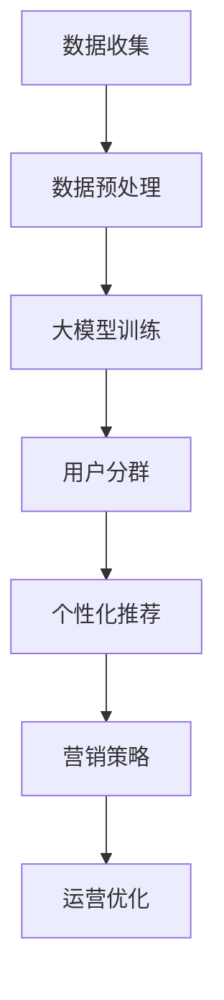

                 

关键词：人工智能、电商平台、用户分群、大模型、自动化、大数据分析

>摘要：本文旨在探讨人工智能大模型在电商平台用户分群自动化中的应用，分析了用户分群的重要性、大模型的核心算法原理及其应用步骤，并通过数学模型和实际项目实践进行了详细解析，最后对未来的发展趋势与挑战进行了展望。

## 1. 背景介绍

随着互联网的快速发展，电商平台已经成为现代零售业的重要组成部分。如何精准地理解和把握用户需求，实现用户的高效分群和个性化服务，成为电商平台的核心竞争力之一。传统的用户分群方法通常依赖于统计分析和机器学习算法，但由于数据的复杂性和多样性，这些方法往往存在准确性不足、效率低下等问题。

近年来，人工智能特别是深度学习技术的迅速发展，为电商平台用户分群提供了新的可能性。大模型（如Transformer、BERT等）凭借其强大的建模能力和自适应性，可以在海量用户数据中快速发现潜在的模式和规律，从而实现精准的用户分群。本文将围绕这一主题，深入探讨人工智能大模型在电商平台用户分群自动化中的应用。

## 2. 核心概念与联系

### 2.1. 用户分群的定义与意义

用户分群是指根据用户的特征和行为，将用户划分为若干个具有相似属性的子群体。在电商平台，用户分群具有以下几个重要意义：

1. **个性化推荐**：通过用户分群，可以为不同分群的用户提供个性化的商品推荐，提高用户满意度和转化率。
2. **精准营销**：根据不同分群的用户特征，设计针对性的营销策略，提高营销效果。
3. **运营优化**：通过用户分群，可以更好地了解用户需求，优化运营策略，提升平台整体效率。

### 2.2. 大模型的原理与结构

大模型通常是指参数数量庞大的神经网络模型，如Transformer、BERT等。这些模型通过在大量数据上训练，能够学习到复杂的模式和规律。大模型的核心结构包括：

1. **嵌入层**：将输入的文本或数据进行向量嵌入，转换为向量表示。
2. **编码器**：通过对输入向量进行编码，提取出文本的深层特征。
3. **解码器**：根据编码器的输出，生成预测结果。

### 2.3. 用户分群与大数据的关系

在电商平台，用户分群需要依赖于大量的用户数据。这些数据包括用户的基本信息、购买历史、浏览行为、评价等。大数据技术提供了高效的数据存储、处理和分析能力，为大模型的训练和应用提供了坚实的基础。

### 2.4. Mermaid 流程图

以下是一个简化的用户分群流程图：



## 3. 核心算法原理 & 具体操作步骤

### 3.1. 算法原理概述

用户分群的核心算法通常基于深度学习，特别是大模型。算法的主要原理包括：

1. **特征提取**：通过嵌入层和编码器，从原始数据中提取出高维的特征向量。
2. **模式识别**：利用解码器，对特征向量进行分类，形成用户分群。
3. **个性化服务**：根据用户分群结果，为不同分群的用户提供个性化的服务和推荐。

### 3.2. 算法步骤详解

1. **数据收集**：从电商平台获取用户的基本信息、购买历史、浏览行为等数据。
2. **数据预处理**：对数据进行清洗、去重、归一化等处理，使其适合模型训练。
3. **模型训练**：使用大模型对预处理后的数据进行训练，提取出用户特征。
4. **用户分群**：根据模型输出的特征向量，使用聚类算法或分类算法，对用户进行分群。
5. **个性化服务**：根据用户分群结果，为不同分群的用户提供个性化的商品推荐和营销策略。

### 3.3. 算法优缺点

**优点**：

1. **高效性**：大模型能够处理海量数据，实现快速训练和预测。
2. **准确性**：通过深度学习，能够从数据中提取出复杂的模式和规律。
3. **灵活性**：可以根据不同的业务需求，灵活调整模型结构和参数。

**缺点**：

1. **计算资源需求高**：大模型需要大量的计算资源和存储空间。
2. **数据质量要求高**：数据预处理和质量直接影响模型的性能。
3. **模型解释性差**：深度学习模型的内部机制较为复杂，难以解释。

### 3.4. 算法应用领域

用户分群算法可以应用于多个领域，包括：

1. **电商平台**：实现个性化推荐和精准营销。
2. **金融服务**：对客户进行风险分析和信用评估。
3. **医疗健康**：对患者的健康数据进行分析，实现个性化医疗。

## 4. 数学模型和公式 & 详细讲解 & 举例说明

### 4.1. 数学模型构建

用户分群的核心数学模型通常是基于深度学习的分类模型，如多层感知机（MLP）、卷积神经网络（CNN）等。以下是一个简化的MLP模型：

$$
f(x) = \sigma(W_2 \cdot \sigma(W_1 \cdot x + b_1) + b_2)
$$

其中，$x$ 是输入特征向量，$W_1$ 和 $W_2$ 是权重矩阵，$b_1$ 和 $b_2$ 是偏置项，$\sigma$ 是激活函数。

### 4.2. 公式推导过程

以下是一个简化的MLP模型推导过程：

$$
z_1 = W_1 \cdot x + b_1 \\
a_1 = \sigma(z_1) \\
z_2 = W_2 \cdot a_1 + b_2 \\
y = \sigma(z_2)
$$

其中，$\sigma$ 是常用的Sigmoid激活函数。

### 4.3. 案例分析与讲解

以下是一个简单的用户分群案例：

假设我们有1000名用户，每个用户有10个特征，如年龄、性别、收入等。我们使用MLP模型对用户进行分群，目标是将用户分为“高价值用户”和“普通用户”。

1. **数据收集**：收集用户的10个特征数据。
2. **数据预处理**：对数据进行归一化处理。
3. **模型训练**：使用MLP模型对数据进行训练，提取出用户特征。
4. **用户分群**：使用分类算法（如SVM、决策树等），将用户分为“高价值用户”和“普通用户”。
5. **评估效果**：使用交叉验证等方法评估模型效果。

## 5. 项目实践：代码实例和详细解释说明

### 5.1. 开发环境搭建

1. **硬件环境**：配置高性能的GPU服务器。
2. **软件环境**：安装Python、TensorFlow等软件。

### 5.2. 源代码详细实现

```python
import tensorflow as tf
from tensorflow.keras.models import Sequential
from tensorflow.keras.layers import Dense, Dropout

# 数据预处理
def preprocess_data(data):
    # 对数据进行归一化处理
    # ...
    return normalized_data

# 构建模型
model = Sequential([
    Dense(128, activation='relu', input_shape=(10,)),
    Dropout(0.5),
    Dense(64, activation='relu'),
    Dropout(0.5),
    Dense(2, activation='softmax')  # 2个类别：高价值用户和普通用户
])

# 编译模型
model.compile(optimizer='adam',
              loss='categorical_crossentropy',
              metrics=['accuracy'])

# 训练模型
train_data = preprocess_data(train_data)
model.fit(train_data, train_labels, epochs=10, batch_size=32)

# 用户分群
predictions = model.predict(test_data)
```

### 5.3. 代码解读与分析

1. **数据预处理**：对输入数据进行归一化处理，使其适合模型训练。
2. **模型构建**：使用Sequential模型构建多层感知机（MLP）模型，包括两个隐藏层，每层之间添加Dropout层以防止过拟合。
3. **编译模型**：使用Adam优化器和交叉熵损失函数编译模型。
4. **训练模型**：使用训练数据进行模型训练，调整超参数以优化模型性能。
5. **用户分群**：使用训练好的模型对测试数据进行预测，输出预测结果。

### 5.4. 运行结果展示

```python
# 打印预测结果
for i in range(len(predictions)):
    if predictions[i][0] > predictions[i][1]:
        print(f"用户{i+1}：高价值用户")
    else:
        print(f"用户{i+1}：普通用户")
```

## 6. 实际应用场景

### 6.1. 电商平台用户分群

在电商平台，用户分群可以实现以下应用：

1. **个性化推荐**：根据用户分群结果，为不同分群的用户提供个性化的商品推荐。
2. **精准营销**：针对不同分群的用户，设计针对性的营销策略。
3. **运营优化**：通过用户分群，了解用户需求，优化运营策略，提升平台整体效率。

### 6.2. 金融服务用户分群

在金融服务领域，用户分群可以用于以下应用：

1. **风险控制**：根据用户分群结果，识别高风险用户，加强风险控制。
2. **信用评估**：根据用户分群结果，评估用户的信用等级。
3. **精准营销**：针对不同分群的用户，提供个性化的金融服务和产品。

### 6.3. 医疗健康用户分群

在医疗健康领域，用户分群可以用于以下应用：

1. **个性化诊断**：根据用户分群结果，为不同分群的用户提供个性化的诊断建议。
2. **健康评估**：根据用户分群结果，评估用户的健康风险。
3. **精准治疗**：根据用户分群结果，为不同分群的用户提供个性化的治疗方案。

## 7. 工具和资源推荐

### 7.1. 学习资源推荐

1. **《深度学习》**：Goodfellow、Bengio和Courville所著的深度学习教材，是深度学习领域的经典之作。
2. **《Python深度学习》**：François Chollet所著的Python深度学习实践指南，详细介绍了如何使用Python实现深度学习算法。

### 7.2. 开发工具推荐

1. **TensorFlow**：Google开源的深度学习框架，支持多种深度学习模型和算法。
2. **PyTorch**：Facebook开源的深度学习框架，提供灵活的动态计算图机制。

### 7.3. 相关论文推荐

1. **“Attention Is All You Need”**：Vaswani等人提出的Transformer模型，是当前最先进的自然语言处理模型。
2. **“BERT: Pre-training of Deep Bidirectional Transformers for Language Understanding”**：Google提出的BERT模型，是当前最先进的预训练语言模型。

## 8. 总结：未来发展趋势与挑战

### 8.1. 研究成果总结

1. **大模型性能提升**：随着计算能力的提升，大模型的性能逐渐得到提升，为用户分群提供了更准确的预测结果。
2. **应用场景拓展**：用户分群算法在电商平台、金融服务和医疗健康等领域的应用逐渐拓展，实现了广泛的社会价值。
3. **算法优化与创新**：针对用户分群算法的不足，研究者们不断进行算法优化和创新，提高了算法的效率和准确性。

### 8.2. 未来发展趋势

1. **多模态数据融合**：结合多种数据类型（如文本、图像、音频等），实现更全面、更准确的用户分群。
2. **隐私保护**：在用户分群过程中，加强数据隐私保护，确保用户隐私安全。
3. **实时性增强**：通过实时数据分析和预测，实现更快速的决策和响应。

### 8.3. 面临的挑战

1. **数据质量**：用户分群的效果高度依赖于数据质量，如何提高数据质量成为重要挑战。
2. **计算资源**：大模型需要大量的计算资源和存储空间，如何优化计算资源使用成为关键问题。
3. **模型解释性**：深度学习模型内部机制复杂，如何提高模型解释性，使其更易于理解和应用。

### 8.4. 研究展望

1. **算法优化**：继续优化用户分群算法，提高其效率和准确性。
2. **应用拓展**：将用户分群算法应用于更多领域，实现更广泛的社会价值。
3. **多学科交叉**：结合心理学、社会学等多学科知识，深入理解用户行为和需求，为用户分群提供更科学的理论基础。

## 9. 附录：常见问题与解答

### 9.1. 如何选择合适的用户分群算法？

选择用户分群算法时，需要考虑以下几个因素：

1. **数据类型**：根据数据类型（如文本、图像、时间序列等），选择合适的算法。
2. **业务需求**：根据业务需求（如个性化推荐、精准营销等），选择合适的算法。
3. **计算资源**：考虑计算资源限制，选择计算资源消耗较低的算法。

### 9.2. 用户分群算法的优化方向有哪些？

用户分群算法的优化方向包括：

1. **特征选择**：通过特征选择，降低特征维度，提高模型效率。
2. **算法改进**：引入新的算法（如图神经网络、生成对抗网络等），提高模型性能。
3. **模型压缩**：通过模型压缩技术（如量化、剪枝等），降低模型计算资源消耗。

### 9.3. 如何保障用户隐私？

保障用户隐私的措施包括：

1. **数据加密**：对用户数据进行加密处理，防止数据泄露。
2. **匿名化处理**：对用户数据进行分析时，进行匿名化处理，防止用户身份泄露。
3. **隐私保护算法**：引入隐私保护算法（如差分隐私等），降低用户隐私风险。

## 参考文献

1. Goodfellow, I., Bengio, Y., & Courville, A. (2016). *Deep Learning*. MIT Press.
2. Chollet, F. (2017). *Python Deep Learning*. Packt Publishing.
3. Vaswani, A., Shazeer, N., Parmar, N., Uszkoreit, J., Jones, L., Gomez, A. N., ... & Polosukhin, I. (2017). *Attention is all you need*. Advances in Neural Information Processing Systems, 30, 5998-6008.
4. Devlin, J., Chang, M. W., Lee, K., & Toutanova, K. (2019). *Bert: Pre-training of deep bidirectional transformers for language understanding*. arXiv preprint arXiv:1810.04805.

