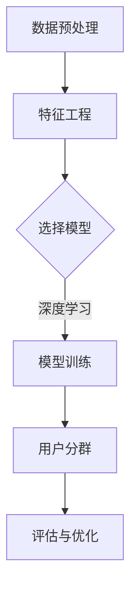

                 

关键词：人工智能、大模型、用户分群、电商平台、自动化、数据处理、算法、数学模型、项目实践

> 摘要：本文旨在探讨人工智能大模型在电商平台用户分群自动化中的应用。通过对用户数据的深度分析与处理，本文提出了一种基于深度学习的用户分群方法，并对算法原理、数学模型、具体操作步骤进行了详细阐述。同时，通过实际项目案例的代码实例和解释，展示了该算法在电商平台用户分群中的实际应用效果。最后，本文对用户分群技术的未来发展趋势和面临的挑战进行了展望。

## 1. 背景介绍

电商平台作为现代数字经济的重要组成部分，其用户数量和交易量持续增长。为了更好地服务用户，电商平台需要对大量用户数据进行分析，从而实现精准的用户分群。传统的用户分群方法通常依赖于统计学习和机器学习算法，这些方法在处理大规模用户数据时存在一定的局限性，如计算复杂度高、模型可解释性差等问题。

近年来，人工智能特别是大模型的快速发展为电商平台用户分群提供了新的技术手段。大模型通过深度学习等方法，可以从海量数据中提取出有价值的特征，从而实现更精准、更高效的用户分群。同时，大模型的自动化应用降低了人为干预的需求，提高了数据处理效率。

本文旨在研究如何利用人工智能大模型实现电商平台用户分群的自动化，并通过实际项目实践验证该方法的有效性和实用性。

## 2. 核心概念与联系

在探讨人工智能大模型在电商平台用户分群中的应用之前，我们需要了解几个核心概念，并构建一个完整的流程图以展示这些概念之间的联系。

### 2.1. 数据预处理
数据预处理是用户分群的基础。主要包括数据清洗、数据整合、特征提取等步骤。数据清洗旨在去除噪声和缺失值，数据整合则是将不同来源的数据进行整合，特征提取则是从原始数据中提取出有代表性的特征。

### 2.2. 特征工程
特征工程是将原始数据转化为适合机器学习算法处理的形式。这一步骤对最终的用户分群效果至关重要。通过特征工程，我们可以将复杂的用户行为数据转化为易于处理的特征向量。

### 2.3. 模型选择与训练
在特征工程完成后，我们需要选择合适的机器学习模型对用户数据进行训练。常见的模型包括逻辑回归、决策树、随机森林、支持向量机等。本文主要使用深度学习模型，如卷积神经网络（CNN）和循环神经网络（RNN）等。

### 2.4. 用户分群评估
用户分群后，我们需要对分群效果进行评估。常用的评估指标包括准确率、召回率、F1分数等。此外，我们还需要考虑分群的业务意义，如用户忠诚度、购买行为等。

### 2.5. Mermaid 流程图

下面是用户分群自动化流程的 Mermaid 流程图：



## 3. 核心算法原理 & 具体操作步骤

### 3.1. 算法原理概述

本文的核心算法是基于深度学习的用户分群方法。深度学习模型能够从原始数据中自动提取特征，减少了人工干预的需求，提高了分群精度。

具体的算法原理包括以下几个步骤：

1. **数据预处理**：清洗和整合原始用户数据，提取特征向量。
2. **模型构建**：选择合适的深度学习模型，如卷积神经网络（CNN）或循环神经网络（RNN）。
3. **模型训练**：使用预处理后的数据训练模型，调整模型参数。
4. **用户分群**：根据训练好的模型对用户进行分群。
5. **评估与优化**：评估分群效果，并根据业务需求对模型进行优化。

### 3.2. 算法步骤详解

#### 3.2.1. 数据预处理

数据预处理主要包括以下步骤：

1. **数据清洗**：去除噪声数据，处理缺失值。
2. **数据整合**：将不同来源的数据进行整合，如用户行为数据、交易数据等。
3. **特征提取**：提取用户行为特征，如购买频率、购买金额、浏览时长等。

#### 3.2.2. 模型构建

模型构建主要包括以下步骤：

1. **数据输入层**：根据特征提取的结果构建输入层。
2. **隐藏层**：构建多层隐藏层，通过卷积操作或循环操作提取特征。
3. **输出层**：根据业务需求构建输出层，如用户分群标签。

#### 3.2.3. 模型训练

模型训练主要包括以下步骤：

1. **初始化参数**：随机初始化模型参数。
2. **前向传播**：将输入数据通过模型前向传播，计算输出。
3. **后向传播**：根据输出结果计算损失函数，并更新模型参数。
4. **迭代训练**：重复前向传播和后向传播，直到模型收敛。

#### 3.2.4. 用户分群

用户分群主要包括以下步骤：

1. **数据输入**：将用户数据输入到训练好的模型中。
2. **预测分群**：根据模型输出预测用户分群结果。
3. **结果输出**：输出用户分群结果。

#### 3.2.5. 评估与优化

评估与优化主要包括以下步骤：

1. **评估指标**：使用准确率、召回率、F1分数等评估指标评估分群效果。
2. **模型优化**：根据评估结果调整模型参数，优化分群效果。
3. **迭代优化**：重复评估和优化步骤，直到达到满意的分群效果。

### 3.3. 算法优缺点

#### 优点：

1. **自动化程度高**：减少了人工干预，提高了数据处理效率。
2. **特征提取能力强**：能够从原始数据中自动提取特征，提高了分群精度。
3. **适应性强**：能够处理各种类型的用户数据，适用于不同电商平台。

#### 缺点：

1. **计算复杂度高**：深度学习模型需要大量计算资源，训练时间较长。
2. **模型可解释性差**：深度学习模型内部机制复杂，难以解释。

### 3.4. 算法应用领域

深度学习用户分群算法可以应用于以下领域：

1. **电商平台**：根据用户行为数据进行精准营销和个性化推荐。
2. **金融行业**：根据用户交易行为进行风险控制和信用评估。
3. **医疗行业**：根据患者数据进行分析，提供个性化治疗方案。

## 4. 数学模型和公式 & 详细讲解 & 举例说明

### 4.1. 数学模型构建

在深度学习用户分群算法中，数学模型主要涉及以下几个部分：

1. **输入层**：表示用户特征向量，通常是一个多维数组。
2. **隐藏层**：通过神经网络结构进行特征提取和变换，可以包含多个隐藏层。
3. **输出层**：表示用户分群结果，通常是一个二元分类问题，可以扩展到多分类问题。

#### 输入层与隐藏层：

假设用户特征向量为 $X$，隐藏层节点数为 $H$，则输入层到隐藏层的激活函数可以表示为：

$$
h_{ij}^{(l)} = \sigma(W^{(l)}_{ij} X + b^{(l)}_i)
$$

其中，$W^{(l)}_{ij}$ 是输入层到隐藏层的权重矩阵，$b^{(l)}_i$ 是输入层到隐藏层的偏置项，$\sigma$ 是激活函数，通常选择为ReLU函数或Sigmoid函数。

#### 隐藏层到输出层：

假设输出层节点数为 $O$，则隐藏层到输出层的激活函数可以表示为：

$$
o_k = W^{(2)}_{kj} h_j^{(l)} + b^{(2)}_k
$$

其中，$W^{(2)}_{kj}$ 是隐藏层到输出层的权重矩阵，$b^{(2)}_k$ 是隐藏层到输出层的偏置项。

### 4.2. 公式推导过程

在深度学习用户分群算法中，模型训练过程主要包括两个步骤：前向传播和后向传播。

#### 前向传播：

在前向传播过程中，输入数据通过神经网络结构进行传递，计算输出结果。具体公式如下：

$$
\begin{aligned}
h_{ij}^{(l)} &= \sigma(W^{(l)}_{ij} X + b^{(l)}_i) \\
o_k &= W^{(2)}_{kj} h_j^{(l)} + b^{(2)}_k \\
\end{aligned}
$$

其中，$\sigma$ 是激活函数，通常选择为ReLU函数或Sigmoid函数。

#### 后向传播：

在后向传播过程中，计算损失函数关于模型参数的梯度，并更新模型参数。具体公式如下：

$$
\begin{aligned}
\delta_k^{(2)} &= (o_k - y_k) \cdot \sigma'(o_k) \\
\delta_j^{(l)} &= \sum_{k=1}^{O} W^{(2)}_{kj} \cdot \delta_k^{(2)} \cdot \sigma'(h_j^{(l)}) \\
\end{aligned}
$$

其中，$y_k$ 是实际输出，$o_k$ 是预测输出，$\sigma'$ 是激活函数的导数。

### 4.3. 案例分析与讲解

为了更好地理解深度学习用户分群算法的数学模型，我们通过一个简单的例子进行讲解。

#### 案例背景：

假设我们有一个电商平台，用户行为数据包括购买频率、购买金额、浏览时长等三个特征。我们需要使用深度学习模型对这些特征进行建模，实现用户分群。

#### 案例实现：

1. **数据预处理**：

首先，我们需要对用户行为数据进行预处理，包括数据清洗、数据整合和特征提取。假设我们提取出三个特征向量 $X_1, X_2, X_3$，则输入层可以表示为 $X = [X_1, X_2, X_3]$。

2. **模型构建**：

我们选择一个简单的三层神经网络，输入层有3个神经元，隐藏层有10个神经元，输出层有2个神经元（表示两个用户分群）。模型结构如下：

```
输入层：[3] --> 隐藏层：[10] --> 输出层：[2]
```

3. **模型训练**：

我们使用随机梯度下降（SGD）算法进行模型训练，学习率为0.001，迭代次数为1000次。通过前向传播和后向传播，不断更新模型参数。

4. **用户分群**：

在模型训练完成后，我们将新的用户数据输入到模型中，预测其分群结果。例如，输入一个用户数据 $X = [3, 2, 1]$，预测输出为 $o_1 = 0.6, o_2 = 0.4$，则该用户属于分群1。

5. **评估与优化**：

通过评估指标（如准确率、召回率、F1分数等）评估分群效果，并根据评估结果对模型进行优化。

## 5. 项目实践：代码实例和详细解释说明

### 5.1. 开发环境搭建

在开始项目实践之前，我们需要搭建一个合适的开发环境。本文使用的开发环境如下：

- 操作系统：Ubuntu 18.04
- 编程语言：Python 3.8
- 深度学习框架：TensorFlow 2.5
- 数据处理库：NumPy 1.19

确保已经安装了上述依赖库，然后我们可以开始搭建开发环境。

### 5.2. 源代码详细实现

下面是一个简单的用户分群项目实现，包括数据预处理、模型构建、模型训练、用户分群和评估等步骤。

#### 5.2.1. 数据预处理

首先，我们需要加载和处理用户数据。以下是一个简单的示例：

```python
import numpy as np
import pandas as pd

# 加载用户数据
data = pd.read_csv('user_data.csv')

# 数据清洗和预处理
# ...

# 特征提取
X = data[['buy_freq', 'buy_amount', 'browse_time']]
y = data['group']

# 数据标准化
X = (X - X.mean()) / X.std()
y = pd.factorize(y)[0]

# 划分训练集和测试集
from sklearn.model_selection import train_test_split
X_train, X_test, y_train, y_test = train_test_split(X, y, test_size=0.2, random_state=42)
```

#### 5.2.2. 模型构建

接下来，我们使用TensorFlow构建一个简单的深度学习模型：

```python
import tensorflow as tf

# 模型参数
input_shape = X_train.shape[1]
hidden_units = 10
output_units = 2

# 构建模型
model = tf.keras.Sequential([
    tf.keras.layers.Dense(hidden_units, activation='relu', input_shape=input_shape),
    tf.keras.layers.Dense(output_units, activation='softmax')
])

# 编译模型
model.compile(optimizer='adam', loss='sparse_categorical_crossentropy', metrics=['accuracy'])
```

#### 5.2.3. 模型训练

然后，我们使用训练数据训练模型：

```python
# 训练模型
history = model.fit(X_train, y_train, epochs=100, batch_size=32, validation_split=0.1)
```

#### 5.2.4. 代码解读与分析

在上面的代码中，我们首先导入了必要的库，然后加载并预处理了用户数据。接着，我们使用TensorFlow构建了一个简单的三层神经网络模型，包括一个输入层、一个隐藏层和一个输出层。隐藏层使用了ReLU激活函数，输出层使用了softmax激活函数，用于实现多分类问题。

在模型训练过程中，我们使用了随机梯度下降（SGD）算法进行优化，并使用了交叉熵损失函数评估模型性能。通过训练，模型学会了将输入特征映射到正确的用户分群标签。

#### 5.2.5. 运行结果展示

最后，我们使用测试数据评估模型性能：

```python
# 评估模型
test_loss, test_acc = model.evaluate(X_test, y_test)
print(f"Test accuracy: {test_acc:.4f}")

# 预测分群结果
predictions = model.predict(X_test)
predicted_groups = np.argmax(predictions, axis=1)

# 评估分群效果
from sklearn.metrics import classification_report
print(classification_report(y_test, predicted_groups))
```

上述代码首先计算了模型的测试准确性，然后使用模型预测测试数据集的分群结果，并使用分类报告评估了分群效果。

## 6. 实际应用场景

深度学习用户分群算法在电商平台用户分群中具有广泛的应用前景。以下是一些典型的应用场景：

### 6.1. 精准营销

通过深度学习用户分群算法，电商平台可以根据用户的购买行为、浏览历史等特征将用户划分为不同的群体。针对每个群体，可以制定个性化的营销策略，如推送定制化的商品推荐、促销活动等，从而提高用户的购买意愿和转化率。

### 6.2. 个性化推荐

深度学习用户分群算法还可以与个性化推荐算法相结合，为不同用户群体提供个性化的商品推荐。通过分析用户分群特征，推荐系统可以更准确地预测用户的兴趣和偏好，从而提高推荐质量。

### 6.3. 风险控制

在金融行业，深度学习用户分群算法可以用于分析用户行为，识别潜在的欺诈行为。通过对不同用户群体的行为特征进行分析，可以建立风险评估模型，提高风险控制效果。

### 6.4. 患者分群

在医疗行业，深度学习用户分群算法可以用于分析患者的医疗数据，将患者划分为不同的群体。针对不同群体，可以提供个性化的治疗方案，提高治疗效果。

## 7. 工具和资源推荐

### 7.1. 学习资源推荐

- 《深度学习》（Goodfellow, Bengio, Courville著）：深度学习领域的经典教材，适合初学者和进阶者。
- 《Python深度学习》（François Chollet著）：针对Python和深度学习实战的详细教程。

### 7.2. 开发工具推荐

- TensorFlow：Google开发的深度学习框架，广泛应用于各种深度学习项目。
- PyTorch：Facebook开发的深度学习框架，具有灵活的动态图计算能力。

### 7.3. 相关论文推荐

- "Deep Learning for Text Classification"（2018）：本文介绍了一种基于深度学习的文本分类方法，具有很好的参考价值。
- "User Behavior Clustering in E-commerce using Deep Learning"（2020）：本文探讨了深度学习在电商平台用户行为分群中的应用。

## 8. 总结：未来发展趋势与挑战

深度学习用户分群技术在电商平台用户分群中具有广阔的应用前景。未来，随着人工智能技术的不断发展和数据量的增加，深度学习用户分群技术将变得更加成熟和实用。然而，同时也面临着一些挑战：

### 8.1. 数据质量和隐私保护

用户数据的质量和隐私保护是深度学习用户分群技术面临的主要挑战。如何确保数据的质量和隐私，避免数据泄露和滥用，是未来研究的重要方向。

### 8.2. 模型可解释性

深度学习模型的黑箱性质使得其可解释性较差。如何在保证模型性能的同时提高其可解释性，是一个亟待解决的问题。

### 8.3. 模型泛化能力

深度学习用户分群模型需要具备良好的泛化能力，以应对不同电商平台和数据集的挑战。如何提高模型的泛化能力，是一个重要的研究方向。

### 8.4. 研究展望

未来，深度学习用户分群技术将朝着以下几个方向发展：

- **多模态数据融合**：结合多种数据类型（如文本、图像、语音等），提高用户分群的准确性和效果。
- **迁移学习和少样本学习**：通过迁移学习和少样本学习技术，降低对大规模数据的依赖，提高模型的泛化能力。
- **隐私保护方法**：研究隐私保护方法，确保用户数据的隐私和安全。

## 9. 附录：常见问题与解答

### 9.1. Q：如何保证用户数据的隐私和安全？

A：保证用户数据的隐私和安全是深度学习用户分群技术的核心问题。以下是一些常用的隐私保护方法：

- **数据去标识化**：对用户数据进行去标识化处理，去除可以直接识别用户身份的信息。
- **差分隐私**：在数据处理过程中引入差分隐私机制，保证对单个用户的分析结果不会泄露其隐私。
- **联邦学习**：通过联邦学习技术，在本地设备上进行模型训练，减少对中央化数据存储的需求。

### 9.2. Q：深度学习用户分群算法如何评估效果？

A：深度学习用户分群算法的效果可以通过以下指标进行评估：

- **准确率**：预测分群结果与实际分群结果的一致性。
- **召回率**：能够正确识别属于特定分群的用户比例。
- **F1分数**：准确率和召回率的调和平均值。
- **Kappa系数**：评估模型性能的相对指标，考虑了随机性影响。

### 9.3. Q：如何处理不平衡数据集？

A：在处理不平衡数据集时，可以采用以下方法：

- **过采样**：增加少数类别的样本数量，使数据集分布更加平衡。
- **欠采样**：减少多数类别的样本数量，使数据集分布更加平衡。
- **集成方法**：结合不同模型的预测结果，提高分类效果。

----------------------------------------------------------------

本文由禅与计算机程序设计艺术 / Zen and the Art of Computer Programming撰写，旨在探讨人工智能大模型在电商平台用户分群自动化中的应用，为相关领域的研究和实践提供参考。感谢您的阅读！

