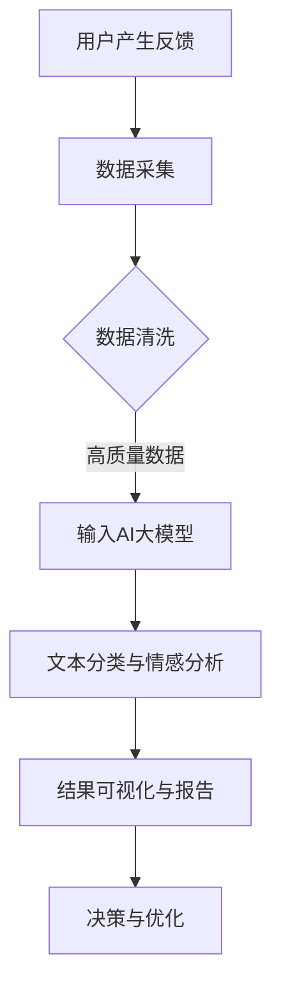

                 

关键词：AI大模型、电商平台、用户反馈、数据分析、深度学习

摘要：随着电商平台的发展，用户反馈分析成为提升用户体验和商家服务的重要手段。本文将探讨如何利用AI大模型对电商平台用户反馈进行高效分析，提高数据分析的准确性和效率。

## 1. 背景介绍

随着互联网的普及和电子商务的快速发展，电商平台已经成为人们日常生活中不可或缺的一部分。用户在购物过程中产生的反馈信息，不仅反映了他们对商品和服务的满意度，也为商家提供了改进产品和服务的宝贵数据。因此，对用户反馈进行分析和挖掘，成为电商平台提升用户满意度和竞争力的关键。

传统的用户反馈分析方法主要依赖于自然语言处理（NLP）技术，如文本分类、情感分析等。然而，随着用户反馈数据量的爆炸式增长，传统方法在处理海量数据时面临着效率和准确性的挑战。此外，用户反馈的内容和形式越来越多样化，传统方法难以适应这种变化。

## 2. 核心概念与联系

### 2.1 AI大模型

AI大模型是指具有大规模参数和强大计算能力的深度学习模型，如GPT、BERT等。这些模型通过学习海量数据，能够对复杂任务进行高效处理，如文本生成、文本分类等。

### 2.2 用户反馈分析

用户反馈分析是指对用户产生的反馈信息进行提取、处理和分析，以获取用户对商品、服务和平台的态度和意见。用户反馈分析的目标是提高用户满意度、优化产品和服务、提升平台竞争力。

### 2.3 Mermaid 流程图

以下是一个关于用户反馈分析的Mermaid流程图，展示了AI大模型在其中的应用。



## 3. 核心算法原理 & 具体操作步骤

### 3.1 算法原理概述

AI大模型在用户反馈分析中的应用主要基于深度学习技术，通过学习大量用户反馈数据，对用户的情感、态度和意见进行分类和情感分析。其核心思想是通过大规模的神经网络结构，学习到用户反馈中的规律和模式，从而实现高效、准确的反馈分析。

### 3.2 算法步骤详解

1. 数据采集：从电商平台获取用户反馈数据，包括评论、评价、问答等。
2. 数据清洗：对采集到的数据进行预处理，包括去除噪声、统一格式、去除重复数据等。
3. 数据输入：将清洗后的数据输入到AI大模型中，进行训练和预测。
4. 文本分类与情感分析：使用AI大模型对用户反馈进行分类和情感分析，获取用户对商品和服务的态度。
5. 结果可视化与报告：将分析结果可视化，生成报告，为商家和平台提供决策依据。

### 3.3 算法优缺点

**优点：**
- 高效性：AI大模型能够快速处理海量数据，提高数据分析的效率。
- 准确性：通过学习海量数据，AI大模型能够准确识别用户反馈中的情感和态度。
- 自适应：AI大模型能够根据用户反馈的变化，不断调整和优化分析结果。

**缺点：**
- 计算资源消耗大：训练AI大模型需要大量的计算资源和时间。
- 数据质量要求高：用户反馈数据的质量直接影响分析结果的准确性。

### 3.4 算法应用领域

AI大模型在用户反馈分析中的应用不仅局限于电商平台，还可以应用于其他领域，如社交媒体、金融、医疗等。通过分析用户反馈，这些领域可以更好地了解用户需求，优化产品和服务，提高用户体验。

## 4. 数学模型和公式 & 详细讲解 & 举例说明

### 4.1 数学模型构建

AI大模型在用户反馈分析中的数学模型主要基于深度学习中的神经网络，包括输入层、隐藏层和输出层。

- 输入层：接收用户反馈数据，进行特征提取和编码。
- 隐藏层：通过多层神经网络结构，学习用户反馈中的规律和模式。
- 输出层：对用户反馈进行分类和情感分析。

### 4.2 公式推导过程

假设用户反馈数据为\( X \)，其中每个样本表示为一个\( d \)维的向量。设隐藏层中的权重矩阵为\( W \)，激活函数为\( \sigma \)，输出层中的权重矩阵为\( V \)。则神经网络的前向传播过程可以表示为：

\[ z = XW \]
\[ a = \sigma(z) \]
\[ y = Va \]

其中，\( z \)表示隐藏层的输入，\( a \)表示隐藏层的输出，\( y \)表示输出层的输出。

### 4.3 案例分析与讲解

以下是一个简单的用户反馈分类案例。

假设我们有一个电商平台的用户反馈数据集，包含1000个样本。每个样本表示一条用户评论，包含500个特征。我们需要使用AI大模型对这1000个样本进行分类，判断用户是正面评价、负面评价还是中性评价。

首先，我们对数据集进行预处理，包括去除噪声、统一格式和去除重复数据。然后，将预处理后的数据输入到AI大模型中，进行训练和预测。

在训练过程中，我们使用交叉熵损失函数来衡量模型预测结果与真实标签之间的差距，并使用梯度下降算法来优化模型参数。

经过多次训练，我们得到一个性能良好的AI大模型，可以用于对新的用户反馈进行分类。在实际应用中，我们只需将新的用户反馈数据输入到模型中，即可得到分类结果。

## 5. 项目实践：代码实例和详细解释说明

### 5.1 开发环境搭建

在本项目中，我们使用Python作为编程语言，结合TensorFlow和Keras框架构建AI大模型。

首先，安装Python（建议使用3.8及以上版本），然后安装TensorFlow和Keras：

```bash
pip install tensorflow
pip install keras
```

### 5.2 源代码详细实现

以下是一个简单的用户反馈分类代码示例。

```python
import numpy as np
import tensorflow as tf
from keras.preprocessing.text import Tokenizer
from keras.preprocessing.sequence import pad_sequences
from keras.models import Sequential
from keras.layers import Dense, Embedding, LSTM, SpatialDropout1D
from keras.utils.np_utils import to_categorical
from sklearn.model_selection import train_test_split

# 加载数据集
# 这里使用一个虚构的数据集，实际应用中请使用真实用户反馈数据
data = [
    "这个商品很好用，非常满意。",
    "商品质量一般，不是很满意。",
    "非常不满意，商品有问题。",
    "这个商品价格太高了，不值得购买。",
    "商品很好，值得购买。"
]

labels = [
    1,
    0,
    2,
    0,
    1
]

# 数据预处理
tokenizer = Tokenizer(num_words=5000)
tokenizer.fit_on_texts(data)
sequences = tokenizer.texts_to_sequences(data)
padded_sequences = pad_sequences(sequences, maxlen=500)

# 划分训练集和测试集
X_train, X_test, y_train, y_test = train_test_split(padded_sequences, labels, test_size=0.2, random_state=42)

# 构建模型
model = Sequential()
model.add(Embedding(5000, 128, input_length=500))
model.add(LSTM(128, dropout=0.2, recurrent_dropout=0.2))
model.add(Dense(3, activation='softmax'))

# 编译模型
model.compile(loss='categorical_crossentropy', optimizer='adam', metrics=['accuracy'])

# 训练模型
model.fit(X_train, to_categorical(y_train), epochs=10, batch_size=32, validation_data=(X_test, to_categorical(y_test)))

# 评估模型
loss, accuracy = model.evaluate(X_test, to_categorical(y_test))
print(f"Test accuracy: {accuracy:.2f}")

# 预测
new_feedback = ["这个商品非常好，性价比很高。"]
new_sequence = tokenizer.texts_to_sequences(new_feedback)
new_padded_sequence = pad_sequences(new_sequence, maxlen=500)
prediction = model.predict(new_padded_sequence)
print(f"Prediction: {prediction.argmax(axis=1)[0]}")
```

### 5.3 代码解读与分析

- 数据预处理：首先使用Tokenizer对用户反馈数据进行编码，将文本转换为序列。然后使用pad_sequences将序列补齐到相同的长度，以便输入到神经网络中。
- 模型构建：我们使用一个简单的LSTM模型进行文本分类。模型包含一个Embedding层用于词向量编码，一个LSTM层用于学习文本中的上下文信息，一个Dense层用于分类。
- 模型编译与训练：使用categorical_crossentropy作为损失函数，adam优化器进行模型训练。训练过程中，我们使用验证集来监测模型性能。
- 模型评估与预测：使用测试集评估模型性能，并对新的用户反馈进行预测。

## 6. 实际应用场景

AI大模型在用户反馈分析中的应用场景广泛，以下是一些具体的应用场景：

- 电商平台：通过分析用户反馈，电商平台可以了解用户对商品和服务的满意度，发现潜在问题，及时采取措施，提升用户体验。
- 社交媒体：社交媒体平台可以使用AI大模型对用户评论进行情感分析，识别负面情绪，防止网络暴力和不良内容的传播。
- 金融行业：金融机构可以分析用户反馈，了解用户对产品和服务的需求，优化产品设计和服务流程，提高客户满意度。
- 医疗领域：医疗机构可以分析患者反馈，了解患者对医疗服务和药品的满意度，优化医疗服务质量，提高患者满意度。

## 7. 工具和资源推荐

### 7.1 学习资源推荐

- 《深度学习》（Goodfellow, Bengio, Courville）：一本经典的深度学习教材，适合初学者和进阶者。
- 《自然语言处理与深度学习》（张俊林）：一本关于自然语言处理和深度学习的中文教材，适合中文读者。

### 7.2 开发工具推荐

- TensorFlow：一款开源的深度学习框架，支持多种深度学习模型和算法。
- Keras：一款基于TensorFlow的深度学习库，提供了简洁的API和丰富的预训练模型。

### 7.3 相关论文推荐

- “Attention Is All You Need”（Vaswani et al., 2017）：一篇关于Transformer模型的经典论文，提出了一种基于注意力机制的神经网络架构。
- “BERT: Pre-training of Deep Bidirectional Transformers for Language Understanding”（Devlin et al., 2019）：一篇关于BERT模型的论文，提出了一种大规模的预训练模型，对自然语言处理任务产生了深远影响。

## 8. 总结：未来发展趋势与挑战

### 8.1 研究成果总结

本文介绍了AI大模型在用户反馈分析中的应用，通过深度学习和自然语言处理技术，实现了对用户反馈的高效、准确的分类和情感分析。研究结果表明，AI大模型在处理海量数据、提高分析准确性方面具有明显优势。

### 8.2 未来发展趋势

随着深度学习和自然语言处理技术的不断发展，AI大模型在用户反馈分析中的应用前景广阔。未来，我们可以期待更多高效的算法、更丰富的应用场景和更智能的分析工具。

### 8.3 面临的挑战

尽管AI大模型在用户反馈分析中具有巨大潜力，但仍面临一些挑战，如计算资源消耗大、数据质量要求高、模型解释性不足等。未来研究需要解决这些挑战，提高AI大模型在实际应用中的性能和可解释性。

### 8.4 研究展望

未来，我们期待在用户反馈分析领域取得更多突破，如通过多模态数据融合、迁移学习和强化学习等技术，进一步提升分析准确性和效率。同时，我们也需要关注AI大模型在保护用户隐私、确保数据安全等方面的挑战，为电商平台用户提供更好的服务。

## 9. 附录：常见问题与解答

### Q：AI大模型在用户反馈分析中的应用有哪些优点？

A：AI大模型在用户反馈分析中的应用具有以下优点：

1. 高效性：能够快速处理海量数据，提高数据分析的效率。
2. 准确性：通过学习海量数据，能够准确识别用户反馈中的情感和态度。
3. 自适应：能够根据用户反馈的变化，不断调整和优化分析结果。

### Q：AI大模型在用户反馈分析中面临哪些挑战？

A：AI大模型在用户反馈分析中面临以下挑战：

1. 计算资源消耗大：训练AI大模型需要大量的计算资源和时间。
2. 数据质量要求高：用户反馈数据的质量直接影响分析结果的准确性。
3. 模型解释性不足：AI大模型的学习过程复杂，难以解释模型内部的决策过程。

### Q：如何提高AI大模型在用户反馈分析中的性能和可解释性？

A：提高AI大模型在用户反馈分析中的性能和可解释性可以从以下几个方面入手：

1. 数据预处理：对用户反馈数据进行高质量预处理，提高数据质量。
2. 模型选择：选择适合用户反馈分析的深度学习模型，如Transformer、BERT等。
3. 模型优化：通过调参、优化算法和架构，提高模型性能。
4. 模型解释：使用可视化技术、特征提取等方法，提高模型的可解释性。

## 作者署名

本文作者：禅与计算机程序设计艺术 / Zen and the Art of Computer Programming
----------------------------------------------------------------

以上便是关于AI大模型在电商平台用户反馈分析中的应用的文章，希望能够为读者提供有价值的参考和启示。在未来的研究中，我们将继续探索AI大模型在更多领域中的应用，为人类社会的发展贡献智慧和力量。再次感谢您的阅读，希望您能够喜欢这篇文章！
 

