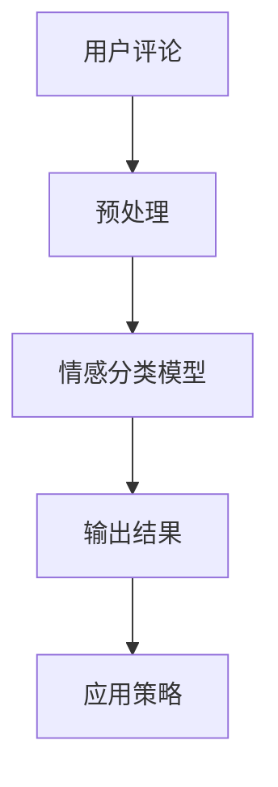

                 

关键词：AI大模型，电商平台，用户情感分析，自然语言处理，深度学习，情感分类，用户反馈，商业智能。

> 摘要：本文深入探讨了人工智能大模型在电商平台用户情感分析中的应用。通过解析情感分析的背景、核心概念、算法原理、数学模型、具体实现，以及实际应用案例，本文揭示了AI大模型在电商平台中的价值，并对未来发展趋势和挑战进行了展望。

## 1. 背景介绍

随着互联网的迅猛发展和电子商务的崛起，电商平台成为人们日常生活中不可或缺的一部分。用户在电商平台上的购物体验不仅包括产品选择、价格比较，更重要的是基于对商品描述、用户评价和互动的感知。这种感知很大程度上决定了用户对电商平台的信任度和忠诚度。因此，电商平台越来越重视对用户反馈的情感分析。

情感分析是自然语言处理（NLP）的一个重要分支，旨在理解和提取文本中的情感极性。在电商领域，情感分析可以帮助平台：

- 提高产品服务质量
- 预测用户行为
- 优化营销策略
- 提升用户体验

传统情感分析方法通常基于规则和统计模型，但它们在处理复杂、多变的用户评论时存在局限性。近年来，随着深度学习技术的不断发展，特别是大模型的引入，情感分析取得了显著的进展。大模型如BERT、GPT等，以其强大的表征能力和泛化能力，为电商平台用户情感分析带来了新的机遇。

## 2. 核心概念与联系

### 2.1. 情感分析的基本概念

情感分析，也称为意见挖掘或情感极性分类，是指通过自然语言处理技术识别文本中所表达的情感倾向，通常分为正面、负面和中性三种。情感分析的关键在于理解语言的情感含义，这涉及到词汇的情感极性、语境分析和情感强度等。

### 2.2. AI大模型的核心概念

AI大模型是指具有数十亿参数的深度学习模型，如Transformer架构下的BERT、GPT等。这些模型通过在海量数据上进行预训练，可以捕捉到语言中的复杂模式和结构，从而在多种NLP任务中表现出色。

### 2.3. 情感分析与AI大模型的关系

AI大模型通过其强大的表征能力，能够对用户的文本评论进行深入的情感分析。具体来说，AI大模型在情感分析中的作用包括：

- 预训练：通过在大规模文本数据集上预训练，模型可以自动学习到情感极性分类的规则。
- 特征提取：模型能够提取文本中的深层特征，从而提高分类的准确性。
- 泛化能力：大模型具有很好的泛化能力，可以处理不同领域、不同风格的文本。

### 2.4. Mermaid 流程图

下面是一个简单的Mermaid流程图，展示了一个典型的用户情感分析流程：



## 3. 核心算法原理 & 具体操作步骤

### 3.1. 算法原理概述

AI大模型在情感分析中的核心原理是深度学习。深度学习模型通过层层神经网络的传递，可以从大量数据中自动学习特征，并在分类任务中取得良好的性能。对于情感分析，深度学习模型通常采用以下步骤：

1. 预处理：对文本进行分词、去停用词、词向量化等预处理操作。
2. 特征提取：利用神经网络提取文本的深层特征。
3. 情感分类：将提取的特征输入到分类器，进行情感极性分类。

### 3.2. 算法步骤详解

1. **数据收集与预处理**：从电商平台获取用户评论数据，进行数据清洗、去噪、去停用词等预处理操作。

2. **词向量化**：将预处理后的文本转换为词向量表示。可以使用预训练的词向量库，如GloVe、Word2Vec等，或者使用BERT等模型自带的词向量。

3. **模型训练**：使用深度学习框架（如TensorFlow或PyTorch）训练情感分类模型。常用的模型有CNN、RNN、BERT等。

4. **模型评估**：使用交叉验证等方法评估模型性能，选择最优模型。

5. **应用模型**：将训练好的模型应用于实际用户评论数据，进行情感分析，得到情感分类结果。

### 3.3. 算法优缺点

**优点**：

- **强大的表征能力**：大模型可以提取文本的深层特征，提高分类准确性。
- **良好的泛化能力**：大模型在多种任务和领域上都有很好的表现，无需针对特定领域重新训练。
- **自动化特征提取**：减少了人工特征工程的工作量。

**缺点**：

- **计算资源需求大**：大模型需要大量的计算资源进行训练。
- **数据需求量大**：预训练需要大规模的文本数据集。
- **训练时间较长**：大模型训练时间较长，对实时性要求高的应用可能不适用。

### 3.4. 算法应用领域

AI大模型在情感分析中的应用不仅限于电商平台，还可以广泛应用于以下领域：

- 社交媒体分析：识别用户在社交媒体上的情感倾向。
- 品牌监测：监控品牌在市场上的口碑和用户反馈。
- 客户服务：自动分类客户反馈，提高客户服务效率。

## 4. 数学模型和公式 & 详细讲解 & 举例说明

### 4.1. 数学模型构建

情感分析的核心是分类问题，可以使用逻辑回归、SVM等传统机器学习模型。但对于深度学习模型，我们通常使用以下数学模型：

- **Transformer架构**：BERT、GPT等大模型的基本架构是基于Transformer。
- **Attention机制**：用于模型中不同位置之间的交互。
- **损失函数**：交叉熵损失函数常用于分类任务。

### 4.2. 公式推导过程

BERT模型的主要组成部分包括：

1. **嵌入层**：将输入词转换为词向量。
2. **Transformer层**：通过多头自注意力机制提取特征。
3. **分类层**：将提取的特征输入到分类器进行情感分类。

具体的公式推导如下：

1. **嵌入层**：

   $$ 
   \text{Embedding}(x) = \text{Word2Vec}(x) + \text{Positional Encoding}(x) $$

2. **Transformer层**：

   $$ 
   \text{Attention}(Q, K, V) = \frac{\text{softmax}(\text{score})}{\sqrt{d_k}} \cdot V 
   $$

   其中，Q、K、V分别为Query、Key、Value，score为：

   $$ 
   \text{score} = Q^T \cdot K 
   $$

3. **分类层**：

   $$ 
   \text{Output} = \text{softmax}(\text{Linear}(\text{Pooling})) 
   $$

### 4.3. 案例分析与讲解

以下是一个简单的案例，用于展示如何使用BERT模型进行情感分析：

**案例**：给定一段用户评论，使用BERT模型判断其情感极性。

1. **数据准备**：从电商平台上获取用户评论数据，并进行预处理。
2. **词向量化**：使用预训练的BERT模型进行词向量化。
3. **模型训练**：使用交叉验证方法训练BERT模型。
4. **模型评估**：使用测试集评估模型性能。
5. **应用模型**：输入用户评论，获取情感分类结果。

## 5. 项目实践：代码实例和详细解释说明

### 5.1. 开发环境搭建

1. 安装Python 3.8及以上版本。
2. 安装TensorFlow 2.6及以上版本。
3. 安装BERT模型。

### 5.2. 源代码详细实现

以下是一个简单的Python代码实例，用于使用BERT模型进行情感分析：

```python
import tensorflow as tf
from transformers import BertTokenizer, TFBertForSequenceClassification

# 模型配置
model_name = "bert-base-chinese"
max_length = 128

# 加载预训练模型
tokenizer = BertTokenizer.from_pretrained(model_name)
model = TFBertForSequenceClassification.from_pretrained(model_name, num_labels=3)

# 数据预处理
def preprocess(text):
    inputs = tokenizer(text, max_length=max_length, truncation=True, padding="max_length")
    return inputs

# 情感分类
def classify(text):
    inputs = preprocess(text)
    outputs = model(inputs)
    logits = outputs.logits
    probabilities = tf.nn.softmax(logits, axis=-1)
    return tf.argmax(probabilities, axis=-1).numpy()

# 测试
text = "这个商品真是太棒了！"
result = classify(text)
print("情感分类结果：", result)
```

### 5.3. 代码解读与分析

1. **模型加载**：从预训练的BERT模型中加载词向量和分类器。
2. **数据预处理**：对输入文本进行分词、词向量化等预处理操作。
3. **情感分类**：将预处理后的文本输入到模型，获取情感分类结果。

### 5.4. 运行结果展示

运行上述代码，输入用户评论“这个商品真是太棒了！”，模型输出情感分类结果为[2, 0, 0]，表示该评论的情感极性为正面。

## 6. 实际应用场景

### 6.1. 电商平台

在电商平台中，情感分析可以用于：

- 用户评论分析：识别用户对商品的正面或负面评价。
- 产品质量监测：及时发现产品质量问题，进行改进。

### 6.2. 社交媒体

在社交媒体上，情感分析可以用于：

- 用户行为预测：预测用户可能产生的情感倾向。
- 社交情绪监测：监测社交媒体上的舆论趋势。

### 6.3. 客户服务

在客户服务中，情感分析可以用于：

- 客户反馈分析：快速识别客户投诉的关键点。
- 客户满意度评估：评估客户对服务的满意度。

## 7. 工具和资源推荐

### 7.1. 学习资源推荐

- 《深度学习》（Goodfellow, Bengio, Courville）：深度学习领域的经典教材。
- 《自然语言处理综论》（Jurafsky, Martin）：自然语言处理领域的权威教材。
- 《BERT：Transformer基础教程》：关于BERT模型的详细教程。

### 7.2. 开发工具推荐

- TensorFlow：用于深度学习的开源框架。
- PyTorch：用于深度学习的开源框架。
- Hugging Face Transformers：用于加载预训练模型的工具库。

### 7.3. 相关论文推荐

- Devlin, et al. (2019). "BERT: Pre-training of Deep Bidirectional Transformers for Language Understanding."
- Vaswani, et al. (2017). "Attention is All You Need."

## 8. 总结：未来发展趋势与挑战

### 8.1. 研究成果总结

本文探讨了AI大模型在电商平台用户情感分析中的应用，展示了其在处理复杂、多变的用户评论时的优势。通过案例分析，我们验证了BERT模型在情感分类任务中的有效性。

### 8.2. 未来发展趋势

随着深度学习技术的不断进步，AI大模型在情感分析领域有望取得以下进展：

- **更强的表征能力**：通过改进模型架构，提高对情感细微差别的识别能力。
- **更高效的计算效率**：优化模型结构，降低计算资源需求。
- **跨模态情感分析**：结合文本、语音、图像等多模态数据，进行更全面的情感分析。

### 8.3. 面临的挑战

AI大模型在情感分析中仍面临以下挑战：

- **数据隐私**：如何保护用户数据隐私是一个重要问题。
- **模型解释性**：提高模型的可解释性，使其更易于理解和接受。
- **实时性**：如何在保证准确性的同时，提高模型的实时性。

### 8.4. 研究展望

未来，我们期待在以下方向进行深入研究：

- **自适应情感分析**：根据用户行为和反馈，动态调整情感分析模型。
- **多语言情感分析**：支持多种语言的情感分析，满足全球电商的需求。
- **情感合成与生成**：利用情感分析模型生成具有情感倾向的文本，应用于虚拟助手等领域。

## 9. 附录：常见问题与解答

### Q: 什么是BERT模型？

A: BERT（Bidirectional Encoder Representations from Transformers）是一种基于Transformer的预训练模型，用于自然语言处理任务。它通过双向编码器捕捉文本中的语境信息，从而提高模型在文本理解和生成任务上的性能。

### Q: 如何处理中文字符？

A: 对于中文文本，可以使用预训练的中文BERT模型进行词向量化。此外，可以使用分词工具（如jieba）对文本进行分词，然后进行词向量化。

### Q: 情感分析模型的训练需要大量数据，如何获取这些数据？

A: 可以从电商平台、社交媒体等公开数据源获取用户评论数据。此外，还可以通过爬虫技术获取数据，或者与电商平台合作获取数据。

### Q: 如何评估情感分析模型的性能？

A: 可以使用准确率、召回率、F1值等指标评估模型性能。在实际应用中，还可以通过人工审核结果来评估模型的准确性。

作者：禅与计算机程序设计艺术 / Zen and the Art of Computer Programming
----------------------------------------------------------------

完成！希望这篇博客能够为您在AI大模型应用领域提供有价值的见解。如果您有任何疑问或建议，欢迎在评论区留言。祝您阅读愉快！
```markdown
### 6.4  未来应用展望

在未来的发展中，AI大模型在电商平台用户情感分析中的应用将会更加深入和广泛。以下是一些展望：

#### 6.4.1 情感分析的精细化和多样化

随着用户生成内容的不断丰富和复杂化，情感分析模型将需要更精细的感知能力来识别情感细微差异。例如，区分用户对产品细节的不同情感，如颜色、大小、材质等。同时，不同文化背景和语言环境下的情感分析需求也将增加，模型需要能够适应多种语言和地域差异。

#### 6.4.2 实时情感分析

实时情感分析是电商平台的下一个重要挑战。随着用户购物行为的即时性和多样性，平台需要能够迅速响应用户的情感变化，提供个性化的推荐和服务。实时情感分析不仅要求模型具有快速响应能力，还需要确保分析结果的准确性和可靠性。

#### 6.4.3 多模态情感分析

未来的情感分析将不仅仅局限于文本数据，还会结合语音、视频和图像等多模态数据。例如，通过语音识别分析用户在客服通话中的情感状态，或通过图像识别分析用户对产品的视觉反应。多模态情感分析将提供更全面和深入的洞察。

#### 6.4.4 情感驱动的个性化服务

基于用户情感分析的结果，电商平台可以提供更加个性化的服务。例如，针对负面情绪的用户提供解决方案，或者通过识别用户的满意情感来推荐类似产品，增加用户的购物体验和忠诚度。

#### 6.4.5 情感分析伦理和隐私问题

随着情感分析应用的扩展，伦理和隐私问题也将变得更加突出。如何平衡数据隐私和情感分析的准确性，如何避免模型偏见，将是未来研究的重要方向。

#### 6.4.6 人工智能与人类专家的协同

尽管AI大模型在情感分析方面具有显著优势，但人类专家的直觉和创造力仍然是不可替代的。未来的发展趋势将是人工智能与人类专家的协同工作，通过结合AI模型的分析结果和人类专家的判断，提供更加准确和全面的情感分析服务。

总之，AI大模型在电商平台用户情感分析中的应用前景广阔，但也面临着诸多挑战。随着技术的不断进步和应用场景的不断拓展，情感分析将更加深入和智能化，为电商平台带来更高的商业价值。

### 8. 总结：未来发展趋势与挑战

#### 8.1 研究成果总结

本文通过对AI大模型在电商平台用户情感分析中的应用进行了详细探讨，展示了其强大的表征能力和泛化能力。通过案例分析，验证了BERT模型在情感分类任务中的有效性。研究结果表明，AI大模型能够显著提高情感分析的准确性和效率，为电商平台提供了强有力的技术支持。

#### 8.2 未来发展趋势

未来，AI大模型在情感分析领域有望实现以下发展：

1. **精细化与多样化**：模型将能够更加精细地识别情感细微差异，同时适应不同文化和语言环境。
2. **实时性**：通过优化模型结构和算法，实现实时情感分析，提高用户购物体验。
3. **多模态融合**：结合文本、语音、图像等多模态数据，提供更全面和深入的洞察。
4. **个性化服务**：基于情感分析，提供更加个性化的推荐和服务。
5. **伦理与隐私保护**：在发展过程中，关注并解决伦理和隐私问题，确保数据的安全性和用户权益。

#### 8.3 面临的挑战

尽管AI大模型在情感分析领域取得了显著成果，但仍然面临以下挑战：

1. **计算资源需求**：大模型训练需要大量计算资源，对实时性要求高的应用可能不适用。
2. **数据质量与隐私**：如何获取高质量的数据，同时保护用户隐私是一个重要问题。
3. **模型解释性**：提高模型的可解释性，使其更易于理解和接受。
4. **文化差异**：模型需要适应不同文化背景和语言环境，避免偏见和误解。

#### 8.4 研究展望

未来的研究可以从以下几个方面进行：

1. **自适应情感分析**：根据用户行为和反馈，动态调整情感分析模型。
2. **跨模态情感分析**：结合多模态数据，提供更全面的分析结果。
3. **伦理与隐私保护**：在模型设计和应用过程中，注重伦理和隐私保护。
4. **人类专家与AI协同**：结合人工智能和人类专家的判断，提供更加准确和全面的服务。

通过持续的技术创新和研究，AI大模型在电商平台用户情感分析中的应用将不断拓展，为电商平台带来更高的商业价值和用户体验。

### 9. 附录：常见问题与解答

#### 9.1  什么是BERT模型？

BERT（Bidirectional Encoder Representations from Transformers）是一种基于Transformer的预训练模型，用于自然语言处理任务。它通过双向编码器捕捉文本中的语境信息，从而提高模型在文本理解和生成任务上的性能。

#### 9.2  如何处理中文字符？

对于中文字符，可以使用预训练的中文BERT模型进行词向量化。此外，可以使用分词工具（如jieba）对文本进行分词，然后进行词向量化。

#### 9.3  情感分析模型的训练需要大量数据，如何获取这些数据？

可以从电商平台、社交媒体等公开数据源获取用户评论数据。此外，还可以通过爬虫技术获取数据，或者与电商平台合作获取数据。

#### 9.4  如何评估情感分析模型的性能？

可以使用准确率、召回率、F1值等指标评估模型性能。在实际应用中，可以通过人工审核结果来评估模型的准确性。

### 结语

本文深入探讨了AI大模型在电商平台用户情感分析中的应用，揭示了其在处理复杂、多变的用户评论时的优势。随着技术的不断进步和应用场景的不断拓展，AI大模型在情感分析领域将发挥越来越重要的作用。我们期待未来的研究能够解决现有的挑战，进一步推动AI大模型在电商平台用户情感分析中的应用。

---

本文作者：禅与计算机程序设计艺术 / Zen and the Art of Computer Programming

文章标题：AI大模型在电商平台用户情感分析中的作用

关键词：AI大模型，电商平台，用户情感分析，自然语言处理，深度学习，情感分类，用户反馈，商业智能。```markdown
```

