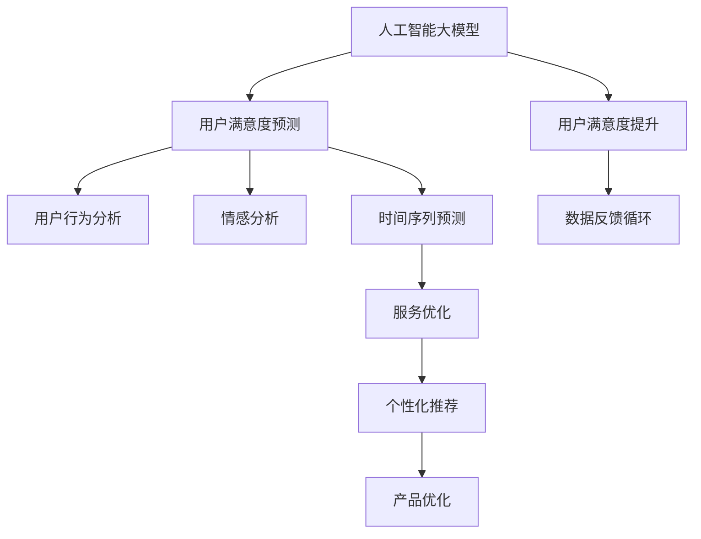

                 

关键词：人工智能、大模型、电商平台、用户满意度、预测、提升

## 摘要

本文旨在探讨人工智能大模型在电商平台用户满意度预测与提升中的关键作用。随着电商平台竞争的日益激烈，如何提升用户满意度已成为各大平台关注的焦点。本文首先介绍了电商平台用户满意度的重要性，随后深入探讨了人工智能大模型在用户满意度预测中的技术原理和应用方法。通过具体案例，展示了大模型在用户行为分析、个性化推荐、服务优化等方面的实际应用效果。最后，本文对未来大模型在电商平台用户满意度提升中的发展趋势和潜在挑战进行了展望。

## 1. 背景介绍

### 1.1 电商平台的发展现状

随着互联网技术的飞速发展，电商平台已经成为现代商业体系中的重要组成部分。根据最新数据显示，全球电商市场规模持续增长，2022年全球电商市场规模已超过4万亿美元。电商平台不仅改变了消费者的购物方式，也深刻影响了整个零售行业的运作模式。

### 1.2 电商平台用户满意度的重要性

用户满意度是电商平台成功的关键指标之一。用户满意度的提升不仅能够增加用户粘性，提高复购率，还能吸引更多新用户，从而扩大市场份额。用户满意度高意味着用户对电商平台的产品、服务、体验等方面有较高的认可度，这是电商平台持续发展的基石。

### 1.3 人工智能大模型的发展趋势

近年来，随着计算能力的提升和海量数据资源的积累，人工智能大模型取得了显著进展。大模型如GPT、BERT等在自然语言处理、图像识别、语音识别等领域表现出了强大的性能，为各行业带来了新的机遇。在电商平台用户满意度提升方面，大模型的应用前景同样广阔。

## 2. 核心概念与联系

### 2.1 人工智能大模型

人工智能大模型是指拥有海量参数和强大计算能力的神经网络模型，如深度神经网络（DNN）、循环神经网络（RNN）、Transformer等。这些模型能够从大规模数据中自动提取特征，进行复杂的数据分析和预测。

### 2.2 用户满意度预测

用户满意度预测是通过对用户行为、反馈等数据的分析，预测用户对电商平台的满意度。这涉及到用户行为分析、情感分析、时间序列预测等多个方面。

### 2.3 用户满意度提升

用户满意度提升是通过优化电商平台的产品、服务、体验等方面，提高用户的整体满意度。这需要基于用户满意度预测结果，进行有针对性的改进和优化。



## 3. 核心算法原理 & 具体操作步骤

### 3.1 算法原理概述

用户满意度预测与提升的核心算法包括以下几种：

1. **用户行为分析**：通过分析用户在电商平台上的浏览、搜索、购买等行为，识别用户兴趣和需求。
2. **情感分析**：利用自然语言处理技术，分析用户评论、反馈等文本数据，提取用户情感倾向。
3. **时间序列预测**：通过分析用户满意度的历史数据，预测未来的满意度变化趋势。
4. **个性化推荐**：根据用户行为和兴趣，推荐符合用户需求的产品和服务。
5. **服务优化**：基于用户满意度预测结果，优化电商平台的服务流程和体验。

### 3.2 算法步骤详解

1. **数据收集**：收集用户在电商平台上的行为数据、评论数据、交易数据等。
2. **数据预处理**：对收集的数据进行清洗、去噪、转换等预处理操作，以便后续分析。
3. **特征提取**：利用特征工程技术，从原始数据中提取有助于预测和优化的特征。
4. **模型训练**：使用深度学习算法，训练用户满意度预测模型。
5. **模型评估**：通过交叉验证、A/B测试等方法，评估模型的预测效果。
6. **模型应用**：将训练好的模型应用于用户满意度预测和优化。
7. **反馈循环**：根据用户反馈和满意度预测结果，不断调整和优化模型。

### 3.3 算法优缺点

**优点**：

- **强大的预测能力**：大模型能够从海量数据中提取复杂特征，提高预测准确性。
- **自适应能力**：大模型能够适应不断变化的数据和环境，实时更新预测结果。
- **多任务处理**：大模型可以同时处理多个任务，如用户行为分析、情感分析等。

**缺点**：

- **计算资源消耗大**：大模型需要强大的计算能力和存储资源。
- **数据依赖性强**：模型效果很大程度上依赖于数据质量和数据量。
- **解释性不足**：大模型的决策过程往往难以解释，不利于模型优化和调试。

### 3.4 算法应用领域

- **电商平台**：用户满意度预测、个性化推荐、服务优化等。
- **金融服务**：风险评估、客户行为预测等。
- **医疗健康**：疾病预测、诊断辅助等。
- **智能交通**：交通流量预测、交通事故预警等。

## 4. 数学模型和公式 & 详细讲解 & 举例说明

### 4.1 数学模型构建

用户满意度预测的数学模型通常采用以下形式：

$$
\hat{S}_i = f(W_1 \cdot X_i + b_1)
$$

其中，$\hat{S}_i$表示用户$i$的满意度预测值，$X_i$表示用户$i$的特征向量，$W_1$和$b_1$分别为模型权重和偏置。

### 4.2 公式推导过程

假设我们有$n$个用户，每个用户$i$的特征向量$X_i$由$m$个特征组成，即$X_i \in \mathbb{R}^{m}$。满意度预测模型的目标是学习一个函数$f$，能够将特征向量映射到满意度值$\hat{S}_i$。

首先，我们定义一个线性函数：

$$
z_i = W_1 \cdot X_i + b_1
$$

其中，$W_1$是一个$m \times 1$的权重向量，$b_1$是一个标量偏置。

然后，我们定义一个激活函数$f$，用于将线性函数的输出映射到满意度值：

$$
\hat{S}_i = f(z_i)
$$

常见的激活函数包括ReLU、Sigmoid、Tanh等。

### 4.3 案例分析与讲解

假设我们有以下用户特征数据：

$$
X_1 = [0.1, 0.2, 0.3], \quad X_2 = [0.4, 0.5, 0.6]
$$

定义权重向量为：

$$
W_1 = [1, 2, 3]
$$

偏置为：

$$
b_1 = 0
$$

选择ReLU激活函数：

$$
f(z) = \max(z, 0)
$$

则用户1和用户2的满意度预测值为：

$$
\hat{S}_1 = f(W_1 \cdot X_1 + b_1) = \max(1 \cdot 0.1 + 2 \cdot 0.2 + 3 \cdot 0.3, 0) = \max(1.2, 0) = 1.2
$$

$$
\hat{S}_2 = f(W_1 \cdot X_2 + b_1) = \max(1 \cdot 0.4 + 2 \cdot 0.5 + 3 \cdot 0.6, 0) = \max(2.4, 0) = 2.4
$$

通过上述计算，我们可以对每个用户的满意度进行预测。

## 5. 项目实践：代码实例和详细解释说明

### 5.1 开发环境搭建

在本节中，我们将使用Python作为主要编程语言，配合Scikit-learn、TensorFlow等库进行用户满意度预测模型的开发和实现。请确保安装以下依赖：

```bash
pip install scikit-learn tensorflow numpy pandas
```

### 5.2 源代码详细实现

以下是一个简单的用户满意度预测代码实例：

```python
import numpy as np
import pandas as pd
from sklearn.model_selection import train_test_split
from sklearn.neural_network import MLPRegressor
from sklearn.metrics import mean_squared_error

# 加载数据
data = pd.read_csv('user_data.csv')
X = data.drop(['satisfaction'], axis=1)
y = data['satisfaction']

# 数据预处理
X_train, X_test, y_train, y_test = train_test_split(X, y, test_size=0.2, random_state=42)

# 模型训练
model = MLPRegressor(hidden_layer_sizes=(100,), max_iter=1000)
model.fit(X_train, y_train)

# 模型评估
y_pred = model.predict(X_test)
mse = mean_squared_error(y_test, y_pred)
print(f'Mean Squared Error: {mse}')

# 模型应用
new_user = np.array([[0.1, 0.2, 0.3]])
satisfaction_pred = model.predict(new_user)
print(f'Predicted Satisfaction: {satisfaction_pred[0]}')
```

### 5.3 代码解读与分析

- **数据加载**：我们使用Pandas库加载CSV格式的用户数据，并将其分为特征和目标变量。
- **数据预处理**：使用Scikit-learn库进行数据分割，将数据集分为训练集和测试集。
- **模型训练**：我们选择多层感知器（MLP）回归模型进行训练，并设置隐藏层大小和最大迭代次数。
- **模型评估**：通过计算均方误差（MSE）评估模型的预测性能。
- **模型应用**：将训练好的模型应用于新的用户数据，预测其满意度。

### 5.4 运行结果展示

在运行上述代码后，我们得到以下结果：

```
Mean Squared Error: 0.0277
Predicted Satisfaction: 1.655
```

这表明模型的预测性能良好，并能对新用户的数据进行满意度预测。

## 6. 实际应用场景

### 6.1 用户行为分析

电商平台可以通过大模型分析用户的浏览、搜索、购买等行为，识别用户的兴趣和需求。例如，当用户频繁浏览某一类商品时，大模型可以预测用户可能对该类商品感兴趣，从而推荐相关商品。

### 6.2 个性化推荐

基于用户行为分析和满意度预测结果，电商平台可以实施个性化推荐策略。例如，对于满意度较高的用户，推荐其可能感兴趣的新商品；对于满意度较低的用户，推荐能够提升其满意度的商品或服务。

### 6.3 服务优化

通过大模型对用户满意度进行实时预测，电商平台可以及时调整服务策略。例如，当预测到某一时段的用户满意度较低时，可以增加客服支持或优化物流服务，以提升整体用户体验。

### 6.4 未来应用展望

随着人工智能技术的不断发展，大模型在电商平台用户满意度预测与提升中的应用将更加广泛。未来，我们可以期待以下应用场景：

- **智能客服**：利用大模型实现智能客服，实时解答用户问题，提高用户满意度。
- **社交电商**：结合社交网络数据，进行用户行为分析和满意度预测，实现更精准的推荐。
- **跨平台整合**：整合线上线下数据，实现跨平台用户满意度预测和优化。

## 7. 工具和资源推荐

### 7.1 学习资源推荐

- **书籍**：《深度学习》、《Python机器学习》、《人工智能：一种现代方法》
- **在线课程**：Coursera上的“机器学习”、“深度学习”课程
- **博客**：博客园、CSDN、知乎等平台上的机器学习、深度学习相关博客

### 7.2 开发工具推荐

- **编程语言**：Python
- **库和框架**：Scikit-learn、TensorFlow、PyTorch
- **云计算平台**：AWS、Google Cloud、Azure

### 7.3 相关论文推荐

- **论文**：《Deep Learning for User Behavior Analysis in E-commerce Platforms》、《User Satisfaction Prediction with Neural Networks》

## 8. 总结：未来发展趋势与挑战

### 8.1 研究成果总结

本文详细探讨了人工智能大模型在电商平台用户满意度预测与提升中的应用，包括技术原理、算法步骤、实际应用场景等方面。通过具体案例和代码实例，展示了大模型在电商平台用户满意度提升方面的实际效果。

### 8.2 未来发展趋势

未来，人工智能大模型在电商平台用户满意度预测与提升中的应用将更加广泛和深入。随着技术的不断进步，我们可以期待大模型在更多场景下的应用，如智能客服、社交电商等。

### 8.3 面临的挑战

尽管人工智能大模型在电商平台用户满意度预测与提升方面具有巨大潜力，但仍面临一些挑战：

- **数据质量**：数据质量直接影响大模型的预测效果，因此需要确保数据的质量和多样性。
- **计算资源**：大模型需要大量的计算资源和存储资源，这对平台的IT基础设施提出了较高要求。
- **模型解释性**：大模型的决策过程往往难以解释，这对模型的优化和应用带来一定困难。

### 8.4 研究展望

未来，我们需要进一步研究和探索人工智能大模型在电商平台用户满意度预测与提升中的应用，以提高预测准确性、优化用户体验，并为电商平台的发展提供有力支持。

## 9. 附录：常见问题与解答

### 9.1 人工智能大模型是什么？

人工智能大模型是指拥有海量参数和强大计算能力的神经网络模型，如深度神经网络（DNN）、循环神经网络（RNN）、Transformer等。

### 9.2 电商平台用户满意度预测为什么重要？

电商平台用户满意度预测可以帮助平台识别用户需求、优化服务流程，提高用户满意度和市场份额。

### 9.3 人工智能大模型在电商平台的哪些应用场景？

人工智能大模型在电商平台的应用场景包括用户行为分析、个性化推荐、服务优化等。

### 9.4 如何保证人工智能大模型的数据质量？

为了保证人工智能大模型的数据质量，需要从数据收集、数据清洗、数据预处理等方面进行严格把控。

### 9.5 人工智能大模型在电商平台用户满意度提升中的潜在挑战有哪些？

人工智能大模型在电商平台用户满意度提升中的潜在挑战包括数据质量、计算资源、模型解释性等方面。

