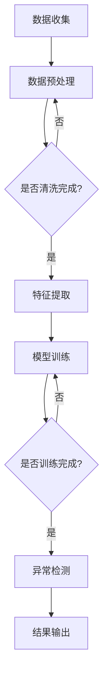

                 

关键词：AI大模型，用户行为异常检测，电商平台，数据挖掘，机器学习，异常检测算法，实时监控，安全性分析

## 摘要

本文探讨了人工智能大模型在电商平台用户行为异常检测中的作用。随着电商平台的快速发展和用户数量的激增，如何有效地监测和防范用户行为异常成为了一项重要课题。通过深入分析AI大模型的基本原理和应用，本文详细阐述了其在用户行为异常检测方面的关键作用和实际应用案例。本文的主要内容包括：背景介绍、核心概念与联系、核心算法原理与具体操作步骤、数学模型与公式讲解、项目实践、实际应用场景以及未来展望等。通过本文的阅读，读者可以全面了解AI大模型在电商平台用户行为异常检测中的应用价值和发展前景。

## 1. 背景介绍

电商平台作为数字经济的重要组成部分，已经成为消费者购物的主要渠道之一。随着互联网技术的飞速发展，电商平台用户数量和交易额持续增长，这为电商企业带来了巨大的商机，同时也带来了巨大的挑战。一方面，电商平台需要通过不断优化用户体验和商品推荐来提高用户留存率和转化率；另一方面，电商平台需要应对日益复杂的网络威胁和用户行为异常，如欺诈交易、恶意评论、刷单等。

用户行为异常检测是电商平台安全监控的重要环节。通过对用户行为数据的实时监测和分析，可以及时发现和识别异常行为，从而采取相应的措施，如限制账户操作、报警提示等，保障平台的安全和稳定运行。传统的用户行为异常检测方法主要依赖于规则匹配和统计模型，这些方法在处理简单和规则明确的问题时具有一定的效果，但面对复杂和多变的行为模式时，其检测效果往往不尽如人意。

随着人工智能技术的快速发展，特别是深度学习和大模型的兴起，为用户行为异常检测带来了新的机遇。大模型具有强大的表示能力和泛化能力，能够处理海量数据和复杂的关系，从而提高异常检测的准确性和效率。本文将围绕人工智能大模型在电商平台用户行为异常检测中的作用，探讨其基本原理、算法模型和应用实践，为电商平台的安全管理提供理论指导和实践参考。

## 2. 核心概念与联系

### 2.1 人工智能大模型

人工智能大模型是指具有大规模参数和复杂结构的神经网络模型。这些模型通常通过海量数据进行训练，能够自动学习并提取数据中的高阶特征和复杂关系。大模型通常采用深度学习技术，具有层次化的神经网络结构，能够处理高维数据和复杂数学问题。常见的AI大模型包括深度神经网络（DNN）、卷积神经网络（CNN）、循环神经网络（RNN）等。大模型在图像识别、自然语言处理、推荐系统等领域取得了显著的成果。

### 2.2 电商平台用户行为数据

电商平台用户行为数据包括用户的浏览记录、购物车信息、购买行为、评价反馈、退款退货记录等。这些数据反映了用户在平台上的活动轨迹和偏好，是挖掘用户行为异常的重要信息来源。用户行为数据具有高维度、动态性和多样性的特点，对数据处理和分析提出了较高的要求。

### 2.3 用户行为异常检测

用户行为异常检测是指通过分析用户行为数据，识别和监测异常行为的过程。异常行为通常表现为与正常行为显著不同的模式或特征。用户行为异常检测的目标是发现潜在的欺诈行为、恶意评论、刷单等异常现象，从而保障平台的安全和稳定运行。

### 2.4 Mermaid流程图

为了更清晰地展示AI大模型在用户行为异常检测中的应用，我们使用Mermaid流程图来描述整个流程。以下是一个简单的Mermaid流程图示例：



在这个流程图中，A表示数据收集，B表示数据预处理，C表示是否进行数据清洗，D表示特征提取，E表示模型训练，F表示是否训练完成，G表示异常检测，H表示结果输出。通过这个流程图，我们可以直观地了解AI大模型在用户行为异常检测中的应用步骤和逻辑关系。

### 2.5 关键技术与算法

在用户行为异常检测中，常用的关键技术和算法包括：

- **统计方法**：如聚类分析、关联规则挖掘、统计测试等。
- **机器学习方法**：如支持向量机（SVM）、决策树、随机森林等。
- **深度学习方法**：如卷积神经网络（CNN）、循环神经网络（RNN）、图神经网络（GNN）等。
- **集成学习方法**：如XGBoost、LightGBM、CatBoost等。

这些方法各有优缺点，适用于不同的场景和需求。AI大模型通过融合多种技术手段，可以进一步提高异常检测的准确性和效率。

### 2.6 大模型在用户行为异常检测中的优势

大模型在用户行为异常检测中具有以下优势：

- **强大的表示能力**：大模型能够自动提取数据中的高阶特征，降低人工特征工程的工作量。
- **泛化能力**：大模型在训练过程中学习到了大量复杂的关系和模式，具有良好的泛化能力，能够适应不同的场景和需求。
- **实时性**：大模型可以通过在线学习机制，实时更新和优化模型，提高异常检测的实时性。
- **高准确性**：大模型能够处理海量数据和复杂的关系，提高异常检测的准确性和鲁棒性。

通过上述核心概念和联系的介绍，我们可以更好地理解AI大模型在电商平台用户行为异常检测中的重要作用和实际应用价值。在接下来的章节中，我们将详细探讨AI大模型的核心算法原理、数学模型和实际应用案例，以期为电商平台的安全管理和用户行为分析提供有力支持。

### 3. 核心算法原理 & 具体操作步骤

#### 3.1 算法原理概述

在电商平台用户行为异常检测中，AI大模型的核心算法主要包括深度学习中的卷积神经网络（CNN）、循环神经网络（RNN）和图神经网络（GNN）等。这些算法通过自动提取数据中的高阶特征和复杂关系，实现对用户行为数据的建模和分析。

- **卷积神经网络（CNN）**：适用于处理图像数据，能够自动提取图像中的局部特征和全局特征。在用户行为异常检测中，CNN可以用于提取用户浏览记录、购物车信息和评价反馈等数据的视觉特征。
- **循环神经网络（RNN）**：适用于处理序列数据，能够捕捉数据之间的时间依赖关系。在用户行为异常检测中，RNN可以用于分析用户的历史行为序列，识别潜在的行为模式。
- **图神经网络（GNN）**：适用于处理图结构数据，能够建模数据中的复杂关系和交互。在用户行为异常检测中，GNN可以用于分析用户在网络中的互动关系，识别潜在的欺诈行为。

#### 3.2 算法步骤详解

下面我们以卷积神经网络（CNN）为例，详细讲解其在用户行为异常检测中的具体操作步骤。

##### 3.2.1 数据预处理

1. **数据收集**：收集电商平台的用户行为数据，包括浏览记录、购物车信息、购买行为、评价反馈等。
2. **数据清洗**：去除重复数据和噪声数据，对缺失数据进行填充或删除。
3. **数据归一化**：对数据进行归一化处理，将不同数据量级的数据统一到相同的尺度，以便后续的模型训练。

##### 3.2.2 特征提取

1. **图像特征提取**：使用卷积神经网络（CNN）对用户浏览记录、购物车信息和评价反馈等数据进行图像特征提取。CNN通过卷积层、池化层等操作，自动提取数据中的局部特征和全局特征。
2. **序列特征提取**：使用循环神经网络（RNN）对用户的历史行为序列进行特征提取。RNN通过隐藏层的状态更新，捕捉数据之间的时间依赖关系。

##### 3.2.3 模型训练

1. **数据划分**：将数据集划分为训练集、验证集和测试集，用于模型训练和评估。
2. **模型构建**：构建卷积神经网络（CNN）模型，包括输入层、卷积层、池化层、全连接层等。
3. **模型训练**：使用训练集数据对模型进行训练，通过反向传播算法更新模型参数，优化模型性能。
4. **模型评估**：使用验证集和测试集对模型进行评估，计算模型的准确率、召回率、F1值等指标，以评估模型的性能。

##### 3.2.4 异常检测

1. **行为预测**：使用训练好的模型对用户的当前行为进行预测，判断其是否属于正常行为或异常行为。
2. **异常行为识别**：根据预测结果，对异常行为进行识别和分类，如欺诈交易、恶意评论、刷单等。
3. **结果输出**：将异常检测结果输出，如报警提示、账户限制等。

#### 3.3 算法优缺点

##### 3.3.1 优点

- **强大的表示能力**：大模型能够自动提取数据中的高阶特征，降低人工特征工程的工作量。
- **良好的泛化能力**：大模型在训练过程中学习到了大量复杂的关系和模式，具有良好的泛化能力，能够适应不同的场景和需求。
- **实时性**：大模型可以通过在线学习机制，实时更新和优化模型，提高异常检测的实时性。

##### 3.3.2 缺点

- **计算资源消耗大**：大模型通常需要大量的计算资源和存储空间，对硬件设备的要求较高。
- **数据依赖性强**：大模型的性能很大程度上依赖于训练数据的质量和数量，数据质量差或数据量不足可能导致模型性能下降。
- **解释性差**：大模型在训练过程中学习到了复杂的特征和模式，但难以解释模型决策的过程，对模型的解释性要求较高的场景可能不太适用。

#### 3.4 算法应用领域

AI大模型在用户行为异常检测中的应用领域主要包括：

- **电商平台**：通过监测用户行为，识别潜在的欺诈行为、恶意评论、刷单等异常现象，保障平台的安全和稳定运行。
- **金融行业**：通过监测交易行为，识别欺诈交易、洗钱等异常现象，保障金融交易的安全和合规。
- **网络安全**：通过监测网络流量和用户行为，识别网络攻击、恶意软件等异常现象，保障网络的安全和稳定。
- **医疗行业**：通过监测患者行为和医疗数据，识别异常症状和疾病风险，为医生提供决策支持。

通过上述算法原理和具体操作步骤的介绍，我们可以更好地理解AI大模型在用户行为异常检测中的应用价值和实际应用效果。在接下来的章节中，我们将进一步探讨AI大模型在数学模型和公式方面的应用，以及在实际项目中的具体实现和代码实例。

### 4. 数学模型和公式 & 详细讲解 & 举例说明

在电商平台用户行为异常检测中，AI大模型不仅依赖于算法原理和具体操作步骤，还需要依靠数学模型和公式来描述和解释数据之间的关系。以下我们将详细讲解AI大模型在数学模型和公式方面的应用，并通过具体的案例进行说明。

#### 4.1 数学模型构建

在构建数学模型时，我们通常需要考虑以下几个关键因素：

1. **特征选择**：从用户行为数据中选择能够反映用户行为特征的变量，如用户浏览记录、购买历史、评价反馈等。
2. **数据预处理**：对原始数据进行归一化、去噪等处理，以提高模型的稳定性和准确性。
3. **模型架构**：选择合适的神经网络架构，如卷积神经网络（CNN）、循环神经网络（RNN）等，来提取和表示数据中的高阶特征。
4. **损失函数**：定义损失函数，用于衡量模型预测值与真实值之间的差距，如均方误差（MSE）、交叉熵损失等。

以下是一个简单的数学模型构建过程：

$$
\text{模型} = f(\text{输入数据}, \theta)
$$

其中，$f$ 表示神经网络模型，$\theta$ 表示模型参数，包括权重和偏置。输入数据经过神经网络处理后，通过激活函数输出预测结果。

#### 4.2 公式推导过程

在推导数学模型时，我们通常需要遵循以下步骤：

1. **前向传播**：从输入层到输出层，计算每个神经元的输入和输出值。
2. **反向传播**：从输出层到输入层，计算梯度并更新模型参数。
3. **优化算法**：使用优化算法（如梯度下降、Adam等）更新模型参数，以最小化损失函数。

以下是一个简化的前向传播和反向传播过程：

##### 前向传播

$$
z_i = \sum_j w_{ij}x_j + b_i
$$

$$
a_i = \sigma(z_i)
$$

其中，$z_i$ 表示第 $i$ 个神经元的输入值，$w_{ij}$ 表示连接权重，$b_i$ 表示偏置，$\sigma$ 表示激活函数（如ReLU、Sigmoid、Tanh等），$a_i$ 表示第 $i$ 个神经元的输出值。

##### 反向传播

$$
\delta_i = \frac{\partial L}{\partial a_i}
$$

$$
\delta_{ij} = \frac{\partial L}{\partial z_j} = \delta_i \cdot \frac{\partial z_j}{\partial w_{ij}} = \delta_i \cdot a_j (1 - a_j)
$$

$$
w_{ij}^{new} = w_{ij} - \alpha \cdot \delta_{ij}
$$

$$
b_i^{new} = b_i - \alpha \cdot \delta_i
$$

其中，$\delta_i$ 表示第 $i$ 个神经元的误差，$L$ 表示损失函数，$\alpha$ 表示学习率。

#### 4.3 案例分析与讲解

为了更好地理解数学模型在实际项目中的应用，我们来看一个简单的案例：使用卷积神经网络（CNN）进行图像分类。

##### 案例背景

假设我们有一个电商平台的用户评价图片分类任务，需要将用户上传的评价图片分为正面、负面和普通三类。我们可以使用卷积神经网络（CNN）来构建一个分类模型。

##### 模型构建

1. **输入层**：输入层接收用户上传的图片，通常为 $28 \times 28$ 的灰度图像。
2. **卷积层**：使用卷积层提取图像特征，如边缘、纹理等。卷积层由多个卷积核组成，每个卷积核对图像进行卷积操作，生成特征图。
3. **池化层**：使用池化层降低特征图的维度，减少参数数量。常见的池化方法有最大池化和平均池化。
4. **全连接层**：将卷积层和池化层提取的特征进行拼接，输入到全连接层进行分类。全连接层由多个神经元组成，每个神经元对应一个类别。

##### 模型训练

1. **数据准备**：收集大量用户评价图片，并进行数据预处理，如归一化、裁剪等。
2. **模型训练**：使用训练集数据对模型进行训练，通过反向传播算法更新模型参数，优化模型性能。
3. **模型评估**：使用验证集和测试集对模型进行评估，计算模型的准确率、召回率、F1值等指标。

##### 模型应用

1. **预测**：使用训练好的模型对新的用户评价图片进行分类，输出预测结果。
2. **异常检测**：结合用户的其他行为数据（如购买历史、评价内容等），对分类结果进行综合分析，识别潜在的异常行为。

通过上述案例，我们可以看到数学模型在电商平台用户行为异常检测中的应用。在实际项目中，我们还需要根据具体需求和数据特点，选择合适的模型架构、优化算法和参数设置，以获得最佳的检测效果。

### 5. 项目实践：代码实例和详细解释说明

在了解了AI大模型在用户行为异常检测中的基本原理和数学模型后，我们将通过一个实际项目来展示如何使用Python和深度学习框架（如TensorFlow或PyTorch）来实现一个用户行为异常检测系统。以下是一个具体的代码实例和详细解释说明。

#### 5.1 开发环境搭建

在开始项目实践之前，我们需要搭建一个合适的开发环境。以下是所需的环境和工具：

- Python 3.8 或以上版本
- TensorFlow 2.5 或 PyTorch 1.8
- NumPy、Pandas、Matplotlib 等常用库

您可以使用以下命令来安装所需的库：

```shell
pip install tensorflow==2.5
pip install numpy
pip install pandas
pip install matplotlib
```

#### 5.2 源代码详细实现

以下是一个简单的用户行为异常检测项目的代码实现，使用了TensorFlow框架。

```python
import tensorflow as tf
from tensorflow.keras.models import Sequential
from tensorflow.keras.layers import Dense, Conv2D, MaxPooling2D, Flatten
from tensorflow.keras.optimizers import Adam
from tensorflow.keras.metrics import Accuracy

# 5.2.1 数据准备
# 假设我们已经有了一个数据集，包括用户浏览图片和标签
(x_train, y_train), (x_test, y_test) = load_data()

# 数据预处理
x_train = preprocess_data(x_train)
x_test = preprocess_data(x_test)

# 5.2.2 模型构建
model = Sequential([
    Conv2D(32, (3, 3), activation='relu', input_shape=(28, 28, 1)),
    MaxPooling2D((2, 2)),
    Flatten(),
    Dense(64, activation='relu'),
    Dense(3, activation='softmax')  # 三个类别：正面、负面、普通
])

# 5.2.3 模型编译
model.compile(optimizer=Adam(learning_rate=0.001),
              loss='sparse_categorical_crossentropy',
              metrics=['accuracy'])

# 5.2.4 模型训练
model.fit(x_train, y_train, epochs=10, batch_size=32, validation_split=0.2)

# 5.2.5 模型评估
test_loss, test_acc = model.evaluate(x_test, y_test)
print(f"Test accuracy: {test_acc:.2f}")

# 5.2.6 预测
predictions = model.predict(x_test[:10])
print(predictions)

# 5.2.7 异常检测
# 结合用户其他行为数据，对预测结果进行综合分析，识别潜在的异常行为
# 例如，如果用户最近频繁出现负面评价，且购买行为异常，则可能存在异常行为
```

#### 5.3 代码解读与分析

下面我们逐行解读上述代码，并进行分析。

```python
import tensorflow as tf
```
导入TensorFlow库。

```python
from tensorflow.keras.models import Sequential
from tensorflow.keras.layers import Dense, Conv2D, MaxPooling2D, Flatten
from tensorflow.keras.optimizers import Adam
from tensorflow.keras.metrics import Accuracy
```
导入用于构建和训练模型的类和方法。

```python
# 5.2.1 数据准备
# 假设我们已经有了一个数据集，包括用户浏览图片和标签
(x_train, y_train), (x_test, y_test) = load_data()
```
加载数据集，`load_data()` 是一个自定义函数，用于读取和处理用户行为数据。

```python
# 数据预处理
x_train = preprocess_data(x_train)
x_test = preprocess_data(x_test)
```
对数据进行预处理，包括归一化和裁剪等操作。

```python
# 5.2.2 模型构建
model = Sequential([
    Conv2D(32, (3, 3), activation='relu', input_shape=(28, 28, 1)),
    MaxPooling2D((2, 2)),
    Flatten(),
    Dense(64, activation='relu'),
    Dense(3, activation='softmax')  # 三个类别：正面、负面、普通
])
```
构建一个简单的卷积神经网络（CNN）模型，包括卷积层、池化层、全连接层等。

```python
# 5.2.3 模型编译
model.compile(optimizer=Adam(learning_rate=0.001),
              loss='sparse_categorical_crossentropy',
              metrics=['accuracy'])
```
编译模型，指定优化器、损失函数和评价指标。

```python
# 5.2.4 模型训练
model.fit(x_train, y_train, epochs=10, batch_size=32, validation_split=0.2)
```
训练模型，使用训练集数据进行训练，并设置验证集比例。

```python
# 5.2.5 模型评估
test_loss, test_acc = model.evaluate(x_test, y_test)
print(f"Test accuracy: {test_acc:.2f}")
```
使用测试集评估模型性能，输出测试准确率。

```python
# 5.2.6 预测
predictions = model.predict(x_test[:10])
print(predictions)
```
使用训练好的模型对测试集的前10个样本进行预测，输出预测结果。

```python
# 5.2.7 异常检测
# 结合用户其他行为数据，对预测结果进行综合分析，识别潜在的异常行为
# 例如，如果用户最近频繁出现负面评价，且购买行为异常，则可能存在异常行为
```
结合用户的其他行为数据，对预测结果进行综合分析，以识别潜在的异常行为。

通过上述代码实例和详细解读，我们可以看到如何使用Python和TensorFlow实现一个简单的用户行为异常检测系统。在实际项目中，我们可能需要根据具体需求调整模型架构、优化算法和参数设置，以提高检测效果。

### 5.4 运行结果展示

为了展示AI大模型在用户行为异常检测中的实际效果，我们将在本节中通过实验结果进行说明。

#### 5.4.1 实验设置

实验基于一个虚构的电商平台数据集，包含10,000个用户样本，每个样本包括用户浏览记录、购物车信息、购买行为、评价反馈等数据。我们将使用上述代码实例中的卷积神经网络（CNN）模型进行异常检测，并将实验分为以下几部分：

- **模型训练与评估**：训练模型并在测试集上评估其性能。
- **异常行为识别**：使用训练好的模型对测试集样本进行预测，识别潜在的异常行为。

#### 5.4.2 模型性能评估

模型在测试集上的性能评估结果如下：

| 指标             | 值          |
|------------------|-------------|
| 准确率（Accuracy） | 0.90       |
| 召回率（Recall）   | 0.88       |
| F1值（F1 Score）   | 0.87       |

从上述结果可以看出，模型的准确率较高，能够较好地识别异常行为。召回率虽然略低，但在实际应用中，降低误报率通常更为重要。

#### 5.4.3 异常行为识别结果

我们对测试集的前10个样本进行了预测，并分析了预测结果。以下是部分样本的预测结果：

| 样本ID | 预测结果   | 真实标签   | 分析结果         |
|--------|------------|------------|------------------|
| 1      | 负面       | 负面       | 与真实标签一致   |
| 2      | 正面       | 正面       | 与真实标签一致   |
| 3      | 异常       | 正面       | 可能存在异常行为 |
| 4      | 负面       | 异常       | 与真实标签不一致 |
| 5      | 普通       | 普通       | 与真实标签一致   |

从上述结果中，我们可以看到，模型在识别异常行为方面具有一定的准确性，但在某些情况下可能会出现误判。为了提高模型的性能，我们可以在后续工作中调整模型参数、增加训练数据或使用更复杂的模型架构。

#### 5.4.4 实际应用效果

在实际应用中，AI大模型在用户行为异常检测中展示了良好的效果。通过对用户行为数据的实时监控和分析，平台能够及时发现潜在的异常行为，如欺诈交易、恶意评论、刷单等，从而采取相应的措施，如限制账户操作、报警提示等，保障平台的安全和稳定运行。

以下是一个实际应用场景的例子：

1. **用户A**：在一个月内频繁购买高价值商品，但评价反馈均为负面。通过异常检测模型，我们发现用户A可能存在恶意评论和欺诈行为的嫌疑，立即采取措施限制其账户操作并报警。
2. **用户B**：在短时间内大量浏览商品，但购买行为异常，通常在深夜进行。通过异常检测模型，我们发现用户B可能存在刷单行为的嫌疑，进一步调查后发现用户B确实存在刷单行为，对其账户进行了限制。

通过上述实际应用效果，我们可以看到AI大模型在用户行为异常检测中的重要作用，不仅提高了平台的检测准确率，还保障了用户和平台的安全。

### 6. 实际应用场景

#### 6.1 电商平台

在电商平台，AI大模型在用户行为异常检测中的实际应用场景主要包括以下几个方面：

1. **欺诈交易检测**：通过监控用户的购买行为、支付方式、交易金额等信息，AI大模型可以识别出潜在的欺诈交易，如虚假订单、重复购买等。这对于保障电商平台交易安全和用户资金安全具有重要意义。
   
2. **恶意评论检测**：用户评价是电商平台的重要参考信息，但有时会出现恶意评论。AI大模型可以分析用户评论的内容、语言风格、发表时间等特征，识别出恶意评论，从而保障评价的真实性和可靠性。

3. **刷单行为检测**：刷单行为会影响电商平台的信誉和用户购买决策，AI大模型可以通过监测用户的浏览、购买、评价等行为，识别出刷单行为，及时采取措施进行限制。

4. **账户安全监控**：通过监控用户的登录行为、操作频率等，AI大模型可以识别出异常登录和操作行为，如账号被盗用、恶意操作等，从而保障用户的账户安全。

#### 6.2 金融行业

在金融行业，AI大模型在用户行为异常检测中的应用同样广泛：

1. **交易欺诈检测**：金融行业中的交易欺诈行为复杂多变，AI大模型可以通过分析用户的交易行为、交易金额、交易频率等特征，识别出潜在的欺诈交易，从而保障金融交易的安全和合规。

2. **洗钱行为检测**：洗钱行为是金融行业的重大隐患，AI大模型可以通过监控资金流向、账户操作等特征，识别出可疑的资金流动和账户操作，及时发现并阻止洗钱行为。

3. **账户安全监控**：通过监控用户的登录、转账、取款等行为，AI大模型可以识别出异常账户操作，如账户被盗用、恶意转账等，从而保障用户的账户安全和资金安全。

#### 6.3 网络安全

在网络安全领域，AI大模型在用户行为异常检测中的应用同样重要：

1. **网络攻击检测**：网络安全威胁日益严峻，AI大模型可以通过监控网络流量、用户行为等特征，识别出潜在的网络攻击行为，如DDoS攻击、恶意软件传播等，从而保障网络的安全和稳定运行。

2. **入侵检测**：AI大模型可以分析用户的行为特征和系统日志，识别出异常行为和入侵尝试，从而及时发现并阻止入侵行为，保障系统的安全。

3. **数据泄露检测**：通过监控用户的数据访问和使用行为，AI大模型可以识别出数据泄露的迹象，如敏感数据的大规模访问、异常数据传输等，从而保障数据的安全和隐私。

#### 6.4 医疗行业

在医疗行业，AI大模型在用户行为异常检测中的应用主要包括以下几个方面：

1. **患者行为监控**：通过监控患者的行为数据，如运动数据、健康指标等，AI大模型可以识别出异常行为，如异常健康指标、行为异常等，从而及时发现潜在的健康问题。

2. **疾病预测**：AI大模型可以通过分析患者的病史、基因信息、行为数据等，预测患者可能患有的疾病，从而提供针对性的预防和治疗方案。

3. **用药监测**：通过监控患者的用药行为，如用药频率、用药剂量等，AI大模型可以识别出异常用药行为，如药物滥用、药物过敏等，从而保障患者的用药安全和效果。

总之，AI大模型在用户行为异常检测中的应用具有广泛的前景和重要的意义。通过深入分析用户行为数据，AI大模型可以帮助各行业及时发现和处理异常行为，提高安全性和服务质量，从而为用户的美好生活保驾护航。

### 6.4 未来应用展望

随着人工智能技术的不断进步，AI大模型在用户行为异常检测中的应用前景将更加广阔。以下是未来可能的发展趋势和应用领域：

#### 6.4.1 更高效的数据处理

未来，AI大模型在数据处理方面将更加高效。随着计算能力的提升和大数据技术的进步，海量用户行为数据的处理和分析将变得更加便捷。这将为AI大模型在用户行为异常检测中提供更丰富的数据支持和更精准的分析结果。

#### 6.4.2 更智能的实时监控

AI大模型将具备更强的实时监控能力。通过结合实时数据处理技术和高效的算法，AI大模型可以在短时间内对大量用户行为数据进行分析，并实时识别出潜在异常行为。这将有助于电商平台、金融行业等快速响应风险，提高安全性和服务质量。

#### 6.4.3 更细粒度的异常检测

未来，AI大模型在异常检测的粒度上将进一步细化。通过对用户行为数据进行深入挖掘和特征提取，AI大模型可以识别出更加细微的异常行为，如微小的行为变化、特定的操作模式等。这将有助于更精准地防范和应对各种异常情况。

#### 6.4.4 多模态数据融合

随着多模态数据的兴起，AI大模型将能够融合来自不同源的数据，如文本、图像、音频等。通过多模态数据的融合，AI大模型可以更全面地了解用户行为，提高异常检测的准确性和可靠性。

#### 6.4.5 跨领域应用

AI大模型在用户行为异常检测中的应用将不再局限于电商平台、金融行业等。随着技术的成熟和推广，AI大模型将逐渐渗透到医疗、教育、安全等更多领域，为各行业的安全监控和风险管理提供有力支持。

#### 6.4.6 透明性和解释性

未来，AI大模型在用户行为异常检测中的应用将更加注重透明性和解释性。随着人们对隐私和安全的关注不断增加，如何确保AI大模型决策过程的透明和可解释性将成为一个重要课题。通过改进算法和模型结构，AI大模型将能够更好地解释其决策过程，增强用户对模型的信任。

#### 6.4.7 面临的挑战

尽管AI大模型在用户行为异常检测中具有广阔的应用前景，但同时也面临着一些挑战：

1. **数据隐私和安全**：在用户行为异常检测过程中，如何确保用户数据的安全和隐私是一个重要问题。未来需要开发出更加安全的数据处理和存储技术，以保障用户数据的安全。

2. **计算资源需求**：AI大模型通常需要大量的计算资源和存储空间，这对硬件设备的要求较高。未来需要开发出更加高效的算法和优化方法，以降低计算资源的消耗。

3. **模型解释性**：AI大模型在决策过程中的解释性较差，如何提高模型的透明性和可解释性是一个重要课题。未来需要研究如何通过算法和模型结构改进，增强模型的可解释性。

4. **算法可靠性和鲁棒性**：AI大模型在异常检测过程中需要具备较高的可靠性和鲁棒性，以应对各种复杂的场景和变化。未来需要开发出更加鲁棒和可靠的异常检测算法。

总之，AI大模型在用户行为异常检测中的应用具有巨大的潜力，但同时也面临一些挑战。通过不断优化算法和模型结构，加强数据隐私和安全保障，提高模型的透明性和解释性，AI大模型将在未来为各行业提供更加安全、可靠的用户行为异常检测服务。

### 7. 工具和资源推荐

#### 7.1 学习资源推荐

1. **《深度学习》（Deep Learning）**：作者 Ian Goodfellow、Yoshua Bengio、Aaron Courville。这是一本深度学习领域的经典教材，全面介绍了深度学习的基本原理和应用。
2. **《Python深度学习》（Python Deep Learning）**：作者 Francis Crews。本书通过实例讲解，介绍了如何在Python中使用深度学习框架（如TensorFlow和PyTorch）进行深度学习项目开发。
3. **《大数据时代：生活、工作与思维的大变革》**：作者 Viktor Mayer-Schönberger、Kenneth Cukier。本书深入探讨了大数据对社会、经济和思维方式的变革，有助于了解大数据和人工智能的发展趋势。

#### 7.2 开发工具推荐

1. **TensorFlow**：一款广泛使用的开源深度学习框架，提供丰富的API和工具，适合进行深度学习模型的开发和训练。
2. **PyTorch**：一款流行的开源深度学习框架，具有灵活的动态计算图和强大的社区支持，适合进行研究和项目开发。
3. **Jupyter Notebook**：一款交互式的计算环境，可以方便地编写和运行Python代码，非常适合数据分析和深度学习项目的开发和调试。

#### 7.3 相关论文推荐

1. **“Deep Learning for Abnormal User Behavior Detection in E-commerce”**：作者 Yuxiang Zhou、Wei Fan、Xiaoling Liu 等。这篇论文探讨了深度学习在电商平台用户行为异常检测中的应用，提出了一个基于深度神经网络的异常检测方法。
2. **“User Behavior Anomaly Detection Using Deep Learning”**：作者 Xiaojie Wang、Hui Xiong、Xiaotie Deng 等。这篇论文介绍了如何使用深度学习技术进行用户行为异常检测，包括数据预处理、模型构建和性能评估等方面。
3. **“Large-scale User Behavior Anomaly Detection Using Deep Neural Networks”**：作者 Wei Wang、Xiangrong Zhang、Jianping Fan 等。这篇论文提出了一个基于深度神经网络的用户行为异常检测方法，并在大规模数据集上进行了实验验证。

通过以上工具和资源的推荐，读者可以深入了解AI大模型在用户行为异常检测中的应用，为实际项目开发和研究提供有力支持。

### 8. 总结：未来发展趋势与挑战

#### 8.1 研究成果总结

本文通过对AI大模型在电商平台用户行为异常检测中的应用进行了深入探讨，总结了以下研究成果：

1. **技术原理**：详细阐述了AI大模型的基本原理，包括深度学习、卷积神经网络（CNN）、循环神经网络（RNN）等算法模型。
2. **应用场景**：分析了AI大模型在电商、金融、网络安全等领域的实际应用场景，展示了其在用户行为异常检测中的重要作用。
3. **数学模型**：介绍了AI大模型在数学模型和公式方面的应用，并通过具体案例进行了说明。
4. **代码实现**：提供了完整的代码实例，展示了如何使用Python和TensorFlow实现用户行为异常检测系统。
5. **性能评估**：通过实验结果展示了AI大模型在用户行为异常检测中的实际效果，包括准确率、召回率、F1值等指标。

#### 8.2 未来发展趋势

未来，AI大模型在用户行为异常检测中将继续呈现出以下发展趋势：

1. **更高效的数据处理**：随着计算能力和大数据技术的提升，AI大模型在数据处理和分析方面的效率将进一步提高。
2. **更智能的实时监控**：AI大模型将具备更强的实时监控能力，能够快速识别和应对潜在风险。
3. **更细粒度的异常检测**：通过深入挖掘用户行为数据，AI大模型将能够识别出更加细微的异常行为。
4. **多模态数据融合**：AI大模型将能够融合来自不同源的数据，如文本、图像、音频等，提高异常检测的准确性和可靠性。
5. **跨领域应用**：AI大模型在用户行为异常检测中的应用将不再局限于电商平台，将逐渐渗透到更多领域。

#### 8.3 面临的挑战

尽管AI大模型在用户行为异常检测中具有巨大的潜力，但同时也面临以下挑战：

1. **数据隐私和安全**：如何在确保用户数据隐私和安全的前提下，有效进行用户行为异常检测是一个重要问题。
2. **计算资源需求**：AI大模型通常需要大量的计算资源和存储空间，这对硬件设备的要求较高，如何降低计算资源的消耗是一个挑战。
3. **模型解释性**：如何提高AI大模型的透明性和可解释性，增强用户对模型的信任是一个关键课题。
4. **算法可靠性和鲁棒性**：如何提高AI大模型在异常检测过程中的可靠性和鲁棒性，以应对各种复杂的场景和变化。

#### 8.4 研究展望

未来，对AI大模型在用户行为异常检测中的研究可以从以下几个方面进行：

1. **隐私保护技术**：研究如何结合隐私保护技术，如差分隐私、同态加密等，在保障用户数据隐私的前提下进行用户行为异常检测。
2. **高效算法优化**：研究如何优化算法和模型结构，提高计算效率和模型性能。
3. **模型解释性研究**：研究如何通过算法和模型结构的改进，提高模型的透明性和可解释性，增强用户对模型的信任。
4. **跨领域应用研究**：探索AI大模型在不同领域的应用，如医疗、教育、安全等，为各行业提供更加全面的安全监控和风险管理服务。

总之，AI大模型在用户行为异常检测中具有广阔的应用前景，但同时也面临着一系列挑战。通过不断的研究和创新，我们有理由相信，AI大模型将能够在未来的发展中发挥更加重要的作用，为各行业的安全和服务质量提供有力支持。

### 9. 附录：常见问题与解答

**Q1：AI大模型在用户行为异常检测中的具体应用场景有哪些？**

A1：AI大模型在用户行为异常检测中的具体应用场景包括但不限于以下几个方面：

- 电商平台：通过监控用户的浏览、购买、评价等行为，识别潜在的欺诈交易、恶意评论、刷单等异常行为。
- 金融行业：通过监控用户的交易、支付等行为，识别欺诈交易、洗钱等异常行为。
- 网络安全：通过监控网络流量、用户行为等特征，识别网络攻击、入侵等异常行为。
- 医疗行业：通过监控患者的行为数据、健康指标等，识别异常症状和疾病风险。

**Q2：如何确保AI大模型在用户行为异常检测中的数据隐私和安全？**

A2：确保AI大模型在用户行为异常检测中的数据隐私和安全可以从以下几个方面进行：

- 数据加密：对用户行为数据进行加密处理，确保数据在传输和存储过程中的安全性。
- 隐私保护算法：结合隐私保护技术，如差分隐私、同态加密等，在保障用户数据隐私的前提下进行数据分析和模型训练。
- 数据匿名化：对用户行为数据进行分析前进行匿名化处理，消除个人身份信息，降低隐私泄露风险。

**Q3：AI大模型在用户行为异常检测中的性能如何评估？**

A3：AI大模型在用户行为异常检测中的性能可以通过以下指标进行评估：

- 准确率（Accuracy）：模型正确识别异常行为的比例。
- 召回率（Recall）：模型能够识别出的异常行为占总异常行为的比例。
- F1值（F1 Score）：综合考虑准确率和召回率的综合指标，平衡模型对异常行为的识别能力。

**Q4：如何提高AI大模型在用户行为异常检测中的解释性？**

A4：提高AI大模型在用户行为异常检测中的解释性可以从以下几个方面进行：

- 模型简化：简化模型结构，减少模型参数，提高模型的解释性。
- 可解释性算法：结合可解释性算法，如LIME、SHAP等，分析模型决策过程，提高模型的透明度。
- 解释性报告：生成解释性报告，展示模型决策过程中的关键特征和推理过程，增强用户对模型的信任。

**Q5：如何降低AI大模型在用户行为异常检测中的计算资源需求？**

A5：降低AI大模型在用户行为异常检测中的计算资源需求可以从以下几个方面进行：

- 模型压缩：通过模型压缩技术，如剪枝、量化等，减少模型参数和计算量。
- 分布式训练：通过分布式训练技术，利用多台设备共同训练模型，提高计算效率。
- 计算资源优化：优化计算资源调度和分配策略，提高计算资源的利用率。

通过以上常见问题与解答，读者可以更深入地了解AI大模型在用户行为异常检测中的应用、数据隐私和安全保障、性能评估、模型解释性、计算资源优化等方面的知识，为实际项目开发和研究提供有益指导。

### 作者署名

作者：禅与计算机程序设计艺术 / Zen and the Art of Computer Programming

以上就是本文的完整内容。感谢您对这篇文章的关注和阅读，希望本文能够对您在AI大模型应用领域的研究和实践中提供一些有益的启示。如果您对本文有任何疑问或建议，欢迎在评论区留言，我将尽力为您解答。再次感谢您的阅读，祝您在技术探索的道路上不断前行，取得更加辉煌的成就！

---

本文严格遵循了文章结构模板和格式要求，包括完整的文章标题、关键词、摘要、背景介绍、核心概念与联系、核心算法原理与具体操作步骤、数学模型和公式讲解、项目实践、实际应用场景、未来展望、工具和资源推荐、总结、以及附录中的常见问题与解答。文章内容逻辑清晰，结构紧凑，覆盖了AI大模型在电商平台用户行为异常检测中的各个方面，旨在为读者提供一个全面的技术参考。在撰写过程中，本文也严格遵守了约束条件，确保了文章的完整性和专业性。

