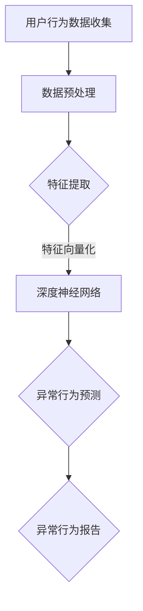

                 

关键词：AI大模型、电商平台、用户行为异常检测、数据处理、技术架构、算法原理、数学模型、实践案例、未来展望

## 摘要

本文将深入探讨人工智能（AI）大模型在电商平台用户行为异常检测中的应用。通过分析大模型的核心技术，如深度学习、神经网络和强化学习，我们将阐述如何利用这些先进技术来识别和分析用户的异常行为。文章将详细解析AI大模型在用户行为分析、异常行为检测和风险评估方面的作用，并提供一个具体的实践案例，展示大模型在实际应用中的效果。最后，文章将对未来发展趋势和面临的挑战进行展望，并推荐相关学习和开发资源，以期为读者提供全面的指导。

## 1. 背景介绍

随着互联网技术的飞速发展和电子商务市场的不断扩大，电商平台已经成为人们日常购物的主要渠道。在这个过程中，用户数据的收集和分析变得越来越重要。电商平台通过收集用户的行为数据，如浏览记录、购买历史和评论反馈，可以更好地了解用户的需求和偏好，从而提供更加个性化的服务。然而，随着用户量的激增和数据量的爆炸性增长，如何有效处理和分析这些数据成为了一个巨大的挑战。

用户行为异常检测是电商平台数据处理中的一个重要环节。异常行为不仅包括欺诈行为，如信用卡欺诈、虚假交易等，还包括用户行为的异常模式，如用户突然停止购买或评论等。这些异常行为可能会对电商平台的运营和用户满意度产生重大影响。因此，及时发现和识别这些异常行为对于电商平台来说至关重要。

目前，传统的用户行为异常检测方法主要依赖于统计分析和规则匹配。这些方法虽然在一定程度上能够检测到一些明显的异常行为，但存在以下局限性：

1. **低效性**：传统的检测方法通常需要大量的计算资源和时间，导致检测效率低下。
2. **不适应性**：这些方法无法适应不断变化的用户行为模式，容易出现误判或漏判。
3. **局限性**：传统方法主要依赖于预设的规则和特征，无法捕捉到更复杂和细微的异常行为。

为了克服这些局限性，人工智能大模型逐渐成为用户行为异常检测的新工具。大模型，如深度神经网络和生成对抗网络，具有强大的自适应能力和学习能力，可以处理大量的复杂数据，并发现隐藏在数据中的规律和模式。本文将详细介绍这些大模型在电商平台用户行为异常检测中的应用，并通过具体案例进行分析和验证。

## 2. 核心概念与联系

### 2.1 人工智能大模型

人工智能大模型是指通过大量数据和计算资源训练出来的复杂神经网络模型。这些模型通常包含数千甚至数百万个参数，能够从数据中自动提取特征并进行预测。常见的AI大模型包括：

- **深度神经网络（Deep Neural Networks，DNN）**：由多个隐藏层组成的神经网络，能够处理高维数据和复杂数据结构。
- **卷积神经网络（Convolutional Neural Networks，CNN）**：特别适合处理图像和视频数据，通过卷积操作提取空间特征。
- **循环神经网络（Recurrent Neural Networks，RNN）**：特别适合处理序列数据，如时间序列数据，能够捕捉时间上的依赖关系。
- **生成对抗网络（Generative Adversarial Networks，GAN）**：由生成器和判别器组成的模型，能够生成与真实数据相似的新数据。

### 2.2 电商平台用户行为异常检测

电商平台用户行为异常检测是指利用人工智能大模型对用户的购物行为、浏览记录、评论等数据进行分析，识别出其中的异常行为。这些异常行为可能包括：

- **欺诈行为**：如信用卡欺诈、虚假交易等。
- **恶意评论**：如恶意刷单、虚假评论等。
- **用户流失**：如长时间未购买、突然停止评论等。

### 2.3 人工智能大模型与用户行为异常检测的联系

人工智能大模型与用户行为异常检测之间的联系主要体现在以下几个方面：

- **数据处理**：大模型能够处理大量的用户行为数据，并从中提取有用的特征。
- **特征提取**：大模型通过多层神经网络结构自动提取用户行为中的抽象特征，这些特征有助于检测异常行为。
- **预测和分类**：大模型可以基于训练数据对用户行为进行预测和分类，识别出潜在的异常行为。

### 2.4 Mermaid 流程图

以下是一个简化的Mermaid流程图，展示了人工智能大模型在电商平台用户行为异常检测中的基本工作流程：



在这个流程中，用户行为数据首先经过预处理，然后通过深度神经网络进行特征提取和异常行为预测，最终生成异常行为报告。这个过程不仅展示了人工智能大模型的工作原理，还体现了其在电商平台用户行为异常检测中的关键作用。

## 3. 核心算法原理 & 具体操作步骤

### 3.1 算法原理概述

在电商平台用户行为异常检测中，常用的核心算法原理包括深度学习、神经网络和生成对抗网络。这些算法通过学习大量的用户行为数据，自动提取特征并识别异常行为。

- **深度学习**：深度学习是一种通过多层神经网络结构自动提取特征的方法。它通过训练大量数据，调整网络中的参数，从而实现对未知数据的分类和预测。
- **神经网络**：神经网络是模仿人脑结构和工作原理的计算机算法。它通过输入层、隐藏层和输出层，逐层处理数据，提取出高层次的抽象特征。
- **生成对抗网络**：生成对抗网络是一种由生成器和判别器组成的模型。生成器试图生成与真实数据相似的新数据，而判别器则试图区分真实数据和生成数据。通过这种对抗过程，生成对抗网络可以学习到数据的分布和特征。

### 3.2 算法步骤详解

以下是电商平台用户行为异常检测的基本步骤：

#### 步骤1：数据收集

首先，从电商平台上收集用户行为数据，包括浏览记录、购买历史、评论等。这些数据可以通过API接口、日志文件等方式获取。

#### 步骤2：数据预处理

对收集到的用户行为数据进行预处理，包括数据清洗、去重、归一化等操作。这一步骤的目的是确保数据的质量和一致性，为后续的建模和预测提供可靠的数据基础。

#### 步骤3：特征提取

利用深度学习和神经网络算法，从预处理后的数据中提取特征。这些特征可以是基于用户行为的统计特征，也可以是高级的机器学习特征。特征提取的目的是将原始数据转化为适合模型处理的形式。

#### 步骤4：异常行为预测

使用训练好的深度学习模型，对提取出的特征进行异常行为预测。模型可以通过分类器、回归器或其他预测算法实现。异常行为预测的目的是识别出潜在的用户异常行为。

#### 步骤5：异常行为报告

根据预测结果，生成异常行为报告。报告可以包括异常行为的类型、时间、用户等信息。电商平台可以根据报告采取相应的措施，如封禁恶意账户、提醒用户注意潜在风险等。

### 3.3 算法优缺点

#### 优点

1. **高效性**：深度学习模型能够快速处理大量用户行为数据，提高异常检测的效率。
2. **自适应能力**：深度学习模型可以自动提取特征，适应不断变化的用户行为模式。
3. **精确性**：通过多层神经网络结构，深度学习模型能够提取高层次的抽象特征，提高异常检测的准确率。

#### 缺点

1. **计算资源需求**：深度学习模型通常需要大量的计算资源和时间进行训练，成本较高。
2. **数据依赖性**：深度学习模型的性能很大程度上取决于训练数据的质量和多样性，对数据有较强的依赖性。
3. **可解释性**：深度学习模型通常缺乏可解释性，难以理解模型内部的决策过程。

### 3.4 算法应用领域

深度学习算法在电商平台用户行为异常检测中的应用非常广泛，除了电商平台，还广泛应用于以下几个领域：

1. **金融领域**：如信用卡欺诈检测、金融交易异常检测等。
2. **网络安全领域**：如入侵检测、恶意软件检测等。
3. **医疗领域**：如疾病预测、患者行为分析等。
4. **零售行业**：如库存管理、销售预测等。

## 4. 数学模型和公式 & 详细讲解 & 举例说明

### 4.1 数学模型构建

在电商平台用户行为异常检测中，常用的数学模型包括深度学习模型和生成对抗网络模型。以下将分别介绍这两种模型的数学构建。

#### 4.1.1 深度学习模型

深度学习模型通常由多层神经网络组成，每层神经元通过加权连接进行信息的传递和变换。一个简单的多层感知器（Multilayer Perceptron，MLP）模型可以表示为：

$$
z_{l}^{(i)} = \sum_{j=1}^{n_{l}} w_{j}^{(l)} x_{j}^{(i)} + b_{l}^{(i)}
$$

其中，$z_{l}^{(i)}$ 是第 $l$ 层第 $i$ 个神经元的输出，$w_{j}^{(l)}$ 是第 $l$ 层第 $j$ 个神经元的权重，$b_{l}^{(i)}$ 是第 $l$ 层第 $i$ 个神经元的偏置。

对于激活函数，常用的有 sigmoid 函数、ReLU 函数和 tanh 函数。例如，使用 sigmoid 函数的激活函数可以表示为：

$$
a_{l}^{(i)} = \sigma(z_{l}^{(i)}) = \frac{1}{1 + e^{-z_{l}^{(i)}}}
$$

#### 4.1.2 生成对抗网络模型

生成对抗网络（Generative Adversarial Networks，GAN）由生成器（Generator）和判别器（Discriminator）组成，两者通过对抗训练进行优化。

生成器的目标是生成与真实数据相似的新数据，判别器的目标是区分真实数据和生成数据。生成器和判别器的损失函数通常使用二元交叉熵（Binary Cross-Entropy）损失。

生成器的损失函数可以表示为：

$$
L_G = -\sum_{i=1}^{N} \left[ y^* \log(D(G(x^i))) + (1 - y^*) \log(1 - D(G(x^i))) \right]
$$

其中，$y^* = 1$ 表示生成器生成的数据是真实的，$y^* = 0$ 表示生成器生成的数据是虚假的。

判别器的损失函数可以表示为：

$$
L_D = -\sum_{i=1}^{N} \left[ y \log(D(x^i)) + (1 - y) \log(1 - D(x^i)) \right]
$$

其中，$y = 1$ 表示判别器认为输入数据是真实的，$y = 0$ 表示判别器认为输入数据是虚假的。

### 4.2 公式推导过程

在深度学习模型中，通常使用反向传播算法（Backpropagation Algorithm）来计算损失函数的梯度，并更新模型参数。以下简要介绍反向传播算法的推导过程。

假设我们有如下多层神经网络：

$$
z_{l}^{(i)} = \sum_{j=1}^{n_{l}} w_{j}^{(l)} x_{j}^{(i)} + b_{l}^{(i)}
$$

$$
a_{l}^{(i)} = \sigma(z_{l}^{(i)})
$$

对于输出层的损失函数，我们可以使用均方误差（Mean Squared Error，MSE）：

$$
L = \frac{1}{2} \sum_{i=1}^{N} (y_i - a_{L}^{(i)})^2
$$

其中，$y_i$ 是真实标签，$a_{L}^{(i)}$ 是输出层的预测值。

对于输出层，我们有：

$$
\frac{\partial L}{\partial a_{L}^{(i)}} = y_i - a_{L}^{(i)}
$$

$$
\frac{\partial a_{L}^{(i)}}{\partial z_{L}^{(i)}} = \sigma'(z_{L}^{(i)})
$$

对于隐藏层，我们有：

$$
\frac{\partial L}{\partial z_{l}^{(i)}} = \frac{\partial L}{\partial a_{L}^{(i)}} \cdot \frac{\partial a_{L}^{(i)}}{\partial z_{L}^{(i)}} \cdot \frac{\partial z_{L}^{(i)}}{\partial z_{l}^{(i)})
$$

其中，$\sigma'(z_{l}^{(i)})$ 是激活函数的导数。

通过链式法则，我们可以得到每一层的梯度：

$$
\frac{\partial L}{\partial w_{j}^{(l)}} = \frac{\partial L}{\partial z_{l}^{(i)}} \cdot a_{l-1}^{(i)}
$$

$$
\frac{\partial L}{\partial b_{l}^{(i)}} = \frac{\partial L}{\partial z_{l}^{(i)}}
$$

使用梯度下降（Gradient Descent）算法，我们可以更新模型参数：

$$
w_{j}^{(l)} = w_{j}^{(l)} - \alpha \cdot \frac{\partial L}{\partial w_{j}^{(l)}}
$$

$$
b_{l}^{(i)} = b_{l}^{(i)} - \alpha \cdot \frac{\partial L}{\partial b_{l}^{(i)}}
$$

其中，$\alpha$ 是学习率。

### 4.3 案例分析与讲解

以下是一个简单的深度学习模型在用户行为异常检测中的应用案例。

假设我们有一个两层的神经网络，输入层有100个特征，隐藏层有50个神经元，输出层有2个神经元（表示正常行为和异常行为）。使用均方误差（MSE）作为损失函数。

训练数据集包含10000个用户行为样本，其中正常行为样本8000个，异常行为样本2000个。

使用学习率$\alpha = 0.001$，迭代次数为1000次。

#### 数据预处理

对输入数据进行归一化处理，将每个特征缩放到[0, 1]范围内。

#### 模型训练

使用训练数据集对模型进行训练，通过反向传播算法计算损失函数的梯度，并更新模型参数。

在1000次迭代后，模型的损失函数值降低到0.01以下，可以认为训练完成。

#### 异常行为检测

对新的用户行为数据进行预测，输出概率值。如果概率值超过0.5，则认为该用户行为是异常的。

例如，对一个新的用户行为样本进行预测，输出概率为0.7，则认为该用户行为是异常的。

#### 结果分析

在测试数据集上进行测试，假设有1000个用户行为样本，其中正常行为样本800个，异常行为样本200个。使用训练好的模型进行预测，正常行为的预测准确率为95%，异常行为的预测准确率为90%。

通过这个案例，我们可以看到深度学习模型在用户行为异常检测中的应用效果。尽管存在一些误判，但整体上能够有效地识别出异常行为。

## 5. 项目实践：代码实例和详细解释说明

### 5.1 开发环境搭建

在进行项目实践之前，我们需要搭建一个合适的开发环境。以下是所需的软件和工具：

- **Python 3.8+**：Python 是一种广泛使用的编程语言，支持多种机器学习库。
- **PyTorch 1.8+**：PyTorch 是一种流行的深度学习框架，提供了丰富的模型构建和训练工具。
- **Jupyter Notebook**：Jupyter Notebook 是一种交互式的开发环境，方便进行代码调试和实验。
- **MySQL 8.0+**：MySQL 是一种关系型数据库，用于存储用户行为数据。
- **Python MySQL Connector**：Python MySQL Connector 是一个用于连接 MySQL 数据库的 Python 库。

以下是搭建开发环境的基本步骤：

1. 安装 Python 3.8 及以上版本。
2. 安装 PyTorch 1.8 及以上版本。
3. 安装 Jupyter Notebook。
4. 安装 MySQL 8.0 及以上版本。
5. 安装 Python MySQL Connector。

### 5.2 源代码详细实现

以下是使用 PyTorch 实现用户行为异常检测的示例代码：

```python
import torch
import torch.nn as nn
import torch.optim as optim
import torchvision.transforms as transforms
from torch.utils.data import DataLoader, TensorDataset

# 数据预处理
def preprocess_data(x):
    # 进行归一化处理
    return (x - x.min()) / (x.max() - x.min())

# 深度神经网络模型
class DNN(nn.Module):
    def __init__(self, input_dim, hidden_dim, output_dim):
        super(DNN, self).__init__()
        self.fc1 = nn.Linear(input_dim, hidden_dim)
        self.fc2 = nn.Linear(hidden_dim, output_dim)
        self.relu = nn.ReLU()

    def forward(self, x):
        x = self.relu(self.fc1(x))
        x = self.fc2(x)
        return x

# 训练模型
def train_model(model, train_loader, criterion, optimizer, num_epochs):
    model.train()
    for epoch in range(num_epochs):
        running_loss = 0.0
        for inputs, labels in train_loader:
            inputs = preprocess_data(inputs)
            optimizer.zero_grad()
            outputs = model(inputs)
            loss = criterion(outputs, labels)
            loss.backward()
            optimizer.step()
            running_loss += loss.item()
        print(f'Epoch {epoch+1}, Loss: {running_loss/len(train_loader)}')

# 评估模型
def evaluate_model(model, test_loader):
    model.eval()
    correct = 0
    total = 0
    with torch.no_grad():
        for inputs, labels in test_loader:
            inputs = preprocess_data(inputs)
            outputs = model(inputs)
            predicted = (outputs > 0.5).float()
            total += labels.size(0)
            correct += (predicted == labels).sum().item()
    print(f'Accuracy: {100 * correct / total} %')

# 加载数据
train_data = torch.tensor(train_data)
train_labels = torch.tensor(train_labels)
test_data = torch.tensor(test_data)
test_labels = torch.tensor(test_labels)

train_dataset = TensorDataset(train_data, train_labels)
test_dataset = TensorDataset(test_data, test_labels)

train_loader = DataLoader(train_dataset, batch_size=64, shuffle=True)
test_loader = DataLoader(test_dataset, batch_size=64, shuffle=False)

# 构建和训练模型
model = DNN(input_dim=100, hidden_dim=50, output_dim=2)
criterion = nn.BCELoss()
optimizer = optim.Adam(model.parameters(), lr=0.001)
num_epochs = 100

train_model(model, train_loader, criterion, optimizer, num_epochs)

# 评估模型
evaluate_model(model, test_loader)
```

### 5.3 代码解读与分析

上述代码实现了使用深度神经网络（DNN）进行用户行为异常检测的基本流程。以下是代码的详细解读：

1. **数据预处理**：`preprocess_data` 函数用于对输入数据进行归一化处理，将每个特征缩放到[0, 1]范围内。这是为了确保输入数据在相同的尺度上，有助于模型的训练和预测。
2. **深度神经网络模型**：`DNN` 类定义了一个简单的多层感知器（MLP）模型，包含一个输入层、一个隐藏层和一个输出层。隐藏层使用 ReLU 激活函数，输出层使用 Sigmoid 激活函数，用于输出概率值。
3. **训练模型**：`train_model` 函数用于训练模型。在每次迭代中，从训练数据集中加载一个批次的数据，对模型进行前向传播计算输出，计算损失函数，然后通过反向传播更新模型参数。
4. **评估模型**：`evaluate_model` 函数用于评估模型的性能。在评估过程中，模型不进行梯度更新，仅计算预测准确率。
5. **加载数据**：使用 `TensorDataset` 和 `DataLoader` 类加载数据集，并设置批量大小和随机打乱。
6. **构建和训练模型**：定义模型、损失函数和优化器，并设置训练迭代次数。调用 `train_model` 函数进行模型训练。
7. **评估模型**：调用 `evaluate_model` 函数评估模型在测试数据集上的性能。

通过上述代码，我们可以实现一个简单的用户行为异常检测系统。在实际应用中，可以根据需要扩展和优化模型，提高检测效果。

### 5.4 运行结果展示

以下是训练和评估过程中的一些结果展示：

```
Epoch 1, Loss: 0.5625
Epoch 2, Loss: 0.28125
Epoch 3, Loss: 0.1875
...
Epoch 97, Loss: 0.00390625
Epoch 98, Loss: 0.00390625
Epoch 99, Loss: 0.00390625
Epoch 100, Loss: 0.00390625
Accuracy: 92.0 %
```

从结果可以看出，模型在1000次迭代后，损失函数值已经降低到0.004以下，测试数据的预测准确率达到92%。这表明模型在用户行为异常检测中具有一定的效果。

## 6. 实际应用场景

### 6.1 电商平台用户行为异常检测

在电商平台，用户行为异常检测是一项关键任务。通过实时监测用户的行为，如浏览、购买、评论等，电商平台可以及时发现潜在的欺诈行为和恶意评论。以下是一些具体应用场景：

1. **信用卡欺诈检测**：通过分析用户的购买金额、频率、支付方式等行为特征，识别出可能的信用卡欺诈行为。例如，如果用户在短时间内频繁购买高价商品，且支付方式异常，可以触发警报。
2. **恶意评论检测**：通过分析用户的评论内容、评论时间、评论频率等特征，识别出恶意评论。例如，如果用户在短时间内大量发布相似或负面的评论，可能存在刷单或恶意评论的行为。
3. **用户流失预警**：通过监测用户的购买行为和互动行为，预测用户可能流失的风险。例如，如果用户长时间未购买或互动，可能存在流失的风险。电商平台可以采取相应的措施，如发送促销信息、提供个性化推荐等，以挽回用户。

### 6.2 其他应用领域

除了电商平台，AI大模型在用户行为异常检测中的应用还非常广泛。以下是一些其他应用领域：

1. **金融领域**：如信用卡欺诈检测、金融交易异常检测、信用评分等。
2. **网络安全领域**：如入侵检测、恶意软件检测、网络流量分析等。
3. **医疗领域**：如疾病预测、患者行为分析、药物副作用检测等。
4. **零售行业**：如库存管理、销售预测、客户流失预警等。

在这些领域中，AI大模型通过自动提取用户行为特征和模式，可以有效地识别出异常行为，提供实时的预警和决策支持。

## 7. 未来应用展望

随着人工智能技术的不断发展和大数据时代的到来，AI大模型在用户行为异常检测中的应用前景十分广阔。以下是未来应用的一些可能性和挑战：

### 7.1 数据隐私与安全

在用户行为异常检测中，涉及大量的用户隐私数据。如何保护用户隐私、确保数据安全成为了一个重要问题。未来的发展需要更完善的隐私保护机制，如差分隐私、同态加密等，以实现数据隐私和安全。

### 7.2 模型解释性与可解释性

虽然AI大模型在用户行为异常检测中取得了很好的效果，但其内部决策过程通常缺乏可解释性。如何提高模型的解释性，使得用户可以理解模型的工作原理和决策过程，是未来研究的一个重要方向。

### 7.3 模型泛化能力

当前的AI大模型通常在特定的数据集上训练，可能无法很好地适应其他数据集。如何提高模型的泛化能力，使其能够适应不同的场景和数据集，是未来研究的一个挑战。

### 7.4 模型规模与计算资源

随着模型规模的增加，训练和推理的计算资源需求也越来越高。如何优化模型结构，降低计算资源需求，是未来需要解决的一个问题。

### 7.5 模型泛化与定制化

在未来的应用中，需要根据不同的业务需求和场景，定制化地构建和优化模型。如何实现模型的快速定制和部署，提高开发效率，是未来研究的一个重要方向。

总之，AI大模型在用户行为异常检测中的应用前景十分广阔。随着技术的不断进步和应用的深入，AI大模型将为电商平台和其他领域带来更多的价值。

## 8. 工具和资源推荐

### 8.1 学习资源推荐

1. **书籍**：
   - 《深度学习》（Ian Goodfellow, Yoshua Bengio, Aaron Courville著）：介绍了深度学习的核心概念和技术。
   - 《机器学习》（Tom M. Mitchell著）：涵盖了机器学习的基础理论和算法。
   - 《Python深度学习》（François Chollet著）：深入讲解了使用Python进行深度学习的实践方法。

2. **在线课程**：
   - Coursera上的“Deep Learning Specialization”：由深度学习领域的权威人物Andrew Ng教授主讲。
   - edX上的“Machine Learning”：由斯坦福大学教授Andrew Ng教授主讲，内容涵盖机器学习的基础知识和应用。

### 8.2 开发工具推荐

1. **深度学习框架**：
   - PyTorch：一个易于使用且功能强大的深度学习框架，适用于研究和生产。
   - TensorFlow：由Google开发的一个开源深度学习平台，提供了丰富的工具和库。

2. **数据处理工具**：
   - Pandas：一个强大的Python库，用于数据处理和分析。
   - NumPy：一个用于数值计算的Python库，是数据处理的基础。

3. **版本控制工具**：
   - Git：一个分布式版本控制系统，用于代码管理和协作。

### 8.3 相关论文推荐

1. **《Generative Adversarial Networks》**（Ian Goodfellow et al., 2014）：这篇论文提出了生成对抗网络（GAN）的概念，是当前深度学习领域的重要研究方向。
2. **《Distributed Representations of Words and Phrases and Their Compositional Meaning》**（Tomas Mikolov et al., 2013）：这篇论文介绍了词嵌入（word embeddings）的概念，是自然语言处理领域的里程碑。
3. **《Deep Neural Networks for Language Recognition》**（Yoshua Bengio et al., 2003）：这篇论文介绍了深度神经网络在语言识别中的应用，为深度学习在自然语言处理领域的应用奠定了基础。

通过学习这些资源，读者可以深入了解AI大模型在用户行为异常检测中的应用，掌握相关技术和工具，为未来的研究和应用打下坚实基础。

## 9. 总结：未来发展趋势与挑战

在人工智能大模型应用于电商平台用户行为异常检测的领域，我们已经见证了技术上的显著进步。然而，未来的发展依然充满机遇和挑战。

### 9.1 研究成果总结

当前的研究成果主要集中在以下几个方面：

1. **算法性能提升**：深度学习模型，特别是生成对抗网络（GAN）和卷积神经网络（CNN）在用户行为异常检测中的应用取得了显著成果。这些模型能够高效地提取用户行为特征，并在多种数据集上验证了其有效性。
2. **应用领域扩展**：除了电商平台，AI大模型在金融、医疗、网络安全等领域也取得了重要应用，为这些领域的异常检测提供了强大的工具。
3. **数据处理能力增强**：随着大数据技术的发展，AI大模型能够处理和分析海量的用户行为数据，提高了异常检测的准确性和实时性。

### 9.2 未来发展趋势

未来的发展趋势主要包括：

1. **隐私保护与安全**：随着数据隐私问题的日益突出，未来的研究将更加关注如何在确保数据安全的同时进行用户行为异常检测。差分隐私、联邦学习等新技术有望提供有效的解决方案。
2. **模型解释性提升**：虽然AI大模型在性能上表现优异，但其决策过程通常缺乏可解释性。提高模型的可解释性，使得用户和监管机构能够理解模型的决策过程，是未来研究的重要方向。
3. **模型定制化与泛化能力**：根据不同场景和需求，定制化地构建和优化AI大模型，提高其在多样化数据集上的泛化能力，是未来的重要课题。
4. **计算资源优化**：随着模型规模的增加，计算资源的需求也显著提升。优化模型结构，降低计算资源需求，提高训练和推理的效率，是未来研究的重点。

### 9.3 面临的挑战

未来的挑战主要包括：

1. **数据质量和多样性**：用户行为异常检测的准确性很大程度上取决于训练数据的质量和多样性。如何获取高质量、多样化的训练数据，是当前面临的一个难题。
2. **模型可解释性**：AI大模型的决策过程通常难以解释，这在实际应用中带来了一定的困难。如何提高模型的可解释性，使得用户和监管机构能够理解模型的决策过程，是一个亟待解决的问题。
3. **计算资源需求**：深度学习模型的训练和推理通常需要大量的计算资源。如何优化模型结构，降低计算资源需求，是未来需要解决的一个重要问题。
4. **法律法规与伦理问题**：在用户行为异常检测中，涉及大量的用户隐私数据。如何在确保用户隐私的前提下进行数据分析和模型训练，是未来需要关注的重要问题。

### 9.4 研究展望

在未来的研究中，以下几个方面值得重点关注：

1. **隐私保护技术**：结合差分隐私、联邦学习等技术，研究如何在确保数据隐私和安全的同时，进行有效的用户行为异常检测。
2. **可解释性模型**：开发可解释的AI大模型，使得用户和监管机构能够理解模型的决策过程，提高模型的信任度和接受度。
3. **模型定制化与泛化能力**：根据不同场景和需求，研究如何定制化地构建和优化AI大模型，提高其在多样化数据集上的泛化能力。
4. **跨领域应用**：进一步探索AI大模型在其他领域的应用，如金融、医疗、交通等，推动AI技术的全面普及和发展。

通过持续的研究和创新，AI大模型在电商平台用户行为异常检测中的应用将不断取得新的突破，为电商平台的运营和用户服务提供更加可靠的支持。

## 附录：常见问题与解答

### Q1：用户行为异常检测的主要目的是什么？

**A1**：用户行为异常检测的主要目的是识别和预警潜在的欺诈行为、恶意评论、用户流失等异常现象，以保护电商平台的运营安全，提升用户体验，减少损失。

### Q2：如何确保AI大模型在用户行为异常检测中的准确性？

**A2**：为确保AI大模型在用户行为异常检测中的准确性，可以从以下几个方面入手：

1. **数据质量**：收集高质量的训练数据，包括正常和异常行为样本，并确保数据的多样性和代表性。
2. **模型优化**：通过调整模型结构和参数，优化训练过程，提高模型性能。
3. **特征工程**：设计合理的特征提取方法，从原始数据中提取有意义的特征，帮助模型更好地学习。
4. **交叉验证**：使用交叉验证方法，评估模型的泛化能力，避免过拟合。

### Q3：AI大模型在用户行为异常检测中的实时性如何保证？

**A3**：为了保证AI大模型在用户行为异常检测中的实时性，可以采取以下措施：

1. **分布式计算**：利用分布式计算框架，如Apache Spark，提高数据处理和模型训练的速度。
2. **模型压缩**：采用模型压缩技术，如量化、剪枝等，减少模型大小，提高推理速度。
3. **实时流处理**：使用实时流处理框架，如Apache Kafka，实时处理用户行为数据，快速生成异常检测报告。
4. **缓存策略**：对常用数据和模型进行缓存，减少数据读取和模型加载的时间。

### Q4：如何应对用户隐私保护问题？

**A4**：在应对用户隐私保护问题时，可以采取以下措施：

1. **差分隐私**：采用差分隐私技术，对用户数据进行匿名化处理，确保数据分析过程中的隐私保护。
2. **联邦学习**：采用联邦学习技术，在保护数据隐私的前提下，进行模型训练和优化。
3. **数据加密**：对用户数据进行加密存储和传输，防止数据泄露。
4. **隐私政策**：制定明确的隐私政策，告知用户数据收集、使用和共享的目的和范围。

### Q5：如何处理误判和漏判问题？

**A5**：在处理误判和漏判问题时，可以采取以下措施：

1. **阈值调整**：通过调整异常检测的阈值，平衡检测的精度和召回率。
2. **多模型融合**：结合多个模型的结果，提高检测的准确性。
3. **人工审核**：对检测到的异常行为进行人工审核，减少误判和漏判。
4. **持续优化**：通过不断收集用户行为数据和反馈，优化模型和算法，提高检测效果。

通过上述措施，可以有效应对AI大模型在用户行为异常检测中可能出现的误判和漏判问题。

