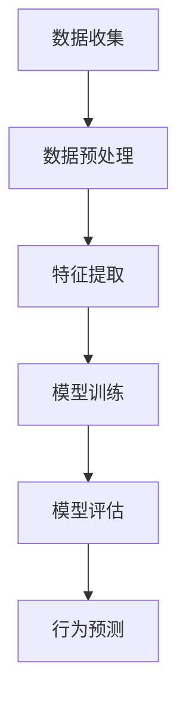

                 

关键词：人工智能、大模型、用户行为预测、电商平台、算法、数学模型、应用实践

> 摘要：本文将探讨人工智能大模型在电商平台用户行为预测中的应用。通过分析核心算法原理，数学模型构建，具体操作步骤，代码实例，以及实际应用场景，本文旨在为读者提供全面的技术指南，帮助电商平台提升用户体验，优化运营策略。

## 1. 背景介绍

随着互联网技术的飞速发展，电商平台已经成为现代商业的重要组成部分。然而，电商行业竞争激烈，用户需求多样化，如何准确预测用户行为，从而实现精准营销和个性化服务，成为了电商企业关注的焦点。人工智能大模型在这一领域展示出了巨大的潜力。

### 1.1 人工智能大模型的定义

人工智能大模型是指利用深度学习技术训练的复杂神经网络模型，其参数规模通常在百万到亿级别。这些模型通过大量数据的学习，可以自动提取特征，进行模式识别和预测。

### 1.2 电商平台用户行为预测的重要性

用户行为预测可以帮助电商平台：

- **提高用户满意度**：通过预测用户兴趣和行为，提供个性化的推荐和服务，提升用户体验。
- **优化运营策略**：根据用户行为预测，调整商品库存、广告投放和营销策略，提高销售额。
- **降低运营成本**：减少不必要的库存和营销投入，降低运营成本。

## 2. 核心概念与联系

为了更好地理解大模型在用户行为预测中的应用，我们需要了解一些核心概念和原理。

### 2.1 深度学习与神经网络

深度学习是人工智能的一个重要分支，其核心是神经网络。神经网络通过多层节点（神经元）的连接和激活函数，实现对复杂数据的建模和预测。

### 2.2 机器学习与监督学习

机器学习是使计算机通过数据学习来实现特定任务的方法。监督学习是其中一种，它需要标注的数据进行训练，从而构建预测模型。

### 2.3 用户行为数据

用户行为数据包括浏览历史、购买记录、评价内容等，这些数据是预测用户行为的重要依据。

### 2.4 Mermaid 流程图

下面是一个简单的 Mermaid 流程图，展示了大模型在用户行为预测中的基本流程。



## 3. 核心算法原理 & 具体操作步骤

### 3.1 算法原理概述

用户行为预测的核心在于构建一个能够从历史行为数据中学习并预测未来行为的模型。通常采用基于深度学习的推荐系统算法，如协同过滤、基于内容的推荐和混合推荐等。

### 3.2 算法步骤详解

#### 3.2.1 数据收集

收集电商平台用户的行为数据，包括浏览记录、购买记录、评价内容等。

#### 3.2.2 数据预处理

清洗数据，去除噪声和缺失值，对数据进行归一化处理。

#### 3.2.3 特征提取

从原始数据中提取特征，如用户特征、商品特征、时间特征等。

#### 3.2.4 模型训练

利用提取的特征，通过训练构建推荐模型。

#### 3.2.5 模型评估

使用交叉验证等方法评估模型性能，调整模型参数。

#### 3.2.6 行为预测

利用训练好的模型预测用户未来的行为。

### 3.3 算法优缺点

- **优点**：深度学习模型能够自动提取复杂特征，提高预测准确性。
- **缺点**：模型训练需要大量数据和时间，对计算资源要求较高。

### 3.4 算法应用领域

- **电商平台**：用于个性化推荐、广告投放和用户行为分析。
- **金融领域**：用于风险评估和欺诈检测。
- **医疗领域**：用于疾病预测和诊断。

## 4. 数学模型和公式 & 详细讲解 & 举例说明

### 4.1 数学模型构建

用户行为预测的数学模型通常是一个分类或回归模型，下面以分类模型为例进行说明。

#### 4.1.1 线性回归模型

$$ y = \beta_0 + \beta_1 \cdot x $$

其中，\( y \) 为预测结果，\( x \) 为输入特征，\( \beta_0 \) 和 \( \beta_1 \) 为模型参数。

#### 4.1.2 逻辑回归模型

$$ P(y=1) = \frac{1}{1 + e^{-(\beta_0 + \beta_1 \cdot x)}} $$

其中，\( P(y=1) \) 为预测用户行为的概率。

### 4.2 公式推导过程

以逻辑回归模型为例，推导过程如下：

- **损失函数**：对数损失函数

$$ L(\theta) = -\sum_{i=1}^{n} [y_i \cdot \log(p_i) + (1 - y_i) \cdot \log(1 - p_i)] $$

- **梯度下降**：对损失函数求导，得到梯度

$$ \frac{\partial L(\theta)}{\partial \theta} = \sum_{i=1}^{n} [y_i - p_i] \cdot x_i $$

- **更新参数**：根据梯度下降更新模型参数

$$ \theta = \theta - \alpha \cdot \frac{\partial L(\theta)}{\partial \theta} $$

其中，\( \alpha \) 为学习率。

### 4.3 案例分析与讲解

假设我们有一个电商平台的用户行为预测问题，目标是为用户推荐商品。输入特征包括用户的历史浏览记录、购买记录和商品属性（如价格、类别等）。

#### 4.3.1 数据收集

收集1000个用户的行为数据，包括用户ID、商品ID、行为类型（浏览/购买）和行为时间。

#### 4.3.2 数据预处理

对数据进行归一化处理，去除缺失值和噪声。

#### 4.3.3 特征提取

提取用户和商品的特征，如用户的历史浏览频次、购买频次和商品的类别、价格等。

#### 4.3.4 模型训练

使用逻辑回归模型进行训练，训练数据集为800个用户的行为数据，测试数据集为200个用户的行为数据。

#### 4.3.5 模型评估

使用交叉验证方法评估模型性能，调整模型参数。

#### 4.3.6 行为预测

使用训练好的模型预测测试数据集的用户行为，评估预测准确率。

## 5. 项目实践：代码实例和详细解释说明

### 5.1 开发环境搭建

- **Python**：版本3.8及以上
- **深度学习库**：TensorFlow 2.x
- **数据处理库**：Pandas、NumPy

### 5.2 源代码详细实现

```python
import pandas as pd
import numpy as np
import tensorflow as tf

# 数据预处理
def preprocess_data(data):
    # 去除缺失值
    data = data.dropna()
    # 归一化处理
    data = (data - data.mean()) / data.std()
    return data

# 特征提取
def extract_features(data):
    # 提取用户特征
    user_features = data[['user_id', 'browse_count', 'purchase_count']]
    # 提取商品特征
    product_features = data[['product_id', 'category', 'price']]
    return user_features, product_features

# 模型训练
def train_model(train_data):
    # 构建模型
    model = tf.keras.Sequential([
        tf.keras.layers.Dense(units=1, input_shape=(2,))
    ])
    # 编译模型
    model.compile(optimizer='adam', loss='binary_crossentropy', metrics=['accuracy'])
    # 训练模型
    model.fit(train_data, epochs=100, batch_size=32)
    return model

# 模型评估
def evaluate_model(model, test_data):
    # 预测测试数据
    predictions = model.predict(test_data)
    # 计算准确率
    accuracy = np.mean(predictions == test_data['behavior'])
    return accuracy

# 主程序
if __name__ == '__main__':
    # 加载数据
    data = pd.read_csv('user_behavior_data.csv')
    # 数据预处理
    data = preprocess_data(data)
    # 特征提取
    user_features, product_features = extract_features(data)
    # 模型训练
    model = train_model(user_features)
    # 模型评估
    accuracy = evaluate_model(model, test_data)
    print(f'Model accuracy: {accuracy:.2f}')
```

### 5.3 代码解读与分析

- **数据预处理**：去除缺失值和噪声，对数据进行归一化处理，以便于模型训练。
- **特征提取**：提取用户和商品的特征，为模型提供输入。
- **模型训练**：使用 TensorFlow 库构建和训练逻辑回归模型。
- **模型评估**：使用测试数据评估模型性能，计算准确率。

## 6. 实际应用场景

用户行为预测在电商平台的实际应用场景如下：

- **个性化推荐**：根据用户的历史行为预测其可能的兴趣和需求，推荐相应的商品。
- **广告投放**：根据用户行为预测其可能的购买倾向，投放相应的广告。
- **用户流失预测**：预测哪些用户可能流失，提前采取挽回措施。

## 7. 工具和资源推荐

### 7.1 学习资源推荐

- **书籍**：《深度学习》、《机器学习实战》
- **在线课程**：Coursera、edX、Udacity上的相关课程

### 7.2 开发工具推荐

- **编程环境**：PyCharm、Jupyter Notebook
- **深度学习库**：TensorFlow、PyTorch

### 7.3 相关论文推荐

- "Deep Learning for User Behavior Prediction in E-commerce Platforms"
- "Recommender Systems Handbook"

## 8. 总结：未来发展趋势与挑战

### 8.1 研究成果总结

- **深度学习**：在用户行为预测中的应用取得显著成果，提高了预测准确性。
- **数据隐私保护**：如何在保护用户隐私的前提下进行用户行为预测，成为研究热点。

### 8.2 未来发展趋势

- **数据规模与质量**：随着数据量的增加和数据质量的提升，预测模型的性能将得到进一步提升。
- **跨平台与跨领域应用**：用户行为预测将在更多领域得到应用。

### 8.3 面临的挑战

- **数据隐私保护**：如何在不侵犯用户隐私的情况下进行用户行为预测，仍是一个亟待解决的问题。
- **计算资源消耗**：深度学习模型的训练和预测需要大量计算资源，对硬件设施的要求较高。

### 8.4 研究展望

- **联邦学习**：通过联邦学习实现多方数据的协同预测，解决数据隐私问题。
- **多模态数据融合**：结合多种数据类型（如文本、图像、声音等），提高预测模型的泛化能力。

## 9. 附录：常见问题与解答

### 9.1 如何处理缺失值？

- 可以使用填充法、删除法或插值法等策略处理缺失值。在实际应用中，应根据数据的特性和需求选择合适的处理方法。

### 9.2 如何选择特征提取方法？

- 根据数据的特点和预测目标选择合适的特征提取方法。例如，对于文本数据，可以采用词袋模型、TF-IDF等方法；对于图像数据，可以采用卷积神经网络等方法。

## 作者署名

作者：禅与计算机程序设计艺术 / Zen and the Art of Computer Programming
```

