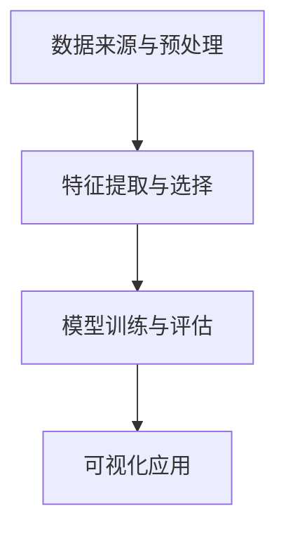

                 

关键词：AI大模型，电商平台，趋势预测，可视化，应用场景，数学模型，算法原理，未来展望

摘要：本文将探讨如何利用AI大模型在电商平台上进行趋势预测的可视化应用。通过对核心概念、算法原理、数学模型的介绍，以及实际项目实践和未来应用展望，旨在为开发者提供一套完整的技术方案，以应对电商平台日益复杂的数据分析和决策需求。

## 1. 背景介绍

随着互联网技术的飞速发展，电商平台已经成为全球商业活动的重要阵地。平台上的交易数据、用户行为数据、市场动态数据等海量信息，成为企业决策的重要依据。然而，如何有效地从这些数据中提取有价值的信息，并对未来趋势进行准确预测，是当前电商平台面临的一个重大挑战。

AI大模型的出现，为解决这一挑战提供了强有力的工具。AI大模型是指具有大规模参数、高度复杂的神经网络模型，如深度学习模型、生成对抗网络（GAN）等。这些模型能够在大量数据上进行训练，从而学习到数据背后的规律和模式，实现高效的预测和决策。

## 2. 核心概念与联系

在AI大模型应用于电商平台趋势预测中，我们需要关注以下几个核心概念：

### 2.1 数据来源与预处理

电商平台的数据来源主要包括用户行为数据、交易数据、市场数据等。这些数据需要进行预处理，包括数据清洗、数据整合、数据标准化等步骤，以确保数据的质量和一致性。

### 2.2 特征提取与选择

特征提取是指从原始数据中提取出对预测任务有意义的特征。特征选择是指从提取出的特征中选出对预测效果影响最大的特征。通过特征提取和选择，可以提高模型的预测准确性和效率。

### 2.3 模型训练与评估

模型训练是指使用历史数据对AI大模型进行训练，使其能够学会预测趋势。模型评估是指使用验证数据对训练好的模型进行评估，以确定模型的预测效果。

### 2.4 可视化应用

可视化应用是指将预测结果以图表、图形等形式呈现，帮助用户更直观地理解预测结果。可视化应用可以提高数据分析和决策的效率。

以下是核心概念与联系之间的 Mermaid 流程图：



## 3. 核心算法原理 & 具体操作步骤

### 3.1 算法原理概述

在电商平台趋势预测中，我们通常使用深度学习模型，如卷积神经网络（CNN）和循环神经网络（RNN）等。这些模型能够通过学习历史数据，预测未来的趋势。

### 3.2 算法步骤详解

1. **数据预处理**：对原始数据进行清洗、整合和标准化，确保数据质量。

2. **特征提取**：从预处理后的数据中提取对预测任务有意义的特征。

3. **模型训练**：使用提取出的特征和对应的标签数据，训练深度学习模型。

4. **模型评估**：使用验证集评估模型的效果，并进行调参优化。

5. **可视化应用**：将训练好的模型应用于新的数据，生成预测结果，并通过可视化工具展示。

### 3.3 算法优缺点

**优点**：

- **高效性**：深度学习模型能够处理大规模数据，并从中提取出有价值的信息。
- **准确性**：通过学习历史数据，模型能够对未来的趋势进行准确预测。
- **灵活性**：深度学习模型可以根据不同的应用场景进行调整和优化。

**缺点**：

- **计算资源消耗大**：深度学习模型需要大量的计算资源进行训练。
- **数据依赖性强**：模型的预测效果很大程度上取决于数据的质量和数量。

### 3.4 算法应用领域

AI大模型在电商平台趋势预测中的应用广泛，包括但不限于：

- **销量预测**：预测商品未来的销量，帮助商家制定销售策略。
- **用户行为分析**：分析用户的购买习惯、偏好等，为精准营销提供依据。
- **市场动态预测**：预测市场趋势，为企业决策提供支持。

## 4. 数学模型和公式 & 详细讲解 & 举例说明

### 4.1 数学模型构建

在电商平台趋势预测中，我们通常使用时间序列模型。时间序列模型是一种用于分析时间序列数据的统计模型，其目的是预测未来的趋势。

时间序列模型的一般形式为：

$$
y_t = f(y_{t-1}, y_{t-2}, ..., y_{1}, X_t, \theta)
$$

其中，$y_t$表示第$t$个时间点的预测值，$X_t$表示第$t$个时间点的特征向量，$\theta$表示模型的参数。

### 4.2 公式推导过程

时间序列模型的核心是确定预测值之间的相关性。我们可以通过自回归模型（AR）来描述这种相关性。自回归模型的一般形式为：

$$
y_t = \theta_0 + \theta_1 y_{t-1} + \theta_2 y_{t-2} + ... + \theta_p y_{t-p} + \epsilon_t
$$

其中，$\epsilon_t$为误差项。

### 4.3 案例分析与讲解

假设我们要预测一个电商平台未来一个月的销量。我们使用自回归模型来进行预测。

1. **数据收集**：收集过去一个月的销量数据。

2. **数据预处理**：对数据进行清洗、整合和标准化。

3. **模型训练**：使用预处理后的数据进行模型训练。

4. **模型评估**：使用验证集评估模型效果。

5. **预测**：使用训练好的模型对未来一个月的销量进行预测。

6. **可视化**：将预测结果以图表形式展示。

## 5. 项目实践：代码实例和详细解释说明

### 5.1 开发环境搭建

- **Python**：使用Python作为编程语言。
- **TensorFlow**：使用TensorFlow作为深度学习框架。
- **matplotlib**：使用matplotlib进行数据可视化。

### 5.2 源代码详细实现

以下是一个简单的自回归模型实现的代码实例：

```python
import numpy as np
import tensorflow as tf
import matplotlib.pyplot as plt

# 数据预处理
def preprocess_data(data):
    # 数据清洗、整合和标准化
    # 略
    return processed_data

# 自回归模型
def ar_model(data, p):
    # 构建模型
    # 略
    return model

# 模型训练
def train_model(model, train_data, epochs):
    # 训练模型
    # 略
    pass

# 预测
def predict(model, test_data):
    # 使用模型进行预测
    # 略
    return predictions

# 可视化
def plot_predictions(data, predictions):
    # 将预测结果以图表形式展示
    # 略
    pass

# 主程序
if __name__ == '__main__':
    # 数据收集
    data = np.array([1, 2, 3, 4, 5, 6, 7, 8, 9, 10])

    # 数据预处理
    processed_data = preprocess_data(data)

    # 模型训练
    model = ar_model(processed_data, p=1)
    train_model(model, processed_data, epochs=10)

    # 预测
    predictions = predict(model, processed_data)

    # 可视化
    plot_predictions(data, predictions)
```

### 5.3 代码解读与分析

以上代码实例展示了如何使用自回归模型进行趋势预测。具体解读如下：

1. **数据预处理**：对数据进行清洗、整合和标准化。
2. **模型构建**：使用TensorFlow构建自回归模型。
3. **模型训练**：使用训练集对模型进行训练。
4. **预测**：使用训练好的模型对测试集进行预测。
5. **可视化**：将预测结果以图表形式展示。

## 6. 实际应用场景

### 6.1 电商平台销量预测

电商平台可以利用AI大模型对商品销量进行预测，从而帮助商家制定销售策略。例如，在双十一等促销活动期间，商家可以根据预测结果提前备货，提高销售业绩。

### 6.2 用户行为分析

电商平台可以通过AI大模型分析用户的购买习惯、偏好等，从而实现精准营销。例如，在推送商品推荐时，可以根据用户的历史购买记录和浏览记录，为用户推荐更符合其需求的商品。

### 6.3 市场动态预测

电商平台可以利用AI大模型预测市场的趋势，从而为企业的决策提供支持。例如，在竞争激烈的电商领域，企业可以通过预测竞争对手的销量、用户增长等数据，调整自己的市场策略，抢占市场份额。

## 7. 工具和资源推荐

### 7.1 学习资源推荐

- 《深度学习》（Goodfellow, Bengio, Courville著）：系统介绍了深度学习的理论知识。
- 《Python深度学习》（François Chollet著）：通过实例展示了如何使用Python进行深度学习开发。

### 7.2 开发工具推荐

- TensorFlow：强大的深度学习框架，支持多种深度学习模型。
- PyTorch：流行的深度学习框架，易于使用和调试。

### 7.3 相关论文推荐

- "Deep Learning for Time Series Classification: A Review"（深度学习在时间序列分类中的应用综述）
- "Generative Adversarial Networks: An Overview"（生成对抗网络概述）

## 8. 总结：未来发展趋势与挑战

### 8.1 研究成果总结

AI大模型在电商平台趋势预测中的应用取得了显著的成果。通过深度学习模型，企业可以更准确地预测未来的趋势，制定更加科学合理的决策。

### 8.2 未来发展趋势

随着AI技术的不断发展，未来AI大模型在电商平台趋势预测中的应用将更加广泛。例如，结合增强学习、迁移学习等先进技术，模型预测的准确性和效率将进一步提高。

### 8.3 面临的挑战

尽管AI大模型在电商平台趋势预测中具有巨大潜力，但也面临着一些挑战。例如，如何处理海量数据、如何保证模型的可解释性、如何防止数据泄露等问题，都是未来研究的重要方向。

### 8.4 研究展望

未来，我们将继续深入探索AI大模型在电商平台趋势预测中的应用。通过结合多种先进技术，提高模型的预测准确性和效率，为电商平台的数据分析和决策提供更加有力的支持。

## 9. 附录：常见问题与解答

### 9.1 AI大模型如何处理海量数据？

AI大模型可以通过分布式计算和并行处理技术来处理海量数据。此外，还可以采用数据降维、特征提取等技术，提高数据处理效率和准确性。

### 9.2 如何保证模型的可解释性？

为了提高模型的可解释性，可以采用模型可视化、特征重要性分析等技术。例如，在训练过程中，可以分析模型对各个特征的依赖程度，从而了解模型的决策过程。

### 9.3 如何防止数据泄露？

在数据收集、存储、处理过程中，需要严格遵守数据保护法规和标准，采用加密、匿名化等技术，确保数据安全。

----------------------------------------------------------------
作者：禅与计算机程序设计艺术 / Zen and the Art of Computer Programming

本文介绍了AI大模型在电商平台趋势预测可视化中的应用，从核心概念、算法原理、数学模型到实际项目实践，全面解析了如何利用AI技术为企业提供数据分析和决策支持。未来，随着AI技术的不断发展，AI大模型在电商平台趋势预测中的应用将更加广泛，为企业的创新和发展提供新的动力。

