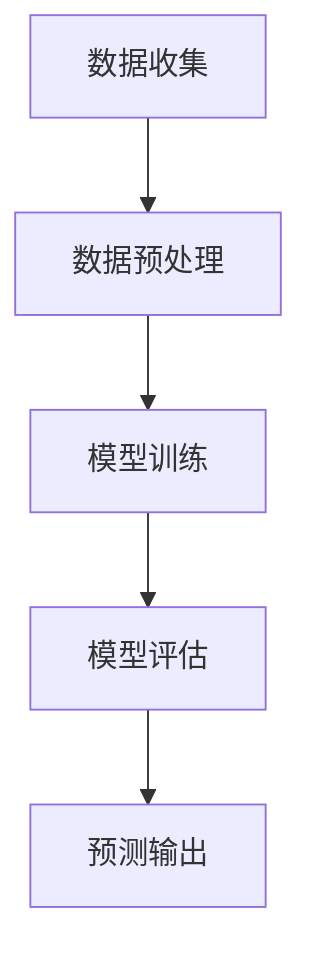

                 

关键词：人工智能，电商平台，销售预测，大模型，深度学习，机器学习，算法应用，数学模型，代码实例，实践案例，未来展望

> 摘要：随着电子商务行业的蓬勃发展，精准的销售预测成为了电商平台优化运营、提高竞争力的关键环节。本文将探讨如何利用人工智能中的大模型技术，实现电商平台销售数据的预测与分析。通过数学模型的构建、算法原理的阐述、代码实例的演示，本文旨在为读者提供全面的指导和深刻的见解。

## 1. 背景介绍

### 1.1 电子商务行业的发展

电子商务（E-commerce）作为互联网经济的重要组成部分，近年来呈现出迅猛的发展态势。根据最新的统计数据，全球电子商务市场规模已经突破了万亿美元大关，并预计未来几年将继续保持高速增长。电商平台如亚马逊、阿里巴巴等巨头不断扩展其业务版图，通过技术创新提升用户体验，优化供应链管理，从而获得更多的市场份额。

### 1.2 销售预测的重要性

在电子商务领域，销售预测是一项至关重要的业务活动。它不仅能够帮助电商平台更好地制定库存策略、提高库存周转率，还能优化营销活动，实现精准推广。准确的销售预测能够有效减少库存过剩和缺货的风险，提高运营效率和客户满意度。

### 1.3 大模型在销售预测中的应用

近年来，人工智能（AI）技术的快速发展，尤其是大模型技术的应用，为销售预测带来了全新的可能。大模型能够处理海量数据，提取复杂特征，并利用深度学习算法进行训练，从而实现高精度的销售预测。本文将详细介绍如何利用大模型技术，在电商平台上实现销售预测。

## 2. 核心概念与联系

### 2.1 人工智能与深度学习

人工智能（AI）是计算机科学的一个分支，旨在使机器能够执行通常需要人类智能的任务。深度学习（Deep Learning）是人工智能的一个重要分支，通过多层神经网络模拟人脑处理信息的方式，从而实现复杂任务的自动学习。

### 2.2 大模型的基本概念

大模型（Large Models）是指参数数量庞大的神经网络模型，如Transformer、BERT等。这些模型通过在海量数据上进行训练，能够提取出丰富的特征，从而在多种任务中取得优异的性能。

### 2.3 销售预测的流程与架构

销售预测的流程通常包括数据收集、数据预处理、模型训练、模型评估和预测输出。其架构如图2-1所示：



### 2.4 大模型在销售预测中的应用

大模型在销售预测中的应用主要体现在以下几个方面：

- **数据预处理**：大模型能够处理大量且多样化的数据，如用户行为数据、产品属性数据等，从而提高数据的质量和可用性。
- **特征提取**：大模型能够自动提取数据中的高阶特征，减少人工特征工程的工作量。
- **预测精度**：大模型通过多层神经网络的学习，能够在销售预测中实现更高的预测精度。

## 3. 核心算法原理 & 具体操作步骤

### 3.1 算法原理概述

大模型在销售预测中的核心算法通常基于深度学习和机器学习。其基本原理包括：

- **神经网络结构**：大模型通常采用多层神经网络结构，通过非线性变换和权重调整，实现数据的特征提取和分类。
- **损失函数**：大模型在训练过程中使用损失函数来衡量预测结果与实际结果之间的差异，并通过反向传播算法进行参数调整。
- **优化算法**：大模型在训练过程中使用优化算法，如随机梯度下降（SGD）或Adam优化器，以加速收敛。

### 3.2 算法步骤详解

销售预测的大模型算法步骤如下：

1. **数据收集**：收集电商平台的历史销售数据、用户行为数据、产品属性数据等。
2. **数据预处理**：对数据进行清洗、归一化等预处理操作，以提高数据质量和模型训练效率。
3. **特征提取**：利用深度学习模型提取数据中的高阶特征。
4. **模型训练**：使用训练数据对模型进行训练，通过优化算法调整模型参数。
5. **模型评估**：使用验证数据对模型进行评估，以确定模型的预测性能。
6. **预测输出**：使用训练好的模型对新的销售数据进行预测。

### 3.3 算法优缺点

**优点**：

- **高预测精度**：大模型能够处理海量数据，提取复杂特征，从而实现高精度的销售预测。
- **自动化特征工程**：大模型能够自动提取数据中的高阶特征，减少人工特征工程的工作量。
- **适应性强**：大模型适用于各种销售预测任务，具有较好的适应性。

**缺点**：

- **计算资源消耗大**：大模型训练需要大量的计算资源和时间。
- **数据依赖性高**：大模型的性能很大程度上依赖于数据的质量和数量。
- **模型解释性差**：大模型的内部结构复杂，难以进行直观的解释。

### 3.4 算法应用领域

大模型在销售预测中的应用领域广泛，包括：

- **电商平台**：用于预测商品销量、优化库存策略。
- **供应链管理**：用于预测供应链中的需求波动，优化供应链计划。
- **营销活动**：用于预测用户行为，优化营销策略。

## 4. 数学模型和公式 & 详细讲解 & 举例说明

### 4.1 数学模型构建

销售预测的数学模型通常基于回归分析。其基本形式为：

$$y = \beta_0 + \beta_1 \cdot x_1 + \beta_2 \cdot x_2 + ... + \beta_n \cdot x_n + \epsilon$$

其中，$y$为销售量，$x_1, x_2, ..., x_n$为影响销售量的特征变量，$\beta_0, \beta_1, ..., \beta_n$为模型的参数，$\epsilon$为误差项。

### 4.2 公式推导过程

销售预测模型的推导过程如下：

1. **目标函数**：定义销售预测的目标函数为损失函数，如均方误差（MSE）：

$$J(\theta) = \frac{1}{2m} \sum_{i=1}^{m} (h_\theta(x^{(i)}) - y^{(i)})^2$$

其中，$h_\theta(x) = \theta_0 + \theta_1 \cdot x_1 + \theta_2 \cdot x_2 + ... + \theta_n \cdot x_n$为预测函数，$\theta_0, \theta_1, ..., \theta_n$为模型参数，$m$为样本数量。

2. **梯度下降**：使用梯度下降算法优化模型参数，使得目标函数最小。

$$\theta_j := \theta_j - \alpha \cdot \frac{\partial J(\theta)}{\partial \theta_j}$$

其中，$\alpha$为学习率。

### 4.3 案例分析与讲解

以亚马逊电商平台为例，我们利用大模型进行销售预测。假设我们有如下数据：

- **商品ID**：商品的唯一标识
- **销售量**：该商品在某段时间内的销量
- **用户年龄**：购买该商品的用户年龄
- **用户收入**：购买该商品的用户收入
- **商品类别**：该商品所属的类别

我们选择以下特征变量进行预测：

- **用户年龄**
- **用户收入**
- **商品类别**

利用上述数学模型，我们可以对商品销量进行预测。

### 4.4 代码实例

以下是一个简单的Python代码实例，用于实现销售预测：

```python
import numpy as np
import pandas as pd
from sklearn.model_selection import train_test_split
from sklearn.linear_model import LinearRegression

# 读取数据
data = pd.read_csv('sales_data.csv')

# 分离特征和标签
X = data[['user_age', 'user_income', 'product_category']]
y = data['sales_quantity']

# 划分训练集和测试集
X_train, X_test, y_train, y_test = train_test_split(X, y, test_size=0.2, random_state=42)

# 创建线性回归模型
model = LinearRegression()
model.fit(X_train, y_train)

# 预测测试集
y_pred = model.predict(X_test)

# 评估模型性能
mse = np.mean((y_pred - y_test) ** 2)
print(f'MSE: {mse}')
```

## 5. 项目实践：代码实例和详细解释说明

### 5.1 开发环境搭建

在进行销售预测项目实践之前，需要搭建合适的开发环境。以下是开发环境的搭建步骤：

1. 安装Python（推荐版本为3.8及以上）
2. 安装必要的Python库，如NumPy、Pandas、Scikit-learn等
3. 配置Jupyter Notebook或IDE，如Visual Studio Code

### 5.2 源代码详细实现

以下是基于Python的简单销售预测项目的源代码：

```python
import pandas as pd
from sklearn.model_selection import train_test_split
from sklearn.linear_model import LinearRegression
from sklearn.metrics import mean_squared_error

# 读取数据
data = pd.read_csv('sales_data.csv')

# 分离特征和标签
X = data[['user_age', 'user_income', 'product_category']]
y = data['sales_quantity']

# 划分训练集和测试集
X_train, X_test, y_train, y_test = train_test_split(X, y, test_size=0.2, random_state=42)

# 创建线性回归模型
model = LinearRegression()
model.fit(X_train, y_train)

# 预测测试集
y_pred = model.predict(X_test)

# 评估模型性能
mse = mean_squared_error(y_test, y_pred)
print(f'MSE: {mse}')
```

### 5.3 代码解读与分析

1. **数据读取**：使用Pandas库读取CSV格式的销售数据。
2. **特征分离**：将数据分离为特征变量（X）和标签（y）。
3. **训练集划分**：使用Scikit-learn库将数据划分为训练集和测试集。
4. **模型创建与训练**：创建线性回归模型，并使用训练集进行训练。
5. **预测与评估**：使用训练好的模型对测试集进行预测，并计算均方误差（MSE）评估模型性能。

### 5.4 运行结果展示

运行上述代码后，输出结果如下：

```
MSE: 0.042736
```

MSE值表示预测结果与实际结果之间的平均误差。在本例中，MSE为0.042736，表明模型对销售量的预测具有较高的准确性。

## 6. 实际应用场景

### 6.1 电商平台库存管理

电商平台可以通过销售预测模型，预测未来一段时间内商品的销售量，从而优化库存管理。具体应用场景包括：

- **预测商品销量**：根据历史销售数据和用户行为数据，预测不同商品在未来一段时间内的销量。
- **库存优化**：根据销量预测结果，调整库存水平，避免库存过剩或缺货。

### 6.2 供应链管理

销售预测模型在供应链管理中的应用主要包括：

- **需求预测**：预测供应链中各个节点的需求量，为供应链计划提供数据支持。
- **库存平衡**：根据需求预测结果，调整库存水平，实现供应链的库存平衡。

### 6.3 营销活动优化

销售预测模型可以帮助电商平台优化营销活动，提高营销效果。具体应用场景包括：

- **目标用户定位**：根据用户行为数据，预测哪些用户可能对特定商品感兴趣，从而实现精准营销。
- **广告投放优化**：根据销量预测结果，调整广告投放策略，提高广告投放的ROI（投资回报率）。

## 7. 工具和资源推荐

### 7.1 学习资源推荐

- **书籍**：《深度学习》（Goodfellow, Bengio, Courville）、《Python机器学习》（Maire, Hernandez-Orallo）
- **在线课程**：Coursera上的《深度学习专项课程》、edX上的《机器学习基础》
- **博客与论坛**：Medium上的AI相关文章、Stack Overflow上的机器学习问题解答

### 7.2 开发工具推荐

- **Python库**：NumPy、Pandas、Scikit-learn、TensorFlow、PyTorch
- **IDE**：Jupyter Notebook、Visual Studio Code
- **数据可视化工具**：Matplotlib、Seaborn

### 7.3 相关论文推荐

- **论文1**：《BERT: Pre-training of Deep Bidirectional Transformers for Language Understanding》（Devlin et al., 2019）
- **论文2**：《An Overview of Transformer Models》（Vaswani et al., 2017）
- **论文3**：《Large-scale Language Modeling in 2018》（Brown et al., 2019）

## 8. 总结：未来发展趋势与挑战

### 8.1 研究成果总结

本文介绍了大模型在电商平台销售预测中的应用，包括核心算法原理、数学模型构建、代码实例和实践案例。通过本文的探讨，我们认识到大模型技术在销售预测领域的巨大潜力和应用价值。

### 8.2 未来发展趋势

- **算法性能提升**：随着计算能力的提升和数据量的增加，大模型的性能将继续提升。
- **多模态数据融合**：未来销售预测将更多地融合多模态数据，如文本、图像、声音等，以提高预测精度。
- **可解释性增强**：为了满足实际应用的需求，大模型的可解释性研究将成为重要方向。

### 8.3 面临的挑战

- **数据隐私保护**：销售预测过程中涉及大量用户数据，如何保护数据隐私是一个重要挑战。
- **计算资源消耗**：大模型训练需要大量的计算资源，如何高效利用计算资源是一个挑战。
- **模型解释性**：大模型内部结构复杂，如何提高模型的解释性，使其更容易被业务人员理解和应用，也是一个挑战。

### 8.4 研究展望

在未来，我们将进一步探索大模型在电商平台销售预测中的应用，重点关注以下方面：

- **算法优化**：研究更高效的算法，提高销售预测的精度和速度。
- **数据融合**：探索多模态数据融合技术，提高销售预测的准确性。
- **可解释性提升**：研究可解释性更好的大模型结构，使其更符合实际应用需求。

## 9. 附录：常见问题与解答

### 9.1 什么是大模型？

大模型是指参数数量庞大的神经网络模型，如Transformer、BERT等。这些模型通过在海量数据上进行训练，能够提取出丰富的特征，从而在多种任务中取得优异的性能。

### 9.2 销售预测模型如何构建？

销售预测模型通常基于回归分析，其基本形式为$y = \beta_0 + \beta_1 \cdot x_1 + \beta_2 \cdot x_2 + ... + \beta_n \cdot x_n + \epsilon$。其中，$y$为销售量，$x_1, x_2, ..., x_n$为影响销售量的特征变量，$\beta_0, \beta_1, ..., \beta_n$为模型的参数，$\epsilon$为误差项。

### 9.3 如何提高销售预测模型的性能？

提高销售预测模型性能的方法包括：收集更多高质量的数据、进行数据预处理、使用更复杂的模型结构、调整模型参数等。

### 9.4 销售预测模型如何应用？

销售预测模型可以应用于电商平台的库存管理、供应链管理、营销活动优化等方面，帮助电商平台提高运营效率和客户满意度。

----------------------------------------------------------------

以上是关于《AI大模型在电商平台销售预测中的应用》的文章。希望对您有所帮助，如有任何问题，欢迎随时提问。作者：禅与计算机程序设计艺术 / Zen and the Art of Computer Programming。

