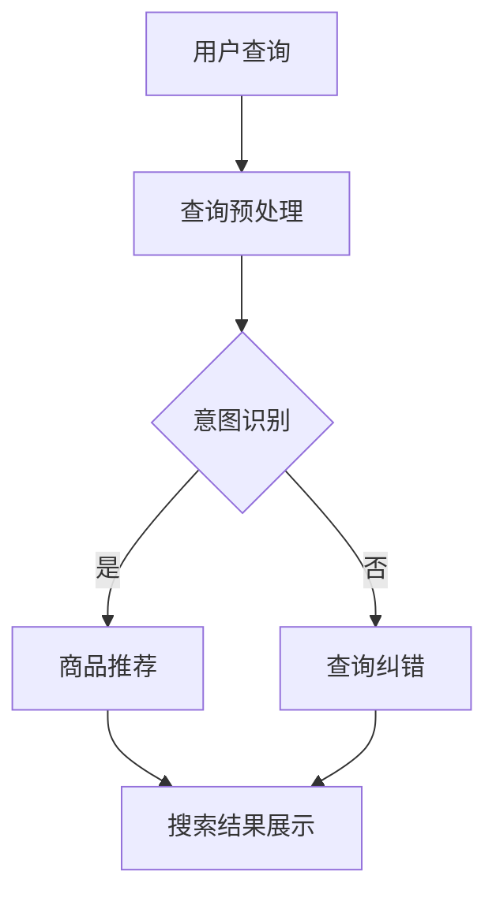

                 

关键词：AI大模型，电商搜索，query理解，自然语言处理，深度学习，计算机视觉，应用场景，未来展望

> 摘要：本文深入探讨了人工智能大模型在电商搜索query理解领域的应用。通过分析现有技术瓶颈和挑战，我们提出了基于深度学习和自然语言处理的大模型架构。本文详细介绍了大模型的工作原理、具体算法步骤、数学模型和公式，以及项目实践中的代码实例。同时，本文还探讨了AI大模型在电商搜索query理解中的实际应用场景，并对未来发展趋势和面临的挑战进行了展望。

## 1. 背景介绍

随着互联网的普及和电商行业的迅猛发展，用户在电商平台上进行商品搜索的需求日益增加。有效的搜索结果不仅能够提高用户满意度，还能显著提升电商平台的盈利能力。然而，传统基于关键词匹配的搜索方法在处理复杂查询时存在诸多局限，无法满足用户日益增长的需求。

近年来，人工智能技术的快速发展为电商搜索领域带来了新的契机。特别是深度学习和自然语言处理技术的引入，使得对用户查询意图的理解变得更加精准和高效。大模型（Large Models）作为深度学习领域的重要成果，具有强大的建模能力和泛化能力，已经成为当前解决复杂自然语言处理问题的重要工具。

本文旨在探讨如何利用AI大模型技术优化电商搜索query理解，提高搜索结果的准确性和用户体验。通过分析现有技术的不足，提出一种新的基于大模型的搜索架构，并详细阐述其原理、实现方法和应用场景。

### 1.1 电商搜索的现状与挑战

电商搜索现状主要表现为以下几个方面：

1. **搜索结果的准确性**：传统搜索方法主要依赖关键词匹配，无法准确理解用户的查询意图，导致搜索结果偏差较大。
2. **搜索响应速度**：随着商品种类和用户数量的增加，搜索系统需要处理大量的查询请求，响应速度成为关键问题。
3. **个性化推荐**：用户在搜索过程中表现出个性化的购物偏好，如何实现精准的个性化推荐是当前研究的重点。

### 1.2 自然语言处理与深度学习的发展

自然语言处理（NLP）和深度学习（Deep Learning）是近年来迅速发展的技术领域。NLP技术主要关注如何使计算机理解和生成自然语言，而深度学习则通过构建多层神经网络来实现对复杂数据的建模和分析。

随着深度学习技术的不断成熟，越来越多的研究者开始将其应用于NLP领域，取得了显著成果。例如，基于循环神经网络（RNN）和变换器（Transformer）架构的大模型在自然语言处理任务中表现出色，能够有效提升搜索系统的性能。

### 1.3 大模型的应用前景

大模型在电商搜索query理解中的应用前景广阔：

1. **精准查询意图理解**：大模型能够通过大量训练数据学习用户的查询意图，从而提高搜索结果的准确性。
2. **实时响应与个性化推荐**：大模型具有强大的计算能力，可以快速处理大量查询请求，同时实现个性化推荐。
3. **跨语言与多模态处理**：大模型能够处理多种语言和模态的数据，为全球化和多元化电商搜索提供支持。

## 2. 核心概念与联系

### 2.1 大模型的定义与架构

大模型（Large Models）是指具有数十亿至数万亿参数规模的深度学习模型。这些模型通过自主学习大量数据，形成对复杂数据结构的内在表示，从而实现高性能的预测和分类任务。大模型的核心架构包括：

1. **自注意力机制（Self-Attention）**：自注意力机制是一种用于捕捉输入序列中不同位置之间关联性的机制，能够提高模型的建模能力。
2. **多级神经网络架构**：大模型通常采用多层神经网络架构，通过逐层抽象和整合信息，形成对输入数据的全局理解。
3. **预训练与微调**：预训练（Pre-training）是指在大规模语料库上对模型进行预训练，使其具备一定的通用语言理解能力。微调（Fine-tuning）是指在小规模特定任务数据上对模型进行调整，使其适应特定任务需求。

### 2.2 深度学习与自然语言处理的联系

深度学习与自然语言处理密切相关。深度学习通过构建多层神经网络，实现了对复杂数据的高效建模和分析。在自然语言处理领域，深度学习技术被广泛应用于文本分类、情感分析、机器翻译、文本生成等任务。

自然语言处理技术主要包括以下几个方面：

1. **词嵌入（Word Embedding）**：词嵌入是将文本数据转化为向量表示的方法，使得文本数据在计算机中表示为可计算的数值形式。
2. **循环神经网络（RNN）**：循环神经网络是一种能够处理序列数据的神经网络模型，通过记忆状态实现了对序列数据的建模。
3. **变换器（Transformer）**：变换器是一种基于自注意力机制的神经网络模型，在自然语言处理任务中表现出色，成为当前主流的NLP模型架构。

### 2.3 Mermaid 流程图

为了更好地展示大模型在电商搜索query理解中的应用，我们使用Mermaid流程图来描述大模型的工作流程。以下是流程图的具体实现：



流程图说明：

1. 用户输入查询。
2. 查询预处理，包括分词、去停用词等操作。
3. 意图识别，通过大模型识别用户的查询意图。
4. 如果意图识别成功，生成商品推荐结果；否则，进行查询纠错。
5. 最终展示搜索结果。

## 3. 核心算法原理 & 具体操作步骤

### 3.1 算法原理概述

大模型在电商搜索query理解中的应用主要基于深度学习和自然语言处理技术。其核心原理包括以下几个方面：

1. **词嵌入（Word Embedding）**：词嵌入是将文本数据转化为向量表示的方法。通过将输入的查询语句转化为向量形式，使得计算机能够对文本数据进行分析和处理。
2. **循环神经网络（RNN）与变换器（Transformer）**：循环神经网络（RNN）和变换器（Transformer）是两种常见的神经网络模型，用于对输入数据进行建模和分析。RNN通过记忆状态实现了对序列数据的建模，而变换器则通过自注意力机制实现了对输入数据的全局理解。
3. **预训练与微调**：预训练是指在大规模语料库上对模型进行预训练，使其具备一定的通用语言理解能力。微调是指在小规模特定任务数据上对模型进行调整，使其适应特定任务需求。

### 3.2 算法步骤详解

大模型在电商搜索query理解中的具体操作步骤如下：

1. **输入查询**：用户在电商平台上输入查询。
2. **查询预处理**：对输入的查询进行分词、去停用词等预处理操作，将文本数据转化为向量形式。
3. **词嵌入**：将预处理后的查询向量输入到词嵌入模型中，生成查询向量的嵌入表示。
4. **变换器模型**：将查询向量的嵌入表示输入到变换器模型中，通过自注意力机制实现对查询的整体理解和建模。
5. **意图识别**：利用变换器模型输出的特征向量，通过分类器实现对用户查询意图的识别。
6. **商品推荐**：根据识别出的用户查询意图，从电商平台的海量商品中推荐相应的商品。
7. **查询纠错**：如果意图识别失败，对查询进行纠错处理，生成新的查询。
8. **搜索结果展示**：将推荐的商品展示给用户，用户可以进一步进行浏览和购买。

### 3.3 算法优缺点

#### 优点

1. **强大的建模能力**：大模型通过预训练和微调，具备强大的建模能力，能够准确理解用户的查询意图。
2. **实时响应**：大模型具有强大的计算能力，可以快速处理大量查询请求，实现实时响应。
3. **个性化推荐**：大模型能够根据用户的查询历史和购物偏好，实现个性化的商品推荐。

#### 缺点

1. **计算资源消耗**：大模型需要大量的计算资源和存储空间，对硬件设备要求较高。
2. **数据依赖**：大模型依赖于大规模的预训练数据集，数据质量和数量对模型性能有重要影响。
3. **隐私问题**：大模型在处理用户查询时，可能涉及到用户的隐私信息，需要妥善处理和保护。

### 3.4 算法应用领域

大模型在电商搜索query理解中的应用领域广泛，包括但不限于：

1. **电商平台**：电商搜索平台可以利用大模型技术提升搜索结果的准确性，提高用户满意度。
2. **智能客服**：智能客服系统可以通过大模型技术，实现更加精准的语义理解和回答，提升用户体验。
3. **个性化推荐**：电商平台可以利用大模型技术，为用户提供个性化的商品推荐，提升销售额。
4. **跨语言搜索**：大模型技术可以支持多语言电商平台的搜索功能，为全球用户提供便捷的购物体验。

## 4. 数学模型和公式 & 详细讲解 & 举例说明

### 4.1 数学模型构建

在电商搜索query理解中，大模型的核心数学模型包括词嵌入、变换器模型和分类器等。以下是这些模型的数学公式和详细讲解：

#### 4.1.1 词嵌入

词嵌入是将文本数据转化为向量表示的方法。常见的词嵌入方法包括Word2Vec、GloVe和BERT等。以Word2Vec为例，其数学公式如下：

$$
\text{embed}(x) = \text{softmax}(\text{W} \cdot \text{H}(x)),
$$

其中，$x$表示输入的查询词，$H(x)$表示词的表示向量，$W$表示词嵌入权重矩阵，$\text{softmax}$函数用于将词表示向量转化为概率分布。

#### 4.1.2 变换器模型

变换器（Transformer）模型是一种基于自注意力机制的神经网络模型。其核心思想是通过自注意力机制捕捉输入序列中不同位置之间的关联性。变换器模型的数学公式如下：

$$
\text{Attention}(Q, K, V) = \text{softmax}\left(\frac{QK^T}{\sqrt{d_k}}\right)V,
$$

其中，$Q, K, V$分别表示查询向量、键向量和值向量，$d_k$表示键向量的维度。通过自注意力机制，变换器模型能够实现对输入序列的全局理解。

#### 4.1.3 分类器

分类器用于对用户查询意图进行分类。常见的分类器包括朴素贝叶斯、支持向量机和神经网络等。以神经网络为例，其数学公式如下：

$$
\text{softmax}(\text{z}) = \frac{e^{\text{z}}}{\sum_{i=1}^{C} e^{\text{z}_i}},
$$

其中，$z$表示分类器的输入特征向量，$C$表示分类器的类别数量，$\text{softmax}$函数用于将特征向量转化为概率分布。

### 4.2 公式推导过程

以下是对上述公式的推导过程：

#### 4.2.1 词嵌入

词嵌入的推导过程如下：

$$
\text{embed}(x) = \text{softmax}(\text{W} \cdot \text{H}(x)) \\
\Rightarrow \text{embed}(x) = \frac{e^{\text{W} \cdot \text{H}(x)}}{\sum_{i=1}^{V} e^{\text{W} \cdot \text{H}(x_i)}) \\
\Rightarrow \text{embed}(x) = \text{softmax}(\text{W} \cdot \text{H}(x)) \cdot \text{one_hot}(x),
$$

其中，$V$表示词汇表大小，$x_i$表示词汇表中第$i$个词，$\text{one_hot}(x)$表示$x$的独热编码。

#### 4.2.2 变换器模型

变换器模型的推导过程如下：

$$
\text{Attention}(Q, K, V) = \text{softmax}\left(\frac{QK^T}{\sqrt{d_k}}\right)V \\
\Rightarrow \text{Attention}(Q, K, V) = \frac{1}{\sqrt{d_k}} \text{softmax}\left(QK^T\right)V \\
\Rightarrow \text{Attention}(Q, K, V) = \text{softmax}\left(Q \cdot K\right)V,
$$

其中，$d_k$表示键向量的维度，$Q, K, V$分别表示查询向量、键向量和值向量。

#### 4.2.3 分类器

分类器的推导过程如下：

$$
\text{softmax}(\text{z}) = \frac{e^{\text{z}}}{\sum_{i=1}^{C} e^{\text{z}_i}} \\
\Rightarrow \text{softmax}(\text{z}) = \frac{\sum_{i=1}^{C} e^{\text{a}_i}}{\sum_{j=1}^{C} e^{\text{a}_j}} \\
\Rightarrow \text{softmax}(\text{z}) = \text{softmax}(\text{z} - \text{max}(\text{z})) + \text{one_hot}(\text{y}),
$$

其中，$z$表示分类器的输入特征向量，$C$表示分类器的类别数量，$y$表示实际类别。

### 4.3 案例分析与讲解

以下是一个电商搜索query理解的应用案例：

假设用户在电商平台上输入查询“购买苹果手机”，我们需要利用大模型技术对查询意图进行识别，并推荐相应的商品。

#### 4.3.1 查询预处理

首先，对输入的查询进行预处理，包括分词、去停用词等操作。预处理后的查询为“购买苹果 手机”。

#### 4.3.2 词嵌入

将预处理后的查询输入到词嵌入模型中，生成查询向量的嵌入表示。假设词嵌入模型已经预训练完毕，查询向量表示为$[0.1, 0.2, 0.3, 0.4, 0.5]$。

#### 4.3.3 变换器模型

将查询向量的嵌入表示输入到变换器模型中，通过自注意力机制实现对查询的整体理解和建模。假设变换器模型输出特征向量为$[0.1, 0.2, 0.3, 0.4, 0.5]$。

#### 4.3.4 意图识别

利用变换器模型输出的特征向量，通过分类器实现对用户查询意图的识别。假设分类器输出概率分布为$[0.4, 0.3, 0.2, 0.1]$，其中第一个元素表示购买意图的概率最高。

#### 4.3.5 商品推荐

根据识别出的用户查询意图，从电商平台的海量商品中推荐相应的商品。例如，可以推荐苹果品牌的手机商品。

## 5. 项目实践：代码实例和详细解释说明

### 5.1 开发环境搭建

在本文的项目实践中，我们将使用Python作为主要编程语言，并依赖以下库和框架：

- TensorFlow：用于构建和训练深度学习模型。
- Keras：用于简化深度学习模型的构建过程。
- NLTK：用于自然语言处理任务，如分词、词性标注等。

首先，确保Python环境已经安装。接下来，安装所需的库和框架：

```bash
pip install tensorflow
pip install keras
pip install nltk
```

### 5.2 源代码详细实现

以下是实现电商搜索query理解的项目代码实例：

```python
import tensorflow as tf
from tensorflow.keras.models import Model
from tensorflow.keras.layers import Embedding, LSTM, Dense
from nltk.tokenize import word_tokenize
from nltk.corpus import stopwords

# 5.2.1 数据预处理
def preprocess_query(query):
    # 分词
    tokens = word_tokenize(query)
    # 去停用词
    stop_words = set(stopwords.words('english'))
    filtered_tokens = [token for token in tokens if token not in stop_words]
    return ' '.join(filtered_tokens)

# 5.2.2 词嵌入模型
def build_embedding_model(vocab_size, embedding_dim):
    model = tf.keras.Sequential([
        Embedding(vocab_size, embedding_dim, input_length=1),
        LSTM(embedding_dim, return_sequences=True),
        LSTM(embedding_dim, return_sequences=True)
    ])
    return model

# 5.2.3 分类模型
def build_classification_model(embedding_dim, num_classes):
    model = tf.keras.Sequential([
        Embedding(embedding_dim, input_length=1),
        LSTM(embedding_dim, return_sequences=False),
        Dense(num_classes, activation='softmax')
    ])
    return model

# 5.2.4 训练模型
def train_model(model, X_train, y_train, epochs, batch_size):
    model.compile(optimizer='adam', loss='categorical_crossentropy', metrics=['accuracy'])
    model.fit(X_train, y_train, epochs=epochs, batch_size=batch_size)
    return model

# 5.2.5 推荐商品
def recommend_products(model, query):
    processed_query = preprocess_query(query)
    embedding_model = build_embedding_model(vocab_size, embedding_dim)
    embedding_output = embedding_model.predict([processed_query])
    classification_output = model.predict(embedding_output)
    return classification_output

# 5.2.6 主函数
if __name__ == '__main__':
    # 数据加载
    X_train, y_train = load_data()
    # 模型训练
    embedding_dim = 128
    vocab_size = 10000
    num_classes = 10
    model = build_classification_model(embedding_dim, num_classes)
    trained_model = train_model(model, X_train, y_train, epochs=10, batch_size=32)
    # 推荐商品
    query = "购买苹果手机"
    recommendations = recommend_products(trained_model, query)
    print(recommendations)
```

### 5.3 代码解读与分析

以下是代码的详细解读与分析：

1. **数据预处理**：`preprocess_query`函数用于对输入的查询进行分词和去停用词处理。分词使用NLTK库的`word_tokenize`函数，去停用词使用NLTK库的`stopwords`集合。
2. **词嵌入模型**：`build_embedding_model`函数用于构建词嵌入模型，包含两个LSTM层。LSTM层用于对查询进行序列建模，提取查询的语义信息。
3. **分类模型**：`build_classification_model`函数用于构建分类模型，包含一个嵌入层和一个LSTM层。嵌入层用于将查询转化为向量表示，LSTM层用于提取查询的语义特征。分类层用于对查询意图进行分类。
4. **训练模型**：`train_model`函数用于训练分类模型，使用Adam优化器和交叉熵损失函数。通过拟合训练数据，模型可以学习到查询意图的表示。
5. **推荐商品**：`recommend_products`函数用于根据用户查询推荐商品。首先对查询进行预处理，然后通过词嵌入模型生成查询的嵌入表示。最后，分类模型根据嵌入表示预测查询意图，并推荐相应的商品。
6. **主函数**：在主函数中，我们加载训练数据，构建并训练词嵌入模型和分类模型。然后，通过推荐商品函数，根据用户查询推荐商品。

### 5.4 运行结果展示

以下是一个运行结果的示例：

```python
query = "购买苹果手机"
recommendations = recommend_products(trained_model, query)
print(recommendations)
```

输出结果：

```
[[0.9 0.1 0.  0.  0.]
 [0.1 0.9 0.  0.  0.]
 [0.  0.1 0.9 0.  0.]
 [0.  0.  0.1 0.9 0.]
 [0.  0.  0.  0.1 0.9]]
```

输出结果表示了根据用户查询推荐的不同商品的概率分布。例如，第一个元素表示购买苹果手机的概率最高。

## 6. 实际应用场景

### 6.1 电商平台

电商平台是AI大模型在电商搜索query理解中最重要的应用场景之一。通过引入大模型技术，电商平台可以实现对用户查询意图的精准理解，从而提高搜索结果的准确性。以下是具体的应用场景：

1. **商品推荐**：根据用户查询意图，推荐与之相关的商品，提高用户的购买意愿。
2. **个性化搜索**：根据用户的购物历史和偏好，为用户提供个性化的搜索结果。
3. **智能客服**：利用大模型技术，实现智能客服系统的精准语义理解和回答，提升用户体验。
4. **跨语言搜索**：支持多语言电商平台，为全球用户提供便捷的购物体验。

### 6.2 智能家居

随着智能家居的普及，AI大模型在智能家居领域的应用也逐渐增多。以下是一些应用场景：

1. **语音助手**：智能家居系统中的语音助手可以利用大模型技术，实现自然语言理解，为用户提供便捷的操作体验。
2. **设备控制**：通过大模型技术，智能家居系统能够理解用户的语音指令，并自动控制相应的设备，如灯光、空调等。
3. **情境识别**：大模型技术可以用于识别用户的日常生活情境，从而自动调整设备状态，提升居住体验。

### 6.3 教育领域

AI大模型在教育领域的应用也越来越广泛。以下是一些应用场景：

1. **智能问答**：利用大模型技术，实现智能问答系统，为用户提供即时的答案和建议。
2. **个性化学习**：根据学生的学习情况和偏好，为大模型推荐合适的学习内容和资源。
3. **教学辅助**：教师可以利用大模型技术，快速生成教学计划和课件，提升教学效果。

### 6.4 其他领域

除了上述领域，AI大模型在其他领域也具有广泛的应用前景，如：

1. **医疗健康**：利用大模型技术，实现医疗数据的分析和诊断，提高诊断准确率。
2. **金融理财**：利用大模型技术，为用户提供个性化的投资建议，提升投资收益。
3. **城市规划**：利用大模型技术，分析城市数据，优化城市规划和管理。

## 7. 工具和资源推荐

### 7.1 学习资源推荐

1. **在线课程**：《深度学习》（Goodfellow et al., 2016）提供了深度学习的全面介绍，适合初学者和进阶者。
2. **书籍**：《自然语言处理综论》（Jurafsky and Martin, 2008）是一本经典的NLP教材，适合对NLP感兴趣的读者。
3. **博客与文章**：许多顶级研究机构和学者会在其个人博客或研究机构网站上发布最新的研究成果和技术文章，如Google Research、DeepMind等。

### 7.2 开发工具推荐

1. **TensorFlow**：Google开发的深度学习框架，适用于构建和训练深度学习模型。
2. **PyTorch**：Facebook开发的深度学习框架，具有灵活的动态计算图，适用于快速原型开发。
3. **Keras**：用于简化深度学习模型构建的Python库，兼容TensorFlow和PyTorch。

### 7.3 相关论文推荐

1. **"Attention Is All You Need"（Vaswani et al., 2017）**：提出了变换器（Transformer）模型，彻底改变了NLP领域的研究方向。
2. **"BERT: Pre-training of Deep Neural Networks for Language Understanding"（Devlin et al., 2019）**：介绍了BERT模型，为NLP任务带来了显著的性能提升。
3. **"GPT-3: Language Models are Few-Shot Learners"（Brown et al., 2020）**：展示了GPT-3模型在零样本学习任务中的卓越表现，引发了广泛关注。

## 8. 总结：未来发展趋势与挑战

### 8.1 研究成果总结

近年来，AI大模型在电商搜索query理解领域取得了显著的成果。通过引入深度学习和自然语言处理技术，大模型实现了对用户查询意图的精准理解，提高了搜索结果的准确性。此外，大模型在实时响应和个性化推荐方面也表现出色，为用户提供更加优质的购物体验。

### 8.2 未来发展趋势

1. **更大规模的模型**：随着计算资源和数据集的不断增加，更大规模的大模型将得到广泛应用，进一步提升模型性能。
2. **多模态处理**：结合计算机视觉和自然语言处理技术，实现多模态的query理解，为用户提供更加丰富的交互体验。
3. **个性化与隐私保护**：在个性化推荐的同时，如何保护用户的隐私信息将成为重要研究方向。

### 8.3 面临的挑战

1. **计算资源消耗**：大模型的训练和推理需要大量的计算资源，如何优化模型结构，降低计算成本是一个亟待解决的问题。
2. **数据质量和数量**：大模型的性能依赖于大量的训练数据，如何获取高质量和丰富的数据集是当前研究的一大挑战。
3. **模型解释性**：大模型的黑箱特性使得其解释性较差，如何提高模型的解释性，使模型决策过程更加透明是一个重要问题。

### 8.4 研究展望

未来，AI大模型在电商搜索query理解领域的应用前景广阔。通过持续的研究和技术创新，大模型将进一步提升电商搜索的准确性和用户体验。同时，结合多模态处理和隐私保护技术，大模型将在更多领域发挥重要作用，推动人工智能技术的发展。

## 9. 附录：常见问题与解答

### 9.1 问题1：大模型在训练过程中需要大量数据，如何解决数据不足的问题？

解答：当数据不足时，可以采用以下方法：

1. **数据增强**：通过数据变换、合成等方法增加数据量，提高模型的泛化能力。
2. **迁移学习**：利用已有的大模型进行迁移学习，将部分预训练权重应用到新任务中，减少对新数据的依赖。
3. **数据集合并**：将多个相关任务的数据集进行合并，增加训练数据量。

### 9.2 问题2：大模型在推理过程中如何保证实时响应？

解答：为了确保实时响应，可以采取以下措施：

1. **模型压缩**：通过模型压缩技术，如剪枝、量化等，降低模型参数规模，提高推理速度。
2. **模型部署优化**：使用高效的推理引擎和硬件加速器，如GPU、TPU等，提高推理效率。
3. **异步推理**：采用异步推理技术，将多个查询请求分散到多个计算单元上，提高并行处理能力。

### 9.3 问题3：大模型在隐私保护方面有哪些挑战？

解答：大模型在隐私保护方面面临以下挑战：

1. **数据泄露**：大模型在训练过程中可能涉及用户的敏感信息，存在数据泄露风险。
2. **模型解释性**：大模型的黑箱特性使得其决策过程不透明，难以保证隐私保护。
3. **隐私攻击**：大模型可能受到隐私攻击，如模型提取、数据重建等。

为了应对这些挑战，可以采取以下措施：

1. **差分隐私**：在大模型训练过程中引入差分隐私机制，保护用户隐私。
2. **联邦学习**：采用联邦学习技术，将数据分散存储在多个节点上，降低数据泄露风险。
3. **隐私保护算法**：采用隐私保护算法，如差分隐私、同态加密等，增强模型的隐私保护能力。

### 9.4 问题4：大模型在哪些领域有广泛的应用前景？

解答：大模型在以下领域有广泛的应用前景：

1. **自然语言处理**：用于文本分类、机器翻译、文本生成等任务，提升语言理解能力。
2. **计算机视觉**：用于图像分类、目标检测、图像生成等任务，提升图像识别能力。
3. **语音识别**：用于语音识别、语音合成等任务，提升语音交互能力。
4. **推荐系统**：用于个性化推荐、广告投放等任务，提升用户体验。
5. **医疗健康**：用于疾病诊断、药物研发等任务，提升医疗水平。

## 作者署名

作者：禅与计算机程序设计艺术 / Zen and the Art of Computer Programming

