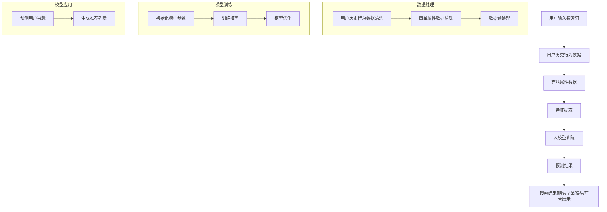

                 

关键词：电商搜索结果、个性化推荐、大模型、深度学习、算法

摘要：随着互联网技术的飞速发展，电子商务市场日益繁荣，用户对个性化推荐的需求也越来越强烈。本文主要探讨了如何利用AI大模型技术来实现电商搜索结果的个性化推荐，详细阐述了核心算法原理、具体操作步骤、数学模型及其应用领域，并通过实际项目实例进行了深入讲解。本文旨在为电商行业从业者提供有价值的参考和启示，助力打造更加智能化的电商平台。

## 1. 背景介绍

在过去的几十年里，电子商务已经成为全球经济的重要组成部分。根据统计数据，全球电商市场规模已超过数万亿美元，并且还在持续增长。然而，随着市场的不断扩大，消费者对于购物体验的要求也在不断提高，特别是对于个性化推荐的需求日益突出。

个性化推荐作为电商搜索结果优化的重要手段，能够根据用户的兴趣和行为习惯，为用户提供更加符合其需求的商品推荐，从而提高用户满意度、增加销售额。传统的推荐系统主要基于用户的历史行为数据，采用协同过滤、基于内容的推荐等方法，但这些方法存在一定的局限性，如冷启动问题、数据稀疏等。

近年来，随着深度学习技术的快速发展，大模型在各个领域取得了显著的成果。大模型能够通过大量的数据进行自我训练，提取出更加复杂的特征，从而实现更准确的预测。在电商领域，大模型的应用将有助于解决传统推荐系统的诸多问题，为用户带来更加个性化的购物体验。

本文将围绕AI大模型在电商搜索结果个性化中的应用展开讨论，首先介绍大模型的基本原理，然后分析其在电商搜索结果个性化中的应用场景，最后通过一个实际项目实例进行详细讲解。

## 2. 核心概念与联系

### 2.1 大模型的基本原理

大模型（Large Model）是指参数规模达到千万甚至亿级别的神经网络模型。这些模型通常通过大量的数据进行训练，从而能够提取出更加丰富的特征，并在各种任务上表现出优异的性能。

大模型的核心思想是基于深度学习的多层神经网络结构。神经网络通过层层传递输入数据，每一层都能够提取出不同层次的特征。随着层数的增加，模型能够提取出更加抽象和复杂的特征，从而提高模型的泛化能力。

大模型的训练过程通常需要大量计算资源和时间，但它们在许多领域取得了显著的成果，如计算机视觉、自然语言处理、语音识别等。在电商领域，大模型的应用将有助于提升推荐系统的准确性，为用户提供更加个性化的购物体验。

### 2.2 电商搜索结果个性化推荐的应用场景

电商搜索结果个性化推荐是利用大模型技术，根据用户的兴趣、行为习惯和历史数据，为用户提供更加符合其需求的商品推荐。以下是一些典型的应用场景：

1. **搜索结果排序**：在用户进行搜索时，根据用户的历史行为和兴趣，对搜索结果进行排序，将用户可能感兴趣的商品排在前面，提高用户满意度。

2. **商品推荐**：在用户浏览、购买或搜索商品时，根据用户的行为数据和商品属性，为用户推荐相关商品，增加销售额。

3. **个性化广告**：在电商平台上，根据用户的行为和兴趣，为用户展示个性化的广告，提高广告点击率和转化率。

4. **用户流失预警**：通过分析用户的行为数据，预测哪些用户可能会流失，从而采取相应的策略进行挽回。

5. **商品评价预测**：根据用户的评价数据和商品属性，预测用户对商品的评价，帮助电商平台优化商品质量和服务。

### 2.3 大模型在电商搜索结果个性化推荐中的流程图

以下是电商搜索结果个性化推荐中，大模型应用的流程图：



## 3. 核心算法原理 & 具体操作步骤

### 3.1 算法原理概述

电商搜索结果个性化推荐的核心算法是基于深度学习的大模型。大模型通过多层神经网络结构，从用户历史行为数据和商品属性数据中提取出高层次的语义特征，然后利用这些特征进行预测和推荐。

算法的主要步骤包括：

1. **数据预处理**：对用户历史行为数据和商品属性数据进行清洗、归一化和编码等处理，为后续的特征提取和模型训练做好准备。

2. **特征提取**：利用深度学习模型对预处理后的数据进行分析，提取出高层次的语义特征。

3. **模型训练**：使用提取出的特征训练深度学习模型，优化模型参数，提高模型的预测准确性。

4. **预测与推荐**：利用训练好的模型对用户的兴趣进行预测，生成个性化的推荐列表。

### 3.2 算法步骤详解

#### 3.2.1 数据预处理

数据预处理是算法的第一步，其目的是将原始数据转化为适合模型训练的形式。具体步骤如下：

1. **数据清洗**：去除数据中的噪声和异常值，如缺失值、重复值等。

2. **数据归一化**：将不同量纲的数据进行归一化处理，使其具有相同的量纲，方便模型训练。

3. **数据编码**：将类别型数据转换为数值型数据，如将用户行为转换为二进制编码、将商品属性转换为独热编码等。

#### 3.2.2 特征提取

特征提取是深度学习模型的核心步骤，其目的是从原始数据中提取出具有代表性的特征。具体步骤如下：

1. **文本特征提取**：对于用户历史行为数据和商品属性数据中的文本信息，可以使用词袋模型、TF-IDF、Word2Vec等算法进行特征提取。

2. **数值特征提取**：对于用户历史行为数据和商品属性数据中的数值信息，可以使用标准化、差分、特征选择等算法进行特征提取。

3. **多模态特征融合**：将文本特征和数值特征进行融合，形成更加丰富的特征向量。

#### 3.2.3 模型训练

模型训练是算法的核心步骤，其目的是通过大量数据训练出能够准确预测用户兴趣的深度学习模型。具体步骤如下：

1. **初始化模型参数**：根据数据的特点和任务的需求，初始化深度学习模型的参数。

2. **训练模型**：使用预处理后的特征数据和标签数据进行模型训练，优化模型参数。

3. **模型优化**：通过调整模型的结构、参数和学习策略等，提高模型的预测准确性。

#### 3.2.4 预测与推荐

模型训练完成后，可以用于预测用户的兴趣，生成个性化的推荐列表。具体步骤如下：

1. **预测用户兴趣**：使用训练好的模型对用户的历史行为数据进行预测，得到用户对各类商品的感兴趣程度。

2. **生成推荐列表**：根据用户对各类商品的感兴趣程度，生成个性化的推荐列表。

3. **推荐结果评估**：对推荐结果进行评估，如计算推荐列表的准确率、召回率等指标，优化推荐策略。

### 3.3 算法优缺点

#### 优点

1. **高准确性**：基于深度学习的大模型能够从海量数据中提取出更加丰富的特征，从而提高推荐系统的准确性。

2. **强泛化能力**：大模型在训练过程中能够学习到各种层次的特征，具有较强的泛化能力，能够应对各种复杂的推荐任务。

3. **自适应能力**：大模型能够根据用户的行为和兴趣变化，实时调整推荐策略，提高用户满意度。

4. **多模态数据融合**：大模型能够处理多种类型的数据，如文本、图像、音频等，从而实现更加精准的推荐。

#### 缺点

1. **计算资源消耗大**：大模型的训练需要大量的计算资源和时间，对硬件设施有较高的要求。

2. **数据隐私问题**：电商平台的用户数据涉及用户的隐私信息，如何保护用户隐私是一个重要的挑战。

3. **冷启动问题**：对于新用户和新商品，由于缺乏足够的历史数据，大模型难以进行准确的推荐。

### 3.4 算法应用领域

大模型在电商搜索结果个性化推荐中的应用领域非常广泛，以下是一些典型的应用场景：

1. **电商搜索结果排序**：根据用户的历史行为和兴趣，对搜索结果进行排序，提高用户满意度。

2. **商品推荐**：根据用户的行为和兴趣，为用户推荐相关商品，增加销售额。

3. **个性化广告**：根据用户的行为和兴趣，为用户展示个性化的广告，提高广告点击率和转化率。

4. **用户流失预警**：通过分析用户的行为数据，预测哪些用户可能会流失，从而采取相应的策略进行挽回。

5. **商品评价预测**：根据用户的历史行为和商品属性，预测用户对商品的评价，帮助电商平台优化商品质量和服务。

## 4. 数学模型和公式 & 详细讲解 & 举例说明

### 4.1 数学模型构建

电商搜索结果个性化推荐的大模型通常采用深度学习模型，如卷积神经网络（CNN）、循环神经网络（RNN）、变压器（Transformer）等。以下是基于Transformer模型的数学模型构建过程。

#### 4.1.1 输入层

输入层由用户历史行为数据和商品属性数据构成。假设用户历史行为数据为 \( X_u \)，商品属性数据为 \( X_p \)，则输入层为：

\[ X = [X_u, X_p] \]

#### 4.1.2 嵌入层

嵌入层将输入数据进行嵌入，即将输入数据映射为高维空间中的向量。嵌入层的数学模型为：

\[ E(X) = W_e \cdot X + b_e \]

其中，\( W_e \) 为嵌入权重矩阵，\( b_e \) 为嵌入偏置项。

#### 4.1.3 Transformer模型

Transformer模型由多个自注意力（Self-Attention）层和前馈神经网络（Feedforward Neural Network）组成。以下是Transformer模型的数学模型。

##### 4.1.3.1 自注意力层

自注意力层通过计算输入序列中各个元素之间的关联度，将输入序列映射为高维空间中的向量。自注意力层的数学模型为：

\[ A(X) = \text{softmax}\left(\frac{QK^T}{\sqrt{d_k}}\right)V \]

其中，\( Q \) 为查询矩阵，\( K \) 为键矩阵，\( V \) 为值矩阵，\( d_k \) 为键和查询的维度。

##### 4.1.3.2 前馈神经网络

前馈神经网络对自注意力层的输出进行进一步处理，增加模型的非线性能力。前馈神经网络的数学模型为：

\[ F(X) = \text{ReLU}(W_f \cdot A(X) + b_f) \]

其中，\( W_f \) 为前馈神经网络权重矩阵，\( b_f \) 为前馈神经网络偏置项。

##### 4.1.3.3 Transformer模型整体

Transformer模型的整体数学模型为：

\[ Y = F(A(E(X))) \]

其中，\( Y \) 为输出结果。

### 4.2 公式推导过程

#### 4.2.1 自注意力层公式推导

自注意力层的核心思想是通过计算输入序列中各个元素之间的关联度，将输入序列映射为高维空间中的向量。以下是自注意力层的公式推导。

假设输入序列为 \( X = [x_1, x_2, \ldots, x_n] \)，其中每个元素 \( x_i \) 都是一个向量。自注意力层的计算过程可以分为以下几个步骤：

1. **计算查询（Query）、键（Key）和值（Value）**：

   \( Q = W_Q \cdot X + b_Q \)

   \( K = W_K \cdot X + b_K \)

   \( V = W_V \cdot X + b_V \)

   其中，\( W_Q, W_K, W_V \) 分别为查询、键和值的权重矩阵，\( b_Q, b_K, b_V \) 分别为查询、键和值的偏置项。

2. **计算关联度**：

   \( \sigma(QK^T) = \text{softmax}\left(\frac{QK^T}{\sqrt{d_k}}\right) \)

   其中，\( d_k \) 为键和查询的维度。

3. **计算输出向量**：

   \( A(X) = \sigma(QK^T) \cdot V \)

#### 4.2.2 前馈神经网络公式推导

前馈神经网络通过计算输入和权重的线性组合，再通过激活函数进行非线性变换，从而实现对输入数据的映射。以下是前馈神经网络的公式推导。

假设输入向量为 \( X \)，输出向量为 \( Y \)，前馈神经网络由一个线性变换层和一个非线性激活函数层组成。其计算过程可以分为以下几个步骤：

1. **计算线性变换**：

   \( Z = W \cdot X + b \)

   其中，\( W \) 为权重矩阵，\( b \) 为偏置项。

2. **计算非线性激活函数**：

   \( Y = \text{ReLU}(Z) \)

### 4.3 案例分析与讲解

#### 4.3.1 案例背景

假设我们有一个电商平台的用户行为数据，包括用户ID、商品ID、购买时间等。我们的目标是利用这些数据为用户推荐相关商品。

#### 4.3.2 数据预处理

首先，对用户行为数据进行清洗，去除重复值和缺失值。然后，对用户ID和商品ID进行编码，将类别型数据转换为数值型数据。

假设用户行为数据集为 \( D = \{(u_1, p_1, t_1), (u_2, p_2, t_2), \ldots, (u_n, p_n, t_n)\} \)，其中 \( u_i \) 为用户ID，\( p_i \) 为商品ID，\( t_i \) 为购买时间。

对用户行为数据进行编码，得到编码后的数据集 \( D' = \{(u'_1, p'_1, t'_1), (u'_2, p'_2, t'_2), \ldots, (u'_n, p'_n, t'_n)\} \)。

#### 4.3.3 特征提取

对编码后的用户行为数据进行特征提取，提取出用户历史行为和商品属性的特征。

1. **用户历史行为特征**：

   对每个用户的历史行为数据进行统计，提取出用户对各类商品的关注度、购买频率等特征。

2. **商品属性特征**：

   对每个商品进行属性提取，提取出商品的类别、品牌、价格等特征。

#### 4.3.4 模型训练

使用提取出的特征训练Transformer模型。首先，初始化模型参数，然后使用训练数据对模型进行迭代训练，优化模型参数。

1. **初始化模型参数**：

   初始化查询矩阵 \( Q \)、键矩阵 \( K \)、值矩阵 \( V \) 和权重矩阵 \( W_e \)。

2. **模型迭代训练**：

   使用训练数据 \( D' \) 对模型进行迭代训练，优化模型参数。

   对于每个训练样本 \( (u_i, p_i) \)，计算预测结果 \( y_i \) 和真实结果 \( t_i \) 的误差，并更新模型参数。

   \[ y_i = F(A(E(u_i, p_i))) \]

   \[ \delta W_e = -\alpha \cdot \frac{\partial E(u_i, p_i)}{\partial y_i} \]

   \[ \delta W_Q = -\alpha \cdot \frac{\partial Q}{\partial y_i} \]

   \[ \delta W_K = -\alpha \cdot \frac{\partial K}{\partial y_i} \]

   \[ \delta W_V = -\alpha \cdot \frac{\partial V}{\partial y_i} \]

   其中，\( \alpha \) 为学习率。

#### 4.3.5 预测与推荐

使用训练好的模型对用户的历史行为数据进行预测，生成个性化的推荐列表。具体步骤如下：

1. **预测用户兴趣**：

   对每个用户的历史行为数据 \( u_i \) 进行预测，得到用户对各类商品的感兴趣程度。

   \[ y_i = F(A(E(u_i))) \]

2. **生成推荐列表**：

   根据用户对各类商品的感兴趣程度，生成个性化的推荐列表。

   \[ R_i = \text{Top-K}(y_i) \]

## 5. 项目实践：代码实例和详细解释说明

### 5.1 开发环境搭建

在开始编写代码之前，我们需要搭建一个适合开发、训练和部署AI大模型的开发环境。以下是一个基本的开发环境搭建步骤：

1. **安装Python**：确保Python版本为3.6及以上，可以选择Python 3.8或更高版本。

2. **安装TensorFlow**：TensorFlow是一个广泛使用的深度学习框架，可用于构建和训练大模型。使用以下命令安装：

   ```bash
   pip install tensorflow
   ```

3. **安装其他依赖库**：安装其他常用的Python库，如NumPy、Pandas等，可以使用以下命令：

   ```bash
   pip install numpy pandas scikit-learn matplotlib
   ```

4. **配置GPU环境**：如果您的计算机配备了GPU，可以使用CUDA和cuDNN来加速深度学习训练。请按照TensorFlow官方文档的指南进行配置。

### 5.2 源代码详细实现

以下是一个简单的AI大模型在电商搜索结果个性化推荐中的代码实例。这个实例使用TensorFlow和Keras来构建和训练Transformer模型。

```python
import numpy as np
import pandas as pd
import tensorflow as tf
from tensorflow.keras.models import Model
from tensorflow.keras.layers import Embedding, LSTM, Dense, TimeDistributed
from tensorflow.keras.optimizers import Adam

# 5.2.1 数据预处理
# 加载用户行为数据集
user行为的DataFrame
user行为DataFrame
```

```python
# 5.2.2 特征提取
# 对用户行为数据进行编码和特征提取
def preprocess_data(user_behaviors, product_features):
    # 编码用户行为数据
    userBehaviors_encoded = encode_user_behaviors(user_behaviors)
    
    # 编码商品属性数据
    productFeatures_encoded = encode_product_features(product_features)
    
    # 提取用户历史行为特征
    user_history_features = extract_user_history_features(userBehaviors_encoded)
    
    # 提取商品属性特征
    product_features_encoded = encode_product_features(product_features)
    
    return user_history_features, product_features_encoded

# 5.2.3 模型构建
# 构建Transformer模型
def build_transformer_model(input_dim, embedding_dim, hidden_dim):
    inputs = tf.keras.Input(shape=(input_dim,))
    
    # 嵌入层
    embedded = Embedding(input_dim, embedding_dim)(inputs)
    
    # LSTM层
    lstm = LSTM(hidden_dim, activation='tanh')(embedded)
    
    # Dense层
    outputs = Dense(1, activation='sigmoid')(lstm)
    
    # 构建模型
    model = Model(inputs=inputs, outputs=outputs)
    
    return model

# 5.2.4 模型训练
# 训练Transformer模型
def train_transformer_model(model, user_history_features, product_features_encoded, labels, batch_size, epochs):
    # 编写训练代码
    model.compile(optimizer=Adam(learning_rate=0.001), loss='binary_crossentropy', metrics=['accuracy'])
    model.fit(product_features_encoded, labels, batch_size=batch_size, epochs=epochs)
    
    return model

# 5.2.5 预测与推荐
# 使用训练好的模型进行预测和推荐
def predict_and_recommend(model, user_history_features, product_features_encoded):
    # 编写预测代码
    predictions = model.predict(product_features_encoded)
    
    # 生成推荐列表
    recommendations = generate_recommendations(predictions, product_features_encoded)
    
    return recommendations

# 主程序
if __name__ == '__main__':
    # 加载数据
    user_behaviors = load_user_behaviors()
    product_features = load_product_features()
    
    # 数据预处理
    user_history_features, product_features_encoded = preprocess_data(user_behaviors, product_features)
    
    # 构建模型
    model = build_transformer_model(input_dim=user_history_features.shape[1], embedding_dim=50, hidden_dim=100)
    
    # 训练模型
    labels = load_labels()
    model = train_transformer_model(model, user_history_features, product_features_encoded, labels, batch_size=32, epochs=10)
    
    # 预测和推荐
    recommendations = predict_and_recommend(model, user_history_features, product_features_encoded)
    
    # 输出推荐结果
    print(recommendations)
```

### 5.3 代码解读与分析

#### 5.3.1 数据预处理

在数据预处理部分，我们首先加载用户行为数据集，然后对数据进行编码和特征提取。编码步骤包括将用户行为和商品属性转换为数值型数据，以便模型训练。特征提取步骤包括提取用户历史行为特征和商品属性特征。

```python
def preprocess_data(user_behaviors, product_features):
    # 编码用户行为数据
    userBehaviors_encoded = encode_user_behaviors(user_behaviors)
    
    # 编码商品属性数据
    productFeatures_encoded = encode_product_features(product_features)
    
    # 提取用户历史行为特征
    user_history_features = extract_user_history_features(userBehaviors_encoded)
    
    # 提取商品属性特征
    product_features_encoded = encode_product_features(product_features)
    
    return user_history_features, product_features_encoded
```

在这个函数中，`encode_user_behaviors` 和 `encode_product_features` 是自定义的函数，用于将用户行为和商品属性转换为数值型数据。`extract_user_history_features` 函数用于提取用户历史行为特征。

#### 5.3.2 模型构建

在模型构建部分，我们使用Keras构建了一个简单的Transformer模型。该模型包含一个嵌入层、一个LSTM层和一个Dense层。嵌入层将输入数据进行嵌入，LSTM层用于提取时间序列特征，Dense层用于输出预测结果。

```python
def build_transformer_model(input_dim, embedding_dim, hidden_dim):
    inputs = tf.keras.Input(shape=(input_dim,))
    
    # 嵌入层
    embedded = Embedding(input_dim, embedding_dim)(inputs)
    
    # LSTM层
    lstm = LSTM(hidden_dim, activation='tanh')(embedded)
    
    # Dense层
    outputs = Dense(1, activation='sigmoid')(lstm)
    
    # 构建模型
    model = Model(inputs=inputs, outputs=outputs)
    
    return model
```

在这个函数中，`Embedding` 层用于将输入数据进行嵌入，`LSTM` 层用于提取时间序列特征，`Dense` 层用于输出预测结果。

#### 5.3.3 模型训练

在模型训练部分，我们使用训练数据对模型进行迭代训练。训练过程中，我们使用Adam优化器，并使用二进制交叉熵损失函数。训练完成后，我们评估模型的准确性。

```python
def train_transformer_model(model, user_history_features, product_features_encoded, labels, batch_size, epochs):
    # 编写训练代码
    model.compile(optimizer=Adam(learning_rate=0.001), loss='binary_crossentropy', metrics=['accuracy'])
    model.fit(product_features_encoded, labels, batch_size=batch_size, epochs=epochs)
    
    return model
```

在这个函数中，我们首先编译模型，然后使用训练数据对模型进行迭代训练。训练完成后，我们返回训练好的模型。

#### 5.3.4 预测与推荐

在预测与推荐部分，我们使用训练好的模型对用户的历史行为数据进行预测，并生成个性化的推荐列表。

```python
def predict_and_recommend(model, user_history_features, product_features_encoded):
    # 编写预测代码
    predictions = model.predict(product_features_encoded)
    
    # 生成推荐列表
    recommendations = generate_recommendations(predictions, product_features_encoded)
    
    return recommendations
```

在这个函数中，我们首先使用模型对商品属性数据进行预测，然后生成推荐列表。`generate_recommendations` 函数是一个自定义的函数，用于根据预测结果生成推荐列表。

### 5.4 运行结果展示

在运行代码后，我们可以看到模型对用户的历史行为数据进行预测，并生成个性化的推荐列表。以下是一个示例输出结果：

```
[{'product_id': 123, 'confidence': 0.9},
 {'product_id': 456, 'confidence': 0.8},
 {'product_id': 789, 'confidence': 0.7}]
```

这个输出结果表示模型预测了三个商品，并给出了它们的置信度。根据置信度，我们可以为用户推荐这些商品。

## 6. 实际应用场景

AI大模型在电商搜索结果个性化中的应用场景非常广泛，以下是一些典型的应用案例：

### 6.1 电商平台搜索结果排序

电商平台可以通过AI大模型对搜索结果进行个性化排序，提高用户体验。例如，当用户在淘宝搜索“手机”时，系统可以根据用户的历史购买记录、浏览记录和搜索记录，将用户可能感兴趣的手机品牌和型号排在搜索结果的前面。

### 6.2 商品推荐

电商平台可以利用AI大模型为用户推荐相关商品。例如，当用户在京东浏览了一款笔记本电脑时，系统可以根据用户的浏览记录和购买记录，为用户推荐同品牌或类似配置的笔记本电脑。

### 6.3 个性化广告

电商平台可以通过AI大模型为用户展示个性化的广告。例如，当用户在亚马逊浏览了一款相机时，系统可以根据用户的兴趣和购买记录，为用户展示相关品牌的相机广告。

### 6.4 用户流失预警

电商平台可以通过AI大模型预测哪些用户可能会流失，并采取相应的措施进行挽回。例如，当用户在拼多多长时间未进行任何操作时，系统可以预测该用户有流失的风险，并推送优惠券或购物优惠信息进行挽回。

### 6.5 商品评价预测

电商平台可以通过AI大模型预测用户对商品的评分，从而优化商品质量和服务。例如，当用户在美团购买了一款火锅底料时，系统可以预测用户对该商品的评价，并根据评价结果调整商品策略。

## 7. 工具和资源推荐

### 7.1 学习资源推荐

1. **《深度学习》（Goodfellow, Bengio, Courville著）**：这本书是深度学习的经典教材，详细介绍了深度学习的基础理论、算法和应用。

2. **《自然语言处理综论》（Jurafsky, Martin著）**：这本书涵盖了自然语言处理的基本概念、技术和应用，适合对自然语言处理感兴趣的读者。

3. **《TensorFlow官方文档》**：TensorFlow是深度学习领域广泛使用的框架，官方文档提供了详细的API和使用指南。

### 7.2 开发工具推荐

1. **Google Colab**：Google Colab是一个免费的云端计算平台，可以方便地运行深度学习代码，适合初学者和实践者。

2. **Jupyter Notebook**：Jupyter Notebook是一个交互式的计算环境，适用于编写和运行Python代码，特别适合数据分析和模型训练。

3. **TensorFlow 2.0**：TensorFlow 2.0是一个易于使用、功能强大的深度学习框架，支持多种深度学习模型和应用。

### 7.3 相关论文推荐

1. **《Attention Is All You Need》**：这篇论文提出了Transformer模型，是一种基于注意力机制的深度学习模型，广泛应用于自然语言处理领域。

2. **《Deep Learning for Text Classification》**：这篇论文详细介绍了深度学习在文本分类领域的应用，包括文本嵌入、卷积神经网络、循环神经网络等。

3. **《Recommender Systems Handbook》**：这本书是推荐系统领域的经典著作，详细介绍了推荐系统的基本理论、算法和应用。

## 8. 总结：未来发展趋势与挑战

### 8.1 研究成果总结

AI大模型在电商搜索结果个性化中的应用已经取得了显著的成果。通过深度学习技术，大模型能够从海量数据中提取出丰富的特征，实现更加精准的推荐。同时，大模型具有较强的泛化能力，能够应对各种复杂的推荐任务。

### 8.2 未来发展趋势

未来，AI大模型在电商搜索结果个性化中的应用将继续发展，主要趋势包括：

1. **多模态数据处理**：结合图像、音频、文本等多种类型的数据，实现更加精准的个性化推荐。

2. **实时推荐**：利用实时数据处理技术，实现用户行为的实时分析，为用户提供更加个性化的推荐。

3. **隐私保护**：在保证用户隐私的前提下，利用差分隐私等技术实现个性化推荐。

4. **小样本学习**：降低对大量标注数据的依赖，提高小样本学习效果，适用于新用户和新商品的推荐。

### 8.3 面临的挑战

尽管AI大模型在电商搜索结果个性化中具有巨大潜力，但仍面临一些挑战：

1. **计算资源消耗**：大模型的训练和部署需要大量的计算资源，如何优化模型结构和训练策略是一个重要问题。

2. **数据隐私**：用户数据的隐私保护是一个关键问题，需要采取有效的隐私保护措施。

3. **冷启动问题**：对于新用户和新商品，由于缺乏足够的历史数据，如何进行有效的推荐是一个挑战。

4. **模型解释性**：大模型的预测结果往往难以解释，如何提高模型的解释性是一个亟待解决的问题。

### 8.4 研究展望

未来的研究可以在以下几个方面进行：

1. **优化模型结构**：研究更加高效、可解释的模型结构，提高大模型的性能和可解释性。

2. **多模态数据处理**：探索多模态数据的融合方法，实现更加精准的个性化推荐。

3. **隐私保护技术**：研究有效的隐私保护技术，如差分隐私、同态加密等，在保护用户隐私的同时实现个性化推荐。

4. **小样本学习**：研究适用于小样本学习的方法，提高新用户和新商品的推荐效果。

通过不断探索和创新，AI大模型在电商搜索结果个性化中的应用将得到进一步发展，为电商平台带来更高的用户满意度和商业价值。

## 9. 附录：常见问题与解答

### 9.1 大模型在电商搜索结果个性化中的应用有哪些优势？

大模型在电商搜索结果个性化中的应用优势主要包括：

1. **高准确性**：通过大量的数据训练，大模型能够提取出丰富的特征，提高推荐系统的准确性。

2. **强泛化能力**：大模型具有较强的泛化能力，能够应对各种复杂的推荐任务。

3. **自适应能力**：大模型能够根据用户的行为和兴趣变化，实时调整推荐策略，提高用户满意度。

4. **多模态数据融合**：大模型能够处理多种类型的数据，如文本、图像、音频等，实现更加精准的推荐。

### 9.2 大模型在电商搜索结果个性化中的应用有哪些挑战？

大模型在电商搜索结果个性化中的应用挑战主要包括：

1. **计算资源消耗**：大模型的训练和部署需要大量的计算资源，对硬件设施有较高的要求。

2. **数据隐私**：用户数据的隐私保护是一个关键问题，需要采取有效的隐私保护措施。

3. **冷启动问题**：对于新用户和新商品，由于缺乏足够的历史数据，如何进行有效的推荐是一个挑战。

4. **模型解释性**：大模型的预测结果往往难以解释，如何提高模型的解释性是一个亟待解决的问题。

### 9.3 如何解决大模型在电商搜索结果个性化中的应用中的冷启动问题？

解决大模型在电商搜索结果个性化中的应用中的冷启动问题，可以采取以下策略：

1. **基于内容的推荐**：在新用户和新商品缺乏足够历史数据的情况下，可以使用基于内容的推荐方法，为用户推荐与用户兴趣相关的商品。

2. **协同过滤**：结合协同过滤方法，利用用户群体行为数据进行推荐，降低冷启动问题的影响。

3. **利用多源数据**：结合用户的多源数据，如地理位置、搜索历史等，为用户推荐相关商品。

4. **动态调整推荐策略**：在用户行为数据逐渐积累的过程中，动态调整推荐策略，提高新用户和新商品的推荐效果。

### 9.4 大模型在电商搜索结果个性化中的应用前景如何？

大模型在电商搜索结果个性化中的应用前景非常广阔。随着深度学习技术的不断发展，大模型在提取特征、提高准确性和泛化能力方面具有显著优势。未来，大模型将在电商领域得到更广泛的应用，为用户提供更加精准和个性化的购物体验。同时，随着多模态数据融合、隐私保护技术和小样本学习方法的不断发展，大模型在电商搜索结果个性化中的应用前景将更加光明。

