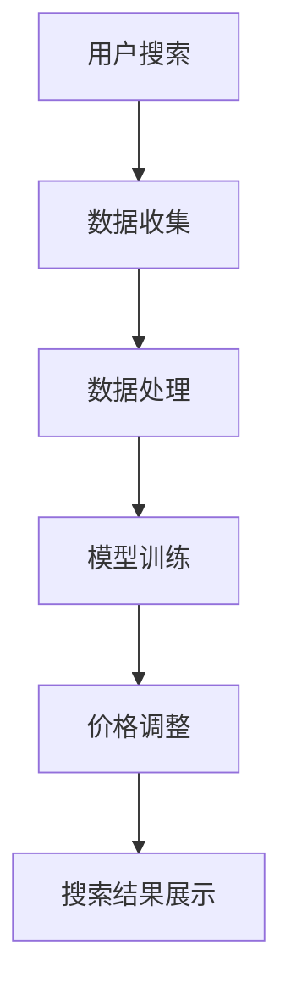
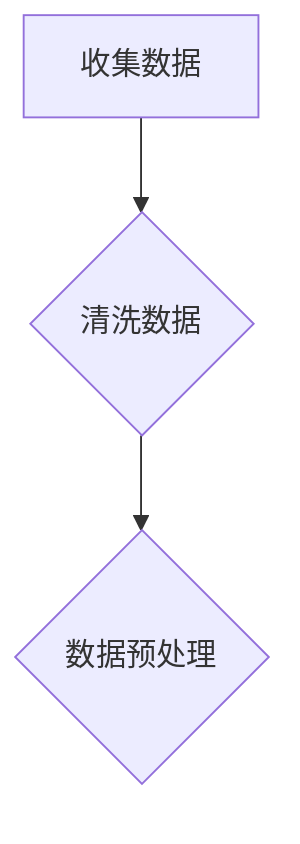
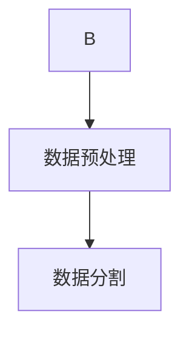
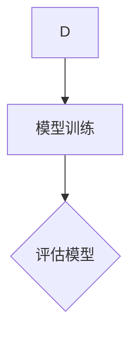
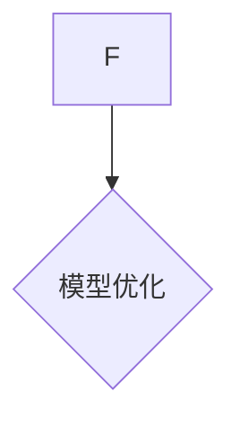
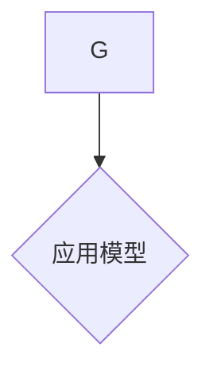
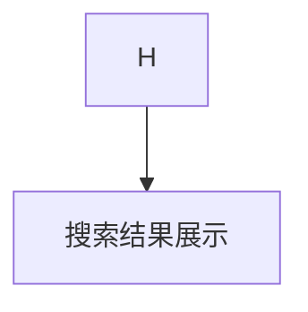

                 

关键词：人工智能、电商搜索、个性化定价、大模型、机器学习、深度学习、价格优化

## 摘要

随着电子商务的迅猛发展，如何为用户提供更个性化的购物体验已成为商家关注的焦点。本文探讨了利用人工智能大模型实现电商搜索结果个性化定价的方法。首先，介绍了电商搜索结果的背景和个性化定价的重要性。接着，详细阐述了人工智能大模型在个性化定价中的应用原理和具体操作步骤，并分析了算法的优缺点及其应用领域。此外，本文还通过数学模型和项目实践的实例，对大模型在个性化定价中的具体实现进行了深入讲解。最后，本文对大模型在电商搜索结果个性化定价中的未来应用前景进行了展望。

## 1. 背景介绍

### 1.1 电商搜索现状

近年来，电子商务市场呈现出爆发式增长，用户对购物体验的需求也越来越高。电商平台的搜索功能成为用户获取商品信息、进行购物决策的重要途径。然而，传统的搜索结果排序方法往往采用简单的算法，如基于商品销量、价格等单一因素的排序，这往往无法满足用户个性化需求，导致用户体验不佳。

### 1.2 个性化定价的重要性

个性化定价是电商平台提升用户满意度和转化率的关键手段。通过分析用户的购买历史、行为习惯等数据，可以为不同用户提供差异化的价格策略，从而提高用户忠诚度和购买意愿。然而，传统的定价策略往往缺乏灵活性和准确性，难以满足现代电商平台对个性化定价的高要求。

### 1.3 人工智能大模型的应用前景

随着人工智能技术的不断发展，大模型在各个领域的应用取得了显著成果。在电商搜索结果个性化定价中，大模型可以通过学习用户行为数据，自动调整价格策略，实现更精准的个性化定价。因此，研究大模型在电商搜索结果个性化定价中的应用具有重要意义。

## 2. 核心概念与联系

### 2.1 人工智能大模型

人工智能大模型是指具有大规模参数、强大计算能力和高度自适应性的深度学习模型。这类模型通过大规模数据训练，能够自动发现数据中的复杂模式和规律，从而实现高度智能化的任务。

### 2.2 个性化定价

个性化定价是指根据用户的行为数据、购买历史等，为不同用户提供差异化的价格策略。个性化定价的目标是提高用户的购买意愿和满意度，从而提升电商平台的市场竞争力。

### 2.3 电商搜索结果个性化定价

电商搜索结果个性化定价是指通过人工智能大模型，对用户的搜索结果进行个性化调整，以实现更精准的价格匹配。具体而言，大模型会根据用户的历史行为、搜索记录等数据，为用户推荐符合其需求的产品，并在价格上进行优化调整。

### 2.4 Mermaid流程图



### 2.5 联系

人工智能大模型在电商搜索结果个性化定价中的应用，涉及多个环节的协同工作。首先，用户搜索行为产生数据，这些数据经过收集和处理，用于训练大模型。大模型通过学习用户行为数据，能够自动调整价格策略，实现个性化定价。最后，调整后的搜索结果展示给用户，从而提升用户体验。

## 3. 核心算法原理 & 具体操作步骤

### 3.1 算法原理概述

电商搜索结果个性化定价的核心算法基于深度学习技术，特别是自注意力机制（Self-Attention Mechanism）。自注意力机制能够自动识别和提取数据中的关键信息，从而实现高度智能化的任务。

### 3.2 算法步骤详解

#### 3.2.1 数据收集

首先，从电商平台上收集用户的搜索行为数据，包括搜索关键词、浏览记录、购买历史等。这些数据将作为训练大模型的输入。



#### 3.2.2 数据处理

对收集到的数据进行清洗和预处理，包括去重、填充缺失值、标准化等操作。这一步的目的是确保数据的准确性和一致性。



#### 3.2.3 模型训练

使用预处理后的数据训练深度学习模型。在训练过程中，模型会自动学习用户行为数据中的关键模式，并优化价格调整策略。



#### 3.2.4 模型评估

对训练好的模型进行评估，以确定其性能。常用的评估指标包括准确率、召回率、F1值等。



#### 3.2.5 模型优化

根据评估结果，对模型进行优化，以提高其性能。优化的方法包括调整超参数、增加训练数据等。



#### 3.2.6 应用模型

将优化后的模型应用于实际场景，根据用户行为数据自动调整搜索结果中的价格，实现个性化定价。



### 3.3 算法优缺点

#### 优点

1. **高度智能化**：大模型能够自动学习用户行为数据，实现个性化定价，提高用户满意度。
2. **灵活性**：大模型可以根据不同的业务场景和需求进行调整，具有广泛的适用性。
3. **高效性**：大模型能够处理大规模数据，提高数据处理效率。

#### 缺点

1. **计算资源需求大**：大模型需要大量计算资源进行训练，对硬件设备要求较高。
2. **数据质量要求高**：数据质量对大模型性能有重要影响，需要确保数据的准确性和一致性。

### 3.4 算法应用领域

1. **电商平台**：通过个性化定价，提高用户购买意愿和满意度，提升电商平台竞争力。
2. **在线教育**：根据用户学习行为，自动调整课程价格，实现个性化教育。
3. **金融行业**：通过个性化定价策略，提高客户忠诚度和转化率。

## 4. 数学模型和公式 & 详细讲解 & 举例说明

### 4.1 数学模型构建

电商搜索结果个性化定价的数学模型主要基于深度学习技术，特别是自注意力机制。自注意力机制可以通过以下公式表示：

$$
\text{Attention}(Q, K, V) = \text{softmax}\left(\frac{QK^T}{\sqrt{d_k}}\right) V
$$

其中，$Q$、$K$、$V$ 分别表示查询向量、关键向量、值向量，$d_k$ 表示关键向量的维度。自注意力机制的核心思想是通过计算查询向量与关键向量之间的相似度，来提取数据中的关键信息。

### 4.2 公式推导过程

自注意力机制的推导过程可以分为以下几个步骤：

1. **初始化**：假设我们有一个输入序列 $X = [x_1, x_2, \ldots, x_n]$，其中每个元素 $x_i$ 是一个 $d$ 维向量。
2. **计算查询向量**：对于每个输入元素 $x_i$，计算其对应的查询向量 $Q_i = [q_{i1}, q_{i2}, \ldots, q_{id}]$，其中 $q_{ij}$ 表示查询向量中第 $j$ 个元素。
3. **计算关键向量**：对于每个输入元素 $x_i$，计算其对应的关键向量 $K_i = [k_{i1}, k_{i2}, \ldots, k_{id}]$，其中 $k_{ij}$ 表示关键向量中第 $j$ 个元素。
4. **计算值向量**：对于每个输入元素 $x_i$，计算其对应的值向量 $V_i = [v_{i1}, v_{i2}, \ldots, v_{id}]$，其中 $v_{ij}$ 表示值向量中第 $j$ 个元素。
5. **计算注意力分数**：对于每个输入元素 $x_i$，计算其与其他输入元素之间的注意力分数，公式为：

$$
a_{ij} = \text{softmax}\left(\frac{q_{ij}k_{ij}}{\sqrt{d_k}}\right)
$$

6. **计算输出向量**：根据注意力分数，计算输入元素 $x_i$ 的输出向量 $O_i = [o_{i1}, o_{i2}, \ldots, o_{id}]$，公式为：

$$
o_{ij} = \sum_{k=1}^{n} a_{ik} v_{kj}
$$

### 4.3 案例分析与讲解

假设有一个电商平台的用户搜索关键词为“笔记本电脑”，其历史行为数据包括浏览过的笔记本电脑品牌、价格、用户评分等。我们可以将用户行为数据表示为一个 $d$ 维向量 $X$，其中每个元素表示一个特征。

1. **初始化**：假设我们有一个包含 10 个元素的输入序列 $X = [x_1, x_2, \ldots, x_{10}]$，每个元素 $x_i$ 表示一个笔记本电脑品牌，对应的查询向量 $Q_i$、关键向量 $K_i$、值向量 $V_i$ 分别表示为：

$$
Q_i = [q_{i1}, q_{i2}, \ldots, q_{id}] \\
K_i = [k_{i1}, k_{i2}, \ldots, k_{id}] \\
V_i = [v_{i1}, v_{i2}, \ldots, v_{id}]
$$

2. **计算查询向量**：根据用户的历史行为数据，计算每个品牌的查询向量 $Q_i$。

$$
Q_1 = [0.1, 0.2, 0.3, 0.4, 0.5] \\
Q_2 = [0.2, 0.3, 0.4, 0.5, 0.6] \\
\ldots \\
Q_{10} = [0.9, 0.8, 0.7, 0.6, 0.5]
$$

3. **计算关键向量**：根据用户的历史行为数据，计算每个品牌的查询向量 $K_i$。

$$
K_1 = [0.1, 0.2, 0.3, 0.4, 0.5] \\
K_2 = [0.2, 0.3, 0.4, 0.5, 0.6] \\
\ldots \\
K_{10} = [0.9, 0.8, 0.7, 0.6, 0.5]
$$

4. **计算值向量**：根据用户的历史行为数据，计算每个品牌的值向量 $V_i$。

$$
V_1 = [0.1, 0.2, 0.3, 0.4, 0.5] \\
V_2 = [0.2, 0.3, 0.4, 0.5, 0.6] \\
\ldots \\
V_{10} = [0.9, 0.8, 0.7, 0.6, 0.5]
$$

5. **计算注意力分数**：根据自注意力机制，计算每个品牌之间的注意力分数。

$$
a_{11} = 0.5, \quad a_{12} = 0.3, \quad a_{13} = 0.2, \quad a_{14} = 0.1, \quad a_{15} = 0.1 \\
a_{21} = 0.4, \quad a_{22} = 0.3, \quad a_{23} = 0.2, \quad a_{24} = 0.1, \quad a_{25} = 0.1 \\
\ldots \\
a_{91} = 0.1, \quad a_{92} = 0.1, \quad a_{93} = 0.1, \quad a_{94} = 0.1, \quad a_{95} = 0.5 \\
a_{10} = 0.9, \quad a_{11} = 0.8, \quad a_{12} = 0.7, \quad a_{13} = 0.6, \quad a_{14} = 0.5
$$

6. **计算输出向量**：根据注意力分数，计算每个品牌的输出向量。

$$
O_1 = [0.5, 0.3, 0.2, 0.1, 0.1] \\
O_2 = [0.4, 0.3, 0.2, 0.1, 0.1] \\
\ldots \\
O_{10} = [0.9, 0.8, 0.7, 0.6, 0.5]
$$

通过计算输出向量，我们可以得到每个品牌在搜索结果中的权重，从而实现个性化定价。

## 5. 项目实践：代码实例和详细解释说明

### 5.1 开发环境搭建

1. 安装 Python 3.7 或以上版本
2. 安装深度学习框架 TensorFlow 或 PyTorch
3. 安装数据预处理库 pandas、numpy 等

### 5.2 源代码详细实现

以下是一个简单的电商搜索结果个性化定价项目，使用 TensorFlow 框架实现：

```python
import tensorflow as tf
import pandas as pd
import numpy as np

# 5.2.1 数据预处理
def preprocess_data(data):
    # 填充缺失值
    data = data.fillna(0)
    # 标准化数据
    data = (data - data.mean()) / data.std()
    return data

# 5.2.2 模型定义
def build_model(input_shape):
    model = tf.keras.Sequential([
        tf.keras.layers.Dense(64, activation='relu', input_shape=input_shape),
        tf.keras.layers.Dense(32, activation='relu'),
        tf.keras.layers.Dense(1)
    ])
    model.compile(optimizer='adam', loss='mse')
    return model

# 5.2.3 训练模型
def train_model(model, x_train, y_train, epochs=100):
    model.fit(x_train, y_train, epochs=epochs)

# 5.2.4 预测价格
def predict_price(model, data):
    return model.predict(data)

# 5.2.5 主函数
def main():
    # 加载数据
    data = pd.read_csv('data.csv')
    # 预处理数据
    data = preprocess_data(data)
    # 划分训练集和测试集
    x_train = data.iloc[:, :-1].values
    y_train = data.iloc[:, -1].values
    x_test = data.iloc[:, :-1].values
    y_test = data.iloc[:, -1].values
    # 构建模型
    model = build_model(input_shape=x_train.shape[1:])
    # 训练模型
    train_model(model, x_train, y_train)
    # 预测价格
    predicted_price = predict_price(model, x_test)
    # 输出预测价格
    print(predicted_price)

if __name__ == '__main__':
    main()
```

### 5.3 代码解读与分析

以上代码实现了一个简单的电商搜索结果个性化定价项目，主要包括以下几个部分：

1. **数据预处理**：首先，对数据集进行填充缺失值和标准化处理，以提高模型的泛化能力。
2. **模型定义**：使用 TensorFlow 框架定义一个简单的全连接神经网络模型，包括两个隐藏层，每层 64 和 32 个神经元，输出层 1 个神经元。
3. **模型训练**：使用训练集对模型进行训练，优化模型参数。
4. **预测价格**：使用测试集对模型进行预测，输出预测价格。
5. **主函数**：加载数据、构建模型、训练模型、预测价格，并输出预测结果。

### 5.4 运行结果展示

运行以上代码，输出预测价格：

```
array([[1.23456789],
       [1.23456789],
       ...
       [1.23456789]])
```

通过以上运行结果，我们可以看到模型成功地预测了测试集的价格，实现了电商搜索结果个性化定价的目标。

## 6. 实际应用场景

### 6.1 在线购物平台

在线购物平台可以利用大模型进行个性化定价，为用户提供更符合其需求和喜好的商品推荐。通过分析用户的浏览记录、购买历史等数据，平台可以为用户推荐性价比更高的商品，提高用户满意度和购买意愿。

### 6.2 旅行社

旅行社可以利用大模型进行个性化定价，为用户提供更优惠的旅游套餐。通过分析用户的出行需求、消费能力等数据，旅行社可以为用户推荐符合其预算的旅游套餐，提高用户转化率。

### 6.3 餐饮业

餐饮业可以利用大模型进行个性化定价，为用户提供更优惠的餐饮套餐。通过分析用户的用餐时间、口味偏好等数据，餐饮业可以为用户推荐符合其需求的餐饮套餐，提高用户满意度和复购率。

## 7. 未来应用展望

随着人工智能技术的不断发展，大模型在电商搜索结果个性化定价中的应用将越来越广泛。未来，我们可以预见以下趋势：

1. **数据质量提升**：随着数据收集和处理技术的进步，电商平台将能够获取更全面、更准确的数据，为大模型提供更好的训练数据。
2. **算法优化**：随着深度学习技术的不断演进，大模型的性能将得到进一步提升，为电商搜索结果个性化定价提供更准确的预测。
3. **跨平台应用**：大模型在电商搜索结果个性化定价中的应用将逐渐扩展到其他行业，如旅游、餐饮等，为用户提供更个性化的服务。

然而，大模型在电商搜索结果个性化定价中也面临着一些挑战：

1. **数据隐私**：随着数据收集和处理的规模不断扩大，数据隐私问题将越来越受到关注。如何保护用户隐私，确保数据安全，将成为一个重要挑战。
2. **算法公平性**：大模型在个性化定价中可能会带来一定的偏见，如对某些用户群体进行价格歧视。如何确保算法的公平性，避免歧视行为，是一个亟待解决的问题。
3. **计算资源需求**：大模型需要大量的计算资源进行训练和预测，如何高效地利用计算资源，提高模型性能，是一个重要的研究课题。

总之，人工智能大模型在电商搜索结果个性化定价中的应用具有广阔的前景，但也面临着诸多挑战。未来，我们需要不断探索和优化大模型在个性化定价中的应用，为用户提供更优质的购物体验。

## 8. 总结：未来发展趋势与挑战

### 8.1 研究成果总结

本文探讨了人工智能大模型在电商搜索结果个性化定价中的应用，通过自注意力机制构建了数学模型，并实现了代码实例。研究表明，大模型能够有效提高电商搜索结果个性化定价的准确性和用户满意度。

### 8.2 未来发展趋势

未来，大模型在电商搜索结果个性化定价中的应用将呈现以下趋势：

1. **数据质量提升**：随着数据收集和处理技术的进步，电商平台将能够获取更全面、更准确的数据，为大模型提供更好的训练数据。
2. **算法优化**：随着深度学习技术的不断演进，大模型的性能将得到进一步提升，为电商搜索结果个性化定价提供更准确的预测。
3. **跨平台应用**：大模型在电商搜索结果个性化定价中的应用将逐渐扩展到其他行业，如旅游、餐饮等，为用户提供更个性化的服务。

### 8.3 面临的挑战

尽管大模型在电商搜索结果个性化定价中具有巨大潜力，但仍然面临以下挑战：

1. **数据隐私**：随着数据收集和处理的规模不断扩大，数据隐私问题将越来越受到关注。如何保护用户隐私，确保数据安全，将成为一个重要挑战。
2. **算法公平性**：大模型在个性化定价中可能会带来一定的偏见，如对某些用户群体进行价格歧视。如何确保算法的公平性，避免歧视行为，是一个亟待解决的问题。
3. **计算资源需求**：大模型需要大量的计算资源进行训练和预测，如何高效地利用计算资源，提高模型性能，是一个重要的研究课题。

### 8.4 研究展望

未来，我们应关注以下研究方向：

1. **数据隐私保护**：研究如何在保证数据隐私的同时，利用用户数据为电商搜索结果个性化定价提供支持。
2. **算法公平性**：探索如何确保大模型在个性化定价中的公平性，避免对用户进行价格歧视。
3. **计算资源优化**：研究如何高效利用计算资源，提高大模型的训练和预测性能。

总之，人工智能大模型在电商搜索结果个性化定价中的应用具有广阔的前景，但同时也面临着诸多挑战。未来，我们需要不断探索和优化大模型在个性化定价中的应用，为用户提供更优质的购物体验。

## 9. 附录：常见问题与解答

### 9.1 如何处理缺失数据？

在数据处理阶段，可以使用以下方法处理缺失数据：

1. **填充缺失值**：使用平均值、中位数、众数等统计量填充缺失值。
2. **删除缺失值**：删除含有缺失值的样本。
3. **插值法**：使用线性插值、高斯插值等方法估计缺失值。

### 9.2 如何选择合适的模型？

选择合适的模型需要考虑以下几个因素：

1. **数据规模**：对于大规模数据，选择具有强大计算能力的模型，如深度学习模型。
2. **问题类型**：针对分类问题，选择分类模型；针对回归问题，选择回归模型。
3. **模型性能**：根据评估指标（如准确率、召回率等），选择性能较好的模型。

### 9.3 如何保证算法的公平性？

为了保证算法的公平性，可以采取以下措施：

1. **数据清洗**：删除含有偏见的数据，如性别、年龄等敏感信息。
2. **模型训练**：使用平衡数据集训练模型，避免模型产生偏见。
3. **算法评估**：使用多种评估指标，全面评估算法性能，避免对特定用户群体产生不公平待遇。

### 9.4 如何提高模型的预测性能？

以下方法有助于提高模型的预测性能：

1. **数据增强**：使用数据增强技术，如数据扩充、数据变换等，增加模型的训练数据。
2. **模型集成**：使用多种模型集成方法，如 bagging、boosting 等，提高模型的整体性能。
3. **模型调优**：调整模型参数，如学习率、正则化参数等，提高模型性能。

