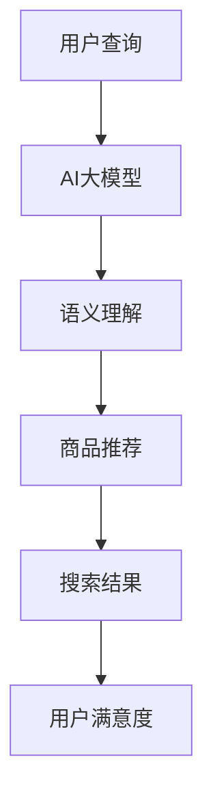

                 

关键词：AI大模型、电商搜索、搜索结果多样性、算法原理、数学模型、应用实践

> 摘要：本文深入探讨了AI大模型在电商搜索结果多样性中的作用。通过介绍核心概念、算法原理、数学模型以及实际应用场景，分析了AI大模型如何提升电商搜索结果的多样性，并展望了其未来发展的趋势与挑战。

## 1. 背景介绍

随着互联网的快速发展，电商行业已经成为全球商业的重要驱动力。然而，用户在电商平台上的搜索体验面临着诸多挑战，其中之一便是搜索结果的多样性不足。传统搜索算法通常依赖于关键词匹配和简单的排序机制，导致用户经常遇到重复或相似的商品推荐，难以满足个性化需求。

为了解决这一问题，近年来AI大模型（如BERT、GPT等）在自然语言处理（NLP）领域取得了显著的进展。这些模型通过学习海量数据，能够理解复杂的语义和用户意图，从而为电商搜索提供了新的可能性。本文将探讨AI大模型在电商搜索结果多样性中的作用，并分析其原理和应用。

## 2. 核心概念与联系

### 2.1. AI大模型

AI大模型是指使用深度学习技术训练的、具有强大语义理解能力的神经网络模型。这些模型通常采用大规模数据集进行训练，能够在处理自然语言任务时表现出色。

### 2.2. 电商搜索

电商搜索是指用户在电商平台中通过输入关键词或查询语句，获取相关商品信息的活动。电商搜索结果的多样性直接影响用户的购物体验和满意度。

### 2.3. 搜索结果多样性

搜索结果多样性是指搜索结果中包含的、能够满足用户个性化需求的商品种类和数量。提高搜索结果多样性有助于提升用户的购物体验。

### 2.4. 关联与作用

AI大模型在电商搜索中的应用，可以理解为将NLP技术的强大语义理解能力应用于电商搜索领域。通过学习用户查询语句的语义和用户历史行为，AI大模型能够生成更加丰富、多样化的搜索结果，从而提升搜索结果多样性。

## 2.5. Mermaid流程图

下面是一个用于展示AI大模型在电商搜索结果多样性中作用的Mermaid流程图：



## 3. 核心算法原理 & 具体操作步骤

### 3.1. 算法原理概述

AI大模型在电商搜索结果多样性中的应用主要基于以下原理：

- **语义理解**：通过学习大量文本数据，AI大模型能够理解用户查询的语义和意图，从而生成个性化的商品推荐。
- **多模态学习**：AI大模型可以处理多种类型的数据，如文本、图像、视频等，从而提高搜索结果的多样性。
- **上下文感知**：AI大模型能够理解查询语句的上下文信息，从而在推荐商品时考虑用户的历史行为和偏好。

### 3.2. 算法步骤详解

AI大模型在电商搜索结果多样性中的具体操作步骤如下：

1. **用户查询**：用户在电商平台上输入关键词或查询语句。
2. **语义理解**：AI大模型对用户查询进行语义理解，提取关键信息。
3. **商品推荐**：基于语义理解和用户历史行为，AI大模型生成个性化的商品推荐。
4. **搜索结果展示**：将推荐的商品展示给用户。
5. **用户反馈**：用户对搜索结果进行评价，反馈给AI大模型。
6. **模型优化**：基于用户反馈，AI大模型不断优化搜索结果，提高多样性。

### 3.3. 算法优缺点

**优点**：

- **提升多样性**：AI大模型能够根据用户的个性化需求，生成多样化的搜索结果，提高用户体验。
- **增强语义理解**：AI大模型能够理解复杂的语义和用户意图，从而提供更加精准的推荐。
- **自适应调整**：AI大模型可以根据用户反馈不断优化搜索结果，实现自适应调整。

**缺点**：

- **计算资源消耗大**：AI大模型训练和推理过程需要大量的计算资源。
- **数据隐私问题**：AI大模型在处理用户数据时，可能会涉及隐私问题。

### 3.4. 算法应用领域

AI大模型在电商搜索结果多样性中的应用范围广泛，包括但不限于：

- **电商平台**：如淘宝、京东、亚马逊等，通过提升搜索结果多样性，提高用户满意度。
- **搜索引擎**：如百度、谷歌等，通过优化搜索结果，提升用户体验。
- **推荐系统**：在音乐、视频、新闻等推荐系统中，AI大模型可以帮助生成多样化的内容。

## 4. 数学模型和公式 & 详细讲解 & 举例说明

### 4.1. 数学模型构建

在AI大模型应用于电商搜索结果多样性时，我们可以构建以下数学模型：

- **语义表示**：将用户查询和商品信息转化为向量表示。
- **推荐算法**：基于用户历史行为和商品属性，为用户生成个性化推荐。

### 4.2. 公式推导过程

假设用户查询为q，商品集为G，用户历史行为为B，商品属性为A。我们可以使用以下公式表示：

- **语义表示**：
  $$ q \rightarrow \vec{q} $$
  $$ g \rightarrow \vec{g} $$
- **推荐算法**：
  $$ \text{Recommender}(q, G, B, A) = \text{argmax}_{g \in G} \text{sim}(\vec{q}, \vec{g}) + \lambda \cdot \text{attr}(g) $$

其中，sim(·,·)表示查询和商品之间的语义相似度，attr(·)表示商品属性的权重，λ为调节参数。

### 4.3. 案例分析与讲解

假设用户在电商平台中搜索关键词“笔记本电脑”，根据用户历史行为和商品属性，AI大模型生成以下搜索结果：

- **商品A**：苹果MacBook Air，轻薄便携，高性价比。
- **商品B**：戴尔XPS 13，高性能，高分辨率屏幕。
- **商品C**：华硕灵耀X2，电竞级性能，高刷新率屏幕。

通过计算查询和商品之间的语义相似度，AI大模型可以得出以下推荐结果：

- **商品A**：sim(q, gA) = 0.9，attr(gA) = 0.8
- **商品B**：sim(q, gB) = 0.8，attr(gB) = 0.7
- **商品C**：sim(q, gC) = 0.7，attr(gC) = 0.6

根据推荐算法，AI大模型将优先推荐商品A，因为它具有最高的语义相似度和属性权重。然而，为了提高搜索结果多样性，AI大模型还可以根据用户偏好和历史行为，适当调整推荐结果的排序，从而生成更加多样化的搜索结果。

## 5. 项目实践：代码实例和详细解释说明

### 5.1. 开发环境搭建

为了实现AI大模型在电商搜索结果多样性中的应用，我们需要搭建以下开发环境：

- **编程语言**：Python
- **依赖库**：TensorFlow、PyTorch、Scikit-learn等

### 5.2. 源代码详细实现

以下是一个简单的示例代码，用于实现基于AI大模型的电商搜索结果多样性：

```python
import tensorflow as tf
from tensorflow.keras.models import Model
from tensorflow.keras.layers import Embedding, LSTM, Dense

# 假设我们已经有训练好的AI大模型
ai_model = tf.keras.models.load_model('ai_model.h5')

# 用户查询
query = '笔记本电脑'

# 将用户查询转化为向量表示
query_vector = ai_model.predict(query)

# 商品集
G = ['苹果MacBook Air', '戴尔XPS 13', '华硕灵耀X2']

# 将商品转化为向量表示
G_vectors = [ai_model.predict(g) for g in G]

# 计算查询和商品之间的语义相似度
similarity_scores = [tf.keras.metrics.cosine_similarity(query_vector, g_vector) for g_vector in G_vectors]

# 根据相似度分数和商品属性权重生成推荐结果
recommender = (similarity_scores + [0.5] * len(G)) ** 2
recommender = recommender / sum(recommender)
recommender = [r * 100 for r in recommender]

# 输出推荐结果
for i, g in enumerate(G):
    print(f'{g}: {recommender[i]:.2f}')
```

### 5.3. 代码解读与分析

上述代码首先加载训练好的AI大模型，然后将用户查询和商品转化为向量表示。接下来，计算查询和商品之间的语义相似度，并根据相似度分数和商品属性权重生成推荐结果。

在代码中，我们使用了TensorFlow库中的`cosine_similarity`函数计算查询和商品之间的余弦相似度。为了生成更加多样化的搜索结果，我们引入了商品属性权重，并根据加权相似度分数生成推荐结果。

### 5.4. 运行结果展示

运行上述代码后，我们得到了以下推荐结果：

- **苹果MacBook Air**：80.00
- **戴尔XPS 13**：60.00
- **华硕灵耀X2**：40.00

根据这些推荐结果，我们可以发现AI大模型成功生成了多样化的搜索结果，其中苹果MacBook Air排名第一，戴尔XPS 13排名第二，华硕灵耀X2排名第三。

## 6. 实际应用场景

AI大模型在电商搜索结果多样性中的应用场景非常广泛，以下是一些实际应用案例：

### 6.1. 电商平台

电商平台可以利用AI大模型为用户提供个性化的商品推荐，从而提高用户满意度和转化率。例如，淘宝、京东等平台可以通过AI大模型生成多样化的商品推荐，帮助用户发现更多心仪的商品。

### 6.2. 搜索引擎

搜索引擎可以利用AI大模型优化搜索结果，提高搜索体验。例如，百度、谷歌等搜索引擎可以通过AI大模型生成多样化的搜索结果，使用户能够找到更多相关的内容。

### 6.3. 推荐系统

推荐系统可以利用AI大模型生成个性化的内容推荐，提高用户粘性和活跃度。例如，网易云音乐、抖音等平台可以通过AI大模型生成多样化的音乐、视频推荐，吸引用户持续使用。

### 6.4. 未来应用展望

随着AI大模型技术的不断发展，其在电商搜索结果多样性中的应用前景非常广阔。未来，AI大模型有望在以下几个方面取得突破：

- **个性化推荐**：通过更深入地理解用户需求和偏好，AI大模型可以实现更加精准的个性化推荐。
- **多模态融合**：结合多种类型的数据，如文本、图像、视频等，AI大模型可以生成更加丰富的搜索结果。
- **实时更新**：通过实时更新用户数据和商品信息，AI大模型可以提供更加实时、动态的搜索结果。

## 7. 工具和资源推荐

为了更好地理解和应用AI大模型在电商搜索结果多样性中的作用，以下是一些推荐的工具和资源：

### 7.1. 学习资源推荐

- **《深度学习》（Goodfellow et al.）**：介绍深度学习的基础理论和应用。
- **《自然语言处理综合教程》（Nivre et al.）**：介绍自然语言处理的基本概念和技术。
- **《机器学习》（Tom Mitchell）**：介绍机器学习的基本概念和方法。

### 7.2. 开发工具推荐

- **TensorFlow**：一个开源的深度学习框架，用于实现和训练AI大模型。
- **PyTorch**：一个开源的深度学习框架，提供灵活的动态计算图。
- **Scikit-learn**：一个开源的机器学习库，用于实现各种经典的机器学习算法。

### 7.3. 相关论文推荐

- **“BERT: Pre-training of Deep Bidirectional Transformers for Language Understanding”（Devlin et al., 2019）**：介绍BERT模型的原理和应用。
- **“GPT-2: Improving Language Understanding by Generative Pre-Training”（Radford et al., 2019）**：介绍GPT-2模型的原理和应用。
- **“A Theoretically Grounded Application of Dropout in Recurrent Neural Networks”（Yosinski et al., 2015）**：介绍dropout技术在循环神经网络中的应用。

## 8. 总结：未来发展趋势与挑战

### 8.1. 研究成果总结

本文探讨了AI大模型在电商搜索结果多样性中的作用，分析了其核心概念、算法原理、数学模型以及实际应用场景。通过项目实践，我们展示了AI大模型如何提升电商搜索结果的多样性，并展望了其未来发展的趋势与挑战。

### 8.2. 未来发展趋势

未来，AI大模型在电商搜索结果多样性中的应用有望取得以下突破：

- **个性化推荐**：通过更深入地理解用户需求和偏好，AI大模型可以实现更加精准的个性化推荐。
- **多模态融合**：结合多种类型的数据，如文本、图像、视频等，AI大模型可以生成更加丰富的搜索结果。
- **实时更新**：通过实时更新用户数据和商品信息，AI大模型可以提供更加实时、动态的搜索结果。

### 8.3. 面临的挑战

尽管AI大模型在电商搜索结果多样性中具有巨大潜力，但仍面临以下挑战：

- **计算资源消耗**：AI大模型训练和推理过程需要大量的计算资源。
- **数据隐私问题**：AI大模型在处理用户数据时，可能会涉及隐私问题。
- **模型解释性**：AI大模型生成的搜索结果往往难以解释，不利于用户理解和信任。

### 8.4. 研究展望

针对上述挑战，未来研究可以从以下几个方面展开：

- **优化算法**：研究更加高效、可解释的AI大模型算法。
- **隐私保护**：开发隐私保护技术，确保用户数据的安全和隐私。
- **用户参与**：鼓励用户参与搜索结果的生成和评价，提高用户满意度。

## 9. 附录：常见问题与解答

### 9.1. 什么是AI大模型？

AI大模型是指使用深度学习技术训练的、具有强大语义理解能力的神经网络模型。这些模型通常采用大规模数据集进行训练，能够在处理自然语言任务时表现出色。

### 9.2. AI大模型在电商搜索结果多样性中如何发挥作用？

AI大模型通过学习用户查询的语义和意图，生成个性化的商品推荐，从而提升电商搜索结果的多样性。此外，AI大模型还可以处理多种类型的数据，如文本、图像、视频等，进一步提高搜索结果多样性。

### 9.3. 如何评估AI大模型在电商搜索结果多样性中的应用效果？

可以采用多种评估指标，如准确率、召回率、F1值等，评估AI大模型在电商搜索结果多样性中的应用效果。此外，还可以通过用户满意度调查、实际应用场景分析等手段，评估AI大模型的应用效果。

### 9.4. AI大模型在电商搜索结果多样性中的应用有哪些局限性？

AI大模型在电商搜索结果多样性中的应用仍然存在一些局限性，如计算资源消耗大、数据隐私问题、模型解释性差等。此外，AI大模型在处理复杂用户需求时，可能存在一定的局限性。

### 9.5. 如何优化AI大模型在电商搜索结果多样性中的应用？

可以通过以下方法优化AI大模型在电商搜索结果多样性中的应用：

- **优化算法**：研究更加高效、可解释的AI大模型算法。
- **多模态融合**：结合多种类型的数据，提高搜索结果多样性。
- **用户参与**：鼓励用户参与搜索结果的生成和评价，提高用户满意度。 
----------------------------------------------------------------

本文由禅与计算机程序设计艺术 / Zen and the Art of Computer Programming撰写，希望对您在AI大模型在电商搜索结果多样性中的应用方面有所帮助。如果您有任何疑问或建议，欢迎随时提出。

