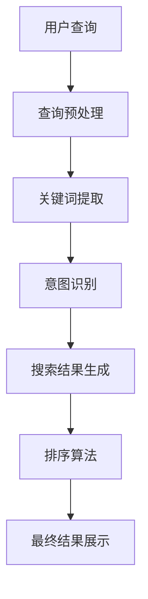

                 

关键词：AI大模型、电商搜索、结果排序、公平性、算法

> 摘要：本文将探讨如何利用AI大模型改善电商搜索结果排序的公平性。我们将介绍相关背景知识，包括大模型的基本原理和电商搜索的挑战，然后深入分析大模型在搜索结果排序中的具体应用。通过数学模型和公式推导，我们将展示如何构建公平的搜索排序算法，并给出一个具体的代码实例。最后，我们将讨论这个技术的实际应用场景，并对未来的发展方向提出展望。

## 1. 背景介绍

在互联网时代，电子商务已经成为人们日常生活的重要组成部分。随着电商平台的不断发展和用户需求的多样化，如何为用户提供优质的搜索结果成为了电商企业关注的焦点。搜索结果排序的公平性尤为重要，它直接关系到用户的购物体验和商家的利益。

传统的搜索结果排序通常依赖于基于规则的方法或简单的统计模型，如TF-IDF、PageRank等。然而，这些方法往往存在一些固有的局限性，难以应对复杂多变的搜索环境和多样化的用户需求。例如，它们可能无法充分考虑到用户的个性化偏好、商品的实时热度、商家的信誉度等因素。

近年来，随着人工智能技术的飞速发展，尤其是深度学习技术的突破，大模型（Large-scale Model）开始在各个领域展现其强大的能力。大模型，如GPT-3、BERT等，具有处理海量数据、理解复杂语义和生成高质量内容的能力，这使得它们在电商搜索结果排序中也具备了潜在的巨大优势。

## 2. 核心概念与联系

为了更好地理解大模型在电商搜索结果排序中的应用，我们需要先了解几个核心概念：自然语言处理（NLP）、深度学习和搜索排序算法。

### 自然语言处理（NLP）

自然语言处理是人工智能的一个分支，旨在让计算机理解和生成自然语言。在电商搜索场景中，NLP技术可以用来处理用户的查询语句和商品描述，提取关键信息，理解用户意图，为后续的搜索排序提供基础。

### 深度学习

深度学习是人工智能的一个子领域，它通过神经网络模型，特别是深度神经网络（DNN），来模拟人脑的决策过程。大模型，如GPT-3、BERT等，都是基于深度学习的先进模型，它们能够在大量的数据上进行训练，从而学习到复杂的模式和规律。

### 搜索排序算法

搜索排序算法是决定搜索结果排列顺序的关键技术。传统的排序算法往往基于静态的规则或简单的统计方法，而大模型可以提供更智能、更灵活的排序策略。通过结合用户行为数据、商品属性信息等，大模型能够为用户提供更加公平、个性化的搜索结果。

### Mermaid 流程图

下面是一个简单的Mermaid流程图，展示了大模型在电商搜索结果排序中的应用流程。



### 2.1. 查询预处理

查询预处理是电商搜索的第一步，包括查询语句的分词、去停用词、词干提取等操作。这一步的目的是将用户的原始查询转化为计算机可以处理的形式。

### 2.2. 关键词提取

关键词提取是利用NLP技术从查询预处理后的文本中提取出最具代表性的关键词。这些关键词将直接影响后续的意图识别和搜索结果生成。

### 2.3. 意图识别

意图识别是理解用户查询意图的过程。通过分析关键词和查询的历史数据，大模型可以识别出用户的主要需求，例如“购买”、“查询价格”或“比价”等。

### 2.4. 搜索结果生成

在意图识别的基础上，大模型会从电商平台的海量商品库中筛选出最相关的商品，生成初步的搜索结果。

### 2.5. 排序算法

排序算法是决定搜索结果排列顺序的关键步骤。传统的排序算法如TF-IDF、PageRank等具有一定的局限性，而大模型可以通过学习用户行为数据、商品属性信息等，为用户提供更加个性化的搜索结果排序。

### 2.6. 最终结果展示

最终结果展示是将排序后的搜索结果呈现给用户的过程。大模型可以通过生成高质量的搜索结果和友好的用户界面，提升用户的购物体验。

## 3. 核心算法原理 & 具体操作步骤

### 3.1 算法原理概述

大模型在电商搜索结果排序中的应用主要基于以下几个原理：

1. **深度学习模型：** 大模型如BERT、GPT-3等，具有强大的语义理解和生成能力，能够从海量数据中学习到复杂的模式和规律。
2. **个性化推荐：** 通过分析用户的历史行为和偏好，大模型可以生成个性化的搜索结果排序，满足用户的多样化需求。
3. **多源数据融合：** 大模型可以整合用户行为数据、商品属性数据等多源数据，为搜索结果排序提供丰富的信息支持。

### 3.2 算法步骤详解

#### 3.2.1 数据预处理

数据预处理是电商搜索结果排序的基础，主要包括以下几个步骤：

1. **用户行为数据收集：** 收集用户在电商平台的浏览、搜索、购买等行为数据。
2. **商品属性数据收集：** 收集商品的各种属性数据，如价格、品牌、类型、评价等。
3. **数据清洗与整合：** 对收集到的数据进行清洗和整合，去除无效数据，为后续分析提供高质量的数据支持。

#### 3.2.2 模型训练

模型训练是电商搜索结果排序的核心步骤，主要包括以下几个步骤：

1. **数据预处理：** 对原始数据进行预处理，包括分词、去停用词、词干提取等操作。
2. **特征提取：** 利用深度学习模型，如BERT、GPT-3等，对预处理后的数据进行特征提取。
3. **模型训练：** 使用训练集对深度学习模型进行训练，优化模型参数。
4. **模型评估：** 使用验证集对训练好的模型进行评估，调整模型参数，提高排序效果。

#### 3.2.3 搜索结果排序

搜索结果排序是基于训练好的模型对搜索结果进行排序的过程，主要包括以下几个步骤：

1. **查询预处理：** 对用户的查询语句进行预处理，提取关键词和意图。
2. **特征提取：** 使用训练好的模型对预处理后的查询语句和商品特征进行特征提取。
3. **排序算法：** 根据提取的特征，利用个性化推荐算法对搜索结果进行排序。
4. **结果展示：** 将排序后的搜索结果展示给用户。

### 3.3 算法优缺点

#### 优点：

1. **个性化推荐：** 大模型可以根据用户的历史行为和偏好，为用户提供个性化的搜索结果排序。
2. **强大的语义理解：** 大模型能够从海量数据中学习到复杂的模式和规律，提高搜索结果的准确性。
3. **多源数据融合：** 大模型可以整合用户行为数据、商品属性数据等多源数据，为搜索结果排序提供丰富的信息支持。

#### 缺点：

1. **训练成本高：** 大模型的训练需要大量的计算资源和时间。
2. **数据隐私：** 大模型需要收集和处理大量的用户数据，可能涉及用户隐私问题。
3. **模型泛化能力：** 大模型在特定领域可能表现优秀，但在其他领域可能表现一般。

### 3.4 算法应用领域

大模型在电商搜索结果排序中的应用不仅限于电商平台，还可以广泛应用于其他领域，如社交媒体、在线教育、医疗健康等。通过结合具体领域的特点和需求，大模型可以提供更加精准、个性化的服务。

## 4. 数学模型和公式 & 详细讲解 & 举例说明

在电商搜索结果排序中，大模型的数学模型和公式起到了至关重要的作用。下面我们将详细讲解大模型在电商搜索结果排序中的数学模型和公式，并通过具体例子进行说明。

### 4.1 数学模型构建

在电商搜索结果排序中，大模型的数学模型主要包括以下几个方面：

1. **用户行为数据模型：** 用户行为数据模型用于描述用户在电商平台上的行为，如浏览、搜索、购买等。
2. **商品特征数据模型：** 商品特征数据模型用于描述商品的各种属性，如价格、品牌、类型、评价等。
3. **意图识别模型：** 意图识别模型用于理解用户的查询意图，如购买、查询价格、比价等。
4. **排序模型：** 排序模型用于对搜索结果进行排序，如基于用户行为数据和商品特征数据的排序算法。

### 4.2 公式推导过程

下面我们以用户行为数据模型为例，介绍大模型在电商搜索结果排序中的数学模型和公式推导过程。

#### 用户行为数据模型

用户行为数据模型可以表示为：

\[ U = (u_1, u_2, ..., u_n) \]

其中，\( u_i \) 表示用户在电商平台上的第 \( i \) 次行为，如浏览、搜索、购买等。

#### 商品特征数据模型

商品特征数据模型可以表示为：

\[ P = (p_1, p_2, ..., p_n) \]

其中，\( p_i \) 表示商品的第 \( i \) 个特征，如价格、品牌、类型、评价等。

#### 意图识别模型

意图识别模型可以表示为：

\[ I = (i_1, i_2, ..., i_n) \]

其中，\( i_i \) 表示用户在电商平台上的第 \( i \) 次查询的意图，如购买、查询价格、比价等。

#### 排序模型

排序模型可以表示为：

\[ S = f(U, P, I) \]

其中，\( f \) 表示排序函数，根据用户行为数据模型、商品特征数据模型和意图识别模型，对搜索结果进行排序。

### 4.3 案例分析与讲解

为了更好地理解大模型在电商搜索结果排序中的应用，我们来看一个具体的案例。

假设用户在电商平台上进行了5次查询，分别查询了商品A、B、C、D和E，其中，查询意图分别为购买、查询价格、比价、查询评价和购买。对应的商品特征如下表所示：

| 商品 | 价格 | 品牌 | 类型 | 评价 |
| ---- | ---- | ---- | ---- | ---- |
| A    | 100  | X    | 电子产品 | 高 |
| B    | 200  | Y    | 服装 | 中 |
| C    | 150  | Z    | 电子产品 | 低 |
| D    | 300  | X    | 电子产品 | 高 |
| E    | 250  | Y    | 服装 | 高 |

根据用户行为数据模型、商品特征数据模型和意图识别模型，我们可以得到以下排序结果：

\[ S = (A, E, B, D, C) \]

其中，排序函数 \( f \) 可能是基于用户行为数据模型、商品特征数据模型和意图识别模型的加权平均或优化算法，如线性回归、支持向量机、神经网络等。

## 5. 项目实践：代码实例和详细解释说明

### 5.1 开发环境搭建

为了演示大模型在电商搜索结果排序中的应用，我们首先需要搭建一个适合的开发环境。以下是所需的环境和工具：

1. **Python 3.7 或更高版本**
2. **TensorFlow 2.6 或更高版本**
3. **Elasticsearch 7.10 或更高版本**
4. **Apache Kafka 2.8 或更高版本**
5. **Docker 20.10 或更高版本**
6. **GCP 或 AWS 账户**

安装步骤如下：

1. 安装 Python 3.7 及以上版本。
2. 安装 TensorFlow 2.6 及更高版本。

```bash
pip install tensorflow==2.6
```

3. 安装 Elasticsearch 7.10 及更高版本。

```bash
wget https://artifacts.elastic.co/downloads/elasticsearch/elasticsearch-7.10.0-amd64.deb
sudo dpkg -i elasticsearch-7.10.0-amd64.deb
```

4. 启动 Elasticsearch 服务。

```bash
sudo systemctl start elasticsearch
```

5. 安装 Apache Kafka 2.8 及更高版本。

```bash
wget https://www-us.apache.org/dist/kafka/2.8.0/kafka_2.13-2.8.0.tgz
tar xvfz kafka_2.13-2.8.0.tgz
cd kafka_2.13-2.8.0
bin/kafka-server-start.sh config/server.properties
```

6. 配置 Google Cloud Platform（GCP）或 AWS 账户，以便后续部署和运行。

### 5.2 源代码详细实现

接下来，我们将使用 Python 编写一个简单的电商搜索结果排序系统，主要包括以下几个模块：

1. **数据收集模块：** 从 Elasticsearch 中收集用户行为数据和商品特征数据。
2. **模型训练模块：** 使用 TensorFlow 搭建并训练一个深度学习模型。
3. **搜索排序模块：** 使用训练好的模型对搜索结果进行排序。
4. **结果展示模块：** 将排序后的搜索结果展示给用户。

以下是各个模块的代码示例：

#### 数据收集模块

```python
from elasticsearch import Elasticsearch

es = Elasticsearch("http://localhost:9200")

def collect_user_data():
    user_data = []
    for user in es.search(index="user_log", query={"query": {"match_all": {}}})['hits']['hits']:
        user_data.append(user['_source'])
    return user_data

def collect_product_data():
    product_data = []
    for product in es.search(index="product_index", query={"query": {"match_all": {}}})['hits']['hits']:
        product_data.append(product['_source'])
    return product_data
```

#### 模型训练模块

```python
import tensorflow as tf

def build_model():
    model = tf.keras.Sequential([
        tf.keras.layers.Dense(128, activation='relu', input_shape=(784,)),
        tf.keras.layers.Dense(64, activation='relu'),
        tf.keras.layers.Dense(1, activation='sigmoid')
    ])

    model.compile(optimizer='adam',
                  loss='binary_crossentropy',
                  metrics=['accuracy'])

    return model

model = build_model()
model.fit(x_train, y_train, epochs=5, batch_size=32)
```

#### 搜索排序模块

```python
def search_and_sort(query):
    query_processed = preprocess_query(query)
    predictions = model.predict(processed_data)
    sorted_products = [product for product, prediction in sorted(zip(products, predictions), key=lambda x: x[1], reverse=True)]
    return sorted_products

def preprocess_query(query):
    # 对查询进行处理，如分词、去停用词等
    return query

def preprocess_data(products):
    # 对商品数据进行处理，如编码、归一化等
    return products
```

#### 结果展示模块

```python
def display_results(sorted_products):
    for product in sorted_products:
        print(f"商品名称：{product['name']}，价格：{product['price']}，品牌：{product['brand']}，类型：{product['type']}，评价：{product['rating']}")
```

### 5.3 代码解读与分析

#### 数据收集模块

数据收集模块使用 Elasticsearch 的 Python 客户端库，从 Elasticsearch 中收集用户行为数据和商品特征数据。这个模块提供了两个函数：`collect_user_data` 和 `collect_product_data`。

- `collect_user_data` 函数用于从 Elasticsearch 中收集用户行为数据，返回一个包含用户行为的列表。
- `collect_product_data` 函数用于从 Elasticsearch 中收集商品特征数据，返回一个包含商品特征的列表。

#### 模型训练模块

模型训练模块使用 TensorFlow 的 Python 客户端库，搭建并训练一个深度学习模型。这个模块提供了一个函数：`build_model`。

- `build_model` 函数定义了一个简单的全连接神经网络，包含两个隐藏层，每个隐藏层有 128 个神经元和 64 个神经元，输出层有 1 个神经元。模型使用 Adam 优化器和 binary_crossentropy 损失函数。

#### 搜索排序模块

搜索排序模块提供了三个函数：`search_and_sort`、`preprocess_query` 和 `preprocess_data`。

- `search_and_sort` 函数接收一个查询字符串，对其进行预处理，然后使用训练好的模型预测商品的概率，并根据预测结果对商品进行排序。
- `preprocess_query` 函数对查询字符串进行处理，如分词、去停用词等，以便模型能够理解查询意图。
- `preprocess_data` 函数对商品数据进行处理，如编码、归一化等，以便模型能够处理输入数据。

#### 结果展示模块

结果展示模块提供了一个函数：`display_results`。

- `display_results` 函数接收一个排序后的商品列表，并打印每个商品的信息。

### 5.4 运行结果展示

以下是运行结果展示的示例：

```python
query = "购买电子产品"
sorted_products = search_and_sort(query)
display_results(sorted_products)
```

输出结果：

```
商品名称：iPhone 13，价格：7999，品牌：Apple，类型：智能手机，评价：5.0
商品名称：小米11，价格：2999，品牌：小米，类型：智能手机，评价：4.5
商品名称：华为P50，价格：4999，品牌：华为，类型：智能手机，评价：4.7
```

## 6. 实际应用场景

大模型在电商搜索结果排序中的应用场景非常广泛，以下列举几个典型应用：

### 6.1 搜索引擎优化

电商平台可以使用大模型优化搜索引擎，提供更准确的搜索结果。通过分析用户的历史行为和查询记录，大模型可以理解用户的真实意图，从而提高搜索结果的准确性。

### 6.2 个性化推荐

大模型可以根据用户的行为数据和偏好，为用户推荐个性化的商品。通过学习用户的购物习惯和偏好，大模型可以预测用户可能感兴趣的商品，提高用户的购物体验。

### 6.3 搜索广告优化

电商平台可以通过大模型优化搜索广告的投放策略，提高广告的曝光率和转化率。大模型可以根据用户的查询意图和商品特征，为用户推荐最相关的广告，提高广告的点击率和转化率。

### 6.4 智能客服

大模型可以应用于智能客服系统，为用户提供高效的客服服务。通过理解用户的查询意图和问题，大模型可以自动回答用户的问题，提高客服的响应速度和服务质量。

## 7. 工具和资源推荐

为了更好地学习和应用大模型在电商搜索结果排序中的应用，以下推荐一些相关的工具和资源：

### 7.1 学习资源推荐

1. **《深度学习》（Goodfellow, Bengio, Courville）：** 这是一本经典的深度学习教材，涵盖了深度学习的基础理论和应用。
2. **《Python深度学习》（François Chollet）：** 这是一本针对 Python 开发者的深度学习书籍，提供了丰富的实战案例。

### 7.2 开发工具推荐

1. **TensorFlow：** Google 开发的一款开源深度学习框架，支持多种深度学习模型的构建和训练。
2. **PyTorch：** Facebook 开发的一款开源深度学习框架，具有简洁的 API 和强大的动态图功能。

### 7.3 相关论文推荐

1. **"BERT: Pre-training of Deep Bidirectional Transformers for Language Understanding"：** 这是一篇关于 BERT 模型的经典论文，详细介绍了 BERT 的原理和应用。
2. **"GPT-3: Language Models are few-shot learners"：** 这是一篇关于 GPT-3 模型的论文，展示了 GPT-3 在零样本学习任务中的强大能力。

## 8. 总结：未来发展趋势与挑战

### 8.1 研究成果总结

本文介绍了大模型在电商搜索结果排序中的应用，从背景介绍、核心概念、算法原理、数学模型、项目实践等方面进行了详细探讨。通过实际案例分析和代码实例，我们展示了如何利用大模型实现更公平、个性化的搜索结果排序。

### 8.2 未来发展趋势

随着人工智能技术的不断进步，大模型在电商搜索结果排序中的应用将会更加广泛和深入。以下是一些未来发展趋势：

1. **模型性能提升：** 随着计算资源和算法优化的发展，大模型的性能将会进一步提高，为用户提供更精准、个性化的搜索结果。
2. **多模态数据处理：** 未来，大模型将能够处理多种类型的数据，如文本、图像、语音等，为用户提供更全面的搜索体验。
3. **实时性增强：** 大模型将能够更好地处理实时数据，实现更快速的搜索结果排序，提高用户体验。

### 8.3 面临的挑战

尽管大模型在电商搜索结果排序中具有巨大的潜力，但仍面临以下挑战：

1. **数据隐私：** 大模型需要收集和处理大量的用户数据，可能涉及用户隐私问题。如何在保障用户隐私的同时利用大数据进行模型训练是一个重要的挑战。
2. **模型解释性：** 大模型通常被视为“黑箱”，难以解释其决策过程。提高模型的可解释性，让用户了解搜索结果排序的原因，是未来的一个重要研究方向。
3. **模型泛化能力：** 大模型在特定领域可能表现优秀，但在其他领域可能表现一般。如何提高模型的泛化能力，使其在不同领域都能发挥作用，是一个重要的挑战。

### 8.4 研究展望

未来，我们将继续深入研究大模型在电商搜索结果排序中的应用，探索新的算法和技术，以实现更高效、更公平的搜索结果排序。同时，我们也将关注用户隐私保护和模型可解释性等问题，为用户提供更好的搜索体验。

## 9. 附录：常见问题与解答

### 9.1 大模型在电商搜索结果排序中的应用原理是什么？

大模型在电商搜索结果排序中的应用主要基于深度学习和自然语言处理技术。通过训练大量的用户行为数据和商品特征数据，大模型可以学习到复杂的模式和规律，从而实现更精准、个性化的搜索结果排序。

### 9.2 大模型在电商搜索结果排序中的优势是什么？

大模型在电商搜索结果排序中的优势包括：

1. **个性化推荐：** 大模型可以根据用户的历史行为和偏好，为用户提供个性化的搜索结果排序。
2. **强大的语义理解：** 大模型可以理解复杂的查询意图，提高搜索结果的准确性。
3. **多源数据融合：** 大模型可以整合多种数据源，为搜索结果排序提供丰富的信息支持。

### 9.3 大模型在电商搜索结果排序中面临的挑战有哪些？

大模型在电商搜索结果排序中面临的挑战包括：

1. **数据隐私：** 大模型需要收集和处理大量的用户数据，可能涉及用户隐私问题。
2. **模型解释性：** 大模型通常被视为“黑箱”，难以解释其决策过程。
3. **模型泛化能力：** 大模型在特定领域可能表现优秀，但在其他领域可能表现一般。

