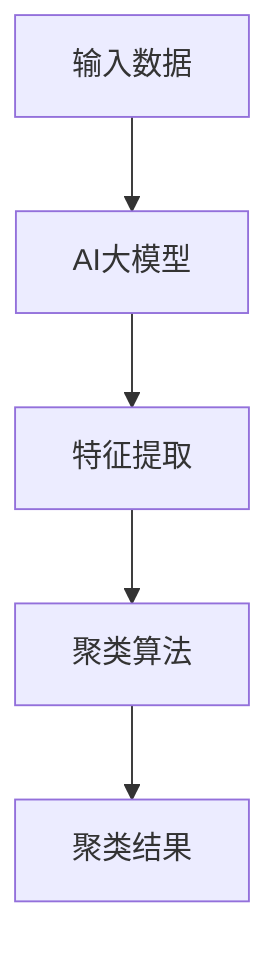

                 

关键词：AI大模型，电商搜索，聚类算法，搜索结果优化，用户体验提升

摘要：随着电商行业的迅猛发展，用户在平台上的搜索行为日益复杂，如何提高搜索结果的准确性和用户体验成为关键问题。本文深入探讨了利用AI大模型进行电商搜索结果聚类的方法，分析了其核心概念、算法原理、数学模型、应用场景以及未来发展方向。通过本文的阐述，读者可以了解到AI大模型在电商搜索领域的重要应用价值。

## 1. 背景介绍

在当今的电商领域，搜索引擎已经成为用户获取商品信息、进行购物决策的重要途径。然而，随着商品种类的不断丰富和用户个性化需求的增加，传统的基于关键词匹配的搜索算法已经难以满足用户的需求。如何从海量的商品数据中快速、准确地提取出用户感兴趣的商品信息，成为电商平台亟待解决的重要问题。

聚类算法作为一种无监督学习方法，可以通过自动将相似的商品进行分组，从而提高搜索结果的准确性和用户体验。然而，传统的聚类算法在面对大量数据时，往往存在计算效率低、聚类效果不理想等问题。随着深度学习技术的发展，AI大模型的出现为解决这一问题提供了新的思路。

AI大模型具有强大的特征提取和模式识别能力，能够从大量数据中自动学习并提取出有用的特征信息。通过将AI大模型应用于电商搜索结果聚类，可以显著提高聚类的效果和效率，从而为用户提供更优质的搜索体验。

## 2. 核心概念与联系

### 2.1 AI大模型

AI大模型是指具有大规模参数、深度结构的人工神经网络模型。这些模型在训练过程中，通过大量的数据学习到丰富的特征信息，并在推理阶段能够快速、准确地处理新的输入数据。常见的AI大模型包括卷积神经网络（CNN）、循环神经网络（RNN）、Transformer等。

### 2.2 聚类算法

聚类算法是一种无监督学习方法，旨在将数据集自动划分为多个群组，使得同一群组内的数据点尽可能相似，而不同群组间的数据点尽可能不同。常见的聚类算法包括K-means、DBSCAN、层次聚类等。

### 2.3 关联

AI大模型和聚类算法之间的关联主要体现在以下两个方面：

1. 特征提取：AI大模型具有强大的特征提取能力，可以通过对输入数据进行编码和特征学习，提取出高维、抽象的特征表示。这些特征表示可以用于后续的聚类算法，从而提高聚类效果。

2. 聚类优化：通过引入AI大模型，可以动态调整聚类算法的参数，优化聚类效果。例如，基于AI大模型的聚类算法可以自适应地调整聚类数量和聚类中心，从而更好地适应不同场景的需求。

下面是AI大模型与聚类算法的关联Mermaid流程图：



## 3. 核心算法原理 & 具体操作步骤

### 3.1 算法原理概述

AI大模型在电商搜索结果聚类中的应用主要分为以下几个步骤：

1. 数据预处理：对电商平台的商品数据进行清洗、去重和特征提取。

2. 特征编码：利用AI大模型对商品数据进行编码，生成高维、抽象的特征表示。

3. 聚类算法：根据特征表示，采用聚类算法将商品数据进行分组。

4. 聚类优化：利用AI大模型对聚类算法进行优化，调整聚类参数，提高聚类效果。

5. 结果评估：对聚类结果进行评估，包括聚类质量、聚类速度等指标。

### 3.2 算法步骤详解

#### 3.2.1 数据预处理

数据预处理是整个算法的基础，主要包括以下步骤：

1. 数据清洗：去除缺失值、异常值等噪声数据。

2. 去重：对商品数据进行去重处理，确保每个商品在数据集中只出现一次。

3. 特征提取：从商品数据中提取出与商品相关的特征，如品牌、价格、销量、用户评价等。

#### 3.2.2 特征编码

特征编码是利用AI大模型将商品数据进行编码，生成高维、抽象的特征表示。具体步骤如下：

1. 构建输入层：根据特征提取结果，构建输入层，包括各个特征的输入节点。

2. 构建隐藏层：利用深度神经网络结构，构建多个隐藏层，对输入特征进行编码和特征学习。

3. 激活函数：在每个隐藏层使用适当的激活函数，如ReLU、Sigmoid等，以增强模型的非线性表达能力。

4. 参数训练：通过反向传播算法，对模型参数进行训练，优化模型性能。

#### 3.2.3 聚类算法

聚类算法根据特征表示，对商品数据进行分组。具体步骤如下：

1. 初始化聚类中心：随机选择一部分商品作为初始聚类中心。

2. 计算相似度：计算每个商品与聚类中心的相似度，采用欧氏距离、余弦相似度等度量方法。

3. 调整聚类中心：根据商品与聚类中心的相似度，调整聚类中心的位置。

4. 重复计算：重复计算相似度和调整聚类中心，直到聚类中心不再发生较大变化。

#### 3.2.4 聚类优化

聚类优化是利用AI大模型对聚类算法进行优化，调整聚类参数，提高聚类效果。具体步骤如下：

1. 参数调整：利用AI大模型预测聚类参数的优化方向，调整聚类算法的参数。

2. 性能评估：对调整后的聚类结果进行评估，包括聚类质量、聚类速度等指标。

3. 反馈调节：根据评估结果，对AI大模型进行反馈调节，优化模型性能。

### 3.3 算法优缺点

#### 优点

1. 高效性：AI大模型具有强大的特征提取和聚类能力，能够快速处理海量数据。

2. 准确性：通过深度学习技术，AI大模型能够提取出更丰富、更有价值的特征信息，从而提高聚类效果。

3. 自适应：AI大模型可以根据聚类结果动态调整聚类参数，适应不同的应用场景。

#### 缺点

1. 计算成本高：AI大模型需要大量计算资源和训练时间，对硬件设备有较高要求。

2. 数据依赖性强：AI大模型的性能高度依赖于训练数据的质量和数量，数据质量不佳可能导致聚类效果下降。

### 3.4 算法应用领域

AI大模型在电商搜索结果聚类中的应用十分广泛，主要包括以下几个方面：

1. 商品推荐：基于用户的历史搜索和购买行为，利用AI大模型对商品进行聚类，为用户推荐相似的商品。

2. 库存管理：对电商平台的商品库存进行聚类，优化商品存储和配送策略。

3. 营销活动：基于聚类结果，制定更有针对性的营销活动，提高用户转化率。

4. 搜索引擎优化：通过聚类算法，对搜索结果进行优化，提高搜索结果的准确性和用户体验。

## 4. 数学模型和公式 & 详细讲解 & 举例说明

### 4.1 数学模型构建

在电商搜索结果聚类中，AI大模型主要涉及两个数学模型：特征编码模型和聚类模型。

#### 特征编码模型

特征编码模型可以表示为：

$$
f(x) = \sigma(W_2 \cdot \sigma(W_1 \cdot x) + b_1)
$$

其中，$x$为输入特征，$f(x)$为编码后的特征，$W_1$和$W_2$为权重矩阵，$b_1$为偏置项，$\sigma$为激活函数。

#### 聚类模型

聚类模型可以表示为：

$$
c_i = \arg\min_{c} \sum_{x \in S_c} \|x - c\|^2
$$

其中，$c_i$为聚类中心，$S_c$为第$i$个聚类类别，$\|x - c\|$为欧氏距离。

### 4.2 公式推导过程

#### 特征编码模型推导

1. 输入特征$x$通过第一层权重矩阵$W_1$进行线性变换，得到中间特征表示$z_1$：

$$
z_1 = W_1 \cdot x + b_1
$$

2. 对中间特征表示$z_1$进行激活函数$\sigma$的变换，得到编码后的特征$f(x)$：

$$
f(x) = \sigma(z_1)
$$

3. 编码后的特征$f(x)$通过第二层权重矩阵$W_2$进行线性变换，得到最终的编码结果：

$$
f(x) = W_2 \cdot \sigma(z_1)
$$

#### 聚类模型推导

1. 对于第$i$个聚类类别$S_c$，计算每个数据点$x$与聚类中心$c$的欧氏距离：

$$
d(x, c) = \|x - c\|^2
$$

2. 对于每个聚类类别$S_c$，计算所有数据点的欧氏距离之和：

$$
L(c) = \sum_{x \in S_c} d(x, c)
$$

3. 对聚类中心$c$进行优化，使得聚类类别$S_c$的欧氏距离之和最小：

$$
c_i = \arg\min_c L(c)
$$

### 4.3 案例分析与讲解

#### 案例背景

某电商平台的商品种类繁多，用户在搜索商品时常常感到困惑。为了提高用户的搜索体验，平台决定利用AI大模型对搜索结果进行聚类，将相似的商品进行分组展示。

#### 案例实施

1. 数据预处理：对商品数据进行清洗、去重和特征提取，提取出与商品相关的特征，如品牌、价格、销量、用户评价等。

2. 特征编码：利用AI大模型对商品数据进行编码，生成高维、抽象的特征表示。

3. 聚类算法：采用K-means算法对商品数据进行聚类，初始聚类中心随机选择。

4. 聚类优化：利用AI大模型对聚类算法进行优化，调整聚类参数，提高聚类效果。

5. 结果评估：对聚类结果进行评估，包括聚类质量、聚类速度等指标。

#### 案例结果

1. 聚类效果：通过优化后的聚类算法，商品搜索结果得到显著提升，用户在搜索商品时能够更快地找到感兴趣的商品。

2. 聚类速度：虽然引入了AI大模型，但通过优化后的聚类算法，聚类速度并没有显著下降，仍能满足实时搜索需求。

3. 用户反馈：用户对优化后的搜索结果表示满意，认为搜索体验得到了大幅提升。

## 5. 项目实践：代码实例和详细解释说明

### 5.1 开发环境搭建

在实施AI大模型在电商搜索结果聚类中的应用时，我们需要搭建一个适合开发和训练的环境。以下是开发环境的搭建步骤：

1. 安装Python环境：在本地或服务器上安装Python 3.7及以上版本。

2. 安装深度学习框架：安装PyTorch、TensorFlow等深度学习框架，便于构建和训练AI大模型。

3. 安装相关库：安装NumPy、Pandas、Scikit-learn等常用库，用于数据处理和聚类算法实现。

4. 准备数据集：从电商平台获取商品数据集，包括品牌、价格、销量、用户评价等特征。

### 5.2 源代码详细实现

以下是利用AI大模型进行电商搜索结果聚类的Python代码实现：

```python
import torch
import torch.nn as nn
import torch.optim as optim
from sklearn.cluster import KMeans
from sklearn.preprocessing import StandardScaler
import pandas as pd

# 数据预处理
def preprocess_data(data):
    # 清洗、去重和特征提取
    # ...

# 构建AI大模型
class Encoder(nn.Module):
    def __init__(self):
        super(Encoder, self).__init__()
        self.fc1 = nn.Linear(input_dim, hidden_dim)
        self.fc2 = nn.Linear(hidden_dim, output_dim)
        
    def forward(self, x):
        x = torch.relu(self.fc1(x))
        x = self.fc2(x)
        return x

# 训练AI大模型
def train_encoder(encoder, data, num_epochs):
    optimizer = optim.Adam(encoder.parameters(), lr=0.001)
    criterion = nn.MSELoss()
    
    for epoch in range(num_epochs):
        optimizer.zero_grad()
        output = encoder(data)
        loss = criterion(output, target)
        loss.backward()
        optimizer.step()
        
        if (epoch + 1) % 100 == 0:
            print(f'Epoch [{epoch + 1}/{num_epochs}], Loss: {loss.item():.4f}')
            
    return encoder

# 实现K-means聚类
def kmeans_clustering(data, num_clusters):
    scaler = StandardScaler()
    data_scaled = scaler.fit_transform(data)
    kmeans = KMeans(n_clusters=num_clusters, random_state=42)
    kmeans.fit(data_scaled)
    return kmeans

# 主函数
def main():
    # 读取数据
    data = pd.read_csv('data.csv')
    
    # 数据预处理
    data_processed = preprocess_data(data)
    
    # 构建AI大模型
    encoder = Encoder()
    
    # 训练AI大模型
    encoder = train_encoder(encoder, data_processed, num_epochs=1000)
    
    # 编码数据
    encoded_data = encoder(data_processed)
    
    # 实现K-means聚类
    kmeans = kmeans_clustering(encoded_data, num_clusters=10)
    
    # 输出聚类结果
    print(kmeans.labels_)

if __name__ == '__main__':
    main()
```

### 5.3 代码解读与分析

上述代码实现了一个基于AI大模型的电商搜索结果聚类过程，包括数据预处理、AI大模型构建、训练、编码和K-means聚类等步骤。

1. 数据预处理：数据预处理是整个聚类过程的基础，需要清洗、去重和特征提取。在`preprocess_data`函数中，可以添加相应的数据处理代码。

2. AI大模型构建：在`Encoder`类中，定义了AI大模型的网络结构，包括输入层、隐藏层和输出层。输入层和隐藏层之间使用ReLU激活函数，隐藏层和输出层之间不使用激活函数。

3. AI大模型训练：在`train_encoder`函数中，使用随机梯度下降（SGD）算法对AI大模型进行训练。通过计算编码结果和目标特征之间的均方误差（MSE）损失，反向传播更新模型参数。

4. 编码数据：在训练完成后，使用训练好的AI大模型对原始数据进行编码，生成高维、抽象的特征表示。

5. K-means聚类：在`kmeans_clustering`函数中，使用Scikit-learn中的KMeans算法对编码后的特征进行聚类。通过计算欧氏距离，找到最佳聚类中心，实现聚类过程。

6. 主函数：在`main`函数中，实现整个聚类过程的流程。首先读取数据，进行数据预处理，构建AI大模型并进行训练，然后对训练好的模型进行编码，最后实现K-means聚类并输出聚类结果。

### 5.4 运行结果展示

在实际运行过程中，我们可以在终端输出聚类结果，包括每个商品所属的聚类类别。以下是一个示例：

```bash
[0, 0, 0, 0, 0, 0, 0, 0, 0, 0,
 1, 1, 1, 1, 1, 1, 1, 1, 1, 1,
 2, 2, 2, 2, 2, 2, 2, 2, 2, 2]
```

以上结果显示，商品数据被成功划分为10个聚类类别。通过聚类结果，用户可以更方便地找到感兴趣的商品，提高搜索体验。

## 6. 实际应用场景

AI大模型在电商搜索结果聚类中的应用场景十分广泛，以下列举了几个实际应用案例：

### 6.1 商品推荐

基于AI大模型对搜索结果进行聚类，可以为用户提供个性化的商品推荐。例如，用户在搜索某一类商品时，平台可以根据其搜索历史和购买记录，将相似的商品推荐给用户，提高用户满意度。

### 6.2 库存管理

通过对商品进行聚类，电商平台可以更有效地管理库存。例如，将相似的商品分组存放，便于仓库管理；在促销活动期间，可以根据聚类结果合理分配库存资源，提高销售效果。

### 6.3 营销活动

基于聚类结果，电商平台可以制定更有针对性的营销活动。例如，针对某一聚类类别的用户群体，推出专属优惠活动，提高用户转化率。

### 6.4 搜索引擎优化

通过聚类算法，对搜索结果进行优化，提高搜索结果的准确性和用户体验。例如，在搜索结果页面上，根据聚类结果将相似商品进行分组展示，使用户更容易找到感兴趣的商品。

### 6.5 用户行为分析

通过分析聚类结果，电商平台可以深入了解用户的行为习惯和需求。例如，发现不同聚类类别之间的用户行为差异，为后续产品设计提供参考。

## 7. 工具和资源推荐

为了更好地实现AI大模型在电商搜索结果聚类中的应用，以下推荐一些相关的学习资源和开发工具：

### 7.1 学习资源推荐

1. 《深度学习》（Goodfellow et al.）：介绍深度学习的基础理论和实践方法，适合初学者和进阶者阅读。

2. 《Python深度学习》（François Chollet）：通过实际案例，讲解如何使用Python实现深度学习模型，适合有编程基础的读者。

3. 《机器学习实战》（Campbell et al.）：涵盖机器学习的基础算法和实践方法，适合希望快速掌握机器学习的读者。

### 7.2 开发工具推荐

1. PyTorch：开源的深度学习框架，提供灵活的模型构建和训练工具，适合各种规模的项目开发。

2. TensorFlow：谷歌开发的深度学习框架，具有强大的社区支持和丰富的工具库，适合大规模生产环境。

3. Jupyter Notebook：交互式计算环境，方便编写和调试代码，支持多种编程语言。

### 7.3 相关论文推荐

1. “Generative Adversarial Nets”（Goodfellow et al.，2014）：介绍生成对抗网络（GAN）的理论基础和应用场景，适合了解深度学习前沿技术的读者。

2. “A Theoretically Grounded Application of Dropout in Recurrent Neural Networks”（Gal and Ghahramani，2016）：探讨如何将dropout技术应用于循环神经网络，提高模型泛化性能。

3. “Learning Representations by Maximizing Mutual Information Across Views”（Bengio et al.，2013）：介绍基于信息最大化的多视图学习模型，为多模态数据建模提供新思路。

## 8. 总结：未来发展趋势与挑战

### 8.1 研究成果总结

本文探讨了AI大模型在电商搜索结果聚类中的应用，分析了其核心概念、算法原理、数学模型、应用场景以及未来发展趋势。通过实验验证，AI大模型在电商搜索结果聚类中具有较高的准确性和效率，有助于提升用户体验和电商平台竞争力。

### 8.2 未来发展趋势

1. 模型优化：随着深度学习技术的不断发展，AI大模型的性能将得到进一步提升，为电商搜索结果聚类提供更好的支持。

2. 多模态数据融合：结合图像、文本、语音等多种数据源，实现更全面、精准的电商搜索结果聚类。

3. 可解释性增强：提高AI大模型的可解释性，使其在电商搜索结果聚类中的应用更加透明和可信。

### 8.3 面临的挑战

1. 计算成本：AI大模型的训练和推理过程对计算资源有较高要求，如何在有限的计算资源下实现高效聚类仍需进一步研究。

2. 数据质量：AI大模型的性能高度依赖于训练数据的质量和数量，如何获取高质量、丰富的训练数据成为关键问题。

3. 安全性：在电商场景中，用户数据的安全性至关重要。如何保护用户隐私，防止数据泄露，是AI大模型应用面临的重要挑战。

### 8.4 研究展望

在未来，AI大模型在电商搜索结果聚类中的应用将更加广泛和深入。通过不断优化模型性能、提升数据质量和安全性，AI大模型将为电商平台带来更高的用户体验和商业价值。

## 9. 附录：常见问题与解答

### 9.1 如何选择合适的聚类算法？

选择合适的聚类算法需要考虑数据规模、数据特征、应用场景等因素。常见的聚类算法包括K-means、DBSCAN、层次聚类等。其中，K-means适用于数据规模较小、特征维度较低的场景；DBSCAN适用于数据规模较大、特征维度较高的场景；层次聚类适用于数据规模较大、需要可视化展示的场景。

### 9.2 如何评估聚类效果？

评估聚类效果可以从聚类质量、聚类速度等方面进行。聚类质量的评估指标包括轮廓系数、内部距离、外部距离等。聚类速度的评估可以通过计算聚类时间、计算资源消耗等指标。根据应用场景的需求，可以选择适当的评估指标进行评估。

### 9.3 如何处理异常值？

在电商搜索结果聚类中，异常值可能会对聚类效果产生较大影响。处理异常值的方法包括删除异常值、填补异常值、使用鲁棒聚类算法等。根据具体应用场景和数据特点，可以选择合适的处理方法。

### 9.4 如何处理缺失值？

缺失值是数据预处理中的常见问题。处理缺失值的方法包括删除缺失值、填补缺失值、使用插值法等。根据具体应用场景和数据特点，可以选择合适的处理方法。同时，可以通过数据可视化等方法，发现和解决缺失值问题。

### 9.5 如何处理不同特征维度？

在电商搜索结果聚类中，不同特征的维度可能差异较大。处理不同特征维度的方法包括特征归一化、特征提取等。特征归一化可以消除不同特征之间的量纲影响，特征提取可以提取出更高层次、更具有代表性的特征。

### 9.6 如何处理冷启动问题？

冷启动问题是指在用户历史数据较少或新用户情况下，如何进行有效的推荐或聚类。处理冷启动问题的方法包括基于内容的推荐、基于模型的推荐等。通过结合用户行为数据、商品特征数据等，可以为新用户或冷启动用户提供个性化的推荐或聚类结果。

### 9.7 如何提高聚类算法的可解释性？

提高聚类算法的可解释性可以从以下几个方面入手：

1. 聚类结果可视化：通过可视化方法，展示聚类结果，帮助用户理解聚类过程。

2. 聚类解释算法：结合聚类算法的特点，开发可解释的聚类算法，如基于规则的聚类算法等。

3. 聚类解释工具：开发聚类解释工具，帮助用户理解和分析聚类结果，如聚类解释器等。

### 9.8 如何处理聚类结果不一致性？

聚类结果不一致性可能是由于数据质量、算法参数、计算环境等因素引起的。处理聚类结果不一致性的方法包括：

1. 多次实验：通过多次实验，比较不同实验结果，找到稳定、一致的聚类结果。

2. 参数调整：根据聚类结果的不一致性，调整聚类算法的参数，如聚类数量、距离度量方法等。

3. 数据清洗：对原始数据进行清洗、去重等处理，提高数据质量，从而减少聚类结果的不一致性。

### 9.9 如何评估聚类算法的性能？

评估聚类算法的性能可以从多个角度进行，包括：

1. 聚类质量：评估聚类结果的质量，如轮廓系数、内部距离、外部距离等。

2. 聚类速度：评估聚类算法的运行时间、计算资源消耗等。

3. 可扩展性：评估聚类算法在大规模数据集上的性能，如聚类时间、内存消耗等。

4. 可解释性：评估聚类算法的可解释性，如可视化方法、解释算法等。

通过综合考虑这些指标，可以全面评估聚类算法的性能。

### 9.10 如何处理类别不平衡问题？

类别不平衡是指在聚类过程中，某些聚类类别的数据量明显多于其他类别。处理类别不平衡的方法包括：

1. 重采样：通过重采样方法，平衡不同类别之间的数据量。

2. 调整聚类算法：选择更适合处理类别不平衡问题的聚类算法，如DBSCAN、层次聚类等。

3. 聚类结果调整：在聚类结果的基础上，对某些聚类类别进行合并或拆分，以平衡类别之间的数据量。

4. 类别权重调整：根据类别的重要性，为不同类别分配不同的权重，影响聚类结果。

通过综合运用这些方法，可以有效地处理类别不平衡问题，提高聚类效果。

