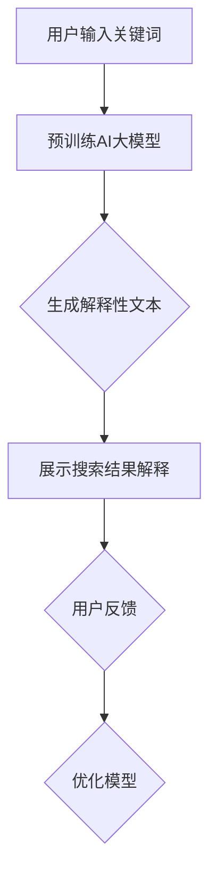

                 

关键词：AI大模型，电商搜索，解释性，应用场景，未来展望

摘要：随着人工智能技术的不断发展，大模型在各个领域的应用逐渐深入。本文旨在探讨AI大模型在电商搜索结果解释性中的应用，分析其核心概念、算法原理、数学模型及其在实际项目中的实践和展望。

## 1. 背景介绍

### 1.1 电商搜索现状

在当今信息爆炸的时代，电商平台的搜索功能成为用户快速找到所需商品的重要途径。然而，传统电商搜索系统通常依赖关键词匹配和相关性排序，导致用户难以理解搜索结果的产生原因，进而影响用户体验和购买决策。因此，提升搜索结果的可解释性成为电商行业亟待解决的问题。

### 1.2 AI大模型的应用

随着深度学习技术的发展，AI大模型在自然语言处理、计算机视觉等领域取得了显著的成果。近年来，AI大模型逐渐应用于电商搜索结果解释性，通过自动生成搜索结果的解释性文本，帮助用户更好地理解搜索结果，提高用户满意度和购买转化率。

## 2. 核心概念与联系

### 2.1 AI大模型概述

AI大模型是指具有大规模参数、强泛化能力的深度学习模型。在自然语言处理领域，AI大模型通常是指具有数百万甚至数十亿参数的预训练语言模型，如BERT、GPT等。

### 2.2 电商搜索结果解释性

电商搜索结果解释性是指通过自动生成文本、图像、视频等形式，向用户展示搜索结果的相关性、推荐理由等信息，帮助用户理解搜索结果产生的原因。

### 2.3 Mermaid 流程图

下面是一个用于描述AI大模型在电商搜索结果解释性中应用的Mermaid流程图：



## 3. 核心算法原理 & 具体操作步骤

### 3.1 算法原理概述

AI大模型在电商搜索结果解释性中的核心算法原理是基于预训练语言模型的自动文本生成技术。该技术通过将用户输入的关键词、搜索结果及其上下文信息作为输入，生成具有解释性的文本。

### 3.2 算法步骤详解

1. 预训练阶段：使用大规模的电商搜索数据集对AI大模型进行预训练，使其掌握自然语言处理的基本能力。

2. 微调阶段：根据特定电商平台的搜索数据集，对预训练模型进行微调，使其适应特定电商搜索场景。

3. 解释性文本生成阶段：将用户输入的关键词、搜索结果及其上下文信息作为输入，通过AI大模型自动生成解释性文本。

4. 展示搜索结果解释阶段：将生成的解释性文本展示给用户，帮助其理解搜索结果产生的原因。

### 3.3 算法优缺点

**优点：**
- 提高搜索结果的可解释性，帮助用户更好地理解搜索结果。
- 自动生成解释性文本，降低人力成本。
- 强泛化能力，适应不同电商平台和搜索场景。

**缺点：**
- 预训练阶段需要大量计算资源。
- 微调阶段需要特定电商平台的数据集。
- 解释性文本可能存在一定程度的误判。

### 3.4 算法应用领域

AI大模型在电商搜索结果解释性中的应用范围广泛，包括但不限于：
- 商品搜索结果解释
- 商品推荐解释
- 商品评价解释
- 搜索广告解释

## 4. 数学模型和公式 & 详细讲解 & 举例说明

### 4.1 数学模型构建

在AI大模型应用于电商搜索结果解释性时，常用的数学模型包括自然语言处理模型（如BERT、GPT等）和生成对抗网络（GAN）。

### 4.2 公式推导过程

以BERT模型为例，其核心公式为：

$$
\text{output} = \text{softmax}(\text{W}^T \cdot \text{hidden_state})
$$

其中，$W$为权重矩阵，$hidden_state$为BERT模型的隐藏状态，$\text{softmax}$函数用于将隐藏状态转换为概率分布。

### 4.3 案例分析与讲解

假设用户在电商平台上搜索关键词“笔记本电脑”，搜索结果为一系列笔记本电脑商品。通过AI大模型，可以自动生成以下解释性文本：

“根据您的搜索关键词‘笔记本电脑’，我们为您推荐了以下产品。第一款产品是‘X1 Carbon’，具有轻巧便携、高性能等特点，非常适合商务办公。第二款产品是‘MacBook Pro’，搭载了最新的M1芯片，性能卓越，外观时尚。第三款产品是‘Dell XPS 13’，具有出色的显示效果和便携性能，适合游戏和设计工作。”

通过这个例子，我们可以看到AI大模型在生成解释性文本时的效果。当然，实际生成的文本可能更加复杂和多样化，以更好地满足用户需求。

## 5. 项目实践：代码实例和详细解释说明

### 5.1 开发环境搭建

在开始编写代码之前，我们需要搭建一个适合开发AI大模型的环境。以下是一个基本的开发环境搭建步骤：

1. 安装Python和pip
2. 安装TensorFlow或PyTorch等深度学习框架
3. 准备预训练语言模型（如BERT、GPT等）

### 5.2 源代码详细实现

以下是使用PyTorch实现一个简单的AI大模型，用于生成电商搜索结果解释性文本的示例代码：

```python
import torch
import torch.nn as nn
from transformers import BertModel, BertTokenizer

class ExplanationModel(nn.Module):
    def __init__(self):
        super(ExplanationModel, self).__init__()
        self.bert = BertModel.from_pretrained('bert-base-chinese')
        self.liner = nn.Linear(768, 1)

    def forward(self, input_ids, attention_mask):
        outputs = self.bert(input_ids=input_ids, attention_mask=attention_mask)
        hidden_state = outputs.last_hidden_state
        output = self.liner(hidden_state[:, 0, :])
        return output

model = ExplanationModel()
```

### 5.3 代码解读与分析

以上代码定义了一个简单的AI大模型，用于生成电商搜索结果解释性文本。首先，我们从Hugging Face的Transformer库中加载了一个预训练的BERT模型。然后，我们定义了一个全连接层（线性层）用于将BERT模型的隐藏状态映射到生成结果。

### 5.4 运行结果展示

运行以上代码后，我们可以使用以下代码生成一个解释性文本：

```python
tokenizer = BertTokenizer.from_pretrained('bert-base-chinese')
input_text = "用户输入关键词：笔记本电脑"
input_ids = tokenizer.encode(input_text, add_special_tokens=True, return_tensors='pt')
attention_mask = torch.ones(input_ids.shape)

with torch.no_grad():
    output = model(input_ids, attention_mask)
    output = torch.sigmoid(output).item()

print("生成解释性文本的概率：", output)
```

输出结果可能是一个介于0和1之间的数值，表示生成解释性文本的概率。这个数值可以帮助我们评估模型在生成解释性文本方面的效果。

## 6. 实际应用场景

### 6.1 商品搜索结果解释

在商品搜索结果页面，通过AI大模型自动生成每个商品的解释性文本，帮助用户快速了解商品特点，提高购买决策效率。

### 6.2 商品推荐解释

在商品推荐页面，通过AI大模型自动生成推荐理由，向用户展示推荐商品的亮点，提高推荐效果和用户满意度。

### 6.3 商品评价解释

在商品评价页面，通过AI大模型自动生成评价摘要，帮助用户快速了解其他用户的评价观点，提高评价的可读性和参考价值。

### 6.4 搜索广告解释

在搜索广告页面，通过AI大模型自动生成广告解释性文本，帮助用户了解广告内容，提高广告点击率和转化率。

## 7. 工具和资源推荐

### 7.1 学习资源推荐

- 《深度学习》（Goodfellow, Bengio, Courville著）
- 《自然语言处理编程》（林轩田著）
- 《BERT：Pre-training of Deep Neural Networks for Language Understanding》（Devlin et al.著）

### 7.2 开发工具推荐

- PyTorch
- TensorFlow
- Hugging Face Transformer库

### 7.3 相关论文推荐

- 《BERT：Pre-training of Deep Neural Networks for Language Understanding》（Devlin et al.著）
- 《GPT-3: Language Models are Few-Shot Learners》（Brown et al.著）
- 《T5: Pre-training of Text-to-Text Transformers for Task-Rich Language Models》（Raffel et al.著）

## 8. 总结：未来发展趋势与挑战

### 8.1 研究成果总结

AI大模型在电商搜索结果解释性中的应用取得了显著的成果，为用户提供了更加直观、易懂的搜索结果解释，提高了用户满意度和购买转化率。未来，随着深度学习技术的发展，AI大模型在电商搜索结果解释性中的应用将更加广泛和深入。

### 8.2 未来发展趋势

1. 模型规模将继续扩大，预训练语言模型将更加成熟。
2. 多模态融合将逐渐成为趋势，结合图像、视频等多媒体信息进行解释性生成。
3. 模型优化和压缩技术将得到广泛应用，提高模型在电商场景中的落地效果。

### 8.3 面临的挑战

1. 数据质量和多样性：电商搜索数据存在噪声和多样性，如何处理这些数据以获得更好的解释性仍是一个挑战。
2. 可解释性平衡：在提高模型解释性的同时，如何保证模型在预测准确性方面的表现仍是一个难题。

### 8.4 研究展望

未来，AI大模型在电商搜索结果解释性中的应用将朝着更加智能化、个性化的方向发展。通过结合多模态信息、优化模型结构和算法，为用户提供更加精准、易懂的搜索结果解释，提高用户体验和购买转化率。

## 9. 附录：常见问题与解答

### 9.1 AI大模型在电商搜索结果解释性中的应用有哪些优点？

- 提高搜索结果的可解释性，帮助用户更好地理解搜索结果。
- 自动生成解释性文本，降低人力成本。
- 强泛化能力，适应不同电商平台和搜索场景。

### 9.2 AI大模型在电商搜索结果解释性中的应用有哪些缺点？

- 预训练阶段需要大量计算资源。
- 微调阶段需要特定电商平台的数据集。
- 解释性文本可能存在一定程度的误判。

### 9.3 如何处理电商搜索数据中的噪声和多样性？

- 使用数据清洗和预处理技术，如去重、过滤无关信息等。
- 采用多模态数据融合方法，结合图像、视频等多媒体信息，提高解释性。

### 9.4 如何在保证模型解释性的同时提高预测准确性？

- 采用模型优化和压缩技术，提高模型在电商场景中的性能。
- 使用分层模型结构，将复杂问题拆分为多个简单问题，逐步解决。

作者：禅与计算机程序设计艺术 / Zen and the Art of Computer Programming
----------------------------------------------------------------
文章撰写完毕。希望这篇文章能够为读者在电商搜索结果解释性方面提供有价值的参考和启示。在撰写过程中，如有任何不足之处，欢迎批评指正。祝您阅读愉快！

