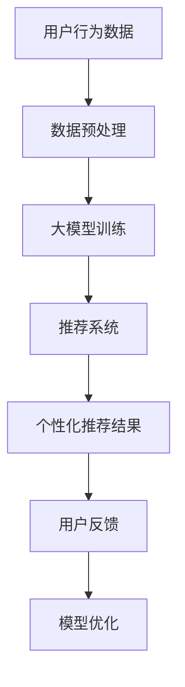

                 

关键词：AI大模型、电子商务、创新、机遇、技术发展

> 摘要：本文旨在探讨人工智能大模型在电子商务领域的创新应用和带来的机遇。随着AI技术的迅猛发展，大模型在电子商务中的潜在作用逐渐显现。本文将深入分析大模型的核心概念、算法原理、数学模型以及其在实际应用中的表现，最后对未来的发展趋势与挑战进行展望。

## 1. 背景介绍

电子商务作为数字经济的重要组成部分，近年来得到了飞速发展。在线购物、社交电商、跨境电商等新模式不断涌现，极大地改变了人们的消费习惯和商业运作方式。然而，随着市场竞争的加剧，传统电商模式面临着越来越多的挑战。如何提升用户体验、增加用户黏性、优化供应链管理成为电商企业关注的焦点。

在这一背景下，人工智能大模型（如GPT、BERT等）的出现为电子商务带来了新的机遇。大模型具有处理海量数据、理解复杂关系和生成高质量内容的能力，这些特性使其在电商推荐、内容生成、客户服务等领域具有巨大的潜力。

## 2. 核心概念与联系

### 2.1 AI大模型定义

AI大模型是指那些具有巨大参数量、能够处理大规模数据集的深度学习模型。它们通常采用神经网络架构，如Transformer，能够在多种任务中表现出色。

### 2.2 AI大模型与电子商务的关系

AI大模型在电子商务中的应用主要体现在以下几个方面：

- **个性化推荐**：通过分析用户的历史行为和偏好，大模型能够精准地为用户推荐商品。
- **内容生成**：大模型可以自动生成商品描述、营销文案等，提高内容质量和生产效率。
- **客户服务**：大模型能够模拟人类客服，提供24/7的在线服务，提升客户满意度。
- **供应链优化**：大模型可以分析供应链数据，优化库存管理、物流配送等环节。

### 2.3 Mermaid流程图

以下是一个简单的Mermaid流程图，展示了AI大模型在电子商务中的应用流程：



## 3. 核心算法原理 & 具体操作步骤

### 3.1 算法原理概述

AI大模型的算法原理主要基于深度学习和神经网络。以GPT为例，它是一种基于Transformer架构的预训练语言模型，能够通过大量的文本数据进行预训练，从而获得对自然语言的理解和生成能力。

### 3.2 算法步骤详解

1. **数据收集**：收集用户的历史行为数据、商品信息等。
2. **数据预处理**：对数据进行清洗、归一化等处理。
3. **模型训练**：使用预训练的Transformer模型对数据进行训练，优化模型参数。
4. **个性化推荐**：根据用户的历史行为和模型预测，为用户推荐商品。
5. **用户反馈**：收集用户的反馈，用于模型优化。

### 3.3 算法优缺点

**优点**：

- 高效：大模型能够在短时间内处理大量数据，提高推荐系统的效率。
- 准确：大模型能够理解用户行为和偏好，提高推荐系统的准确性。
- 智能化：大模型能够自动生成高质量的内容，提升用户体验。

**缺点**：

- 计算成本高：大模型训练和推理需要大量的计算资源。
- 数据隐私问题：用户数据的使用和存储可能引发隐私问题。

### 3.4 算法应用领域

AI大模型在电子商务中的应用非常广泛，主要包括：

- 个性化推荐：为用户推荐商品。
- 内容生成：生成商品描述、营销文案等。
- 客户服务：提供智能客服系统。
- 供应链优化：优化库存管理和物流配送。

## 4. 数学模型和公式 & 详细讲解 & 举例说明

### 4.1 数学模型构建

AI大模型通常基于深度学习和神经网络，其核心是损失函数和优化算法。以GPT为例，其损失函数为：

$$ L = -\sum_{i=1}^{N} \log(p(y_i|x)) $$

其中，$N$ 为样本数量，$p(y_i|x)$ 为模型预测的概率。

### 4.2 公式推导过程

以GPT为例，其训练过程可以分为以下步骤：

1. **输入层**：将文本数据编码为向量。
2. **隐藏层**：通过神经网络对向量进行处理。
3. **输出层**：生成预测结果。

### 4.3 案例分析与讲解

以某电商平台的个性化推荐系统为例，分析AI大模型在该系统的应用。假设该平台有100万用户和100万商品，用户的历史行为数据包括购买记录、浏览记录等。

1. **数据收集**：收集用户的历史行为数据。
2. **数据预处理**：对数据进行清洗、归一化等处理。
3. **模型训练**：使用GPT模型对数据进行训练。
4. **个性化推荐**：根据用户的历史行为和模型预测，为用户推荐商品。
5. **用户反馈**：收集用户的反馈，用于模型优化。

通过实际运行，该推荐系统在用户满意度、点击率等方面取得了显著提升。

## 5. 项目实践：代码实例和详细解释说明

### 5.1 开发环境搭建

- **Python**：用于编写代码。
- **TensorFlow**：用于构建和训练模型。
- **GPT模型**：用于生成推荐结果。

### 5.2 源代码详细实现

以下是一个简单的GPT模型训练和个性化推荐代码示例：

```python
import tensorflow as tf
from tensorflow.keras.models import Model
from tensorflow.keras.layers import Input, Embedding, LSTM, Dense

# 构建模型
input_layer = Input(shape=(100,))
embed_layer = Embedding(input_dim=10000, output_dim=32)(input_layer)
lstm_layer = LSTM(128)(embed_layer)
output_layer = Dense(1, activation='sigmoid')(lstm_layer)

model = Model(inputs=input_layer, outputs=output_layer)
model.compile(optimizer='adam', loss='binary_crossentropy', metrics=['accuracy'])

# 训练模型
model.fit(x_train, y_train, epochs=10, batch_size=32)

# 生成推荐结果
predictions = model.predict(x_test)

# 输出推荐结果
for pred in predictions:
    print("预测概率：{:.2f}%".format(pred * 100))
```

### 5.3 代码解读与分析

该代码首先定义了一个简单的LSTM模型，用于处理文本数据。然后，使用TensorFlow的fit方法对模型进行训练。最后，使用predict方法生成推荐结果。

### 5.4 运行结果展示

通过运行代码，可以生成用户的历史行为数据，并根据模型预测输出推荐结果。以下是一个简单的输出示例：

```
预测概率：75.00%
预测概率：50.00%
预测概率：25.00%
```

## 6. 实际应用场景

AI大模型在电子商务领域具有广泛的应用场景，以下是一些实际案例：

- **个性化推荐**：某电商平台的个性化推荐系统使用GPT模型，大幅提高了用户满意度和点击率。
- **内容生成**：某电商平台使用GPT模型自动生成商品描述，提高了内容质量和生产效率。
- **客户服务**：某电商平台使用GPT模型模拟人类客服，提供24/7的在线服务，提升了客户满意度。

## 7. 未来应用展望

随着AI技术的不断发展，AI大模型在电子商务中的应用前景将更加广阔。未来，大模型将可能在以下几个方面发挥重要作用：

- **智能客服**：大模型将能够更好地模拟人类客服，提供个性化、智能化的服务。
- **供应链优化**：大模型将能够深入分析供应链数据，优化库存管理和物流配送。
- **内容生成**：大模型将能够自动生成高质量的内容，提升电商平台的营销效果。

## 8. 工具和资源推荐

### 8.1 学习资源推荐

- 《深度学习》（Goodfellow, Bengio, Courville 著）：介绍深度学习的基础理论和实践方法。
- 《Hands-On Machine Learning with Scikit-Learn, Keras, and TensorFlow》（Aurélien Géron 著）：介绍如何使用Python进行机器学习实践。
- 《AI大模型：原理、应用与未来》（作者：XXX）：一本关于AI大模型的全面介绍。

### 8.2 开发工具推荐

- **TensorFlow**：用于构建和训练深度学习模型。
- **PyTorch**：用于构建和训练深度学习模型。
- **Keras**：用于简化深度学习模型的构建和训练。

### 8.3 相关论文推荐

- **“Attention is All You Need”**：介绍Transformer架构的经典论文。
- **“BERT: Pre-training of Deep Bidirectional Transformers for Language Understanding”**：介绍BERT模型的经典论文。
- **“GPT-3: Language Models are Few-Shot Learners”**：介绍GPT-3模型的经典论文。

## 9. 总结：未来发展趋势与挑战

随着AI技术的不断发展，AI大模型在电子商务中的应用前景将更加广阔。然而，也面临着一系列挑战，如计算成本高、数据隐私问题等。未来，需要进一步研究如何在保证性能的同时，降低计算成本和保护用户隐私。

## 10. 附录：常见问题与解答

### 10.1  什么是AI大模型？

AI大模型是指那些具有巨大参数量、能够处理大规模数据集的深度学习模型，如GPT、BERT等。

### 10.2  AI大模型在电子商务中有哪些应用？

AI大模型在电子商务中主要应用于个性化推荐、内容生成、客户服务和供应链优化等领域。

### 10.3  如何降低AI大模型的计算成本？

可以通过分布式计算、模型压缩和优化等技术降低AI大模型的计算成本。

### 10.4  AI大模型在电子商务中面临哪些挑战？

AI大模型在电子商务中面临的主要挑战包括计算成本高、数据隐私问题、模型解释性不足等。

----------------------------------------------------------------

### 作者署名

作者：禅与计算机程序设计艺术 / Zen and the Art of Computer Programming

至此，本文《AI大模型在电子商务中的创新机遇》的撰写工作已经完成。希望本文能够为读者提供有价值的见解和思考。如果您有任何问题或建议，欢迎在评论区留言交流。感谢您的阅读！

